import Image from "@theme/IdealImage";

# Swap on L1 Uniswap from L2

This smart contract example allows someone with funds on L2 to be able to swap using L1 Uniswap and then get the swapped assets back to L2. In this example, L1 will refer to Ethereum and L2 will refer to Aztec.

The flow will be:

1. The user withdraws their “input” assets to L1 (i.e. burn them on L2 and create a L2 to L1 message to withdraw)
2. We create an L2 → L1 message to swap on L1
3. On L1, the user gets their input tokens, consumes the swap message, and executes the swap
4. The user deposits the “output” tokens to the output token portal so it can be deposited into L2
5. We will assume that token portals and token bridges for the input and output tokens must exist. These are what we built in the [token bridge tutorial](../../codealong/contract_tutorials/token_bridge/index.md).

The execution of swap on L1 should be designed such that any 3rd party can execute the swap on behalf of the user. This helps maintain user privacy by not requiring links between L1 and L2 activity.

This reference will cover:
1. Uniswap Portal - a contract on L1 that talks to the input token portal to withdraw the assets, executes the swap, and deposits the swapped tokens back to L2
2. Uniswap L2 contract - a contract on L2 that creates the needed messages to perform the swap on L1

<Image img={require("/img/tutorials/uniswap_flow.png")} />

This diagram describes the private flow.

This code works alongside a token portal that you can learn to build [in this codealong tutorial](../../codealong/contract_tutorials/token_bridge/index.md).

---
title: L2 Contracts (Aztec)
sidebar_position: 1
---

This page goes over the code in the L2 contract for Uniswap, which works alongside a [token bridge (codealong tutorial)](../../codealong/contract_tutorials/token_bridge/index.md). 

## Main.nr

### Setup and constructor

#include_code uniswap_setup noir-projects/noir-contracts/contracts/uniswap_contract/src/main.nr rust
We just need to store the portal address for the token that we want to swap.

### Public swap

#include_code swap_public noir-projects/noir-contracts/contracts/uniswap_contract/src/main.nr rust

1. We check that `msg.sender()` has appropriate approval to call this on behalf of the sender by constructing an authwit message and checking if `from` has given the approval (read more about authwit [here](../../../aztec/concepts/accounts/authwit.md)).
2. We fetch the underlying aztec token that needs to be swapped.
3. We transfer the user’s funds to the Uniswap contract. Like with Ethereum, the user must have provided approval to the Uniswap contract to do so. The user must provide the nonce they used in the approval for transfer, so that Uniswap can send it to the token contract, to prove it has appropriate approval.
4. Funds are added to the Uniswap contract.
5. Uniswap must exit the input tokens to L1. For this it has to approve the bridge to burn its tokens on its behalf and then actually exit the funds. We call the [`exit_to_l1_public()` method on the token bridge](../../codealong/contract_tutorials/token_bridge/index.md). We use the public flow for exiting since we are operating on public state.
6. It is not enough for us to simply emit a message to withdraw the funds. We also need to emit a message to display our swap intention. If we do not do this, there is nothing stopping a third party from calling the Uniswap portal with their own parameters and consuming our message.

So the Uniswap portal (on L1) needs to know:

- The token portals for the input and output token (to withdraw the input token to L1 and later deposit the output token to L2)
- The amount of input tokens they want to swap
- The Uniswap fee tier they want to use
- The minimum output amount they can accept (for slippage protection)

The Uniswap portal must first withdraw the input tokens, then check that the swap message exists in the outbox, execute the swap, and then call the output token to deposit the swapped tokens to L2. So the Uniswap portal must also be pass any parameters needed to complete the deposit of swapped tokens to L2. From the tutorial on building token bridges we know these are:

- The address on L2 which must receive the output tokens (remember this is public flow)
- The secret hash for consume the L1 to L2 message. Since this is the public flow the preimage doesn’t need to be a secret.

You can find the corresponding function on the [L1 contracts page](./l1_contract.md).

### Private swap

#include_code swap_private noir-projects/noir-contracts/contracts/uniswap_contract/src/main.nr rust

This uses a util function `compute_swap_private_content_hash()` - find that [here](#utils)

This flow works similarly to the public flow with a few notable changes:

- Notice how in the `swap_private()`, user has to pass in `token` address which they didn't in the public flow? Since `swap_private()` is a private method, it can't read what token is publicly stored on the token bridge, so instead the user passes a token address, and `_assert_token_is_same()` checks that this user provided address is same as the one in storage. Note that because public functions are executed by the sequencer while private methods are executed locally, all public calls are always done after all private calls are done. So first the burn would happen and only later the sequencer asserts that the token is same. Note that the sequencer just sees a request to `execute_assert_token_is_same` and therefore has no context on what the appropriate private method was. If the assertion fails, then the kernel circuit will fail to create a proof and hence the transaction will be dropped.
- In the public flow, the user calls `transfer_in_public()`. Here instead, the user calls `transfer_to_public()`. Why? The user can't directly transfer their private tokens (their notes) to the uniswap contract, because later the Uniswap contract has to approve the bridge to burn these notes and withdraw to L1. The authwit flow for the private domain requires a signature from the `sender`, which in this case would be the Uniswap contract. For the contract to sign, it would need a private key associated to it. But who would operate this key?
- To work around this, the user can transfer to public their private tokens into Uniswap L2 contract. Transferring to public would convert user's private notes to public balance. It is a private method on the token contract that reduces a user’s private balance and then calls a public method to increase the recipient’s (ie Uniswap) public balance. **Remember that first all private methods are executed and then later all public methods will be - so the Uniswap contract won’t have the funds until public execution begins.**
- Now uniswap has public balance (like with the public flow). Hence, `swap_private()` calls the internal public method which approves the input token bridge to burn Uniswap’s tokens and calls `exit_to_l1_public` to create an L2 → L1 message to exit to L1.
- Constructing the message content for swapping works exactly as the public flow except instead of specifying who would be the Aztec address that receives the swapped funds, we specify a secret hash. Only those who know the preimage to the secret can later redeem the minted notes to themselves.

### Approve the bridge to burn this contract's funds

Both public and private swap functions call this function:

#include_code authwit_uniswap_set noir-projects/noir-contracts/contracts/uniswap_contract/src/main.nr rust

### Assertions

#include_code assert_token_is_same noir-projects/noir-contracts/contracts/uniswap_contract/src/main.nr rust

This is a simple function that asserts that the token passed in to the function is the one that the bridge is associated with.

## Utils

### Compute content hash for public

#include_code uniswap_public_content_hash noir-projects/noir-contracts/contracts/uniswap_contract/src/util.nr rust

This method computes the L2 to L1 message content hash for the public. To find out how it is consumed on L1, view the [L1 contracts page](./l1_contract.md)

### Compute content hash for private

#include_code compute_swap_private_content_hash noir-projects/noir-contracts/contracts/uniswap_contract/src/util.nr rust

This method computes the L2 to L1 message content hash for the private. To find out how it is consumed on L1, view the [L1 contracts page](./l1_contract.md).

## Redeeming assets

So you emitted a message to withdraw input tokens to L1 and a message to swap. Then you or someone on your behalf can swap on L1 and emit a message to deposit swapped assets to L2.
---
title: L1 contracts (EVM)
sidebar_position: 2
---

This page goes over the code in the L1 contract for Uniswap, which works alongside a [token portal (codealong tutorial)](../../codealong/contract_tutorials/token_bridge/index.md). 

## Setup

#include_code setup l1-contracts/test/portals/UniswapPortal.sol solidity

## Public swap

#include_code solidity_uniswap_swap_public l1-contracts/test/portals/UniswapPortal.sol solidity

1. It fetches the input and output tokens we are swapping. The Uniswap portal only needs to know the portal addresses of the input and output as they store the underlying ERC20 token address.
2. Consumes the `withdraw` message to get input tokens on L1 to itself. This is needed to execute the swap.

   Before it actually can swap, it checks if the provided swap parameters were what the user actually wanted by creating a message content hash (similar to what we did in the L2 contract) to ensure the right parameters are used.

3. Executes the swap and receives the output funds to itself.

   The deadline by which the funds should be swapped is `block.timestamp` i.e. this block itself. This makes things atomic on the L1 side.

4. The portal must deposit the output funds back to L2 using the output token’s portal. For this we first approve the token portal to move Uniswap funds, and then call the portal’s `depositToAztecPublic()` method to transfer funds to the portal and create a L1 → l2 message to mint the right amount of output tokens on L2.

To incentivize the sequencer to pick up this message, we pass a fee to the deposit message.

You can find the corresponding function on the [L2 contracts page](./l2_contract.md#public-swap).

## Private swap

This works very similarly to the public flow.

#include_code solidity_uniswap_swap_private l1-contracts/test/portals/UniswapPortal.sol solidity

You can find the corresponding function on the [L2 contracts page](./l2_contract.md#private-swap).
---
title: e2e tests (TypeScript)
sidebar_position: 3
---

## Private flow test

#include_code uniswap_private yarn-project/end-to-end/src/shared/uniswap_l1_l2.ts typescript

## Public flow test

#include_code uniswap_public yarn-project/end-to-end/src/shared/uniswap_l1_l2.ts typescript

---
title: FaceID Wallet (Mac Only)
tags: [sandbox, wallet, cli]
keywords: [wallet, cli wallet, faceid]
importance: 3
---

In this tutorial, we will use Apple Mac's Secure Enclave to store the private key, and use it in Aztec's [CLI Wallet](../../../reference/developer_references/cli_wallet_reference.md). This enables fully private, native, and seedless account abstraction!

:::warning

Aztec is in active development and this has only been tested on MacOS. Please reach out if this tutorial does not work for you, and let us know your operating system.

:::

## Prerequisites

For this tutorial, we will need to have the [Sandbox](../../../reference/developer_references/sandbox_reference/index.md) installed.

We also need to install Secretive, a nice open-source package that allows us to store keys on the Secure Enclave. You can head to the [secretive releases page](https://github.com/maxgoedjen/secretive/releases) and get the last release's `zip`, unzip and move to Applications, or use [Homebrew](https://brew.sh/):

```bash
brew install secretive
```

Open it from the Applications folder and copy the provided Socket Path (the one it tells you to add to your .ssh config). Export it as a terminal environment variable. For example:

```bash
export SSH_AUTH_SOCK="/Users/your_user/Library/Containers/com.maxgoedjen.Secretive.SecretAgent/Data/socket.ssh"
```

Let's also install `socat` which helps us manage the socket connections. If using Homebrew:

```bash
brew install socat
```

### Creating a key

We will create our private key, which will be stored in the Secure Enclave. Open Secretive, click the "+" sign and create a key with authentication. You can give it any name you like. Secretive will then store it in the Secure Enclave.

Make sure Secretive's "Secret Agent" is running.

:::info

The Secure Enclave is a protected chip on most recent iPhones and Macs and it's meant to be airgapped. It is not safe to use in production.

Fortunately, Aztec implements [Account Abstraction](../../../aztec/concepts/accounts#what-is-account-abstraction) at the protocol level. You could write logic to allow someone else to recover your account, or use a different key or keys for recovery.

:::

### Using the wallet

Now we can use the key in our wallet. Every account on Aztec is a contract, so you can write your own contract with its own account logic.

The Aztec team already wrote some account contract boilerplates we can use. One of them is an account that uses the `secp256r1` elliptic curve (the one the Secure Enclave uses).

Let's create an account in our wallet:

```bash
aztec-wallet create-account -a my-wallet -t ecdsasecp256r1ssh
```

This command creates an account using the `ecdsasecp256r1ssh` type and aliases it to `my-wallet`.

You should see a prompt like `? What public key to use?` with the public key you created in Secretive. Select this. If you see the message `Account stored in database with aliases last & my-wallet` then you have successfully created the account!

You can find other accounts by running `aztec-wallet create-account -h`.

### Using the wallet

You can now use it as you would use any other wallet. Let's create a simple token contract example and mint ourselves some tokens with this.

Create a new Aztec app with `npx aztec-app`:

```bash
npx aztec-app new -s -t contract -n token_contract token
```

This creates a new project, skips running the sandbox (`-s`), and clones the contract-only box (`-t`) called token_contract (`-n`). You should now have a `token_contract` folder. Let's compile our contract:

```bash
cd token_contract
aztec-nargo compile
```

Great, our contract is ready to deploy with our TouchID wallet:

```bash
aztec-wallet deploy --from accounts:my-wallet token_contract@Token --args accounts:my-wallet DevToken DTK 18 -a devtoken

You should get prompted to sign with TouchID or password. Once authorized, you should see `Contract stored in database with aliases last & devtoken`
```

Check [the reference](../../../reference/developer_references/cli_wallet_reference.md) for the whole set of commands, but these mean:

- --from is the sender: our account `my-wallet`. We use the alias because it's easier than writing the key stored in our Secure Enclave. The wallet resolves the alias and knows where to grab it.
- token_contract@Token is a shorthand to look in the `target` folder for our contract `token_contract-Token`
- --args are the arguments for our token contract: owner, name, ticker and decimals.
- -a tells the wallet to store its address with the "devtoken" alias, this way we can just use it later like `contracts:devtoken`

You should get a prompt to sign this transaction. You can now mint, transfer, and do anything you want with it:

```bash
aztec-wallet create-account -a new_recipient # creating a schnorr account
aztec-wallet send mint_to_public -ca last --args accounts:my-wallet 10 -f accounts:my-wallet # minting some tokens in public
aztec-wallet simulate balance_of_public -ca contracts:devtoken --args accounts:my-wallet -f my-wallet # checking that my-wallet has 10 tokens
aztec-wallet send transfer_in_public -ca contracts:devtoken --args accounts:my-wallet accounts:new_recipient 10 0 -f accounts:my-wallet # transferring some tokens in public
aztec-wallet simulate balance_of_public -ca contracts:devtoken --args accounts:new_recipient -f my-wallet # checking that new_recipient has 10 tokens
```

### What next

In this tutorial, we created an account with the Aztec's [CLI Wallet](../../../reference/developer_references/cli_wallet_reference.md), using the Apple Mac's Secure Enclave to store the private key.

You can use a multitude of authentication methods, for example with RSA you could use a passport as a recovery, or even as a signer in a multisig. All of this is based on the account contract.

Next step is then to [code your own account contract!](../contract_tutorials/write_accounts_contract.md)
---
title: "Crowdfunding contract"
sidebar_position: 3
tags: [developers, tutorial, example]
---

# Write a donations contract

In this tutorial we'll create two contracts related to crowdfunding:

- A crowdfunding contract with two core components
  - Fully private donations
  - Verifiable withdrawals to the operator
- A reward contract for anyone else to anonymously reward donors

Along the way you will:

- Install Aztec developer tools
- Setup a new Noir contract project
- Add base Aztec dependencies
- Call between private and public contexts
- Wrap an address with its interface (token)
- Create custom private value notes

## Setup

### Install tools

Please ensure that you already have [Installed the Sandbox](../../../guides/getting_started)

### Create an Aztec project

Use `aztec-nargo` in a terminal to create a new Aztec contract project named "crowdfunding":

```sh
aztec-nargo new --contract crowdfunding
```

Inside the new `crowdfunding` directory you will have a base to implement the Aztec smart contract.

Use `aztec-nargo --help` to see other commands.

## Private donations

1. An "Operator" begins a Crowdfunding campaign (contract), specifying:

- an existing token address
- their account address
- a deadline timestamp

2. Any address can donate (in private context)

- private transfer token from sender to contract
- transaction receipts allow private claims via another contract

3. Only the operator can withdraw from the fund

### 1. Create a campaign

#### Initialize

Open the project in your preferred editor. If using VSCode and the LSP, you'll be able to select the `aztec-nargo` binary to use (instead of `nargo`).

In `main.nr`, rename the contract from `Main`, to `Crowdfunding`.

#include_code empty-contract /noir-projects/noir-contracts/contracts/crowdfunding_contract/src/main.nr rust

Replace the example functions with an initializer that takes the required campaign info as parameters. Notice use of `#[aztec(...)]` macros inform the compiler that the function is a public initializer.

```rust
#include_code init-header /noir-projects/noir-contracts/contracts/crowdfunding_contract/src/main.nr raw
  //...
}
```

#### Dependencies

When you compile the contracts by running `aztec-nargo compile` in your project directory, you'll notice it cannot resolve `AztecAddress`. (Or hovering over in VSCode)

```rust
#include_code init-header-error /noir-projects/noir-contracts/contracts/crowdfunding_contract/src/main.nr raw
  //...
}
```

Add the required dependency by going to your project's `Nargo.toml` file, and adding `aztec` from the `aztec-nr` framework. It resides in the `aztec-packages` mono-repo:

```rust
[dependencies]
aztec = { git="https://github.com/AztecProtocol/aztec-packages/", tag="#include_aztec_version", directory="noir-projects/aztec-nr/aztec" }
```

A word about versions:

- Choose the aztec packages version to match your aztec sandbox version
- Check that your `compiler_version` in Nargo.toml is satisfied by your aztec compiler - `aztec-nargo -V`

Inside the Crowdfunding contract definition, use the dependency that defines the address type `AztecAddress` (same syntax as Rust)

```rust
use dep::aztec::protocol_types::address::AztecAddress;
```

The `aztec::protocol_types` can be browsed [here (GitHub link)](https://github.com/AztecProtocol/aztec-packages/blob/#include_aztec_version/noir-projects/noir-protocol-circuits/crates/types/src). And like rust dependencies, the relative path inside the dependency corresponds to `address::AztecAddress`.

#### Storage

To retain the initializer parameters in the contract's Storage, we'll need to declare them in a preceding `Storage` struct:

#include_code storage /noir-projects/noir-contracts/contracts/crowdfunding_contract/src/main.nr rust

The `ValueNote` type is in the top-level of the Aztec.nr framework, namely [noir-projects/aztec-nr (GitHub link)](https://github.com/AztecProtocol/aztec-packages/blob/#include_aztec_version/noir-projects/aztec-nr/value-note/src/value_note.nr). Like before, you'll need to add the crate to Nargo.toml

---

Back in main.nr, reference `use` of the type

```rust
use dep::value_note::value_note::ValueNote;
```

Now complete the initializer by setting the storage variables with the parameters:

#include_code init /noir-projects/noir-contracts/contracts/crowdfunding_contract/src/main.nr rust

You can compile the code so far with `aztec-nargo compile`.

### 2. Taking private donations

#### Checking campaign duration against the timestamp

To check that the donation occurs before the campaign deadline, we must access the public `timestamp`. It is one of several public global variables.

We read the deadline from public storage in private and use the router contract to assert that the current `timestamp` is before the deadline.

#include_code call-check-deadline /noir-projects/noir-contracts/contracts/crowdfunding_contract/src/main.nr rust

We perform this check via the router contract to not reveal which contract is performing the check - this is achieved by calling a private function on the router contract which then enqueues a call to a public function on the router contract. The result is that `msg_sender` in the public call will then be the router contract.
Note that the privacy here is dependent upon what deadline value is chosen by the Crowdfunding contract deployer.
If it's unique to this contract, then there'll be a privacy leak regardless, as third parties will be able to observe a deadline check against the Crowdfunding deadline, and therefore infer that the associated transaction is interacting with it.

Now conclude adding all dependencies to the `Crowdfunding` contract:

#include_code all-deps /noir-projects/noir-contracts/contracts/crowdfunding_contract/src/main.nr rust

Like before, you can find these and other `aztec::protocol_types` [here (GitHub link)](https://github.com/AztecProtocol/aztec-packages/blob/#include_aztec_version/noir-projects/noir-protocol-circuits/crates/types/src).

#### Interfacing with another contract

The token being used for donations is stored simply as an `AztecAddress` (named `donation_token`). so to easily use it as a token, we let the compiler know that we want the address to have a Token interface. Here we will use a maintained example Token contract.

Add this `Token` contract to Nargo.toml:

```
token = { git="https://github.com/AztecProtocol/aztec-packages/", tag="#include_aztec_version", directory="noir-projects/noir-contracts/contracts/token_contract" }
```

With the dependency already `use`d at the start of the contract, the token contract can be called to make the transfer from msg sender to this contract.

#### Creating and storing a private receipt note

The last thing to do is create a new value note and add it to the `donation_receipts`. So the full donation function is now

#include_code donate /noir-projects/noir-contracts/contracts/crowdfunding_contract/src/main.nr rust

### 3. Operator withdrawals

The remaining function to implement, `withdraw`, is reasonably straight-forward:

1. make sure the address calling is the operator address
2. transfer tokens from the contract to the operator
3. reveal that an amount has been withdrawn to the operator

The last point is achieved by emitting an unencrypted event log.

Copy the last function into your Crowdfunding contract:

#include_code operator-withdrawals /noir-projects/noir-contracts/contracts/crowdfunding_contract/src/main.nr rust

You should be able to compile successfully with `aztec-nargo compile`.

**Congratulations,** you have just built a multi-contract project on Aztec!

## Conclusion

For comparison, the full Crowdfunding contract can be found [here (GitHub link)](https://github.com/AztecProtocol/aztec-packages/blob/#include_aztec_version/noir-projects/noir-contracts/contracts/crowdfunding_contract).

If a new token wishes to honour donors with free tokens based on donation amounts, this is possible via the donation_receipts (a `PrivateSet`).
See [claim_contract (GitHub link)](https://github.com/AztecProtocol/aztec-packages/blob/#include_aztec_version/noir-projects/noir-contracts/contracts/claim_contract).

## Next steps

### Build an accounts contract

Follow the account contract tutorial on the [next page](./write_accounts_contract.md) and learn more about account abstraction.

### Optional: Learn more about concepts mentioned here

 - [Initializer functions](../../../guides/developer_guides/smart_contracts/writing_contracts/initializers.md)
 - [Versions](../../../guides/developer_guides/local_env/versions-updating.md).
 - [Authorizing actions](../../../aztec/concepts/accounts/index.md#authorizing-actions)
 - [Unencrypted logs](../../../guides/developer_guides/smart_contracts/writing_contracts/how_to_emit_event.md#call-emit_unencrypted_log)
---
title: Token Bridge
sidebar_position: 6
---

import Image from "@theme/IdealImage";

In this tutorial, we will learn how to build the entire flow of a cross-chain token using portals.

## A refresher on Portals

A portal is the point of contact between L1 and a specific contract on Aztec. It allows for arbitrary message passing between L1 and Aztec, siloed just for the portal contract and its sister contract on Aztec. For applications such as token bridges, this is the point where the tokens are held on L1 while used in L2.

### But why?

Before portals, you had legos either just on L1 or just on L2. But for cross-chain, there was no arbitrary message passing bridge that didn’t introduce their own trust assumptions.

Portals change this. With portals you can now have arbitrary execution across L1 and L2, paving the ground for seamless trustless composability with L1 and L2 legos, without introducing any additional trust assumptions across the L1 or Aztec network.

That means your L1 application can have a sister application residing on L2 and both of them can work together across the two networks.

<Image img={require("/img/tutorials/portals_shilling.png")} />

### Cheap and private access to Ethereum

Using portals, you could implement Aztec Connect-like functionality where you could deposit funds into a variety of DeFi protocols that reside on Ethereum even though your funds are on Aztec. This enables cheaper and private usage of existing dapps on Ethereum and prevents liquidity fragmentation.

You could swap your L2 WETH into DAI on Uniswap on Ethereum and get the DAI on Aztec. Similarly, you could stake your L2 ETH into Lido on Ethereum and get stETH on Aztec!

### L1\<\>L2 communication on Aztec

Aztec has the following core smart contracts on L1 that we need to know about:

- `Rollup.sol` - stores the current state of the rollup and includes logic to progress the rollup (i.e. the state transition function)
- `Inbox.sol` - a mailbox to the rollup for L1 to L2 messages (e.g. depositing tokens). Portals put messages into the box, and the sequencers then decide which of these messages they want to include in their blocks, based on the inclusion fees they receive.
- `Outbox.sol` - a mailbox to the rollup for L2 to L1 messages (e.g. withdrawing tokens). Aztec contracts emit these messages and the sequencer adds these to the outbox. Portals then consume these messages.
- `Registry.sol` - just like L1, we assume there will be various versions of Aztec (due to upgrades, forks etc). In such a case messages must not be replayable in other Aztec “domains”. A portal must decide which version/ID of Aztec the message is for. The registry stores the rollup, inbox and outbox address for each version of Aztec deployments, so the portal can find out the address of the mailbox it wants to talk to

## Building a Token Bridge with Portals

The goal for this tutorial is to create functionality such that a token can be bridged to and from Aztec. We’ll be using L1 to refer to Ethereum and L2 to refer to Aztec.

This is just a reference implementation for educational purposes only. It has not been through an in-depth security audit.

Let’s assume a token exists on Ethereum and Aztec (see [the example token contract](https://github.com/AztecProtocol/aztec-packages/blob/#include_aztec_version/noir-projects/noir-contracts/contracts/token_contract/src/main.nr)).

We will build:

- a `Token Portal` Solidity contract on L1 that will be responsible for sending messages to the Inbox and consuming from the Outbox.
- a `Token Bridge` Aztec.nr contract on L2 that can consume L1 to L2 messages to mint tokens on L2 and create L2 to L1 messages to withdraw tokens back to L1.
- Some TypeScript code that can call the methods on the contracts and communicate with the sandbox.

Our contracts will be able to work with _both_ private and public state i.e. how to deposit tokens into Aztec privately and publicly and withdraw tokens privately and publicly.

<Image img={require("/img/tutorials/token_bridge_diagram.png")} />

This just shows the private flow. The green is the deposit to L2 flow, while the red is the withdrawal from L2 flow. The blue user represents an operator - a 3rd person who can act on behalf of the user!

The token portal resides on L1 and must be able to deposit tokens to Aztec (both privately and publicly). It must also be able to withdraw funds from Aztec and cancel any deposit messages (L1->L2 messages) should the user change their mind or if the message wasn’t picked up on time.

The token bridge resides on L2 and is the “sister” contract that can claim the deposit message to mint tokens on L2 (publicly or privately). Similarly, it should be able to burn tokens on L2 and withdraw them on L1.

More about the flow will be clear as we code along! In the next section, we’ll set up our Ethereum and Aztec environments.
---
title: Deploy & Call Contracts with Typescript
---

In this step we will write a Typescript test to interact with the sandbox and call our contracts!

## Test imports and setup

We need some helper files that can keep our code clean. Inside your `src/test` directory:

```bash
mkdir shared && cd shared
touch cross_chain_test_harness.ts
```

In `cross_chain_test_harness.ts`, add:

```ts
import { expect } from '@jest/globals'
#include_code cross_chain_test_harness /yarn-project/end-to-end/src/shared/cross_chain_test_harness.ts raw
```

This

- gets your Solidity contract ABIs
- uses Aztec.js to deploy them to Ethereum
- uses Aztec.js to deploy the token and token bridge contract on L2, sets the bridge's portal address to `tokenPortalAddress` and initializes all the contracts
- exposes easy to use helper methods to interact with our contracts.

Now let's write our tests.

We will write two tests:

1. Test the deposit and withdraw in the private flow
2. Do the same in the public flow

Open `cross_chain_messaging.test.ts` and paste the initial description of the test:

```typescript
import { beforeAll, describe, beforeEach, expect, jest, it} from '@jest/globals'
import { AccountWallet, AztecAddress, BatchCall, type Logger, EthAddress, Fr, computeAuthWitMessageHash, createLogger, createPXEClient, waitForPXE, L1ToL2Message, L1Actor, L2Actor, type PXE, type Wallet } from '@aztec/aztec.js';
import { getInitialTestAccountsWallets } from '@aztec/accounts/testing';
import { TokenContract } from '@aztec/noir-contracts.js/Token';
import { sha256ToField } from '@aztec/foundation/crypto';
import { TokenBridgeContract } from './fixtures/TokenBridge.js';
import { createAztecNodeClient } from '@aztec/circuit-types';
import { deployInstance, registerContractClass } from '@aztec/aztec.js/deployment';
import { SchnorrAccountContractArtifact } from '@aztec/accounts/schnorr';

import { CrossChainTestHarness } from './shared/cross_chain_test_harness.js';
import { mnemonicToAccount } from 'viem/accounts';
import { createPublicClient, createWalletClient, http, toFunctionSelector } from 'viem';
import { foundry } from 'viem/chains';

const { PXE_URL = 'http://localhost:8080', ETHEREUM_HOST = 'http://localhost:8545' } = process.env;
const MNEMONIC = 'test test test test test test test test test test test junk';
const hdAccount = mnemonicToAccount(MNEMONIC);
const aztecNode = createAztecNodeClient(PXE_URL);
export const NO_L1_TO_L2_MSG_ERROR =
  /No non-nullified L1 to L2 message found for message hash|Tried to consume nonexistent L1-to-L2 message/;

async function publicDeployAccounts(sender: Wallet, accountsToDeploy: Wallet[], pxe: PXE) {
    const accountAddressesToDeploy = await Promise.all(
        accountsToDeploy.map(async a => {
            const address = await a.getAddress();
            const isDeployed = await pxe.isContractPubliclyDeployed(address);
            return { address, isDeployed };
        })
    ).then(results => results.filter(result => !result.isDeployed).map(result => result.address));
    if (accountAddressesToDeploy.length === 0) return
    const instances = await Promise.all(accountAddressesToDeploy.map(account => sender.getContractInstance(account)));
    const batch = new BatchCall(sender, [
        (await registerContractClass(sender, SchnorrAccountContractArtifact)).request(),
        ...instances.map(instance => deployInstance(sender, instance!).request()),
    ]);
    await batch.send().wait();
}

describe('e2e_cross_chain_messaging', () => {
  jest.setTimeout(90_000);

  let logger: Logger;
  let wallets: AccountWallet[];
  let user1Wallet: AccountWallet;
  let user2Wallet: AccountWallet;
  let ethAccount: EthAddress;
  let ownerAddress: AztecAddress;

  let crossChainTestHarness: CrossChainTestHarness;
  let l2Token: TokenContract;
  let l2Bridge: TokenBridgeContract;
  let outbox: any;

  beforeAll(async () => {
      logger = createLogger('aztec:e2e_uniswap');
      const pxe = createPXEClient(PXE_URL);
      await waitForPXE(pxe);
      wallets = await getInitialTestAccountsWallets(pxe);

      // deploy the accounts publicly to use public authwits
      await publicDeployAccounts(wallets[0], wallets, pxe);
  })

  beforeEach(async () => {
    logger = createLogger('aztec:e2e_uniswap');
    const pxe = createPXEClient(PXE_URL);
    await waitForPXE(pxe);

    const walletClient = createWalletClient({
      account: hdAccount,
      chain: foundry,
      transport: http(ETHEREUM_HOST),
    });
    const publicClient = createPublicClient({
      chain: foundry,
      transport: http(ETHEREUM_HOST),
    });

    crossChainTestHarness = await CrossChainTestHarness.new(
      aztecNode,
      pxe,
      publicClient,
      walletClient,
      wallets[0],
      logger,
    );

    l2Token = crossChainTestHarness.l2Token;
    l2Bridge = crossChainTestHarness.l2Bridge;
    ethAccount = crossChainTestHarness.ethAccount;
    ownerAddress = crossChainTestHarness.ownerAddress;
    outbox = crossChainTestHarness.outbox;
    user1Wallet = wallets[0];
    user2Wallet = wallets[1];
  });
```

This fetches the wallets from the sandbox and deploys our cross chain harness on the sandbox!

## Private flow test

Paste the private flow test below the setup:

#include_code e2e_private_cross_chain /yarn-project/end-to-end/src/e2e_cross_chain_messaging/token_bridge_private.test.ts typescript

## Public flow test

Paste the public flow below the private flow:

```ts
#include_code e2e_public_cross_chain /yarn-project/end-to-end/src/e2e_cross_chain_messaging/token_bridge_public.test.ts raw
})
```

## Running the test

```bash
cd packages/src
DEBUG='aztec:e2e_uniswap' yarn test
```

Note - you might have a jest error at the end of each test saying "expected 1-2 arguments but got 3". In case case simply remove the "120_000" at the end of each test. We have already set the timeout at the top so this shouldn't be a problem.

**Congratulations!** You have just written a set of contracts for Ethereum and Aztec that have private and public interactions with each other, and tested them with TypeScript.

## Next Steps

### Follow a more detailed Aztec.js tutorial

Follow the tutorial [here](../../js_tutorials/aztecjs-getting-started.md).

### Optional: Learn more about concepts mentioned here

- [Functions under the hood (concepts)](../../../../aztec/smart_contracts/functions/function_transforms.md)
---
title: Depositing Tokens to Aztec
---

In this step, we will write our token portal contract on L1.

## Initialize Solidity contract

In `l1-contracts/contracts` in your file called `TokenPortal.sol` paste this:

```solidity
pragma solidity >=0.8.18;

import {IERC20} from "@openzeppelin/contracts/token/ERC20/IERC20.sol";
import {SafeERC20} from "@openzeppelin/contracts/token/ERC20/utils/SafeERC20.sol";

// Messaging
import {IRegistry} from "@aztec/l1-contracts/src/core/interfaces/messagebridge/IRegistry.sol";
import {IInbox} from "@aztec/l1-contracts/src/core/interfaces/messagebridge/IInbox.sol";
import {IOutbox} from "@aztec/l1-contracts/src/core/interfaces/messagebridge/IOutbox.sol";
import {DataStructures} from "@aztec/l1-contracts/src/core/libraries/DataStructures.sol";
import {Hash} from "@aztec/l1-contracts/src/core/libraries/Hash.sol";

#include_code init /l1-contracts/test/portals/TokenPortal.sol raw
```

This imports relevant files including the interfaces used by the Aztec rollup. And initializes the contract with the following parameters:

- rollup registry address (that stores the current rollup, inbox and outbox contract addresses)
- The ERC20 token the portal corresponds to
- The address of the sister contract on Aztec to where the token will send messages to (for depositing tokens or from where to withdraw the tokens)

Create a basic ERC20 contract that can mint tokens to anyone. We will use this to test.

Create a file `TestERC20.sol` in the same folder and add:

#include_code contract /l1-contracts/src/mock/TestERC20.sol solidity

Replace the openzeppelin import with this:

```solidity
import "@openzeppelin/contracts/token/ERC20/ERC20.sol";
```

## Depositing tokens to Aztec publicly

Next, we will write a function that is used to deposit funds on L1 that a user may have into an Aztec portal and send a message to the Aztec rollup to mint tokens _publicly_ on Aztec.

Paste this in `TokenPortal.sol`

#include_code deposit_public /l1-contracts/test/portals/TokenPortal.sol solidity

Here is an explanation of what it is doing:

1. We first ask the registry for the inbox contract address (to which we send messages to)
2. We construct the “content” of the message we need to send to the recipient on Aztec.
   - The content is limited to a single field (~254 bits). So if the content is larger, we have to hash it and the hash can be passed along.
     - We use our utility method that creates a sha256 hash but truncates it to fit into a field
   - Since we want to mint tokens on Aztec publicly, the content here is the amount to mint and the address on Aztec who will receive the tokens.
   - We encode this message as a mint_to_public function call, to specify the exact intentions and parameters we want to execute on L2.
     - In reality the content can be constructed in any manner as long as the sister contract on L2 can also create it. But for clarity, we are constructing the content like an ABI encoded function call.
     - It is good practice to include all parameters used by L2 into this content (like the amount and to) so that a malicious actor can’t change the to to themselves when consuming the message.
3. The tokens are transferred from the user to the portal using `underlying.safeTransferFrom()`. This puts the funds under the portal's control.
4. Next we send the message to the inbox contract. The inbox expects the following parameters:
   - recipient (called `actor` here), a struct:
     - the sister contract address on L2 that can consume the message.
     - The version - akin to THE chainID of Ethereum. By including a version, an ID, we can prevent replay attacks of the message (without this the same message might be replayable on other aztec networks that might exist).
   - A secret hash (fit to a field element). This is mainly used in the private domain and the preimage of the hash doesn’t need to be secret for the public flow. When consuming the message, one must provide the preimage. More on this when we create the private flow for depositing tokens.
5. It returns a `bytes32 key` which is the id for this message in the Inbox.

So in summary, it deposits tokens to the portal, encodes a mint message, hashes it, and sends it to the Aztec rollup via the Inbox. The L2 token contract can then mint the tokens when it processes the message.

## Depositing tokens to Aztec privately

Let’s do the similar for the private flow:

#include_code deposit_private /l1-contracts/test/portals/TokenPortal.sol solidity

Here we want to send a message to mint tokens privately on Aztec! Some key differences from the previous method are:

- The content hash uses a different function name - `mint_to_private`. This is done to make it easy to separate concerns. If the contentHash between the public and private message was the same, then an attacker could consume a private message publicly!
- Like with the public flow, we move the user’s funds to the portal
- We now send the message to the inbox with the `recipient` (the sister contract on L2 along with the version of aztec the message is intended for) and the `secretHashForL2MessageConsumption` (such that on L2, the consumption of the message can be private).

Note that because L1 is public, everyone can inspect and figure out the contentHash and the recipient contract address.

**So how do we privately consume the message on Aztec?**

On Aztec, anytime something is consumed (i.e. deleted), we emit a nullifier hash and add it to the nullifier tree. This prevents double-spends. The nullifier hash is a hash of the message that is consumed. So without the secret, one could reverse engineer the expected nullifier hash that might be emitted on L2 upon message consumption. To consume the message on L2, the user provides a secret to the private function, which computes the hash and asserts that it matches to what was provided in the L1->L2 message. This secret is included in the nullifier hash computation and the nullifier is added to the nullifier tree. Anyone inspecting the blockchain won’t know which nullifier hash corresponds to the L1->L2 message consumption.

:::note
Secret hashes are Pedersen hashes since the hash has to be computed on L2 and sha256 hash is very expensive for zk circuits. The content hash however is a sha256 hash truncated to a field as shown before.
:::

In the next step we will start writing our L2 smart contract to mint these tokens on L2.
---
title: Setup and Installation
---

In this step, we’re going to

1. Install prerequisites
2. Create a yarn project to house everything
3. Create a noir project for our Aztec contract
4. Create a hardhat project for our Ethereum contract(s)
5. Import all the Ethereum contracts we need
6. Create a yarn project that will interact with our contracts on L1 and the sandbox

We recommend going through this setup to fully understand where things live.

## Prerequisites

- [node v18+ (GitHub link)](https://github.com/tj/n)
- [docker](https://docs.docker.com/)
- [Aztec sandbox](../../../../../guides/getting_started) - you should have this running before starting the tutorial

Start the sandbox

```bash
aztec start --sandbox
```

## Create the root project and packages

Our root project will house everything ✨

```bash
mkdir aztec-token-bridge
cd aztec-token-bridge && mkdir packages
```

We will hold our projects inside of `packages` to follow the design of other projects.

## Create a noir project

Inside `packages` create a new directory `aztec-contracts`:

```bash
cd packages && mkdir aztec-contracts
```

Inside `aztec-contracts` create a new contract project like this:

```bash
cd aztec-contracts && aztec-nargo new --contract token_bridge
```

Your file structure should look something like this:

```tree
aztec-contracts
└── token_bridge
    ├── Nargo.toml
    ├── src
       ├── main.nr
```

Inside `Nargo.toml` add the following dependencies:

```toml
[dependencies]
aztec = { git="https://github.com/AztecProtocol/aztec-packages/", tag="#include_aztec_version", directory="noir-projects/aztec-nr/aztec" }
token_portal_content_hash_lib = { git="https://github.com/AztecProtocol/aztec-packages/", tag="#include_aztec_version", directory="noir-projects/noir-contracts/contracts/token_portal_content_hash_lib" }
token = { git="https://github.com/AztecProtocol/aztec-packages/", tag="#include_aztec_version", directory="noir-projects/noir-contracts/contracts/token_contract" }
```

We will also be writing some helper functions that should exist elsewhere so we don't overcomplicated our contract. In `src` create one more file called `util.nr` - so your dir structure should now look like this:

```tree
aztec-contracts
└── token_bridge
    ├── Nargo.toml
    ├── src
      ├── main.nr
      ├── util.nr
```

## Create a JS hardhat project

In the `packages` dir, create a new directory called `l1-contracts` and run `yarn init -yp &&
npx hardhat init` inside of it. Keep hitting enter so you get the default setup (Javascript project)

```bash
mkdir l1-contracts
cd l1-contracts
yarn init -yp
npx hardhat init
```

Once you have a hardhat project set up, delete the existing contracts, tests, and scripts, and create a `TokenPortal.sol`:

```bash
rm -rf contracts test scripts ignition
mkdir contracts && cd contracts
touch TokenPortal.sol
```

Now add dependencies that are required. These include interfaces to Aztec Inbox, Outbox and Registry smart contracts, OpenZeppelin contracts, and NomicFoundation.

```bash
yarn add @aztec/foundation @aztec/l1-contracts @openzeppelin/contracts ethers && yarn add --dev @nomicfoundation/hardhat-network-helpers @nomicfoundation/hardhat-chai-matchers @nomiclabs/hardhat-ethers @nomiclabs/hardhat-etherscan @types/chai @types/mocha @typechain/ethers-v5 @typechain/hardhat chai@4.0.0 hardhat-gas-reporter solidity-coverage ts-node typechain typescript @nomicfoundation/hardhat-ignition @nomicfoundation/hardhat-ignition-ethers @nomicfoundation/hardhat-verify
```

This is what your `l1-contracts` should look like:

```tree
├── README.md
├── contracts
├── hardhat.config.js
├── node_modules
└── package.json
```

We will need to ensure we are using the correct Solidity version. Inside your `hardhat.config.js` update `solidity` version to this:

```json
  solidity: "0.8.20",
```

# Create src yarn project

In this directory, we will write TS code that will interact with our L1 and L2 contracts and run them against the sandbox.

We will use `viem` in this tutorial and `jest` for testing.

Inside the `packages` directory, run

```bash
mkdir src && cd src && yarn init -yp
yarn add typescript @aztec/aztec.js @aztec/accounts @aztec/noir-contracts.js @aztec/types @aztec/foundation @aztec/l1-artifacts viem@^2.7.15 "@types/node@^20.8.2"
yarn add -D jest @jest/globals ts-jest
```

If you are going to track this repo using git, consider adding a `.gitignore` file to your `src` directory and adding `node_modules` to it.

In `package.json`, add:

```json
"type": "module",
"scripts": {
  "test": "NODE_NO_WARNINGS=1 node --experimental-vm-modules $(yarn bin jest)"
},
```

Your `package.json` should look something like this (do not copy and paste):

```json
{
  "name": "src",
  "version": "1.0.0",
  "main": "index.js",
  "license": "MIT",
  "private": true,
  "type": "module",
  "dependencies": {
    "dep": "version"
  },
  "devDependencies": {
    "dep": "version"
  },
  "scripts": {
    "test": "NODE_NO_WARNINGS=1 node --experimental-vm-modules $(yarn bin jest)"
  }
}
```

Create a `tsconfig.json` and paste this:

```json
{
  "compilerOptions": {
    "rootDir": "../",
    "outDir": "./dest",
    "target": "es2020",
    "lib": ["dom", "esnext", "es2017.object"],
    "module": "NodeNext",
    "moduleResolution": "NodeNext",
    "strict": true,
    "declaration": true,
    "allowSyntheticDefaultImports": true,
    "esModuleInterop": true,
    "downlevelIteration": true,
    "inlineSourceMap": true,
    "declarationMap": true,
    "importHelpers": true,
    "resolveJsonModule": true,
    "composite": true,
    "skipLibCheck": true
  },
  "include": [
    "packages/src/**/*",
    "contracts/**/*.json",
    "packages/src/**/*",
    "packages/aztec-contracts/token_bridge/target/*.json"
  ],
  "exclude": ["node_modules", "**/*.spec.ts", "contracts/**/*.ts"],
  "references": []
}
```

The main thing this will allow us to do is to access TS artifacts that we generate later from our test.

Then create a jest config file: `jest.config.json`

```json
{
  "preset": "ts-jest/presets/default-esm",
  "globals": {
    "ts-jest": {
      "useESM": true
    }
  },
  "moduleNameMapper": {
    "^(\\.{1,2}/.*)\\.js$": "$1"
  },
  "testRegex": "./test/.*\\.test\\.ts$",
  "rootDir": "./test"
}
```

Finally, we will create a test file. Run this in the `src` directory.:

```bash
mkdir test && cd test
touch cross_chain_messaging.test.ts
```

Your `src` dir should look like:

```tree
src
├── node_modules
└── test
    └── cross_chain_messaging.test.ts
├── jest.config.json
├── package.json
├── tsconfig.json
```

In the next step, we’ll start writing our L1 smart contract with some logic to deposit tokens to Aztec from L1.
---
title: Withdrawing to L1
---

This is where we have tokens on Aztec and want to withdraw them back to L1 (i.e. burn them on L2 and mint on L1). Withdrawing from L1 will be public.

## Withdrawing publicly

In your `main.nr` paste this:

#include_code exit_to_l1_public /noir-projects/noir-contracts/contracts/token_bridge_contract/src/main.nr rust

For this to work we import the `get_withdraw_content_hash` helper function from the `token_portal_content_hash_lib`.

**What’s happening here?**

The `exit_to_l1_public` function enables anyone to withdraw their L2 tokens back to L1 publicly. This is done by burning tokens on L2 and then creating an L2->L1 message.

1. Like with our deposit function, we need to create the L2 to L1 message. The content is the _amount_ to burn, the recipient address, and who can execute the withdraw on the L1 portal on behalf of the user. It can be `0x0` for anyone, or a specified address.
2. `context.message_portal()` passes this content to the kernel circuit which creates the proof for the transaction. The kernel circuit then adds the sender (the L2 address of the bridge + version of aztec) and the recipient (the portal to the L2 address + the chain ID of L1) under the hood, to create the message which gets added as part of the transaction data published by the sequencer and is stored in the outbox for consumption.
3. The `context.message_portal()` takes the recipient and content as input, and will insert a message into the outbox. We set the recipient to be the portal address read from storage of the contract.
4. Finally, you also burn the tokens on L2! Note that it burning is done at the end to follow the check effects interaction pattern. Note that the caller has to first approve the bridge contract to burn tokens on its behalf. Refer to `burn_public` function on the [token contract](https://github.com/AztecProtocol/aztec-packages/blob/#include_aztec_version/noir-projects/noir-contracts/contracts/token_contract/src/main.nr).
   - We burn the tokens from the `msg_sender()`. Otherwise, a malicious user could burn someone else’s tokens and mint tokens on L1 to themselves. One could add another approval flow on the bridge but that might make it complex for other applications to call the bridge.

## Withdrawing Privately

This function works very similarly to the public version, except here we burn user’s private notes. Under the public function in your `main.nr`, paste this:

#include_code exit_to_l1_private /noir-projects/noir-contracts/contracts/token_bridge_contract/src/main.nr rust

#include_code assert_token_is_same /noir-projects/noir-contracts/contracts/token_bridge_contract/src/main.nr rust

Since this is a private method, it can't read what token is publicly stored. So instead the user passes a token address, and `_assert_token_is_same()` checks that this user provided address is same as the one in storage.

Because public functions are executed by the sequencer while private methods are executed locally, all public calls are always done _after_ all private calls are completed. So first the burn would happen and only later the sequencer asserts that the token is same. The sequencer just sees a request to `execute_assert_token_is_same` and therefore has no context on what the appropriate private method was. If the assertion fails, then the kernel circuit will fail to create a proof and hence the transaction will be dropped.

Once again, a user must sign an approval message to let the contract burn tokens on their behalf. The nonce refers to this approval message.

For both the public and private flow, we use the same mechanism to determine the content hash. This is because on L1, things are public anyway. The only different between the two functions is that in the private domain we have to nullify user’s notes where as in the public domain we subtract the balance from the user.

## Withdrawing on L1

After the transaction is completed on L2, the portal must call the outbox to successfully transfer funds to the user on L1. Like with deposits, things can be complex here. For example, what happens if the transaction was done on L2 to burn tokens but can’t be withdrawn to L1? Then the funds are lost forever! How do we prevent this?

Paste this in your `TokenPortal.sol`:

```solidity
#include_code token_portal_withdraw /l1-contracts/test/portals/TokenPortal.sol raw
}
```

Here we reconstruct the L2 to L1 message and check that this message exists on the outbox. If so, we consume it and transfer the funds to the recipient. As part of the reconstruction, the content hash looks similar to what we did in our bridge contract on aztec where we pass the amount and recipient to the hash. This way a malicious actor can’t change the recipient parameter to the address and withdraw funds to themselves.

We also use a `_withCaller` parameter to determine the appropriate party that can execute this function on behalf of the recipient. If `withCaller` is false, then anyone can call the method and hence we use address(0), otherwise only msg.sender should be able to execute. This address should match the `callerOnL1` address we passed in aztec when withdrawing from L2.

We call this pattern _designed caller_ which enables a new paradigm **where we can construct other such portals that talk to the token portal and therefore create more seamless crosschain legos** between L1 and L2.

Before we can compile and use the contract, we need to add two additional functions.

We need a function that lets us read the token value. Paste this into `main.nr`:

#include_code get_token /noir-projects/noir-contracts/contracts/token_bridge_contract/src/main.nr rust

## Compile code

Congratulations, you have written all the contracts we need for this tutorial! Now let's compile them.

Compile your Solidity contracts using hardhat. Run this in the `packages` directory:

```bash
cd l1-contracts
yarn hardhat compile
```

And compile your Aztec.nr contracts like this:

```bash
cd aztec-contracts/token_bridge
aztec-nargo compile
```

You may get some unused variable warnings - you can ignore these.

And generate the TypeScript interface for the contract and add it to the test dir. Run this inside `aztec-contracts/token_bridge`:

```bash
aztec codegen target -o ../../src/test/fixtures
```

This will create a TS interface inside `fixtures` dir in our `src/test` folder!

In the next step we will write the TypeScript code to deploy our contracts and call on both L1 and L2 so we can see how everything works together.
---
title: Minting tokens on Aztec
---

In this step we will start writing our Aztec.nr bridge smart contract and write a function to consume the message from the token portal to mint funds on Aztec

## Initial contract setup

In our `token_bridge` Aztec project in `aztec-contracts`, under `src` there is an example `main.nr` file. Paste this to define imports:

```rust
#include_code token_bridge_imports /noir-projects/noir-contracts/contracts/token_bridge_contract/src/main.nr raw
}
```

Inside this block (before the last `}`), paste this to initialize the constructor:

#include_code token_bridge_storage_and_constructor /noir-projects/noir-contracts/contracts/token_bridge_contract/src/main.nr rust

## Consume the L1 message

In the previous step, we have moved our funds to the portal and created a L1->L2 message. Upon building the next rollup, the sequencer asks the inbox for any incoming messages and adds them to Aztec’s L1->L2 message tree, so an application on L2 can prove that the message exists and consumes it.

In `main.nr`, now paste this `claim_public` function:
#include_code claim_public /noir-projects/noir-contracts/contracts/token_bridge_contract/src/main.nr rust

The `claim_public` function enables anyone to consume the message on the user's behalf and mint tokens for them on L2. This is fine as the minting of tokens is done publicly anyway.

**What’s happening here?**

1. We first recompute the L1->L2 message content by calling `get_mint_to_public_content_hash()`. Note that the method does exactly the same as what the TokenPortal contract does in `depositToAztecPublic()` to create the content hash.
2. We then attempt to consume the L1->L2 message. Since we are depositing to Aztec publicly, all of the inputs are public.
   - `context.consume_l1_to_l2_message()` takes in the few parameters:
     - `content_hash`: The content - which is reconstructed in the `get_mint_to_public_content_hash()`
     - `secret`: The secret used for consumption, often 0 for public messages
     - `sender`: Who on L1 sent the message. Which should match the stored `portal_address` in our case as we only want to allow messages from a specific sender.
     - `message_leaf_index`: The index in the message tree of the message.
   - Note that the `content_hash` requires `to` and `amount`. If a malicious user tries to mint tokens to their address by changing the to address, the content hash will be different to what the token portal had calculated on L1 and thus not be in the tree, failing the consumption. This is why we add these parameters into the content.
3. Then we call `Token::at(storage.token.read()).mint_to_public()` to mint the tokens to the to address.

## Private flow

Now we will create a function to mint the amount privately. Paste this into your `main.nr`

#include_code claim_private /noir-projects/noir-contracts/contracts/token_bridge_contract/src/main.nr rust

The `get_mint_to_private_content_hash` function is imported from the `token_portal_content_hash_lib`.

If the content hashes were constructed similarly for `mint_to_private` and `mint_to_public`, then content intended for private execution could have been consumed by calling the `claim_public` method. By making these two content hashes distinct, we prevent this scenario.

Note that the `TokenBridge` contract should be an authorized minter in the corresponding `Token` contract so that it is able to complete the private mint to the intended recipient.

In the next step we will see how we can cancel a message.
---
title: "Private & Public token contract"
draft: true
---

In this tutorial we will go through writing an L2 native token contract
for the Aztec Network, using the Aztec.nr contract libraries.

This tutorial is intended to help you get familiar with the Aztec.nr library, Aztec contract syntax and some of the underlying structure of the Aztec network.

In this tutorial you will learn how to:

- Write public functions that update public state
- Write private functions that update private state
- Implement access control on public and private functions
- Handle math operations safely
- Handle different private note types
- Pass data between private and public state

We are going to start with a blank project and fill in the token contract source code defined [here (GitHub Link)](https://github.com/AztecProtocol/aztec-packages/blob/#include_aztec_version/noir-projects/noir-contracts/contracts/token_contract/src/main.nr), and explain what is being added as we go.

## Requirements

You will need to have `aztec-nargo` installed in order to compile Aztec.nr contracts.

## Project setup

Create a new project with:

```bash
aztec-nargo new --contract token_contract
```

Your file structure should look something like this:

```tree
.
|--private_voting
|  |--src
|  |  |--main.nr
|  |--Nargo.toml
```

Inside `Nargo.toml` paste the following:

```toml
[dependencies]
aztec = { git="https://github.com/AztecProtocol/aztec-packages/", tag="#include_aztec_version", directory="noir-projects/aztec-nr/aztec" }
authwit={ git="https://github.com/AztecProtocol/aztec-packages/", tag="#include_aztec_version", directory="noir-projects/aztec-nr/authwit"}
compressed_string = {git="https://github.com/AztecProtocol/aztec-packages/", tag="#include_aztec_version", directory="noir-projects/aztec-nr/compressed-string"}
uint_note = { git="https://github.com/AztecProtocol/aztec-packages/", tag="#include_aztec_version", directory="noir-projects/aztec-nr/uint-note" }
```

We will be working within `main.nr` for the rest of the tutorial.

## How this will work

Before writing the functions, let's go through them to see how this contract will work:

### Initializer

There is one `initializer` function in this contract, and it will be selected and executed once when the contract is deployed, similar to a constructor in Solidity. This is marked private, so the function logic will not be transparent. To execute public function logic in the constructor, this function will call `_initialize` (marked internal, more detail below).

### Public functions

These are functions that have transparent logic, will execute in a publicly verifiable context and can update public storage.

- [`set_admin`](#set_admin) enables the admin to be updated
- [`set_minter](#set_minter)` enables accounts to be added / removed from the approved minter list
- [`mint_to_public`](#mint_to_public) enables tokens to be minted to the public balance of an account
- [`transfer_in_public`](#transfer_in_public) enables users to transfer tokens from one account's public balance to another account's public balance
- [`burn_public`](#burn_public) enables users to burn tokens
- [`finalize_mint_to_private`](#finalize_mint_to_private) finalizes a `prepare_private_balance_increase` call
- [`finalize_transfer_to_private`](#finalize_transfer_to_private) finalizes a `prepare_private_balance_increase` call

### Private functions

These are functions that have private logic and will be executed on user devices to maintain privacy. The only data that is submitted to the network is a proof of correct execution, new data commitments and nullifiers, so users will not reveal which contract they are interacting with or which function they are executing. The only information that will be revealed publicly is that someone executed a private transaction on Aztec.

- [`transfer`](#transfer) enables an account to send tokens from their private balance to another account's private balance
- [`transfer_in_private`](#transfer_in_private) enables an account to send tokens from another account's private balance to another account's private balance
- [`transfer_to_private`](#transfer_to_private) transfers a specified `amount` from an accounts public balance to a designated recipient's private balance. This flow starts in private, but will be completed in public.
- [`transfer_to_public`](#transfer_to_public) transfers tokens from the private balance of another account, to a (potentially different account's) public balance
- [`mint_to_private`](#mint_to_private) enables an authorized minter to mint tokens to a specified address
- [`cancel_authwit`](#cancel_authwit) enables an account to cancel an authorization to spend tokens
- [`burn_private`](#burn_private) enables tokens to be burned privately
- [`setup_refund`](#setup_refund) allows users using a fee paying contract to receive unspent transaction fees
- [`prepare_private_balance_increase`](#prepare_private_balance_increase) is used to set up a [partial note](../../../aztec/concepts/storage/partial_notes.md) to be completed in public

#### Private `view` functions

These functions provide an interface to allow other contracts to read state variables in private:

- `private_get_name`
- `private_get_symbol`
- `private_get_decimals`

### Internal functions

Internal functions are functions that can only be called by the contract itself. These can be used when the contract needs to call one of it's public functions from one of it's private functions.

- [`_increase_public_balance`](#_increase_public_balance) increases the public balance of an account when `transfer_to_public` is called
- [`_reduce_total_supply`](#_reduce_total_supply) reduces the total supply of tokens when a token is privately burned
- [`complete_refund`](#complete_refund) used in the fee payment flow. There is more detail on the [partial note](../../../aztec/concepts/storage/partial_notes.md#private-fee-payment-implementation) page.
- [`_finalize_transfer_to_private_unsafe`](#_finalize_transfer_to_private_unsafe) is the public component for finalizing a transfer from a public balance to private balance. It is considered `unsafe` because `from` is not enforced in this function, but it is in enforced the private function that calls this one (so it's safe).
- [`_finalize_mint_to_private_unsafe`](#_finalize_mint_to_private_unsafe) finalizes a private mint. Like the function above, it is considered `unsafe` because `from` is not enforced in this function, but it is in enforced the private function that calls this one (so it's safe).

To clarify, let's review some details of the Aztec transaction lifecycle, particularly how a transaction "moves through" these contexts.

#### Execution contexts

Transactions are initiated in the private context (executed client-side), then move to the L2 public context (executed remotely by an Aztec sequencer), then to the Ethereum L1 context (executed by an Ethereum node).

Step 1. Private Execution

Users provide inputs and execute locally on their device for privacy reasons. Outputs of the private execution are commitment and nullifier updates, a proof of correct execution and any return data to pass to the public execution context.

Step 2. Public Execution

This happens remotely by the sequencer, which takes inputs from the private execution and runs the public code in the network virtual machine, similar to any other public blockchain.

Step 3. Ethereum execution

Aztec transactions can pass messages to Ethereum contracts through the rollup via the outbox. The data can be consumed by Ethereum contracts at a later time, but this is not part of the transaction flow for an Aztec transaction. The technical details of this are beyond the scope of this tutorial, but we will cover them in an upcoming piece.

### Unconstrained functions

Unconstrained functions can be thought of as view functions from Solidity--they only return information from the contract storage or compute and return data without modifying contract storage.

## Contract dependencies

Before we can implement the functions, we need set up the contract storage, and before we do that we need to import the appropriate dependencies.

:::info Copy required files

We will be going over the code in `main.nr` [here (GitHub link)](https://github.com/AztecProtocol/aztec-packages/tree/#include_aztec_version/noir-projects/noir-contracts/contracts/token_contract/src). If you are following along and want to compile `main.nr` yourself, you need to add the other files in the directory as they contain imports that are used in `main.nr`.

:::

Paste these imports:

```rust
#include_code imports /noir-projects/noir-contracts/contracts/token_contract/src/main.nr raw
}
```

We are importing:

- `CompressedString` to hold the token symbol
- Types from `aztec::prelude`
- Types for storing note types

### Types files

We are also importing types from a `types.nr` file, which imports types from the `types` folder. You can view them [here (GitHub link)](https://github.com/AztecProtocol/aztec-packages/tree/#include_aztec_version/noir-projects/noir-contracts/contracts/token_contract/src).

:::note

Private state in Aztec is all [UTXOs](../../../aztec/concepts/storage/index.md).

:::

## Contract Storage

Now that we have dependencies imported into our contract we can define the storage for the contract.

Below the dependencies, paste the following Storage struct:

#include_code storage_struct /noir-projects/noir-contracts/contracts/token_contract/src/main.nr rust

Reading through the storage variables:

- `admin` an Aztec address stored in public state.
- `minters` is a mapping of Aztec addresses in public state. This will store whether an account is an approved minter on the contract.
- `balances` is a mapping of private balances. Private balances are stored in a `PrivateSet` of `UintNote`s. The balance is the sum of all of an account's `UintNote`s.
- `total_supply` is an unsigned integer (max 128 bit value) stored in public state and represents the total number of tokens minted.
- `public_balances` is a mapping of Aztec addresses in public state and represents the publicly viewable balances of accounts.
- `symbol`, `name`, and `decimals` are similar in meaning to ERC20 tokens on Ethereum.

## Functions

Copy and paste the body of each function into the appropriate place in your project if you are following along.

### Constructor

This function sets the creator of the contract (passed as `msg_sender` from the constructor) as the admin and makes them a minter, and sets name, symbol, and decimals.

#include_code constructor /noir-projects/noir-contracts/contracts/token_contract/src/main.nr rust

### Public function implementations

Public functions are declared with the `#[public]` macro above the function name.

As described in the [execution contexts section above](#execution-contexts), public function logic and transaction information is transparent to the world. Public functions update public state, but can be used to finalize notes prepared in a private context ([partial notes flow](../../../aztec/concepts/storage/partial_notes.md)).

Storage is referenced as `storage.variable`.

#### `set_admin`

After storage is initialized, the contract checks that the `msg_sender` is the `admin`. If not, the transaction will fail. If it is, the `new_admin` is saved as the `admin`.

#include_code set_admin /noir-projects/noir-contracts/contracts/token_contract/src/main.nr rust

#### `set_minter`

This function allows the `admin` to add or a remove a `minter` from the public `minters` mapping. It checks that `msg_sender` is the `admin` and finally adds the `minter` to the `minters` mapping.

#include_code set_minter /noir-projects/noir-contracts/contracts/token_contract/src/main.nr rust

#### `mint_to_public`

This function allows an account approved in the public `minters` mapping to create new public tokens owned by the provided `to` address.

First, storage is initialized. Then the function checks that the `msg_sender` is approved to mint in the `minters` mapping. If it is, a new `U128` value is created of the `amount` provided. The function reads the recipients public balance and then adds the amount to mint, saving the output as `new_balance`, then reads to total supply and adds the amount to mint, saving the output as `supply`. `new_balance` and `supply` are then written to storage.

#include_code mint_to_public /noir-projects/noir-contracts/contracts/token_contract/src/main.nr rust

#### `transfer_in_public`

This public function enables public transfers between Aztec accounts. The sender's public balance will be debited the specified `amount` and the recipient's public balances will be credited with that amount.

##### Authorizing token spends

If the `msg_sender` is **NOT** the same as the account to debit from, the function checks that the account has authorized the `msg_sender` contract to debit tokens on its behalf. This check is done by computing the function selector that needs to be authorized, computing the hash of the message that the account contract has approved. This is a hash of the contract that is approved to spend (`context.msg_sender`), the token contract that can be spent from (`context.this_address()`), the `selector`, the account to spend from (`from`), the `amount` and a `nonce` to prevent multiple spends. This hash is passed to `assert_inner_hash_valid_authwit_public` to ensure that the Account Contract has approved tokens to be spent on it's behalf.

If the `msg_sender` is the same as the account to debit tokens from, the authorization check is bypassed and the function proceeds to update the account's `public_balance`.

#include_code transfer_in_public /noir-projects/noir-contracts/contracts/token_contract/src/main.nr rust

#### `burn_public`

This public function enables public burning (destroying) of tokens from the sender's public balance.

After storage is initialized, the [authorization flow specified above](#authorizing-token-spends) is checked. Then the sender's public balance and the `total_supply` are updated and saved to storage.

#include_code burn_public /noir-projects/noir-contracts/contracts/token_contract/src/main.nr rust

#### `finalize_mint_to_private`

This public function finalizes a transfer that has been set up by a call to `prepare_private_balance_increase` by reducing the public balance of the associated account and emitting the note for the intended recipient.

#include_code finalize_mint_to_private /noir-projects/noir-contracts/contracts/token_contract/src/main.nr rust

#### `finalize_transfer_to_private`

Similar to `finalize_mint_to_private`, this public function finalizes a transfer that has been set up by a call to `prepare_private_balance_increase` by reducing the public balance of the associated account and emitting the note for the intended recipient.

#include_code finalize_transfer_to_private /noir-projects/noir-contracts/contracts/token_contract/src/main.nr rust

### Private function implementations

Private functions are declared with the `#[private]` macro above the function name like so:

```rust
    #[private]
    fn transfer_to_public(
```

As described in the [execution contexts section above](#execution-contexts), private function logic and transaction information is hidden from the world and is executed on user devices. Private functions update private state, but can pass data to the public execution context (e.g. see the [`transfer_to_public`](#transfer_to_public) function).

Storage is referenced as `storage.variable`.

#### `transfer_to_public`

This private function enables transferring of private balance (`UintNote` stored in `balances`) to any Aztec account's `public_balance`.

After initializing storage, the function checks that the `msg_sender` is authorized to spend tokens. See [the Authorizing token spends section](#authorizing-token-spends) above for more detail--the only difference being that `assert_inner_hash_valid_authwit` in the authwit check is modified to work specifically in the private context. After the authorization check, the sender's private balance is decreased using the `decrement` helper function for the `value_note` library. Then it stages a public function call on this contract ([`_increase_public_balance`](#_increase_public_balance)) to be executed in the [public execution phase](#execution-contexts) of transaction execution. `_increase_public_balance` is marked as an `internal` function, so can only be called by this token contract.

The function returns `1` to indicate successful execution.

#include_code transfer_to_public /noir-projects/noir-contracts/contracts/token_contract/src/main.nr rust

#### `transfer`

This private function enables private token transfers between Aztec accounts.

After initializing storage, the function checks that the `msg_sender` is authorized to spend tokens. See [the Authorizing token spends section](#authorizing-token-spends) above for more detail--the only difference being that `assert_valid_message_for` is modified to work specifically in the private context. After authorization, the function gets the current balances for the sender and recipient and decrements and increments them, respectively, using the `value_note` helper functions.

#include_code transfer /noir-projects/noir-contracts/contracts/token_contract/src/main.nr rust

#### `transfer_in_private`

This private function enables an account to transfer tokens on behalf of another account. The account that tokens are being debited from must have authorized the `msg_sender` to spend tokens on its behalf.

#include_code transfer_in_private /noir-projects/noir-contracts/contracts/token_contract/src/main.nr rust

#### `transfer_to_private`

This function execution flow starts in the private context and is completed with a call to a public internal function. It enables an account to send tokens from its `public_balance` to a private balance of an arbitrary recipient.

First a partial note is prepared then a call to the public, internal `_finalize_transfer_to_private_unsafe` is enqueued. The enqueued public call subtracts the `amount` from public balance of `msg_sender` and finalizes the partial note with the `amount`.

#include_code transfer_to_private /noir-projects/noir-contracts/contracts/token_contract/src/main.nr rust

#### `mint_to_private`

This private function prepares a partial `UintNote` at the recipients storage slot in the contract and enqueues a public call to `_finalize_mint_to_private_unsafe`, which asserts that the `msg_sender` is an authorized minter and finalized the mint by incrementing the total supply and emitting the complete, encrypted `UintNote` to the intended recipient. Note that the `amount` and the minter (`from`) are public, but the recipient is private.

#include_code mint_to_private /noir-projects/noir-contracts/contracts/token_contract/src/main.nr rust

#### `cancel_authwit`

This private function allows a user to cancel an authwit that was previously granted. This is achieved by emitting the corresponding nullifier before it is used.

#include_code cancel_authwit /noir-projects/noir-contracts/contracts/token_contract/src/main.nr rust

#### `burn_private`

This private function enables accounts to privately burn (destroy) tokens.

After initializing storage, the function checks that the `msg_sender` is authorized to spend tokens. Then it gets the sender's current balance and decrements it. Finally it stages a public function call to [`_reduce_total_supply`](#_reduce_total_supply).

#include_code burn_private /noir-projects/noir-contracts/contracts/token_contract/src/main.nr rust

#### `setup_refund`

This private function may be called by a Fee Paying Contract (FPC) in order to allow users to pay transaction fees privately on the network. This function ensures that the user has enough funds in their account to pay the transaction fees for the transaction, sets up partial notes for paying the fees to the `fee_payer` and sending any unspent fees back to the user, and enqueues a call to the internal, public [`complete_refund`](#complete_refund) function to be run as part of the public execution step.

#include_code setup_refund /noir-projects/noir-contracts/contracts/token_contract/src/main.nr rust

#### `prepare_private_balance_increase`

TODO: update from `prepare_transfer_to_private`

This private function prepares to transfer from a public balance to a private balance by setting up a partial note for the recipient. The function returns the `hiding_point_slot`. After this, the public [`finalize_transfer_to_private`](#finalize_transfer_to_private) must be called, passing the amount and the hiding point slot.

#include_code prepare_private_balance_increase /noir-projects/noir-contracts/contracts/token_contract/src/main.nr rust

### Internal function implementations

Internal functions are functions that can only be called by this contract. The following 3 functions are public functions that are called from the [private execution context](#execution-contexts). Marking these as `internal` ensures that only the desired private functions in this contract are able to call them. Private functions defer execution to public functions because private functions cannot update public state directly.

#### `_increase_public_balance`

This function is called from [`transfer_to_public`](#transfer_to_public). The account's private balance is decremented in `transfer_to_public` and the public balance is increased in this function.

#include_code increase_public_balance /noir-projects/noir-contracts/contracts/token_contract/src/main.nr rust

#### `_reduce_total_supply`

This function is called from [`burn`](#burn). The account's private balance is decremented in `burn` and the public `total_supply` is reduced in this function.

#include_code reduce_total_supply /noir-projects/noir-contracts/contracts/token_contract/src/main.nr rust

#### `complete_refund`

This public function is intended to be called during the public teardown at the end of public transaction execution. The call to this function is staged in [`setup_refund`](#setup_refund). This function ensures that the user has sufficient funds to cover the transaction costs and emits encrypted notes to the fee payer and the remaining, unused transaction fee back to the user.

#include_code complete_refund /noir-projects/noir-contracts/contracts/token_contract/src/main.nr rust

#### `_finalize_transfer_to_private_unsafe`

This public internal function decrements the public balance of the `from` account and finalizes the partial note for the recipient, which is hidden in the `hiding_point_slot`.

This function is called by the private function [`transfer_to_private`](#transfer_to_private) to finalize the transfer. The `transfer_to_private` enforces the `from` argument, which is why using it `unsafe` is okay.

#include_code finalize_transfer_to_private_unsafe /noir-projects/noir-contracts/contracts/token_contract/src/main.nr rust

#### `_finalize_mint_to_private_unsafe`

Similar to `_finalize_transfer_to_private_unsafe`, this public internal function increments the private balance of the recipient by finalizing the partial note and emitting the encrypted note. It also increments the public total supply and ensures that the sender of the transaction is authorized to mint tokens on the contract.

#include_code finalize_mint_to_private_unsafe /noir-projects/noir-contracts/contracts/token_contract/src/main.nr rust

### View function implementations

View functions in Aztec are similar to `view` functions in Solidity in that they only return information from the contract storage or compute and return data without modifying contract storage. These functions are different from unconstrained functions in that the return values are constrained by their definition in the contract.

Public view calls that are part of a transaction will be executed by the sequencer when the transaction is being executed, so they are not private and will reveal information about the transaction. Private view calls can be safely used in private transactions for getting the same information.

#### `admin`

A getter function for reading the public `admin` value.

#include_code admin /noir-projects/noir-contracts/contracts/token_contract/src/main.nr rust

#### `is_minter`

A getter function for checking the value of associated with a `minter` in the public `minters` mapping.

#include_code is_minter /noir-projects/noir-contracts/contracts/token_contract/src/main.nr rust

#### `total_supply`

A getter function for checking the token `total_supply`.

#include_code total_supply /noir-projects/noir-contracts/contracts/token_contract/src/main.nr rust

#### `balance_of_public`

A getter function for checking the public balance of the provided Aztec account.

#include_code balance_of_public /noir-projects/noir-contracts/contracts/token_contract/src/main.nr rust

### Unconstrained function implementations

Unconstrained functions are similar to `view` functions in Solidity in that they only return information from the contract storage or compute and return data without modifying contract storage. They are different from view functions in that the values are returned from the user's PXE and are not constrained by the contract's definition--if there is bad data in the user's PXE, they will get bad data back.

#### `balance_of_private`

A getter function for checking the private balance of the provided Aztec account. Note that the [Private Execution Environment (PXE) (GitHub link)](https://github.com/AztecProtocol/aztec-packages/tree/#include_aztec_version/yarn-project/pxe) must have `ivsk` ([incoming viewing secret key](../../../aztec/concepts/accounts/keys.md#incoming-viewing-keys)) in order to decrypt the notes.

#include_code balance_of_private /noir-projects/noir-contracts/contracts/token_contract/src/main.nr rust

## Compiling

Now that the contract is complete, you can compile it with `aztec-nargo`. See the [Sandbox reference page](../../../reference/developer_references/sandbox_reference/index.md) for instructions on setting it up.

Run the following command in the directory where your `Nargo.toml` file is located:

```bash
aztec-nargo compile
```

Once your contract is compiled, optionally generate a typescript interface with the following command:

```bash
aztec codegen target -o src/artifacts
```

## Next Steps

### Token Bridge Contract

The [token bridge tutorial](.//token_bridge/index.md) is a great follow up to this one.

It builds on the Token contract described here and goes into more detail about Aztec contract composability and Ethereum (L1) and Aztec (L2) cross-chain messaging.

### Optional: Dive deeper into this contract and concepts mentioned here

- Review [the end to end tests (Github link)](https://github.com/AztecProtocol/aztec-packages/blob/#include_aztec_version/yarn-project/end-to-end/src/e2e_token_contract/) for reference.
- [Commitments (Wikipedia link)](https://en.wikipedia.org/wiki/Commitment_scheme)
- [Nullifiers](../../../aztec/concepts/storage/trees/index.md#nullifier-tree)
- [Public / Private function calls](../../../aztec/smart_contracts/functions/public_private_calls.md).
- [Contract Storage](../../../aztec/concepts/storage/index.md)
- [Authwit](../../../aztec/concepts/accounts/authwit.md)
---
title: "NFT contract"
sidebar_position: 5
---

In this tutorial we will go through writing an L2 native NFT token contract
for the Aztec Network, using the Aztec.nr contract libraries.

This tutorial is intended to help you get familiar with the Aztec.nr library, Aztec contract syntax and some of the underlying structure of the Aztec network.

In this tutorial you will learn how to:

- Write public functions that update public state
- Write private functions that update private state
- Implement access control on public and private functions
- Handle math operations safely
- Handle different private note types
- Pass data between private and public state

We are going to start with a blank project and fill in the token contract source code defined [here (GitHub Link)](https://github.com/AztecProtocol/aztec-packages/blob/#include_aztec_version/noir-projects/noir-contracts/contracts/nft_contract/src/main.nr), and explain what is being added as we go.

## Requirements

You will need to have `aztec-nargo` installed in order to compile Aztec.nr contracts.

## Project setup

Create a new project with:

```bash
aztec-nargo new --contract nft_contract
```

Your file structure should look something like this:

```tree
.
|--nft_contract
|  |--src
|  |  |--main.nr
|  |--Nargo.toml
```

Inside `Nargo.toml` paste the following:

```toml
[dependencies]
aztec = { git="https://github.com/AztecProtocol/aztec-packages/", tag="#include_aztec_version", directory="noir-projects/aztec-nr/aztec" }
authwit={ git="https://github.com/AztecProtocol/aztec-packages/", tag="#include_aztec_version", directory="noir-projects/aztec-nr/authwit"}
compressed_string = {git="https://github.com/AztecProtocol/aztec-packages/", tag="#include_aztec_version", directory="noir-projects/aztec-nr/compressed-string"}
```

We will be working within `main.nr` for the rest of the tutorial.

### Execution contexts

Before we go further, a quick note about execution contexts.

Transactions are initiated in the private context (executed client-side), then move to the L2 public context (executed remotely by an Aztec sequencer), then to the Ethereum L1 context (executed by an Ethereum node).

Step 1. Private Execution

Users provide inputs and execute locally on their device for privacy reasons. Outputs of the private execution are commitment and nullifier updates, a proof of correct execution and any return data to pass to the public execution context.

Step 2. Public Execution

This happens remotely by the sequencer, which takes inputs from the private execution and runs the public code in the network virtual machine, similar to any other public blockchain.

Step 3. Ethereum execution

Aztec transactions can pass messages to Ethereum contracts through the rollup via the outbox. The data can be consumed by Ethereum contracts at a later time, but this is not part of the transaction flow for an Aztec transaction. The technical details of this are beyond the scope of this tutorial, but we will cover them in an upcoming piece.

## How this will work

Before writing the functions, let's go through them to see how this contract will work:

### Initializer

There is one `initializer` function in this contract, and it will be selected and executed once when the contract is deployed, similar to a constructor in Solidity. This is marked `public`, so the function logic will be transparent.

### Public functions

These are functions that have transparent logic, will execute in a publicly verifiable context and can update public storage.

- [`constructor`](#constructor) - executed when the contract instance is deployed
- [`set_admin`](#set_admin) - updates the `admin` of the contract
- [`set_minter`](#set_minter) - adds a minter to the `minters` mapping
- [`mint`](#mint) - mints an NFT with a specified `token_id` to the recipient
- [`transfer_in_public`](#transfer_in_public) - publicly transfer the specified token
- [`finalize_transfer_to_private`](#finalize_transfer_to_private) - finalize the transfer of the NFT from public to private context by completing the [partial note](../../../aztec/concepts/storage/partial_notes.md)(more on this below)

#### Public `view` functions

These functions are useful for getting contract information for use in other contracts, in the public context.

- [`public_get_name`](#public_get_name) - returns name of the NFT contract
- [`public_get_symbol`](#public_get_symbol) - returns the symbols of the NFT contract
- [`get_admin`](#get_admin) - returns the `admin` account address
- [`is_minter`](#is_minter) - returns a boolean, indicating whether the provided address is a minter
- [`owner_of`](#owner_of) - returns the owner of the provided `token_id`

### Private functions

These are functions that have private logic and will be executed on user devices to maintain privacy. The only data that is submitted to the network is a proof of correct execution, new data commitments and nullifiers, so users will not reveal which contract they are interacting with or which function they are executing. The only information that will be revealed publicly is that someone executed a private transaction on Aztec.

- [`transfer_to_private`](#transfer_to_private) - privately initiates the transfer of an NFT from the public context to the private context by creating a [partial note](../../../aztec/concepts/storage/partial_notes.md)
- [`prepare_private_balance_increase`](#prepare_private_balance_increase) - creates a [partial note](../../../aztec/concepts/storage/partial_notes.md) to transfer an NFT from the public context to the private context.
- [`cancel_authwit`](#cancel_authwit) - emits a nullifier to cancel a private authwit
- [`transfer_in_private`](#transfer_in_private) - transfers an NFT to another account, privately
- [`transfer_to_public`](#transfer_to_public) - transfers a NFT from private to public context

#### Private `view` functions

These functions are useful for getting contract information in another contract in the private context.

- [`private_get_symbol`](#private_get_symbol) - returns the NFT contract symbol
- [`private_get_name`](#private_get_name) - returns the NFT contract name

### Internal functions

Internal functions are functions that can only be called by the contract itself. These can be used when the contract needs to call one of it's public functions from one of it's private functions.

- [`_store_payload_in_transient_storage_unsafe`](#_store_payload_in_transient_storage_unsafe) - a public function that is called when preparing a private balance increase. This function handles the needed public state updates.
- [`finalize_transfer_to_private_unsafe`](#_finalize_transfer_to_private_unsafe) - finalizes a transfer from public to private state

### Unconstrained functions

Unconstrained functions can be thought of as view functions from Solidity--they only return information from the contract storage or compute and return data without modifying contract storage. They are distinguished from functions with the `#[view]` annotation in that unconstrained functions cannot be called by other contracts.

- [`get_private_nfts`](#get_private_nfts) - Returns an array of token IDs owned by the passed `AztecAddress` in private and a flag indicating whether a page limit was reached.

## Contract dependencies

Before we can implement the functions, we need set up the contract storage, and before we do that we need to import the appropriate dependencies.

:::info Copy required files

We will be going over the code in `main.nr` [here (GitHub link)](https://github.com/AztecProtocol/aztec-packages/tree/#include_aztec_version/noir-projects/noir-contracts/contracts/nft_contract/src). If you are following along and want to compile `main.nr` yourself, you need to add the other files in the directory as they contain imports that are used in `main.nr`.

:::

Paste these imports:

```rust
#include_code imports /noir-projects/noir-contracts/contracts/nft_contract/src/main.nr raw
}
```

We are importing:

- `CompressedString` to hold the token symbol
- Types from `aztec::prelude`
- Types for storing note types

### Types files

We are also importing types from a `types.nr` file, which imports types from the `types` folder. You can view them [here (GitHub link)](https://github.com/AztecProtocol/aztec-packages/tree/#include_aztec_version/noir-projects/noir-contracts/contracts/nft_contract/src).

:::note

Private state in Aztec is all [UTXOs](../../../aztec/concepts/storage/index.md).

:::

## Contract Storage

Now that we have dependencies imported into our contract we can define the storage for the contract.

Below the dependencies, paste the following Storage struct:

#include_code storage_struct /noir-projects/noir-contracts/contracts/nft_contract/src/main.nr rust

## Custom Notes

The contract storage uses a [custom note](../../../guides/developer_guides/smart_contracts/writing_contracts/notes/custom_note.md) implementation. Custom notes are useful for defining your own data types. You can think of a custom note as a "chunk" of private data, the entire thing is added, updated or nullified (deleted) together. This NFT note is very simple and stores only the owner and the `token_id` and uses `randomness` to hide its contents.

Randomness is required because notes are stored as commitments (hashes) in the note hash tree. Without randomness, the contents of a note may be derived through brute force (e.g. without randomness, if you know my Aztec address, you may be able to figure out which note hash in the tree is mine by hashing my address with many potential `token_id`s).

#include_code nft_note /noir-projects/noir-contracts/contracts/nft_contract/src/types/nft_note.nr rust

The custom note implementation also includes the nullifier computation function. This tells the protocol how the note should be nullified.

#include_code compute_nullifier /noir-projects/noir-contracts/contracts/nft_contract/src/types/nft_note.nr rust

## Functions

Copy and paste the body of each function into the appropriate place in your project if you are following along.

### Constructor

This function sets the admin and makes them a minter, and sets the name and symbol.

#include_code constructor /noir-projects/noir-contracts/contracts/nft_contract/src/main.nr rust

### Public function implementations

Public functions are declared with the `#[public]` macro above the function name.

As described in the [execution contexts section above](#execution-contexts), public function logic and transaction information is transparent to the world. Public functions update public state, but can be used to finalize notes prepared in a private context ([partial notes flow](../../../aztec/concepts/storage/partial_notes.md)).

Storage is referenced as `storage.variable`.

#### `set_admin`

The function checks that the `msg_sender` is the `admin`. If not, the transaction will fail. If it is, the `new_admin` is saved as the `admin`.

#include_code set_admin /noir-projects/noir-contracts/contracts/nft_contract/src/main.nr rust

#### `set_minter`

This function allows the `admin` to add or a remove a `minter` from the public `minters` mapping. It checks that `msg_sender` is the `admin` and finally adds the `minter` to the `minters` mapping.

#include_code set_minter /noir-projects/noir-contracts/contracts/nft_contract/src/main.nr rust

#### `mint`

This public function checks that the `token_id` is not 0 and does not already exist and the `msg_sender` is authorized to mint. Then it indicates that the `token_id` exists, which is useful for verifying its existence if it gets transferred to private, and updates the owner in the `public_owners` mapping.

#include_code mint /noir-projects/noir-contracts/contracts/nft_contract/src/main.nr rust

#### `transfer_in_public`

#include_code transfer_in_public /noir-projects/noir-contracts/contracts/nft_contract/src/main.nr rust

##### Authorizing token spends (via authwits)

If the `msg_sender` is **NOT** the same as the account to debit from, the function checks that the account has authorized the `msg_sender` contract to debit tokens on its behalf. This check is done by computing the function selector that needs to be authorized, computing the hash of the message that the account contract has approved. This is a hash of the contract that is approved to spend (`context.msg_sender`), the token contract that can be spent from (`context.this_address()`), the `selector`, the account to spend from (`from`), the `amount` and a `nonce` to prevent multiple spends. This hash is passed to `assert_inner_hash_valid_authwit_public` to ensure that the Account Contract has approved tokens to be spent on it's behalf.

If the `msg_sender` is the same as the account to debit from, the authorization check is bypassed and the function proceeds to update the public owner.

#### `finalize_transfer_to_private`

This public function finalizes a transfer that has been set up by a call to [`prepare_private_balance_increase`](#prepare_private_balance_increase) by reducing the public balance of the associated account and emitting the note for the intended recipient.

#include_code finalize_transfer_to_private /noir-projects/noir-contracts/contracts/nft_contract/src/main.nr rust

### Private function implementations

Private functions are declared with the `#[private]` macro above the function name like so:

```rust
    #[private]
    fn transfer_in_private(
```

As described in the [execution contexts section above](#execution-contexts), private function logic and transaction information is hidden from the world and is executed on user devices. Private functions update private state, but can pass data to the public execution context (e.g. see the [`transfer_to_public`](#transfer_to_public) function).

Storage is referenced as `storage.variable`.

#### `transfer_to_private`

Transfers token with `token_id` from public balance of the sender to a private balance of `to`. Calls [`_prepare_private_balance_increase`](#prepare_private_balance_increase) to get the hiding point slot (a transient storage slot where we can keep the partial note) and then calls [`_finalize_transfer_to_private_unsafe`](#_finalize_transfer_to_private_unsafe) to finalize the transfer in the public context.

#include_code transfer_to_private /noir-projects/noir-contracts/contracts/nft_contract/src/main.nr rust

#### `prepare_private_balance_increase`

This function prepares a [partial note](../../../aztec/concepts/storage/partial_notes.md) to transfer an NFT from the public context to the private context. The caller specifies an `AztecAddress` that will receive the NFT in private storage.

:::note

This function calls `_prepare_private_balance_increase` which is marked as `#[contract_library_method]`, which means the compiler will inline the `_prepare_private_balance_increase` function. Click through to the source to see the implementation.

:::

It also calls [`_store_payload_in_transient_storage_unsafe`](#_store_payload_in_transient_storage_unsafe) to store the partial note in "transient storage" (more below)

#include_code prepare_private_balance_increase /noir-projects/noir-contracts/contracts/nft_contract/src/main.nr rust

#### `cancel_authwit`

Cancels a private authwit by emitting the corresponding nullifier.

#include_code cancel_authwit /noir-projects/noir-contracts/contracts/nft_contract/src/main.nr rust

#### `transfer_in_private`

Transfers an NFT between two addresses in the private context. Uses [authwits](../../../aztec/concepts/accounts/authwit.md) to allow contracts to transfer NFTs on behalf of other accounts.

#include_code transfer_in_private /noir-projects/noir-contracts/contracts/nft_contract/src/main.nr rust

#### `transfer_to_public`

Transfers and NFT from private storage to public storage. The private call enqueues a call to [`_finish_transfer_to_public`](#_finish_transfer_to_public) which updates the public owner of the `token_id`.

#include_code transfer_to_public /noir-projects/noir-contracts/contracts/nft_contract/src/main.nr rust

### Internal function implementations

Internal functions are functions that can only be called by this contract. The following 3 functions are public functions that are called from the [private execution context](#execution-contexts). Marking these as `internal` ensures that only the desired private functions in this contract are able to call them. Private functions defer execution to public functions because private functions cannot update public state directly.

#### `_store_payload_in_transient_storage_unsafe`

It is labeled unsafe because the public function does not check the value of the storage slot before writing, but it is safe because of the private execution preceding this call.

This is transient storage since the storage is not permanent, but is scoped to the current transaction only, after which it will be reset. The partial note is stored the "hiding point slot" value (computed in `_prepare_private_balance_increase()`) in public storage. However subseqeuent enqueued call to `_finalize_transfer_to_private_unsafe()` will read the partial note in this slot, complete it and emit it. Since the note is completed, there is no use of storing the hiding point slot anymore so we will reset to empty. This saves a write to public storage too.

#include_code store_payload_in_transient_storage_unsafe /noir-projects/noir-contracts/contracts/nft_contract/src/main.nr rust

#### `_finalize_transfer_to_private_unsafe`

This function is labeled as unsafe because the sender is not enforced in this function, but it is safe because the sender is enforced in the execution of the private function that calls this function.

#include_code finalize_transfer_to_private_unsafe /noir-projects/noir-contracts/contracts/nft_contract/src/main.nr rust

#### `_finish_transfer_to_public`

Updates the public owner of the `token_id` to the `to` address.

#include_code finish_transfer_to_public /noir-projects/noir-contracts/contracts/nft_contract/src/main.nr rust

### View function implementations

View functions in Aztec are similar to `view` functions in Solidity in that they only return information from the contract storage or compute and return data without modifying contract storage. These functions are different from unconstrained functions in that the return values are constrained by their definition in the contract.

Public view calls that are part of a transaction will be executed by the sequencer when the transaction is being executed, so they are not private and will reveal information about the transaction. Private view calls can be safely used in private transactions for getting the same information.

#### `get_admin`

A getter function for reading the public `admin` value.

#include_code admin /noir-projects/noir-contracts/contracts/nft_contract/src/main.nr rust

#### `is_minter`

A getter function for checking the value of associated with a `minter` in the public `minters` mapping.

#include_code is_minter /noir-projects/noir-contracts/contracts/nft_contract/src/main.nr rust

#### `owner_of`

Returns the owner of the provided `token_id`. Reverts if the `token_id` does not exist. Returns the zero address if the `token_id` does not have a public owner.

#### `public_get_name`

Returns the name of the NFT contract in the public context.

#### `public_get_symbol`

Returns the symbol of the NFT contract in the public context.

#### `private_get_name`

Returns the name of the NFT contract in the private context.

#### `private_get_symbol`

Returns the symbol of the NFT contract in the private context.

### Unconstrained function implementations

Unconstrained functions are similar to `view` functions in Solidity in that they only return information from the contract storage or compute and return data without modifying contract storage. They are different from view functions in that the values are returned from the user's PXE and are not constrained by the contract's definition--if there is bad data in the user's PXE, they will get bad data back.

#### `get_private_nfts`

A getter function for checking the private balance of the provided Aztec account. Returns an array of token IDs owned by `owner` in private and a flag indicating whether a page limit was reached.

#include_code get_private_nfts /noir-projects/noir-contracts/contracts/nft_contract/src/main.nr rust

## Compiling

Now that the contract is complete, you can compile it with `aztec-nargo`. See the [Sandbox reference page](../../../reference/developer_references/sandbox_reference/index.md) for instructions on setting it up.

Run the following command in the directory where your `Nargo.toml` file is located:

```bash
aztec-nargo compile
```

Once your contract is compiled, optionally generate a typescript interface with the following command:

```bash
aztec codegen target -o src/artifacts
```

### Optional: Dive deeper into this contract and concepts mentioned here

- Review [the end to end tests (Github link)](https://github.com/AztecProtocol/aztec-packages/blob/#include_aztec_version/yarn-project/end-to-end/src/e2e_nft.test.ts) for reference.
- [Nullifiers](../../../aztec/concepts/storage/trees/index.md#nullifier-tree)
- [Public / Private function calls](../../../aztec/smart_contracts/functions/public_private_calls.md).
- [Contract Storage](../../../aztec/concepts/storage/index.md)
- [Authwit](../../../aztec/concepts/accounts/authwit.md)
---
title: "Private voting contract"
sidebar_position: 1
---

import Image from '@theme/IdealImage';

# Writing a private voting smart contract in Aztec.nr

In this tutorial we will go through writing a very simple private voting smart contract in Aztec.nr. You will learn about private functions, public functions, composability between them, state management and creatively using nullifiers to prevent people from voting twice!

We will build this:

<Image img={require('/img/tutorials/voting_flow.png')} />

- The contract will be initialized with an admin, stored publicly
- A voter can vote privately, which will call a public function and update the votes publicly
- The admin can end the voting period, which is a public boolean

To keep things simple, we won't create ballots or allow for delegate voting.

## Prerequisites

- You have followed the [quickstart](../../../guides/getting_started) to install `aztec-nargo` and `aztec`.
- Running Aztec Sandbox

## Set up a project

First, create a new contract project with `aztec-nargo`.

```bash
aztec-nargo new --contract private_voting
```

Your file structure should look something like this:

```tree
.
| | |--private_voting
| | |  |--src
| | |  |  |--main.nr
| | |  |--Nargo.toml
```

The file `main.nr` will soon turn into our smart contract!

We will need the Aztec library to create this contract. In your `Nargo.toml` you should see `[dependencies]` - paste this below it.

```toml
[dependencies]
aztec = { git="https://github.com/AztecProtocol/aztec-packages/", tag="#include_aztec_version", directory="noir-projects/aztec-nr/aztec" }
```

## Initiate the contract and define imports

Go to `main.nr` and delete the sample code. Replace it with this contract initialization:

```rust
contract EasyPrivateVoting {

}
```

This defines a contract called `Voter`. Everything will sit inside this block.

Inside this, paste these imports:

#include_code imports noir-projects/noir-contracts/contracts/easy_private_voting_contract/src/main.nr rust

We are using various utils within the Aztec `prelude` library:

- `AztecAddress` - A type for storing an address on Aztec
- `FunctionSelector` - Used for computing a selector to call a function
- `PrivateContext` - exposes things such as the contract address, msg_sender, etc
- `Map` - A data storage type for storing candidates with the number of votes they have
- `PublicMutable` - A type of storage, which holds a mutable public value. We'll store votes as PublicMutables
- `PublicImmutable` - an immutable storage value that is accessible in private and public execution.

## Set up storage

Under these imports, we need to set up our contract storage.
Define the storage struct like so:

#include_code storage_struct noir-projects/noir-contracts/contracts/easy_private_voting_contract/src/main.nr rust

In this contract, we will store three vars:

1. `admin`, as an Aztec address held in public state
2. `tally`, as a map with key as the persona and value as the number (in Field) held in public state
3. `vote_ended`, as a boolean held in public state
4. `active_at_block` specifies which block people can start voting. This variable specifies the block at which people must use their nullifier secret key to vote. Because nullifier keys are rotatable, if this is not included the same account would be able to vote more than once.

## Constructor

The next step is to initialize the contract with a constructor. The constructor will take an address as a parameter and set the admin.

#include_code constructor noir-projects/noir-contracts/contracts/easy_private_voting_contract/src/main.nr rust

This function takes the admin argument and writes it to the storage. We are also using this function to set the `vote_ended` boolean as false in the same way.

## Casting a vote privately

For the sake of simplicity, we will have three requirements:

1. Everyone with an Aztec account gets a vote
2. They can only vote once in this contract
3. Who they are is private, but their actual vote is not

To ensure someone only votes once, we will create a nullifier as part of the function call. If they try to vote again, the function will revert as it creates the same nullifier again, which can't be added to the nullifier tree (as that indicates a double spend).

Create a private function called `cast_vote`:

#include_code cast_vote noir-projects/noir-contracts/contracts/easy_private_voting_contract/src/main.nr rust

In this function, we do not create a nullifier with the address directly. This would leak privacy as it would be easy to reverse-engineer. We must add some randomness or some form of secret, like nullifier secrets.

To do this, we make an oracle call to fetch the caller's secret key, hash it to create a nullifier, and push the nullifier to Aztec.

After pushing the nullifier, we update the `tally` to reflect this vote. As we know from before, a private function cannot update public state directly, so we are calling a public function.

Create this new public function like this:

#include_code add_to_tally_public noir-projects/noir-contracts/contracts/easy_private_voting_contract/src/main.nr rust

The first thing we do here is assert that the vote has not ended.

`assert()` takes two arguments: the assertion, in this case that `storage.vote_ended` is not false, and the error thrown if the assertion fails.

The code after the assertion will only run if the assertion is true. In this snippet, we read the current vote tally at the `candidate`, add 1 to it, and write this new number to the `candidate`. The `Field` element allows us to use `+` to add to an integer.

## Getting the number of votes

We will create a function that anyone can call that will return the number of votes at a given vote Id. Paste this in your contract:

#include_code get_vote noir-projects/noir-contracts/contracts/easy_private_voting_contract/src/main.nr rust

We set it as `unconstrained` and do not annotate it because it is only reading from state.

## Allowing an admin to end a voting period

To ensure that only an `admin` can end a voting period, we can use another `assert()` statement.

Paste this function in your contract:

#include_code end_vote noir-projects/noir-contracts/contracts/easy_private_voting_contract/src/main.nr rust

Here, we are asserting that the `msg_sender()` is equal to the `admin` stored in public state.

## Compiling and deploying

The easiest way to compile the contract is with `aztec-nargo`. Run the following command in the directory with your Nargo.toml file:

```bash
aztec-nargo compile
```

This will create a new directory called `target` and a JSON artifact inside it.

Use `aztec codegen` to generate the Typescript artifact for the contract:

```bash
aztec codegen target --outdir src/artifacts
```

**Congratulations, you have written and compiled a private voting smart contract!** Once it is compiled you can deploy it to the sandbox!

## Next steps

### Learn how contracts can work together

Follow the crowdfunding contracts tutorial on the [next page](./crowdfunding_contract.md).

### Optional: Learn more about concepts mentioned here

- [Unconstrained functions](../../../aztec/smart_contracts/functions/index.md).
- [Oracles](../../../aztec/smart_contracts/oracles/index.md)
- [Nullifier secrets](../../../aztec/concepts/accounts/keys.md#nullifier-secrets).
- [How to deploy a contract to the sandbox](../../../guides/developer_guides/smart_contracts/how_to_deploy_contract.md)
---
title: Counter Contract
sidebar_position: 0
---

In this guide, we will create our first Aztec.nr smart contract. We will build a simple private counter. This contract will get you started with the basic setup and syntax of Aztec.nr, but doesn't showcase the awesome stuff Aztec is capable of.

## Prerequisites

- You have followed the [quickstart](../../../guides/getting_started.md)
- Running Aztec Sandbox
- Installed [Noir LSP](../../../guides/developer_guides/local_env/installing_noir_lsp.md) (optional)

## Set up a project

Create a new directory called `aztec-private-counter`

```bash
mkdir aztec-private-counter
```

then create a `contracts` folder inside where our Aztec.nr contract will live:

```bash
cd aztec-private-counter
mkdir contracts
```

Inside `contracts` create a new project called `counter`:

```bash
cd contracts
aztec-nargo new --contract counter
```

Your structure should look like this:

```tree
.
|-aztec-private-counter
| |-contracts
| | |--counter
| | |  |--src
| | |  |  |--main.nr
| | |  |--Nargo.toml
```

The file `main.nr` will soon turn into our smart contract!

Add the following dependencies to `Nargo.toml` under the autogenerated content:

```toml
[dependencies]
aztec = { git="https://github.com/AztecProtocol/aztec-packages/", tag="#include_aztec_version", directory="noir-projects/aztec-nr/aztec" }
value_note = { git="https://github.com/AztecProtocol/aztec-packages/", tag="#include_aztec_version", directory="noir-projects/aztec-nr/value-note"}
easy_private_state = { git="https://github.com/AztecProtocol/aztec-packages/", tag="#include_aztec_version", directory="noir-projects/aztec-nr/easy-private-state"}
```

## Define the functions

Go to `main.nr` and start with this contract initialization:

```rust
#include_code setup /noir-projects/noir-contracts/contracts/counter_contract/src/main.nr raw
}
```

This defines a contract called `Counter`.

## Imports

We need to define some imports.

Write this within your contract at the top:

#include_code imports /noir-projects/noir-contracts/contracts/counter_contract/src/main.nr rust

`AztecAddress, Map`

`AztecAddress` is a type for storing contract (including account) addresses. `Map` is a private state variable that functions like a dictionary, relating Fields to other state variables.

`value_note`

Notes are fundamental to how Aztec manages privacy. A note is a privacy-preserving representation of an amount of tokens associated with a nullifier key (that can be owned by an owner), while encrypting the amount. In this contract, we are using the `value_note` library. This is a type of note interface for storing a single Field, eg a balance - or, in our case, a counter.

We are also using `balance_utils` from this import, a useful library that allows us to utilize value notes as if they are simple balances.

`EasyPrivateUint`

This allows us to store our counter in a way that acts as an integer, abstracting the note logic.

## Declare storage

Add this below the imports. It declares the storage variables for our contract. We are going to store a mapping of values for each `AztecAddress`.

#include_code storage_struct /noir-projects/noir-contracts/contracts/counter_contract/src/main.nr rust

## Keep the counter private

Now we’ve got a mechanism for storing our private state, we can start using it to ensure the privacy of balances.

Let’s create a constructor method to run on deployment that assigns an initial supply of tokens to a specified owner. This function is called `initialize`, but behaves like a constructor. It is the `#[initializer]` decorator that specifies that this function behaves like a constructor. Write this:

#include_code constructor /noir-projects/noir-contracts/contracts/counter_contract/src/main.nr rust

This function accesses the counts from storage. Then it assigns the passed initial counter to the `owner`'s counter privately using `at().add()`.

We have annotated this and other functions with `#[private]` which are ABI macros so the compiler understands it will handle private inputs.

## Incrementing our counter

Now let’s implement the `increment` function we defined in the first step.

#include_code increment /noir-projects/noir-contracts/contracts/counter_contract/src/main.nr rust

The `increment` function works very similarly to the `constructor`, but instead directly adds 1 to the counter rather than passing in an initial count parameter.

## Prevent double spending

Because our counters are private, the network can't directly verify if a note was spent or not, which could lead to double-spending. To solve this, we use a nullifier - a unique identifier generated from each spent note and its nullifier key. Although this isn't really an issue in this simple smart contract, Aztec injects a special function called `compute_note_hash_and_optionally_a_nullifier` to determine these values for any given note produced by this contract.

## Getting a counter

The last thing we need to implement is the function in order to retrieve a counter. In the `getCounter` we defined in the first step, write this:

#include_code get_counter /noir-projects/noir-contracts/contracts/counter_contract/src/main.nr rust

This function is `unconstrained` which allows us to fetch data from storage without a transaction. We retrieve a reference to the `owner`'s `counter` from the `counters` Map. The `get_balance` function then operates on the owner's counter. This yields a private counter that only the private key owner can decrypt.

## Compile

Now we've written a simple Aztec.nr smart contract, we can compile it with `aztec-nargo`.

### Compile the smart contract

In `./contracts/counter/` directory, run this:

```bash
aztec-nargo compile
```

This will compile the smart contract and create a `target` folder with a `.json` artifact inside. Do not worry if you see some warnings - Aztec is in fast development and it is likely you will see some irrelevant warning messages.

After compiling, you can generate a typescript class using `aztec codegen` command.

In the same directory, run this:

```bash
aztec codegen -o src/artifacts target
```

You can now use the artifact and/or the TS class in your Aztec.js!

## Next Steps

### Write a slightly more complex Aztec contract

Follow the private voting contract tutorial on the [next page](./private_voting_contract.md).

### Optional: Learn more about concepts mentioned here

 - [Functions and annotations like `#[private]`](../../../aztec/smart_contracts/functions/function_transforms.md#private-functions)
---
title: Account Contract
sidebar_position: 4
tags: [accounts]
---

This tutorial will take you through the process of writing your own account contract in Aztec.nr, along with the Typescript glue code required for using it within a wallet.

You will learn:

- How to write a custom account contract in Aztec.nr
- The entrypoint function for transaction authentication and call execution
- The AccountActions module and entrypoint payload structs, necessary inclusions for any account contract
- Customizing authorization validation within the `is_valid` function (using Schnorr signatures as an example)
- Typescript glue code to format and authenticate transactions
- Deploying and testing the account contract

Writing your own account contract allows you to define the rules by which user transactions are authorized and paid for, as well as how user keys are managed (including key rotation and recovery). In other words, writing an account contract lets you make the most out of account abstraction in the Aztec network.

It is highly recommended that you understand how an [account](../../../aztec/concepts/accounts/index.md) is defined in Aztec, as well as the differences between privacy and authentication [keys](../../../aztec/concepts/accounts/keys.md). You will also need to know how to write a contract in Noir, as well as some basic [Typescript](https://www.typescriptlang.org/).

For this tutorial, we will write an account contract that uses Schnorr signatures for authenticating transaction requests.

Every time a transaction payload is passed to this account contract's `entrypoint` function, the account contract requires a valid Schnorr signature, whose signed message matches the transaction payload, and whose signer matches the account contract owner's public key. If the signature fails, the transaction will fail.

For the sake of simplicity, we will hardcode the signing public key into the contract, but you could store it [in a private note](../../../aztec/concepts/accounts/keys.md#using-a-private-note), [in an immutable note](../../../aztec/concepts/accounts/keys.md#using-an-immutable-private-note), or [on a separate keystore](../../../aztec/concepts/accounts/keys.md#using-a-separate-keystore), to mention a few examples.

## Contract

Let's start with the account contract itself in Aztec.nr. Create a new Aztec.nr contract project that will contain a file with the code for the account contract, with a hardcoded public key:

#include_code contract noir-projects/noir-contracts/contracts/schnorr_hardcoded_account_contract/src/main.nr rust

The important part of this contract is the `entrypoint` function, which will be the first function executed in any transaction originated from this account. This function has two main responsibilities: authenticating the transaction and executing calls. It receives a `payload` with the list of function calls to execute, and requests a corresponding authentication witness from an oracle to validate it. Authentication witnesses are used for authorizing actions for an account, whether it is just checking a signature, like in this case, or granting authorization for another account to act on an accounts behalf (e.g. token approvals). You will find this logic implemented in the `AccountActions` module, which use the `AppPayload` and `FeePayload` structs:

#include_code entrypoint noir-projects/aztec-nr/authwit/src/account.nr rust

#include_code app-payload-struct noir-projects/aztec-nr/authwit/src/entrypoint/app.nr rust

#include_code fee-payload-struct noir-projects/aztec-nr/authwit/src/entrypoint/fee.nr rust

:::info
Using the `AccountActions` module and the payload structs is not mandatory. You can package the instructions to be carried out by your account contract however you want. However, using these modules can save you a lot of time when writing a new account contract, both in Noir and in Typescript.
:::

The `AccountActions` module provides default implementations for most of the account contract methods needed, but it requires a function for validating an auth witness. In this function you will customize how your account validates an action: whether it is using a specific signature scheme, a multi-party approval, a password, etc.

#include_code is-valid noir-projects/noir-contracts/contracts/schnorr_hardcoded_account_contract/src/main.nr rust

For our account contract, we will take the hash of the action to authorize, request the corresponding auth witness from the oracle, and validate it against our hardcoded public key. If the signature is correct, we authorize the action.

:::info

Transaction simulations in the PXE are not currently simulated, this is future work described [here](https://github.com/AztecProtocol/aztec-packages/issues/9133). This means that any transaction simulations that call into a function requiring an authwit will require the user to provide an authwit. Without simulating simulations, the PXE can't anticipate what authwits a transaction may need, so developers will need to manually request these authwits from users. In the future, transactions requiring authwits will be smart enough to ask the user for the correct authwits automatically.

:::

### Fee Abstraction

The `FeePayload`, being distinct from the `AppPayload`, allows for fee abstraction, meaning the account paying the fee for the transaction can be different than the account that is initiating the transaction. This is also useful for maintaining privacy, as fee payments on the network must be public. For example, Alice could pay a relayer transaction fees in private, and the relayer could pay the transaction fee in public. This also allows for accounts without Fee Juice to use another asset to pay for fees, provided they can find a relayer willing to accept the asset as payment (or do it for free).

### Nonce Abstraction

The protocol enforces uniqueness of transactions by checking that the transaction hash is unique. Transactions with the same transaction hash will be rejected. Handling transaction ordering via nonces is left to the account contract implementation. Account contracts can require incremental nonces, or have no requirements at all and not enforce transaction ordering.

A side-effect of not having nonces at the protocol level is that it is not possible to cancel pending transactions by submitting a new transaction with higher fees and the same nonce.

## Typescript

Now that we have a valid account contract, we need to write the typescript glue code that will take care of formatting and authenticating transactions so they can be processed by our contract, as well as deploying the contract during account setup. This takes the form of implementing the `AccountContract` interface from `@aztec/aztec.js`:

#include_code account-contract-interface yarn-project/aztec.js/src/account/contract.ts typescript

However, if you are using the default `AccountActions` module, then you can leverage the `DefaultAccountContract` class from `@aztec/accounts` and just implement the logic for generating an auth witness that matches the one you wrote in Noir:

#include_code account-contract yarn-project/end-to-end/src/guides/writing_an_account_contract.test.ts typescript

As you can see in the snippet above, to fill in this base class, we need to define three things:

- The build artifact for the corresponding account contract.
- The deployment arguments.
- How to create an auth witness.

In our case, the auth witness will be generated by Schnorr-signing over the message identifier using the hardcoded key. To do this, we are using the `Schnorr` signer from the `@aztec/circuits.js` package to sign over the payload hash. This signer maps to exactly the same signing scheme that Noir's standard library expects in `schnorr::verify_signature`.

:::info
More signing schemes are available in case you want to experiment with other types of keys. Check out Noir's [documentation on cryptographic primitives](https://noir-lang.org/docs/noir/standard_library/cryptographic_primitives).
:::

## Trying it out

Let's try creating a new account backed by our account contract, and interact with a simple token contract to test it works.

To create and deploy the account, we will use the `AccountManager` class, which takes an instance of an Private Execution Environment (PXE), a [privacy private key](../../../aztec/concepts/accounts/keys.md#incoming-viewing-keys), and an instance of our `AccountContract` class:

#include_code account-contract-deploy yarn-project/end-to-end/src/guides/writing_an_account_contract.test.ts typescript

Note that we get a `Wallet` instance out of the account, which we can use for initializing the token contract class after deployment, so any transactions sent to it are sent from our wallet. We can then send a transaction to it and check its effects:

#include_code account-contract-works yarn-project/end-to-end/src/guides/writing_an_account_contract.test.ts typescript

If we run this, we get `Balance of wallet is now 150`, which shows that the `mint` call was successfully executed from our account contract.

To make sure that we are actually validating the provided signature in our account contract, we can try signing with a different key. To do this, we will set up a new `Account` instance pointing to the contract we already deployed but using a wrong signing key:

#include_code account-contract-fails yarn-project/end-to-end/src/guides/writing_an_account_contract.test.ts typescript

Lo and behold, we get `Error: Assertion failed: 'verification == true'` when running the snippet above, pointing to the line in our account contract where we verify the Schnorr signature.

## Next Steps

### Optional: Learn more about concepts mentioned here

- [ECDSA signer account contract (GitHub link)](https://github.com/AztecProtocol/aztec-packages/blob/#include_aztec_version/noir-projects/noir-contracts/contracts/ecdsa_account_contract/src/main.nr)
- [Schnorr signer account contract (GitHub link)](https://github.com/AztecProtocol/aztec-packages/tree/#include_aztec_version/noir-projects/noir-contracts/contracts/schnorr_account_contract)
- [Account abstraction](../../../aztec/concepts/accounts/index.md#what-is-account-abstraction)
- [Authentication witness](../../../aztec/concepts/accounts/authwit.md)
---
title: Transferring Tokens with Aztec.js
sidebar_position: 0
---

import Image from "@theme/IdealImage";

In this guide, we will retrieving the Sandbox and deploy a pre-written contract to it using Aztec.js.

This guide assumes you have followed the [quickstart](../../../guides/getting_started.md).

## Prerequisites

- A running Aztec sandbox

## Set up the project

We will deploy a pre-compiled token contract, and send tokens privately, using the Sandbox.

We will create a `yarn` TypeScript project called `token` (although `npm` works fine too).

1. Initialize a yarn project

```sh
mkdir token
cd token
yarn init -yp
```

2. Create a `src` folder inside your new `token` directory:

```sh
mkdir src
```

3. Add necessary yarn packages

```sh
yarn add @aztec/aztec.js @aztec/accounts @aztec/noir-contracts.js typescript @types/node
```

4. Add a `tsconfig.json` file into the project root and paste this:

```json
{
  "compilerOptions": {
    "outDir": "dest",
    "rootDir": "src",
    "target": "es2020",
    "lib": ["dom", "esnext", "es2017.object"],
    "module": "NodeNext",
    "moduleResolution": "NodeNext",
    "strict": true,
    "declaration": true,
    "allowSyntheticDefaultImports": true,
    "esModuleInterop": true,
    "downlevelIteration": true,
    "inlineSourceMap": true,
    "declarationMap": true,
    "importHelpers": true,
    "resolveJsonModule": true,
    "composite": true,
    "skipLibCheck": true
  },
  "references": [],
  "include": ["src", "src/*.json"]
}
```

5. Add this to your `package.json`:

```json
  "type": "module",
  "scripts": {
    "build": "yarn clean && tsc -b",
    "build:dev": "tsc -b --watch",
    "clean": "rm -rf ./dest tsconfig.tsbuildinfo",
    "start": "yarn build && LOG_LEVEL='info: token' node ./dest/index.js"
  },
```

6. Create an `index.ts` file in the `src` directory with the following sandbox connection setup:

```ts
#include_code imports /yarn-project/end-to-end/src/composed/e2e_sandbox_example.test.ts raw
#include_code token_utils /yarn-project/end-to-end/src/fixtures/token_utils.ts raw

const { PXE_URL = 'http://localhost:8080' } = process.env;

async function main() {
#include_code setup /yarn-project/end-to-end/src/composed/e2e_sandbox_example.test.ts raw
}

main();
```

7. Finally, run the package:

In the project root, run

```sh
yarn start
```

A successful run should show something like this:

```
  token Aztec Sandbox Info  {
  token   sandboxVersion: '#include_aztec_short_version',
  token   chainId: 31337,
  token   protocolVersion: 1,
  token   l1ContractAddresses: {
  token     rollupAddress: EthAddress {
  token       buffer: <Buffer cf 7e d3 ac ca 5a 46 7e 9e 70 4c 70 3e 8d 87 f6 34 fb 0f c9>
  token     },
  token     registryAddress: EthAddress {
  token       buffer: <Buffer 5f bd b2 31 56 78 af ec b3 67 f0 32 d9 3f 64 2f 64 18 0a a3>
  token     },
  token     inboxAddress: EthAddress {
  token       buffer: <Buffer e7 f1 72 5e 77 34 ce 28 8f 83 67 e1 bb 14 3e 90 bb 3f 05 12>
  token     },
  token     outboxAddress: EthAddress {
  token       buffer: <Buffer 00 00 00 00 00 00 00 00 00 00 00 00 00 00 00 00 00 00 00 00>
  token     },
  token   }
  token } +0ms
```

Great! The Sandbox is running and we are able to interact with it.

## Load accounts

The sandbox is preloaded with multiple accounts so you don't have to sit and create them. Let's load these accounts. Add this code to the `main()` function in `index.ts` below the code that's there:

#include_code load_accounts /yarn-project/end-to-end/src/composed/e2e_sandbox_example.test.ts typescript

An explanation on accounts on Aztec can be found [here](../../../aztec/concepts/accounts/index.md).

## Deploy a contract

Now that we have our accounts loaded, let's move on to deploy our pre-compiled token smart contract. You can find the full code for the contract [here (GitHub link)](https://github.com/AztecProtocol/aztec-packages/tree/master/noir-projects/noir-contracts/contracts/token_contract/src). Add this to `index.ts` below the code you added earlier:

#include_code Deployment /yarn-project/end-to-end/src/composed/e2e_sandbox_example.test.ts typescript

`yarn start` will now give something like this:

```
  token Aztec Sandbox Info  {
  token   sandboxVersion: '#include_aztec_short_version',
  token   chainId: 31337,
  token   protocolVersion: 1,
  token   l1ContractAddresses: {
  token     rollupAddress: EthAddress {
  token       buffer: <Buffer cf 7e d3 ac ca 5a 46 7e 9e 70 4c 70 3e 8d 87 f6 34 fb 0f c9>
  token     },
  token     registryAddress: EthAddress {
  token       buffer: <Buffer 5f bd b2 31 56 78 af ec b3 67 f0 32 d9 3f 64 2f 64 18 0a a3>
  token     },
  token     inboxAddress: EthAddress {
  token       buffer: <Buffer e7 f1 72 5e 77 34 ce 28 8f 83 67 e1 bb 14 3e 90 bb 3f 05 12>
  token     },
  token     outboxAddress: EthAddress {
  token       buffer: <Buffer 00 00 00 00 00 00 00 00 00 00 00 00 00 00 00 00 00 00 00 00>
  token     },
  token   }
  token } +0ms
  token Loaded alice's account at 0x25048e8c...70d0 +4s
  token Loaded bob's account at 0x115f123b...6483 +0ms
  token Deploying token contract... +0ms
  token Contract successfully deployed at address 0x11a03dce...afc7 +5s
  token Minting tokens to Alice... +18ms
  token 1000000 tokens were successfully minted and redeemed by Alice +10s
```

We can break this down as follows:

1. We create and send a contract deployment transaction to the network.
2. We wait for it to be successfully mined.
3. We retrieve the transaction receipt containing the transaction status and contract address.
4. We connect to the contract with Alice
5. Alice initialize the contract with herself as the admin and a minter.
6. Alice privately mints 1,000,000 tokens to herself

## View the balance of an account

A token contract wouldn't be very useful if you aren't able to query the balance of an account. As part of the deployment, tokens were minted to Alice. We can now call the contract's `balance_of_private()` function to retrieve the balances of the accounts.

Call the `balance_of_private` function using the following code (paste this):

#include_code Balance /yarn-project/end-to-end/src/composed/e2e_sandbox_example.test.ts typescript

Running now should yield output:

```
  token Aztec Sandbox Info  {
  token   sandboxVersion: '#include_aztec_short_version',
  token   chainId: 31337,
  token   protocolVersion: 1,
  token   l1ContractAddresses: {
  token     rollupAddress: EthAddress {
  token       buffer: <Buffer cf 7e d3 ac ca 5a 46 7e 9e 70 4c 70 3e 8d 87 f6 34 fb 0f c9>
  token     },
  token     registryAddress: EthAddress {
  token       buffer: <Buffer 5f bd b2 31 56 78 af ec b3 67 f0 32 d9 3f 64 2f 64 18 0a a3>
  token     },
  token     inboxAddress: EthAddress {
  token       buffer: <Buffer e7 f1 72 5e 77 34 ce 28 8f 83 67 e1 bb 14 3e 90 bb 3f 05 12>
  token     },
  token     outboxAddress: EthAddress {
  token       buffer: <Buffer 00 00 00 00 00 00 00 00 00 00 00 00 00 00 00 00 00 00 00 00>
  token     },
  token   }
  token } +0ms
  token Loaded alice's account at 0x25048e8c...70d0 +4s
  token Loaded bob's account at 0x115f123b...6483 +0ms
  token Deploying token contract... +0ms
  token Contract successfully deployed at address 0x1b388d99...4b55 +4s
  token Minting tokens to Alice... +10ms
  token 1000000 tokens were successfully minted and redeemed by Alice +10s
  token Alice's balance 1000000 +80ms
  token Bob's balance 0 +31ms
```

Above, we created a second instance of the `TokenContract` contract class.
This time pertaining to Bob.
This class offers a TypeScript bindings of our `Token` contract..
We then call `balance_of_private()` as a `view` method.
View methods can be thought as read-only.
No transaction is submitted as a result but a user's state can be queried.

We can see that each account has the expected balance of tokens.

### Calling an unconstrained (view) function

<a href="https://raw.githubusercontent.com/AztecProtocol/aztec-packages/6b9e2cc6d13051c4ed38387264600a3cc6d28210/docs/static/img/sandbox_unconstrained_function.png"></a>

## Create and submit a transaction

### Transfer

Now lets transfer some funds from Alice to Bob by calling the `transfer` function on the contract. This function takes 2 arguments:

1. The recipient.
2. The quantity of tokens to be transferred.

Here is the Typescript code to call the `transfer` function, add this to your `index.ts` at the bottom of the `main` function:

#include_code Transfer /yarn-project/end-to-end/src/composed/e2e_sandbox_example.test.ts typescript

Our output should now look like this:

```
  token Aztec Sandbox Info  {
  token   sandboxVersion: '#include_aztec_short_version',
  token   chainId: 31337,
  token   protocolVersion: 1,
  token   l1ContractAddresses: {
  token     rollupAddress: EthAddress {
  token       buffer: <Buffer cf 7e d3 ac ca 5a 46 7e 9e 70 4c 70 3e 8d 87 f6 34 fb 0f c9>
  token     },
  token     registryAddress: EthAddress {
  token       buffer: <Buffer 5f bd b2 31 56 78 af ec b3 67 f0 32 d9 3f 64 2f 64 18 0a a3>
  token     },
  token     inboxAddress: EthAddress {
  token       buffer: <Buffer e7 f1 72 5e 77 34 ce 28 8f 83 67 e1 bb 14 3e 90 bb 3f 05 12>
  token     },
  token     outboxAddress: EthAddress {
  token       buffer: <Buffer 00 00 00 00 00 00 00 00 00 00 00 00 00 00 00 00 00 00 00 00>
  token     },
  token   }
  token } +0ms
  token Loaded alice's account at 0x25048e8c...70d0 +4s
  token Loaded bob's account at 0x115f123b...6483 +0ms
  token Deploying token contract... +0ms
  token Contract successfully deployed at address 0x01d8af7d...9a4d +5s
  token Minting tokens to Alice... +18ms
  token 1000000 tokens were successfully minted and redeemed by Alice +11s
  token Alice's balance 1000000 +59ms
  token Bob's balance 0 +33ms
  token Transferring 543 tokens from Alice to Bob... +0ms
  token Alice's balance 999457 +6s
  token Bob's balance 543 +39ms
```

Here, we used the same contract abstraction as was previously used for reading Alice's balance. But this time we called `send()` generating and sending a transaction to the network. After waiting for the transaction to settle we were able to check the new balance values.

### Mint

Finally, the contract has several `mint` functions that can be used to generate new tokens for an account.
We will focus only on `mint_to_private`.
This function has private and public execution components, but it mints tokens privately.
This function takes:

1. A minter (`from`)
2. A recipient
3. An amount of tokens to mint

This function starts as private to set up the creation of a [partial note](../../../aztec/concepts/storage/partial_notes.md). The private function calls a public function that checks that the minter is authorized to mint new tokens an increments the public total supply. The recipient of the tokens remains private, but the minter and the amount of tokens minted are public.

Let's now use these functions to mint some tokens to Bob's account using Typescript, add this to `index.ts`:

#include_code Mint /yarn-project/end-to-end/src/composed/e2e_sandbox_example.test.ts typescript

Our complete output should now be something like:

```
  token Aztec Sandbox Info  {
  token   sandboxVersion: '#include_aztec_short_version',
  token   chainId: 31337,
  token   protocolVersion: 1,
  token   l1ContractAddresses: {
  token     rollupAddress: EthAddress {
  token       buffer: <Buffer cf 7e d3 ac ca 5a 46 7e 9e 70 4c 70 3e 8d 87 f6 34 fb 0f c9>
  token     },
  token     registryAddress: EthAddress {
  token       buffer: <Buffer 5f bd b2 31 56 78 af ec b3 67 f0 32 d9 3f 64 2f 64 18 0a a3>
  token     },
  token     inboxAddress: EthAddress {
  token       buffer: <Buffer e7 f1 72 5e 77 34 ce 28 8f 83 67 e1 bb 14 3e 90 bb 3f 05 12>
  token     },
  token     outboxAddress: EthAddress {
  token       buffer: <Buffer 00 00 00 00 00 00 00 00 00 00 00 00 00 00 00 00 00 00 00 00>
  token     },
  token   }
  token } +0ms
  token Loaded alice's account at 0x25048e8c...70d0 +4s
  token Loaded bob's account at 0x115f123b...6483 +0ms
  token Deploying token contract... +0ms
  token Contract successfully deployed at address 0x03a0bb2c...02c2 +7s
  token Minting tokens to Alice... +19ms
  token 1000000 tokens were successfully minted and redeemed by Alice +9s
  token Alice's balance 1000000 +43ms
  token Bob's balance 0 +31ms
  token Transferring 543 tokens from Alice to Bob... +0ms
  token Alice's balance 999457 +6s
  token Bob's balance 543 +36ms
  token Minting 10000 tokens to Bob... +5s
  token Alice's balance 999457 +9s
  token Bob's balance 10543 +43ms
```

That's it! We have successfully deployed a token contract to an instance of the Aztec network and mined private state-transitioning transactions. We have also queried the resulting state all via the interfaces provided by the contract. To see exactly what has happened here, you can learn about the transaction flow [on the Concepts page here](../../../aztec/concepts/transactions.md).

## Next Steps

### Build a fullstack Aztec project

Follow the [dapp tutorial](./simple_dapp/index.md).

### Optional: Learn more about concepts mentioned here

- [Authentication witness](../../../aztec/concepts/accounts/authwit.md)
- [Functions under the hood](../../../aztec/smart_contracts/functions/function_transforms.md)
---
title: Node.js app that interacts with contracts
---

In this tutorial we'll go through the steps for building a simple application that interacts with the Aztec Sandbox. We'll be building a console application using Javascript and NodeJS, but you may reuse the same concepts here for a web-based app. All Aztec libraries are written in Typescript and fully typed, so you can use Typescript instead of Javascript to make the most out of its type checker.

This tutorial will focus on environment setup, including creating accounts and deployments, as well as interacting with your contracts. It will not cover [how to write contracts in Noir](../../../../aztec/smart_contracts_overview.md).

The full code for this tutorial is [available on the `aztec-packages` repository](https://github.com/AztecProtocol/aztec-packages/blob/master/yarn-project/end-to-end/src/sample-dapp).

## Dependencies

- Linux or OSX environment
- [NodeJS](https://nodejs.org/) 18 or higher
- [Aztec Sandbox](../../../guides/getting_started)

## Prerequisites

Basic understanding of NodeJS and Javascript should be enough to follow this tutorial. Along the way, we'll provide links to dig deeper into Aztec concepts as we introduce them.
# Contract Deployment

To add contracts to your application, we'll start by creating a new `aztec-nargo` project. We'll then compile the contracts, and write a simple script to deploy them to our Sandbox.

:::info
Follow the instructions [here](../../../../guides/getting_started.md) to install `aztec-nargo` if you haven't done so already.
:::

## Initialize Aztec project

Create a new `contracts` folder, and from there, initialize a new project called `token`:

```sh
mkdir contracts && cd contracts
aztec-nargo new --contract token
```

Then, open the `contracts/token/Nargo.toml` configuration file, and add the `aztec.nr` and `value_note` libraries as dependencies:

```toml
[dependencies]
aztec = { git="https://github.com/AztecProtocol/aztec-packages/", tag="#include_aztec_version", directory="noir-projects/aztec-nr/aztec" }
authwit = { git="https://github.com/AztecProtocol/aztec-packages/", tag="#include_aztec_version", directory="noir-projects/aztec-nr/authwit"}
compressed_string = {git="https://github.com/AztecProtocol/aztec-packages/", tag="#include_aztec_version", directory="noir-projects/aztec-nr/compressed-string"}
```

Last, copy-paste the code from the `Token` contract into `contracts/token/main.nr`:

#include_code token_all noir-projects/noir-contracts/contracts/token_contract/src/main.nr rust

### Helper files

:::info
Remove the `mod test;` line from `contracts/token/src/main.nr` as we will not be using TXE tests in this tutorial.
:::

The `Token` contract also requires some helper files. You can view the files [here (GitHub link)](https://github.com/AztecProtocol/aztec-packages/tree/#include_aztec_version/noir-projects/noir-contracts/contracts/token_contract/src). Copy the `types.nr` and the `types` folder into `contracts/token/src`.

## Compile your contract

We'll now use `aztec-nargo` to compile.

Now run the following from your contract folder (containing Nargo.toml):

```sh
aztec-nargo compile
```

## Deploy your contracts

Let's now write a script for deploying your contracts to the Sandbox. We'll create a Private eXecution Environment (PXE) client, and then use the `ContractDeployer` class to deploy our contracts, and store the deployment address to a local JSON file.

Create a new file `src/deploy.mjs`. We import the contract artifacts we have generated plus the dependencies we'll need, and then we can deploy the contracts by adding the following code to the `src/deploy.mjs` file.

```js
// src/deploy.mjs
#include_code deploy-imports yarn-project/end-to-end/src/sample-dapp/deploy.mjs raw
import TokenContractJson from "../contracts/token/target/token-Token.json" assert { type: "json" };
import { writeFileSync } from 'fs';

const TokenContractArtifact = loadContractArtifact(TokenContractJson);

#include_code dapp-deploy yarn-project/end-to-end/src/sample-dapp/deploy.mjs raw

main().catch((err) => {
  console.error(`Error in deployment script: ${err}`);
  process.exit(1);
});
```

Here, we are using the `Contract` class with the compiled artifact to send a new deployment transaction. The `deployed` method will block execution until the transaction is successfully mined, and return a receipt with the deployed contract address.

Note that the token's `constructor()` method expects an `owner` address to set as the contract `admin`. We are using the first account from the Sandbox for this.

:::info
If you are using the generated typescript classes, you can drop the generic `ContractDeployer` in favor of using the `deploy` method of the generated class, which will automatically load the artifact for you and type-check the constructor arguments. See the [How to deploy a contract](../../../../guides/developer_guides/smart_contracts/how_to_deploy_contract.md) page for more info.
:::

Run the snippet above as `node src/deploy.mjs`, and you should see the following output, along with a new `addresses.json` file in your project root:

```text
Token deployed to 0x2950b0f290422ff86b8ee8b91af4417e1464ddfd9dda26de8af52dac9ea4f869
```

## Next steps

Now that we have our contracts set up, it's time to actually [start writing our application that will be interacting with them](./3_contract_interaction.md).
---
title: Testing
---

To wrap up this tutorial, we'll set up a simple automated test for our dapp contracts. We will be using [jest](https://jestjs.io/), but any nodejs test runner works fine.

Here we'll only test the happy path for a `transfer` on our private token contract, but in a real application you should be testing both happy and unhappy paths, as well as both your contracts and application logic.

## Dependencies

Start by installing our test runner, in this case jest:

```sh
yarn add -D jest
```

We'll need to [install and run the Sandbox](../../../../guides/getting_started.md).

## Test setup

Create a new file `src/index.test.mjs` with the imports we'll be using and an empty test suite to begin with:

```js
import {
  Contract,
  ExtendedNote,
  Fr,
  Note,
  computeSecretHash,
  createPXEClient,
  waitForPXE,
} from "@aztec/aztec.js";
import { createAccount } from "@aztec/accounts/testing";
import { TokenContract } from "@aztec/noir-contracts.js/Token";

const {
  PXE_URL = "http://localhost:8080",
  ETHEREUM_HOST = "http://localhost:8545",
} = process.env;

describe("token contract", () => {
  // <tests go here>
});
```

Let's set up our test suite. We'll make sure the Sandbox is running, create two fresh accounts to test with, and deploy an instance of our contract. `aztec.js` provides the helper functions we need to do this:

#include_code setup yarn-project/end-to-end/src/sample-dapp/index.test.mjs javascript

:::tip
Instead of creating new accounts in our test suite, we can use the ones already initialized by the Sandbox upon startup. This can provide a speed boost to your tests setup. However, bear in mind that you may accidentally introduce an interdependency across test suites by reusing the same accounts.
:::

## Writing our test

Now that we have a working test environment, we can write our first test for exercising the `transfer` function on the token contract. We will use the same `aztec.js` methods we used when building our dapp:

#include_code test yarn-project/end-to-end/src/sample-dapp/index.test.mjs javascript

In this example, we assert that the `recipient`'s balance is increased by the amount transferred. We could also test that the `owner`'s funds are decremented by the same amount, or that a transaction that attempts to send more funds than those available would fail.

## Running our tests

We can run our `jest` tests using `yarn`. The quirky syntax is due to [jest limitations in ESM support](https://jestjs.io/docs/ecmascript-modules), as well as not picking up `mjs` file by default:

```sh
yarn node --experimental-vm-modules $(yarn bin jest) --testRegex '.*\.test\.mjs$'
```

## Next steps

Have you written a contract from scratch? If not, follow a tutorial for [writing contracts with Noir](../../contract_tutorials/counter_contract.md)

Or read about the [fundamental concepts behind Aztec Network](../../../../aztec/concepts_overview.md) and dive deeper into how things work.
# Setting up your project

Let's start by setting up a regular Javascript NodeJS project. Feel free to skip this part if you're already familiar with project setup and head directly to connecting to the Sandbox.

## Create a new project

We'll use [`yarn`](https://yarnpkg.com/) for managing our project and dependencies, though you can also use `npm` or your Javascript package manager of choice.

1. Ensure node version is 18 or higher by running.

```sh
node -v
```

2. Create a new folder and initialize a new project.

```sh
mkdir sample-dapp
cd sample-dapp
yarn init -yp
```

3. Add the `aztec.js` and `accounts` libraries as dependencies. Also add `noir-contracts.js` for quick use of example contracts:

```sh
yarn add @aztec/aztec.js @aztec/accounts @aztec/noir-contracts.js
```
---
title: Contract Interaction
---

In this section, we'll write the logic in our app that will interact with the contract we have previously deployed. We'll be using the accounts already seeded in the Sandbox.

## Showing user balance

Let's start by showing our user's private balance for the token across their accounts. To do this, we can leverage the `balance_of_private` unconstrained view function of the token contract:

#include_code balance_of_private noir-projects/noir-contracts/contracts/token_contract/src/main.nr rust

:::info
Note that this function will only return a valid response for accounts registered in the Private eXecution Environment (PXE), since it requires access to the [user's private state](../../../../aztec/concepts/wallets/index.md#private-state). In other words, you cannot query the private balance of another user for the token contract.
:::

To do this, let's first initialize a new `Contract` instance using `aztec.js` that represents our deployed token contracts. Create a new `src/contracts.mjs` file with the imports for our artifacts and other dependencies:

```js
// src/contracts.mjs
#include_code imports yarn-project/end-to-end/src/sample-dapp/contracts.mjs raw
```

You may have noticed that we are importing the `TokenContract` class from `@aztec/noir-contracts.js`. This is an alternative way to get the contract interface for interacting with the contract. With this, we can add the following code for initializing the `TokenContract` instance:

#include_code get-tokens yarn-project/end-to-end/src/sample-dapp/contracts.mjs javascript

We can now get the token instance in our main code in `src/index.mjs`, by importing the function from `src/contracts.mjs`. Update the imports in `src/index.mjs` to look like this:

```js
// src/index.mjs
#include_code imports yarn-project/end-to-end/src/sample-dapp/index.mjs raw
```

and query the private balance for each of the user accounts. To query a function, without sending a transaction, use the `simulate` function of the method:

#include_code showPrivateBalances yarn-project/end-to-end/src/sample-dapp/index.mjs javascript

Call the function in `main` and run this with `node src/index.mjs` and you should now see the following output:

```
Balance of 0x0c8a6673d7676cc80aaebe7fa7504cf51daa90ba906861bfad70a58a98bf5a7d: 0
Balance of 0x226f8087792beff8d5009eb94e65d2a4a505b70baf4a9f28d33c8d620b0ba972: 0
Balance of 0x0e1f60e8566e2c6d32378bdcadb7c63696e853281be798c107266b8c3a88ea9b: 0
```

## Mint tokens

Before we can transfer tokens, we need to mint some tokens to our user accounts. Add the following function to `src/index.mjs`:

#include_code mintPrivateFunds yarn-project/end-to-end/src/sample-dapp/index.mjs javascript

Call the function in `main`, run the script and after printing the balances of each account it will then privately mint tokens. After that completes, you should then see 20 tokens in the balance of the first account.

```text
Balance of 0x0c8a6673d7676cc80aaebe7fa7504cf51daa90ba906861bfad70a58a98bf5a7d: 20
Balance of 0x226f8087792beff8d5009eb94e65d2a4a505b70baf4a9f28d33c8d620b0ba972: 0
Balance of 0x0e1f60e8566e2c6d32378bdcadb7c63696e853281be798c107266b8c3a88ea9b: 0
```

## Transferring private tokens

Now that we can see the balance for each user, let's transfer tokens from one account to another. To do this, we will first need access to a `Wallet` object. This wraps access to an PXE and also provides an interface to craft and sign transactions on behalf of one of the user accounts.

For ease of use, `@aztec/accounts` also ships with a helper `getInitialTestAccountsWallets` method that returns a wallet for each of the pre-initialized accounts in the Sandbox, so you can send transactions as any of them.

```js
import { getInitialTestAccountsWallets } from "@aztec/accounts/testing";
```

We'll use one of these wallets to initialize the `TokenContract` instance that represents our private token contract, so every transaction sent through it will be sent through that wallet.

#include_code transferPrivateFunds yarn-project/end-to-end/src/sample-dapp/index.mjs javascript

Let's go step-by-step on this snippet. We first get wallets for two of the Sandbox accounts, and name them `owner` and `recipient`. Then, we initialize the private token `Contract` instance using the `owner` wallet, meaning that any transactions sent through it will have the `owner` as sender.

Next, we send a transfer transaction, moving 1 unit of balance to the `recipient` account address. This has no immediate effect, since the transaction first needs to be simulated locally and then submitted and mined. Only once this has finished we can query the balances again and see the effect of our transaction. We are using a `showPrivateBalances` helper function here which has the code we wrote in the section above.

Run this new snippet and you should see the following:

```text
Sent transfer transaction 16025a7c4f6c44611d7ac884a5c27037d85d9756a4924df6d97fb25f6e83a0c8

Balance of 0x0c8a6673d7676cc80aaebe7fa7504cf51daa90ba906861bfad70a58a98bf5a7d: 20
Balance of 0x226f8087792beff8d5009eb94e65d2a4a505b70baf4a9f28d33c8d620b0ba972: 0
Balance of 0x0e1f60e8566e2c6d32378bdcadb7c63696e853281be798c107266b8c3a88ea9b: 0

Awaiting transaction to be mined
Transaction has been mined on block 4

Balance of 0x0c8a6673d7676cc80aaebe7fa7504cf51daa90ba906861bfad70a58a98bf5a7d: 19
Balance of 0x226f8087792beff8d5009eb94e65d2a4a505b70baf4a9f28d33c8d620b0ba972: 1
Balance of 0x0e1f60e8566e2c6d32378bdcadb7c63696e853281be798c107266b8c3a88ea9b: 0
```

:::info
At the time of this writing, there are no events emitted when new private notes are received, so the only way to detect of a change in a user's private balance is via polling on every new block processed. This will change in a future release.
:::

## Working with public state

While [private and public state](../../../../aztec/concepts/storage/state_model/index.md) are fundamentally different, the API for working with private and public functions and state from `aztec.js` is equivalent. To query the balance in public tokens for our user accounts, we can just call the `balance_of_public` view function in the contract:

#include_code showPublicBalances yarn-project/end-to-end/src/sample-dapp/index.mjs javascript

:::info
Since this we are working with public balances, we can now query the balance for any address, not just those registered in our local PXE. We can also send funds to addresses for which we don't know their [public encryption key](../../../../aztec/concepts/accounts/keys.md#encryption-keys).
:::

Here, since the token contract does not mint any initial funds upon deployment, the balances for all of our user's accounts will be zero.
But we can send a transaction to mint tokens, using very similar code to the one for sending private funds:

#include_code mintPublicFunds yarn-project/end-to-end/src/sample-dapp/index.mjs javascript

And get the expected results:

```text
Sent mint transaction 041d5b4cc68bcb5c6cb45cd4c79f893d94f0df0792f66e6fddd7718c049fe925
Balance of 0x0c8a6673d7676cc80aaebe7fa7504cf51daa90ba906861bfad70a58a98bf5a7d: 0
Balance of 0x226f8087792beff8d5009eb94e65d2a4a505b70baf4a9f28d33c8d620b0ba972: 0
Balance of 0x0e1f60e8566e2c6d32378bdcadb7c63696e853281be798c107266b8c3a88ea9b: 0

Awaiting transaction to be mined
Transaction has been mined on block 5

Balance of 0x0c8a6673d7676cc80aaebe7fa7504cf51daa90ba906861bfad70a58a98bf5a7d: 100
Balance of 0x226f8087792beff8d5009eb94e65d2a4a505b70baf4a9f28d33c8d620b0ba972: 0
Balance of 0x0e1f60e8566e2c6d32378bdcadb7c63696e853281be798c107266b8c3a88ea9b: 0
```

## Next steps

In the next and final section, we'll [set up automated tests for our application](./4_testing.md).
# Connecting to the Private eXecution Environment (PXE)

PXE is a component of the Aztec Protocol that provides a private execution environment for your application.

As an app developer, the PXE interface provides you with access to the user's accounts and their private state, as well as a connection to the network for accessing public global state.

The [Aztec Sandbox](.././../../../reference/developer_references/sandbox_reference/sandbox-reference.md) runs a local PXE and an Aztec Node, both connected to a local Ethereum development node like Anvil.

The Sandbox also includes a set of pre-initialized accounts that you can use from your app.

In this section, we'll connect to the Sandbox from our project.

## Create PXE client

We'll use the `createPXEClient` function from `aztec.js` to connect to the Sandbox.
Sandbox exposes a HTTP JSON-RPC interface of PXE.
By default it runs on `localhost:8080`.
To test the connection works, we'll request and print the node's chain id.

Let's create our first file `src/index.mjs` with the following contents:

#include_code all yarn-project/end-to-end/src/sample-dapp/connect.mjs javascript

Make sure the [Sandbox is running](../../../../guides/getting_started.md) and run the example

```bash
node src/index.mjs
```

and you should see the following output:

```
Connected to chain 31337
```

:::info
Should the above fail due to a connection error, make sure the Sandbox is running locally and on port 8080.
:::

## Load user accounts

In sandbox PXE comes with a set of pre-initialized accounts that you can use from your app.
Let's try loading the accounts:

#include_code showAccounts yarn-project/end-to-end/src/sample-dapp/index.mjs javascript

Call the `showAccounts` function from `main`, run again the above, and you should see something like:

```
User accounts:
0x0c8a6673d7676cc80aaebe7fa7504cf51daa90ba906861bfad70a58a98bf5a7d
0x226f8087792beff8d5009eb94e65d2a4a505b70baf4a9f28d33c8d620b0ba972
0x0e1f60e8566e2c6d32378bdcadb7c63696e853281be798c107266b8c3a88ea9b
```

## Next steps

With a working connection to PXE, let's now setup our application by [compiling and deploying our contracts](./2_contract_deployment.md).
---
title: Building in Public
sidebar_position: 0
---

import Disclaimer from "@site/src/components/Disclaimers/\_wip_disclaimer.mdx";
import ReactPlayer from "react-player/youtube";

## How Aztec is being built

Aztec will launch as a credibly neutral, decentralized network. The protocol is being developed as open source software by Aztec Labs and the community. Together we are designing, building and auditing much of the software that will be run by Aztec network stakeholders, such as infrastructure providers, wallets, and other core services.

Contributors to Aztec uphold many of the values of the Ethereum community:

- building in public
- having a rigorous commitment to open source
- believe in a permissionless, compliant, scalable and censorship-resistant system.

## Our Cryptography

Aztec is inspired by Ethereum. We believe in transparency for the protocol, but privacy for the user. This programmability is achieved through Smart Contracts, which are in fact Zero-Knowledge circuits.

To allow for this, we focus on two main components:

- **Noir** - We started developing Noir long before Aztec came into being. As an easy, open-source domain specific programming language for writing zero-knowledge circuits, it became the perfect language for writing [Aztec Smart Contracts](aztec/smart_contracts_overview.md). Read about standalone Noir in the [Noir Lang Documentation](https://noir-lang.org).
- **Honk** - A collection of cutting-edge cryptography, from proving systems, to compilers, and other sidecars. These will support Aztec's rollup and allow for fast, private, client-side proving.

## Media

### Privacy Preserving Smart Contracts

<ReactPlayer
    controls
    light
    width="100%"
    url="https://www.youtube.com/watch?v=09nDPDN1ORA"
  />

### Public-private Composability

<ReactPlayer
    controls
    light
    width="100%"
    url="https://www.youtube.com/watch?v=7Oc0tjdbi70&t=17723s"
  />

<Disclaimer />
[comment]: # (THIS IS A GENERATED FILE! DO NOT EDIT!)
[comment]: # (Generated via `yarn preprocess`)

[comment]: # (Generated by genMarkdown.js, InstructionSet.js, InstructionSize.js)

import Markdown from 'react-markdown'
import CodeBlock from '@theme/CodeBlock'


## Instructions Table

Click on an instruction name to jump to its section.

<table>
<th>Opcode</th><th>Name</th><th>Summary</th><th>Expression</th>
<tr>
	<td style={{'text-align': 'center'}}>0x00</td>
	<td style={{'text-align': 'center'}}><a id='isa-table-add'/><Markdown>\[\`ADD\`\](#isa-section-add)</Markdown></td>
	<td><Markdown>Addition (a + b)</Markdown></td>
	<td><CodeBlock language="jsx">{
		`M[dstOffset] = M[aOffset] + M[bOffset] mod 2^k`
	}</CodeBlock></td>
</tr>
<tr>
	<td style={{'text-align': 'center'}}>0x01</td>
	<td style={{'text-align': 'center'}}><a id='isa-table-sub'/><Markdown>\[\`SUB\`\](#isa-section-sub)</Markdown></td>
	<td><Markdown>Subtraction (a - b)</Markdown></td>
	<td><CodeBlock language="jsx">{
		`M[dstOffset] = M[aOffset] - M[bOffset] mod 2^k`
	}</CodeBlock></td>
</tr>
<tr>
	<td style={{'text-align': 'center'}}>0x02</td>
	<td style={{'text-align': 'center'}}><a id='isa-table-mul'/><Markdown>\[\`MUL\`\](#isa-section-mul)</Markdown></td>
	<td><Markdown>Multiplication (a * b)</Markdown></td>
	<td><CodeBlock language="jsx">{
		`M[dstOffset] = M[aOffset] * M[bOffset] mod 2^k`
	}</CodeBlock></td>
</tr>
<tr>
	<td style={{'text-align': 'center'}}>0x03</td>
	<td style={{'text-align': 'center'}}><a id='isa-table-div'/><Markdown>\[\`DIV\`\](#isa-section-div)</Markdown></td>
	<td><Markdown>Unsigned integer division (a / b)</Markdown></td>
	<td><CodeBlock language="jsx">{
		`M[dstOffset] = M[aOffset] / M[bOffset]`
	}</CodeBlock></td>
</tr>
<tr>
	<td style={{'text-align': 'center'}}>0x04</td>
	<td style={{'text-align': 'center'}}><a id='isa-table-fdiv'/><Markdown>\[\`FDIV\`\](#isa-section-fdiv)</Markdown></td>
	<td><Markdown>Field division (a / b)</Markdown></td>
	<td><CodeBlock language="jsx">{
		`M[dstOffset] = M[aOffset] / M[bOffset]`
	}</CodeBlock></td>
</tr>
<tr>
	<td style={{'text-align': 'center'}}>0x05</td>
	<td style={{'text-align': 'center'}}><a id='isa-table-eq'/><Markdown>\[\`EQ\`\](#isa-section-eq)</Markdown></td>
	<td><Markdown>Equality check (a == b)</Markdown></td>
	<td><CodeBlock language="jsx">{
		`M[dstOffset] = M[aOffset] == M[bOffset] ? 1 : 0`
	}</CodeBlock></td>
</tr>
<tr>
	<td style={{'text-align': 'center'}}>0x06</td>
	<td style={{'text-align': 'center'}}><a id='isa-table-lt'/><Markdown>\[\`LT\`\](#isa-section-lt)</Markdown></td>
	<td><Markdown>Less-than check (a &lt; b)</Markdown></td>
	<td><CodeBlock language="jsx">{
		`M[dstOffset] = M[aOffset] < M[bOffset] ? 1 : 0`
	}</CodeBlock></td>
</tr>
<tr>
	<td style={{'text-align': 'center'}}>0x07</td>
	<td style={{'text-align': 'center'}}><a id='isa-table-lte'/><Markdown>\[\`LTE\`\](#isa-section-lte)</Markdown></td>
	<td><Markdown>Less-than-or-equals check (a &lt;= b)</Markdown></td>
	<td><CodeBlock language="jsx">{
		`M[dstOffset] = M[aOffset] <= M[bOffset] ? 1 : 0`
	}</CodeBlock></td>
</tr>
<tr>
	<td style={{'text-align': 'center'}}>0x08</td>
	<td style={{'text-align': 'center'}}><a id='isa-table-and'/><Markdown>\[\`AND\`\](#isa-section-and)</Markdown></td>
	<td><Markdown>Bitwise AND (a & b)</Markdown></td>
	<td><CodeBlock language="jsx">{
		`M[dstOffset] = M[aOffset] AND M[bOffset]`
	}</CodeBlock></td>
</tr>
<tr>
	<td style={{'text-align': 'center'}}>0x09</td>
	<td style={{'text-align': 'center'}}><a id='isa-table-or'/><Markdown>\[\`OR\`\](#isa-section-or)</Markdown></td>
	<td><Markdown>Bitwise OR (a | b)</Markdown></td>
	<td><CodeBlock language="jsx">{
		`M[dstOffset] = M[aOffset] OR M[bOffset]`
	}</CodeBlock></td>
</tr>
<tr>
	<td style={{'text-align': 'center'}}>0x0a</td>
	<td style={{'text-align': 'center'}}><a id='isa-table-xor'/><Markdown>\[\`XOR\`\](#isa-section-xor)</Markdown></td>
	<td><Markdown>Bitwise XOR (a ^ b)</Markdown></td>
	<td><CodeBlock language="jsx">{
		`M[dstOffset] = M[aOffset] XOR M[bOffset]`
	}</CodeBlock></td>
</tr>
<tr>
	<td style={{'text-align': 'center'}}>0x0b</td>
	<td style={{'text-align': 'center'}}><a id='isa-table-not'/><Markdown>\[\`NOT\`\](#isa-section-not)</Markdown></td>
	<td><Markdown>Bitwise NOT (inversion)</Markdown></td>
	<td><CodeBlock language="jsx">{
		`M[dstOffset] = NOT M[aOffset]`
	}</CodeBlock></td>
</tr>
<tr>
	<td style={{'text-align': 'center'}}>0x0c</td>
	<td style={{'text-align': 'center'}}><a id='isa-table-shl'/><Markdown>\[\`SHL\`\](#isa-section-shl)</Markdown></td>
	<td><Markdown>Bitwise leftward shift (a &lt;&lt; b)</Markdown></td>
	<td><CodeBlock language="jsx">{
		`M[dstOffset] = M[aOffset] << M[bOffset]`
	}</CodeBlock></td>
</tr>
<tr>
	<td style={{'text-align': 'center'}}>0x0d</td>
	<td style={{'text-align': 'center'}}><a id='isa-table-shr'/><Markdown>\[\`SHR\`\](#isa-section-shr)</Markdown></td>
	<td><Markdown>Bitwise rightward shift (a &gt;&gt; b)</Markdown></td>
	<td><CodeBlock language="jsx">{
		`M[dstOffset] = M[aOffset] >> M[bOffset]`
	}</CodeBlock></td>
</tr>
<tr>
	<td style={{'text-align': 'center'}}>0x0e</td>
	<td style={{'text-align': 'center'}}><a id='isa-table-cast'/><Markdown>\[\`CAST\`\](#isa-section-cast)</Markdown></td>
	<td><Markdown>Type cast</Markdown></td>
	<td><CodeBlock language="jsx">{
		`M[dstOffset] = cast<dstTag>(M[aOffset])`
	}</CodeBlock></td>
</tr>
<tr>
	<td style={{'text-align': 'center'}}>0x0f</td>
	<td style={{'text-align': 'center'}}><a id='isa-table-address'/><Markdown>\[\`ADDRESS\`\](#isa-section-address)</Markdown></td>
	<td><Markdown>Get the address of the currently executing l2 contract</Markdown></td>
	<td><CodeBlock language="jsx">{
		`M[dstOffset] = context.environment.address`
	}</CodeBlock></td>
</tr>
<tr>
	<td style={{'text-align': 'center'}}>0x10</td>
	<td style={{'text-align': 'center'}}><a id='isa-table-sender'/><Markdown>\[\`SENDER\`\](#isa-section-sender)</Markdown></td>
	<td><Markdown>Get the address of the sender (caller of the current context)</Markdown></td>
	<td><CodeBlock language="jsx">{
		`M[dstOffset] = context.environment.sender`
	}</CodeBlock></td>
</tr>
<tr>
	<td style={{'text-align': 'center'}}>0x11</td>
	<td style={{'text-align': 'center'}}><a id='isa-table-transactionfee'/><Markdown>\[\`TRANSACTIONFEE\`\](#isa-section-transactionfee)</Markdown></td>
	<td><Markdown>Get the computed transaction fee during teardown phase, zero otherwise</Markdown></td>
	<td><CodeBlock language="jsx">{
		`M[dstOffset] = context.environment.transactionFee`
	}</CodeBlock></td>
</tr>
<tr>
	<td style={{'text-align': 'center'}}>0x12</td>
	<td style={{'text-align': 'center'}}><a id='isa-table-chainid'/><Markdown>\[\`CHAINID\`\](#isa-section-chainid)</Markdown></td>
	<td><Markdown>Get this rollup's L1 chain ID</Markdown></td>
	<td><CodeBlock language="jsx">{
		`M[dstOffset] = context.environment.globals.chainId`
	}</CodeBlock></td>
</tr>
<tr>
	<td style={{'text-align': 'center'}}>0x13</td>
	<td style={{'text-align': 'center'}}><a id='isa-table-version'/><Markdown>\[\`VERSION\`\](#isa-section-version)</Markdown></td>
	<td><Markdown>Get this rollup's L2 version ID</Markdown></td>
	<td><CodeBlock language="jsx">{
		`M[dstOffset] = context.environment.globals.version`
	}</CodeBlock></td>
</tr>
<tr>
	<td style={{'text-align': 'center'}}>0x14</td>
	<td style={{'text-align': 'center'}}><a id='isa-table-blocknumber'/><Markdown>\[\`BLOCKNUMBER\`\](#isa-section-blocknumber)</Markdown></td>
	<td><Markdown>Get this L2 block's number</Markdown></td>
	<td><CodeBlock language="jsx">{
		`M[dstOffset] = context.environment.globals.blocknumber`
	}</CodeBlock></td>
</tr>
<tr>
	<td style={{'text-align': 'center'}}>0x15</td>
	<td style={{'text-align': 'center'}}><a id='isa-table-timestamp'/><Markdown>\[\`TIMESTAMP\`\](#isa-section-timestamp)</Markdown></td>
	<td><Markdown>Get this L2 block's timestamp</Markdown></td>
	<td><CodeBlock language="jsx">{
		`M[dstOffset] = context.environment.globals.timestamp`
	}</CodeBlock></td>
</tr>
<tr>
	<td style={{'text-align': 'center'}}>0x16</td>
	<td style={{'text-align': 'center'}}><a id='isa-table-feeperl2gas'/><Markdown>\[\`FEEPERL2GAS\`\](#isa-section-feeperl2gas)</Markdown></td>
	<td><Markdown>Get the fee to be paid per "L2 gas" - constant for entire transaction</Markdown></td>
	<td><CodeBlock language="jsx">{
		`M[dstOffset] = context.environment.globals.feePerL2Gas`
	}</CodeBlock></td>
</tr>
<tr>
	<td style={{'text-align': 'center'}}>0x17</td>
	<td style={{'text-align': 'center'}}><a id='isa-table-feeperdagas'/><Markdown>\[\`FEEPERDAGAS\`\](#isa-section-feeperdagas)</Markdown></td>
	<td><Markdown>Get the fee to be paid per "DA gas" - constant for entire transaction</Markdown></td>
	<td><CodeBlock language="jsx">{
		`M[dstOffset] = context.environment.globals.feePerDaGas`
	}</CodeBlock></td>
</tr>
<tr>
	<td style={{'text-align': 'center'}}>0x18</td>
	<td style={{'text-align': 'center'}}><a id='isa-table-calldatacopy'/><Markdown>\[\`CALLDATACOPY\`\](#isa-section-calldatacopy)</Markdown></td>
	<td><Markdown>Copy calldata into memory</Markdown></td>
	<td><CodeBlock language="jsx">{
		`M[dstOffset:dstOffset+copySize] = context.environment.calldata[cdOffset:cdOffset+copySize]`
	}</CodeBlock></td>
</tr>
<tr>
	<td style={{'text-align': 'center'}}>0x19</td>
	<td style={{'text-align': 'center'}}><a id='isa-table-l2gasleft'/><Markdown>\[\`L2GASLEFT\`\](#isa-section-l2gasleft)</Markdown></td>
	<td><Markdown>Remaining "L2 gas" for this call (after this instruction)</Markdown></td>
	<td><CodeBlock language="jsx">{
		`M[dstOffset] = context.MachineState.l2GasLeft`
	}</CodeBlock></td>
</tr>
<tr>
	<td style={{'text-align': 'center'}}>0x1a</td>
	<td style={{'text-align': 'center'}}><a id='isa-table-dagasleft'/><Markdown>\[\`DAGASLEFT\`\](#isa-section-dagasleft)</Markdown></td>
	<td><Markdown>Remaining "DA gas" for this call (after this instruction)</Markdown></td>
	<td><CodeBlock language="jsx">{
		`M[dstOffset] = context.machineState.daGasLeft`
	}</CodeBlock></td>
</tr>
<tr>
	<td style={{'text-align': 'center'}}>0x1b</td>
	<td style={{'text-align': 'center'}}><a id='isa-table-jump'/><Markdown>\[\`JUMP\`\](#isa-section-jump)</Markdown></td>
	<td><Markdown>Jump to a location in the bytecode</Markdown></td>
	<td><CodeBlock language="jsx">{
		`context.machineState.pc = loc`
	}</CodeBlock></td>
</tr>
<tr>
	<td style={{'text-align': 'center'}}>0x1c</td>
	<td style={{'text-align': 'center'}}><a id='isa-table-jumpi'/><Markdown>\[\`JUMPI\`\](#isa-section-jumpi)</Markdown></td>
	<td><Markdown>Conditionally jump to a location in the bytecode</Markdown></td>
	<td><CodeBlock language="jsx">{
		`context.machineState.pc = M[condOffset] > 0 ? loc : context.machineState.pc`
	}</CodeBlock></td>
</tr>
<tr>
	<td style={{'text-align': 'center'}}>0x1d</td>
	<td style={{'text-align': 'center'}}><a id='isa-table-internalcall'/><Markdown>\[\`INTERNALCALL\`\](#isa-section-internalcall)</Markdown></td>
	<td><Markdown>Make an internal call. Push the current PC to the internal call stack and jump to the target location.</Markdown></td>
	<td><CodeBlock language="jsx">
{`context.machineState.internalCallStack.push(context.machineState.pc)
context.machineState.pc = loc`}
	</CodeBlock></td>
</tr>
<tr>
	<td style={{'text-align': 'center'}}>0x1e</td>
	<td style={{'text-align': 'center'}}><a id='isa-table-internalreturn'/><Markdown>\[\`INTERNALRETURN\`\](#isa-section-internalreturn)</Markdown></td>
	<td><Markdown>Return from an internal call. Pop from the internal call stack and jump to the popped location.</Markdown></td>
	<td><CodeBlock language="jsx">{
		`context.machineState.pc = context.machineState.internalCallStack.pop()`
	}</CodeBlock></td>
</tr>
<tr>
	<td style={{'text-align': 'center'}}>0x1f</td>
	<td style={{'text-align': 'center'}}><a id='isa-table-set'/><Markdown>\[\`SET\`\](#isa-section-set)</Markdown></td>
	<td><Markdown>Set a memory word from a constant in the bytecode</Markdown></td>
	<td><CodeBlock language="jsx">{
		`M[dstOffset] = const`
	}</CodeBlock></td>
</tr>
<tr>
	<td style={{'text-align': 'center'}}>0x20</td>
	<td style={{'text-align': 'center'}}><a id='isa-table-mov'/><Markdown>\[\`MOV\`\](#isa-section-mov)</Markdown></td>
	<td><Markdown>Move a word from source memory location to destination</Markdown></td>
	<td><CodeBlock language="jsx">{
		`M[dstOffset] = M[srcOffset]`
	}</CodeBlock></td>
</tr>
<tr>
	<td style={{'text-align': 'center'}}>0x21</td>
	<td style={{'text-align': 'center'}}><a id='isa-table-cmov'/><Markdown>\[\`CMOV\`\](#isa-section-cmov)</Markdown></td>
	<td><Markdown>Move a word (conditionally chosen) from one memory location to another (`d = cond &gt; 0 ? a : b`)</Markdown></td>
	<td><CodeBlock language="jsx">{
		`M[dstOffset] = M[condOffset] > 0 ? M[aOffset] : M[bOffset]`
	}</CodeBlock></td>
</tr>
<tr>
	<td style={{'text-align': 'center'}}>0x22</td>
	<td style={{'text-align': 'center'}}><a id='isa-table-sload'/><Markdown>\[\`SLOAD\`\](#isa-section-sload)</Markdown></td>
	<td><Markdown>Load a word from this contract's persistent public storage. Zero is loaded for unwritten slots.</Markdown></td>
	<td><CodeBlock language="jsx">
{`M[dstOffset] = S[M[slotOffset]]`}
	</CodeBlock></td>
</tr>
<tr>
	<td style={{'text-align': 'center'}}>0x23</td>
	<td style={{'text-align': 'center'}}><a id='isa-table-sstore'/><Markdown>\[\`SSTORE\`\](#isa-section-sstore)</Markdown></td>
	<td><Markdown>Write a word to this contract's persistent public storage</Markdown></td>
	<td><CodeBlock language="jsx">
{`S[M[slotOffset]] = M[srcOffset]`}
	</CodeBlock></td>
</tr>
<tr>
	<td style={{'text-align': 'center'}}>0x24</td>
	<td style={{'text-align': 'center'}}><a id='isa-table-notehashexists'/><Markdown>\[\`NOTEHASHEXISTS\`\](#isa-section-notehashexists)</Markdown></td>
	<td><Markdown>Check whether a note hash exists in the note hash tree (as of the start of the current block)</Markdown></td>
	<td><CodeBlock language="jsx">
{`exists = context.worldState.noteHashes.has({
    leafIndex: M[leafIndexOffset]
    leaf: hash(context.environment.address, M[noteHashOffset]),
})
M[existsOffset] = exists`}
	</CodeBlock></td>
</tr>
<tr>
	<td style={{'text-align': 'center'}}>0x25</td>
	<td style={{'text-align': 'center'}}><a id='isa-table-emitnotehash'/><Markdown>\[\`EMITNOTEHASH\`\](#isa-section-emitnotehash)</Markdown></td>
	<td><Markdown>Emit a new note hash to be inserted into the note hash tree</Markdown></td>
	<td><CodeBlock language="jsx">
{`context.worldState.noteHashes.append(
    hash(context.environment.address, M[noteHashOffset])
)`}
	</CodeBlock></td>
</tr>
<tr>
	<td style={{'text-align': 'center'}}>0x26</td>
	<td style={{'text-align': 'center'}}><a id='isa-table-nullifierexists'/><Markdown>\[\`NULLIFIEREXISTS\`\](#isa-section-nullifierexists)</Markdown></td>
	<td><Markdown>Check whether a nullifier exists in the nullifier tree (including nullifiers from earlier in the current transaction or from earlier in the current block)</Markdown></td>
	<td><CodeBlock language="jsx">
{`exists = pendingNullifiers.has(M[addressOffset], M[nullifierOffset]) || context.worldState.nullifiers.has(
    hash(M[addressOffset], M[nullifierOffset])
)
M[existsOffset] = exists`}
	</CodeBlock></td>
</tr>
<tr>
	<td style={{'text-align': 'center'}}>0x27</td>
	<td style={{'text-align': 'center'}}><a id='isa-table-emitnullifier'/><Markdown>\[\`EMITNULLIFIER\`\](#isa-section-emitnullifier)</Markdown></td>
	<td><Markdown>Emit a new nullifier to be inserted into the nullifier tree</Markdown></td>
	<td><CodeBlock language="jsx">
{`context.worldState.nullifiers.append(
    hash(context.environment.address, M[nullifierOffset])
)`}
	</CodeBlock></td>
</tr>
<tr>
	<td style={{'text-align': 'center'}}>0x28</td>
	<td style={{'text-align': 'center'}}><a id='isa-table-l1tol2msgexists'/><Markdown>\[\`L1TOL2MSGEXISTS\`\](#isa-section-l1tol2msgexists)</Markdown></td>
	<td><Markdown>Check if a message exists in the L1-to-L2 message tree</Markdown></td>
	<td><CodeBlock language="jsx">
{`exists = context.worldState.l1ToL2Messages.has({
    leafIndex: M[msgLeafIndexOffset], leaf: M[msgHashOffset]
})
M[existsOffset] = exists`}
	</CodeBlock></td>
</tr>
<tr>
	<td style={{'text-align': 'center'}}>0x29</td>
	<td style={{'text-align': 'center'}}><a id='isa-table-getcontractinstance'/><Markdown>\[\`GETCONTRACTINSTANCE\`\](#isa-section-getcontractinstance)</Markdown></td>
	<td><Markdown>Copies contract instance data to memory</Markdown></td>
	<td><CodeBlock language="jsx">
{`M[dstOffset:dstOffset+CONTRACT_INSTANCE_SIZE+1] = [
    instance_found_in_address,
    instance.salt ?? 0,
    instance.deployer ?? 0,
    instance.contractClassId ?? 0,
    instance.initializationHash ?? 0,
    instance.portalContractAddress ?? 0,
    instance.publicKeysHash ?? 0,
]`}
	</CodeBlock></td>
</tr>
<tr>
	<td style={{'text-align': 'center'}}>0x2a</td>
	<td style={{'text-align': 'center'}}><a id='isa-table-emitunencryptedlog'/><Markdown>\[\`EMITUNENCRYPTEDLOG\`\](#isa-section-emitunencryptedlog)</Markdown></td>
	<td><Markdown>Emit an unencrypted log</Markdown></td>
	<td><CodeBlock language="jsx">
{`context.accruedSubstate.unencryptedLogs.append(
    UnencryptedLog {
        address: context.environment.address,
        log: M[logOffset:logOffset+M[logSizeOffset]],
    }
)`}
	</CodeBlock></td>
</tr>
<tr>
	<td style={{'text-align': 'center'}}>0x2b</td>
	<td style={{'text-align': 'center'}}><a id='isa-table-sendl2tol1msg'/><Markdown>\[\`SENDL2TOL1MSG\`\](#isa-section-sendl2tol1msg)</Markdown></td>
	<td><Markdown>Send an L2-to-L1 message</Markdown></td>
	<td><CodeBlock language="jsx">
{`context.accruedSubstate.sentL2ToL1Messages.append(
    SentL2ToL1Message {
        address: context.environment.address,
        recipient: M[recipientOffset],
        message: M[contentOffset]
    }
)`}
	</CodeBlock></td>
</tr>
<tr>
	<td style={{'text-align': 'center'}}>0x2c</td>
	<td style={{'text-align': 'center'}}><a id='isa-table-call'/><Markdown>\[\`CALL\`\](#isa-section-call)</Markdown></td>
	<td><Markdown>Call into another contract</Markdown></td>
	<td><CodeBlock language="jsx">
{`// instr.args are { gasOffset, addrOffset, argsOffset, retOffset, retSize }
chargeGas(context,
          l2GasCost=M[instr.args.gasOffset],
          daGasCost=M[instr.args.gasOffset+1])
traceNestedCall(context, instr.args.addrOffset)
nestedContext = deriveContext(context, instr.args, isStaticCall=false)
execute(nestedContext)
updateContextAfterNestedCall(context, instr.args, nestedContext)`}
	</CodeBlock></td>
</tr>
<tr>
	<td style={{'text-align': 'center'}}>0x2d</td>
	<td style={{'text-align': 'center'}}><a id='isa-table-staticcall'/><Markdown>\[\`STATICCALL\`\](#isa-section-staticcall)</Markdown></td>
	<td><Markdown>Call into another contract, disallowing World State and Accrued Substate modifications</Markdown></td>
	<td><CodeBlock language="jsx">
{`// instr.args are { gasOffset, addrOffset, argsOffset, retOffset, retSize }
chargeGas(context,
          l2GasCost=M[instr.args.gasOffset],
          daGasCost=M[instr.args.gasOffset+1])
traceNestedCall(context, instr.args.addrOffset)
nestedContext = deriveContext(context, instr.args, isStaticCall=true
execute(nestedContext)
updateContextAfterNestedCall(context, instr.args, nestedContext)`}
	</CodeBlock></td>
</tr>
<tr>
	<td style={{'text-align': 'center'}}>0x2e</td>
	<td style={{'text-align': 'center'}}><a id='isa-table-return'/><Markdown>\[\`RETURN\`\](#isa-section-return)</Markdown></td>
	<td><Markdown>Halt execution within this context (without revert), optionally returning some data</Markdown></td>
	<td><CodeBlock language="jsx">
{`context.contractCallResults.output = M[retOffset:retOffset+retSize]
halt`}
	</CodeBlock></td>
</tr>
<tr>
	<td style={{'text-align': 'center'}}>0x2f</td>
	<td style={{'text-align': 'center'}}><a id='isa-table-revert'/><Markdown>\[\`REVERT\`\](#isa-section-revert)</Markdown></td>
	<td><Markdown>Halt execution within this context as `reverted`, optionally returning some data</Markdown></td>
	<td><CodeBlock language="jsx">
{`context.contractCallResults.output = M[retOffset:retOffset+retSize]
context.contractCallResults.reverted = true
halt`}
	</CodeBlock></td>
</tr>
<tr>
	<td style={{'text-align': 'center'}}>0x30</td>
	<td style={{'text-align': 'center'}}><a id='isa-table-to_radix_le'/><Markdown>\[\`TORADIXLE\`\](#isa-section-to_radix_le)</Markdown></td>
	<td><Markdown>Convert a word to an array of limbs in little-endian radix form</Markdown></td>
	<td><Markdown>TBD: Storage of limbs and if T[dstOffset] is constrained to U8</Markdown></td>
</tr>
</table>


## Instructions

### <a id='isa-section-add'/>`ADD`
Addition (a + b)

[See in table.](#isa-table-add)

- **Opcode**: 0x00
- **Category**: Compute - Arithmetic
- **Flags**: 
	- **indirect**: Toggles whether each memory-offset argument is an indirect offset. Rightmost bit corresponds to 0th offset arg, etc. Indirect offsets result in memory accesses like `M[M[offset]]` instead of the more standard `M[offset]`.
	- **inTag**: The [tag/size](./memory-model#tags-and-tagged-memory) to check inputs against and tag the destination with.
- **Args**: 
	- **aOffset**: memory offset of the operation's left input
	- **bOffset**: memory offset of the operation's right input
	- **dstOffset**: memory offset specifying where to store operation's result
- **Expression**: `M[dstOffset] = M[aOffset] + M[bOffset] mod 2^k`
- **Details**: Wraps on overflow
- **Tag checks**: `T[aOffset] == T[bOffset] == inTag`
- **Tag updates**: `T[dstOffset] = inTag`
- **Bit-size**: 128

[](/img/protocol-specs/public-vm/bit-formats/ADD.png)

### <a id='isa-section-sub'/>`SUB`
Subtraction (a - b)

[See in table.](#isa-table-sub)

- **Opcode**: 0x01
- **Category**: Compute - Arithmetic
- **Flags**: 
	- **indirect**: Toggles whether each memory-offset argument is an indirect offset. Rightmost bit corresponds to 0th offset arg, etc. Indirect offsets result in memory accesses like `M[M[offset]]` instead of the more standard `M[offset]`.
	- **inTag**: The [tag/size](./memory-model#tags-and-tagged-memory) to check inputs against and tag the destination with.
- **Args**: 
	- **aOffset**: memory offset of the operation's left input
	- **bOffset**: memory offset of the operation's right input
	- **dstOffset**: memory offset specifying where to store operation's result
- **Expression**: `M[dstOffset] = M[aOffset] - M[bOffset] mod 2^k`
- **Details**: Wraps on undeflow
- **Tag checks**: `T[aOffset] == T[bOffset] == inTag`
- **Tag updates**: `T[dstOffset] = inTag`
- **Bit-size**: 128

[](/img/protocol-specs/public-vm/bit-formats/SUB.png)

### <a id='isa-section-mul'/>`MUL`
Multiplication (a * b)

[See in table.](#isa-table-mul)

- **Opcode**: 0x02
- **Category**: Compute - Arithmetic
- **Flags**: 
	- **indirect**: Toggles whether each memory-offset argument is an indirect offset. Rightmost bit corresponds to 0th offset arg, etc. Indirect offsets result in memory accesses like `M[M[offset]]` instead of the more standard `M[offset]`.
	- **inTag**: The [tag/size](./memory-model#tags-and-tagged-memory) to check inputs against and tag the destination with.
- **Args**: 
	- **aOffset**: memory offset of the operation's left input
	- **bOffset**: memory offset of the operation's right input
	- **dstOffset**: memory offset specifying where to store operation's result
- **Expression**: `M[dstOffset] = M[aOffset] * M[bOffset] mod 2^k`
- **Details**: Wraps on overflow
- **Tag checks**: `T[aOffset] == T[bOffset] == inTag`
- **Tag updates**: `T[dstOffset] = inTag`
- **Bit-size**: 128

[](/img/protocol-specs/public-vm/bit-formats/MUL.png)

### <a id='isa-section-div'/>`DIV`
Unsigned integer division (a / b)

[See in table.](#isa-table-div)

- **Opcode**: 0x03
- **Category**: Compute - Arithmetic
- **Flags**: 
	- **indirect**: Toggles whether each memory-offset argument is an indirect offset. Rightmost bit corresponds to 0th offset arg, etc. Indirect offsets result in memory accesses like `M[M[offset]]` instead of the more standard `M[offset]`.
	- **inTag**: The [tag/size](./memory-model#tags-and-tagged-memory) to check inputs against and tag the destination with.
- **Args**: 
	- **aOffset**: memory offset of the operation's left input
	- **bOffset**: memory offset of the operation's right input
	- **dstOffset**: memory offset specifying where to store operation's result
- **Expression**: `M[dstOffset] = M[aOffset] / M[bOffset]`
- **Details**: If the input is a field, it will be interpreted as an integer
- **Tag checks**: `T[aOffset] == T[bOffset] == inTag`
- **Tag updates**: `T[dstOffset] = inTag`
- **Bit-size**: 128

[](/img/protocol-specs/public-vm/bit-formats/DIV.png)

### <a id='isa-section-fdiv'/>`FDIV`
Field division (a / b)

[See in table.](#isa-table-fdiv)

- **Opcode**: 0x04
- **Category**: Compute - Arithmetic
- **Flags**: 
	- **indirect**: Toggles whether each memory-offset argument is an indirect offset. Rightmost bit corresponds to 0th offset arg, etc. Indirect offsets result in memory accesses like `M[M[offset]]` instead of the more standard `M[offset]`.
- **Args**: 
	- **aOffset**: memory offset of the operation's left input
	- **bOffset**: memory offset of the operation's right input
	- **dstOffset**: memory offset specifying where to store operation's result
- **Expression**: `M[dstOffset] = M[aOffset] / M[bOffset]`
- **Tag checks**: `T[aOffset] == T[bOffset] == field`
- **Tag updates**: `T[dstOffset] = field`
- **Bit-size**: 120


### <a id='isa-section-eq'/>`EQ`
Equality check (a \=\= b)

[See in table.](#isa-table-eq)

- **Opcode**: 0x05
- **Category**: Compute - Comparators
- **Flags**: 
	- **indirect**: Toggles whether each memory-offset argument is an indirect offset. Rightmost bit corresponds to 0th offset arg, etc. Indirect offsets result in memory accesses like `M[M[offset]]` instead of the more standard `M[offset]`.
	- **inTag**: The [tag/size](./memory-model#tags-and-tagged-memory) to check inputs against and tag the destination with.
- **Args**: 
	- **aOffset**: memory offset of the operation's left input
	- **bOffset**: memory offset of the operation's right input
	- **dstOffset**: memory offset specifying where to store operation's result
- **Expression**: `M[dstOffset] = M[aOffset] == M[bOffset] ? 1 : 0`
- **Tag checks**: `T[aOffset] == T[bOffset] == inTag`
- **Tag updates**: `T[dstOffset] = u8`
- **Bit-size**: 128

[](/img/protocol-specs/public-vm/bit-formats/EQ.png)

### <a id='isa-section-lt'/>`LT`
Less-than check (a \< b)

[See in table.](#isa-table-lt)

- **Opcode**: 0x06
- **Category**: Compute - Comparators
- **Flags**: 
	- **indirect**: Toggles whether each memory-offset argument is an indirect offset. Rightmost bit corresponds to 0th offset arg, etc. Indirect offsets result in memory accesses like `M[M[offset]]` instead of the more standard `M[offset]`.
	- **inTag**: The [tag/size](./memory-model#tags-and-tagged-memory) to check inputs against and tag the destination with.
- **Args**: 
	- **aOffset**: memory offset of the operation's left input
	- **bOffset**: memory offset of the operation's right input
	- **dstOffset**: memory offset specifying where to store operation's result
- **Expression**: `M[dstOffset] = M[aOffset] < M[bOffset] ? 1 : 0`
- **Tag checks**: `T[aOffset] == T[bOffset] == inTag`
- **Tag updates**: `T[dstOffset] = u8`
- **Bit-size**: 128

[](/img/protocol-specs/public-vm/bit-formats/LT.png)

### <a id='isa-section-lte'/>`LTE`
Less-than-or-equals check (a \<\= b)

[See in table.](#isa-table-lte)

- **Opcode**: 0x07
- **Category**: Compute - Comparators
- **Flags**: 
	- **indirect**: Toggles whether each memory-offset argument is an indirect offset. Rightmost bit corresponds to 0th offset arg, etc. Indirect offsets result in memory accesses like `M[M[offset]]` instead of the more standard `M[offset]`.
	- **inTag**: The [tag/size](./memory-model#tags-and-tagged-memory) to check inputs against and tag the destination with.
- **Args**: 
	- **aOffset**: memory offset of the operation's left input
	- **bOffset**: memory offset of the operation's right input
	- **dstOffset**: memory offset specifying where to store operation's result
- **Expression**: `M[dstOffset] = M[aOffset] <= M[bOffset] ? 1 : 0`
- **Tag checks**: `T[aOffset] == T[bOffset] == inTag`
- **Tag updates**: `T[dstOffset] = u8`
- **Bit-size**: 128

[](/img/protocol-specs/public-vm/bit-formats/LTE.png)

### <a id='isa-section-and'/>`AND`
Bitwise AND (a & b)

[See in table.](#isa-table-and)

- **Opcode**: 0x08
- **Category**: Compute - Bitwise
- **Flags**: 
	- **indirect**: Toggles whether each memory-offset argument is an indirect offset. Rightmost bit corresponds to 0th offset arg, etc. Indirect offsets result in memory accesses like `M[M[offset]]` instead of the more standard `M[offset]`.
	- **inTag**: The [tag/size](./memory-model#tags-and-tagged-memory) to check inputs against and tag the destination with. `field` type is NOT supported for this instruction.
- **Args**: 
	- **aOffset**: memory offset of the operation's left input
	- **bOffset**: memory offset of the operation's right input
	- **dstOffset**: memory offset specifying where to store operation's result
- **Expression**: `M[dstOffset] = M[aOffset] AND M[bOffset]`
- **Tag checks**: `T[aOffset] == T[bOffset] == inTag`
- **Tag updates**: `T[dstOffset] = inTag`
- **Bit-size**: 128

[](/img/protocol-specs/public-vm/bit-formats/AND.png)

### <a id='isa-section-or'/>`OR`
Bitwise OR (a | b)

[See in table.](#isa-table-or)

- **Opcode**: 0x09
- **Category**: Compute - Bitwise
- **Flags**: 
	- **indirect**: Toggles whether each memory-offset argument is an indirect offset. Rightmost bit corresponds to 0th offset arg, etc. Indirect offsets result in memory accesses like `M[M[offset]]` instead of the more standard `M[offset]`.
	- **inTag**: The [tag/size](./memory-model#tags-and-tagged-memory) to check inputs against and tag the destination with. `field` type is NOT supported for this instruction.
- **Args**: 
	- **aOffset**: memory offset of the operation's left input
	- **bOffset**: memory offset of the operation's right input
	- **dstOffset**: memory offset specifying where to store operation's result
- **Expression**: `M[dstOffset] = M[aOffset] OR M[bOffset]`
- **Tag checks**: `T[aOffset] == T[bOffset] == inTag`
- **Tag updates**: `T[dstOffset] = inTag`
- **Bit-size**: 128

[](/img/protocol-specs/public-vm/bit-formats/OR.png)

### <a id='isa-section-xor'/>`XOR`
Bitwise XOR (a ^ b)

[See in table.](#isa-table-xor)

- **Opcode**: 0x0a
- **Category**: Compute - Bitwise
- **Flags**: 
	- **indirect**: Toggles whether each memory-offset argument is an indirect offset. Rightmost bit corresponds to 0th offset arg, etc. Indirect offsets result in memory accesses like `M[M[offset]]` instead of the more standard `M[offset]`.
	- **inTag**: The [tag/size](./memory-model#tags-and-tagged-memory) to check inputs against and tag the destination with. `field` type is NOT supported for this instruction.
- **Args**: 
	- **aOffset**: memory offset of the operation's left input
	- **bOffset**: memory offset of the operation's right input
	- **dstOffset**: memory offset specifying where to store operation's result
- **Expression**: `M[dstOffset] = M[aOffset] XOR M[bOffset]`
- **Tag checks**: `T[aOffset] == T[bOffset] == inTag`
- **Tag updates**: `T[dstOffset] = inTag`
- **Bit-size**: 128

[](/img/protocol-specs/public-vm/bit-formats/XOR.png)

### <a id='isa-section-not'/>`NOT`
Bitwise NOT (inversion)

[See in table.](#isa-table-not)

- **Opcode**: 0x0b
- **Category**: Compute - Bitwise
- **Flags**: 
	- **indirect**: Toggles whether each memory-offset argument is an indirect offset. Rightmost bit corresponds to 0th offset arg, etc. Indirect offsets result in memory accesses like `M[M[offset]]` instead of the more standard `M[offset]`.
	- **inTag**: The [tag/size](./memory-model#tags-and-tagged-memory) to check inputs against and tag the destination with. `field` type is NOT supported for this instruction.
- **Args**: 
	- **aOffset**: memory offset of the operation's input
	- **dstOffset**: memory offset specifying where to store operation's result
- **Expression**: `M[dstOffset] = NOT M[aOffset]`
- **Tag checks**: `T[aOffset] == inTag`
- **Tag updates**: `T[dstOffset] = inTag`
- **Bit-size**: 96

[](/img/protocol-specs/public-vm/bit-formats/NOT.png)

### <a id='isa-section-shl'/>`SHL`
Bitwise leftward shift (a \<\< b)

[See in table.](#isa-table-shl)

- **Opcode**: 0x0c
- **Category**: Compute - Bitwise
- **Flags**: 
	- **indirect**: Toggles whether each memory-offset argument is an indirect offset. Rightmost bit corresponds to 0th offset arg, etc. Indirect offsets result in memory accesses like `M[M[offset]]` instead of the more standard `M[offset]`.
	- **inTag**: The [tag/size](./memory-model#tags-and-tagged-memory) to check inputs against and tag the destination with. `field` type is NOT supported for this instruction.
- **Args**: 
	- **aOffset**: memory offset of the operation's left input
	- **bOffset**: memory offset of the operation's right input
	- **dstOffset**: memory offset specifying where to store operation's result
- **Expression**: `M[dstOffset] = M[aOffset] << M[bOffset]`
- **Tag checks**: `T[aOffset] == inTag`, `T[bOffset] == u8`
- **Tag updates**: `T[dstOffset] = inTag`
- **Bit-size**: 128

[](/img/protocol-specs/public-vm/bit-formats/SHL.png)

### <a id='isa-section-shr'/>`SHR`
Bitwise rightward shift (a \>\> b)

[See in table.](#isa-table-shr)

- **Opcode**: 0x0d
- **Category**: Compute - Bitwise
- **Flags**: 
	- **indirect**: Toggles whether each memory-offset argument is an indirect offset. Rightmost bit corresponds to 0th offset arg, etc. Indirect offsets result in memory accesses like `M[M[offset]]` instead of the more standard `M[offset]`.
	- **inTag**: The [tag/size](./memory-model#tags-and-tagged-memory) to check inputs against and tag the destination with. `field` type is NOT supported for this instruction.
- **Args**: 
	- **aOffset**: memory offset of the operation's left input
	- **bOffset**: memory offset of the operation's right input
	- **dstOffset**: memory offset specifying where to store operation's result
- **Expression**: `M[dstOffset] = M[aOffset] >> M[bOffset]`
- **Tag checks**: `T[aOffset] == inTag`, `T[bOffset] == u8`
- **Tag updates**: `T[dstOffset] = inTag`
- **Bit-size**: 128

[](/img/protocol-specs/public-vm/bit-formats/SHR.png)

### <a id='isa-section-cast'/>`CAST`
Type cast

[See in table.](#isa-table-cast)

- **Opcode**: 0x0e
- **Category**: Type Conversions
- **Flags**: 
	- **indirect**: Toggles whether each memory-offset argument is an indirect offset. Rightmost bit corresponds to 0th offset arg, etc. Indirect offsets result in memory accesses like `M[M[offset]]` instead of the more standard `M[offset]`.
	- **dstTag**: The [tag/size](./memory-model#tags-and-tagged-memory) to tag the destination with but not to check inputs against.
- **Args**: 
	- **aOffset**: memory offset of word to cast
	- **dstOffset**: memory offset specifying where to store operation's result
- **Expression**: `M[dstOffset] = cast<dstTag>(M[aOffset])`
- **Details**: Cast a word in memory based on the `dstTag` specified in the bytecode. Truncates (`M[dstOffset] = M[aOffset] mod 2^dstsize`) when casting to a smaller type, left-zero-pads when casting to a larger type. See [here](./memory-model#cast-and-tag-conversions) for more details.
- **Tag updates**: `T[dstOffset] = dstTag`
- **Bit-size**: 96

[](/img/protocol-specs/public-vm/bit-formats/CAST.png)

### <a id='isa-section-address'/>`ADDRESS`
Get the address of the currently executing l2 contract

[See in table.](#isa-table-address)

- **Opcode**: 0x0f
- **Category**: Execution Environment
- **Flags**: 
	- **indirect**: Toggles whether each memory-offset argument is an indirect offset. Rightmost bit corresponds to 0th offset arg, etc. Indirect offsets result in memory accesses like `M[M[offset]]` instead of the more standard `M[offset]`.
- **Args**: 
	- **dstOffset**: memory offset specifying where to store operation's result
- **Expression**: `M[dstOffset] = context.environment.address`
- **Tag updates**: `T[dstOffset] = field`
- **Bit-size**: 56

[](/img/protocol-specs/public-vm/bit-formats/ADDRESS.png)

### <a id='isa-section-sender'/>`SENDER`
Get the address of the sender (caller of the current context)

[See in table.](#isa-table-sender)

- **Opcode**: 0x10
- **Category**: Execution Environment
- **Flags**: 
	- **indirect**: Toggles whether each memory-offset argument is an indirect offset. Rightmost bit corresponds to 0th offset arg, etc. Indirect offsets result in memory accesses like `M[M[offset]]` instead of the more standard `M[offset]`.
- **Args**: 
	- **dstOffset**: memory offset specifying where to store operation's result
- **Expression**: `M[dstOffset] = context.environment.sender`
- **Tag updates**: `T[dstOffset] = field`
- **Bit-size**: 56

[](/img/protocol-specs/public-vm/bit-formats/SENDER.png)

### <a id='isa-section-transactionfee'/>`TRANSACTIONFEE`
Get the computed transaction fee during teardown phase, zero otherwise

[See in table.](#isa-table-transactionfee)

- **Opcode**: 0x11
- **Category**: Execution Environment
- **Flags**: 
	- **indirect**: Toggles whether each memory-offset argument is an indirect offset. Rightmost bit corresponds to 0th offset arg, etc. Indirect offsets result in memory accesses like `M[M[offset]]` instead of the more standard `M[offset]`.
- **Args**: 
	- **dstOffset**: memory offset specifying where to store operation's result
- **Expression**: `M[dstOffset] = context.environment.transactionFee`
- **Tag updates**: `T[dstOffset] = field`
- **Bit-size**: 56


### <a id='isa-section-chainid'/>`CHAINID`
Get this rollup's L1 chain ID

[See in table.](#isa-table-chainid)

- **Opcode**: 0x12
- **Category**: Execution Environment - Globals
- **Flags**: 
	- **indirect**: Toggles whether each memory-offset argument is an indirect offset. Rightmost bit corresponds to 0th offset arg, etc. Indirect offsets result in memory accesses like `M[M[offset]]` instead of the more standard `M[offset]`.
- **Args**: 
	- **dstOffset**: memory offset specifying where to store operation's result
- **Expression**: `M[dstOffset] = context.environment.globals.chainId`
- **Tag updates**: `T[dstOffset] = field`
- **Bit-size**: 56

[](/img/protocol-specs/public-vm/bit-formats/CHAINID.png)

### <a id='isa-section-version'/>`VERSION`
Get this rollup's L2 version ID

[See in table.](#isa-table-version)

- **Opcode**: 0x13
- **Category**: Execution Environment - Globals
- **Flags**: 
	- **indirect**: Toggles whether each memory-offset argument is an indirect offset. Rightmost bit corresponds to 0th offset arg, etc. Indirect offsets result in memory accesses like `M[M[offset]]` instead of the more standard `M[offset]`.
- **Args**: 
	- **dstOffset**: memory offset specifying where to store operation's result
- **Expression**: `M[dstOffset] = context.environment.globals.version`
- **Tag updates**: `T[dstOffset] = field`
- **Bit-size**: 56

[](/img/protocol-specs/public-vm/bit-formats/VERSION.png)

### <a id='isa-section-blocknumber'/>`BLOCKNUMBER`
Get this L2 block's number

[See in table.](#isa-table-blocknumber)

- **Opcode**: 0x14
- **Category**: Execution Environment - Globals
- **Flags**: 
	- **indirect**: Toggles whether each memory-offset argument is an indirect offset. Rightmost bit corresponds to 0th offset arg, etc. Indirect offsets result in memory accesses like `M[M[offset]]` instead of the more standard `M[offset]`.
- **Args**: 
	- **dstOffset**: memory offset specifying where to store operation's result
- **Expression**: `M[dstOffset] = context.environment.globals.blocknumber`
- **Tag updates**: `T[dstOffset] = field`
- **Bit-size**: 56

[](/img/protocol-specs/public-vm/bit-formats/BLOCKNUMBER.png)

### <a id='isa-section-timestamp'/>`TIMESTAMP`
Get this L2 block's timestamp

[See in table.](#isa-table-timestamp)

- **Opcode**: 0x15
- **Category**: Execution Environment - Globals
- **Flags**: 
	- **indirect**: Toggles whether each memory-offset argument is an indirect offset. Rightmost bit corresponds to 0th offset arg, etc. Indirect offsets result in memory accesses like `M[M[offset]]` instead of the more standard `M[offset]`.
- **Args**: 
	- **dstOffset**: memory offset specifying where to store operation's result
- **Expression**: `M[dstOffset] = context.environment.globals.timestamp`
- **Tag updates**: `T[dstOffset] = u64`
- **Bit-size**: 56

[](/img/protocol-specs/public-vm/bit-formats/TIMESTAMP.png)

### <a id='isa-section-feeperl2gas'/>`FEEPERL2GAS`
Get the fee to be paid per "L2 gas" - constant for entire transaction

[See in table.](#isa-table-feeperl2gas)

- **Opcode**: 0x16
- **Category**: Execution Environment - Globals - Gas
- **Flags**: 
	- **indirect**: Toggles whether each memory-offset argument is an indirect offset. Rightmost bit corresponds to 0th offset arg, etc. Indirect offsets result in memory accesses like `M[M[offset]]` instead of the more standard `M[offset]`.
- **Args**: 
	- **dstOffset**: memory offset specifying where to store operation's result
- **Expression**: `M[dstOffset] = context.environment.globals.feePerL2Gas`
- **Tag updates**: `T[dstOffset] = field`
- **Bit-size**: 56

[](/img/protocol-specs/public-vm/bit-formats/FEEPERL2GAS.png)

### <a id='isa-section-feeperdagas'/>`FEEPERDAGAS`
Get the fee to be paid per "DA gas" - constant for entire transaction

[See in table.](#isa-table-feeperdagas)

- **Opcode**: 0x17
- **Category**: Execution Environment - Globals - Gas
- **Flags**: 
	- **indirect**: Toggles whether each memory-offset argument is an indirect offset. Rightmost bit corresponds to 0th offset arg, etc. Indirect offsets result in memory accesses like `M[M[offset]]` instead of the more standard `M[offset]`.
- **Args**: 
	- **dstOffset**: memory offset specifying where to store operation's result
- **Expression**: `M[dstOffset] = context.environment.globals.feePerDaGas`
- **Tag updates**: `T[dstOffset] = field`
- **Bit-size**: 56

[](/img/protocol-specs/public-vm/bit-formats/FEEPERDAGAS.png)

### <a id='isa-section-calldatacopy'/>`CALLDATACOPY`
Copy calldata into memory

[See in table.](#isa-table-calldatacopy)

- **Opcode**: 0x18
- **Category**: Execution Environment - Calldata
- **Flags**: 
	- **indirect**: Toggles whether each memory-offset argument is an indirect offset. Rightmost bit corresponds to 0th offset arg, etc. Indirect offsets result in memory accesses like `M[M[offset]]` instead of the more standard `M[offset]`.
- **Args**: 
	- **cdOffset**: offset into calldata to copy from
	- **copySize**: number of words to copy
	- **dstOffset**: memory offset specifying where to copy the first word to
- **Expression**: `M[dstOffset:dstOffset+copySize] = context.environment.calldata[cdOffset:cdOffset+copySize]`
- **Details**: Calldata is read-only and cannot be directly operated on by other instructions. This instruction moves words from calldata into memory so they can be operated on normally.
- **Tag updates**: `T[dstOffset:dstOffset+copySize] = field`
- **Bit-size**: 120

[](/img/protocol-specs/public-vm/bit-formats/CALLDATACOPY.png)

### <a id='isa-section-l2gasleft'/>`L2GASLEFT`
Remaining "L2 gas" for this call (after this instruction)

[See in table.](#isa-table-l2gasleft)

- **Opcode**: 0x19
- **Category**: Machine State - Gas
- **Flags**: 
	- **indirect**: Toggles whether each memory-offset argument is an indirect offset. Rightmost bit corresponds to 0th offset arg, etc. Indirect offsets result in memory accesses like `M[M[offset]]` instead of the more standard `M[offset]`.
- **Args**: 
	- **dstOffset**: memory offset specifying where to store operation's result
- **Expression**: `M[dstOffset] = context.MachineState.l2GasLeft`
- **Tag updates**: `T[dstOffset] = u32`
- **Bit-size**: 56

[](/img/protocol-specs/public-vm/bit-formats/L2GASLEFT.png)

### <a id='isa-section-dagasleft'/>`DAGASLEFT`
Remaining "DA gas" for this call (after this instruction)

[See in table.](#isa-table-dagasleft)

- **Opcode**: 0x1a
- **Category**: Machine State - Gas
- **Flags**: 
	- **indirect**: Toggles whether each memory-offset argument is an indirect offset. Rightmost bit corresponds to 0th offset arg, etc. Indirect offsets result in memory accesses like `M[M[offset]]` instead of the more standard `M[offset]`.
- **Args**: 
	- **dstOffset**: memory offset specifying where to store operation's result
- **Expression**: `M[dstOffset] = context.machineState.daGasLeft`
- **Tag updates**: `T[dstOffset] = u32`
- **Bit-size**: 56

[](/img/protocol-specs/public-vm/bit-formats/DAGASLEFT.png)

### <a id='isa-section-jump'/>`JUMP`
Jump to a location in the bytecode

[See in table.](#isa-table-jump)

- **Opcode**: 0x1b
- **Category**: Machine State - Control Flow
- **Args**: 
	- **loc**: target location to jump to
- **Expression**: `context.machineState.pc = loc`
- **Details**: Target location is an immediate value (a constant in the bytecode).
- **Bit-size**: 48

[](/img/protocol-specs/public-vm/bit-formats/JUMP.png)

### <a id='isa-section-jumpi'/>`JUMPI`
Conditionally jump to a location in the bytecode

[See in table.](#isa-table-jumpi)

- **Opcode**: 0x1c
- **Category**: Machine State - Control Flow
- **Flags**: 
	- **indirect**: Toggles whether each memory-offset argument is an indirect offset. Rightmost bit corresponds to 0th offset arg, etc. Indirect offsets result in memory accesses like `M[M[offset]]` instead of the more standard `M[offset]`.
- **Args**: 
	- **loc**: target location conditionally jump to
	- **condOffset**: memory offset of the operations 'conditional' input
- **Expression**: `context.machineState.pc = M[condOffset] > 0 ? loc : context.machineState.pc`
- **Details**: Target location is an immediate value (a constant in the bytecode). `T[condOffset]` is not checked because the greater-than-zero suboperation is the same regardless of type.
- **Bit-size**: 88

[](/img/protocol-specs/public-vm/bit-formats/JUMPI.png)

### <a id='isa-section-internalcall'/>`INTERNALCALL`
Make an internal call. Push the current PC to the internal call stack and jump to the target location.

[See in table.](#isa-table-internalcall)

- **Opcode**: 0x1d
- **Category**: Machine State - Control Flow
- **Args**: 
	- **loc**: target location to jump/call to
- **Expression**: 
<CodeBlock language="jsx">
{`context.machineState.internalCallStack.push(context.machineState.pc)
context.machineState.pc = loc`}
</CodeBlock>
- **Details**: Target location is an immediate value (a constant in the bytecode).
- **Bit-size**: 48


### <a id='isa-section-internalreturn'/>`INTERNALRETURN`
Return from an internal call. Pop from the internal call stack and jump to the popped location.

[See in table.](#isa-table-internalreturn)

- **Opcode**: 0x1e
- **Category**: Machine State - Control Flow
- **Expression**: `context.machineState.pc = context.machineState.internalCallStack.pop()`
- **Bit-size**: 16

[](/img/protocol-specs/public-vm/bit-formats/INTERNALRETURN.png)

### <a id='isa-section-set'/>`SET`
Set a memory word from a constant in the bytecode

[See in table.](#isa-table-set)

- **Opcode**: 0x1f
- **Category**: Machine State - Memory
- **Flags**: 
	- **indirect**: Toggles whether each memory-offset argument is an indirect offset. Rightmost bit corresponds to 0th offset arg, etc. Indirect offsets result in memory accesses like `M[M[offset]]` instead of the more standard `M[offset]`.
	- **inTag**: The [type/size](./memory-model#tags-and-tagged-memory) to check inputs against and tag the destination with. `field` type is NOT supported for SET.
- **Args**: 
	- **const**: an N-bit constant value from the bytecode to store in memory (any type except `field`)
	- **dstOffset**: memory offset specifying where to store the constant
- **Expression**: `M[dstOffset] = const`
- **Details**: Set memory word at `dstOffset` to `const`'s immediate value. `const`'s bit-size (N) can be 8, 16, 32, 64, or 128 based on `inTag`. It _cannot be 254 (`field` type)_!
- **Tag updates**: `T[dstOffset] = inTag`
- **Bit-size**: 64+N

[](/img/protocol-specs/public-vm/bit-formats/SET.png)

### <a id='isa-section-mov'/>`MOV`
Move a word from source memory location to destination

[See in table.](#isa-table-mov)

- **Opcode**: 0x20
- **Category**: Machine State - Memory
- **Flags**: 
	- **indirect**: Toggles whether each memory-offset argument is an indirect offset. Rightmost bit corresponds to 0th offset arg, etc. Indirect offsets result in memory accesses like `M[M[offset]]` instead of the more standard `M[offset]`.
- **Args**: 
	- **srcOffset**: memory offset of word to move
	- **dstOffset**: memory offset specifying where to store that word
- **Expression**: `M[dstOffset] = M[srcOffset]`
- **Tag updates**: `T[dstOffset] = T[srcOffset]`
- **Bit-size**: 88

[](/img/protocol-specs/public-vm/bit-formats/MOV.png)

### <a id='isa-section-cmov'/>`CMOV`
Move a word (conditionally chosen) from one memory location to another (`d \= cond \> 0 ? a : b`)

[See in table.](#isa-table-cmov)

- **Opcode**: 0x21
- **Category**: Machine State - Memory
- **Flags**: 
	- **indirect**: Toggles whether each memory-offset argument is an indirect offset. Rightmost bit corresponds to 0th offset arg, etc. Indirect offsets result in memory accesses like `M[M[offset]]` instead of the more standard `M[offset]`.
- **Args**: 
	- **aOffset**: memory offset of word 'a' to conditionally move
	- **bOffset**: memory offset of word 'b' to conditionally move
	- **condOffset**: memory offset of the operations 'conditional' input
	- **dstOffset**: memory offset specifying where to store operation's result
- **Expression**: `M[dstOffset] = M[condOffset] > 0 ? M[aOffset] : M[bOffset]`
- **Details**: One of two source memory locations is chosen based on the condition. `T[condOffset]` is not checked because the greater-than-zero suboperation is the same regardless of type.
- **Tag updates**: `T[dstOffset] = M[condOffset] > 0 ? T[aOffset] : T[bOffset]`
- **Bit-size**: 152

[](/img/protocol-specs/public-vm/bit-formats/CMOV.png)

### <a id='isa-section-sload'/>`SLOAD`
Load a word from this contract's persistent public storage. Zero is loaded for unwritten slots.

[See in table.](#isa-table-sload)

- **Opcode**: 0x22
- **Category**: World State - Public Storage
- **Flags**: 
	- **indirect**: Toggles whether each memory-offset argument is an indirect offset. Rightmost bit corresponds to 0th offset arg, etc. Indirect offsets result in memory accesses like `M[M[offset]]` instead of the more standard `M[offset]`.
- **Args**: 
	- **slotOffset**: memory offset of the storage slot to load from
	- **dstOffset**: memory offset specifying where to store operation's result
- **Expression**: 
<CodeBlock language="jsx">
{`M[dstOffset] = S[M[slotOffset]]`}
</CodeBlock>
- **Details**: 
<CodeBlock language="jsx">
{`// Expression is shorthand for
leafIndex = hash(context.environment.address, M[slotOffset])
exists = context.worldState.publicStorage.has(leafIndex) // exists == previously-written
if exists:
    value = context.worldState.publicStorage.get(leafIndex: leafIndex)
else:
    value = 0
M[dstOffset] = value`}
</CodeBlock>
- **World State access tracing**: 
<CodeBlock language="jsx">
{`context.worldStateAccessTrace.publicStorageReads.append(
    TracedStorageRead {
        callPointer: context.environment.callPointer,
        slot: M[slotOffset],
        exists: exists, // defined above
        value: value, // defined above
        counter: ++context.worldStateAccessTrace.accessCounter,
    }
)`}
</CodeBlock>
- **Triggers downstream circuit operations**: Storage slot siloing (hash with contract address), public data tree membership check
- **Tag updates**: `T[dstOffset] = field`
- **Bit-size**: 88

[](/img/protocol-specs/public-vm/bit-formats/SLOAD.png)

### <a id='isa-section-sstore'/>`SSTORE`
Write a word to this contract's persistent public storage

[See in table.](#isa-table-sstore)

- **Opcode**: 0x23
- **Category**: World State - Public Storage
- **Flags**: 
	- **indirect**: Toggles whether each memory-offset argument is an indirect offset. Rightmost bit corresponds to 0th offset arg, etc. Indirect offsets result in memory accesses like `M[M[offset]]` instead of the more standard `M[offset]`.
- **Args**: 
	- **srcOffset**: memory offset of the word to store
	- **slotOffset**: memory offset containing the storage slot to store to
- **Expression**: 
<CodeBlock language="jsx">
{`S[M[slotOffset]] = M[srcOffset]`}
</CodeBlock>
- **Details**: 
<CodeBlock language="jsx">
{`// Expression is shorthand for
context.worldState.publicStorage.set({
    leafIndex: hash(context.environment.address, M[slotOffset]),
    leaf: M[srcOffset],
})`}
</CodeBlock>
- **World State access tracing**: 
<CodeBlock language="jsx">
{`context.worldStateAccessTrace.publicStorageWrites.append(
    TracedStorageWrite {
        callPointer: context.environment.callPointer,
        slot: M[slotOffset],
        value: M[srcOffset],
        counter: ++context.worldStateAccessTrace.accessCounter,
    }
)`}
</CodeBlock>
- **Triggers downstream circuit operations**: Storage slot siloing (hash with contract address), public data tree update
- **Bit-size**: 88

[](/img/protocol-specs/public-vm/bit-formats/SSTORE.png)

### <a id='isa-section-notehashexists'/>`NOTEHASHEXISTS`
Check whether a note hash exists in the note hash tree (as of the start of the current block)

[See in table.](#isa-table-notehashexists)

- **Opcode**: 0x24
- **Category**: World State - Notes & Nullifiers
- **Flags**: 
	- **indirect**: Toggles whether each memory-offset argument is an indirect offset. Rightmost bit corresponds to 0th offset arg, etc. Indirect offsets result in memory accesses like `M[M[offset]]` instead of the more standard `M[offset]`.
- **Args**: 
	- **noteHashOffset**: memory offset of the note hash
	- **leafIndexOffset**: memory offset of the leaf index
	- **existsOffset**: memory offset specifying where to store operation's result (whether the note hash leaf exists)
- **Expression**: 
<CodeBlock language="jsx">
{`exists = context.worldState.noteHashes.has({
    leafIndex: M[leafIndexOffset]
    leaf: hash(context.environment.address, M[noteHashOffset]),
})
M[existsOffset] = exists`}
</CodeBlock>
- **World State access tracing**: 
<CodeBlock language="jsx">
{`context.worldStateAccessTrace.noteHashChecks.append(
    TracedNoteHashCheck {
        callPointer: context.environment.callPointer,
        leafIndex: M[leafIndexOffset]
        noteHash: M[noteHashOffset],
        exists: exists, // defined above
        counter: ++context.worldStateAccessTrace.accessCounter,
    }
)`}
</CodeBlock>
- **Triggers downstream circuit operations**: Note hash siloing (hash with storage contract address), note hash tree membership check
- **Tag updates**: `T[existsOffset] = u8`
- **Bit-size**: 120


### <a id='isa-section-emitnotehash'/>`EMITNOTEHASH`
Emit a new note hash to be inserted into the note hash tree

[See in table.](#isa-table-emitnotehash)

- **Opcode**: 0x25
- **Category**: World State - Notes & Nullifiers
- **Flags**: 
	- **indirect**: Toggles whether each memory-offset argument is an indirect offset. Rightmost bit corresponds to 0th offset arg, etc. Indirect offsets result in memory accesses like `M[M[offset]]` instead of the more standard `M[offset]`.
- **Args**: 
	- **noteHashOffset**: memory offset of the note hash
- **Expression**: 
<CodeBlock language="jsx">
{`context.worldState.noteHashes.append(
    hash(context.environment.address, M[noteHashOffset])
)`}
</CodeBlock>
- **World State access tracing**: 
<CodeBlock language="jsx">
{`context.worldStateAccessTrace.noteHashes.append(
    TracedNoteHash {
        callPointer: context.environment.callPointer,
        noteHash: M[noteHashOffset], // unsiloed note hash
        counter: ++context.worldStateAccessTrace.accessCounter,
    }
)`}
</CodeBlock>
- **Triggers downstream circuit operations**: Note hash siloing (hash with contract address), note hash tree insertion.
- **Bit-size**: 56

[](/img/protocol-specs/public-vm/bit-formats/EMITNOTEHASH.png)

### <a id='isa-section-nullifierexists'/>`NULLIFIEREXISTS`
Check whether a nullifier exists in the nullifier tree (including nullifiers from earlier in the current transaction or from earlier in the current block)

[See in table.](#isa-table-nullifierexists)

- **Opcode**: 0x26
- **Category**: World State - Notes & Nullifiers
- **Flags**: 
	- **indirect**: Toggles whether each memory-offset argument is an indirect offset. Rightmost bit corresponds to 0th offset arg, etc. Indirect offsets result in memory accesses like `M[M[offset]]` instead of the more standard `M[offset]`.
- **Args**: 
	- **nullifierOffset**: memory offset of the unsiloed nullifier
	- **addressOffset**: memory offset of the storage address
	- **existsOffset**: memory offset specifying where to store operation's result (whether the nullifier exists)
- **Expression**: 
<CodeBlock language="jsx">
{`exists = pendingNullifiers.has(M[addressOffset], M[nullifierOffset]) || context.worldState.nullifiers.has(
    hash(M[addressOffset], M[nullifierOffset])
)
M[existsOffset] = exists`}
</CodeBlock>
- **World State access tracing**: 
<CodeBlock language="jsx">
{`context.worldStateAccessTrace.nullifierChecks.append(
    TracedNullifierCheck {
        callPointer: context.environment.callPointer,
        nullifier: M[nullifierOffset],
        address: M[addressOffset],
        exists: exists, // defined above
        counter: ++context.worldStateAccessTrace.accessCounter,
    }
)`}
</CodeBlock>
- **Triggers downstream circuit operations**: Nullifier siloing (hash with storage contract address), nullifier tree membership check
- **Tag updates**: `T[existsOffset] = u8`
- **Bit-size**: 120


### <a id='isa-section-emitnullifier'/>`EMITNULLIFIER`
Emit a new nullifier to be inserted into the nullifier tree

[See in table.](#isa-table-emitnullifier)

- **Opcode**: 0x27
- **Category**: World State - Notes & Nullifiers
- **Flags**: 
	- **indirect**: Toggles whether each memory-offset argument is an indirect offset. Rightmost bit corresponds to 0th offset arg, etc. Indirect offsets result in memory accesses like `M[M[offset]]` instead of the more standard `M[offset]`.
- **Args**: 
	- **nullifierOffset**: memory offset of nullifier
- **Expression**: 
<CodeBlock language="jsx">
{`context.worldState.nullifiers.append(
    hash(context.environment.address, M[nullifierOffset])
)`}
</CodeBlock>
- **World State access tracing**: 
<CodeBlock language="jsx">
{`context.worldStateAccessTrace.nullifiers.append(
    TracedNullifier {
        callPointer: context.environment.callPointer,
        nullifier: M[nullifierOffset], // unsiloed nullifier
        counter: ++context.worldStateAccessTrace.accessCounter,
    }
)`}
</CodeBlock>
- **Triggers downstream circuit operations**: Nullifier siloing (hash with contract address), nullifier tree non-membership-check and insertion.
- **Bit-size**: 56

[](/img/protocol-specs/public-vm/bit-formats/EMITNULLIFIER.png)

### <a id='isa-section-l1tol2msgexists'/>`L1TOL2MSGEXISTS`
Check if a message exists in the L1-to-L2 message tree

[See in table.](#isa-table-l1tol2msgexists)

- **Opcode**: 0x28
- **Category**: World State - Messaging
- **Flags**: 
	- **indirect**: Toggles whether each memory-offset argument is an indirect offset. Rightmost bit corresponds to 0th offset arg, etc. Indirect offsets result in memory accesses like `M[M[offset]]` instead of the more standard `M[offset]`.
- **Args**: 
	- **msgHashOffset**: memory offset of the message hash
	- **msgLeafIndexOffset**: memory offset of the message's leaf index in the L1-to-L2 message tree
	- **existsOffset**: memory offset specifying where to store operation's result (whether the message exists in the L1-to-L2 message tree)
- **Expression**: 
<CodeBlock language="jsx">
{`exists = context.worldState.l1ToL2Messages.has({
    leafIndex: M[msgLeafIndexOffset], leaf: M[msgHashOffset]
})
M[existsOffset] = exists`}
</CodeBlock>
- **World State access tracing**: 
<CodeBlock language="jsx">
{`context.worldStateAccessTrace.l1ToL2MessagesChecks.append(
    L1ToL2Message {
        callPointer: context.environment.callPointer,
        leafIndex: M[msgLeafIndexOffset],
        msgHash: M[msgHashOffset],
        exists: exists, // defined above
    }
)`}
</CodeBlock>
- **Triggers downstream circuit operations**: L1-to-L2 message tree membership check
- **Tag updates**: 
<CodeBlock language="jsx">
{`T[existsOffset] = u8,`}
</CodeBlock>
- **Bit-size**: 120


### <a id='isa-section-getcontractinstance'/>`GETCONTRACTINSTANCE`
Copies contract instance data to memory

[See in table.](#isa-table-getcontractinstance)

- **Opcode**: 0x29
- **Category**: Other
- **Flags**: 
	- **indirect**: Toggles whether each memory-offset argument is an indirect offset. Rightmost bit corresponds to 0th offset arg, etc. Indirect offsets result in memory accesses like `M[M[offset]]` instead of the more standard `M[offset]`.
- **Args**: 
	- **addressOffset**: memory offset of the contract instance address
	- **dstOffset**: location to write the contract instance information to
- **Expression**: 
<CodeBlock language="jsx">
{`M[dstOffset:dstOffset+CONTRACT_INSTANCE_SIZE+1] = [
    instance_found_in_address,
    instance.salt ?? 0,
    instance.deployer ?? 0,
    instance.contractClassId ?? 0,
    instance.initializationHash ?? 0,
    instance.portalContractAddress ?? 0,
    instance.publicKeysHash ?? 0,
]`}
</CodeBlock>
- **Additional AVM circuit checks**: TO-DO
- **Triggers downstream circuit operations**: TO-DO
- **Tag updates**: T[dstOffset:dstOffset+CONTRACT_INSTANCE_SIZE+1] = field
- **Bit-size**: 88


### <a id='isa-section-emitunencryptedlog'/>`EMITUNENCRYPTEDLOG`
Emit an unencrypted log

[See in table.](#isa-table-emitunencryptedlog)

- **Opcode**: 0x2a
- **Category**: Accrued Substate - Logging
- **Flags**: 
	- **indirect**: Toggles whether each memory-offset argument is an indirect offset. Rightmost bit corresponds to 0th offset arg, etc. Indirect offsets result in memory accesses like `M[M[offset]]` instead of the more standard `M[offset]`.
- **Args**: 
	- **logOffset**: memory offset of the data to log
	- **logSizeOffset**: memory offset to number of words to log
- **Expression**: 
<CodeBlock language="jsx">
{`context.accruedSubstate.unencryptedLogs.append(
    UnencryptedLog {
        address: context.environment.address,
        log: M[logOffset:logOffset+M[logSizeOffset]],
    }
)`}
</CodeBlock>
- **Bit-size**: 88

[](/img/protocol-specs/public-vm/bit-formats/EMITUNENCRYPTEDLOG.png)

### <a id='isa-section-sendl2tol1msg'/>`SENDL2TOL1MSG`
Send an L2-to-L1 message

[See in table.](#isa-table-sendl2tol1msg)

- **Opcode**: 0x2b
- **Category**: Accrued Substate - Messaging
- **Flags**: 
	- **indirect**: Toggles whether each memory-offset argument is an indirect offset. Rightmost bit corresponds to 0th offset arg, etc. Indirect offsets result in memory accesses like `M[M[offset]]` instead of the more standard `M[offset]`.
- **Args**: 
	- **recipientOffset**: memory offset of the message recipient
	- **contentOffset**: memory offset of the message content
- **Expression**: 
<CodeBlock language="jsx">
{`context.accruedSubstate.sentL2ToL1Messages.append(
    SentL2ToL1Message {
        address: context.environment.address,
        recipient: M[recipientOffset],
        message: M[contentOffset]
    }
)`}
</CodeBlock>
- **Bit-size**: 88

[](/img/protocol-specs/public-vm/bit-formats/SENDL2TOL1MSG.png)

### <a id='isa-section-call'/>`CALL`
Call into another contract

[See in table.](#isa-table-call)

- **Opcode**: 0x2c
- **Category**: Control Flow - Contract Calls
- **Flags**: 
	- **indirect**: Toggles whether each memory-offset argument is an indirect offset. Rightmost bit corresponds to 0th offset arg, etc. Indirect offsets result in memory accesses like `M[M[offset]]` instead of the more standard `M[offset]`.
- **Args**: 
	- **gasOffset**: offset to two words containing `{l2GasLeft, daGasLeft}`: amount of gas to provide to the callee
	- **addrOffset**: address of the contract to call
	- **argsOffset**: memory offset to args (will become the callee's calldata)
	- **argsSizeOffset**: memory offset for the number of words to pass via callee's calldata
	- **retOffset**: destination memory offset specifying where to store the data returned from the callee
	- **retSize**: number of words to copy from data returned by callee
	- **successOffset**: destination memory offset specifying where to store the call's success (0: failure, 1: success)
- **Expression**: 
<CodeBlock language="jsx">
{`// instr.args are { gasOffset, addrOffset, argsOffset, retOffset, retSize }
chargeGas(context,
          l2GasCost=M[instr.args.gasOffset],
          daGasCost=M[instr.args.gasOffset+1])
traceNestedCall(context, instr.args.addrOffset)
nestedContext = deriveContext(context, instr.args, isStaticCall=false)
execute(nestedContext)
updateContextAfterNestedCall(context, instr.args, nestedContext)`}
</CodeBlock>
- **Details**: Creates a new (nested) execution context and triggers execution within that context.
                    Execution proceeds in the nested context until it reaches a halt at which point
                    execution resumes in the current/calling context.
                    A non-existent contract or one with no code will return success. 
    ["Nested contract calls"](./nested-calls) provides a full explanation of this
    instruction along with the shorthand used in the expression above.
    The explanation includes details on charging gas for nested calls,
    nested context derivation, world state tracing, and updating the parent context
    after the nested call halts.
- **Tag checks**: `T[gasOffset] == T[gasOffset+1] == T[gasOffset+2] == u32`
- **Tag updates**: 
<CodeBlock language="jsx">
{`T[successOffset] = u8
T[retOffset:retOffset+retSize] = field`}
</CodeBlock>
- **Bit-size**: 248

[](/img/protocol-specs/public-vm/bit-formats/CALL.png)

### <a id='isa-section-staticcall'/>`STATICCALL`
Call into another contract, disallowing World State and Accrued Substate modifications

[See in table.](#isa-table-staticcall)

- **Opcode**: 0x2d
- **Category**: Control Flow - Contract Calls
- **Flags**: 
	- **indirect**: Toggles whether each memory-offset argument is an indirect offset. Rightmost bit corresponds to 0th offset arg, etc. Indirect offsets result in memory accesses like `M[M[offset]]` instead of the more standard `M[offset]`.
- **Args**: 
	- **gasOffset**: offset to two words containing `{l2GasLeft, daGasLeft}`: amount of gas to provide to the callee
	- **addrOffset**: address of the contract to call
	- **argsOffset**: memory offset to args (will become the callee's calldata)
	- **argsSizeOffset**: memory offset for the number of words to pass via callee's calldata
	- **retOffset**: destination memory offset specifying where to store the data returned from the callee
	- **retSize**: number of words to copy from data returned by callee
	- **successOffset**: destination memory offset specifying where to store the call's success (0: failure, 1: success)
- **Expression**: 
<CodeBlock language="jsx">
{`// instr.args are { gasOffset, addrOffset, argsOffset, retOffset, retSize }
chargeGas(context,
          l2GasCost=M[instr.args.gasOffset],
          daGasCost=M[instr.args.gasOffset+1])
traceNestedCall(context, instr.args.addrOffset)
nestedContext = deriveContext(context, instr.args, isStaticCall=true
execute(nestedContext)
updateContextAfterNestedCall(context, instr.args, nestedContext)`}
</CodeBlock>
- **Details**: Same as `CALL`, but disallows World State and Accrued Substate modifications. 
    ["Nested contract calls"](./nested-calls) provides a full explanation of this
    instruction along with the shorthand used in the expression above.
    The explanation includes details on charging gas for nested calls,
    nested context derivation, world state tracing, and updating the parent context
    after the nested call halts.
- **Tag checks**: `T[gasOffset] == T[gasOffset+1] == T[gasOffset+2] == u32`
- **Tag updates**: 
<CodeBlock language="jsx">
{`T[successOffset] = u8
T[retOffset:retOffset+retSize] = field`}
</CodeBlock>
- **Bit-size**: 248

[](/img/protocol-specs/public-vm/bit-formats/STATICCALL.png)

### <a id='isa-section-return'/>`RETURN`
Halt execution within this context (without revert), optionally returning some data

[See in table.](#isa-table-return)

- **Opcode**: 0x2e
- **Category**: Control Flow - Contract Calls
- **Flags**: 
	- **indirect**: Toggles whether each memory-offset argument is an indirect offset. Rightmost bit corresponds to 0th offset arg, etc. Indirect offsets result in memory accesses like `M[M[offset]]` instead of the more standard `M[offset]`.
- **Args**: 
	- **retOffset**: memory offset of first word to return
	- **retSize**: number of words to return
- **Expression**: 
<CodeBlock language="jsx">
{`context.contractCallResults.output = M[retOffset:retOffset+retSize]
halt`}
</CodeBlock>
- **Details**: Return control flow to the calling context/contract. Caller will accept World State and Accrued Substate modifications. See ["Halting"](./execution#halting) to learn more. See ["Nested contract calls"](./nested-calls) to see how the caller updates its context after the nested call halts.
- **Bit-size**: 88

[](/img/protocol-specs/public-vm/bit-formats/RETURN.png)

### <a id='isa-section-revert'/>`REVERT`
Halt execution within this context as `reverted`, optionally returning some data

[See in table.](#isa-table-revert)

- **Opcode**: 0x2f
- **Category**: Control Flow - Contract Calls
- **Flags**: 
	- **indirect**: Toggles whether each memory-offset argument is an indirect offset. Rightmost bit corresponds to 0th offset arg, etc. Indirect offsets result in memory accesses like `M[M[offset]]` instead of the more standard `M[offset]`.
- **Args**: 
	- **retOffset**: memory offset of first word to return
	- **retSize**: number of words to return
- **Expression**: 
<CodeBlock language="jsx">
{`context.contractCallResults.output = M[retOffset:retOffset+retSize]
context.contractCallResults.reverted = true
halt`}
</CodeBlock>
- **Details**: Return control flow to the calling context/contract. Caller will reject World State and Accrued Substate modifications. See ["Halting"](./execution#halting) to learn more. See ["Nested contract calls"](./nested-calls) to see how the caller updates its context after the nested call halts.
- **Bit-size**: 88

[](/img/protocol-specs/public-vm/bit-formats/REVERT.png)

### <a id='isa-section-to_radix_le'/>`TORADIXLE`
Convert a word to an array of limbs in little-endian radix form

[See in table.](#isa-table-to_radix_le)

- **Opcode**: 0x30
- **Category**: Conversions
- **Flags**: 
	- **indirect**: Toggles whether each memory-offset argument is an indirect offset. Rightmost bit corresponds to 0th offset arg, etc. Indirect offsets result in memory accesses like `M[M[offset]]` instead of the more standard `M[offset]`.
- **Args**: 
	- **srcOffset**: memory offset of word to convert.
	- **dstOffset**: memory offset specifying where the first limb of the radix-conversion result is stored.
	- **radix**: the maximum bit-size of each limb.
	- **numLimbs**: the number of limbs the word will be converted into.
- **Expression**: TBD: Storage of limbs and if T[dstOffset] is constrained to U8
- **Details**: The limbs will be stored in a contiguous memory block starting at `dstOffset`.
- **Tag checks**: `T[srcOffset] == field`
- **Bit-size**: 152

---
title: Welcome
description: "Aztec introduces a privacy-centric zkRollup solution for Ethereum, enhancing confidentiality and scalability within the Ethereum ecosystem."
displayed_sidebar: sidebar
sidebar_position: 0
---

# Aztec Documentation

## What is Aztec?

### Aztec is a Privacy-First L2 on Ethereum

On Ethereum today, everything is publicly visible, by everyone. In the real world, people enjoy privacy. Aztec brings privacy to Ethereum.

- private functions, executed and proved on a user's device
- public functions, executed in the Aztec Virtual Machine
- private state, stored as UTXOs that only the owner can decrypt
- public state, stored in a public merkle tree
- composability between private/public execution and private/public state
- public and private messaging with Ethereum

To learn more about how Aztec achieves these things, check out the [Aztec concepts overview](/aztec/concepts_overview).

## Start coding

<div>
 <Card shadow='tl' link='/guides/getting_started'>
    <CardHeader>
      <h3>Developer Getting Started Guide</h3>
    </CardHeader>
    <CardBody>
      Follow the getting started guide to start developing with the Aztec Sandbox
    </CardBody>
  </Card>
</div>

## Learn how Aztec works

<div>
 <Card shadow='tl' link='/aztec/concepts_overview'>
    <CardHeader>
      <h3>Aztec Overview</h3>
    </CardHeader>
    <CardBody>
     Learn the core concepts that make up the Aztec Protocol
    </CardBody>
  </Card>
</div>---
title: References
sidebar_position: 0
---

# References

Welcome to the References section! In this section you will find reference material for developing on Aztec Protocol.

This page lists popular references. Please see the sidebar for them all.


## Popular

### Smart contracts

<div className="card-container">

  <Card shadow='tl' link='/reference/developer_references/smart_contract_reference/storage/shared_state'>
    <CardHeader>
      <h3>Storage</h3>
    </CardHeader>
    <CardBody>
      A detailed reference for storage types
    </CardBody>
  </Card>

  <Card shadow='tl' link='/reference/developer_references/smart_contract_reference/portals/inbox'>
    <CardHeader>
      <h3>Portals</h3>
    </CardHeader>
    <CardBody>
      A detailed reference for working with portals and L1/L2 communication
    </CardBody>
  </Card>

</div>

### Others

<div className="card-container">

  <Card shadow='tl' link='/reference/developer_references/common_errors/sandbox-errors'>
    <CardHeader>
      <h3>Common Sandbox Errors</h3>
    </CardHeader>
    <CardBody>
      Help debug your sandbox environment
    </CardBody>
  </Card>

  <Card shadow='tl'  link='/reference/developer_references/cli_reference'>
    <CardHeader>
      <h3>CLI reference</h3>
    </CardHeader>
    <CardBody>
      A full list of commands for working with the Aztec CLI
    </CardBody>
  </Card>
</div>

<div className="view-all-link">
  <a href="/reference/developer_references/sandbox_reference/cheat_codes">View all references</a>
</div>
---
title: CLI Reference
tags: [sandbox]
sidebar_position: 1
---

:::warning

`aztec-builder` and `aztec-sandbox` have been deprecated in favor of `aztec` CLI

:::
- [Start](#starting-and-testing)
- [Accounts](#account-management)
- [Contract deployments and interaction](#contract-deployment-and-interaction)
- [Network and node info](#network-and-node-information)
- [Querying](#transaction-and-block-querying)
- [Logging](#logging-and-data-retrieval)
- [Debugging](#development-and-debugging-tools)
- [L1 contracts](#l1-contract-management)
- [Utils](#utility-commands)

## Starting and testing

### start

Initiates various Aztec modules. It can be used to start individual components or the entire Aztec Sandbox.

```
aztec start [options]
```

Options:
- `-sb, --sandbox`: Starts the Aztec Sandbox.
- `-p, --port <port>`: Specifies the port to run Aztec on (default: 8080).
- `-n, --node [options]`: Starts the Aztec Node with specified options.
- `-px, --pxe [options]`: Starts the PXE (Private eXecution Environment) with specified options.
- `-a, --archiver [options]`: Starts the Archiver with specified options.
- `-s, --sequencer [options]`: Starts the Sequencer with specified options.
- `-r, --prover [options]`: Starts the Prover Agent with specified options.
- `-o, --prover-node [options]`: Starts the Prover Node with specified options.
- `-p2p, --p2p-bootstrap [options]`: Starts the P2P Bootstrap node with specified options.
- `-t, --txe [options]`: Starts the TXE (Transaction Execution Environment) with specified options.

### test

Runs tests written in contracts.

```
aztec test [options]
```

Options:
- `--workdir <path>`: Sets the working directory inside the container (default: current directory).
- `-e, --env <key=value>`: Set environment variables (can be used multiple times).
- `--no-tty`: Run the container without a TTY.
- `--rm`: Automatically remove the container when it exits.
- `-i, --interactive`: Keep STDIN open even if not attached.
- `-t, --tty`: Allocate a pseudo-TTY.

## Account Management

### create-account
Creates an Aztec account for sending transactions.

```
aztec create-account [options]
```

Options:
- `--skip-initialization`: Skip initializing the account contract.
- `--public-deploy`: Publicly deploys the account and registers the class if needed.
- `--private-key <key>`: Private key for the account (uses random by default).
- `--register-only`: Just register the account on the PXE without deploying.
- `--no-wait`: Skip waiting for the contract deployment.

### get-accounts
Retrieves all Aztec accounts stored in the PXE.

```
aztec get-accounts [options]
```

Options:
- `--json`: Emit output as JSON.

### get-account
Retrieves an account given its Aztec address.

```
aztec get-account <address> [options]
```

### register-recipient
Registers a recipient in the PXE.

```
aztec register-recipient [options]
```

Required options:
- `-a, --address <aztecAddress>`: The account's Aztec address.
- `-p, --public-key <publicKey>`: The account public key.
- `-pa, --partial-address <partialAddress>`: The partially computed address of the account contract.

## Contract Deployment and Interaction

### deploy
Deploys a compiled Aztec.nr contract to Aztec.

```
aztec deploy <artifact> [options]
```

Options:
- `--init <string>`: The contract initializer function to call (default: "constructor").
- `--no-init`: Leave the contract uninitialized.
- `-a, --args <constructorArgs...>`: Contract constructor arguments.
- `-k, --public-key <string>`: Optional encryption public key for this address.
- `-s, --salt <hex string>`: Optional deployment salt for generating the deployment address.
- `--universal`: Do not mix the sender address into the deployment.
- `--json`: Emit output as JSON.
- `--no-wait`: Skip waiting for the contract deployment.
- `--no-class-registration`: Don't register this contract class.
- `--no-public-deployment`: Don't emit this contract's public bytecode.

### send
Calls a function on an Aztec contract.

```
aztec send <functionName> [options]
```

Options:
- `-a, --args [functionArgs...]`: Function arguments.
- `-c, --contract-artifact <fileLocation>`: Compiled Aztec.nr contract's ABI.
- `-ca, --contract-address <address>`: Aztec address of the contract.
- `--no-wait`: Print transaction hash without waiting for it to be mined.

### call
Simulates the execution of a view (read-only) function on a deployed contract.

```
aztec call <functionName> [options]
```

Options:
- `-a, --args [functionArgs...]`: Function arguments.
- `-c, --contract-artifact <fileLocation>`: Compiled Aztec.nr contract's ABI.
- `-ca, --contract-address <address>`: Aztec address of the contract.
- `-f, --from <string>`: Aztec address of the caller.

### add-contract
Adds an existing contract to the PXE.

```
aztec add-contract [options]
```

Required options:
- `-c, --contract-artifact <fileLocation>`: Compiled Aztec.nr contract's ABI.
- `-ca, --contract-address <address>`: Aztec address of the contract.
- `--init-hash <init hash>`: Initialization hash.

Optional:
- `--salt <salt>`: Optional deployment salt.
- `-p, --public-key <public key>`: Optional public key for this contract.
- `--portal-address <address>`: Optional address to a portal contract on L1.
- `--deployer-address <address>`: Optional address of the contract deployer.

## Network and Node Information

### get-node-info
Retrieves information about an Aztec node at a URL.

```
aztec get-node-info [options]
```

### get-pxe-info
Retrieves information about a PXE at a URL.

```
aztec get-pxe-info [options]
```

### block-number
Retrieves the current Aztec L2 block number.

```
aztec block-number [options]
```

## Transaction and Block Querying

### get-tx
Retrieves the receipt for a specified transaction hash.

```
aztec get-tx <txHash> [options]
```

### get-block
Retrieves information for a given block or the latest block.

```
aztec get-block [blockNumber] [options]
```

Options:
- `-f, --follow`: Keep polling for new blocks.

## Logging and Data Retrieval

### get-logs
Retrieves unencrypted logs based on filter parameters.

```
aztec get-logs [options]
```

Options:
- `-tx, --tx-hash <txHash>`: Transaction hash to get the receipt for.
- `-fb, --from-block <blockNum>`: Initial block number for getting logs.
- `-tb, --to-block <blockNum>`: Up to which block to fetch logs.
- `-al --after-log <logId>`: ID of a log after which to fetch the logs.
- `-ca, --contract-address <address>`: Contract address to filter logs by.
- `--follow`: Keep polling for new logs until interrupted.

### add-note
Adds a note to the database in the PXE.

```
aztec add-note <address> <contractAddress> <storageSlot> <noteTypeId> <txHash> [options]
```

Required option:
- `-n, --note [note...]`: The members of a Note serialized as hex strings.

## Development and Debugging Tools

### codegen
Validates and generates an Aztec Contract ABI from Noir ABI.

```
aztec codegen <noir-abi-path> [options]
```

Options:
- `-o, --outdir <path>`: Output folder for the generated code.
- `--force`: Force code generation even when the contract has not changed.

### update
Updates Nodejs and Noir dependencies.

```
aztec update [projectPath] [options]
```

Options:
- `--contract [paths...]`: Paths to contracts to update dependencies.
- `--aztec-version <semver>`: The version to update Aztec packages to (default: latest).

### inspect-contract
Shows a list of external callable functions for a contract.

```
aztec inspect-contract <contractArtifactFile>
```

### parse-parameter-struct
Helper for parsing an encoded string into a contract's parameter struct.

```
aztec parse-parameter-struct <encodedString> [options]
```

Required options:
- `-c, --contract-artifact <fileLocation>`: Compiled Aztec.nr contract's ABI.
- `-p, --parameter <parameterName>`: The name of the struct parameter to decode into.

## L1 Contract Management

### deploy-l1-contracts
Deploys all necessary Ethereum contracts for Aztec.

```
aztec deploy-l1-contracts [options]
```

Required options:
- `-u, --rpc-url <string>`: URL of the Ethereum host.
- `-pk, --private-key <string>`: The private key to use for deployment.

### deploy-l1-verifier
Deploys the rollup verifier contract.

```
aztec deploy-l1-verifier [options]
```

Required options:
- `--eth-rpc-url <string>`: URL of the Ethereum host.
- `-pk, --private-key <string>`: The private key to use for deployment.
- `--verifier <verifier>`: Either 'mock' or 'real'.

### bridge-fee-juice
Bridges (and optionally mints) L1 Fee Juice and pushes them to L2.

```
aztec bridge-fee-juice <amount> <recipient> [options]
```

Required option:
- `--l1-rpc-url <string>`: URL of the Ethereum host.

### get-l1-balance
Gets the balance of ETH or an ERC20 token on L1 for a given Ethereum address.

```
aztec get-l1-balance <who> [options]
```

Required option:
- `--l1-rpc-url <string>`: URL of the Ethereum host.

## Utility Commands

### generate-keys
Generates encryption and signing private keys.

```
aztec generate-keys [options]
```

Option:
- `-m, --mnemonic`: Optional mnemonic string for private key generation.

### generate-p2p-private-key
Generates a LibP2P peer private key.

```
aztec generate-p2p-private-key
```

### example-contracts
Lists the example contracts available to deploy from @aztec/noir-contracts.js.

```
aztec example-contracts
```

### compute-selector
Computes a selector for a given function signature.

```
aztec compute-selector <functionSignature>
```

### bootstrap
Bootstraps the blockchain.

```
aztec bootstrap [options]
```

### sequencers
Manages or queries registered sequencers on the L1 rollup contract.

```
aztec sequencers <command> [who] [options]
```

Commands: list, add, remove, who-next

Required option:
- `--l1-rpc-url <string>`: URL of the Ethereum host.

Note: Most commands accept a `--rpc-url` option to specify the Aztec node URL, and many accept fee-related options for gas limit and price configuration.---
title: Aztec Sandbox Errors
tags: [sandbox]
---

import Disclaimer from '@site/src/components/Disclaimers/\_wip_disclaimer.mdx';

<Disclaimer/>

This section contains a list of errors you may encounter when using Aztec Sandbox and an explanation of each of them.

## Circuit Errors

**To prevent bloating this doc, here is a list of some of the common errors.**

### Kernel Circuits

We have several versions of public and private kernels as explained in [the circuits section in the concepts](../../../aztec/concepts/circuits/index.md). Certain things are only possible in certain versions of the circuits. So always ensure that the right version is being used for proof generation. For example, there is a specific version of the public kernel that only works if the previous kernel iteration was a private kernel. Similarly there is one that only works if the previous kernel was public.

Remember that for each function call (i.e. each item in the call stack), there is a new kernel iteration that gets run.

#### 2002 - PRIVATE_KERNEL\_\_INVALID_CONTRACT_ADDRESS

Cannot call contract at address(0x0) privately.
This error may also happen when you deploy a new contract and the contract data hash is inconsistent to the expected contract address.

#### 2005 - PRIVATE_KERNEL\_\_NEW_NOTE_HASHES_PROHIBITED_IN_STATIC_CALL

For static calls, new note hashes aren't allowed

#### 2006 - PRIVATE_KERNEL\_\_NEW_NULLIFIERS_PROHIBITED_IN_STATIC_CALL

For static calls, new nullifiers aren't allowed

#### 2009 - PRIVATE_KERNEL\_\_NON_PRIVATE_FUNCTION_EXECUTED_WITH_PRIVATE_KERNEL

You cannot execute a public Aztec.nr function in the private kernel

#### 2011 - PRIVATE_KERNEL\_\_UNSUPPORTED_OP

You are trying to do something that is currently unsupported in the private kernel. If this is a blocker feel free to open up an issue on our monorepo [aztec-packages (GitHub link)](https://github.com/AztecProtocol/aztec3-packages/tree/master) or reach out to us on discord

Note that certain operations are unsupported on certain versions of the private kernel. Eg static calls are allowed for all but the initial iteration of the private kernel (which initializes the kernel for subsequent function calls).

#### 2012 - PRIVATE_KERNEL\_\_CONTRACT_ADDRESS_MISMATCH

For the initial iteration of the private kernel, only the expected Aztec.nr contract should be the entrypoint. Static and delegate calls are not allowed in the initial iteration.

#### 2013 - PRIVATE_KERNEL\_\_NON_PRIVATE_KERNEL_VERIFIED_WITH_PRIVATE_KERNEL

The previous kernel iteration within the private kernel must also be private

#### 2014 - PRIVATE_KERNEL\_\_CONSTRUCTOR_EXECUTED_IN_RECURSION

A constructor must be executed as the first tx in the recursion i.e. a constructor call must be the first item in the call stack i.e. it can be executed in the first kernel iteration but not in subsequent ones. This also means you can't have a contract deploy another contract yet on Aztec.

#### 2017 - PRIVATE_KERNEL\_\_USER_INTENT_MISMATCH_BETWEEN_TX_REQUEST_AND_CALL_STACK_ITEM

Confirms that the TxRequest (user's intent) matches the private call being executed. This error may happen when:

- origin address of tx_request doesn't match call_stack_item's contract_address
- tx_request.function_data doesn't match call_stack_item.function_data
- Aztec.nr function args passed to tx_request doesn't match args in the call_stack_item

#### 2018 - PRIVATE_KERNEL\_\_READ_REQUEST_NOTE_HASH_TREE_ROOT_MISMATCH

Given a read request and provided witness, we check that the merkle root obtained from the witness' sibling path and it's leaf is similar to the historical state root we want to read against. This is a sanity check to ensure we are reading from the right state.
For a non transient read, we fetch the merkle root from the membership witnesses and the leaf index

#### 2019 - PRIVATE_KERNEL\_\_TRANSIENT_READ_REQUEST_NO_MATCH

A pending note hash is the one that is not yet added to note hash tree.
A transient read is when we try to "read" a pending note hash.
This error happens when you try to read a pending note hash that doesn't exist.

#### 2021 - PRIVATE_KERNEL\_\_UNRESOLVED_NON_TRANSIENT_READ_REQUEST

For a transient read request we skip merkle membership checks since pending note hashes aren't inserted into the note hash tree yet.
But for non transient reads, we do a merkle membership check. Reads are done at the kernel circuit. So this checks that there are no already unresolved reads from a previous kernel iteration (other than non transient ones).

#### 3001 - PUBLIC_KERNEL\_\_UNSUPPORTED_OP

You are trying to do something that is currently unsupported in the public kernel. If this is a blocker feel free to open up an issue on our monorepo [aztec-packages (GitHub link)](https://github.com/AztecProtocol/aztec3-packages/tree/master) or reach out to us on discord

#### 3002 - PUBLIC_KERNEL\_\_PRIVATE_FUNCTION_NOT_ALLOWED

Calling a private Aztec.nr function in a public kernel is not allowed.

#### 3005 - PUBLIC_KERNEL\_\_NON_EMPTY_PRIVATE_CALL_STACK

Public functions are executed after all the private functions are (see [private-public execution](../../../aztec/smart_contracts/functions/public_private_calls.md)). As such, private call stack must be empty when executing in the public kernel.

#### 3011 - PUBLIC_KERNEL\_\_CALCULATED_PRIVATE_CALL_HASH_AND_PROVIDED_PRIVATE_CALL_HASH_MISMATCH

When the hash stored at the top most of the call stack is different to the call stack item expected by the public kernel's inputs.

#### 3012 - PUBLIC_KERNEL\_\_PUBLIC_CALL_STACK_MISMATCH

Similar to above, except here we actually have the preimages to the call stack and hash to ensure they match.

#### 3013 - PUBLIC_KERNEL\_\_CONTRACT_DEPLOYMENT_NOT_ALLOWED

Public kernel doesn't allow contract deployments

#### 3014 - PUBLIC_KERNEL\_\_CONSTRUCTOR_NOT_ALLOWED

Aztec doesn't support public constructors.

#### 3015 - PUBLIC_KERNEL\_\_CONTRACT_ADDRESS_INVALID

Calling `address(0x0)` publicly is not permitted.

#### 3016 - PUBLIC_KERNEL\_\_FUNCTION_SIGNATURE_INVALID

Cannot call a contract with no function (i.e. function signature of 0) publicly.

#### 3022 - PUBLIC_KERNEL\_\_PUBLIC_CALL_STACK_CONTRACT_STORAGE_UPDATES_PROHIBITED_FOR_STATIC_CALL

For static calls, no contract storage change requests are allowed.

#### 3024 - PUBLIC_KERNEL\_\_CALL_CONTEXT_CONTRACT_STORAGE_UPDATE_REQUESTS_PROHIBITED_FOR_STATIC_CALL

Same as [3022](#3022---public_kernel__public_call_stack_contract_storage_updates_prohibited_for_static_call), no contract changes are allowed for static calls.

#### 3026 - PUBLIC_KERNEL\_\_NOTE_HASHES_PROHIBITED_IN_STATIC_CALL

For static calls, no new note hashes or nullifiers can be added to the state.

#### 3027 - PUBLIC_KERNEL\_\_NEW_NULLIFIERS_PROHIBITED_IN_STATIC_CALL

For static calls, no new note hashes or nullifiers can be added to the state.

### Rollup circuit errors

These are errors that occur when kernel proofs (transaction proofs) are sent to the rollup circuits to create an L2 block. See [rollup circuits](../../../aztec/concepts/circuits/rollup_circuits/index.md) for more information.

#### 4007 - BASE\_\_INVALID_CHAIN_ID

The L1 chain ID you used in your proof generation (for your private transaction) is different to what the rollup circuits expected. Double check against the global variables passed to noir and the config set in [Aztec's rollup contract (GitHub link)](https://github.com/AztecProtocol/aztec-packages/blob/master/l1-contracts/src/core/Rollup.sol) which are [read in by sequencer GitHub link](https://github.com/AztecProtocol/aztec3-packages/blob/master/yarn-project/sequencer-client/src/global_variable_builder/global_builder.ts#L32) and subsequently passed in as inputs to the base rollup. When the sequencer submits the block to the rollup contracts, this is again sanity checked so ensure this is the same everywhere.

#### 4008 - BASE\_\_INVALID_VERSION

Same as [section 4007](#4007---base__invalid_chain_id) except the `version` refers to the version of the Aztec L2 instance.

Some scary bugs like `4003 - BASE__INVALID_NULLIFIER_SUBTREE` and `4004 - BASE__INVALID_NULLIFIER_RANGE` which are to do malformed nullifier trees (see [Indexed Merkle Trees](../../../aztec/concepts/storage/trees/indexed_merkle_tree.mdx)) etc may seem unrelated at a glance, but at a closer look may be because of some bug in an application's Aztec.nr code. Same is true for certain instances of `7008 - MEMBERSHIP_CHECK_FAILED`.

### Generic circuit errors

#### 7009 - ARRAY_OVERFLOW

Circuits work by having a fixed size array. As such, we have limits on how many UTXOs can be created (aka "commitments") or destroyed/nullified (aka "nullifiers") in a transaction. Similarly we have limits on many reads or writes you can do, how many contracts you can create in a transaction. This error typically says that you have reached the current limits of what you can do in a transaction. Some examples when you may hit this error are:

- too many new note hashes in one tx
- too many new nullifiers in one tx
  - Note: Nullifiers may be created even outside the context of your Aztec.nr code. Eg, when creating a contract, we add a nullifier for its address to prevent same address from ever occurring. Similarly, we add a nullifier for your transaction hash too.
- too many private function calls in one tx (i.e. call stack size exceeded)
- too many public function calls in one tx (i.e. call stack size exceeded)
- too many new L2 to L1 messages in one tx
- too many contracts created in one tx
- too many public data update requests in one tx
- too many public data reads in one tx
- too many transient read requests in one tx
- too many transient read request membership witnesses in one tx

You can have a look at our current constants/limitations in [constants.nr (GitHub link)](https://github.com/AztecProtocol/aztec-packages/blob/master/noir-projects/noir-protocol-circuits/crates/types/src/constants.nr)

#### 7008 - MEMBERSHIP_CHECK_FAILED

Users may create a proof against a historical state in Aztec. The rollup circuits performs a merkle membership check to ensure this state existed at some point. If the historical state doesn't exist, you get this error. Some examples when you may hit this error are:

- using invalid historical note hash tree state (aka historical commitments tree)
- using invalid historical contracts data tree state
- using invalid historical L1 to L2 message data tree state
- inserting a subtree into the greater tree
  - we make a smaller merkle tree of all the new note hashes/nullifiers etc that were created in a transaction or in a rollup and add it to the bigger state tree. Before inserting, we do a merkle membership check to ensure that the index to insert at is indeed an empty subtree (otherwise we would be overwriting state). This can happen when `next_available_leaf_index` in the state tree's snapshot is wrong (it is fetched by the sequencer from the archiver). The error message should reveal which tree is causing this issue
  - nullifier tree related errors - The nullifier tree uses an [Indexed Merkle Tree](../../../aztec/concepts/storage/trees/indexed_merkle_tree.mdx). It requires additional data from the archiver to know which is the nullifier in the tree that is just below the current nullifier before it can perform batch insertion. If the low nullifier is wrong, or the nullifier is in incorrect range, you may receive this error.

---

## Archiver Errors

- "No non-nullified L1 to L2 message found for message hash \$\{messageHash.toString()\}"/"Tried to consume nonexistent L1-to-L2 message" - happens when the L1 to L2 message doesn't exist or is "pending", when the user has sent a message on L1 via the Inbox contract but it has yet to be included in an L2 block by the sequencer - the user has to wait for enough blocks to progress and for the archiver to sync the respective L2 block. You can get the sequencer to pick it up by doing 2 arbitrary transactions on L2 (eg. send DAI to yourself 2 times). This would give the sequencer a transaction to process and as a side effect it would consume 2 subtrees of new messages from the Inbox contract. 2 subtrees need to be consumed and not just 1 because there is a 1 block lag to prevent the subtree from changing when the sequencer is proving.

- "Block number mismatch: expected \$\{l2BlockNum\} but got \$\{block.number\}" - The archiver keeps track of the next expected L2 block number. It throws this error if it got a different one when trying to sync with the rollup contract's events on L1.

## Sequencer Errors

- "Txs effects hash mismatch" - the sequencer assembles a block and sends it to the rollup circuits for proof generation. Along with the proof, the circuits return the hash of the transaction effects that must be sent to the Rollup contract on L1. Before doing so, the sequencer sanity checks that this hash is equivalent to the transaction effects hash of the block that it submitted. This could be a bug in our code e.g. if we are ordering things differently in circuits and in our transaction/block (e.g. incorrect ordering of encrypted logs or queued public calls). Easiest way to debug this is by printing the txs effects hash of the block both on the TS (in l2Block.getTxsEffectsHash()) and noir side (in the base rollup)

- "\$\{treeName\} tree root mismatch" - like with txs effects hash mismatch, it validates that the root of the tree matches the output of the circuit simulation. The tree name could be Public data tree, Note Hash Tree, Contract tree, Nullifier tree or the L1ToL2Message tree,

- "\$\{treeName\} tree next available leaf index mismatch" - validating a tree's root is not enough. It also checks that the `next_available_leaf_index` is as expected. This is the next index we can insert new values into. Note that for the public data tree, this test is skipped since as it is a sparse tree unlike the others.

- "Public call stack size exceeded" - In Aztec, the sequencer executes all enqueued public functions in a transaction (to prevent race conditions - see [private-public execution](../../../aztec/smart_contracts/functions/public_private_calls.md)). This error says there are too many public functions requested.

- "Array size exceeds target length" - happens if you add more items than allowed by the constants set due to our circuit limitations (eg sending too many L2 to L1 messages or creating a function that exceeds the call stack length or returns more values than what Aztec.nr functions allow)

- "Failed to publish block" - Happens when sequencer tries to submit its L2 block + proof to the rollup contract.

## L1 Aztec Contract Errors

Aztec's L1 contracts use custom errors in solidity. While it saves gas, it has a side effect of making it harder to decode when things go wrong. If you get an error when submitting an L2Block into our rollup contract or when interacting with our Inbox/Outbox contracts, you can use the [Errors.sol library (GitHub link)](https://github.com/AztecProtocol/aztec-packages/blob/master/l1-contracts/src/core/libraries/Errors.sol) to match the hex encoded error to the error name.
---
title: Aztec.nr Errors
tags: [contracts]
---

This section contains some errors that you may encounter when writing and compiling contracts in Aztec.nr. If you run into an error that is not listed here, please [create an issue (GitHub link)](https://github.com/AztecProtocol/aztec-packages/issues/new).

#### `Aztec dependency not found. Please add aztec as a dependency in your Nargo.toml`

All smart contracts written in Aztec.nr need the `aztec` dependency. In your `Nargo.toml` under `[dependencies]`, add this:

```toml
aztec = { git="https://github.com/AztecProtocol/aztec-packages/", tag="#include_aztec_version", directory="noir-projects/aztec-nr/aztec" }
```

You can learn more about dependencies and their paths [here](../smart_contract_reference/dependencies.md).

#### `backend has encountered an error`

This is likely due to a version mismatch or bad install of barretenberg. Try [reinstalling nargo](../../../guides/developer_guides/local_env/versions-updating.md#updating-aztec-nargo) or uninstalling barretenberg:

```bash
nargo backend uninstall acvm-backend-barretenberg
```

It will then reinstall when you compile.

#### `Oracle callback {} not found` & `Oracle callback pedersenHash not found`

This can occasionally happen when there are breaking releases. Make sure that your dependencies in `Nargo.toml` are [updated to the latest release](../../../guides/developer_guides/local_env/versions-updating.md#dependency-versions).

#### `error: Failed constraint: 'Public state writes only supported in public functions`

Reading and writing to public state from private functions is currently not supported.
This is because public values may change before the private function execution is posted on-chain.

This may change in future versions.

#### `Simulation error: Assertion failed:...`

This is an assertion error that is thrown when a condition is not met.

To address the error. find the line in the contract that is throwing the error and investigate why the condition is not met.

#### `Unknown contract 0x0: add it to PXE by calling server.addContracts(...)`

This error occurs when you are trying to interact with a smart contract via an Private Execution Environment (PXE) that does not have the necessary information to execute a transaction.

To execute a transaction, the PXE needs to know the complete address of a contract and contract artifacts.

To address the error, add the contract to the PXE by calling [`pxe.addContracts(...)`](../../../aztec/concepts/pxe/index.md).

#### `Simulation error: No public key registered for address 0x0. Register it by calling pxe.registerRecipient(...) or pxe.registerAccount(...)`

This error occurs when your contract is trying to get a public key via the `get_public_key` oracle call, but the PXE does not have the Complete Address (Complete Address contains the public key).

Your contract typically needs a note recipient's public key when it wants to send a note to because the public key is used to encrypt notes.

:::info
Manually adding the recipient to the PXE should not be required in case the recipient contract has already been deployed and the PXE is fully synced.
This is because this information is submitted on-chain when the recipient contract is deployed.
:::

#### `Could not process note because of "Error: Unknown account.". Skipping note...`

This error occurs when your contract is trying to get a secret via the `get_secret` oracle call, but the PXE does not have the secret for the public key.

This error might occur when you register an account only as a recipient and not as an account.
To address the error, register the account by calling `server.registerAccount(...)`.

#### `Failed to solve brillig function 'self._is_some`

You may encounter this error when trying to send a transaction that is using an invalid contract. The contract may compile without errors and you only encounter this when sending the transaction.

This error may arise when function parameters are not properly formatted, when trying to "double-spend" a note, or it may indicate that there is a bug deeper in the stack (e.g. a bug in the Aztec.nr library or deeper). If you hit this error, double-check your contract implementation, but also consider [opening an issue (GitHub link)](https://github.com/AztecProtocol/aztec-packages/issues/new).
---
title: CLI Wallet
tags: [sandbox, wallet, cli]
keywords: [wallet, cli wallet]
sidebar_position: 2
---

For development, it may be useful to deploy, transact, or create notes in a non-programmatic way. You can use Aztec's CLI Wallet for thing such as:

- Deploying contracts
- Sending transactions
- Bridging L1 "Fee Juice" into Aztec
- Pushing arbitrary [notes](../../guides/developer_guides/smart_contracts/writing_contracts/notes/index.md) to your PXE
- Creating [authwits](../../guides/developer_guides/smart_contracts/writing_contracts/authwit.md)
- Aliasing info and secrets for further usage
- Proving your transactions and profile gate counts

:::info

At any time, you can get an updated version of the existing commands and subcommands by adding `-h`. For example:

```bash
aztec-wallet create-account -h
```

:::

## Aliases

The CLI wallet makes extensive use of aliases, that is, when an address, artifact, secret, or other information is given a name that can be later used to reference it.

Aliases have different types like `address` or `artifact` or `contract`. You can see a list of these types by running the help command `aztec-wallet alias -h`. You can then specify a type with the `:` character whenever needed. For example `accounts:master_yoda` or `artifacts:light_saber`.

:::tip

The wallet writes to the `last` alias if it's likely that you use that same alias in the next command.

It will also try to determine which type is expected. For example, if the alias `master_yoda` is an account, you don't need to prepend `account:` if, for example, you're deploying a contract.

You can create arbitrary aliases with the `alias` command. For example `aztec-wallet alias accounts test_alias 0x2c37902cdade7710bd2355e5949416dc5e43a16e0b13a5560854d2451d92d289`.

:::

## Account Management

The wallet comes with some options for account deployment and management. You can register and deploy accounts, or only register them, and pass different options to serve your workflow.

### create-account

Generates a secret key and deploys an account contract.

#### Example

```bash
aztec-wallet create-account -a master_yoda
```

### Deploy account

Deploy an account that is already registered (i.e. your PXE knows about it) but not deployed. Most times you should pass an alias or address registered in the PXE by passing the `-f` or `--from` flag.

#### Example

```bash
$ aztec-wallet create-account --register-only -a master_yoda
...
$ aztec-wallet deploy-account -f master_yoda
```

### Deploy

You can deploy a [compiled contract](../../guides/developer_guides/smart_contracts/how_to_compile_contract.md) to the network.

You probably want to look at flags such as `--init` which allows you to specify the [initializer function](../../guides/developer_guides/smart_contracts/writing_contracts/initializers.md) to call, or `-k` for the [encryption public key](../../aztec/concepts/accounts/keys.md#incoming-viewing-keys) if the contract is expected to have notes being encrypted to it.

You can pass arguments with the `--arg` flag.

#### Example

This example compiles the Jedi Code and deploys it from Master Yoda's account, initializing it with the parameter "Grand Master" and aliasing it to `jedi_order`. Notice how we can simply pass `master_yoda` in the `--from` flag (because `--from` always expects an account):

```bash
aztec-nargo compile
aztec-wallet deploy ./target/jedi_code.nr --arg accounts:master_yoda --from master_yoda --alias jedi_order
```

### Send

This command sends a transaction to the network by calling a contract's function. Just calling `aztec-wallet send` gives you a list of options, but you probably want to pass `--from` as the sender, `--contract-address` for your target's address, and `--args` if it requires arguments.

#### Example

```bash
aztec-wallet send --from master_yoda --contract-address jedi_order --args "luke skywalker" train_jedi
```

Again, notice how it's not necessary to pass `contracts:jedi_order` as the wallet already knows that the only available type for `--contract-address` is a contract.

### Manage authwits

You can use the CLI wallet to quickly generate [Authentication Witnesses](../../guides/developer_guides/smart_contracts/writing_contracts/authwit.md). These allow you to authorize the caller to execute an action on behalf of an account. They get aliased into the `authwits` type.

### In private

The authwit management in private is a two-step process: create and add. It's not too different from a `send` command, but providing the caller that can privately execute the action on behalf of the caller.

#### Example

An example for authorizing an operator (ex. a DeFi protocol) to call the transfer_in_private action (transfer on the user's behalf):

```bash
aztec-wallet create-authwit transfer_in_private accounts:coruscant_trader -ca contracts:token --args accounts:jedi_master accounts:coruscant_trader 20 secrets:auth_nonce -f accounts:jedi_master -a secret_trade

aztec-wallet add-authwit authwits:secret_trade accounts:jedi_master -f accounts:coruscant_trader
```

### In public

A similar call to the above, but in public:

```bash
aztec-wallet authorize-action transfer_in_public accounts:coruscant_trader -ca contracts:token --args accounts:jedi_master accounts:coruscant_trader 20 secrets:auth_nonce -f accounts:jedi_master
```

### Simulate

Simulates a transaction instead of sending it. This allows you to obtain i.e. the return value before sending the transaction.

#### Example

```bash
aztec-wallet simulate --from master_yoda --contract-address jedi_order --args "luke_skywalker" train_jedi
```

### Profile

Simulates a transaction with profiling enabled. This allows you to get the gate count of each private function in the transaction. Read more about profiling [here](../../guides/developer_guides/smart_contracts/profiling_transactions.md).

#### Example

```bash
aztec-wallet simulate --profile --from master_yoda --contract-address jedi_order --args "luke_skywalker" train_jedi
```

### Bridge Fee Juice

The wallet provides an easy way to mint the fee-paying asset on L1 and bridging it to L2. Current placeholder-name "fee juice".

Using the sandbox, there's already a Fee Juice contract that manages this enshrined asset. You can optionally mint more Juice before bridging it.

#### Example

This example mints and bridges 1000 units of fee juice and bridges it to the `master_yoda` recipient on L2.

```bash
aztec-wallet bridge-fee-juice --mint 1000 master_yoda
```

### Add Note

The Add Note method makes it easy to store notes on your local PXE if they haven't been broadcasted yet. For example, if a JediMember note was sent to you, and you want to spend it on another transaction, you can use this method with the `--transaction-hash` flag to pass the transaction hash that contains the note.

It expects `name` and `storageFieldName`. For example, if the `#[storage]` struct had a `available_members: PrivateMutable<JediMember>` property:

```bash
aztec-wallet add-note JediMember available_members -a master_yoda -ca jedi_order -h 0x00000
```

## Proving
You can prove a transaction using the aztec-wallet with a running sandbox. Follow the guide [here](../../guides/developer_guides/local_env/sandbox_proving.md#proving-with-aztec-wallet)
---
title: Limitations
sidebar_position: 6
tags: [sandbox]
---

The Aztec Sandbox and the Aztec Smart Contract Library are **prototypes**, and should be treated as such. They've been released early, to gather feedback on the capabilities of the protocol and user experiences.

## What to expect?

- Regular Breaking Changes;
- Missing features;
- Bugs;
- An 'unpolished' UX;
- Missing information.

## Why participate?

Front-run the future!

Help shape and define:

- Previously-impossible smart contracts and applications
- Network tooling;
- Network standards;
- Smart contract syntax;
- Educational content;
- Core protocol improvements;

## Limitations developers need to know about

- It is a testing environment, it is insecure, unaudited and does not generate any proofs, its only for testing purposes;
- Constructors can not call nor alter public state
  - The constructor is executed exclusively in private domain, WITHOUT the ability to call public functions or alter public state. This means to set initial storage values, you need to follow a pattern similar to [proxies in Ethereum](https://blog.openzeppelin.com/proxy-patterns), where you `initialize` the contract with values after it have been deployed.
  - Beware that what you think of as a `view` could alter state ATM! Notably the account could alter state or re-enter whenever the account contract's `is_valid` function is called.
- `msg_sender` is currently leaking when doing private -> public calls
  - The `msg_sender` will always be set, if you call a public function from the private world, the `msg_sender` will be set to the private caller's address.
- The initial `msg_sender` is 0, which can be problematic for some contracts.
- Unencrypted logs don't link to the contract that emitted it, so essentially just a `debug_log`` that you can match values against.
- A note that is created and nullified in the same transaction will still emit an encrypted log.
- A limited amount of new note hashes, nullifiers and calls that are supported by a transaction, see [circuit limitations](#circuit-limitations).

## Limitations

There are plans to resolve all of the below.

### It is not audited

None of the Sandbox code is audited. It's being iterated-on every day. It will not be audited for quite some time.

### No Proofs

That's right, the Sandbox doesn't actually generate or verify any zk-SNARKs yet!

The main goal of the Sandbox is to enable developers to experiment with building apps, and hopefully to provide feedback. We want the developer experience to be as fast as possible, much like how Ethereum developers use Ganache or Anvil to get super-fast block times, instead of the slow-but-realistic 12-second block times that they'll encounter in production. A fast Sandbox enables fast testing, which enables developers to iterate quickly.

That's not to say a super-fast proving system isn't being worked on as we speak.

#### What are the consequences?

By the time mainnet comes around, zk-SNARKs will be needed in order to validate the correctness of every function that's executed on Aztec. In other words, in order for the execution of a function to be registered as part of the Aztec blockchain's history, a proof of correct execution will need to be furnished. Each proof will be an attestation that the rules of a particular function were followed correctly.

But proofs are really only needed as a protection against malicious behavior. The Sandbox is an emulated ecosystem; entirely contained within your laptop, and it follows the network's rules out of the box. So as long as its inner workings aren't tampered-with, it will act 'honestly'. Since you'll be the only person interacting with the Sandbox on your own laptop, and with a healthy assumption that you should be honest with yourself, you won't need proofs when testing.

### No Circuits!

This is kind-of a repetition of ['No Proofs!'](#no-proofs) above, but for the sake of clarity, there aren't yet any arithmetic circuits in the Sandbox. We might refer to certain components of the core protocol as being 'circuits', and we might refer to user-defined smart contract functions as being compiled to 'circuits', but the Sandbox doesn't actually contain any circuits yet. Instead, there is code which emulates the logic of a circuit. This is intentional, to make execution of the Sandbox as fast as possible.

Obviously, as development continues, the so-called 'circuits' will actually become proper circuits, and actual proofs will be generated.

#### What are the consequences?

The Sandbox will execute more quickly. The logic of all 'circuits' is still in place*. Smart contract logic will be executed, and core protocol logic will be executed*. So invalid transactions will be caught\* and rejected.

\*Note: some core protocol circuit assertions and constraints still need to be written (see [GitHub](https://github.com/AztecProtocol/aztec-packages/issues)). This would be bad in an adversarial environment, but the Sandbox is not that. Naturally, proper circuits will need to be written.

### No Fees!

That's right, there are no L2 network fees yet!

The Sandbox can currently be thought of as a bare-minimum execution layer. We'll be speccing and implementing gas metering and fees soon!

> Note: there is still a notion of an L1 fee in the Sandbox, because it uses Anvil to emulate the Ethereum blockchain.

#### What are the consequences?

Apps won't yet be able to allow for any L2 fee logic. Once fees are introduced, this will cause breaking changes to in-progress apps, which will need to be updated to accommodate the notion of paying network fees for transactions. Clear documentation will be provided.

### Basic Keys and Addresses!

The way in which keypairs and addresses are currently derived and implemented (inside the Sandbox) is greatly over-simplified, relative to future plans.

They're so over-simplified that they're known to be insecure. Other features have been prioritized so-far in Sandbox development.

#### What are the consequences?

This will impact the kinds of apps that you can build with the Sandbox, as it is today:

- The management of keys when designing account contracts and wallets will be affected.
- The keys used when generating nullifiers will be affected. (Although the machinery relating to nullifiers is mostly abstracted away from developers who use Aztec.nr.
  - In particular the current, over-simplified key derivation scheme is known to be **insecure**:
    - Currently, the same nullifier secret key is used by _every_ smart contract on the network. This would enable malicious apps to trivially emit a user's nullifier secret key to the world!
    - In future, there are detailed plans to 'silo' a nullifier key per contract address (and per user), to fix this obvious vulnerability.
- The keys used when encrypting and decrypting logs will be affected.
  - In particular the current, over-simplified key derivation scheme is known to be **insecure**:
    - Currently, a user's nullifier secret key is the same as their encryption secret key. And as stated above, this would enable malicious apps to trivially emit a user's secret key to the world!
  - In future there are also plans to have incoming and outgoing viewing keys, inspired by [ZCash Sapling](https://electriccoin.co/blog/explaining-viewing-keys/).
  - If developers wish to design apps which incorporate certain auditability patterns, the current over-simplification of keys might not be sufficient.

Please open new discussions on [discourse](http://discourse.aztec.network) or open issues on [github](http://github.com/AztecProtocol/aztec-packages), if you have requirements that aren't-yet being met by the Sandbox's current key derivation scheme.

### It's not-yet decentralized

It's an emulated blockchain entirely contained within your own laptop! It's centralized by design!
As for deploying this all to mainnet, a decentralized sequencer selection and prover selection protocols are still [being discussed](https://discourse.aztec.network/t/request-for-proposals-decentralized-sequencer-selection/350). There are plans for decentralized testnets in 2024.

### You can't read mutable public state from a private function

Private smart contract functions won't be able to read mutable public state yet. We have some [ideas](https://discourse.aztec.network/t/accessing-historic-public-state-from-private-functions/241/7?u=mike) for how to solve this, and will look to implement something very soon.

#### What are the consequences?

Reading public state from a private contract will be a common pattern. For example, it's needed if you want to maintain a public whitelist/blacklist, but prove you are/aren't on that blacklist privately. This will be a high priority, coming soon.

### No delegatecalls

A contract can't perform a delegatecall yet (if ever). Delegatecalls are quite a controversial feature of the EVM.

### No privacy-preserving queries to nodes

Ethereum has a notion of a 'full node' which keeps-up with the blockchain and stores the full chain state. Many users don't wish to run full nodes, so rely on 3rd-party 'full-node-as-a-service' infrastructure providers, who service blockchain queries from their users.

This pattern is likely to develop in Aztec as well, except there's a problem: privacy. If a privacy-seeking user makes a query to a 3rd-party 'full node', that user might leak data about who they are, or about their historical network activity, or about their future intentions. One solution to this problem is "always run a full node", but pragmatically, not everyone will. To protect less-advanced users' privacy, research is underway to explore how a privacy-seeking user may request and receive data from a 3rd-party node without revealing what that data is, nor who is making the request.

### No private data authentication

Private data should not be returned to an app, unless the user authorizes such access to the app. An authorization layer is not-yet in place.

#### What are the consequences?

Any app can request and receive any private user data relating to any other private app. Obviously this sounds bad. But the Sandbox is a sandbox, and no meaningful value or credentials should be stored there; only test values and test credentials.

An auth layer will be added in due course.

### No bytecode validation

Bytecode should not be executed, unless the Sandbox has validated that the user's intentions (the function signature and contract address) match the bytecode.

#### What are the consequences?

Without such 'bytecode validation', if the incorrect bytecode is executed, and that bytecode is malicious, it could read private data from some other contract and emit that private data to the world. Obviously this would be bad in production. But the Sandbox is a sandbox, and no meaningful value or credentials should be stored there; only test values and test credentials.

There are plans to add bytecode validation soon.

### Insecure hashes

Currently, Pedersen hashes are being used pretty-much everywhere. To any cryptographers reading this, don't panic. A thorough review of which hashes to use in which part of the protocol will be conducted soon.

Additionally, domain separation of hashes needs some review.

#### What are the consequences?

Collisions and other hash-related attacks might be possible in the Sandbox. Obviously that would be bad in production. But it's unlikely to cause problems at this early stage of testing.

### `msg_sender` is leaked when making a private -> public call

There are [ongoing discussions](https://discourse.aztec.network/t/who-is-msg-sender-when-making-private-public-function-calls/242) around how to address this.

#### What are the consequences?

When a private function makes a call to a public function, the `msg_sender` of the calling function will be given to the public world. Most critically, this includes if the `msg_sender` is an account contract.
This will be patched in the near future, but unfortunately, app developers might need to 'overlook' this privacy leakage until then, with the assumption that it will be fixed. But note, one possible 'patch' might be to set `msg_sender` to `0` for all private -> public calls. This might cause breaking changes to your public functions, if they rely on reading `msg_sender`. There are patterns to work around this, but they wouldn't be pretty, and we won't go into details until a solution is chosen. Sorry about this, and thanks for your patience whilst we work this out :)

### New Privacy Standards are required

There are many [patterns](../../guides/privacy_considerations.md) which can leak privacy, even on Aztec. Standards haven't been developed yet, to encourage best practices when designing private smart contracts.

#### What are the consequences?

For example, until community standards are developed to reduce the uniqueness of ['Tx Fingerprints'](../../guides/privacy_considerations.md#function-fingerprints-and-tx-fingerprints) app developers might accidentally forfeit some function privacy.

## Circuit limitations

### Upper limits on function outputs and tx outputs

Due to the rigidity of zk-SNARK circuits, there are upper bounds on the amount of computation a circuit can perform, and on the amount of data that can be passed into and out of a function.

> Blockchain developers are no stranger to restrictive computational environments. Ethereum has gas limits, local variable stack limits, call stack limits, contract deployment size limits, log size limits, etc.

Here are the current constants:

#include_code constants /noir-projects/noir-protocol-circuits/crates/types/src/constants.nr rust

#### What are the consequences?

When you write an Aztec.nr function, there will be upper bounds on the following:

- The number of public state reads and writes;
- The number of note reads and nullifications;
- The number of new notes that may be created;
- The number of encrypted logs that may be emitted;
- The number of unencrypted logs that may be emitted;
- The number of L1->L2 messages that may be consumed;
- The number of L2->L1 messages that may be submitted to L1;
- The number of private function calls;
- The number of public function calls that may be enqueued;

Not only are there limits on a _per function_ basis, there are also limits on a _per transaction_ basis.

**In particular, these _per-transaction_ limits will limit transaction call stack depths** in the Sandbox. That means if a function call results in a cascade of nested function calls, and each of those function calls outputs lots of state reads and writes, or logs (etc.), then all of that accumulated output data might exceed the per-transaction limits that we currently have. This would cause such transactions to fail.

There are plans to relax all of this rigidity, by providing many 'sizes' of kernel circuit, and introducing a 'bus' to ferry varying lengths of data between kernel iterations. But that'll all take some time.

> **In the mean time**, if you encounter a per-transaction limit when testing, and you're feeling adventurous, you could 'hack' the Sandbox to increase the limits. See here (TODO: link) for a guide. **However**, the limits cannot be increased indefinitely. So although we do anticipate that we'll be able to increase them a little bit, don't go mad and provide yourself with 1 million state transitions per transaction. That would be as unrealistic as artificially increasing Ethereum gas limits to 1 trillion.

### Circuits Processing Order Differs from Execution Order

Each function call is represented by a circuit with a dedicated zero-knowledge proof of its execution. The private kernel circuit is in charge of stitching all these proofs together to produce a zero-knowledge proof that the whole execution of all function calls within a transaction is correct. In doing so, the processing order differs from the execution order. Firstly, the private kernel has to handle one function call in its entirety at a time because a zk proof cannot be verified partially. This property alone makes it impossible for the ordering of kernel circuit validation to match the order in which the functions of the transaction were executed. Secondly, the private kernel processes function calls in a stack-based order, i.e., after having processed a function call, it processes all direct child function calls in an order which is the reverse of the execution order.

Note that there is no plan to change this in the future.

### Example

Let us assume that the main function named $f_1$ is calling in order $f_2$, $f_3$ (which calls $f_5$ followed by $f_6$), and $f_4$.

Call Dependency:

> $f_1 \longrightarrow f_2$, $f_3$, $f_4$

> $f_3 \longrightarrow f_5$, $f_6$

Execution Order:

> $f_1$, $f_2$, $f_3$, $f_5$, $f_6$, $f_4$

Private Kernel Processing Order:

> $f_1$, $f_4$, $f_3$, $f_6$, $f_5$, $f_2$

#### What are the consequences?

Transaction output elements such as notes in encrypted logs, note hashes (commitments), nullifiers might be ordered differently than the one expected by the execution.

### Chopped Transient Notes are still Emitted in Logs

A note which is created and nullified during the very same transaction is called transient. Such a note is chopped by the private kernel circuit and is never stored in any persistent data tree.

For the time being, such chopped notes are still emitted through encrypted logs (which is the communication channel to transmit notes). When a log containing a chopped note is processed, a warning will be logged about a decrypted note which does not exist in data tree. We [improved (GitHub link)](https://github.com/AztecProtocol/aztec-packages/issues/1603) error logging to help identify such an occurrence. However, this might be a source of confusion.
This issue is tracked in ticket [#1641 (GitHub link)](https://github.com/AztecProtocol/aztec-packages/issues/1641).

### Note Terminology: Note Commitments and Note Hashes

The notes or UTXOs in Aztec need to be compressed before they are added to the trees. To do so, we need to hash all the data inside a note using a collision-resistant hash function. Currently, we use Pedersen hash (using lookup tables) to compress note data. The compressed note data is referred to as "note commitments" in our architecture. However, note commitments are referred to as "note hashes" in aztec-noir code. Be mindful of that fact that note commitments and note hashes mean the same thing. Note that we only mean to talk about terminology here and in no way one should infer security/cryptographic properties (e.g., hiding, binding) based on the name. Namely, notes come with different flavours of security properties depending on the use case.

## There's more

See the [GitHub issues (GitHub link)](https://github.com/AztecProtocol/aztec-packages/issues) for all known bugs fixes and features currently being worked on.
---
title: Sandbox Reference
tags: [sandbox]
sidebar_position: 0
---

The Aztec Sandbox is an environment for local development on the Aztec Network. It's easy to get setup with just a single, simple command, and contains all the components needed to develop and test Aztec contracts and applications.

## What's in the Sandbox?

The sandbox contains a local Ethereum instance running [Anvil](https://book.getfoundry.sh/anvil/), a local instance of the Aztec rollup and an aztec private execution client for handling user transactions and state.

These provide a self contained environment which deploys Aztec on a local (empty) Ethereum network, creates 3 smart contract wallet accounts on the rollup, and allows transactions to be processed on the local Aztec sequencer.

The current sandbox does not generate or verify proofs, but provides a working end to end developer flow for writing and interacting with Aztec.nr smart contracts.

## Command line tools

Aztec-nargo and aztec CLI are command-line tool allowing you to compile smart contracts. See the [compiling contracts guide](../../../guides/developer_guides/smart_contracts/how_to_compile_contract.md) for more information.
---
title: Cheat Codes
tags: [sandbox]
sidebar_position: 1
---

import Disclaimer from "@site/src/components/Disclaimers/\_wip_disclaimer.mdx";

## Introduction

To help with testing, the sandbox is shipped with a set of cheatcodes.

Cheatcodes allow you to change the time of the Aztec block, load certain state or more easily manipulate Ethereum instead of having to write dedicated RPC calls to anvil or hardhat.

:::info Prerequisites
If you aren't familiar with [Anvil (Foundry)](https://book.getfoundry.sh/anvil/), we recommend reading up on that since Aztec Sandbox uses Anvil as the local Ethereum instance.
:::

### Aims

The guide will cover how to manipulate the state of the:

- Ethereum blockchain;
- Aztec network.

### Dependencies

For this guide, the following Aztec packages are used:

- @aztec/aztec.js

### Initialization

```ts
import { createPXEClient, CheatCodes } from "@aztec/aztec.js";
const pxeRpcUrl = "http://localhost:8080";
const ethRpcUrl = "http://localhost:8545";
const pxe = createPXEClient(pxeRpcUrl);
const cc = await CheatCodes.create(ethRpcUrl, pxe);
```

There are two properties of the CheatCodes class - `eth` and `aztec` for cheatcodes relating to the Ethereum blockchain (L1) and the Aztec network (L2) respectively.

## Ethereum related cheatcodes

These are cheatcodes exposed from anvil/hardhat conveniently wrapped for ease of use in the Sandbox.

### Interface

```ts
// Fetch current block number of Ethereum
public async blockNumber(): Promise<number>

// Fetch chain ID of the local Ethereum instance
public async chainId(): Promise<number>

// Fetch current timestamp on Ethereum
public async timestamp(): Promise<number>

// Mine a given number of blocks on Ethereum. Mines 1 block by default
public async mine(numberOfBlocks = 1): Promise<void>

// Set the timestamp for the next block on Ethereum.
public async setNextBlockTimestamp(timestamp: number): Promise<void>

// Dumps the current Ethereum chain state to a given file.
public async dumpChainState(fileName: string): Promise<void>

// Loads the Ethereum chain state from a file. You may use `dumpChainState()` to save the state of the Ethereum chain to a file and later load it.
public async loadChainState(fileName: string): Promise<void>

// Load the value at a storage slot of a contract address on Ethereum
public async load(contract: EthAddress, slot: bigint): Promise<bigint>

// Set the value at a storage slot of a contract address on Ethereum (e.g. modify a storage variable on your portal contract or even the rollup contract).
public async store(contract: EthAddress, slot: bigint, value: bigint): Promise<void>

// Computes the slot value for a given map and key on Ethereum. A convenient wrapper to find the appropriate storage slot to load or overwrite the state.
public keccak256(baseSlot: bigint, key: bigint): bigint

// Let you send transactions on Ethereum impersonating an externally owned or contract, without knowing the private key.
public async startImpersonating(who: EthAddress): Promise<void>

// Stop impersonating an account on Ethereum that you are currently impersonating.
public async stopImpersonating(who: EthAddress): Promise<void>

// Set the bytecode for a Ethereum contract
public async etch(contract: EthAddress, bytecode: `0x${string}`): Promise<void>

// Get the bytecode for a Ethereum contract
public async getBytecode(contract: EthAddress): Promise<`0x${string}`>
```

### blockNumber

#### Function Signature

```ts
public async blockNumber(): Promise<number>
```

#### Description

Fetches the current Ethereum block number.

#### Example

```ts
const blockNumber = await cc.eth.blockNumber();
```

### chainId

#### Function Signature

```ts
public async chainId(): Promise<number>
```

#### Description

Fetches the Ethereum chain ID

#### Example

```ts
const chainId = await cc.eth.chainId();
```

### timestamp

#### Function Signature

```ts
public async timestamp(): Promise<number>
```

#### Description

Fetches the current Ethereum timestamp.

#### Example

```ts
const timestamp = await cc.eth.timestamp();
```

### mine

#### Function Signature

```ts
public async mine(numberOfBlocks = 1): Promise<void>
```

#### Description

Mines the specified number of blocks on Ethereum (default 1).

#### Example

```ts
const blockNum = await cc.eth.blockNumber();
await cc.eth.mine(10); // mines 10 blocks
const newBlockNum = await cc.eth.blockNumber(); // = blockNum + 10.
```

### setNextBlockTimestamp

#### Function Signature

```ts
public async setNextBlockTimestamp(timestamp: number): Promise<void>
```

#### Description

Sets the timestamp (unix format in seconds) for the next mined block on Ethereum.
Time can only be set in the future.
If you set the timestamp to a time in the past, this method will throw an error.

#### Example

```ts
// // Set next block timestamp to 16 Aug 2023 10:54:30 GMT
await cc.eth.setNextBlockTimestamp(1692183270);
// next transaction you will do will have the timestamp as 1692183270
```

### dumpChainState

#### Function Signature

```ts
public async dumpChainState(fileName: string): Promise<void>
```

#### Description

Dumps the current Ethereum chain state to a file.
Stores a hex string representing the complete state of the chain in a file with the provided path. Can be re-imported into a fresh/restarted instance of Anvil to reattain the same state.
When combined with `loadChainState()` cheatcode, it can be let you easily import the current state of mainnet into the Anvil instance of the sandbox.

#### Example

```ts
await cc.eth.dumpChainState("chain-state.json");
```

### loadChainState

#### Function Signature

```ts
public async loadChainState(fileName: string): Promise<void>
```

#### Description

Loads the Ethereum chain state from a file which contains a hex string representing an Ethereum state.
When given a file previously written to by `cc.eth.dumpChainState()`, it merges the contents into the current chain state. Will overwrite any colliding accounts/storage slots.

#### Example

```ts
await cc.eth.loadChainState("chain-state.json");
```

### load

#### Function Signature

```ts
public async load(contract: EthAddress, slot: bigint): Promise<bigint>
```

#### Description

Loads the value at a storage slot of a Ethereum contract.

#### Example

```solidity
contract LeetContract {
    uint256 private leet = 1337; // slot 0
}
```

```ts
const leetContractAddress = EthAddress.fromString("0x1234...");
const value = await cc.eth.load(leetContractAddress, BigInt(0));
console.log(value); // 1337
```

### store

#### Function Signature

```ts
public async store(contract: EthAddress, slot: bigint, value: bigint): Promise<void>
```

#### Description

Stores the value in storage slot on a Ethereum contract.

#### Example

```solidity
contract LeetContract {
    uint256 private leet = 1337; // slot 0
}
```

```ts
const leetContractAddress = EthAddress.fromString("0x1234...");
await cc.eth.store(leetContractAddress, BigInt(0), BigInt(1000));
const value = await cc.eth.load(leetContractAddress, BigInt(0));
console.log(value); // 1000
```

### keccak256

#### Function Signature

```ts
public keccak256(baseSlot: bigint, key: bigint): bigint
```

#### Description

Computes the storage slot for a map key.

#### Example

```solidity
contract LeetContract {
    uint256 private leet = 1337; // slot 0
    mapping(address => uint256) public balances; // base slot 1
}
```

```ts
// find the storage slot for key `0xdead` in the balance map.
const address = BigInt("0x000000000000000000000000000000000000dead");
const slot = cc.eth.keccak256(1n, address);
// store balance of 0xdead as 100
await cc.eth.store(contractAddress, slot, 100n);
```

### startImpersonating

#### Function Signature

```ts
public async startImpersonating(who: EthAddress): Promise<void>
```

#### Description

Start impersonating an Ethereum account.
This allows you to use this address as a sender.

#### Example

```ts
await cc.eth.startImpersonating(EthAddress.fromString(address));
```

### stopImpersonating

#### Function Signature

```ts
public async stopImpersonating(who: EthAddress): Promise<void>
```

#### Description

Stop impersonating an Ethereum account.
Stops an active impersonation started by startImpersonating.

#### Example

```ts
await cc.eth.stopImpersonating(EthAddress.fromString(address));
```

### getBytecode

#### Function Signature

```ts
public async getBytecode(contract: EthAddress): Promise<`0x${string}`>
```

#### Description

Get the bytecode for an Ethereum contract.

#### Example

```ts
const bytecode = await cc.eth.getBytecode(contract); // 0x6080604052348015610010...
```

### etch

#### Function Signature

```ts
public async etch(contract: EthAddress, bytecode: `0x${string}`): Promise<void>
```

#### Description

Set the bytecode for an Ethereum contract.

#### Example

```ts
const bytecode = `0x6080604052348015610010...`;
await cc.eth.etch(contract, bytecode);
console.log(await cc.eth.getBytecode(contract)); // 0x6080604052348015610010...
```

## Aztec related cheatcodes

These are cheatcodes specific to manipulating the state of Aztec rollup.

### Interface

```ts
// Get the current aztec block number
public async blockNumber(): Promise<number>

// Set time of the next execution on aztec. It also modifies time on Ethereum for next execution and stores this time as the last rollup block on the rollup contract.
public async warp(to: number): Promise<void>

// Loads the value stored at the given slot in the public storage of the given contract.
public async loadPublic(who: AztecAddress, slot: Fr | bigint): Promise<Fr>

// Loads the value stored at the given slot in the private storage of the given contract.
public async loadPrivate(owner: AztecAddress, contract: AztecAddress, slot: Fr | bigint): Promise<Note[]>

// Computes the slot value for a given map and key.
public computeSlotInMap(baseSlot: Fr | bigint, key: Fr | bigint): Fr
```

### blockNumber

#### Function Signature

```ts
public async blockNumber(): Promise<number>
```

#### Description

Get the current aztec block number.

#### Example

```ts
const blockNumber = await cc.aztec.blockNumber();
```

### warp

#### Function Signature

```ts
public async warp(to: number): Promise<void>
```

#### Description

Sets the time on Ethereum and the time of the next block on Aztec.
Like with the corresponding Ethereum cheatcode, time can only be set in the future, not the past.
Otherwise, it will throw an error.

#### Example

```ts
const timestamp = await cc.eth.timestamp();
const newTimestamp = timestamp + 100_000_000;
await cc.aztec.warp(newTimestamp);
// any Aztec.nr contract calls that make use of current timestamp
// and is executed in the next rollup block will now read `newTimestamp`
```

### computeSlotInMap

#### Function Signature

```ts
public computeSlotInMap(baseSlot: Fr | bigint, key: Fr | bigint): Fr
```

#### Description

Compute storage slot for a map key.
The baseSlot is specified in the Aztec.nr contract.

#### Example

```rust
#[storage]
struct Storage {
    balances: Map<AztecAddress, PublicMutable<Field>>,
}

contract Token {
    ...
}
```

```ts
const slot = cc.aztec.computeSlotInMap(1n, key);
```

### loadPublic

#### Function Signature

```ts
public async loadPublic(who: AztecAddress, slot: Fr | bigint): Promise<Fr>
```

#### Description

Loads the value stored at the given slot in the public storage of the given contract.

Note: One Field element occupies a storage slot. Hence, structs with multiple field elements will be spread over multiple sequential slots. Using loadPublic will only load a single field of the struct (depending on the size of the attributes within it).

#### Example

```rust
#[storage]
struct Storage {
    balances: Map<AztecAddress, PublicMutable<Field>>,
}

contract Token {
    ...
}
```

```ts
const address = AztecAddress.fromString("0x123...");
const slot = cc.aztec.computeSlotInMap(1n, key);
const value = await cc.aztec.loadPublic(address, slot);
```

### loadPrivate

#### Function Signature

```ts
public async loadPrivate(owner: AztecAddress, contract: AztecAddress, slot: Fr | bigint): Promise<Note[]>
```

#### Description

Loads the value stored at the given slot in the private storage of the given contract.

Note: One Field element occupies a storage slot. Hence, structs with multiple field elements will be spread over multiple sequential slots. Using loadPublic will only load a single field of the struct (depending on the size of the attributes within it).

#### Example

#include_code load_private_cheatcode yarn-project/end-to-end/src/e2e_cheat_codes.test.ts typescript

## Participate

Keep up with the latest discussion and join the conversation in the [Aztec forum](https://discourse.aztec.network).

You can also use the above link to request more cheatcodes.

<Disclaimer/>
---
title: Sandbox Reference
tags: [sandbox]
sidebar_position: 0
---

:::tip

For a quick start, follow the [guide](../../../guides/getting_started) to install the sandbox.

:::

## Environment Variables

There are various environment variables you can use when running the whole sandbox or when running on of the available modes.

To change them, you can open `~/.aztec/docker-compose.sandbox.yml` and edit them directly.

**Sandbox**

```sh
LOG_LEVEL=debug # Options are 'fatal', 'error', 'warn', 'info', 'verbose', 'debug', 'trace'
HOST_WORKDIR='${PWD}' # The location to store log outputs. Will use ~/.aztec where the docker-compose.yml file is stored by default.
ETHEREUM_HOST=http://ethereum:8545 # The Ethereum JSON RPC URL. We use an anvil instance that runs in parallel to the sandbox on docker by default.
L1_CHAIN_ID=31337 # The Chain ID that the Ethereum host is using.
TEST_ACCOUNTS='true' # Option to deploy 3 test account when sandbox starts. (default: true)
MODE='sandbox' # Option to start the sandbox or a standalone part of the system. (default: sandbox)
PXE_PORT=8080 # The port that the PXE will be listening to (default: 8080)
AZTEC_NODE_PORT=8080 # The port that Aztec Node will be listening to (default: 8080)

# Ethereum Forking (Optional: not enabled by default) #
FORK_BLOCK_NUMBER=0 # The block number to fork from
FORK_URL="" # The URL of the Ethereum node to fork from

## Polling intervals ##
ARCHIVER_POLLING_INTERVAL_MS=50
P2P_BLOCK_CHECK_INTERVAL_MS=50
SEQ_TX_POLLING_INTERVAL_MS=50
WS_BLOCK_CHECK_INTERVAL_MS=50
ARCHIVER_VIEM_POLLING_INTERVAL_MS=500
```

**Aztec Node**

Variables like `DEPLOY_AZTEC_CONTRACTS` & `AZTEC_NODE_PORT` are valid here as described above.
`TEST_ACCOUNTS` cannot be used here because the Aztec node does not control an Aztec account to deploy contracts from.

```sh
# P2P config #
# Configuration variables for connecting a Node to the Aztec Node P2P network. You'll need a running P2P-Bootstrap node to connect to.
P2P_ENABLED='false' # A flag to enable P2P networking for this node. (default: false)
P2P_BLOCK_CHECK_INTERVAL_MS=100 # The frequency in which to check for new L2 blocks.
P2P_PEER_CHECK_INTERVAL_MS=1000 # The frequency in which to check for peers.
P2P_L2_BLOCK_QUEUE_SIZE=1000 # Size of queue of L2 blocks to store.
P2P_TCP_LISTEN_ADDR=0.0.0.0:40400 # The tcp address on which the P2P service should listen for connections.(default: 0.0.0.0:40400)
P2P_UDP_LISTEN_ADDR=0.0.0.0:40400 # The udp address on which the P2P service should listen for peer discovery requests.(default: 0.0.0.0:40400)
PEER_ID_PRIVATE_KEY='' # An optional peer id private key. If blank, will generate a random key.
BOOTSTRAP_NODES='' # A list of bootstrap peers to connect to, separated by commas
P2P_TCP_ANNOUNCE_ADDR='' # TCP Address to announce to the p2p network. Format: <address>:<port>
P2P_UDP_ANNOUNCE_ADDR='' # UDP Hostname to announce to the p2p network (used for peer discovery). Uses TCP announce addr if not provided
P2P_ANNOUNCE_PORT='' # Port to announce to the p2p network
P2P_NAT_ENABLED='false' # Whether to enable NAT from libp2p
P2P_MIN_PEERS=10 # The minimum number of peers (a peer count below this will cause the node to look for more peers)
P2P_MAX_PEERS=100 # The maximum number of peers (a peer count above this will cause the node to refuse connection attempts)

## Aztec Contract Addresses ##
# When running a standalone node, you need to have deployed Aztec contracts on your Ethereum host, then declare their addresses as env variables.
REGISTRY_CONTRACT_ADDRESS=0x01234567890abcde01234567890abcde
INBOX_CONTRACT_ADDRESS=0x01234567890abcde01234567890abcde
OUTBOX_CONTRACT_ADDRESS=0x01234567890abcde01234567890abcde
ROLLUP_CONTRACT_ADDRESS=0x01234567890abcde01234567890abcde

## Sequencer variables ##
SEQ_PUBLISHER_PRIVATE_KEY=0x01234567890abcde01234567890abcde # Private key of an ethereum account that will be used by the sequencer to publish blocks.
SEQ_MAX_TX_PER_BLOCK=32 # Maximum txs to go on a block. (default: 32)
SEQ_MIN_TX_PER_BLOCK=1 # Minimum txs to go on a block. (default: 1)
SEQ_MAX_SECONDS_BETWEEN_BLOCKS=0 # Sequencer will produce a block with less than the min number of txs once this threshold is reached. (default: 0, means disabled)
SEQ_MIN_SECONDS_BETWEEN_BLOCKS=0 # Minimum seconds to wait between consecutive blocks. (default: 0)

## Validator variables ##
VALIDATOR_PRIVATE_KEY=0x01234567890abcde01234567890abcde  # Private key of the ethereum account that will be used to perform validator duties
```

**PXE**

Variables like `TEST_ACCOUNTS` & `PXE_PORT` are valid here as described above.

```sh
AZTEC_NODE_URL='http://localhost:8079' # The address of an Aztec Node URL that the PXE will connect to (default: http://localhost:8079)
PXE_PORT=8080 # The port that the PXE will be listening to (default: 8080)
TEST_ACCOUNTS='true' # Option to deploy 3 test account when sandbox starts. (default: true)
PXE_L2_STARTING_BLOCK=1 # L2 Block to start synching the PXE from (default: 1)
```

**P2P Bootstrap Node**

The P2P Bootstrap node is a standalone app whose purpose is to assist new P2P network participants in acquiring peers.

```sh
P2P_UDP_LISTEN_ADDR=0.0.0.0:40400 # The udp address on which the P2P service should listen for peer discovery requests. (default: 0.0.0.0:40400)
PEER_ID_PRIVATE_KEY='' # The private key to be used by the peer for secure communications with other peers. This key will also be used to derive the Peer ID.
P2P_UDP_ANNOUNCE_ADDR='' # The IPAddress/Hostname that other peers should use to connect to this node, this may be different to P2P_TCP_LISTEN_ADDR if e.g. the node is behind a NAT.
P2P_ANNOUNCE_PORT='' # The port that other peers should use to connect to this node, this may be different to P2P_UDP_LISTEN_ADDR if e.g. the node is behind a NAT.
```

## Cheat Codes

To help with testing, the sandbox is shipped with a set of cheatcodes.

Cheatcodes allow you to change the time of the Aztec block, load certain state or more easily manipulate Ethereum instead of having to write dedicated RPC calls to anvil or hardhat.

You can find the cheat code reference [here](./cheat_codes.md).

## Contracts

We have shipped a number of example contracts in the `@aztec/noir-contracts.js` [npm package](https://www.npmjs.com/package/@aztec/noir-contracts.js). This is included with the sandbox by default so you are able to use these contracts to test with.

```bash
AppSubscriptionContractArtifact
AuthContractArtifact
BenchmarkingContractArtifact
CardGameContractArtifact
ChildContractArtifact
ClaimContractArtifact
ContractClassRegistererContractArtifact
ContractInstanceDeployerContractArtifact
CounterContractArtifact
CrowdfundingContractArtifact
DocsExampleContractArtifact
EasyPrivateTokenContractArtifact
EasyPrivateVotingContractArtifact
EcdsaAccountContractArtifact
EscrowContractArtifact
FPCContractArtifact
FeeJuiceContractArtifact
ImportTestContractArtifact
InclusionProofsContractArtifact
LendingContractArtifact
MultiCallEntrypointContractArtifact
ParentContractArtifact
PendingNoteHashesContractArtifact
PriceFeedContractArtifact
ReaderContractArtifact
SchnorrAccountContractArtifact
SchnorrHardcodedAccountContractArtifact
SchnorrSingleKeyAccountContractArtifact
SlowTreeContractArtifact
StatefulTestContractArtifact
TestContractArtifact
TokenBlacklistContractArtifact
TokenBridgeContractArtifact
TokenContractArtifact
UniswapContractArtifact
```

> <sup><sub><a href="https://github.com/AztecProtocol/aztec-packages/blob/master//yarn-project/end-to-end/src/composed/cli_docs_sandbox.test.ts#L95-L118" target="_blank" rel="noopener noreferrer">Source code: /yarn-project/end-to-end/src/composed/cli_docs_sandbox.test.ts#L95-L118</a></sub></sup>

You can see all of our example contracts in the monorepo [here (GitHub link)](https://github.com/AztecProtocol/aztec-packages/tree/master/noir-projects/noir-contracts/contracts).

## Running Aztec PXE / Node / P2P-Bootstrap node individually

If you wish to run components of the Aztec network stack separately, you can use the `aztec start` command with various options for enabling components.

```bash
aztec start --node [nodeOptions] --pxe [pxeOptions] --archiver [archiverOptions] --sequencer [sequencerOptions] --prover [proverOptions] --p2p-bootstrap [p2pOptions]
```

Starting the aztec node alongside a PXE, sequencer or archiver, will attach the components to the node. Eg if you want to run a PXE separately to a node, you can [read this guide](../../../guides/developer_guides/local_env/run_more_than_one_pxe_sandbox.md).

## Update the sandbox

To update the sandbox, run:

```bash
aztec-up
```
---
title: Debugging
sidebar_position: 4
---

## Logging in Aztec.nr

On this section you can learn how to debug your Aztec.nr smart contracts and common errors that you may run into.

You can log statements from Aztec.nr contracts that will show ups in the Sandbox.

:::info

The Noir standard library `std::println` function will not work in Aztec contracts. You must use the `debug_log` and `debug_log_format` defined below.

:::

### Import `debug_log`

Import the `debug_log` dependency from Aztec oracles:

```rust
use dep::aztec::oracle::debug_log::{ debug_log };
```

### Write log

Write `debug_log()` in the appropriate place in your contract.

```rust
debug_log("here");
```

Other methods for logging include:

`debug_log_format()`: for logging Field values along arbitrary strings.

```rust
debug_log_format("get_2(slot:{0}) =>\n\t0:{1}\n\t1:{2}", [storage_slot, note0_hash, note1_hash]);
```

`debug_log_field()`: for logging Fields.

```rust
debug_log_field(my_field);
```

`debug_log_array()`: for logging array types.

```rust
debug_log_array(my_array);
```

### Start Sandbox in debug mode

Set `LOG_LEVEL` to `verbose` or `debug`:

```yml
# ~/.aztec/docker-compose.sandbox.yml

# ...

aztec:
  image: "aztecprotocol/aztec"
  ports:
    - "${PXE_PORT:-8080}:${PXE_PORT:-8080}"
  environment:
    LOG_LEVEL: verbose
  # ...
```

and start the sandbox normally.
---
title: Aztec macros
sidebar_position: 6
tags: [contracts, functions]
---

## All Aztec macros

In addition to the function macros in Noir, Aztec also has its own macros for specific functions. An Aztec contract function can be annotated with more than 1 macro.
It is also worth mentioning Noir's `unconstrained` function type [here (Noir docs page)](https://noir-lang.org/docs/noir/concepts/unconstrained/).

- `#[aztec]` - Defines a contract, placed above `contract ContractName{}`
- `#[public]` or `#[private]` - Whether the function is to be executed from a public or private context (see Further Reading)
- `#[initializer]` - If one or more functions are marked as an initializer, then one of them must be called before any non-initializer functions
- `#[noinitcheck]` - The function is able to be called before an initializer (if one exists)
- `#[view]` - Makes calls to the function static
- `#[internal]` - Function can only be called from within the contract
- `#[note]` - Creates a custom note
- `#[storage]` - Defines contract storage

## Further reading
[How do Aztec macros work?](../../../aztec/smart_contracts/functions/function_transforms.md)
---
title: Storage
---

Smart contracts rely on storage, acting as the persistent memory on the blockchain. In Aztec, because of its hybrid, privacy-first architecture, the management of this storage is more complex than other blockchains like Ethereum.

To learn how to define a storage struct, read [this guide](../../../../guides/developer_guides/smart_contracts/writing_contracts/storage/index.md).
To learn more about storage slots, read [this explainer in the Concepts section](../../../../aztec/concepts/storage/index.md).

You control this storage in Aztec using a struct annotated with `#[storage]`. This struct serves as the housing unit for all your smart contract's state variables - the data it needs to keep track of and maintain.

These state variables come in two forms: [public](./public_state.md) and [private](./private_state.md). Public variables are visible to anyone, and private variables remain hidden within the contract. A state variable with both public and private components is said to be [shared](./shared_state.md).

Aztec.nr has a few abstractions to help define the type of data your contract holds. These include PrivateMutable, PrivateImmutable, PublicMutable, PublicImmutable, PrivateSet, and SharedMutable.

On this and the following pages in this section, you’ll learn:

- How to manage a smart contract's storage structure
- The distinctions and applications of public and private state variables
- How to use PrivateMutable, PrivateImmutable, PrivateSet, PublicMutable, SharedMutable and Map
- An overview of 'notes' and the UTXO model
- Practical implications of Storage in real smart contracts
  In an Aztec.nr contract, storage is to be defined as a single struct, that contains both public and private state variables.

## The `Context` parameter

Aztec contracts have three different modes of execution: private, public, and top-level unconstrained. How storage is accessed depends on the execution mode: for example, `PublicImmutable` can be read in all execution modes but only initialized in public, while `PrivateMutable` is entirely unavailable in public.

Aztec.nr prevents developers from calling functions unavailable in the current execution mode via the `context` variable that is injected into all contract functions. Its type indicates the current execution mode:

- `&mut PrivateContext` for private execution
- `&mut PublicContext` for public execution
- `UncontrainedContext` for top-level unconstrained execution

All state variables are generic over this `Context` type, and expose different methods in each execution mode. In the example above, `PublicImmutable`'s `initialize` function is only available with a public execution context, and so the following code results in a compilation error:

```rust
#[storage]
struct Storage {
  variable: PublicImmutable<Field>,
}

#[private]
fn some_private_function() {
  storage.variable.initialize(0);
  // ^ ERROR: Expected type PublicImmutable<_, &mut PublicContext>, found type PublicImmutable<Field, &mut PrivateContext>
}
```

The `Context` generic type parameter is not visible in the code above as it is automatically injected by the `#[storage]` macro, in order to reduce boilerplate. Similarly, all state variables in that struct (e.g. `PublicImmutable`) similarly have that same type parameter automatically passed to them.

## Map

A `map` is a state variable that "maps" a key to a value. It can be used with private or public storage variables.

:::info
In Aztec.nr, keys are always `Field`s, or types that can be serialized as Fields, and values can be any type - even other maps. `Field`s are finite field elements, but you can think of them as integers.
:::

It includes a `Context` to specify the private or public domain, a `storage_slot` to specify where in storage the map is stored, and a `start_var_constructor` which tells the map how it should operate on the underlying type. This includes how to serialize and deserialize the type, as well as how commitments and nullifiers are computed for the type if it's private.

You can view the implementation in the Aztec.nr library [here (GitHub link)](https://github.com/AztecProtocol/aztec-packages/tree/master/noir-projects/aztec-nr).

You can have multiple `map`s in your contract that each have a different underlying note type, due to note type IDs. These are identifiers for each note type that are unique within a contract.

#### As private storage

When declaring a mapping in private storage, we have to specify which type of Note to use. In the example below, we are specifying that we want to use the `PrivateMutable` note which will hold `ValueNote` types.

In the Storage struct:

```rust
numbers: Map<AztecAddress, PrivateMutable<ValueNote>>,
```

#### Public Example

When declaring a public mapping in Storage, we have to specify that the type is public by declaring it as `PublicState` instead of specifying a note type like with private storage above.

#include_code storage_minters /noir-projects/noir-contracts/contracts/token_contract/src/main.nr rust

### `at`

When dealing with a Map, we can access the value at a given key using the `::at` method. This takes the key as an argument and returns the value at that key.

This function behaves similarly for both private and public maps. An example could be if we have a map with `minters`, which is mapping addresses to a flag for whether they are allowed to mint tokens or not.

#include_code read_minter /noir-projects/noir-contracts/contracts/token_contract/src/main.nr rust

Above, we are specifying that we want to get the storage in the Map `at` the `msg_sender()`, read the value stored and check that `msg_sender()` is indeed a minter. Doing a similar operation in Solidity code would look like:

```solidity
require(minters[msg.sender], "caller is not minter");
```

## Further Reading

- [Public State](./public_state.md)
- [Private State](./private_state.md)
- [Shared State](./shared_state.md)

## Concepts mentioned

- [State Model](../../../../aztec/concepts/storage/state_model/index.md)
- [Public-private execution](../../../../aztec/smart_contracts/functions/public_private_calls.md)
- [Function Contexts](../../../../aztec/smart_contracts/functions/context.md)
---
title: Public State
---

On this page we will look at how to manage public state in Aztec contracts. We will look at how to declare public state, how to read and write to it, and how to use it in your contracts.

For a higher level overview of the state model in Aztec,  see the [state model](../../../../aztec/concepts/storage/state_model/index.md) concepts page.

## `PublicMutable`

The `PublicMutable` (formerly known as `PublicState`) struct is generic over the variable type `T`. The type _must_ implement Serialize and Deserialize traits, as specified here:

#include_code serialize /noir-projects/noir-protocol-circuits/crates/types/src/traits.nr rust
#include_code deserialize /noir-projects/noir-protocol-circuits/crates/types/src/traits.nr rust

The struct contains a `storage_slot` which, similar to Ethereum, is used to figure out _where_ in storage the variable is located. Notice that while we don't have the exact same state model as EVM chains it will look similar from the contract developers point of view.

You can find the details of `PublicMutable` in the implementation [here (GitHub link)](https://github.com/AztecProtocol/aztec-packages/blob/#include_aztec_version/noir-projects/aztec-nr/aztec/src/state_vars/public_mutable.nr).

For a version of `PublicMutable` that can also be read in private, head to [`SharedMutable`](./shared_state.md#sharedmutable).

:::info
An example using a larger struct can be found in the [lending example (GitHub link)](https://github.com/AztecProtocol/aztec-packages/tree/master/noir-projects/noir-contracts/contracts/lending_contract)'s use of an [`Asset` (GitHub link)](https://github.com/AztecProtocol/aztec-packages/tree/#include_aztec_version/noir-projects/noir-contracts/contracts/lending_contract/src/asset.nr).
:::

### `new`

When declaring the storage for `T` as a persistent public storage variable, we use the `PublicMutable::new()` constructor. As seen below, this takes the `storage_slot` and the `serialization_methods` as arguments along with the `Context`, which in this case is used to share interface with other structures. You can view the implementation [here (GitHub link)](https://github.com/AztecProtocol/aztec-packages/blob/#include_aztec_version/noir-projects/aztec-nr/aztec/src/state_vars/public_mutable.nr).

#### Single value example

Say that we wish to add `admin` public state variable into our storage struct. In the struct we can define it as:

#include_code storage-leader-declaration /noir-projects/noir-contracts/contracts/docs_example_contract/src/main.nr rust

#### Mapping example

Say we want to have a group of `minters` that are able to mint assets in our contract, and we want them in public storage, because access control in private is quite cumbersome. In the `Storage` struct we can add it as follows:

#include_code storage-minters-declaration /noir-projects/noir-contracts/contracts/docs_example_contract/src/main.nr rust

### `read`

On the `PublicMutable` structs we have a `read` method to read the value at the location in storage.

#### Reading from our `admin` example

For our `admin` example from earlier, this could be used as follows to check that the stored value matches the `msg_sender()`.

#include_code read_admin /noir-projects/noir-contracts/contracts/token_contract/src/main.nr rust

#### Reading from our `minters` example

As we saw in the Map earlier, a very similar operation can be done to perform a lookup in a map.

#include_code read_minter /noir-projects/noir-contracts/contracts/token_contract/src/main.nr rust

### `write`

We have a `write` method on the `PublicMutable` struct that takes the value to write as an input and saves this in storage. It uses the serialization method to serialize the value which inserts (possibly multiple) values into storage.

#### Writing to our `admin` example

#include_code write_admin /noir-projects/noir-contracts/contracts/token_contract/src/main.nr rust

#### Writing to our `minters` example

#include_code write_minter /noir-projects/noir-contracts/contracts/token_contract/src/main.nr rust

---

## `PublicImmutable`

`PublicImmutable` is a type that is initialized from public once, typically during a contract deployment, but which can later be read from public, private and unconstrained execution contexts. This state variable is useful for stuff that you would usually have in `immutable` values in Solidity, e.g. this can be the name of a token or its number of decimals.

Just like the `PublicMutable` it is generic over the variable type `T`. The type `MUST` implement the `Serialize` and `Deserialize` traits.

#include_code storage-public-immutable-declaration /noir-projects/noir-contracts/contracts/docs_example_contract/src/main.nr rust

You can find the details of `PublicImmutable` in the implementation [here (GitHub link)](https://github.com/AztecProtocol/aztec-packages/blob/#include_aztec_version/noir-projects/aztec-nr/aztec/src/state_vars/public_immutable.nr).

### `new`

Is done exactly like the `PublicMutable` struct, but with the `PublicImmutable` struct.

#include_code storage-public-immutable-declaration /noir-projects/noir-contracts/contracts/docs_example_contract/src/main.nr rust

### `initialize`

This function sets the immutable value. It can only be called once.

#include_code initialize_decimals /noir-projects/noir-contracts/contracts/token_contract/src/main.nr rust

:::warning
A `PublicImmutable`'s storage **must** only be set once via `initialize`. Attempting to override this by manually accessing the underlying storage slots breaks all properties of the data structure, rendering it useless.
:::

#include_code initialize_public_immutable /noir-projects/noir-contracts/contracts/docs_example_contract/src/main.nr rust

### `read`

Returns the stored immutable value. This function is available in public, private and unconstrained contexts.

#include_code read_public_immutable /noir-projects/noir-contracts/contracts/docs_example_contract/src/main.nr rust
---
title: Shared State
---

This page covers an advanced type of state called shared state, which is public state that can also be read in private (and hence _shared_ by both domains). It is highly recommended that you're familiar with both [private](./private_state.md) and [public](./public_state.md) state before reading this page.

## Overview and Motivation

A typical example of shared state is some kind of system configuration, such as a protocol fee or access control permissions. These values are public (known by everyone) and mutable. Reading them in private however is tricky: private execution is always asynchronous and performed over _historical_ state, and hence one cannot easily prove that a given public value is current.

A naive way to solve this is to enqueue a public call that will assert the current public value, but this leaks _which_ public value is being read, severely reducing privacy. Even if the value itself is already public, the fact that we're using it because we're interacting with some related contract is not. For example, we may leak that we're interacting with a certain DeFi protocol by reading its fee.

An alternative approach is to create notes in public that are then nullified in private, but this introduces contention: only a single user may use the note and therefore read the state, since nullifying it will prevent all others from doing the same. In some schemes there's only one account that will read the state anyway, but this is not the general case.

Shared state works around this by introducing **delays**: while public values are mutable, they cannot change _immediately_. Instead, a value change must be scheduled ahead of time, and some minimum amount of time must pass between the scheduling and the new value taking effect. This means that we can privately prove that a historical public value cannot possibly change before some point in the future (due to the minimum delay), and therefore that our transaction will be valid **as long as it gets included before this future time**.

This results in the following key properties of shared state:

- shared values can only be changed after a certain delay has passed, never immediately
- the scheduling of value changes is itself public, including both the new value and the time at which the change will take effect
- transactions that read shared state become invalid after some time if not included in a block

## Privacy Considerations

While shared state variables are much less leaky than the assertion in public approach, they do reveal some information to external observers by setting the `max_block_number` property of the transaction request. The impact of this can be mitigated with proper selection of the delay value and schedule times.

### Choosing Delays

The `max_block_number` transaction property will be set to a value close to the current block number plus the duration of the delay in blocks. The exact value depends on the historical block over which the private proof is constructed. For example, if the current block number is 100 and a shared state variable has a delay of 20 blocks, then transactions that read this value privately will set `max_block_number` to a value close to 120 (clients building proofs on older state will select a lower `max_block_number`). This implicitly leaks the duration of the delay.

Applications using similar delays will therefore be part of the same privacy set. It is expected for social coordination to result in small set of predetermined delays that developers choose from depending on their needs, as an example a viable set might be: 12 hours (for time-sensitive operations, such as emergency mechanisms), 5 days (for middle-of-the-road operations) and 2 weeks (for operations that require lengthy public scrutiny). These delays can be changed during the contract lifetime as the application's needs evolve.

Additionally, users might choose to coordinate and constrain their transactions to set `max_block_number` to a value lower than would be strictly needed by the applications they interact with (if any!) using some common delay, and by doing so prevent privacy leakage.

### Choosing Epochs

If a value change is scheduled in the near future, then transactions that access this shared state will be forced to set a lower `max_block_number` right before the value change. For example, if the current block number is 100 and a shared state variable with a delay of 20 blocks has a value change scheduled for block 105, then transactions that read this value privately will set `max_block_number` to 104. Since the blocks at which shared state values change are public, it might be deduced that transactions with a `max_block_number` value close to the current block number are reading some state variable with a changed scheduled at `max_block_number + 1`.

Applications that schedule value changes at the same time will therefore be part of the same privacy set. It is expected for social coordination to result in ways to achieve this, e.g. by scheduling value changes so that they land on blocks that are multiples of some value - we call these epochs.

There is a tradeoff between frequent and infrequent epochs: frequent epochs means more of them, and therefore fewer updates on each, shrinking the privacy set. But infrequent epochs result in the effective delay of value changes being potentially larger than desired - though an application can always choose to do an out-of-epoch update if needed.

:::note
Shared state variables do not allow selection of the value change block number, but there are plans to make this configurable.
:::

Note that wallets can also warn users that a value change will soon take place and that sending a transaction at that time might result in reduced privacy, allowing them to choose to wait until after the epoch.

### Network Cooperation

Even though only transactions that interact with shared state _need_ to set the `max_block_number` property, there is no reason why transactions that do not wouldn't also set this value. If indeed most applications converge on a small set of delays, then wallets could opt to select any of those to populate the `max_block_number` field, as if they were interacting with a shared state variable with that delay.

This prevents the network-wide privacy set from being split between transactions that read shared state and those that don't, which is beneficial to everyone.

## `SharedMutable`

`SharedMutable` is a shared state variable for mutable state. It provides capabilities to read the same state both in private and public, and to schedule value changes after a delay. You can view the implementation [here (GitHub link)](https://github.com/AztecProtocol/aztec-packages/blob/#include_aztec_version/noir-projects/aztec-nr/aztec/src/state_vars/shared_mutable/shared_mutable.nr).

Unlike other state variables, `SharedMutable` receives not only a type parameter for the underlying datatype, but also a `DELAY` type parameter with the value change delay as a number of blocks.

#include_code shared_mutable_storage /noir-projects/noir-contracts/contracts/auth_contract/src/main.nr rust

:::note
`SharedMutable` requires that the underlying type `T` implements both the `ToField` and `FromField` traits, meaning it must fit in a single `Field` value. There are plans to extend support by requiring instead an implementation of the `Serialize` and `Deserialize` traits, therefore allowing for multi-field variables, such as complex structs.
:::

Since `SharedMutable` lives in public storage, by default its contents are zeroed-out. Intialization is performed by calling `schedule_value_change`, resulting in initialization itself being delayed.

### `schedule_value_change`

This is the means by which a `SharedMutable` variable mutates its contents. It schedules a value change for the variable at a future block after the `DELAY` has elapsed from the current block, at which point the scheduled value becomes the current value automatically and without any further action, both in public and in private. If a pending value change was scheduled but not yet effective (because insufficient blocks had elapsed), then the previous schedule value change is replaced with the new one and eliminated. There can only be one pending value change at a time.

This function can only be called in public, typically after some access control check:

#include_code shared_mutable_schedule /noir-projects/noir-contracts/contracts/auth_contract/src/main.nr rust

If one wishes to schedule a value change from private, simply enqueue a public call to a public `internal` contract function. Recall that **all scheduled value changes, including the new value and scheduled block are public**.

:::warning
A `SharedMutable`'s storage **must** only be mutated via `schedule_value_change`. Attempting to override this by manually accessing the underlying storage slots breaks all properties of the data structure, rendering it useless.
:::

### `get_current_value`

Returns the current value in a public, private or unconstrained execution context. Once a value change is scheduled via `schedule_value_change` and a number of blocks equal to the delay passes, this automatically returns the new value.

#include_code shared_mutable_get_current_public /noir-projects/noir-contracts/contracts/auth_contract/src/main.nr rust

Calling this function in a private execution context will set the `max_block_number` property of the transaction request, introducing a new validity condition to the entire transaction: it cannot be included in any block with a block number larger than `max_block_number`. This could [potentially leak some privacy](#privacy-considerations).

#include_code shared_mutable_get_current_private /noir-projects/noir-contracts/contracts/auth_contract/src/main.nr rust

### `get_scheduled_value`

Returns the last scheduled value change, along with the block number at which the scheduled value becomes the current value. This may either be a pending change, if the block number is in the future, or the last executed scheduled change if the block number is in the past (in which case there are no pending changes).

#include_code shared_mutable_get_scheduled_public /noir-projects/noir-contracts/contracts/auth_contract/src/main.nr rust

It is not possible to call this function in private: doing so would not be very useful at it cannot be asserted that a scheduled value change will not be immediately replaced if `shcedule_value_change` where to be called.
---
title: Private State
---

On this page we will look at how to manage private state in Aztec contracts. We will look at how to declare private state, how to read and write to it, and how to use it in your contracts.

For a higher level overview of the state model in Aztec, see the [hybrid state model](../../../../aztec/concepts/storage/state_model/index.md) page.

## Overview

In contrast to public state, private state is persistent state that is **not** visible to the whole world. Depending on the logic of the smart contract, a private state variable's current value will only be known to one entity, or a closed group of entities.

The value of a private state variable can either be shared via an encrypted log, or offchain via web2, or completely offline: it's up to the app developer.

Aztec private state follows a [UTXO](https://en.wikipedia.org/wiki/Unspent_transaction_output)-based model. That is, a private state's current value is represented as one or many notes.

To greatly simplify the experience of writing private state, Aztec.nr provides three different types of private state variable:

- [PrivateMutable\<NoteType\>](#privatemutablenotetype)
- [PrivateImmutable\<NoteType\>](#privateimmutablenotetype)
- [PrivateSet\<NoteType\>](#privatesetnotetype)

These three structs abstract-away many of Aztec's protocol complexities, by providing intuitive methods to modify notes in the utxo tree in a privacy-preserving way.

:::info
An app can also choose to emit data via unencrypted log, or to define a note whose data is easy to figure out, then the information is technically not private and could be visible to anyone.
:::

### Notes

Unlike public state variables, which can be arbitrary types, private state variables operate on `NoteType`.

Notes are the fundamental elements in the private world.

A note should implement the following traits:

#include_code note_interface /noir-projects/aztec-nr/aztec/src/note/note_interface.nr rust

#include_code serialize /noir-projects/noir-protocol-circuits/crates/types/src/traits.nr rust

#include_code deserialize /noir-projects/noir-protocol-circuits/crates/types/src/traits.nr rust

The interplay between a private state variable and its notes can be confusing. Here's a summary to aid intuition:

A private state variable (of type `PrivateMutable`, `PrivateImmutable` or `PrivateSet`) may be declared in storage.

Every note contains a header, which contains the contract address and storage slot of the state variable to which it is associated. A note is associated with a private state variable if the storage slot of the private state variable matches the storage slot contained in the note's header. The header provides information that helps the user interpret the note's data.

Management of the header is abstracted-away from developers who use the `PrivateImmutable`, `PrivateMutable` and `PrivateSet` types.

A private state variable points to one or many notes (depending on the type). The note(s) are all valid private state if the note(s) haven't yet been nullified.

An `PrivateImmutable` will point to _one_ note over the lifetime of the contract. This note is a struct of information that is persisted forever.

A `PrivateMutable` may point to _one_ note at a time. But since it's not "immutable", the note that it points to may be [replaced](#replace) by functions of the contract. The current value of a `PrivateMutable` is interpreted as the one note which has not-yet been nullified. The act of replacing a PrivateMutable's note is how a `PrivateMutable` state may be modified by functions.

`PrivateMutable` is a useful type when declaring a private state variable which may only ever be modified by those who are privy to the current value of that state.

A `PrivateSet` may point to _multiple_ notes at a time. The "current value" of a private state variable of type `PrivateSet` is some accumulation of all not-yet nullified notes which belong to the `PrivateSet`.

:::note
The term "some accumulation" is intentionally vague. The interpretation of the "current value" of a `PrivateSet` must be expressed by the smart contract developer. A common use case for a `PrivateSet` is to represent the sum of a collection of values (in which case 'accumulation' is 'summation').

Think of a ZCash balance (or even a Bitcoin balance). The "current value" of a user's ZCash balance is the sum of all unspent (not-yet nullified) notes belonging to that user. To modify the "current value" of a `PrivateSet` state variable, is to [`insert`](#insert) new notes into the `PrivateSet`, or [`remove`](#remove) notes from that set.
:::

Interestingly, if a developer requires a private state to be modifiable by users who _aren't_ privy to the value of that state, a `PrivateSet` is a very useful type. The `insert` method allows new notes to be added to the `PrivateSet` without knowing any of the other notes in the set! (Like posting an envelope into a post box, you don't know what else is in there!).

## `PrivateMutable<NoteType>`

PrivateMutable (formerly known as `Singleton`) is a private state variable that is unique in a way. When a PrivateMutable is initialized, a note is created to represent its value. And the way to update the value is to destroy the current note, and create a new one with the updated value.

Like for public state, we define the struct to have context and a storage slot. You can view the implementation [here (GitHub link)](https://github.com/AztecProtocol/aztec-packages/blob/master/noir-projects/aztec-nr/aztec/src/state_vars/private_mutable.nr).

An example of `PrivateMutable` usage in the account contracts is keeping track of public keys. The `PrivateMutable` is added to the `Storage` struct as follows:

#include_code storage-private-mutable-declaration /noir-projects/noir-contracts/contracts/docs_example_contract/src/main.nr rust

### `new`

As part of the initialization of the `Storage` struct, the `PrivateMutable` is created as follows at the specified storage slot.

#include_code start_vars_private_mutable /noir-projects/noir-contracts/contracts/docs_example_contract/src/main.nr rust

### `initialize`

As mentioned, the PrivateMutable is initialized to create the first note and value.

When this function is called, a nullifier of the storage slot is created, preventing this PrivateMutable from being initialized again.

:::danger Privacy-Leak
Beware that because this nullifier is created only from the storage slot without randomness it leaks privacy. This means that it is possible for an external observer to determine when the note is nullified.

For example, if the storage slot depends on the an address then it is possible to link the nullifier to the address. If the PrivateMutable is part of a `map` with an `AztecAddress` as the key then the nullifier will be linked to the address.
:::

Unlike public states, which have a default initial value of `0` (or many zeros, in the case of a struct, array or map), a private state (of type `PrivateMutable`, `PrivateImmutable` or `PrivateSet`) does not have a default initial value. The `initialize` method (or `insert`, in the case of a `PrivateSet`) must be called.

:::info
Extend on what happens if you try to use non-initialized state.
:::

### `is_initialized`

An unconstrained method to check whether the PrivateMutable has been initialized or not. It takes an optional owner and returns a boolean. You can view the implementation [here (GitHub link)](https://github.com/AztecProtocol/aztec-packages/blob/#include_aztec_version/noir-projects/aztec-nr/aztec/src/state_vars/private_mutable.nr).

#include_code private_mutable_is_initialized /noir-projects/noir-contracts/contracts/docs_example_contract/src/main.nr rust

### `replace`

To update the value of a `PrivateMutable`, we can use the `replace` method. The method takes a new note as input, and replaces the current note with the new one. It emits a nullifier for the old value, and inserts the new note into the data tree.

An example of this is seen in a example card game, where we create a new note (a `CardNote`) containing some new data, and replace the current note with it:

#include_code state_vars-PrivateMutableReplace /noir-projects/noir-contracts/contracts/docs_example_contract/src/main.nr rust

If two people are trying to modify the PrivateMutable at the same time, only one will succeed as we don't allow duplicate nullifiers! Developers should put in place appropriate access controls to avoid race conditions (unless a race is intended!).

### `get_note`

This function allows us to get the note of a PrivateMutable, essentially reading the value.

#include_code state_vars-PrivateMutableGet /noir-projects/noir-contracts/contracts/docs_example_contract/src/main.nr rust

#### Nullifying Note reads

To ensure that a user's private execution always uses the latest value of a PrivateMutable, the `get_note` function will nullify the note that it is reading. This means that if two people are trying to use this function with the same note, only one will succeed (no duplicate nullifiers allowed).

This also makes read operations indistinguishable from write operations and allows the sequencer to verifying correct execution without learning anything about the value of the note.

### `view_note`

Functionally similar to [`get_note`](#get_note), but executed in unconstrained functions and can be used by the wallet to fetch notes for use by front-ends etc.

## `PrivateImmutable<NoteType>`

`PrivateImmutable` (formerly known as `ImmutableSingleton`) represents a unique private state variable that, as the name suggests, is immutable. Once initialized, its value cannot be altered. You can view the implementation [here (GitHub link)](https://github.com/AztecProtocol/aztec-packages/blob/#include_aztec_version/noir-projects/aztec-nr/aztec/src/state_vars/private_immutable.nr).

### `new`

As part of the initialization of the `Storage` struct, the `PrivateMutable` is created as follows, here at storage slot 1.

#include_code storage-private-immutable-declaration /noir-projects/noir-contracts/contracts/docs_example_contract/src/main.nr rust

### `initialize`

When this function is invoked, it creates a nullifier for the storage slot, ensuring that the PrivateImmutable cannot be initialized again.

:::danger Privacy-Leak
Beware that because this nullifier is created only from the storage slot without randomness it leaks privacy. This means that it is possible for an external observer to determine when the note is nullified.

For example, if the storage slot depends on the an address then it is possible to link the nullifier to the address. If the PrivateImmutable is part of a `map` with an `AztecAddress` as the key then the nullifier will be linked to the address.
:::

Set the value of an PrivateImmutable by calling the `initialize` method:

#include_code initialize-private-mutable /noir-projects/noir-contracts/contracts/docs_example_contract/src/main.nr rust

Once initialized, an PrivateImmutable's value remains unchangeable. This method can only be called once.

### `is_initialized`

An unconstrained method to check if the PrivateImmutable has been initialized. Takes an optional owner and returns a boolean. You can find the implementation [here (GitHub link)](https://github.com/AztecProtocol/aztec-packages/blob/#include_aztec_version/noir-projects/aztec-nr/aztec/src/state_vars/private_immutable.nr).

### `get_note`

Similar to the `PrivateMutable`, we can use the `get_note` method to read the value of an PrivateImmutable.

Use this method to retrieve the value of an initialized PrivateImmutable.

#include_code get_note-private-immutable /noir-projects/noir-contracts/contracts/docs_example_contract/src/main.nr rust

Unlike a `PrivateMutable`, the `get_note` function for an PrivateImmutable doesn't nullify the current note in the background. This means that multiple accounts can concurrently call this function to read the value.

This function will throw if the `PrivateImmutable` hasn't been initialized.

### `view_note`

Functionally similar to `get_note`, but executed unconstrained and can be used by the wallet to fetch notes for use by front-ends etc.

## `PrivateSet<NoteType>`

`PrivateSet` is used for managing a collection of notes. All notes in a `PrivateSet` are of the same `NoteType`. But whether these notes all belong to one entity, or are accessible and editable by different entities, is up to the developer. The set is a collection of notes inserted into the data-tree, but notes are never removed from the tree itself, they are only nullified.

You can view the implementation [here (GitHub link)](https://github.com/AztecProtocol/aztec-packages/blob/#include_aztec_version/noir-projects/aztec-nr/aztec/src/state_vars/private_set.nr).

And can be added to the `Storage` struct as follows. Here adding a set for a custom note.

#include_code storage-set-declaration /noir-projects/noir-contracts/contracts/docs_example_contract/src/main.nr rust

### `new`

The `new` method tells the contract how to operate on the underlying storage.

We can initialize the set as follows:

#include_code storage-set-init /noir-projects/noir-contracts/contracts/docs_example_contract/src/main.nr rust

### `insert`

Allows us to modify the storage by inserting a note into the `PrivateSet`.

A hash of the note will be generated, and inserted into the note hash tree, allowing us to later use in contract interactions. Recall that the content of the note should be shared with the owner to allow them to use it, as mentioned this can be done via an encrypted log or offchain via web2, or completely offline.

#include_code insert /noir-projects/aztec-nr/easy-private-state/src/easy_private_uint.nr rust

### `insert_from_public`

The `insert_from_public` allow public function to insert notes into private storage. This is very useful when we want to support private function calls that have been initiated in public.

The usage is similar to using the `insert` method with the difference that this one is called in public functions.

### `pop_notes`

This function pops (gets, removes and returns) the notes the account has access to based on the provided filter.

The kernel circuits are constrained to a maximum number of notes this function can return at a time. Check [here (GitHub link)](https://github.com/AztecProtocol/aztec-packages/blob/#include_aztec_version/noir-projects/noir-protocol-circuits/crates/types/src/constants.nr) and look for `MAX_NOTE_HASH_READ_REQUESTS_PER_CALL` for the up-to-date number.

Because of this limit, we should always consider using the second argument `NoteGetterOptions` to limit the number of notes we need to read and constrain in our programs. This is quite important as every extra call increases the time used to prove the program and we don't want to spend more time than necessary.

An example of such options is using the [filter_notes_min_sum (GitHub link)](https://github.com/AztecProtocol/aztec-packages/blob/#include_aztec_version/noir-projects/aztec-nr/value-note/src/filter.nr) to get "enough" notes to cover a given value. Essentially, this function will return just enough notes to cover the amount specified such that we don't need to read all our notes. For users with a lot of notes, this becomes increasingly important.

#include_code pop_notes /noir-projects/aztec-nr/easy-private-state/src/easy_private_uint.nr rust

### `get_notes`

This function has the same behavior as `pop_notes` above but it does not delete the notes.

### `remove`

Will remove a note from the `PrivateSet` if it previously has been read from storage, e.g. you have fetched it through a `get_notes` call. This is useful when you want to remove a note that you have previously read from storage and do not have to read it again.

Note that if you obtained the note you are about to remove via `get_notes` it's much better to use `pop_notes` as `pop_notes` results in significantly fewer constraints since it doesn't need to check that the note has been previously read, as it reads and deletes at once.

### `view_notes`

Functionally similar to [`get_notes`](#get_notes), but executed unconstrained and can be used by the wallet to fetch notes for use by front-ends etc.

#include_code view_notes /noir-projects/aztec-nr/value-note/src/balance_utils.nr rust

There's also a limit on the maximum number of notes that can be returned in one go. To find the current limit, refer to [this file (GitHub link)](https://github.com/AztecProtocol/aztec-packages/blob/#include_aztec_version/noir-projects/aztec-nr/aztec/src/note/constants.nr) and look for `MAX_NOTES_PER_PAGE`.

The key distinction is that this method is unconstrained. It does not perform a check to verify if the notes actually exist, which is something the [`get_notes`](#get_notes) method does under the hood. Therefore, it should only be used in an unconstrained contract function.

This function requires a `NoteViewerOptions`. The `NoteViewerOptions` is essentially similar to the [`NoteGetterOptions`](#notegetteroptions), except that it doesn't take a custom filter.

## `NoteGetterOptions`

`NoteGetterOptions` encapsulates a set of configurable options for filtering and retrieving a selection of notes from a data oracle. Developers can design instances of `NoteGetterOptions`, to determine how notes should be filtered and returned to the functions of their smart contracts.

You can view the implementation [here (GitHub link)](https://github.com/AztecProtocol/aztec-packages/blob/#include_aztec_version/noir-projects/aztec-nr/aztec/src/note/note_getter_options.nr).

### `selects: BoundedVec<Option<Select>, N>`

`selects` is a collection of filtering criteria, specified by `Select { property_selector: PropertySelector, comparator: u8, value: Field }` structs. It instructs the data oracle to find notes whose serialized field (as specified by the `PropertySelector`) matches the provided `value`, according to the `comparator`. The PropertySelector is in turn specified as having an `index` (nth position of the selected field in the serialized note), an `offset` (byte offset inside the selected serialized field) and `length` (bytes to read of the field from the offset). These values are not expected to be manually computed, but instead specified by passing functions autogenerated from the note definition.

### `sorts: BoundedVec<Option<Sort>, N>`

`sorts` is a set of sorting instructions defined by `Sort { property_selector: PropertySelector, order: u2 }` structs. This directs the data oracle to sort the matching notes based on the value of the specified PropertySelector and in the indicated order. The value of order is **1** for _DESCENDING_ and **2** for _ASCENDING_.

### `limit: u32`

When the `limit` is set to a non-zero value, the data oracle will return a maximum of `limit` notes.

### `offset: u32`

This setting enables us to skip the first `offset` notes. It's particularly useful for pagination.

### `preprocessor: fn ([Option<Note>; MAX_NOTE_HASH_READ_REQUESTS_PER_CALL], PREPROCESSOR_ARGS) -> [Option<Note>; MAX_NOTE_HASH_READ_REQUESTS_PER_CALL]`

Developers have the option to provide a custom preprocessor.
This allows specific logic to be applied to notes that meet the criteria outlined above.
The preprocessor takes the notes returned from the oracle and `preprocessor_args` as its parameters.

An important distinction from the filter function described below is that preprocessor is applied first and unlike filter it is applied in an unconstrained context.

### `preprocessor_args: PREPROCESSOR_ARGS`

`preprocessor_args` provides a means to furnish additional data or context to the custom preprocessor.

### `filter: fn ([Option<Note>; MAX_NOTE_HASH_READ_REQUESTS_PER_CALL], FILTER_ARGS) -> [Option<Note>; MAX_NOTE_HASH_READ_REQUESTS_PER_CALL]`

Just like preprocessor just applied in a constrained context (correct execution is proven) and applied after the preprocessor.

### `filter_args: FILTER_ARGS`

`filter_args` provides a means to furnish additional data or context to the custom filter.

### `status: u2`

`status` allows the caller to retrieve notes that have been nullified, which can be useful to prove historical data. Note that when querying for both active and nullified notes the caller cannot know if each note retrieved has or has not been nullified.

### Methods

Several methods are available on `NoteGetterOptions` to construct the options in a more readable manner:

### `fn new() -> NoteGetterOptions<Note, N, Field>`

This function initializes a `NoteGetterOptions` that simply returns the maximum number of notes allowed in a call.

### `fn with_filter(filter, filter_args) -> NoteGetterOptions<Note, N, FILTER_ARGS>`

This function initializes a `NoteGetterOptions` with a [`filter`](#filter-fn-optionnote-max_note_hash_read_requests_per_call-filter_args---optionnote-max_note_hash_read_requests_per_call) and [`filter_args`](#filter_args-filter_args).

### `.select`

This method adds a [`Select`](#selects-boundedvecoptionselect-n) criterion to the options.

### `.sort`

This method adds a [`Sort`](#sorts-boundedvecoptionsort-n) criterion to the options.

### `.set_limit`

This method lets you set a limit for the maximum number of notes to be retrieved.

### `.set_offset`

This method sets the offset value, which determines where to start retrieving notes.

### `.set_status`

This method sets the status of notes to retrieve (active or nullified).

### Examples

#### Example 1

The following code snippet creates an instance of `NoteGetterOptions`, which has been configured to find the cards that belong to an account with nullifying key hash equal to `account_npk_m_hash`. The returned cards are sorted by their points in descending order, and the first `offset` cards with the highest points are skipped.

#include_code state_vars-NoteGetterOptionsSelectSortOffset /noir-projects/noir-contracts/contracts/docs_example_contract/src/options.nr rust

The first value of `.select` and `.sort` indicates the property of the note we're looking for. For this we use helper functions that are autogenerated from the note definition. `CardNote` that has the following fields:

#include_code state_vars-CardNote /noir-projects/noir-contracts/contracts/docs_example_contract/src/types/card_note.nr rust

`CardNote::properties()` will return a struct with the values to pass for each field, which are related to their indices inside the `CardNote` struct, internal offset and length.

In the example, `.select(CardNote::properties().npk_m_hash, Comparator.EQ, account_npk_m_hash)` matches notes which have the `npk_m_hash` field set to `account_npk_m_hash`. In this case we're using the equality comparator, but other operations exist in the `Comparator` utility struct.

`.sort(0, SortOrder.DESC)` sorts the 0th field of `CardNote`, which is `points`, in descending order.

There can be as many conditions as the number of fields a note type has. The following example finds cards whose fields match the three given values:

#include_code state_vars-NoteGetterOptionsMultiSelects /noir-projects/noir-contracts/contracts/docs_example_contract/src/options.nr rust

While `selects` lets us find notes with specific values, `filter` lets us find notes in a more dynamic way. The function below picks the cards whose points are at least `min_points`, although this now can be done by using the select function with a GTE comparator:

#include_code state_vars-OptionFilter /noir-projects/noir-contracts/contracts/docs_example_contract/src/options.nr rust

We can use it as a filter to further reduce the number of the final notes:

#include_code state_vars-NoteGetterOptionsFilter /noir-projects/noir-contracts/contracts/docs_example_contract/src/options.nr rust

One thing to remember is, `filter` will be applied on the notes after they are picked from the database, so it is more efficient to use select with comparators where possible. Another side effect of this is that it's possible that the actual notes we end up getting are fewer than the limit.

The limit is `MAX_NOTE_HASH_READ_REQUESTS_PER_CALL` by default. But we can set it to any value **smaller** than that:

#include_code state_vars-NoteGetterOptionsPickOne /noir-projects/noir-contracts/contracts/docs_example_contract/src/options.nr rust

#### Example 2

An example of how we can use a Comparator to select notes when calling a Noir contract from aztec.js is below.

#include_code state_vars-NoteGetterOptionsComparatorExampleTs /yarn-project/end-to-end/src/e2e_note_getter.test.ts typescript

In this example, we use the above typescript code to invoke a call to our Noir contract below. This Noir contract function takes an input to match with, and a comparator to use when fetching and selecting notes from storage.

#include_code state_vars-NoteGetterOptionsComparatorExampleNoir /noir-projects/noir-contracts/contracts/docs_example_contract/src/main.nr rust
---
title: Global Variables
description: Documentation of Aztec's Global Variables in the Public and Private Contexts
sidebar_position: 2
---

# Global Variables

For developers coming from solidity, this concept will be similar to how the global `block` variable exposes a series of block values. The idea is the same in Aztec. Developers can access a namespace of values made available in each function.

`Aztec` has two execution environments, Private and Public. Each execution environment contains a different global variables object.

## Private Global Variables

#include_code tx-context /noir-projects/noir-protocol-circuits/crates/types/src/transaction/tx_context.nr rust

The private global variables are equal to the transaction context and contain:

### Chain Id

The chain id differs depending on which Aztec instance you are on ( NOT the Ethereum hardfork that the rollup is settling to ). On original deployment of the network, this value will be 1.

```rust
context.chain_id();
```

### Version

The version number indicates which Aztec hardfork you are on. The Genesis block of the network will have the version number 1.

```rust
context.version();
```

### Gas Settings

The gas limits set by the user for the transaction, the max fee per gas, and the inclusion fee.

## Public Global Variables

#include_code global-variables /noir-projects/noir-protocol-circuits/crates/types/src/abis/global_variables.nr rust

The public global variables contain the values present in the `private global variables` described above, with the addition of:

### Timestamp

The timestamp is the unix timestamp in which the block has been executed. The value is provided by the block's proposer (therefore can have variance). This value will always increase.

```rust
context.timestamp();
```

### Block Number

The block number is a sequential identifier that labels each individual block of the network. This value will be the block number of the block the accessing transaction is included in.
The block number of the genesis block will be 1, with the number increasing by 1 for every block after.

```rust
context.block_number();
```

:::info _Why do the available global variables differ per execution environment?_
The global variables are constrained by the proving environment. In the case of public functions, they are executed on a sequencer that will know the timestamp and number of the next block ( as they are the block producer ).
In the case of private functions, we cannot be sure which block our transaction will be included in, hence we can not guarantee values for the timestamp or block number.
:::
---
title: Registry
tags: [portals, contracts]
---

The registry is a contract deployed on L1, that contains addresses for the `Rollup`. It also keeps track of the different versions that have been deployed and let you query prior deployments easily.

**Links**: [Interface (GitHub link)](https://github.com/AztecProtocol/aztec-packages/blob/master/l1-contracts/src/governance/interfaces/IRegistry.sol), [Implementation (GitHub link)](https://github.com/AztecProtocol/aztec-packages/blob/master/l1-contracts/src/governance/Registry.sol).

## `numberOfVersions()`

Retrieves the number of versions that have been deployed.

#include_code registry_number_of_versions l1-contracts/src/governance/interfaces/IRegistry.sol solidity

| Name           | Description |
| -------------- | ----------- |
| ReturnValue    | The number of versions that have been deployed |

## `getRollup()`
Retrieves the current rollup contract.

#include_code registry_get_rollup l1-contracts/src/governance/interfaces/IRegistry.sol solidity

| Name           | Description |
| -------------- | ----------- |
| ReturnValue    | The current rollup |

## `getVersionFor(address _rollup)`

Retrieve the version of a specific rollup contract.

#include_code registry_get_version_for l1-contracts/src/governance/interfaces/IRegistry.sol solidity

| Name           | Description |
| -------------- | ----------- |
| `_rollup`      | The address of the rollup to lookup |
| ReturnValue    | The version number of `_rollup` |

#### Edge cases
Will revert with `Registry__RollupNotRegistered(_rollup)` if the rollup have not been registered.

## `getSnapshot(uint256 _version)`

Retrieve the snapshot of a specific version.

#include_code registry_snapshot l1-contracts/src/governance/libraries/DataStructures.sol solidity
#include_code registry_get_snapshot l1-contracts/src/governance/interfaces/IRegistry.sol solidity

| Name           | Description |
| -------------- | ----------- |
| `_version`     | The version number to fetch data for |
| ReturnValue.rollup      | The address of the `rollup` for the `_version` |
| ReturnValue.blockNumber | The block number of the snapshot creation |


## `getCurrentSnapshot()`

Retrieves the snapshot for the current version.

#include_code registry_get_current_snapshot l1-contracts/src/governance/interfaces/IRegistry.sol solidity

| Name           | Description |
| -------------- | ----------- |
| ReturnValue.rollup      | The address of the `rollup` for the current `_version` |
| ReturnValue.blockNumber | The block number of the snapshot creation |

---
title: Inbox
tags: [portals, contracts]
---

The `Inbox` is a contract deployed on L1 that handles message passing from L1 to the rollup (L2)

**Links**: [Interface (GitHub link)](https://github.com/AztecProtocol/aztec-packages/blob/master/l1-contracts/src/core/interfaces/messagebridge/IInbox.sol), [Implementation (GitHub link)](https://github.com/AztecProtocol/aztec-packages/blob/master/l1-contracts/src/core/messagebridge/Inbox.sol).

## `sendL2Message()`

Sends a message from L1 to L2.

#include_code send_l1_to_l2_message l1-contracts/src/core/interfaces/messagebridge/IInbox.sol solidity


| Name           | Type    | Description |
| -------------- | ------- | ----------- |
| Recipient      | `L2Actor` | The recipient of the message. This **MUST** match the rollup version and an Aztec contract that is **attached** to the contract making this call. If the recipient is not attached to the caller, the message cannot be consumed by it. |
| Content        | `field` (~254 bits) | The content of the message. This is the data that will be passed to the recipient. The content is limited to be a single field for rollup purposes. If the content is small enough it can just be passed along, otherwise it should be hashed and the hash passed along (you can use our [`Hash` (GitHub link)](https://github.com/AztecProtocol/aztec-packages/blob/master/l1-contracts/src/core/libraries/Hash.sol) utilities with `sha256ToField` functions)  |
| Secret Hash    | `field` (~254 bits)  | A hash of a secret that is used when consuming the message on L2. Keep this preimage a secret to make the consumption private. To consume the message the caller must know the pre-image (the value that was hashed) - so make sure your app keeps track of the pre-images! Use [`computeSecretHash` (GitHub link)](https://github.com/AztecProtocol/aztec-packages/blob/master/yarn-project/aztec.js/src/utils/secrets.ts) to compute it from a secret. |
| ReturnValue         | `bytes32` | The message hash, used as an identifier |

#### Edge cases

- Will revert with `Inbox__ActorTooLarge(bytes32 actor)` if the recipient is larger than the field size (~254 bits).
- Will revert with `Inbox__ContentTooLarge(bytes32 content)` if the content is larger than the field size (~254 bits).
- Will revert with `Inbox__SecretHashTooLarge(bytes32 secretHash)` if the secret hash is larger than the field size (~254 bits).

## `consume()`

Allows the `Rollup` to consume multiple messages in a single transaction.

#include_code consume l1-contracts/src/core/interfaces/messagebridge/IInbox.sol solidity

| Name           | Type        | Description                |
| -------------- | ----------- | -------------------------- |
| ReturnValue    | `bytes32`   | Root of the consumed tree. | 

#### Edge cases

- Will revert with `Inbox__Unauthorized()` if `msg.sender != ROLLUP` (rollup contract is sometimes referred to as state transitioner in the docs). 
---
title: Outbox
tags: [portals, contracts]
---

The `Outbox` is a contract deployed on L1 that handles message passing from the rollup and to L1.

**Links**: [Interface (GitHub link)](https://github.com/AztecProtocol/aztec-packages/blob/master/l1-contracts/src/core/interfaces/messagebridge/IOutbox.sol), [Implementation (GitHub link)](https://github.com/AztecProtocol/aztec-packages/blob/master/l1-contracts/src/core/messagebridge/Outbox.sol).

## `insert()`

Inserts the root of a merkle tree containing all of the L2 to L1 messages in a block specified by _l2BlockNumber.

#include_code outbox_insert l1-contracts/src/core/interfaces/messagebridge/IOutbox.sol solidity


| Name           | Type    | Description |
| -------------- | ------- | ----------- |
| `_l2BlockNumber` | `uint256` | The L2 Block Number in which the L2 to L1 messages reside |
| `_root` | `bytes32` | The merkle root of the tree where all the L2 to L1 messages are leaves |
| `_minHeight` | `uint256` | The minimum height of the merkle tree that the root corresponds to |

#### Edge cases

- Will revert with `Outbox__Unauthorized()` if `msg.sender != ROLLUP_CONTRACT`. 
- Will revert with `Errors.Outbox__RootAlreadySetAtBlock(uint256 l2BlockNumber)` if the root for the specific block has already been set.
- Will revert with `Errors.Outbox__InsertingInvalidRoot()` if the rollup is trying to insert bytes32(0) as the root.

## `consume()`

Allows a recipient to consume a message from the `Outbox`.

#include_code outbox_consume l1-contracts/src/core/interfaces/messagebridge/IOutbox.sol solidity


| Name           | Type        | Description |
| -------------- | -------     | ----------- |
| `_message`     | `L2ToL1Msg` | The L2 to L1 message we want to consume |
| `_l2BlockNumber`     | `uint256` | The block number specifying the block that contains the message we want to consume |
| `_leafIndex`     | `uint256` | The index inside the merkle tree where the message is located |
| `_path`     | `bytes32[]` | The sibling path used to prove inclusion of the message, the _path length directly depends |

#### Edge cases

- Will revert with `Outbox__InvalidRecipient(address expected, address actual);` if `msg.sender != _message.recipient.actor`. 
- Will revert with `Outbox__InvalidChainId()` if `block.chainid != _message.recipient.chainId`.
- Will revert with `Outbox__NothingToConsumeAtBlock(uint256 l2BlockNumber)` if the root for the block has not been set yet.
- Will revert with `Outbox__AlreadyNullified(uint256 l2BlockNumber, uint256 leafIndex)` if the message at leafIndex for the block has already been consumed.
- Will revert with `Outbox__InvalidPathLength(uint256 expected, uint256 actual)` if the supplied height is less than the existing minimum height of the L2 to L1 message tree, or the supplied height is greater than the maximum (minimum height + log2(maximum messages)).
- Will revert with `MerkleLib__InvalidRoot(bytes32 expected, bytes32 actual, bytes32 leaf, uint256 leafIndex)` if unable to verify the message existence in the tree. It returns the message as a leaf, as well as the index of the leaf to expose more info about the error.


## `hasMessageBeenConsumedAtBlockAndIndex()`

Checks to see if an index of the L2 to L1 message tree for a specific block has been consumed.

#include_code outbox_has_message_been_consumed_at_block_and_index l1-contracts/src/core/interfaces/messagebridge/IOutbox.sol solidity


| Name           | Type        | Description |
| -------------- | -------     | ----------- |
| `_l2BlockNumber`     | `uint256` | The block number specifying the block that contains the index of the message we want to check |
| `_leafIndex`     | `uint256` | The index of the message inside the merkle tree |

#### Edge cases

- This function does not throw. Out-of-bounds access is considered valid, but will always return false.
---
title: Data Structures
---

The `DataStructures` are structs that we are using throughout the message infrastructure and registry.

**Links**: [Implementation (GitHub link)](https://github.com/AztecProtocol/aztec-packages/blob/master/l1-contracts/src/core/libraries/DataStructures.sol).

## `L1Actor`

An entity on L1, specifying the address and the chainId for the entity. Used when specifying sender/recipient with an entity that is on L1.

#include_code l1_actor l1-contracts/src/core/libraries/DataStructures.sol solidity

| Name           | Type    | Description |
| -------------- | ------- | ----------- |
| `actor`          | `address` | The L1 address of the actor |
| `chainId`        | `uint256` | The chainId of the actor. Defines the blockchain that the actor lives on. |


## `L2Actor`

An entity on L2, specifying the address and the version for the entity. Used when specifying sender/recipient with an entity that is on L2.

#include_code l2_actor l1-contracts/src/core/libraries/DataStructures.sol solidity

| Name           | Type    | Description |
| -------------- | ------- | ----------- |
| `actor`          | `bytes32` | The aztec address of the actor. |
| `version`        | `uint256` | The version of Aztec that the actor lives on. |

## `L1ToL2Message`

A message that is sent from L1 to L2.

#include_code l1_to_l2_msg l1-contracts/src/core/libraries/DataStructures.sol solidity

| Name           | Type    | Description |
| -------------- | ------- | ----------- |
| `sender`          | `L1Actor` | The actor on L1 that is sending the message. |
| `recipient`        | `L2Actor` | The actor on L2 that is to receive the message. |
| `content`        | `field (~254 bits)` | The field element containing the content to be sent to L2. |
| `secretHash`        | `field (~254 bits)` | The hash of a secret pre-image that must be known to consume the message on L2. Use [`computeSecretHash` (GitHub link)](https://github.com/AztecProtocol/aztec-packages/blob/master/yarn-project/aztec.js/src/utils/secrets.ts) to compute it from a secret. |

## `L2ToL1Message`

A message that is sent from L2 to L1.

#include_code l2_to_l1_msg l1-contracts/src/core/libraries/DataStructures.sol solidity

| Name           | Type    | Description |
| -------------- | ------- | ----------- |
| `sender`          | `L2Actor` | The actor on L2 that is sending the message. |
| `recipient`        | `L1Actor` | The actor on L1 that is to receive the message. |
| `content`        | `field (~254 bits)` | The field element containing the content to be consumed by the portal on L1. |

## `RegistrySnapshot`

A snapshot of the registry values.

#include_code registry_snapshot l1-contracts/src/governance/libraries/DataStructures.sol solidity

| Name           | Type    | Description |
| -------------- | ------- | ----------- |
| `rollup`       | `address` | The address of the rollup contract for the snapshot. |
| `blockNumber`       | `uint256` | The block number at which the snapshot was created. |


---
title: "Contract Artifact Reference"
tags: [contracts]
---

After compiling a contract you'll get a Contract Artifact file, that contains the data needed to interact with a specific contract, including its name, functions that can be executed, and the interface and code of those functions. Since private functions are not published in the Aztec network, you'll need this artifact file to be able to call private functions of contracts.

The artifact file can be used with `aztec.js` to instantiate contract objects and interact with them.

## Contract Artifact Structure

The structure of a contract artifact is as follows:
```json
{
  "name": "CardGame",
  "functions": [
    {
      "name": "constructor",
      "functionType": "private",
      "isInternal": false,
      "parameters": [],
      "returnTypes": [],
      "bytecode": "...",
      "verificationKey": "..."
    },
    {
      "name": "on_card_played",
      "functionType": "public",
      "isInternal": true,
      "parameters": [
        {
          "name": "game",
          "type": {
            "kind": "integer",
            "sign": "unsigned",
            "width": 32
          },
          "visibility": "private"
        },
        {
          "name": "player",
          "type": {
            "kind": "field"
          },
          "visibility": "private"
        },
        {
          "name": "card_as_field",
          "type": {
            "kind": "field"
          },
          "visibility": "private"
        }
      ],
      "returnTypes": [
        ...
      ],
      "bytecode": "...",
      "verificationKey": "..."
    },
   ...
  ]
}

```

### `name`
It is a simple string that matches the name that the contract developer used for this contract in noir. It's used for logs and errors.

### `functions`
A contract is a collection of several functions that can be called. Each function has the following properties:

#### `function.name`
A simple string that matches the name that the contract developer used for this function in noir. For logging and debugging purposes.

#### `function.functionType`
The function type can have one of the following values:

- Private: The function is ran and proved locally by the clients, and its bytecode not published to the network.
- Public: The function is ran and proved by the sequencer, and its bytecode is published to the network.
- Unconstrained: The function is ran locally by the clients to generate digested information useful for the user. It's not meant to be transacted against.

#### `function.isInternal`
The is internal property is a boolean that indicates whether the function is internal to the contract and cannot be called from outside.

#### `function.parameters`
Each function can have multiple parameters that are arguments to execute the function. Parameters have a name, and type (like integers, strings, or complex types like arrays and structures).

#### `function.returnTypes`
The return types property defines the types of values that the function returns after execution.

#### `function.bytecode`
The bytecode is a string representing the compiled ACIR of the function, ready for execution on the network.

#### `function.verificationKey`
The verification key is an optional property that contains the verification key of the function. This key is used to verify the proof of the function execution.

### `debug` (Optional)
Although not significant for non-developer users, it is worth mentioning that there is a debug section in the contract artifact which helps contract developers to debug and test their contracts. This section mainly contains debug symbols and file maps that link back to the original source code.

## Understanding Parameter and Return Types
To make the most of the functions, it's essential to understand the types of parameters and return values. Here are some common types you might encounter:

 - `field`: A basic type representing a field element in the finite field of the curve used in the Aztec protocol.
 - `boolean`: A simple true/false value.
 - `integer`: Represents whole numbers. It has attributes defining its sign (positive or negative) and width (the number of bits representing the integer).
 - `array`: Represents a collection of elements, all of the same type. It has attributes defining its length and the type of elements it holds.
 - `string`: Represents a sequence of characters with a specified length.
 - `struct`: A complex type representing a structure with various fields, each having a specific type and name.

---
title: Importing Aztec.nr
tags: [contracts]
sidebar_position: 5
---

On this page you will find information about Aztec.nr libraries and up-to-date paths for use in your `Nargo.toml`.

## Aztec

```toml
aztec = { git="https://github.com/AztecProtocol/aztec-packages/", tag="#include_aztec_version", directory="noir-projects/aztec-nr/aztec" }
```

This is the core Aztec library that is required for every Aztec.nr smart contract.

## Authwit

```toml
authwit = { git="https://github.com/AztecProtocol/aztec-packages/", tag="#include_aztec_version", directory="noir-projects/aztec-nr/authwit"}
```

This allows you to use authentication witnesses in your contract. Read a guide of how to use it [here](../../../guides/developer_guides/smart_contracts/writing_contracts/authwit.md).

## Address note

```toml
address_note = { git="https://github.com/AztecProtocol/aztec-packages/", tag="#include_aztec_version", directory="noir-projects/aztec-nr/address-note" }
```

This is a library for utilizing notes that hold addresses. Find it on [GitHub](https://github.com/AztecProtocol/aztec-packages/tree/master/noir-projects/aztec-nr/address-note/src).

## Easy private state

```toml
easy_private_state = { git="https://github.com/AztecProtocol/aztec-packages/", tag="#include_aztec_version", directory="noir-projects/aztec-nr/easy-private-state" }
```

This is an abstraction library for using private variables like [`EasyPrivateUint` (GitHub link)](https://github.com/AztecProtocol/aztec-packages/blob/6c20b45993ee9cbd319ab8351e2722e0c912f427/noir-projects/aztec-nr/easy-private-state/src/easy_private_state.nr#L17).

## Protocol Types

```toml
protocol_types = { git="https://github.com/AztecProtocol/aztec-packages/", tag="#include_aztec_version", directory="noir-projects/noir-protocol-circuits/crates/types"}
```

This library contains types that are used in the Aztec protocol. Find it on [GitHub](https://github.com/AztecProtocol/aztec-packages/tree/master/noir-projects/noir-protocol-circuits/crates/types/src).

## Value note

```toml
value_note = { git="https://github.com/AztecProtocol/aztec-packages/", tag="#include_aztec_version", directory="noir-projects/aztec-nr/value-note" }
```

This is a library for a note that stores one arbitrary value. You can see an example of how it might be used in the [crowdfunding contract codealong tutorial](../../../tutorials/codealong/contract_tutorials/crowdfunding_contract.md).
---
title: Migration notes
description: Read about migration notes from previous versions, which could solve problems while updating
keywords: [sandbox, aztec, notes, migration, updating, upgrading]
---

Aztec is in full-speed development. Literally every version breaks compatibility with the previous ones. This page attempts to target errors and difficulties you might encounter when upgrading, and how to resolve them.

## TBD
### [Aztec.nr] Removal of `getSiblingPath` oracle
Use `getMembershipWitness` oracle instead that returns both the sibling path and index.

## 0.68.0
### [archiver, node, pxe] Remove contract artifacts in node and archiver and store function names instead
Contract artifacts were only in the archiver for debugging purposes. Instead function names are now (optionally) emitted
when registering contract classes

Function changes in the Node interface and Contract Data source interface:
```diff
- addContractArtifact(address: AztecAddress, artifact: ContractArtifact): Promise<void>;
+ registerContractFunctionNames(address: AztecAddress, names: Record<string, string>): Promise<void>;
```

So now the PXE registers this when calling `registerContract()`
```
await this.node.registerContractFunctionNames(instance.address, functionNames);
```

Function changes in the Archiver
```diff
- addContractArtifact(address: AztecAddress, artifact: ContractArtifact)
-  getContractArtifact(address: AztecAddress)
+  registerContractFunctionNames(address: AztecAddress, names: Record<string, string>): Promise<void>
```

### [fees, fpc] Changes in setting up FPC as fee payer on AztecJS and method names in FPC
On AztecJS, setting up `PrivateFeePaymentMethod` and `PublicFeePaymentMethod` are now the same. The don't need to specify a sequencer address or which coin to pay in. The coins are set up in the FPC contract!

```diff
- paymentMethod: new PrivateFeePaymentMethod(bananaCoin.address,bananaFPC.address,aliceWallet,sequencerAddress),
+ paymentMethod: new PrivateFeePaymentMethod(bananaFPC.address, aliceWallet),

- paymentMethod: new PublicFeePaymentMethod(bananaCoin.address, bananaFPC.address, aliceWallet),
+ paymentMethod: new PublicFeePaymentMethod(bananaFPC.address, aliceWallet),
```

Changes in `FeePaymentMethod` class in AztecJS
```diff
- getAsset(): AztecAddress;
+ getAsset(): Promise<AztecAddress>;
```

Changes in the token contract:
FPC specific methods, `setup_refund()` and `complete_refund()` have minor args rename.

Changes in FPC contract:
Rename of args in all of FPC functions as FPC now stores the accepted token address and admin and making it clearer the amounts are corresponding to the accepted token and not fee juice.
Also created a public function `pull_funds()` for admin to clawback any money in the FPC

Expect more changes in FPC in the coming releases!

### Name change from `contact` to `sender` in PXE API
`contact` has been deemed confusing because the name is too similar to `contract`.
For this reason we've decided to rename it:

```diff
- await pxe.registerContact(address);
+ await pxe.registerSender(address);
- await pxe.getContacts();
+ await pxe.getSenders();
- await pxe.removeContact(address);
+ await pxe.removeSender(address);
```

## 0.67.1

### Noir contracts package no longer exposes artifacts as default export

To reduce loading times, the package `@aztec/noir-contracts.js` no longer exposes all artifacts as its default export. Instead, it exposes a `ContractNames` variable with the list of all contract names available. To import a given artifact, use the corresponding export, such as `@aztec/noir-contracts.js/FPC`.

## 0.67.0

### L2 Gas limit of 6M enforced for public portion of TX

A 12M limit was previously enforced per-enqueued-public-call. The protocol now enforces a stricter limit that the entire public portion of a transaction consumes at most 6,000,000 L2 gas.

### [aztec.nr] Renamed `Header` and associated helpers

The `Header` struct has been renamed to `BlockHeader`, and the `get_header()` family of functions have been similarly renamed to `get_block_header()`.

```diff
- let header = context.get_header_at(block_number);
+ let header = context.get_block_header_at(block_number);
```

### Outgoing Events removed

Previously, every event which was emitted included:

- Incoming Header (to convey the app contract address to the recipient)
- Incoming Ciphertext (to convey the note contents to the recipient)
- Outgoing Header (served as a backup, to convey the app contract address to the "outgoing viewer" - most likely the sender)
- Outgoing Ciphertext (served as a backup, encrypting the symmetric key of the incoming ciphertext to the "outgoing viewer" - most likely the sender)

The latter two have been removed from the `.emit()` functions, so now only an Incoming Header and Incoming Ciphertext will be emitted.

The interface for emitting a note has therefore changed, slightly. No more ovpk's need to be derived and passed into `.emit()` functions.

```diff
- nfts.at(to).insert(&mut new_note).emit(encode_and_encrypt_note(&mut context, from_ovpk_m, to, from));
+ nfts.at(to).insert(&mut new_note).emit(encode_and_encrypt_note(&mut context, to, from));
```

The `getOutgoingNotes` function is removed from the PXE interface.

Some aztec.nr library methods' arguments are simplified to remove an `outgoing_viewer` parameter. E.g. `ValueNote::increment`, `ValueNote::decrement`, `ValueNote::decrement_by_at_most`, `EasyPrivateUint::add`, `EasyPrivateUint::sub`.

Further changes are planned, so that:

- Outgoing ciphertexts (or any kind of abstract ciphertext) can be emitted by a contract, and on the other side discovered and then processed by the contract.
- Headers will be removed, due to the new tagging scheme.

## 0.66

### DEBUG env var is removed

The `DEBUG` variable is no longer used. Use `LOG_LEVEL` with one of `silent`, `fatal`, `error`, `warn`, `info`, `verbose`, `debug`, or `trace`. To tweak log levels per module, add a list of module prefixes with their overridden level. For example, LOG_LEVEL="info; verbose: aztec:sequencer, aztec:archiver; debug: aztec:kv-store" sets `info` as the default log level, `verbose` for the sequencer and archiver, and `debug` for the kv-store. Module name match is done by prefix.

### `tty` resolve fallback required for browser bundling

When bundling `aztec.js` for web, the `tty` package now needs to be specified as an empty fallback:

```diff
resolve: {
  plugins: [new ResolveTypeScriptPlugin()],
  alias: { './node/index.js': false },
  fallback: {
    crypto: false,
    os: false,
    fs: false,
    path: false,
    url: false,
+   tty: false,
    worker_threads: false,
    buffer: require.resolve('buffer/'),
    util: require.resolve('util/'),
    stream: require.resolve('stream-browserify'),
  },
},
```

## 0.65

### [aztec.nr] Removed SharedImmutable

The `SharedImmutable` state variable has been removed, since it was essentially the exact same as `PublicImmutable`, which now contains functions for reading from private:

```diff
-   foo: SharedImmutable<T, Context>.
+   foo: PublicImmutable<T, Context>.
```

### [aztec.nr] SharedImmutable renamings

`SharedImmutable::read_private` and `SharedImmutable::read_public` were renamed to simply `read`, since only one of these versions is ever available depending on the current context.

```diff
// In private
- let value = storage.my_var.read_private();
+ let value = storage.my_var.read();

// In public
- let value = storage.my_var.read_public();
+ let value = storage.my_var.read();
```

### [aztec.nr] SharedMutable renamings

`SharedMutable` getters (`get_current_value_in_public`, etc.) were renamed by dropping the `_in<public|private|unconstrained>` suffix, since only one of these versions is ever available depending on the current context.

```diff
// In private
- let value = storage.my_var.get_current_value_in_private();
+ let value = storage.my_var.get_current_value();

// In public
- let value = storage.my_var.get_current_value_in_public();
+ let value = storage.my_var.get_current_value();
```

### [aztec.js] Random addresses are now valid

The `AztecAddress.random()` function now returns valid addresses, i.e. addresses that can receive encrypted messages and therefore have notes be sent to them. `AztecAddress.isValid()` was also added to check for validity of an address.

## 0.63.0

### [PXE] Note tagging and discovery

PXE's trial decryption of notes has been replaced in favor of a tagging and discovery approach. It is much more efficient and should scale a lot better as the network size increases, since
notes can now be discovered on-demand. For the time being, this means that accounts residing _on different PXE instances_ should add senders to their contact list, so notes can be discovered
(accounts created on the same PXE instance will be added as senders for each other by default)

```diff
+pxe.registerContact(senderAddress)
```

The note discovery process is triggered automatically whenever a contract invokes the `get_notes` oracle, meaning no contract changes are expected. Just in case, every contract has now a utility method
`sync_notes` that can trigger the process manually if necessary. This can be useful since now the `DebugInfo` object that can be obtained when sending a tx with the `debug` flag set to true
no longer contains the notes that were generated in the transaction:

```diff
const receipt = await inclusionsProofsContract.methods.create_note(owner, 5n).send().wait({ debug: true });
-const { visibleIncomingNotes } = receipt.debugInfo!;
-expect(visibleIncomingNotes.length).toEqual(1);
+await inclusionsProofsContract.methods.sync_notes().simulate();
+const incomingNotes = await wallet.getIncomingNotes({ txHash: receipt.txHash });
+expect(incomingNotes.length).toEqual(1);
```

### [Token contract] Partial notes related refactor

We've decided to replace the old "shield" flow with one leveraging partial notes.
This led to a removal of `shield` and `redeem_shield` functions and an introduction of `transfer_to_private`.
An advantage of the new approach is that only 1 tx is required and the API of partial notes is generally nicer.
For more information on partial notes refer to docs.

### [Token contract] Function naming changes

There have been a few naming changes done for improved consistency.
These are the renamings:
`transfer_public` --> `transfer_in_public`
`transfer_from` --> `transfer_in_private`
`mint_public` --> `mint_to_public`
`burn` --> `burn_private`

## 0.62.0

### [TXE] Single execution environment

Thanks to recent advancements in Brillig TXE performs every single call as if it was a nested call, spawning a new ACVM or AVM simulator without performance loss.
This ensures every single test runs in a consistent environment and allows for clearer test syntax:

```diff
-let my_call_interface = MyContract::at(address).my_function(args);
-env.call_private(my_contract_interface)
+MyContract::at(address).my_function(args).call(&mut env.private());
```

This implies every contract has to be deployed before it can be tested (via `env.deploy` or `env.deploy_self`) and of course it has to be recompiled if its code was changed before TXE can use the modified bytecode.

### Uniqueness of L1 to L2 messages

L1 to L2 messages have been updated to guarantee their uniqueness. This means that the hash of an L1 to L2 message cannot be precomputed, and must be obtained from the `MessageSent` event emitted by the `Inbox` contract, found in the L1 transaction receipt that inserted the message:

```solidity
event MessageSent(uint256 indexed l2BlockNumber, uint256 index, bytes32 indexed hash);
```

This event now also includes an `index`. This index was previously required to consume an L1 to L2 message in a public function, and now it is also required for doing so in a private function, since it is part of the message hash preimage. The `PrivateContext` in aztec-nr has been updated to reflect this:

```diff
pub fn consume_l1_to_l2_message(
    &mut self,
    content: Field,
    secret: Field,
    sender: EthAddress,
+   leaf_index: Field,
) {
```

This change has also modified the internal structure of the archiver database, making it incompatible with previous ones. Last, the API for obtaining an L1 to L2 message membership witness has been simplified to leverage message uniqueness:

```diff
getL1ToL2MessageMembershipWitness(
  blockNumber: L2BlockNumber,
  l1ToL2Message: Fr,
- startIndex: bigint,
): Promise<[bigint, SiblingPath<typeof L1_TO_L2_MSG_TREE_HEIGHT>] | undefined>;
```

### Address is now a point

The address now serves as someone's public key to encrypt incoming notes. An address point has a corresponding address secret, which is used to decrypt the notes encrypted with the address point.

### Notes no longer store a hash of the nullifier public keys, and now store addresses

Because of removing key rotation, we can now store addresses as the owner of a note. Because of this and the above change, we can and have removed the process of registering a recipient, because now we do not need any keys of the recipient.

example_note.nr

```diff
-npk_m_hash: Field
+owner: AztecAddress
```

PXE Interface

```diff
-registerRecipient(completeAddress: CompleteAddress)
```

## 0.58.0

### [l1-contracts] Inbox's MessageSent event emits global tree index

Earlier `MessageSent` event in Inbox emitted a subtree index (index of the message in the subtree of the l2Block). But the nodes and Aztec.nr expects the index in the global L1_TO_L2_MESSAGES_TREE. So to make it easier to parse this, Inbox now emits this global index.

## 0.57.0

### Changes to PXE API and `ContractFunctionInteraction``

PXE APIs have been refactored to better reflect the lifecycle of a Tx (`execute private -> simulate kernels -> simulate public (estimate gas) -> prove -> send`)

- `.simulateTx`: Now returns a `TxSimulationResult`, containing the output of private execution, kernel simulation and public simulation (optional).
- `.proveTx`: Now accepts the result of executing the private part of a transaction, so simulation doesn't have to happen again.

Thanks to this refactor, `ContractFunctionInteraction` has been updated to remove its internal cache and avoid bugs due to its mutable nature. As a result our type-safe interfaces now have to be used as follows:

```diff
-const action = MyContract.at(address).method(args);
-await action.prove();
-await action.send().wait();
+const action = MyContract.at(address).method(args);
+const provenTx = await action.prove();
+await provenTx.send().wait();
```

It's still possible to use `.send()` as before, which will perform proving under the hood.

More changes are coming to these APIs to better support gas estimation mechanisms and advanced features.

### Changes to public calling convention

Contracts that include public functions (that is, marked with `#[public]`), are required to have a function `public_dispatch(selector: Field)` which acts as an entry point. This will be soon the only public function registered/deployed in contracts. The calling convention is updated so that external calls are made to this function.

If you are writing your contracts using Aztec-nr, there is nothing you need to change. The `public_dispatch` function is automatically generated by the `#[aztec]` macro.

### [Aztec.nr] Renamed `unsafe_rand` to `random`

Since this is an `unconstrained` function, callers are already supposed to include an `unsafe` block, so this function has been renamed for reduced verbosity.

```diff
-use aztec::oracle::unsafe_rand::unsafe_rand;
+use aztec::oracle::random::random;

-let random_value = unsafe { unsafe_rand() };
+let random_value = unsafe { random() };
```

### [Aztec.js] Removed `L2Block.fromFields`

`L2Block.fromFields` was a syntactic sugar which is causing [issues](https://github.com/AztecProtocol/aztec-packages/issues/8340) so we've removed it.

```diff
-const l2Block = L2Block.fromFields({ header, archive, body });
+const l2Block = new L2Block(archive, header, body);
```

### [Aztec.nr] Removed `SharedMutablePrivateGetter`

This state variable was deleted due to it being difficult to use safely.

### [Aztec.nr] Changes to `NullifiableNote`

The `compute_nullifier_without_context` function is now `unconstrained`. It had always been meant to be called in unconstrained contexts (which is why it did not receive the `context` object), but now that Noir supports trait functions being `unconstrained` this can be implemented properly. Users must add the `unconstrained` keyword to their implementations of the trait:

```diff
impl NullifiableNote for MyCustomNote {
-    fn compute_nullifier_without_context(self) -> Field {
+    unconstrained fn compute_nullifier_without_context(self) -> Field {
```

### [Aztec.nr] Make `TestEnvironment` unconstrained

All of `TestEnvironment`'s functions are now `unconstrained`, preventing accidentally calling them in a constrained circuit, among other kinds of user error. Becuase they work with mutable references, and these are not allowed to cross the constrained/unconstrained barrier, tests that use `TestEnvironment` must also become `unconstrained`. The recommended practice is to make _all_ Noir tests and test helper functions be `unconstrained:

```diff
#[test]
-fn test_my_function() {
+unconstrained fn test_my_function() {
    let env = TestEnvironment::new();
```

### [Aztec.nr] removed `encode_and_encrypt_note` and renamed `encode_and_encrypt_note_with_keys` to `encode_and_encrypt_note`

```diff
contract XYZ {
-   use dep::aztec::encrypted_logs::encrypted_note_emission::encode_and_encrypt_note_with_keys;
+   use dep::aztec::encrypted_logs::encrypted_note_emission::encode_and_encrypt_note;
...

-    numbers.at(owner).initialize(&mut new_number).emit(encode_and_encrypt_note_with_keys(&mut context, owner_ovpk_m, owner_ivpk_m, owner));
+    numbers.at(owner).initialize(&mut new_number).emit(encode_and_encrypt_note(&mut context, owner_ovpk_m, owner_ivpk_m, owner));
}
```

## 0.56.0

### [Aztec.nr] Changes to contract definition

We've migrated the Aztec macros to use the newly introduce meta programming Noir feature. Due to being Noir-based, the new macros are less obscure and can be more easily modified.

As part of this transition, some changes need to be applied to Aztec contracts:

- The top level `contract` block needs to have the `#[aztec]` macro applied to it.
- All `#[aztec(name)]` macros are renamed to `#[name]`.
- The storage struct (the one that gets the `#[storage]` macro applied) but be generic over a `Context` type, and all state variables receive this type as their last generic type parameter.

```diff
+ use dep::aztec::macros::aztec;

#[aztec]
contract Token {
+    use dep::aztec::macros::{storage::storage, events::event, functions::{initializer, private, view, public}};

-    #[aztec(storage)]
-    struct Storage {
+    #[storage]
+    struct Storage<Context> {
-        admin: PublicMutable<AztecAddress>,
+        admin: PublicMutable<AztecAddress, Context>,
-        minters: Map<AztecAddress, PublicMutable<bool>>,
+        minters: Map<AztecAddress, PublicMutable<bool, Context>, Context>,
    }

-    #[aztec(public)]
-    #[aztec(initializer)]
+    #[public]
+    #[initializer]
    fn constructor(admin: AztecAddress, name: str<31>, symbol: str<31>, decimals: u8) {
        ...
    }

-    #[aztec(public)]
-    #[aztec(view)]
-    fn public_get_name() -> FieldCompressedString {
+    #[public]
+    #[view]
    fn public_get_name() -> FieldCompressedString {
        ...
    }
```

### [Aztec.nr] Changes to `NoteInterface`

The new macro model prevents partial trait auto-implementation: they either implement the entire trait or none of it. This means users can no longer implement part of `NoteInterface` and have the rest be auto-implemented.

For this reason we've separated the methods which are auto-implemented and those which needs to be implemented manually into two separate traits: the auto-implemented ones stay in the `NoteInterface` trace and the manually implemented ones were moved to `NullifiableNote` (name likely to change):

```diff
-#[aztec(note)]
+#[note]
struct AddressNote {
    ...
}

-impl NoteInterface<ADDRESS_NOTE_LEN, ADDRESS_NOTE_BYTES_LEN> for AddressNote {
+impl NullifiableNote for AddressNote {
    fn compute_nullifier(self, context: &mut PrivateContext, note_hash_for_nullify: Field) -> Field {
        ...
    }

    fn compute_nullifier_without_context(self) -> Field {
        ...
    }
}
```

### [Aztec.nr] Changes to contract interface

The `Contract::storage()` static method has been renamed to `Contract::storage_layout()`.

```diff
-    let fee_payer_balances_slot = derive_storage_slot_in_map(Token::storage().balances.slot, fee_payer);
-    let user_balances_slot = derive_storage_slot_in_map(Token::storage().balances.slot, user);
+    let fee_payer_balances_slot = derive_storage_slot_in_map(Token::storage_layout().balances.slot, fee_payer);
+    let user_balances_slot = derive_storage_slot_in_map(Token::storage_layout().balances.slot, user);
```

### Key rotation removed

The ability to rotate incoming, outgoing, nullifying and tagging keys has been removed - this feature was easy to misuse and not worth the complexity and gate count cost. As part of this, the Key Registry contract has also been deleted. The API for fetching public keys has been adjusted accordingly:

```diff
- let keys = get_current_public_keys(&mut context, account);
+ let keys = get_public_keys(account);
```

### [Aztec.nr] Rework `NoteGetterOptions::select`

The `select` function in both `NoteGetterOptions` and `NoteViewerOptions` no longer takes an `Option` of a comparator, but instead requires an explicit comparator to be passed. Additionally, the order of the parameters has been changed so that they are `(lhs, operator, rhs)`. These two changes should make invocations of the function easier to read:

```diff
- options.select(ValueNote::properties().value, amount, Option::none())
+ options.select(ValueNote::properties().value, Comparator.EQ, amount)
```

## 0.53.0

### [Aztec.nr] Remove `OwnedNote` and create `UintNote`

`OwnedNote` allowed having a U128 `value` in the custom note while `ValueNote` restricted to just a Field.

We have removed `OwnedNote` but are introducing a more genric `UintNote` within aztec.nr

```
#[aztec(note)]
struct UintNote {
    // The integer stored by the note
    value: U128,
    // The nullifying public key hash is used with the nsk_app to ensure that the note can be privately spent.
    npk_m_hash: Field,
    // Randomness of the note to hide its contents
    randomness: Field,
}
```

### [TXE] logging

You can now use `debug_log()` within your contract to print logs when using the TXE

Remember to set the following environment variables to activate debug logging:

```bash
export DEBUG="aztec:*"
export LOG_LEVEL="debug"
```

### [Account] no assert in is_valid_impl

`is_valid_impl` method in account contract asserted if signature was true. Instead now we will return the verification to give flexibility to developers to handle it as they please.

```diff
- let verification = std::ecdsa_secp256k1::verify_signature(public_key.x, public_key.y, signature, hashed_message);
- assert(verification == true);
- true
+ std::ecdsa_secp256k1::verify_signature(public_key.x, public_key.y, signature, hashed_message)
```

## 0.49.0

### Key Rotation API overhaul

Public keys (ivpk, ovpk, npk, tpk) should no longer be fetched using the old `get_[x]pk_m` methods on the `Header` struct, but rather by calling `get_current_public_keys`, which returns a `PublicKeys` struct with all four keys at once:

```diff
+use dep::aztec::keys::getters::get_current_public_keys;

-let header = context.header();
-let owner_ivpk_m = header.get_ivpk_m(&mut context, owner);
-let owner_ovpk_m = header.get_ovpk_m(&mut context, owner);
+let owner_keys = get_current_public_keys(&mut context, owner);
+let owner_ivpk_m = owner_keys.ivpk_m;
+let owner_ovpk_m = owner_keys.ovpk_m;
```

If using more than one key per account, this will result in very large circuit gate count reductions.

Additionally, `get_historical_public_keys` was added to support reading historical keys using a historical header:

```diff
+use dep::aztec::keys::getters::get_historical_public_keys;

let historical_header = context.header_at(some_block_number);
-let owner_ivpk_m = header.get_ivpk_m(&mut context, owner);
-let owner_ovpk_m = header.get_ovpk_m(&mut context, owner);
+let owner_keys = get_historical_public_keys(historical_header, owner);
+let owner_ivpk_m = owner_keys.ivpk_m;
+let owner_ovpk_m = owner_keys.ovpk_m;
```

## 0.48.0

### NoteInterface changes

`compute_note_hash_and_nullifier*` functions were renamed as `compute_nullifier*` and the `compute_nullifier` function now takes `note_hash_for_nullify` as an argument (this allowed us to reduce gate counts and the hash was typically computed before). Also `compute_note_hash_for_consumption` function was renamed as `compute_note_hash_for_nullify`.

```diff
impl NoteInterface<VALUE_NOTE_LEN, VALUE_NOTE_BYTES_LEN> for ValueNote {
-    fn compute_note_hash_and_nullifier(self, context: &mut PrivateContext) -> (Field, Field) {
-        let note_hash_for_nullify = compute_note_hash_for_consumption(self);
-        let secret = context.request_nsk_app(self.npk_m_hash);
-        let nullifier = poseidon2_hash_with_separator([
-            note_hash_for_nullify,
-            secret,
-        ],
-            GENERATOR_INDEX__NOTE_NULLIFIER as Field,
-        );
-        (note_hash_for_nullify, nullifier)
-    }
-    fn compute_note_hash_and_nullifier_without_context(self) -> (Field, Field) {
-        let note_hash_for_nullify = compute_note_hash_for_consumption(self);
-        let secret = get_nsk_app(self.npk_m_hash);
-        let nullifier = poseidon2_hash_with_separator([
-            note_hash_for_nullify,
-            secret,
-        ],
-            GENERATOR_INDEX__NOTE_NULLIFIER as Field,
-        );
-        (note_hash_for_nullify, nullifier)
-    }

+    fn compute_nullifier(self, context: &mut PrivateContext, note_hash_for_nullify: Field) -> Field {
+        let secret = context.request_nsk_app(self.npk_m_hash);
+        poseidon2_hash_with_separator([
+            note_hash_for_nullify,
+            secret
+        ],
+            GENERATOR_INDEX__NOTE_NULLIFIER as Field,
+        )
+    }
+    fn compute_nullifier_without_context(self) -> Field {
+        let note_hash_for_nullify = compute_note_hash_for_nullify(self);
+        let secret = get_nsk_app(self.npk_m_hash);
+        poseidon2_hash_with_separator([
+            note_hash_for_nullify,
+            secret,
+        ],
+            GENERATOR_INDEX__NOTE_NULLIFIER as Field,
+        )
+    }
}
```

### Fee Juice rename

The name of the canonical Gas contract has changed to Fee Juice. Update noir code:

```diff
-GasToken::at(contract_address)
+FeeJuice::at(contract_address)
```

Additionally, `NativePaymentMethod` and `NativePaymentMethodWithClaim` have been renamed to `FeeJuicePaymentMethod` and `FeeJuicePaymentMethodWithClaim`.

### PrivateSet::pop_notes(...)

The most common flow when working with notes is obtaining them from a `PrivateSet` via `get_notes(...)` and then removing them via `PrivateSet::remove(...)`.
This is cumbersome and it results in unnecessary constraints due to a redundant note read request checks in the remove function.

For this reason we've implemented `pop_notes(...)` which gets the notes, removes them from the set and returns them.
This tight coupling of getting notes and removing them allowed us to safely remove the redundant read request check.

Token contract diff:

```diff
-let options = NoteGetterOptions::with_filter(filter_notes_min_sum, target_amount).set_limit(max_notes);
-let notes = self.map.at(owner).get_notes(options);
-let mut subtracted = U128::from_integer(0);
-for i in 0..options.limit {
-    if i < notes.len() {
-        let note = notes.get_unchecked(i);
-        self.map.at(owner).remove(note);
-        subtracted = subtracted + note.get_amount();
-    }
-}
-assert(minuend >= subtrahend, "Balance too low");
+let options = NoteGetterOptions::with_filter(filter_notes_min_sum, target_amount).set_limit(max_notes);
+let notes = self.map.at(owner).pop_notes(options);
+let mut subtracted = U128::from_integer(0);
+for i in 0..options.limit {
+    if i < notes.len() {
+        let note = notes.get_unchecked(i);
+        subtracted = subtracted + note.get_amount();
+    }
+}
+assert(minuend >= subtrahend, "Balance too low");
```

Note that `pop_notes` may not have obtained and removed any notes! The caller must place checks on the returned notes, e.g. in the example above by checking a sum of balances, or by checking the number of returned notes (`assert_eq(notes.len(), expected_num_notes)`).

## 0.47.0

# [Aztec sandbox] TXE deployment changes

The way simulated deployments are done in TXE tests has changed to avoid relying on TS interfaces. It is now possible to do it by directly pointing to a Noir standalone contract or workspace:

```diff
-let deployer = env.deploy("path_to_contract_ts_interface");
+let deployer = env.deploy("path_to_contract_root_folder_where_nargo_toml_is", "ContractName");
```

Extended syntax for more use cases:

```rust
// The contract we're testing
env.deploy_self("ContractName"); // We have to provide ContractName since nargo it's ready to support multi-contract files

// A contract in a workspace
env.deploy("../path/to/workspace@package_name", "ContractName"); // This format allows locating the artifact in the root workspace target folder, regardless of internal code organization
```

The deploy function returns a `Deployer`, which requires performing a subsequent call to `without_initializer()`, `with_private_initializer()` or `with_public_initializer()` just like before in order to **actually** deploy the contract.

### [CLI] Command refactor and unification + `aztec test`

Sandbox commands have been cleaned up and simplified. Doing `aztec-up` now gets you the following top-level commands:

`aztec`: All the previous commands + all the CLI ones without having to prefix them with cli. Run `aztec` for help!
`aztec-nargo`: No changes

**REMOVED/RENAMED**:

- `aztec-sandbox` and `aztec sandbox`: now `aztec start --sandbox`
- `aztec-builder`: now `aztec codegen` and `aztec update`

**ADDED**:

- `aztec test [options]`: runs `aztec start --txe && aztec-nargo test --oracle-resolver http://aztec:8081 --silence-warnings [options]` via docker-compose allowing users to easily run contract tests using TXE

## 0.45.0

### [Aztec.nr] Remove unencrypted logs from private

They leak privacy so is a footgun!

## 0.44.0

### [Aztec.nr] Autogenerate Serialize methods for events

```diff
#[aztec(event)]
struct WithdrawalProcessed {
    who: Field,
    amount: Field,
}

-impl Serialize<2> for WithdrawalProcessed {
-    fn serialize(self: Self) -> [Field; 2] {
-        [self.who.to_field(), self.amount as Field]
-    }
}
```

### [Aztec.nr] rename `encode_and_encrypt_with_keys` to `encode_and_encrypt_note_with_keys`

```diff
contract XYZ {
-   use dep::aztec::encrypted_logs::encrypted_note_emission::encode_and_encrypt_with_keys;
+   use dep::aztec::encrypted_logs::encrypted_note_emission::encode_and_encrypt_note_with_keys;
....

-    numbers.at(owner).initialize(&mut new_number).emit(encode_and_encrypt_with_keys(&mut context, owner_ovpk_m, owner_ivpk_m));
+    numbers.at(owner).initialize(&mut new_number).emit(encode_and_encrypt_note_with_keys(&mut context, owner_ovpk_m, owner_ivpk_m));
}
```

### [Aztec.nr] changes to `NoteInterface`

`compute_nullifier` function was renamed to `compute_note_hash_and_nullifier` and now the function has to return not only the nullifier but also the note hash used to compute the nullifier.
The same change was done to `compute_nullifier_without_context` function.
These changes were done because having the note hash exposed allowed us to not having to re-compute it again in `destroy_note` function of Aztec.nr which led to significant decrease in gate counts (see the [optimization PR](https://github.com/AztecProtocol/aztec-packages/pull/7103) for more details).

```diff
- impl NoteInterface<VALUE_NOTE_LEN, VALUE_NOTE_BYTES_LEN> for ValueNote {
-    fn compute_nullifier(self, context: &mut PrivateContext) -> Field {
-        let note_hash_for_nullify = compute_note_hash_for_consumption(self);
-        let secret = context.request_nsk_app(self.npk_m_hash);
-        poseidon2_hash([
-            note_hash_for_nullify,
-            secret,
-            GENERATOR_INDEX__NOTE_NULLIFIER as Field,
-        ])
-    }
-
-    fn compute_nullifier_without_context(self) -> Field {
-        let note_hash_for_nullify = compute_note_hash_for_consumption(self);
-        let secret = get_nsk_app(self.npk_m_hash);
-        poseidon2_hash([
-            note_hash_for_nullify,
-            secret,
-            GENERATOR_INDEX__NOTE_NULLIFIER as Field,
-        ])
-    }
- }
+ impl NoteInterface<VALUE_NOTE_LEN, VALUE_NOTE_BYTES_LEN> for ValueNote {
+    fn compute_note_hash_and_nullifier(self, context: &mut PrivateContext) -> (Field, Field) {
+        let note_hash_for_nullify = compute_note_hash_for_consumption(self);
+        let secret = context.request_nsk_app(self.npk_m_hash);
+        let nullifier = poseidon2_hash([
+            note_hash_for_nullify,
+            secret,
+            GENERATOR_INDEX__NOTE_NULLIFIER as Field,
+        ]);
+        (note_hash_for_nullify, nullifier)
+    }
+
+    fn compute_note_hash_and_nullifier_without_context(self) -> (Field, Field) {
+        let note_hash_for_nullify = compute_note_hash_for_consumption(self);
+        let secret = get_nsk_app(self.npk_m_hash);
+        let nullifier = poseidon2_hash([
+            note_hash_for_nullify,
+            secret,
+            GENERATOR_INDEX__NOTE_NULLIFIER as Field,
+        ]);
+        (note_hash_for_nullify, nullifier)
+    }
+ }
```

### [Aztec.nr] `note_getter` returns `BoundedVec`

The `get_notes` and `view_notes` function no longer return an array of options (i.e. `[Option<Note>, N_NOTES]`) but instead a `BoundedVec<Note, N_NOTES>`. This better conveys the useful property the old array had of having all notes collapsed at the beginning of the array, which allows for powerful optimizations and gate count reduction when setting the `options.limit` value.

A `BoundedVec` has a `max_len()`, which equals the number of elements it can hold, and a `len()`, which equals the number of elements it currently holds. Since `len()` is typically not knwon at compile time, iterating over a `BoundedVec` looks slightly different than iterating over an array of options:

```diff
- let option_notes = get_notes(options);
- for i in 0..option_notes.len() {
-     if option_notes[i].is_some() {
-         let note = option_notes[i].unwrap_unchecked();
-     }
- }
+ let notes = get_notes(options);
+ for i in 0..notes.max_len() {
+     if i < notes.len() {
+         let note = notes.get_unchecked(i);
+     }
+ }
```

To further reduce gate count, you can iterate over `options.limit` instead of `max_len()`, since `options.limit` is guaranteed to be larger or equal to `len()`, and smaller or equal to `max_len()`:

```diff
- for i in 0..notes.max_len() {
+ for i in 0..options.limit {
```

### [Aztec.nr] static private authwit

The private authwit validation is now making a static call to the account contract instead of passing over control flow. This is to ensure that it cannot be used for re-entry.

To make this change however, we cannot allow emitting a nullifier from the account contract, since that would break the static call. Instead, we will be changing the `spend_private_authwit` to a `verify_private_authwit` and in the `auth` library emit the nullifier. This means that the "calling" contract will now be emitting the nullifier, and not the account. For example, for a token contract, the nullifier is now emitted by the token contract. However, as this is done inside the `auth` library, the token contract doesn't need to change much.

The biggest difference is related to "cancelling" an authwit. Since it is no longer in the account contract, you cannot just emit a nullifier from it anymore. Instead it must rely on the token contract providing functionality for cancelling.

There are also a few general changes to how authwits are generated, namely to more easily support the data required for a validity lookup now. Previously we could lookup the `message_hash` directly at the account contract, now we instead need to use the `inner_hash` and the contract of the consumer to figure out if it have already been emitted.

A minor extension have been made to the authwit creations to make it easier to sign a specific a hash with a specific caller, e.g., the `inner_hash` can be provided as `{consumer, inner_hash}` to the `createAuthWit` where it previously needed to do a couple of manual steps to compute the outer hash. The `computeOuterAuthWitHash` have been amde internal and the `computeAuthWitMessageHash` can instead be used to compute the values similarly to other authwit computations.

```diff
const innerHash = computeInnerAuthWitHash([Fr.ZERO, functionSelector.toField(), entrypointPackedArgs.hash]);
-const outerHash = computeOuterAuthWitHash(
-    this.dappEntrypointAddress,
-    new Fr(this.chainId),
-    new Fr(this.version),
-    innerHash,
-);
+const messageHash = computeAuthWitMessageHash(
+    { consumer: this.dappEntrypointAddress, innerHash },
+    { chainId: new Fr(this.chainId), version: new Fr(this.version) },
+);
```

If the wallet is used to compute the authwit, it will populate the chain id and version instead of requiring it to be provided by tha actor.

```diff
const innerHash = computeInnerAuthWitHash([Fr.fromString('0xdead')]);
-const outerHash = computeOuterAuthWitHash(wallets[1].getAddress(), chainId, version, innerHash);
-const witness = await wallets[0].createAuthWit(outerHash);
+ const witness = await wallets[0].createAuthWit({ comsumer: accounts[1].address, inner_hash });
```

## 0.43.0

### [Aztec.nr] break `token.transfer()` into `transfer` and `transferFrom`

Earlier we had just one function - `transfer()` which used authwits to handle the case where a contract/user wants to transfer funds on behalf of another user.
To reduce circuit sizes and proof times, we are breaking up `transfer` and introducing a dedicated `transferFrom()` function like in the ERC20 standard.

### [Aztec.nr] `options.limit` has to be constant

The `limit` parameter in `NoteGetterOptions` and `NoteViewerOptions` is now required to be a compile-time constant. This allows performing loops over this value, which leads to reduced circuit gate counts when setting a `limit` value.

### [Aztec.nr] canonical public authwit registry

The public authwits are moved into a shared registry (auth registry) to make it easier for sequencers to approve for their non-revertible (setup phase) whitelist. Previously, it was possible to DOS a sequencer by having a very expensive authwit validation that fails at the end, now the whitelist simply need the registry.

Notable, this means that consuming a public authwit will no longer emit a nullifier in the account contract but instead update STORAGE in the public domain. This means that there is a larger difference between private and public again. However, it also means that if contracts need to approve, and use the approval in the same tx, it is transient and don't need to go to DA (saving 96 bytes).

For the typescript wallets this is handled so the APIs don't change, but account contracts should get rid of their current setup with `approved_actions`.

```diff
- let actions = AccountActions::init(&mut context, ACCOUNT_ACTIONS_STORAGE_SLOT, is_valid_impl);
+ let actions = AccountActions::init(&mut context, is_valid_impl);
```

For contracts we have added a `set_authorized` function in the auth library that can be used to set values in the registry.

```diff
- storage.approved_action.at(message_hash).write(true);
+ set_authorized(&mut context, message_hash, true);
```

### [Aztec.nr] emit encrypted logs

Emitting or broadcasting encrypted notes are no longer done as part of the note creation, but must explicitly be either emitted or discarded instead.

```diff
+ use dep::aztec::encrypted_logs::encrypted_note_emission::{encode_and_encrypt, encode_and_encrypt_with_keys};

- storage.balances.sub(from, amount);
+ storage.balances.sub(from, amount).emit(encode_and_encrypt_with_keys(&mut context, from, from));
+ storage.balances.sub(from, amount).emit(encode_and_encrypt_with_keys(&mut context, from_ovpk, from_ivpk));
+ storage.balances.sub(from, amount).discard();
```

## 0.42.0

### [Aztec.nr] Unconstrained Context

Top-level unconstrained execution is now marked by the new `UnconstrainedContext`, which provides access to the block number and contract address being used in the simulation. Any custom state variables that provided unconstrained functions should update their specialization parameter:

```diff
+ use dep::aztec::context::UnconstrainedContext;

- impl MyStateVariable<()> {
+ impl MyStateVariable<UnconstrainedContext> {
```

### [Aztec.nr] Filtering is now constrained

The `filter` argument of `NoteGetterOptions` (typically passed via the `with_filter()` function) is now applied in a constraining environment, meaning any assertions made during the filtering are guaranteed to hold. This mirrors the behavior of the `select()` function.

### [Aztec.nr] Emitting encrypted notes and logs

The `emit_encrypted_log` context function is now `encrypt_and_emit_log` or `encrypt_and_emit_note`.

```diff
- context.emit_encrypted_log(log1);
+ context.encrypt_and_emit_log(log1);
+ context.encrypt_and_emit_note(note1);
```

Broadcasting a note will call `encrypt_and_emit_note` in the background. To broadcast a generic event, use `encrypt_and_emit_log`
with the same encryption parameters as notes require. Currently, only fields and arrays of fields are supported as events.

By default, logs emitted via `encrypt_and_emit_log` will be siloed with a _masked_ contract address. To force the contract address to be revealed, so everyone can check it rather than just the log recipient, provide `randomness = 0`.

## Public execution migrated to the Aztec Virtual Machine

**What does this mean for me?**

It should be mostly transparent, with a few caveats:

- Not all Noir blackbox functions are supported by the AVM. Only `Sha256`, `PedersenHash`, `Poseidon2Permutation`, `Keccak256`, and `ToRadix` are supported.
- For public functions, `context.nullifier_exists(...)` will now also consider pending nullifiers.
- The following methods of `PublicContext` are not supported anymore: `fee_recipient`, `fee_per_da_gas`, `fee_per_l2_gas`, `call_public_function_no_args`, `static_call_public_function_no_args`, `delegate_call_public_function_no_args`, `call_public_function_with_packed_args`, `set_return_hash`, `finish`. However, in terms of functionality, the new context's interface should be equivalent (unless otherwise specified in this list).
- Delegate calls are not yet supported in the AVM.
- If you have types with custom serialization that you use across external contracts calls, you might need to modify its serialization to match how Noir would serialize it. This is a known problem unrelated to the AVM, but triggered more often when using it.
- A few error messages might change format, so you might need to change your test assertions.

**Internal details**

Before this change, public bytecode was executed using the same simulator as in private: the ACIR simulator (and internally, the Brillig VM). On the Aztec.nr side, public functions accessed the context through `PublicContext`.

After this change, public bytecode will be run using the AVM simulator (the simulator for our upcoming zkVM). This bytecode is generated from Noir contracts in two steps: First, `nargo compile` produces an artifact which has Brillig bytecode for public functions, just as it did before. Second: the `avm-transpiler` takes that artifact, and it transpiles Brillig bytecode to AVM bytecode. This final artifact can now be deployed and used with the new public runtime.

On the Aztec.nr side, public functions keep accessing the context using `PublicContext` but the underlying implementation is switch with what formerly was the `AvmContext`.

## 0.41.0

### [Aztec.nr] State variable rework

Aztec.nr state variables have been reworked so that calling private functions in public and vice versa is detected as an error during compilation instead of at runtime. This affects users in a number of ways:

#### New compile time errors

It used to be that calling a state variable method only available in public from a private function resulted in obscure runtime errors in the form of a failed `_is_some` assertion.

Incorrect usage of the state variable methods now results in compile time errors. For example, given the following function:

```rust
#[aztec(public)]
fn get_decimals() -> pub u8 {
    storage.decimals.read_private()
}
```

The compiler will now error out with

```
Expected type SharedImmutable<_, &mut PrivateContext>, found type SharedImmutable<u8, &mut PublicContext>
```

The key component is the second generic parameter: the compiler expects a `PrivateContext` (becuse `read_private` is only available during private execution), but a `PublicContext` is being used instead (because of the `#[aztec(public)]` attribute).

#### Generic parameters in `Storage`

The `Storage` struct (the one marked with `#[aztec(storage)]`) should now be generic over a `Context` type, which matches the new generic parameter of all Aztec.nr libraries. This parameter is always the last generic parameter.

This means that, without any additional features, we'd end up with some extra boilerplate when declaring this struct:

```diff
#[aztec(storage)]
- struct Storage {
+ struct Storage<Context> {
-   nonce_for_burn_approval: PublicMutable<Field>,
+   nonce_for_burn_approval: PublicMutable<Field, Context>,
-   portal_address: SharedImmutable<EthAddress>,
+   portal_address: SharedImmutable<EthAddress, Context>,
-   approved_action: Map<Field, PublicMutable<bool>>,
+   approved_action: Map<Field, PublicMutable<bool, Context>, Context>,
}
```

Because of this, the `#[aztec(storage)]` macro has been updated to **automatically inject** this `Context` generic parameter. The storage declaration does not require any changes.

#### Removal of `Context`

The `Context` type no longer exists. End users typically didn't use it, but if imported it needs to be deleted.

### [Aztec.nr] View functions and interface navigation

It is now possible to explicitly state a function doesn't perform any state alterations (including storage, logs, nullifiers and/or messages from L2 to L1) with the `#[aztec(view)]` attribute, similarly to solidity's `view` function modifier.

```diff
    #[aztec(public)]
+   #[aztec(view)]
    fn get_price(asset_id: Field) -> Asset {
        storage.assets.at(asset_id).read()
    }
```

View functions only generate a `StaticCallInterface` that doesn't include `.call` or `.enqueue` methods. Also, the denomination `static` has been completely removed from the interfaces, in favor of the more familiar `view`

```diff
- let price = PriceFeed::at(asset.oracle).get_price(0).static_call(&mut context).price;
+ let price = PriceFeed::at(asset.oracle).get_price(0).view(&mut context).price;
```

```diff
#[aztec(private)]
fn enqueue_public_get_value_from_child(target_contract: AztecAddress, value: Field) {
-   StaticChild::at(target_contract).pub_get_value(value).static_enqueue(&mut context);
+   StaticChild::at(target_contract).pub_get_value(value).enqueue_view(&mut context);
}
```

Additionally, the Noir LSP will now honor "go to definitions" requests for contract interfaces (Ctrl+click), taking the user to the original function implementation.

### [Aztec.js] Simulate changes

- `.simulate()` now tracks closer the process performed by `.send().wait()`, specifically going through the account contract entrypoint instead of directly calling the intended function.
- `wallet.viewTx(...)` has been renamed to `wallet.simulateUnconstrained(...)` to better clarify what it does.

### [Aztec.nr] Keys: Token note now stores an owner master nullifying public key hash instead of an owner address

i.e.

```diff
struct TokenNote {
    amount: U128,
-   owner: AztecAddress,
+   npk_m_hash: Field,
    randomness: Field,
}
```

Creating a token note and adding it to storage now looks like this:

```diff
- let mut note = ValueNote::new(new_value, owner);
- storage.a_private_value.insert(&mut note, true);
+ let owner_npk_m_hash = get_npk_m_hash(&mut context, owner);
+ let owner_ivpk_m = get_ivpk_m(&mut context, owner);
+ let mut note = ValueNote::new(new_value, owner_npk_m_hash);
+ storage.a_private_value.insert(&mut note, true, owner_ivpk_m);
```

Computing the nullifier similarly changes to use this master nullifying public key hash.

## 0.40.0

### [Aztec.nr] Debug logging

The function `debug_log_array_with_prefix` has been removed. Use `debug_log_format` with `{}` instead. The special sequence `{}` will be replaced with the whole array. You can also use `{0}`, `{1}`, ... as usual with `debug_log_format`.

```diff
- debug_log_array_with_prefix("Prefix", my_array);
+ debug_log_format("Prefix {}", my_array);
```

## 0.39.0

### [Aztec.nr] Mutable delays in `SharedMutable`

The type signature for `SharedMutable` changed from `SharedMutable<T, DELAY>` to `SharedMutable<T, INITIAL_DELAY>`. The behavior is the same as before, except the delay can now be changed after deployment by calling `schedule_delay_change`.

### [Aztec.nr] get_public_key oracle replaced with get_ivpk_m

When implementing changes according to a [new key scheme](https://yp-aztec.netlify.app/docs/addresses-and-keys/keys) we had to change oracles.
What used to be called encryption public key is now master incoming viewing public key.

```diff
- use dep::aztec::oracles::get_public_key::get_public_key;
+ use dep::aztec::keys::getters::get_ivpk_m;

- let encryption_pub_key = get_public_key(self.owner);
+ let ivpk_m = get_ivpk_m(context, self.owner);
```

## 0.38.0

### [Aztec.nr] Emitting encrypted logs

The `emit_encrypted_log` function is now a context method.

```diff
- use dep::aztec::log::emit_encrypted_log;
- use dep::aztec::logs::emit_encrypted_log;

- emit_encrypted_log(context, log1);
+ context.emit_encrypted_log(log1);
```

## 0.36.0

### `FieldNote` removed

`FieldNote` only existed for testing purposes, and was not a note type that should be used in any real application. Its name unfortunately led users to think that it was a note type suitable to store a `Field` value, which it wasn't.

If using `FieldNote`, you most likely want to use `ValueNote` instead, which has both randomness for privacy and an owner for proper nullification.

### `SlowUpdatesTree` replaced for `SharedMutable`

The old `SlowUpdatesTree` contract and libraries have been removed from the codebase, use the new `SharedMutable` library instead. This will require that you add a global variable specifying a delay in blocks for updates, and replace the slow updates tree state variable with `SharedMutable` variables.

```diff
+ global CHANGE_ROLES_DELAY_BLOCKS = 5;

struct Storage {
-  slow_update: SharedImmutable<AztecAddress>,
+  roles: Map<AztecAddress, SharedMutable<UserFlags, CHANGE_ROLES_DELAY_BLOCKS>>,
}
```

Reading from `SharedMutable` is much simpler, all that's required is to call `get_current_value_in_public` or `get_current_value_in_private`, depending on the domain.

```diff
- let caller_roles = UserFlags::new(U128::from_integer(slow.read_at_pub(context.msg_sender().to_field()).call(&mut context)));
+ let caller_roles = storage.roles.at(context.msg_sender()).get_current_value_in_public();
```

Finally, you can remove all capsule usage on the client code or tests, since those are no longer required when working with `SharedMutable`.

### [Aztec.nr & js] Portal addresses

Deployments have been modified. No longer are portal addresses treated as a special class, being immutably set on creation of a contract. They are no longer passed in differently compared to the other variables and instead should be implemented using usual storage by those who require it. One should use the storage that matches the usecase - likely shared storage to support private and public.

This means that you will likely add the portal as a constructor argument

```diff
- fn constructor(token: AztecAddress) {
-    storage.token.write(token);
- }
+ struct Storage {
    ...
+   portal_address: SharedImmutable<AztecAddress>,
+ }
+ fn constructor(token: AztecAddress, portal_address: EthAddress) {
+    storage.token.write(token);
+    storage.portal_address.initialize(portal_address);
+ }
```

And read it from storage whenever needed instead of from the context.

```diff
- context.this_portal_address(),
+ storage.portal_address.read_public(),
```

### [Aztec.nr] Oracles

Oracle `get_nullifier_secret_key` was renamed to `get_app_nullifier_secret_key` and `request_nullifier_secret_key` function on PrivateContext was renamed as `request_app_nullifier_secret_key`.

```diff
- let secret = get_nullifier_secret_key(self.owner);
+ let secret = get_app_nullifier_secret_key(self.owner);
```

```diff
- let secret = context.request_nullifier_secret_key(self.owner);
+ let secret = context.request_app_nullifier_secret_key(self.owner);
```

### [Aztec.nr] Contract interfaces

It is now possible to import contracts on another contracts and use their automatic interfaces to perform calls. The interfaces have the same name as the contract, and are automatically exported. Parameters are automatically serialized (using the `Serialize<N>` trait) and return values are automatically deserialized (using the `Deserialize<N>` trait). Serialize and Deserialize methods have to conform to the standard ACVM serialization schema for the interface to work!

1. Only fixed length types are supported
2. All numeric types become Fields
3. Strings become arrays of Fields, one per char
4. Arrays become arrays of Fields following rules 2 and 3
5. Structs become arrays of Fields, with every item defined in the same order as they are in Noir code, following rules 2, 3, 4 and 5 (recursive)

```diff
- context.call_public_function(
-   storage.gas_token_address.read_private(),
-   FunctionSelector::from_signature("pay_fee(Field)"),
-   [42]
- );
-
- context.call_public_function(
-   storage.gas_token_address.read_private(),
-   FunctionSelector::from_signature("pay_fee(Field)"),
-   [42]
- );
-
- let _ = context.call_private_function(
-           storage.subscription_token_address.read_private(),
-           FunctionSelector::from_signature("transfer((Field),(Field),Field,Field)"),
-           [
-            context.msg_sender().to_field(),
-            storage.subscription_recipient_address.read_private().to_field(),
-            storage.subscription_price.read_private(),
-            nonce
-           ]
-  );
+ use dep::gas_token::GasToken;
+ use dep::token::Token;
+
+ ...
+ // Public call from public land
+ GasToken::at(storage.gas_token_address.read_private()).pay_fee(42).call(&mut context);
+ // Public call from private land
+ GasToken::at(storage.gas_token_address.read_private()).pay_fee(42).enqueue(&mut context);
+ // Private call from private land
+ Token::at(asset).transfer(context.msg_sender(), storage.subscription_recipient_address.read_private(), amount, nonce).call(&mut context);
```

It is also possible to use these automatic interfaces from the local contract, and thus enqueue public calls from private without having to rely on low level `context` calls.

### [Aztec.nr] Rename max block number setter

The `request_max_block_number` function has been renamed to `set_tx_max_block_number` to better reflect that it is not a getter, and that the setting is transaction-wide.

```diff
- context.request_max_block_number(value);
+ context.set_tx_max_block_number(value);
```

### [Aztec.nr] Get portal address

The `get_portal_address` oracle was removed. If you need to get the portal address of SomeContract, add the following methods to it

```
#[aztec(private)]
fn get_portal_address() -> EthAddress {
    context.this_portal_address()
}

#[aztec(public)]
fn get_portal_address_public() -> EthAddress {
    context.this_portal_address()
}
```

and change the call to `get_portal_address`

```diff
- let portal_address = get_portal_address(contract_address);
+ let portal_address = SomeContract::at(contract_address).get_portal_address().call(&mut context);
```

### [Aztec.nr] Required gas limits for public-to-public calls

When calling a public function from another public function using the `call_public_function` method, you must now specify how much gas you're allocating to the nested call. This will later allow you to limit the amount of gas consumed by the nested call, and handle any out of gas errors.

Note that gas limits are not yet enforced. For now, it is suggested you use `dep::aztec::context::gas::GasOpts::default()` which will forward all available gas.

```diff
+ use dep::aztec::context::gas::GasOpts;

- context.call_public_function(target_contract, target_selector, args);
+ context.call_public_function(target_contract, target_selector, args, GasOpts::default());
```

Note that this is not required when enqueuing a public function from a private one, since top-level enqueued public functions will always consume all gas available for the transaction, as it is not possible to handle any out-of-gas errors.

### [Aztec.nr] Emitting unencrypted logs

The `emit_unencrypted_logs` function is now a context method.

```diff
- use dep::aztec::log::emit_unencrypted_log;
- use dep::aztec::log::emit_unencrypted_log_from_private;

- emit_unencrypted_log(context, log1);
- emit_unencrypted_log_from_private(context, log2);
+ context.emit_unencrypted_log(log1);
+ context.emit_unencrypted_log(log2);
```

## 0.33

### [Aztec.nr] Storage struct annotation

The storage struct now identified by the annotation `#[aztec(storage)]`, instead of having to rely on it being called `Storage`.

```diff
- struct Storage {
-    ...
- }
+ #[aztec(storage)]
+ struct MyStorageStruct {
+    ...
+ }
```

### [Aztec.js] Storage layout and note info

Storage layout and note information are now exposed in the TS contract artifact

```diff
- const note = new Note([new Fr(mintAmount), secretHash]);
- const pendingShieldStorageSlot = new Fr(5n); // storage slot for pending_shields
- const noteTypeId = new Fr(84114971101151129711410111011678111116101n); // note type id for TransparentNote
- const extendedNote = new ExtendedNote(
-   note,
-   admin.address,
-   token.address,
-   pendingShieldStorageSlot,
-   noteTypeId,
-   receipt.txHash,
- );
- await pxe.addNote(extendedNote);
+ const note = new Note([new Fr(mintAmount), secretHash]);
+ const extendedNote = new ExtendedNote(
+   note,
+   admin.address,
+   token.address,
+   TokenContract.storage.pending_shields.slot,
+   TokenContract.notes.TransparentNote.id,
+   receipt.txHash,
+ );
+ await pxe.addNote(extendedNote);
```

### [Aztec.nr] rand oracle is now called unsafe_rand

`oracle::rand::rand` has been renamed to `oracle::unsafe_rand::unsafe_rand`.
This change was made to communicate that we do not constrain the value in circuit and instead we just trust our PXE.

```diff
- let random_value = rand();
+ let random_value = unsafe_rand();
```

### [AztecJS] Simulate and get return values for ANY call and introducing `prove()`

Historically it have been possible to "view" `unconstrained` functions to simulate them and get the return values, but not for `public` nor `private` functions.
This has lead to a lot of bad code where we have the same function implemented thrice, once in `private`, once in `public` and once in `unconstrained`.
It is not possible to call `simulate` on any call to get the return values!
However, beware that it currently always returns a Field array of size 4 for private and public.
This will change to become similar to the return values of the `unconstrained` functions with proper return types.

```diff
-    #[aztec(private)]
-    fn get_shared_immutable_constrained_private() -> pub Leader {
-        storage.shared_immutable.read_private()
-    }
-
-    unconstrained fn get_shared_immutable() -> pub Leader {
-        storage.shared_immutable.read_public()
-    }

+    #[aztec(private)]
+    fn get_shared_immutable_private() -> pub Leader {
+        storage.shared_immutable.read_private()
+    }

- const returnValues = await contract.methods.get_shared_immutable().view();
+ const returnValues = await contract.methods.get_shared_immutable_private().simulate();
```

```diff
await expect(
-   asset.withWallet(wallets[1]).methods.update_admin(newAdminAddress).simulate()).rejects.toThrow(
+   asset.withWallet(wallets[1]).methods.update_admin(newAdminAddress).prove()).rejects.toThrow(
        "Assertion failed: caller is not admin 'caller_roles.is_admin'",
);
```

## 0.31.0

### [Aztec.nr] Public storage historical read API improvement

`history::public_value_inclusion::prove_public_value_inclusion` has been renamed to `history::public_storage::public_storage_historical_read`, and its API changed slightly. Instead of receiving a `value` parameter it now returns the historical value stored at that slot.

If you were using an oracle to get the value to pass to `prove_public_value_inclusion`, drop the oracle and use the return value from `public_storage_historical_read` instead:

```diff
- let value = read_storage();
- prove_public_value_inclusion(value, storage_slot, contract_address, context);
+ let value = public_storage_historical_read(storage_slot, contract_address, context);
```

If you were proving historical existence of a value you got via some other constrained means, perform an assertion against the return value of `public_storage_historical_read` instead:

```diff
- prove_public_value_inclusion(value, storage_slot, contract_address, context);
+ assert(public_storage_historical_read(storage_slot, contract_address, context) == value);
```

## 0.30.0

### [AztecJS] Simplify authwit syntax

```diff
- const messageHash = computeAuthWitMessageHash(accounts[1].address, action.request());
- await wallets[0].setPublicAuth(messageHash, true).send().wait();
+ await wallets[0].setPublicAuthWit({ caller: accounts[1].address, action }, true).send().wait();
```

```diff
const action = asset
    .withWallet(wallets[1])
    .methods.unshield(accounts[0].address, accounts[1].address, amount, nonce);
-const messageHash = computeAuthWitMessageHash(accounts[1].address, action.request());
-const witness = await wallets[0].createAuthWitness(messageHash);
+const witness = await wallets[0].createAuthWit({ caller: accounts[1].address, action });
await wallets[1].addAuthWitness(witness);
```

Also note some of the naming changes:
`setPublicAuth` -> `setPublicAuthWit`
`createAuthWitness` -> `createAuthWit`

### [Aztec.nr] Automatic NoteInterface implementation and selector changes

Implementing a note required a fair amount of boilerplate code, which has been substituted by the `#[aztec(note)]` attribute.

```diff
+ #[aztec(note)]
struct AddressNote {
    address: AztecAddress,
    owner: AztecAddress,
    randomness: Field,
    header: NoteHeader
}

impl NoteInterface<ADDRESS_NOTE_LEN>  for AddressNote {
-    fn serialize_content(self) -> [Field; ADDRESS_NOTE_LEN]{
-        [self.address.to_field(), self.owner.to_field(), self.randomness]
-    }
-
-    fn deserialize_content(serialized_note: [Field; ADDRESS_NOTE_LEN]) -> Self {
-        AddressNote {
-            address: AztecAddress::from_field(serialized_note[0]),
-            owner: AztecAddress::from_field(serialized_note[1]),
-            randomness: serialized_note[2],
-            header: NoteHeader::empty(),
-        }
-    }
-
-    fn compute_note_content_hash(self) -> Field {
-        pedersen_hash(self.serialize_content(), 0)
-    }
-
    fn compute_nullifier(self, context: &mut PrivateContext) -> Field {
        let note_hash_for_nullify = compute_note_hash_for_consumption(self);
        let secret = context.request_nullifier_secret_key(self.owner);
        pedersen_hash([
            note_hash_for_nullify,
            secret.low,
            secret.high,
        ],0)
    }

    fn compute_nullifier_without_context(self) -> Field {
        let note_hash_for_nullify = compute_note_hash_for_consumption(self);
        let secret = get_nullifier_secret_key(self.owner);
        pedersen_hash([
            note_hash_for_nullify,
            secret.low,
            secret.high,
        ],0)
    }

-    fn set_header(&mut self, header: NoteHeader) {
-        self.header = header;
-    }
-
-    fn get_header(note: Self) -> NoteHeader {
-        note.header
-    }

    fn broadcast(self, context: &mut PrivateContext, slot: Field) {
        let encryption_pub_key = get_public_key(self.owner);
        emit_encrypted_log(
            context,
            (*context).this_address(),
            slot,
            Self::get_note_type_id(),
            encryption_pub_key,
            self.serialize_content(),
        );
    }

-    fn get_note_type_id() -> Field {
-        6510010011410111511578111116101
-    }
}
```

Automatic note (de)serialization implementation also means it is now easier to filter notes using `NoteGetterOptions.select` via the `::properties()` helper:

Before:

```rust
let options = NoteGetterOptions::new().select(0, amount, Option::none()).select(1, owner.to_field(), Option::none()).set_limit(1);
```

After:

```rust
let options = NoteGetterOptions::new().select(ValueNote::properties().value, amount, Option::none()).select(ValueNote::properties().owner, owner.to_field(), Option::none()).set_limit(1);
```

The helper returns a metadata struct that looks like this (if autogenerated)

```rust
ValueNoteProperties {
    value: PropertySelector { index: 0, offset: 0, length: 32 },
    owner: PropertySelector { index: 1, offset: 0, length: 32 },
    randomness: PropertySelector { index: 2, offset: 0, length: 32 },
}
```

It can also be used for the `.sort` method.

## 0.27.0

### `initializer` macro replaces `constructor`

Before this version, every contract was required to have exactly one `constructor` private function, that was used for deployment. We have now removed this requirement, and made `constructor` a function like any other.

To signal that a function can be used to **initialize** a contract, you must now decorate it with the `#[aztec(initializer)]` attribute. Initializers are regular functions that set an "initialized" flag (a nullifier) for the contract. A contract can only be initialized once, and contract functions can only be called after the contract has been initialized, much like a constructor. However, if a contract defines no initializers, it can be called at any time. Additionally, you can define as many initializer functions in a contract as you want, both private and public.

To migrate from current code, simply add an initializer attribute to your constructor functions.

```diff
+ #[aztec(initializer)]
#[aztec(private)]
fn constructor() { ... }
```

If your private constructor was used to just call a public internal initializer, then remove the private constructor and flag the public function as initializer. And if your private constructor was an empty one, just remove it.

## 0.25.0

### [Aztec.nr] Static calls

It is now possible to perform static calls from both public and private functions. Static calls forbid any modification to the state, including L2->L1 messages or log generation. Once a static context is set through a static all, every subsequent call will also be treated as static via context propagation.

```rust
context.static_call_private_function(targetContractAddress, targetSelector, args);

context.static_call_public_function(targetContractAddress, targetSelector, args);
```

### [Aztec.nr] Introduction to `prelude`

A new `prelude` module to include common Aztec modules and types.
This simplifies dependency syntax. For example:

```rust
use dep::aztec::protocol_types::address::AztecAddress;
use dep::aztec::{
    context::{PrivateContext, Context}, note::{note_header::NoteHeader, utils as note_utils},
    state_vars::Map
};
```

Becomes:

```rust
use dep::aztec::prelude::{AztecAddress, NoteHeader, PrivateContext, Map};
use dep::aztec::context::Context;
use dep::aztec::notes::utils as note_utils;
```

This will be further simplified in future versions (See [4496](https://github.com/AztecProtocol/aztec-packages/pull/4496) for further details).

The prelude consists of

#include_code prelude /noir-projects/aztec-nr/aztec/src/prelude.nr rust

### `internal` is now a macro

The `internal` keyword is now removed from Noir, and is replaced by an `aztec(internal)` attribute in the function. The resulting behavior is exactly the same: these functions will only be callable from within the same contract.

Before:

```rust
#[aztec(private)]
internal fn double(input: Field) -> Field {
    input * 2
}
```

After:

```rust
#[aztec(private)]
#[aztec(internal)]
fn double(input: Field) -> Field {
    input * 2
}
```

### [Aztec.nr] No SafeU120 anymore!

Noir now have overflow checks by default. So we don't need SafeU120 like libraries anymore.

You can replace it with `U128` instead

Before:

```
SafeU120::new(0)
```

Now:

```
U128::from_integer(0)
```

### [Aztec.nr] `compute_note_hash_and_nullifier` is now autogenerated

Historically developers have been required to include a `compute_note_hash_and_nullifier` function in each of their contracts. This function is now automatically generated, and all instances of it in contract code can be safely removed.

It is possible to provide a user-defined implementation, in which case auto-generation will be skipped (though there are no known use cases for this).

### [Aztec.nr] Updated naming of state variable wrappers

We have decided to change the naming of our state variable wrappers because the naming was not clear.
The changes are as follows:

1. `Singleton` -> `PrivateMutable`
2. `ImmutableSingleton` -> `PrivateImmutable`
3. `StablePublicState` -> `SharedImmutable`
4. `PublicState` -> `PublicMutable`

This is the meaning of "private", "public" and "shared":
Private: read (R) and write (W) from private, not accessible from public
Public: not accessible from private, R/W from public
Shared: R from private, R/W from public

Note: `SlowUpdates` will be renamed to `SharedMutable` once the implementation is ready.

### [Aztec.nr] Authwit updates

Authentication Witnesses have been updates such that they are now cancellable and scoped to a specific consumer.
This means that the `authwit` nullifier must be emitted from the account contract, which require changes to the interface.
Namely, the `assert_current_call_valid_authwit_public` and `assert_current_call_valid_authwit` in `auth.nr` will **NO LONGER** emit a nullifier.
Instead it will call a `spend_*_authwit` function in the account contract - which will emit the nullifier and perform a few checks.
This means that the `is_valid` functions have been removed to not confuse it for a non-mutating function (static).
Furthermore, the `caller` parameter of the "authwits" have been moved "further out" such that the account contract can use it in validation, allowing scoped approvals from the account POV.
For most contracts, this won't be changing much, but for the account contract, it will require a few changes.

Before:

```rust
#[aztec(public)]
fn is_valid_public(message_hash: Field) -> Field {
    let actions = AccountActions::public(&mut context, ACCOUNT_ACTIONS_STORAGE_SLOT, is_valid_impl);
    actions.is_valid_public(message_hash)
}

#[aztec(private)]
fn is_valid(message_hash: Field) -> Field {
    let actions = AccountActions::private(&mut context, ACCOUNT_ACTIONS_STORAGE_SLOT, is_valid_impl);
    actions.is_valid(message_hash)
}
```

After:

```rust
#[aztec(private)]
fn verify_private_authwit(inner_hash: Field) -> Field {
    let actions = AccountActions::private(&mut context, ACCOUNT_ACTIONS_STORAGE_SLOT, is_valid_impl);
    actions.verify_private_authwit(inner_hash)
}

#[aztec(public)]
fn spend_public_authwit(inner_hash: Field) -> Field {
    let actions = AccountActions::public(&mut context, ACCOUNT_ACTIONS_STORAGE_SLOT, is_valid_impl);
    actions.spend_public_authwit(inner_hash)
}
```

## 0.24.0

### Introduce Note Type IDs

Note Type IDs are a new feature which enable contracts to have multiple `Map`s with different underlying note types, something that was not possible before. This is done almost without any user intervention, though some minor changes are required.

The mandatory `compute_note_hash_and_nullifier` now has a fifth parameter `note_type_id`. Use this instead of `storage_slot` to determine which deserialization function to use.

Before:

```rust
unconstrained fn compute_note_hash_and_nullifier(
    contract_address: AztecAddress,
    nonce: Field,
    storage_slot: Field,
    preimage: [Field; TOKEN_NOTE_LEN]
) -> pub [Field; 4] {
    let note_header = NoteHeader::new(contract_address, nonce, storage_slot);

    if (storage_slot == storage.pending_shields.get_storage_slot()) {
        note_utils::compute_note_hash_and_nullifier(TransparentNote::deserialize_content, note_header, preimage)
    } else if (note_type_id == storage.slow_update.get_storage_slot()) {
        note_utils::compute_note_hash_and_nullifier(FieldNote::deserialize_content, note_header, preimage)
    } else {
        note_utils::compute_note_hash_and_nullifier(TokenNote::deserialize_content, note_header, preimage)
    }
```

Now:

```rust
unconstrained fn compute_note_hash_and_nullifier(
    contract_address: AztecAddress,
    nonce: Field,
    storage_slot: Field,
    note_type_id: Field,
    preimage: [Field; TOKEN_NOTE_LEN]
) -> pub [Field; 4] {
    let note_header = NoteHeader::new(contract_address, nonce, storage_slot);

    if (note_type_id == TransparentNote::get_note_type_id()) {
        note_utils::compute_note_hash_and_nullifier(TransparentNote::deserialize_content, note_header, preimage)
    } else if (note_type_id == FieldNote::get_note_type_id()) {
        note_utils::compute_note_hash_and_nullifier(FieldNote::deserialize_content, note_header, preimage)
    } else {
        note_utils::compute_note_hash_and_nullifier(TokenNote::deserialize_content, note_header, preimage)
    }
```

The `NoteInterface` trait now has an additional `get_note_type_id()` function. This implementation will be autogenerated in the future, but for now providing any unique ID will suffice. The suggested way to do it is by running the Python command shown in the comment below:

```rust
impl NoteInterface<N> for MyCustomNote {
    fn get_note_type_id() -> Field {
        // python -c "print(int(''.join(str(ord(c)) for c in 'MyCustomNote')))"
       771216711711511611110978111116101
    }
}
```

### [js] Importing contracts in JS

`@aztec/noir-contracts` is now `@aztec/noir-contracts.js`. You'll need to update your package.json & imports.

Before:

```js
import { TokenContract } from "@aztec/noir-contracts/Token";
```

Now:

```js
import { TokenContract } from "@aztec/noir-contracts.js/Token";
```

### [Aztec.nr] Aztec.nr contracts location change in Nargo.toml

Aztec contracts are now moved outside of the `yarn-project` folder and into `noir-projects`, so you need to update your imports.

Before:

```rust
easy_private_token_contract = {git = "https://github.com/AztecProtocol/aztec-packages/", tag ="v0.23.0", directory = "yarn-project/noir-contracts/contracts/easy_private_token_contract"}
```

Now, update the `yarn-project` folder for `noir-projects`:

```rust
easy_private_token_contract = {git = "https://github.com/AztecProtocol/aztec-packages/", tag ="v0.24.0", directory = "noir-projects/noir-contracts/contracts/easy_private_token_contract"}
```

## 0.22.0

### `Note::compute_note_hash` renamed to `Note::compute_note_content_hash`

The `compute_note_hash` function in of the `Note` trait has been renamed to `compute_note_content_hash` to avoid being confused with the actual note hash.

Before:

```rust
impl NoteInterface for CardNote {
    fn compute_note_hash(self) -> Field {
        pedersen_hash([
            self.owner.to_field(),
        ], 0)
    }
```

Now:

```rust
impl NoteInterface for CardNote {
    fn compute_note_content_hash(self) -> Field {
        pedersen_hash([
            self.owner.to_field(),
        ], 0)
    }
```

### Introduce `compute_note_hash_for_consumption` and `compute_note_hash_for_insertion`

Makes a split in logic for note hash computation for consumption and insertion. This is to avoid confusion between the two, and to make it clear that the note hash for consumption is different from the note hash for insertion (sometimes).

`compute_note_hash_for_consumption` replaces `compute_note_hash_for_read_or_nullify`.
`compute_note_hash_for_insertion` is new, and mainly used in `lifecycle.nr``

### `Note::serialize_content` and `Note::deserialize_content` added to `NoteInterface

The `NoteInterface` have been extended to include `serialize_content` and `deserialize_content` functions. This is to convey the difference between serializing the full note, and just the content. This change allows you to also add a `serialize` function to support passing in a complete note to a function.

Before:

```rust
impl Serialize<ADDRESS_NOTE_LEN> for AddressNote {
    fn serialize(self) -> [Field; ADDRESS_NOTE_LEN]{
        [self.address.to_field(), self.owner.to_field(), self.randomness]
    }
}
impl Deserialize<ADDRESS_NOTE_LEN> for AddressNote {
    fn deserialize(serialized_note: [Field; ADDRESS_NOTE_LEN]) -> Self {
        AddressNote {
            address: AztecAddress::from_field(serialized_note[0]),
            owner: AztecAddress::from_field(serialized_note[1]),
            randomness: serialized_note[2],
            header: NoteHeader::empty(),
        }
    }
```

Now

```rust
impl NoteInterface<ADDRESS_NOTE_LEN>  for AddressNote {
    fn serialize_content(self) -> [Field; ADDRESS_NOTE_LEN]{
        [self.address.to_field(), self.owner.to_field(), self.randomness]
    }

    fn deserialize_content(serialized_note: [Field; ADDRESS_NOTE_LEN]) -> Self {
        AddressNote {
            address: AztecAddress::from_field(serialized_note[0]),
            owner: AztecAddress::from_field(serialized_note[1]),
            randomness: serialized_note[2],
            header: NoteHeader::empty(),
        }
    }
    ...
}
```

### [Aztec.nr] No storage.init() and `Serialize`, `Deserialize`, `NoteInterface` as Traits, removal of SerializationMethods and SERIALIZED_LEN

Storage definition and initialization has been simplified. Previously:

```rust
struct Storage {
    leader: PublicState<Leader, LEADER_SERIALIZED_LEN>,
    legendary_card: Singleton<CardNote, CARD_NOTE_LEN>,
    profiles: Map<AztecAddress, Singleton<CardNote, CARD_NOTE_LEN>>,
    test: Set<CardNote, CARD_NOTE_LEN>,
    imm_singleton: PrivateImmutable<CardNote, CARD_NOTE_LEN>,
}

impl Storage {
        fn init(context: Context) -> Self {
            Storage {
                leader: PublicMutable::new(
                    context,
                    1,
                    LeaderSerializationMethods,
                ),
                legendary_card: PrivateMutable::new(context, 2, CardNoteMethods),
                profiles: Map::new(
                    context,
                    3,
                    |context, slot| {
                        PrivateMutable::new(context, slot, CardNoteMethods)
                    },
                ),
                test: Set::new(context, 4, CardNoteMethods),
                imm_singleton: PrivateImmutable::new(context, 4, CardNoteMethods),
            }
        }
    }
```

Now:

```rust
struct Storage {
    leader: PublicMutable<Leader>,
    legendary_card: Singleton<CardNote>,
    profiles: Map<AztecAddress, Singleton<CardNote>>,
    test: Set<CardNote>,
    imm_singleton: PrivateImmutable<CardNote>,
}
```

For this to work, Notes must implement Serialize, Deserialize and NoteInterface Traits. Previously:

```rust
use dep::aztec::protocol_types::address::AztecAddress;
use dep::aztec::{
    note::{
        note_header::NoteHeader,
        note_interface::NoteInterface,
        utils::compute_note_hash_for_read_or_nullify,
    },
    oracle::{
        nullifier_key::get_nullifier_secret_key,
        get_public_key::get_public_key,
    },
    log::emit_encrypted_log,
    hash::pedersen_hash,
    context::PrivateContext,
};

// Shows how to create a custom note

global CARD_NOTE_LEN: Field = 1;

impl CardNote {
    pub fn new(owner: AztecAddress) -> Self {
        CardNote {
            owner,
        }
    }

    pub fn serialize(self) -> [Field; CARD_NOTE_LEN] {
        [self.owner.to_field()]
    }

    pub fn deserialize(serialized_note: [Field; CARD_NOTE_LEN]) -> Self {
        CardNote {
            owner: AztecAddress::from_field(serialized_note[1]),
        }
    }

    pub fn compute_note_hash(self) -> Field {
        pedersen_hash([
            self.owner.to_field(),
        ],0)
    }

    pub fn compute_nullifier(self, context: &mut PrivateContext) -> Field {
        let note_hash_for_nullify = compute_note_hash_for_read_or_nullify(CardNoteMethods, self);
        let secret = context.request_nullifier_secret_key(self.owner);
        pedersen_hash([
            note_hash_for_nullify,
            secret.high,
            secret.low,
        ],0)
    }

    pub fn compute_nullifier_without_context(self) -> Field {
        let note_hash_for_nullify = compute_note_hash_for_read_or_nullify(CardNoteMethods, self);
        let secret = get_nullifier_secret_key(self.owner);
        pedersen_hash([
            note_hash_for_nullify,
            secret.high,
            secret.low,
        ],0)
    }

    pub fn set_header(&mut self, header: NoteHeader) {
        self.header = header;
    }

    // Broadcasts the note as an encrypted log on L1.
    pub fn broadcast(self, context: &mut PrivateContext, slot: Field) {
        let encryption_pub_key = get_public_key(self.owner);
        emit_encrypted_log(
            context,
            (*context).this_address(),
            slot,
            encryption_pub_key,
            self.serialize(),
        );
    }
}

fn deserialize(serialized_note: [Field; CARD_NOTE_LEN]) -> CardNote {
    CardNote::deserialize(serialized_note)
}

fn serialize(note: CardNote) -> [Field; CARD_NOTE_LEN] {
    note.serialize()
}

fn compute_note_hash(note: CardNote) -> Field {
    note.compute_note_hash()
}

fn compute_nullifier(note: CardNote, context: &mut PrivateContext) -> Field {
    note.compute_nullifier(context)
}

fn compute_nullifier_without_context(note: CardNote) -> Field {
    note.compute_nullifier_without_context()
}

fn get_header(note: CardNote) -> NoteHeader {
    note.header
}

fn set_header(note: &mut CardNote, header: NoteHeader) {
    note.set_header(header)
}

// Broadcasts the note as an encrypted log on L1.
fn broadcast(context: &mut PrivateContext, slot: Field, note: CardNote) {
    note.broadcast(context, slot);
}

global CardNoteMethods = NoteInterface {
    deserialize,
    serialize,
    compute_note_hash,
    compute_nullifier,
    compute_nullifier_without_context,
    get_header,
    set_header,
    broadcast,
};
```

Now:

```rust
use dep::aztec::{
    note::{
        note_header::NoteHeader,
        note_interface::NoteInterface,
        utils::compute_note_hash_for_read_or_nullify,
    },
    oracle::{
        nullifier_key::get_nullifier_secret_key,
        get_public_key::get_public_key,
    },
    log::emit_encrypted_log,
    hash::pedersen_hash,
    context::PrivateContext,
    protocol_types::{
        address::AztecAddress,
        traits::{Serialize, Deserialize, Empty}
    }
};

// Shows how to create a custom note

global CARD_NOTE_LEN: Field = 1;

impl CardNote {
    pub fn new(owner: AztecAddress) -> Self {
        CardNote {
            owner,
        }
    }
}

impl NoteInterface for CardNote {
    fn compute_note_content_hash(self) -> Field {
        pedersen_hash([
            self.owner.to_field(),
        ],0)
    }

    fn compute_nullifier(self, context: &mut PrivateContext) -> Field {
        let note_hash_for_nullify = compute_note_hash_for_read_or_nullify(self);
        let secret = context.request_nullifier_secret_key(self.owner);
        pedersen_hash([
            note_hash_for_nullify,
            secret.high,
            secret.low,
        ],0)
    }

    fn compute_nullifier_without_context(self) -> Field {
        let note_hash_for_nullify = compute_note_hash_for_read_or_nullify(self);
        let secret = get_nullifier_secret_key(self.owner);
        pedersen_hash([
            note_hash_for_nullify,
            secret.high,
            secret.low,
        ],0)
    }

    fn set_header(&mut self, header: NoteHeader) {
        self.header = header;
    }

    fn get_header(note: CardNote) -> NoteHeader {
        note.header
    }

    fn serialize_content(self) -> [Field; CARD_NOTE_LEN]{
        [self.owner.to_field()]
    }

    fn deserialize_content(serialized_note: [Field; CARD_NOTE_LEN]) -> Self {
        AddressNote {
            owner: AztecAddress::from_field(serialized_note[0]),
            header: NoteHeader::empty(),
        }
    }

    // Broadcasts the note as an encrypted log on L1.
    fn broadcast(self, context: &mut PrivateContext, slot: Field) {
        let encryption_pub_key = get_public_key(self.owner);
        emit_encrypted_log(
            context,
            (*context).this_address(),
            slot,
            encryption_pub_key,
            self.serialize(),
        );
    }
}
```

Public state must implement Serialize and Deserialize traits.

It is still possible to manually implement the storage initialization (for custom storage wrappers or internal types that don't implement the required traits). For the above example, the `impl Storage` section would look like this:

```rust
impl Storage {
    fn init(context: Context) -> Self {
        Storage {
            leader: PublicMutable::new(
                context,
                1
            ),
            legendary_card: PrivateMutable::new(context, 2),
            profiles: Map::new(
                context,
                3,
                |context, slot| {
                    PrivateMutable::new(context, slot)
                },
            ),
            test: Set::new(context, 4),
            imm_singleton: PrivateImmutable::new(context, 4),
        }
    }
}
```

## 0.20.0

### [Aztec.nr] Changes to `NoteInterface`

1. Changing `compute_nullifier()` to `compute_nullifier(private_context: PrivateContext)`

   This API is invoked for nullifier generation within private functions. When using a secret key for nullifier creation, retrieve it through:

   `private_context.request_nullifier_secret_key(account_address)`

   The private context will generate a request for the kernel circuit to validate that the secret key does belong to the account.

   Before:

   ```rust
    pub fn compute_nullifier(self) -> Field {
        let secret = oracle.get_secret_key(self.owner);
        pedersen_hash([
            self.value,
            secret.low,
            secret.high,
        ])
    }
   ```

   Now:

   ```rust
    pub fn compute_nullifier(self, context: &mut PrivateContext) -> Field {
        let secret = context.request_nullifier_secret_key(self.owner);
        pedersen_hash([
            self.value,
            secret.low,
            secret.high,
        ])
    }
   ```

2. New API `compute_nullifier_without_context()`.

   This API is used within unconstrained functions where the private context is not available, and using an unverified nullifier key won't affect the network or other users. For example, it's used in `compute_note_hash_and_nullifier()` to compute values for the user's own notes.

   ```rust
   pub fn compute_nullifier_without_context(self) -> Field {
        let secret = oracle.get_nullifier_secret_key(self.owner);
        pedersen_hash([
            self.value,
            secret.low,
            secret.high,
        ])
    }
   ```

   > Note that the `get_secret_key` oracle API has been renamed to `get_nullifier_secret_key`.

## 0.18.0

### [Aztec.nr] Remove `protocol_types` from Nargo.toml

The `protocol_types` package is now being reexported from `aztec`. It can be accessed through `dep::aztec::protocol_types`.

```toml
aztec = { git="https://github.com/AztecProtocol/aztec-packages/", tag="#include_aztec_version", directory="yarn-project/aztec-nr/aztec" }
```

### [Aztec.nr] key type definition in Map

The `Map` class now requires defining the key type in its declaration which _must_ implement the `ToField` trait.

Before:

```rust
struct Storage {
    balances: Map<PublicMutable<Field, FIELD_SERIALIZED_LEN>>
}

let user_balance = balances.at(owner.to_field())
```

Now:

```rust
struct Storage {
    balances: Map<AztecAddress, PublicState<Field, FIELD_SERIALIZED_LEN>>
}

let user_balance = balances.at(owner)
```

### [js] Updated function names

- `waitForSandbox` renamed to `waitForPXE` in `@aztec/aztec.js`
- `getSandboxAccountsWallets` renamed to `getInitialTestAccountsWallets` in `@aztec/accounts/testing`

## 0.17.0

### [js] New `@aztec/accounts` package

Before:

```js
import { getSchnorrAccount } from "@aztec/aztec.js"; // previously you would get the default accounts from the `aztec.js` package:
```

Now, import them from the new package `@aztec/accounts`

```js
import { getSchnorrAccount } from "@aztec/accounts";
```

### Typed Addresses

Address fields in Aztec.nr now is of type `AztecAddress` as opposed to `Field`

Before:

```rust
unconstrained fn compute_note_hash_and_nullifier(contract_address: Field, nonce: Field, storage_slot: Field, serialized_note: [Field; VALUE_NOTE_LEN]) -> [Field; 4] {
        let note_header = NoteHeader::new(_address, nonce, storage_slot);
        ...
```

Now:

```rust
unconstrained fn compute_note_hash_and_nullifier(
        contract_address: AztecAddress,
        nonce: Field,
        storage_slot: Field,
        serialized_note: [Field; VALUE_NOTE_LEN]
    ) -> pub [Field; 4] {
        let note_header = NoteHeader::new(contract_address, nonce, storage_slot);
```

Similarly, there are changes when using aztec.js to call functions.

To parse a `AztecAddress` to BigInt, use `.inner`
Before:

```js
const tokenBigInt = await bridge.methods.token().simulate();
```

Now:

```js
const tokenBigInt = (await bridge.methods.token().simulate()).inner;
```

### [Aztec.nr] Add `protocol_types` to Nargo.toml

```toml
aztec = { git="https://github.com/AztecProtocol/aztec-packages/", tag="#include_aztec_version", directory="yarn-project/aztec-nr/aztec" }
protocol_types = { git="https://github.com/AztecProtocol/aztec-packages/", tag="#include_aztec_version", directory="yarn-project/noir-protocol-circuits/crates/types"}
```

### [Aztec.nr] moving compute_address func to AztecAddress

Before:

```rust
let calculated_address = compute_address(pub_key_x, pub_key_y, partial_address);
```

Now:

```rust
let calculated_address = AztecAddress::compute(pub_key_x, pub_key_y, partial_address);
```

### [Aztec.nr] moving `compute_selector` to FunctionSelector

Before:

```rust
let selector = compute_selector("_initialize((Field))");
```

Now:

```rust
let selector = FunctionSelector::from_signature("_initialize((Field))");
```

### [js] Importing contracts in JS

Contracts are now imported from a file with the type's name.

Before:

```js
import { TokenContract } from "@aztec/noir-contracts/types";
```

Now:

```js
import { TokenContract } from "@aztec/noir-contracts/Token";
```

### [Aztec.nr] Aztec example contracts location change in Nargo.toml

Aztec contracts are now moved outside of the `src` folder, so you need to update your imports.

Before:

```rust
easy_private_token_contract = {git = "https://github.com/AztecProtocol/aztec-packages/", tag ="v0.16.9", directory = "noir-projects/noir-contracts/contracts/easy_private_token_contract"}
```

Now, just remove the `src` folder,:

```rust
easy_private_token_contract = {git = "https://github.com/AztecProtocol/aztec-packages/", tag ="v0.17.0", directory = "noir-projects/noir-contracts/contracts/easy_private_token_contract"}
```
---
title: Aztec's Vision
sidebar_label: Vision
sidebar_position: 0
---

import Disclaimer from "@site/src/components/Disclaimers/_wip_disclaimer.mdx";

We are building the [Aztec Network](https://aztec.network/), a fully programmable private [ZK-rollup](https://ethereum.org/en/developers/docs/scaling/zk-rollups/) on [Ethereum](https://ethereum.org/) to enable developers to create decentralized applications with encryption and scale.

These are our core values.

### Privacy

The only true zero-knowledge rollup, built with a privacy-first UTXO architecture to allow developers to build privacy preserving programmable applications.

It refers to the ability of Aztec smart contracts to have private (encrypted) state. Aztec abstracts away many of the complexities associated with managing private state, providing developers with an interface that feels familiar, but is much more powerful.

Aztec provides a secure, private environment for the execution of sensitive operations, ensuring private information and decrypted data are not accessible to unauthorized applications.

When a user sends a private transaction on the network, the only information that an external observer can infer is that a transaction was sent.

## Accessibility

Proving transaction validity via recursive aggregation of zero-knowledge proofs, significantly reduces transaction costs, keeping the protocol accessible to the masses.

## Trustlessness

We believe decentralization is premised on individual rights — without widely accessible encryption, we compromise our ability to choose how we live our lives and earn our livelihoods.

Aztec is building a permissionless, censorship-resistant, peer-to-peer network. It aims to be credibly neutral, where the same transparent rules apply to everyone, enforced by the protocol.

Aztec will have a network of sequencers that stake tokens to participate in the network. Sequencers are responsible for aggregating transactions into a block, generating proofs of the state updates (or delegating proof generation to the prover network) and posting it to the rollup contract on Ethereum, along with any required public data for data availability.

## Compliance

The programmable nature of Aztec smart contracts, enables dApp developers to code privacy-preserving audit and compliance checks into apps, while fully preserving a credible neutral protocol layer.
goals, we are pioneering the cryptography and research needed to bring our next generation, privacy-preserving zk-roll-up to mainnet.

<Disclaimer />
---
title: Aztec Connect Sunset
---

import Image from "@theme/IdealImage";

:::danger Deprecated

Aztec Connect is no longer being actively developed.

:::

The rollup instance operated by Aztec stopped accepting deposits on March 21st, 2023. Read the full announcement [here](https://medium.com/aztec-protocol/sunsetting-aztec-connect-a786edce5cae).

We will continue to process transactions and withdrawals for funds that are already in the rollup until March 31st, 2024, at which point we will stop running the sequencer. Users should withdraw funds immediately. See the [zk.money](#zkmoney) section below for details on how to withdraw funds.

## Run your own AC

All of the infrastructure and associated code required to run and interact with the Aztec Connect rollup is open source, so anyone can publish blocks after we stop, or run their own instance of the rollup software.

You can find the old documentation site that includes all of the pertinent information on the [`aztec-connect` branch](https://github.com/AztecProtocol/docs/tree/aztec-connect) of the docs repository.

The code has been open sourced and you can find the relevant repositories linked below.

### Source Code

Follow the links for more information about each package.

- [Running the rollup service](https://github.com/AztecProtocol/aztec-connect/blob/master/yarn-project/README.md)
- [Sequencer](https://github.com/AztecProtocol/aztec-connect/tree/master/yarn-project/falafel)
- [Contracts](https://github.com/AztecProtocol/aztec-connect/tree/master/contracts)
- [SDK](https://github.com/AztecProtocol/aztec-connect/tree/master/yarn-project/sdk)
- [Block Explorer](https://github.com/AztecProtocol/aztec-connect-explorer)
- [Alpha SDK](https://github.com/AztecProtocol/aztec-connect/tree/master/yarn-project/alpha-sdk)
- [Wallet UI](https://github.com/AztecProtocol/wallet-ui)

## Zk.money

### Exiting Defi Positions

1. Navigate to your zk.money homepage and click “Wallet”.
2. Scroll down to “Tokens” and “Earn Positions”.
3. Click “Earn Positions”.
4. Click “Claim & Exit” on the position you wish to exit. <Image img={require("/img/defiexit1.png")} />
5. All exit transactions are free in “Batched Mode” proceed to step 6 to get a free transaction.
6. Click “Max” to exit the full amount, and then select a speed for your transaction. <Image img={require("/img/defiexit2.png")} />
7. Once you have done so, click “Next”.
8. Review the amount you will receive is correct, tick the disclaimer, and click “Confirm Transaction”. <Image img={require("/img/defiexit3.png")} />
9. After clicking confirm transaction, sign the signature request using your connected wallet (e.g. Metamask in this example). <Image img={require("/img/defiexit4.png")} />
10. Wait until your transaction is confirmed. <Image img={require("/img/defiexit5.png")} />
11. Navigate back to your wallet homepage and click “Earn Positions”.
12. The status of your exit will be displayed here, as shown by “Exiting” (1 tick). <Image img={require("/img/defiexit6.png")} />
13. To the left, click the transaction hash icon to be taken to the block explorer page to see the transaction status. <Image img={require("/img/defiexit7.png")} />
14. Your funds will appear in your dashboard once the transaction has settled.

### Exiting LUSD Borrowing

Your LUSD debt is repaid using a flash loan. Part of your ETH collateral then repays the flash loan, and the remaining ETH is returned to your account. Your total TB-275 tokens represents the entirety of your share of the collateral. Spending all your TB-275 will release your entire share of the collateral (minus the market value of the debt to be repaid).

Liquity: https://docs.liquity.org/

1. Navigate to your zk.money homepage and click “Wallet”.
2. Scroll down to “Tokens” and “Earn Positions”.
3. Click “Earn Positions”.
4. On your Liquity Trove position, click “Repay & Exit”. <Image img={require("/img/lusdexit1.png")} />
5. Click “Max” to exit the full amount, then select a speed for your transaction. <Image img={require("/img/lusdexit2.png")} />
6. Once you have done so, click “Next”.
7. Review the amount you will receive is correct, tick the disclaimer, and click “Confirm Transaction”. <Image img={require("/img/lusdexit3.png")} />
8. After clicking confirm transaction, sign the signature request using your connected wallet (e.g. Metamask).
9. Wait until your transaction is confirmed.
10. Navigate to your zk.money wallet homepage and click “Earn Positions”.
11. The status of your exit will be displayed here, as shown by “Exiting” (1 tick). <Image img={require("/img/lusdexit4.png")} />
12. Click the transaction hash icon to be taken to the block explorer page to see the transaction status. <Image img={require("/img/lusdexit5.png")} />
13. Your funds will appear in your dashboard once the transaction has settled.

### Withdrawing Assets

How to withdraw ETH, DAI and LUSD.

1. Navigate to your zk.money homepage and click “Wallet”.
2. Scroll down to “Tokens” and “Earn Positions”.
3. Click “Tokens”.
4. Click “Exit” on the desired token you would like to withdraw. <Image img={require("/img/withdraw1.png")} />
5. Click “Withdraw to L1”. <Image img={require("/img/withdraw2.png")} />
6. Enter your recipient address.
7. Click “Max” to withdraw the full amount.
8. Select a speed for your transaction (transactions are free in “Batched Mode”).
9. Click “Next”.
10. Review the amount you are withdrawing is correct, tick the disclaimer, and click “Confirm Transaction”. <Image img={require("/img/withdraw3.png")} />
11. Sign the signature request using your connected wallet (e.g. Metamask).
12. Wait until your transaction is confirmed. <Image img={require("/img/withdraw4.png")} />
13. Navigate back to your wallet homepage, under Transaction History. Click the transaction hash to check the status of your transaction on the block explorer. <Image img={require("/img/withdraw5.png")} />
14. Your funds will appear in your recipient wallet once the transaction has settled.
---
title: Concepts Overview
sidebar_position: 0
tags: [protocol]
---

import Image from "@theme/IdealImage";

This page outlines Aztec's fundamental technical concepts. It is recommended to read this before diving into building on Aztec.

## What is Aztec?

Aztec is a privacy-first Layer 2 on Ethereum. It supports smart contracts with both private & public state and private & public execution.

## High level view

<Image img={require("/img/aztec-high-level.png")} />

1. A user interacts with Aztec through Aztec.js (like web3js or ethersjs)
2. Private functions are executed in the PXE, which is client-side
3. Proofs and tree updates are sent to the Public VM (running on an Aztec node)
4. Public functions are executed in the Public VM
5. The Public VM rolls up the transactions that include private and public state updates into blocks
6. The block data and proof of a correct state transition are submitted to Ethereum for verification

## Private and public execution

Private functions are executed client side, on user devices to maintain maximum privacy. Public functions are executed by a remote network of nodes, similar to other blockchains. These distinct execution environments create a directional execution flow for a single transaction--a transaction begins in the private context on the user's device then moves to the public network. This means that private functions executed by a transaction can enqueue public functions to be executed later in the transaction life cycle, but public functions cannot call private functions.

### Private Execution Environment (PXE)

Private functions are executed first on the user's device in the Private Execution Environment (PXE, pronounced 'pixie'). It is a client-side library for the execution of private operations. It holds keys, notes, and generates proofs. It is included in aztec.js, a TypeScript library, and can be run within Node or the browser.

### Aztec VM

Public functions are executed by the Aztec Virtual Machine (AVM), which is conceptually similar to the Ethereum Virtual Machine (EVM).

The PXE is unaware of the Public VM. And the Public VM is unaware of the PXE. They are completely separate execution environments. This means:

- The PXE and the Public VM cannot directly communicate with each other
- Private transactions in the PXE are executed first, followed by public transactions

## Private and public state

Private state works with UTXOs, which are chunks of data that we call notes. To keep things private, notes are stored in an [append-only UTXO tree](./concepts/storage/trees/index.md), and a nullifier is created when notes are invalidated (aka deleted). Nullifiers are stored in their own [nullifier tree](./concepts/storage/trees/index.md).

Public state works similarly to other chains like Ethereum, behaving like a public ledger. Public data is stored in a [public data tree](./concepts/storage/trees/index.md#public-state-tree).


Aztec [smart contract](./smart_contracts_overview.md) developers should keep in mind that different data types are used when manipulating private or public state. Working with private state is creating commitments and nullifiers to state, whereas working with public state is directly updating state.

## Accounts and keys

### Account abstraction

Every account in Aztec is a smart contract (account abstraction). This allows implementing different schemes for authorizing transactions, nonce management, and fee payments.

Developers can write their own account contract to define the rules by which user transactions are authorized and paid for, as well as how user keys are managed.

Learn more about account contracts [here](./concepts/accounts/index.md).

### Key pairs

Each account in Aztec is backed by 3 key pairs:

- A **nullifier key pair** used for note nullifier computation
- A **incoming viewing key pair** used to encrypt a note for the recipient
- A **outgoing viewing key pair** used to encrypt a note for the sender

As Aztec has native account abstraction, accounts do not automatically have a signing key pair to authenticate transactions. This is up to the account contract developer to implement.

## Noir

Noir is a zero-knowledge domain specific language used for writing smart contracts for the Aztec network. It is also possible to write circuits with Noir that can be verified on or offchain. For more in-depth docs into the features of Noir, go to the [Noir documentation](https://noir-lang.org/).

## What's next?

### Start coding

<div>
 <Card shadow='tl' link='/guides/getting_started'>
    <CardHeader>
      <h3>Developer Getting Started Guide</h3>
    </CardHeader>
    <CardBody>
      Follow the getting started guide to start developing with the Aztec Sandbox
    </CardBody>
  </Card>
</div>

### Dive deeper into how Aztec works

Explore the Concepts for a deeper understanding into the components that make up Aztec:

<div className="card-container">

  <Card shadow='tl' link='/aztec/concepts/accounts'>
    <CardHeader>
      <h3>Accounts</h3>
    </CardHeader>
    <CardBody>
      Learn about Aztec's native account abstraction - every account in Aztec is a smart contract which defines the rules for whether a transaction is or is not valid
    </CardBody>
  </Card>

  <Card shadow='tl' link='/aztec/concepts/circuits'>
    <CardHeader>
      <h3>Protocol Circuits</h3>
    </CardHeader>
    <CardBody>
      Central to Aztec's operations are circuits in the core protocol and the developer-written Aztec.nr contracts
    </CardBody>
  </Card>

  <Card shadow='tl' link='/aztec/concepts/pxe'>
    <CardHeader>
      <h3>PXE (pronounced 'pixie')</h3>
    </CardHeader>
    <CardBody>
      The Private Execution Environment (or PXE) is a client-side library for the execution of private operations
    </CardBody>
  </Card>

   <Card shadow='tl' link='/aztec/concepts/storage/state_model'>
    <CardHeader>
      <h3>State model</h3>
    </CardHeader>
    <CardBody>
      Aztec has a hybrid public/private state model
    </CardBody>
  </Card>

  <Card shadow='tl' link='/aztec/concepts/storage'>
    <CardHeader>
      <h3>Storage</h3>
    </CardHeader>
    <CardBody>
     In Aztec, private data and public data are stored in two trees: a public data tree and a note hashes tree
    </CardBody>
  </Card>

  <Card shadow='tl' link='/aztec/concepts/wallets'>
    <CardHeader>
      <h3>Wallets</h3>
    </CardHeader>
    <CardBody>
     Wallets expose to dapps an interface that allows them to act on behalf of the user, such as querying private state or sending transactions
    </CardBody>
  </Card>

</div>
---
title: Wallets
sidebar_position: 1
tags: [accounts]
---

On this page we will cover the main responsibilities of a wallet in the Aztec network.

Refer to [writing an account contract](../../../tutorials/codealong/contract_tutorials/write_accounts_contract.md) for a tutorial on how to write a contract to back a user's account.

Go to [wallet architecture](./architecture.md) for an overview of its architecture and a reference on the interface a wallet must implement.

Wallets are the applications through which users manage their accounts. Users rely on wallets to browse through their accounts, monitor their balances, and create new accounts. Wallets also store seed phrases and private keys, or interact with external keystores such as hardware wallets.

Wallets also provide an interface for dapps. Dapps may request access to see the user accounts, in order to show the state of those accounts in the context of the application, and request to send transactions from those accounts as the user interacts with the dapp.

In addition to these usual responsibilities, wallets in Aztec also need to track private state. This implies keeping a local database of all private notes encrypted for any of the user's accounts, so dapps and contracts can query the user's private state. Aztec wallets are also responsible for producing local proofs of execution for private functions.

## Account setup

The first step for any wallet is to let the user set up their [accounts](../accounts/index.md). An account in Aztec is represented on-chain by its corresponding account contract that the user must deploy to begin interacting with the network. This account contract dictates how transactions are authenticated and executed.

A wallet must support at least one specific account contract implementation, which means being able to deploy such a contract, as well as interacting with it when sending transactions. Code-wise, this requires [implementing the `AccountContract` interface](https://github.com/AztecProtocol/aztec-packages/blob/master/yarn-project/aztec.js/src/account_contract/index.ts).

Note that users must be able to receive funds in Aztec before deploying their account. A wallet should let a user generate a [deterministic complete address](../accounts/keys.md#complete-address) without having to interact with the network, so they can share it with others to receive funds. This requires that the wallet pins a specific contract implementation, its initialization arguments, a deployment salt, and a privacy key. These values yield a deterministic address, so when the account contract is actually deployed, it is available at the precalculated address. Once the account contract is deployed, the user can start sending transactions using it as the transaction origin.

## Transaction lifecycle

Every transaction in Aztec is broadcast to the network as a zero-knowledge proof of correct execution, in order to preserve privacy. This means that transaction proofs are generated on the wallet and not on a remote node. This is one of the biggest differences with regard to EVM chain wallets.

A wallet is responsible for **creating** an _execution request_ out of one or more _function calls_ requested by a dapp. For example, a dapp may request a wallet to "invoke the `transfer` function on the contract at `0x1234` with the following arguments", in response to a user action. The wallet turns that into an execution request with the signed instructions to execute that function call from the user's account contract. In an [ECDSA-based account](https://github.com/AztecProtocol/aztec-packages/blob/master/noir-projects/noir-contracts/contracts/ecdsa_k_account_contract/src/main.nr), for instance, this is an execution request that encodes the function call in the _entrypoint payload_, and includes its ECDSA signature with the account's signing private key.

Once the _execution request_ is created, the wallet is responsible for **simulating** and **proving** the execution of its private functions. The simulation yields an execution trace, which can be used to provide the user with a list of side effects of the private execution of the transaction. During this simulation, the wallet is responsible of providing data to the virtual machine, such as private notes, encryption keys, or nullifier secrets. This execution trace is fed into the prover, which returns a zero-knowledge proof that guarantees correct execution and hides all private information. The output of this process is a _transaction object_.

:::info
Since private functions rely on a UTXO model, the private execution trace of a transaction is determined exclusively by the notes used as inputs. Since these notes are immutable, the trace of a transaction is always the same, so any effects observed during simulation will be exactly the same when the transaction is mined. However, the transaction may be dropped if it attempts to consume a private note that another transaction nullified before it gets mined. Note that this applies only to private function execution. Public functions rely on an account model, similar to Ethereum, so their execution trace depends on the chain's public state at the point they are included in a block, which may have changed since the transaction was simulated locally.
:::

Finally, the wallet **sends** the resulting _transaction_ object, which includes the proof of execution, to an Aztec Node. The transaction is then broadcasted through the peer-to-peer network, to be eventually picked up by a sequencer and included in a block.

:::warning
There are no proofs generated as of the Sandbox release. This will be included in a future release before testnet.
:::

## Authorizing actions

Account contracts in Aztec expose an interface for other contracts to validate [whether an action is authorized by the account or not](../accounts/index.md#authorizing-actions). For example, an application contract may want to transfer tokens on behalf of a user, in which case the token contract will check with the account contract whether the application is authorized to do so. These actions may be carried out in private or in public functions, and in transactions originated by the user or by someone else.

Wallets should manage these authorizations, prompting the user when they are requested by an application. Authorizations in private executions come in the form of _auth witnesses_, which are usually signatures over an identifier for an action. Applications can request the wallet to produce an auth witness via the `createAuthWit` call. In public functions, authorizations are pre-stored in the account contract storage, which is handled by a call to an internal function in the account contract implementation.

## Key management

As in EVM-based chains, wallets are expected to manage user keys, or provide an interface to hardware wallets or alternative key stores. Keep in mind that in Aztec each account requires [two sets of keys](../accounts/keys.md): privacy keys and authentication keys. Privacy keys are mandated by the protocol and used for encryption and nullification, whereas authentication keys are dependent on the account contract implementation rolled out by the wallet. Should the account contract support it, wallets must provide the user with the means to rotate or recover their authentication keys.

:::info
Due to limitations in the current architecture, privacy keys need to be available in the wallet software itself and cannot be punted to an external keystore. This restriction may be lifted in a future release.
:::

## Recipient encryption keys

Wallets are also expected to manage the public encryption keys of any recipients of local transactions. When creating an encrypted note for a recipient given their address, the wallet needs to provide their [complete address](../accounts/keys.md#complete-address). Recipients broadcast their complete addresses when deploying their account contracts, and wallets collect this information and save it in a local registry for easy access when needed.

Note that, in order to interact with a recipient who has not yet deployed their account contract (and thus not broadcasted their complete address), it must also be possible to manually add an entry to a wallet's local registry of complete addresses.

## Private state

Last but not least, wallets also store the user's private state. Wallets currently rely on brute force decryption, where every new block is downloaded and its encrypted data blobs are attempted to be decrypted with the user decryption keys. Whenever a blob is decrypted properly, it is added to the corresponding account's private state. Note that wallets must also scan for private state in blocks prior to the deployment of a user's account contract, since users may have received private state before deployment.

:::info
At the time of this writing, all private state is encrypted and broadcasted through the network, and eventually committed to L1. This means that a wallet can reconstruct its entire private state out of its encryption keys in the event of local data loss.
:::

Encrypted data blobs do not carry any public information as to whom their recipient is. Therefore, it is not possible for a remote node to identify the notes that belong to a user, and it is not possible for a wallet to query a remote node for its private state. As such, wallets need to keep a local database of their accounts private state, in order to be able to answer any queries on their private state.

Dapps may require access to the user's private state, in order to show information relevant to the current application. For instance, a dapp for a token may require access to the user's private notes in the token contract in order to display the user's balance. It is responsibility of the wallet to require authorization from the user before disclosing private state to a dapp.
---
title: Wallet Architecture
tags: [protocol, accounts]
---

This page talks about the architecture of a wallet in Aztec. Wallets expose to dapps an interface that allows them to act on behalf of the user, such as querying private state or sending transactions. Bear in mind that, as in Ethereum, wallets should require user confirmation whenever carrying out a potentially sensitive action requested by a dapp.

## Overview

Architecture-wise, a wallet is an instance of an **Private Execution Environment (PXE)** which manages user keys and private state.
The PXE also communicates with an **Aztec Node** for retrieving public information or broadcasting transactions.
Note that the PXE requires a local database for keeping private state, and is also expected to be continuously syncing new blocks for trial-decryption of user notes.

Additionally, a wallet must be able to handle one or more account contract implementation. When a user creates a new account, the account is represented on-chain by an account contract. The wallet is responsible for deploying and interacting with this contract. A wallet may support multiple flavours of accounts, such as an account that uses ECDSA signatures, or one that relies on WebAuthn, or one that requires multi-factor authentication. For a user, the choice of what account implementation to use is then determined by the wallet they interact with.

In code, this translates to a wallet implementing an **AccountInterface** interface that defines [how to create an _execution request_ out of an array of _function calls_](./index.md#transaction-lifecycle) for the specific implementation of an account contract and [how to generate an _auth witness_](./index.md#authorizing-actions) for authorizing actions on behalf of the user. Think of this interface as the Javascript counterpart of an account contract, or the piece of code that knows how to format a transaction and authenticate an action based on the rules defined by the user's account contract implementation.

## Account interface

The account interface is used for creating an _execution request_ out of one or more _function calls_ requested by a dapp, as well as creating an _auth witness_ for a given message hash. Account contracts are expected to handle multiple function calls per transaction, since dapps may choose to batch multiple actions into a single request to the wallet.

#include_code account-interface yarn-project/aztec.js/src/account/interface.ts typescript

## PXE interface

A wallet exposes the PXE interface to dapps by running a PXE instance. The PXE requires a keystore and a database implementation for storing keys, private state, and recipient encryption public keys.

#include_code pxe-interface /yarn-project/circuit-types/src/interfaces/pxe.ts typescript
---
title: Storage
description: How are storage slots derived for public and private state
sidebar_position: 2
tags: [protocol, storage]
---

In Aztec, private data and public data are stored in two trees; a public data tree and a note hashes tree.

These trees have in common that they store state for _all_ accounts on the Aztec network directly as leaves. This is different from Ethereum, where a state trie contains smaller tries that hold the individual accounts' storage.

It also means that we need to be careful about how we allocate storage to ensure that they don't collide! We say that storage should be _siloed_ to its contract. The exact way of siloing differs a little for public and private storage. Which we will see in the following sections.
---
title: State Model
sidebar_position: 4
tags: [state]
---

Aztec has a hybrid public/private state model. Aztec contract developers can specify which data is public and which data is private, as well as the functions that can operate on that data.

## Public State

Aztec has public state that will be familiar to developers coming that have worked on other blockchains. Public state is transparent and is managed by the associated smart contract logic.

Internal to the Aztec network, public state is stored and updated by the sequencer. The sequencer executes state transitions, generates proofs of correct execution (or delegates proof generation to the prover network), and publishes the associated data to Ethereum.

## Private State

Private state must be treated differently from public state and this must be expressed in the semantics of Aztec.nr.

Private state is encrypted and therefore is "owned" by a user or a set of users (via shared secrets) that are able to decrypt the state.

Private state is represented in an append-only database since updating a record would leak information about the transaction graph.

The act of "deleting" a private state variable can be represented by adding an associated nullifier to a nullifier set. The nullifier is generated such that, without knowing the decryption key of the owner, an observer cannot link a state record with a nullifier.

Modification of state variables can be emulated by nullifying the state record and creating a new record to represent the variable. Private state has an intrinsic UTXO structure and this must be represented in the language semantics of manipulating private state.

### Abstracting UTXO's from App's / Users

The goal of the Aztec.nr smart contract library is to abstract the UTXO model away from an app user / developer, contract developers are the only actor who should have to think about UTXO's.

This is achieved with two main features:

1. Users sign over transactions, not over specific UTXO's
2. Aztec.nr contracts support developer defined `unconstrained` getter functions to help dApp's make sense of UTXO's. e.g `getBalance()`. These functions can be called outside of a transaction context to read private state.

## Further reading

Read more about how to leverage the Aztec state model in Aztec contracts [here](../../storage/index.md).
---
title: Public VM
---

import Spec_Placeholder from '/components/snippet';

<Spec_Placeholder />
---
title: Partial Notes
description: Describes how partial notes are used in Aztec
tags: [notes, storage]
---

Partial notes are a concept that allows users to commit to an encrypted value, and allows a counterparty to update that value without knowing the specific details of the encrypted value.

## Use cases

Why is this useful?

Consider the case where a user wants to pay for a transaction fee, using a fee-payment contract and they want to do this privately. They can't be certain what the transaction fee will be because the state of the network will have progressed by the time the transaction is processed by the sequencer, and transaction fees are dynamic. So the user can commit to a value for the transaction fee, publicly post this commitment, the fee payer (aka paymaster) can update the public commitment, deducting the final cost of the transaction from the commitment and returning the unused value to the user.

So, in general, the user is:

- doing some computation in private
- encrypting/compressing that computation with a point
- passing that point as an argument to a public function

And the paymaster is:

- updating that point in public
- treating/emitting the result(s) as a note hash(es)

The idea of committing to a value and allowing a counterparty to update that value without knowing the specific details of the encrypted value is a powerful concept that can be used in many different applications. For example, this could be used for updating timestamp values in private, without revealing the exact timestamp, which could be useful for many defi applications.

To do this, we leverage the following properties of elliptic curve operations:

1. `x_1 * G + x_2 * G` equals `(x_1 + x_2) * G` and
2. `f(x) = x * G` being a one-way function.

Property 1 allows us to be continually adding to a point on elliptic curve and property 2 allows us to pass the point to a public realm without revealing anything about the point preimage.

### DEXes

Currently private swaps require 2 transactions. One to start the swap and another to claim the swapped token from the DEX. With partial notes, you can create a note with zero value for the received amount and have another party complete it later from a public function, with the final swapped amount. This reduces the number of transactions needed to swap privately.

Comparing to the flow above, the user is doing some private computation to stage the swap, encrypting the computation with a point and passing the point as an argument to a public function. Then another party is updating that point in public and emitting the result as a note hash for the user doing the swap.

### Lending

A similar pattern can be used for a lending protocol. The user can deposit a certain amount of a token to the lending contract and create a partial note for the borrowed token that will be completed by another party. This reduces the number of required transactions from 2 to 1.

### Private Refunds

Private transaction refunds from paymasters are the original inspiration for partial notes. Without partial notes, you have to claim your refund note. But the act of claiming itself needs gas! What if you overpaid fees on the refund tx? Then you have another 2nd order refund that you need to claim. This creates a never ending cycle! Partial notes allow paymasters to refund users without the user needing to claim the refund.

Before getting to partial notes let's recap what is the flow of standard notes.

## Note lifecycle recap

The standard note flow is as follows:

1. Create a note in your contract,
2. compute the note hash,
3. emit the note hash,
4. emit the note (note hash preimage) as an encrypted note log,
5. sequencer picks up the transaction, includes it in a block (note hash gets included in a note hash tree) and submits the block on-chain,
6. nodes and PXEs following the network pick up the new block, update its internal state and if they have accounts attached they search for relevant encrypted note logs,
7. if a users PXE finds a log it stores the note in its database,
8. later on when we want to spend a note, a contract obtains it via oracle and stores a note hash read request within the function context (note hash read request contains a newly computed note hash),
9. based on the note and a nullifier secret key a nullifier is computed and emitted,
10. protocol circuits check that the note is a valid note by checking that the note hash read request corresponds to a real note in the note hash tree and that the new nullifier does not yet exist in the nullifier tree,
11. if the conditions in point 10. are satisfied the nullifier is inserted into the nullifier tree and the note is at the end of its life.

Now let's do the same for partial notes.

## Partial notes life cycle

1. Create a partial/unfinished note in a private function of your contract --> partial here means that the values within the note are not yet considered finalized (e.g. `amount` in a `UintNote`),
2. compute a note hiding point of the partial note using a multi scalar multiplication on an elliptic curve. For `UintNote` this would be done as `G_amt * amount0 + G_npk * npk_m_hash + G_rnd * randomness + G_slot * slot`, where each `G_` is a generator point for a specific field in the note,
3. emit partial note log,
4. pass the note hiding point to a public function,
5. in a public function determine the value you want to add to the note (e.g. adding a value to an amount) and add it to the note hiding point (e.g. `NOTE_HIDING_POINT + G_amt * amount`),
6. get the note hash by finalizing the note hiding point (the note hash is the x coordinate of the point),
7. emit the note hash,
8. emit the value added to the note in public as an unencrypted log (PXE then matches it with encrypted partial note log emitted from private),
9. from this point on the flow of partial notes is the same as for normal notes.

### Private Fee Payment Example

Alice wants to use a fee-payment contract for fee abstraction, and wants to use private balances. That is, she wants to pay the FPC (fee-payment contract) some amount in an arbitrary token privately (e.g. a stablecoin), and have the FPC pay the `transaction_fee`.

Alice also wants to get her refund privately in the same token (e.g. the stablecoin).

The trouble is that the FPC doesn't know if Alice is going to run public functions, in which case it doesn't know what refund is due until the end of public execution.

And we can't use the normal flow to create a transaction fee refund note for Alice, since that demands we have Alice's address in public.

So we define a new type of note with its `compute_note_hiding_point` defined as:

$$
\text{amount}*G_{amount} + \text{address}*G_{address} + \text{randomness}*G_{randomness} + \text{slot}*G_{slot}
$$

Suppose Alice is willing to pay up to a set amount in stablecoins for her transaction. (Note, this amount gets passed into public so that when `transaction_fee` is known the FPC can verify that it isn't losing money. Wallets are expected to choose common values here, e.g. powers of 10).

Then we can subtract the set amount from Alice's balance of private stablecoins, and create a point in private like:

$$
P_a' := \text{alice address}*G_{address} + \text{rand}_a*G_{randomness} + \text{Alice note slot}*G_{slot}
$$

We also need to create a point for the owner of the FPC (whom we call Bob) to receive the transaction fee, which will also need randomness.

So in the contract we compute $\text{rand}_b := h(\text{rand}_a, \text{msg sender})$.

:::warning
We need to use different randomness for Bob's note here to avoid potential privacy leak (see [description](https://github.com/AztecProtocol/aztec-packages/blob/#include_aztec_version/noir-projects/noir-contracts/contracts/token_contract/src/main.nr#L491) of `setup_refund` function)
:::

$$
P_b' := \text{bob address}*G_{address} + \text{rand}_b*G_{randomness} + \text{Bob note slot}*G_{slot}
$$

Here, the $P'$s "partially encode" the notes that we are _going to create_ for Alice and Bob. So we can use points as "Partial Notes".

We pass these points and the funded amount to public, and at the end of public execution, we compute tx fee point $P_{fee} := (\text{transaction fee}) * G_{amount}$ and refund point $P_{refund} := (\text{funded amount} - \text{transaction fee}) * G_{amount}$

Then, we arrive at the point that corresponds to the complete note by

$$
P_a := P_a'+P_{refund} = (\text{funded amount} - \text{transaction fee})*G_{amount} + \text{alice address}*G_{address} +\text{rand}_a*G_{randomness} + \text{Alice note slot}*G_{slot}
$$

$$
P_b := P_b'+P_{fee} = (\text{transaction fee})*G_{amount} + \text{bob address}*G_{address} +\text{rand}_b*G_{randomness} + \text{Bob note slot}*G_{slot}
$$

Then we just emit `P_a.x` and `P_b.x` as a note hashes, and we're done!

### Private Fee Payment Implementation

[`NoteInterface.nr`](https://github.com/AztecProtocol/aztec-packages/blob/#include_aztec_version/noir-projects/aztec-nr/aztec/src/note/note_interface.nr) implements `compute_note_hiding_point`, which takes a note and computes the point "hides" it.

This is implemented by applying the `partial_note` attribute:

#include_code UintNote noir-projects/aztec-nr/uint-note/src/uint_note.nr rust

Those `G_x` are generators that generated [here](https://github.com/AztecProtocol/aztec-packages/blob/#include_aztec_version/noir-projects/noir-projects/aztec-nr/aztec/src/generators.nr). Anyone can use them for separating different fields in a "partial note".

We can see the complete implementation of creating and completing partial notes in an Aztec contract in the `setup_refund` and `complete_refund` functions.

#### `setup_refund`

#include_code setup_refund noir-projects/noir-contracts/contracts/token_contract/src/main.nr rust

The `setup_refund` function sets the `complete_refund` function to be called at the end of the public function execution (`set_public_teardown_function`). This ensures that the partial notes will be completed and the fee payer will be paid and the user refund will be issued.

#### `complete_refund`

#include_code complete_refund noir-projects/noir-contracts/contracts/token_contract/src/main.nr rust

## Future work

This pattern of making public commitments to notes that can be modified by another party, privately, can be generalized to work with different kinds of applications. The Aztec labs team is working on adding libraries and tooling to make this easier to implement in your own contracts.
---
title: Trees
---

import Spec_Placeholder from '/components/snippet';

<Spec_Placeholder />
---
title: Indexed Merkle Tree
---

import Image from "@theme/IdealImage";

## Overview

This article will introduce the concept of an indexed merkle tree, and how it can be used to improve the performance of nullifier trees in circuits.

This page will answer:

- Why we need nullifier trees at all
- How indexed merkle trees work
- How they can be used for membership exclusion proofs
- How they can leverage batch insertions
- Tradeoffs of using indexed merkle trees

The content was also covered in a presentation for the [Privacy + Scaling Explorations team at the Ethereum Foundation](https://pse.dev/).

<iframe
  width="100%"
  height="720"
  src="https://www.youtube-nocookie.com/embed/x_0ZhUKtWSs?si=TmguEhgz4Gu07Dac"
  title="YouTube video player"
  frameborder="0"
  allow="accelerometer; autoplay; clipboard-write; encrypted-media; gyroscope; picture-in-picture; web-share"
  allowfullscreen
></iframe>

## Primer on Nullifier Trees

Currently the only feasible way to get privacy in public blockchains is via a UTXO model. In this model, state is stored in encrypted UTXO's in merkle trees. However, to maintain privacy, state cannot be updated. The very act of performing an update leaks information. In order to simulate "updating" the state, we "destroy" old UTXO's and create new ones for each state update. Resulting in a merkle tree that is append-only.

A classic merkle tree:

<Image img={require("/img/indexed-merkle-tree/normal-merkle-tree.png")} />

To destroy state, the concept of a "nullifier" tree is introduced. Typically represented as a sparse Merkle Tree, the structure is utilized to store notes deterministically linked to values in the append-only tree of encrypted notes.

A sparse merkle tree (not every leaf stores a value):

<Image img={require("/img/indexed-merkle-tree/sparse-merkle-tree.png")} />

In order to spend / modify a note in the private state tree, one must create a nullifier for it, and prove that the nullifier does not already exist in the nullifier tree. As nullifier trees are modeled as sparse merkle trees, non membership checks are (conceptually) trivial.

Data is stored at the leaf index corresponding to its value. E.g. if I have a sparse tree that can contain $2^{256}$ values and want to prove non membership of the value $2^{128}$. I can prove via a merkle membership proof that $tree\_values[2^{128}] = 0$, conversely if I can prove that $tree\_values[2^{128}] == 1$ I can prove that the item exists.

## Problems introduced by using Sparse Merkle Trees for Nullifier Trees

While sparse Merkle Trees offer a simple and elegant solution, their implementation comes with some drawbacks. A sparse nullifier tree must have an index for $e \in \mathbb{F}_p$, which for the bn254 curve means that the sparse tree will need to have a depth of 254.  
If you're familiar with hashing in circuits the alarm bells have probably started ringing. A tree of depth 254 means 254 hashes per membership proof.
In routine nullifier insertions, a non membership check for a value is performed, then an insertion of said value. This amounts to two trips from leaf to root, hashing all the way up. This means that there are $254*2$ hashes per tree insertion. As the tree is sparse, insertions are random and must be performed in sequence. This means the number of hashes performed in the circuit scales linearly with the number of nullifiers being inserted. As a consequence number of constraints in a rollup circuit (where these checks are performed) will sky rocket, leading to long rollup proving times.

## Indexed Merkle Tree Constructions

As it turns out, we can do better. [This paper](https://eprint.iacr.org/2021/1263.pdf) (page 6) introduces the idea of an indexed merkle tree. A Merkle Tree that allows us to perform efficient non-membership proofs. It achieves this by extending each node to include a specialized data structure. Each node not only stores some value $v \in \mathbb{F}_p$ but also some pointers to the leaf with the next higher value. The data structure is as follows:

$$
\textsf{leaf} = \{v, i_{\textsf{next}}, v_{\textsf{next}}\}.
$$

Based on the tree's insertion rules, we can assume that there are no leaves in the tree that exist between the range $(v, v_{\textsf{next}})$.

More simply put, the merkle tree pretty much becomes a linked list of increasing size, where once inserted the pointers at a leaf can change, but the nullifier value cannot.

Despite being a minor modification, the performance implications are massive. We no longer position leaves in place $(index == value)$ therefore we no longer need a deep tree, rather we can use an arbitrarily small tree (32 levels should suffice). Some quick back of the napkin maths can show that insertions can be improved by a factor of 8 $(256 / 32)$.

_For the remainder of this article I will refer to the node that provides the non membership check as a "low nullifier"._

The insertion protocol is described below:

1. Look for a nullifier's corresponding low_nullifier where:

   $$
   low\_nullifier_{\textsf{next\_value}} > v
   $$

   > if $new\_nullifier$ is the largest use the leaf:

   $$
   low\_nullifier_{\textsf{next\_value}} == 0
   $$

2. Perform membership check of the low nullifier.
3. Perform a range check on the low nullifier's value and next_value fields:

$$
new\_nullifier > low\_nullifier_{\textsf{value}} \: \&\&  \: ( new\_nullifier < low\_nullifier_{\textsf{next\_value}} \: \| \:  low\_nullifier_{\textsf{next\_value}} == 0 )
$$

4. Update the low nullifier pointers

   $$
   low\_nullifier_{\textsf{next\_index}} = new\_insertion\_index
   $$

   $$
   low\_nullifier_{\textsf{next\_value}} = new\_nullifier
   $$

5. Perform insertion of new updated low nullifier (yields new root)
6. Update pointers on new leaf. Note: low_nullifier is from before update in step 4

$$
new\_nullifier\_leaf_{\textsf{value}} = new\_nullifier
$$

$$
new\_nullifier\_leaf_{\textsf{next\_value}} = low\_nullifier_{\textsf{next\_value}}
$$

$$
new\_nullifier\_leaf_{\textsf{next\_index}} = low\_nullifier_{\textsf{next\_index}}
$$

7. Perform insertion of new leaf (yields new root)

#### Number of insertion constraints, in total:

- `3n` hashes of 2 field elements (where `n` is the height of the tree).
- `3` hashes of 3 field elements.
- `2` range checks.
- A handful of equality constraints.

**Special cases**
You'll notice at step 3 the $low\_nullifier_{\textsf{next\_value}}$ can be 0. This is a special case as if a value is the max, it will not point to anything larger (as it does not exist). Instead it points to zero. By doing so we close the loop, so we are always inserting into a ring, if we could insert outside the ring we could cause a split.

A visual aid for insertion is presented below:

1. Initial state

<Image img={require("/img/indexed-merkle-tree/index-merkle-tree-1.png")} />

2. Add a new value $v=30$

<Image img={require("/img/indexed-merkle-tree/index-merkle-tree-2.png")} />

3. Add a new value $v=10$

<Image img={require("/img/indexed-merkle-tree/index-merkle-tree-3.png")} />

4. Add a new value $v=20$

<Image img={require("/img/indexed-merkle-tree/index-merkle-tree-4.png")} />

5. Add a new value $v=50$

<Image img={require("/img/indexed-merkle-tree/index-merkle-tree-5.png")} />

By studying the transitions between each diagram you can see how the pointers are updated between each insertion.

A further implementation detail is that we assume the first 0 node is pre-populated. As a consequence, the first insertion into the tree will be made into the second index.

### Non-membership proof

Suppose we want to show that the value `20` doesn't exist in the tree. We just reveal the leaf which 'steps over' `20`. I.e. the leaf whose value is less than `20`, but whose next value is greater than `20`. Call this leaf the `low_nullifier`.

- hash the low nullifier: $low\_nullifier = h(10, 1, 30)$.
- Prove the low leaf exists in the tree: `n` hashes.
- Check the new value 'would have' belonged in the range given by the low leaf: `2` range checks.
  - If ($low\_nullifier_{\textsf{next\_index}} == 0$):
    - Special case, the low leaf is at the very end, so the new_value must be higher than all values in the tree:
    - $assert(low\_nullifier_{\textsf{value}} < new\_value_{\textsf{value}})$
  - Else:
    - $assert(low\_nullifier_{\textsf{value}} < new\_value_{\textsf{value}})$
    - $assert(low\_nullifier_{\textsf{next\_value}} > new\_value_{\textsf{value}})$

This is already a massive performance improvement, however we can go further, as this tree is not sparse. We can perform batch insertions.

## Batch insertions

As our nullifiers will all be inserted deterministically (append only), we can insert entire subtrees into our tree rather than appending nodes one by one, this optimization is globally applied to append only merkle trees. I wish this was it, but for every node we insert, we must also update low nullifier pointers, this introduces a bit of complexity while performing subtree insertions, as the low nullifier itself may exist within the subtree we are inserting - we must be careful how we prove these sort of insertions are correct (addressed later).
We must update all of the impacted low nullifiers before.

First we will go over batch insertions in an append only merkle tree.

1. First we prove that the subtree we are inserting into consists of all empty values.
1. We work out the root of an empty subtree, and perform an inclusion proof for an empty root, which proves that there is nothing within our subtree.
1. We re-create our subtree within our circuit.
1. We then use the same sibling path the get the new root of the tree after we insert the subtree.

In the following example we insert a subtree of size 4 into our tree at step 4. above. Our subtree is greyed out as it is "pending".

**Legend**:

- Green: New Inserted Value
- Orange: Low Nullifier

**Example**

1. Prepare to insert subtree $[35,50,60,15]$

<Image img={require("/img/indexed-merkle-tree/subtree-insert-1.png")} />

2. Update low nullifier for new nullifier $35$.

<Image img={require("/img/indexed-merkle-tree/subtree-insert-2.png")} />

3. Update low nullifier for new nullifier $50$. (Notice how the low nullifier exists within our pending insertion subtree, this becomes important later).

<Image img={require("/img/indexed-merkle-tree/subtree-insert-3.png")} />

4. Update low nullifier for new nullifier $60$.

<Image img={require("/img/indexed-merkle-tree/subtree-insert-4.png")} />

5. Update low nullifier for new nullifier $15$.

<Image img={require("/img/indexed-merkle-tree/subtree-insert-5.png")} />

6. Update pointers for new nullifier $15$.

<Image img={require("/img/indexed-merkle-tree/subtree-insert-6.png")} />

7. Insert subtree.

<Image img={require("/img/indexed-merkle-tree/subtree-insert-7.png")} />

#### Performance gains from subtree insertion

Let's go back over the numbers:
Insertions into a sparse nullifier tree involve 1 non membership check (254 hashes) and 1 insertion (254 hashes). If we were performing insertion for 4 values that would entail 2032 hashes.
In the depth 32 indexed tree construction, each subtree insertion costs 1 non membership check (32 hashes), 1 pointer update (32 hashes) for each value as well as the cost of constructing and inserting a subtree (~67 hashes. Which is 327 hashes, an incredible efficiency increase.)

_I am ignoring range check constraint costs as they a negligible compared to the costs of a hash_.

## Performing subtree insertions in a circuit context

Some fun engineering problems occur when we inserting a subtree in circuits when the low nullifier for a value exists within the subtree we are inserting. In this case we cannot perform a non membership check against the root of the tree, as our leaf that we would use for non membership has NOT yet been inserted into the tree. We need another protocol to handle such cases, we like to call these "pending" insertions.

**Circuit Inputs**

- `new_nullifiers`: `fr[]`
- `low_nullifier_leaf_preimages`: `tuple of {value: fr, next_index: fr, next_value: fr}`
- `low_nullifier_membership_witnesses`: A sibling path and a leaf index of low nullifier
- `current_nullifier_tree_root`: Current root of the nullifier tree
- `next_insertion_index`: fr, the tip our nullifier tree
- `subtree_insertion_sibling_path`: A sibling path to check our subtree against the root

Protocol without batched insertion:
Before adding a nullifier to the pending insertion tree, we check for its non membership using the previously defined protocol by consuming the circuit inputs:
Pseudocode:

```cpp

auto empty_subtree_hash = SOME_CONSTANT_EMPTY_SUBTREE;
auto pending_insertion_subtree = [];
auto insertion_index = inputs.next_insertion_index;
auto root = inputs.current_nullifier_tree_root;

// Check nothing exists where we would insert our subtree
assert(membership_check(root, empty_subtree_hash, insertion_index >> subtree_depth, inputs.subtree_insertion_sibling_path));

for (i in len(new_nullifiers)) {
    auto new_nullifier = inputs.new_nullifiers[i];
    auto low_nullifier_leaf_preimage = inputs.low_nullifier_leaf_preimages[i];
    auto low_nullifier_membership_witness = inputs.low_nullifier_membership_witnesses[i];

    // Membership check for low nullifier
    assert(perform_membership_check(root, hash(low_nullifier_leaf_preimage), low_nullifier_membership_witness));

    // Range check low nullifier against new nullifier
    assert(new_nullifier < low_nullifier_leaf_preimage.next_value || low_nullifier_leaf.next_value == 0);
    assert(new_nullifier > low_nullifier_leaf_preimage.value);

    // Update new nullifier pointers
    auto new_nullifier_leaf = {
        .value = new_nullifier,
        .next_index = low_nullifier_preimage.next_index,
        .next_value = low_nullifier_preimage.next_value
    };

    // Update low nullifier pointers
    low_nullifier_preimage.next_index = next_insertion_index;
    low_nullifier_preimage.next_value = new_nullifier;

    // Update state vals for next iteration
    root = update_low_nullifier(low_nullifier, low_nullifier_membership_witness);
    pending_insertion_subtree.push(new_nullifier_leaf);
    next_insertion_index += 1;
}

// insert subtree
root = insert_subtree(root, inputs.next_insertion_index >> subtree_depth, pending_insertion_subtree);

```

From looking at the code above we can probably deduce why we need pending insertion. If the low nullifier does not yet exist in the tree, all of our membership checks will fail, we cannot produce a non membership proof.

To perform batched insertions, our circuit must keep track of all values that are pending insertion.

- If the `low_nullifier_membership_witness` is identified to be nonsense ( all zeros, or has a leaf index of -1 ) we will know that this is a pending low nullifier read request and we will have to look within our pending subtree for the nearest low nullifier.
  - Loop back through all "pending_insertions"
    - If the pending insertion value is lower than the nullifier we are trying to insert
    - If the pending insertion value is NOT found, then out circuit is invalid and should self abort.

The updated pseudocode is as follows:

```cpp

auto empty_subtree_hash = SOME_CONSTANT_EMPTY_SUBTREE;
auto pending_insertion_subtree = [];
auto insertion_index = inputs.next_insertion_index;
auto root = inputs.current_nullifier_tree_root;

// Check nothing exists where we would insert our subtree
assert(membership_check(root, empty_subtree_hash, insertion_index >> subtree_depth, inputs.subtree_insertion_sibling_path));

for (i in len(new_nullifiers)) {
    auto new_nullifier = inputs.new_nullifiers[i];
    auto low_nullifier_leaf_preimage = inputs.low_nullifier_leaf_preimages[i];
    auto low_nullifier_membership_witness = inputs.low_nullifier_membership_witnesses[i];

    if (low_nullifier_membership_witness is garbage) {
        bool matched = false;

        // Search for the low nullifier within our pending insertion subtree
        for (j in range(0, i)) {
            auto pending_nullifier = pending_insertion_subtree[j];

            if (pending_nullifier.is_garbage()) continue;
            if (pending_nullifier[j].value < new_nullifier && (pending_nullifier[j].next_value > new_nullifier || pending_nullifier[j].next_value == 0)) {

                // bingo
                matched = true;

                // Update pointers
                auto new_nullifier_leaf = {
                    .value = new_nullifier,
                    .next_index = pending_nullifier.next_index,
                    .next_value = pending_nullifier.next_value
                }

                // Update pending subtree
                pending_nullifier.next_index = insertion_index;
                pending_nullifier.next_value = new_nullifier;

                pending_insertion_subtree.push(new_nullifier_leaf);
                break;
            }
        }

        // could not find a matching low nullifier in the pending insertion subtree
        assert(matched);

    } else {
        // Membership check for low nullifier
        assert(perform_membership_check(root, hash(low_nullifier_leaf_preimage), low_nullifier_membership_witness));

        // Range check low nullifier against new nullifier
        assert(new_nullifier < low_nullifier_leaf_preimage.next_value || low_nullifier_leaf.next_value == 0);
        assert(new_nullifier > low_nullifier_leaf_preimage.value);

        // Update new nullifier pointers
        auto new_nullifier_leaf = {
            .value = new_nullifier,
            .next_index = low_nullifier_preimage.next_index,
            .next_value = low_nullifier_preimage.next_value
        };

        // Update low nullifier pointers
        low_nullifier_preimage.next_index = next_insertion_index;
        low_nullifier_preimage.next_value = new_nullifier;

        // Update state vals for next iteration
        root = update_low_nullifier(low_nullifier, low_nullifier_membership_witness);

        pending_insertion_subtree.push(new_nullifier_leaf);

    }

    next_insertion_index += 1;
}

// insert subtree
root = insert_subtree(root, inputs.next_insertion_index >> subtree_depth, pending_insertion_subtree);

```

#### Drawbacks

Despite offering large performance improvements within the circuits, these come at the expense of increased computation / storage performed by the node. To provide a non membership proof we must find the "low nullifier" for it. In a naive implementation this entails a brute force search against the existing nodes in the tree. This performance can be increased by the node maintaining a sorted data structure of existing nullifiers, increasing its storage footprint.

#### Closing Notes

We have been working with these new trees in order to reduce the proving time for our rollups in Aztec, however we think EVERY protocol leveraging nullifier trees should know about these trees as their performance benefit is considerable.

# Storage Slots

## Public State Slots

As mentioned in [State Model](../storage/state_model/index.md), Aztec public state behaves similarly to public state on Ethereum from the point of view of the developer. Behind the scenes however, the storage is managed differently. As mentioned, public state has just one large sparse tree in Aztec - so we silo slots of public data by hashing it together with its contract address.

The mental model is that we have a key-value store, where the siloed slot is the key, and the value is the data stored in that slot. You can think of the `real_storage_slot` identifying its position in the tree, and the `logical_storage_slot` identifying the position in the contract storage.

```rust
real_storage_slot = H(contract_address, logical_storage_slot)
```

The siloing is performed by the [Kernel circuits](../circuits/index.md).

For structs and arrays, we are logically using a similar storage slot computation to ethereum, e.g., as a struct with 3 fields would be stored in 3 consecutive slots. However, because the "actual" storage slot is computed as a hash of the contract address and the logical storage slot, the actual storage slot is not consecutive.

## Private State Slots

Private storage is a different beast. As you might remember from [Hybrid State Model](../storage/state_model/index.md), private state is stored in encrypted logs and the corresponding private state commitments in append-only tree, called the note hash tree where each leaf is a commitment. Append-only means that leaves are never updated or deleted; instead a nullifier is emitted to signify that some note is no longer valid. A major reason we used this tree, is that updates at a specific storage slot would leak information in the context of private state, even if the value is encrypted. That is not good privacy.

Following this, the storage slot as we know it doesn't really exist. The leaves of the note hashes tree are just commitments to content (think of it as a hash of its content).

Nevertheless, the concept of a storage slot is very useful when writing applications, since it allows us to reason about distinct and disjoint pieces of data. For example we can say that the balance of an account is stored in a specific slot and that the balance of another account is stored in another slot with the total supply stored in some third slot. By making sure that these slots are disjoint, we can be sure that the balances are not mixed up and that someone cannot use the total supply as their balance.

### Implementation

If we include the storage slot, as part of the note whose commitment is stored in the note hashes tree, we can _logically link_ all the notes that make up the storage slot. For the case of a balance, we can say that the balance is the sum of all the notes that have the same storage slot - in the same way that your physical wallet balance is the sum of all the physical notes in your wallet.

Similarly to how we siloed the public storage slots, we can silo our private storage by hashing the logical storage slot together with the note content.

```rust
note_hash = H(logical_storage_slot, note_content_hash);
```

Note hash siloing is done in the application circuit, since it is not necessary for security of the network (but only the application).
:::info
The private variable wrappers `PrivateSet` and `PrivateMutable` in Aztec.nr include the `logical_storage_slot` in the commitments they compute, to make it easier for developers to write contracts without having to think about how to correctly handle storage slots.
:::

When reading the values for these notes, the application circuit can then constrain the values to only read notes with a specific logical storage slot.

To ensure that contracts can only modify their own logical storage, we do a second siloing by hashing the `commitment` with the contract address.

```rust
siloed_note_hash = H(contract_address, note_hash);
```

By doing this address-siloing at the kernel circuit we _force_ the inserted commitments to include and not lie about the `contract_address`.

:::info
To ensure that nullifiers don't collide across contracts we also force this contract siloing at the kernel level.
:::

For an example of this see [developer documentation on storage](../../../reference/developer_references/smart_contract_reference/storage/index.md).
---
title: Circuits
sidebar_position: 7
tags: [protocol, circuits]
---

Central to Aztec's operations are 'circuits' derived both from the core protocol and the developer-written Aztec.nr contracts.

The core circuits enhance privacy by adding additional security checks and preserving transaction details - a characteristic Ethereum lacks.

On this page, you’ll learn a bit more about these circuits and their integral role in promoting secure and efficient transactions within Aztec's privacy-centric framework.

## Motivation

In Aztec, circuits come from two sources:

1. Core protocol circuits
2. User-written circuits (written as Aztec.nr Contracts and deployed to the network)

This page focusses on the core protocol circuits. These circuits check that the rules of the protocol are being adhered to.

When a function in an Ethereum smart contract is executed, the EVM performs checks to ensure that Ethereum's transaction rules are being adhered-to correctly. Stuff like:

- "Does this tx have a valid signature?"
- "Does this contract address contain deployed code?"
- "Does this function exist in the requested contract?"
- "Is this function allowed to call this function?"
- "How much gas has been paid, and how much is left?"
- "Is this contract allowed to read/update this state variable?"
- "Perform the state read / state write"
- "Execute these opcodes"

All of these checks have a computational cost, for which users are charged gas.

Many existing L2s move this logic off-chain, as a way of saving their users gas costs, and as a way of increasing tx throughput.

zk-Rollups, in particular, move these checks off-chain by encoding them in zk-S(N/T)ARK circuits. Rather than paying a committee of Ethereum validators to perform the above kinds of checks, L2 users instead pay a sequencer to execute these checks via the circuit(s) which encode them. The sequencer can then generate a zero-knowledge proof of having executed the circuit(s) correctly, which they can send to a rollup contract on Ethereum. The Ethereum validators then verify this zk-S(N/T)ARK. It often turns out to be much cheaper for users to pay the sequencer to do this, than to execute a smart contract on Ethereum directly.

But there's a problem.

Ethereum (and the EVM) doesn't have a notion of privacy.

- There is no notion of a private state variable in the EVM.
- There is no notion of a private function in the EVM.

So users cannot keep private state variables' values private from Ethereum validators, nor from existing (non-private) L2 sequencers. Nor can users keep the details of which function they've executed private from validators or sequencers.

How does Aztec add privacy?

Well, we just encode _extra_ checks in our zk-Rollup's zk-SNARK circuits! These extra checks introduce the notions of private state and private functions, and enforce privacy-preserving constraints on every transaction being sent to the network.

In other words, since neither the EVM nor other rollups have rules for how to preserve privacy, we've written a new rollup which introduces such rules, and we've written circuits to enforce those rules!

What kind of extra rules / checks does a rollup need, to enforce notions of private states and private functions? Stuff like:

- "Perform state reads and writes using new tree structures which prevent tx linkability" (see [trees](../storage/trees/index.md)).
- "Hide which function was just executed, by wrapping it in a zk-snark"
- "Hide all functions which were executed as part of this tx's stack trace, by wrapping the whole tx in a zk-snark"

## Aztec core protocol circuits

So what kinds of core protocol circuits does Aztec have?

### Kernel, Rollup, and Squisher Circuits

The specs of these have recently been updated. Eg for squisher circuits since Honk and Goblin Plonk schemes are still being improved! But we'll need some extra circuit(s) to squish a Honk proof (as produced by the Root Rollup Circuit) into a Standard Plonk or Fflonk proof, for cheap verification on Ethereum.
---
title: Rollup Circuits
tags: [protocol, circuits]
---

The primary purpose of the Rollup Circuits is to 'squish' all of the many thousands of transactions in a rollup into a single SNARK, which can then be efficiently and verified on Ethereum.

These circuits are executed by a Sequencer, since their primary role is to order transactions. A Sequencer might choose to delegate proof generation to the Prover pool.

The way we 'squish' all this data is in a 'binary tree of proofs' topology.

> Example: If there were 16 txs in a rollup, we'd arrange the 16 kernel proofs into 8 pairs and merge each pair into a single proof (using zk-snark recursion techniques), resulting in 8 output proofs. We'd then arrange those 8 proofs into pairs and again merge each pair into a single proof, resulting in 4 output proofs. And so on until we'd be left with a single proof, which represents the correctness of the original 16 txs.
> This 'binary tree of proofs' topology allows proof generation to be greatly parallelized across prover instances. Each layer of the tree can be computed in parallel. Or alternatively, subtrees can be coordinated to be computed in parallel.

> Note: 'binary tree of proofs' is actually an oversimplification. The Rollup Circuits are designed so that a Sequencer can actually deviate from a neat, symmetrical tree, for the purposes of efficiency, and instead sometimes create wonky trees.

Some of the Rollup Circuits also do some protocol checks and computations, for efficiency reasons. We might rearrange which circuit does what computation, as we discover opportunities for efficiency.
---
title: Public Kernel Circuit
tags: [protocol, circuits]
---

This circuit is executed by a Sequencer, since only a Sequencer knows the current state of the [public data tree](../../storage/trees/index.md) at any time. A Sequencer might choose to delegate proof generation to the Prover pool.
---
title: Private Kernel Circuit
tags: [protocol, circuits]
---

This circuit is executed by the user, on their own device. This is to ensure private inputs to the circuit remain private!

:::note

**This is the only core protocol circuit which actually needs to be "zk" (zero-knowledge)!!!** That's because this is the only core protocol circuit which handles private data, and hence the only circuit for which proofs must not leak any information about witnesses! (The private data being handled includes: details of the Aztec.nr Contract function which has been executed; the address of the user who executed the function; the intelligible inputs and outputs of that function).

Most so-called "zk-Rollups" do not make use of this "zero-knowledge" property. Their snarks are "snarks"; with no need for zero-knowledge, because they don't seek privacy; they only seek the 'succinct' computation-compression properties of snarks. Aztec's "zk-Rollup" actually makes use of "zero-knowledge" snarks. That's why we sometimes call it a "zk-zk-Rollup", or "_actual_ zk-Rollup".

:::
---
title: Communication
sidebar_position: 5
---

## Cross-chain communication

See [L1 \<--\> L2 communication (Portals)](./cross_chain_calls.md) for information about how Aztec communications with L1 (Ethereum) through Portals.

## Private / Public execution

For in-depth information about how private and public functions can call each other, read the [Smart Contracts section](../../smart_contracts/functions/public_private_calls.md).
---
id: portals
title: L1 <--> L2 communication (Portals)
description: "This page is a conceptual introduction to Portals, how Aztec communicates with L1 (Ethereum)"
keywords: [portals]
tags: [portals, protocol, ethereum]
importance: 1
---

# L1-L2 Communication (Portals)

import Image from "@theme/IdealImage";

In Aztec, what we call _portals_ are the key element in facilitating communication between L1 and L2. While typical L2 solutions rely on synchronous communication with L1, Aztec's privacy-first nature means this is not possible. You can learn more about why in the previous section.

Traditional L1 \<-\> L2 communication might involve direct calls between L2 and L1 contracts. However, in Aztec, due to the privacy components and the way transactions are processed (kernel proofs built on historical data), direct calls between L1 and L2 would not be possible if we want to maintain privacy.

Portals are the solution to this problem, acting as bridges for communication between the two layers. These portals can transmit messages from public functions in L1 to private functions in L2 and vice versa, thus enabling messaging while maintaining privacy.

This page covers:

- How portals enable privacy communication between L1 and L2
- How messages are sent, received, and processed
- Message Boxes and how they work
- How and why linking of contracts between L1 and L2 occurs

## Objective

The goal is to set up a minimal-complexity mechanism, that will allow a base-layer (L1) and the Aztec Network (L2) to communicate arbitrary messages such that:

- L2 functions can `call` L1 functions.
- L1 functions can `call` L2 functions.
- The rollup-block size have a limited impact by the messages and their size.

## High Level Overview

This document will contain communication abstractions that we use to support interaction between _private_ functions, _public_ functions and Layer 1 portal contracts.

Fundamental restrictions for Aztec:

- L1 and L2 have very different execution environments, stuff that is cheap on L1 is most often expensive on L2 and vice versa. As an example, `keccak256` is cheap on L1, but very expensive on L2.
- _Private_ function calls are fully "prepared" and proven by the user, which provides the kernel proof along with commitments and nullifiers to the sequencer.
- _Public_ functions altering public state (updatable storage) must be executed at the current "head" of the chain, which only the sequencer can ensure, so these must be executed separately to the _private_ functions.
- _Private_ and _public_ functions within Aztec are therefore ordered such that first _private_ functions are executed, and then _public_. For a more detailed description of why, see above.
- Messages are consumables, and can only be consumed by the recipient. See [Message Boxes](#message-boxes) for more information.

With the aforementioned restrictions taken into account, cross-chain messages can be operated in a similar manner to when _public_ functions must transmit information to _private_ functions. In such a scenario, a "message" is created and conveyed to the recipient for future use. It is worth noting that any call made between different domains (_private, public, cross-chain_) is unilateral in nature. In other words, the caller is unaware of the outcome of the initiated call until told when some later rollup is executed (if at all). This can be regarded as message passing, providing us with a consistent mental model across all domains, which is convenient.

As an illustration, suppose a private function adds a cross-chain call. In such a case, the private function would not have knowledge of the result of the cross-chain call within the same rollup (since it has yet to be executed).

Similarly to the ordering of private and public functions, we can also reap the benefits of intentionally ordering messages between L1 and L2. When a message is sent from L1 to L2, it has been "emitted" by an action in the past (an L1 interaction), allowing us to add it to the list of consumables at the "beginning" of the block execution. This practical approach means that a message could be consumed in the same block it is included. In a sophisticated setup, rollup $n$ could send an L2 to L1 message that is then consumed on L1, and the response is added already in $n+1$. However, messages going from L2 to L1 will be added as they are emitted.

:::info
Because everything is unilateral and async, the application developer have to explicitly handle failure cases such that user can gracefully recover. Example where recovering is of utmost importance is token bridges, where it is very inconvenient if the locking of funds on one domain occur, but never the minting or unlocking on the other.
:::

## Components

### Portal

A "portal" refers to the part of an application residing on L1, which is associated with a particular L2 address (the confidential part of the application). It could be a contract or even an EOA on L1.

### Message Boxes

In a logical sense, a Message Box functions as a one-way message passing mechanism with two ends, one residing on each side of the divide, i.e., one component on L1 and another on L2. Essentially, these boxes are utilized to transmit messages between L1 and L2 via the rollup contract. The boxes can be envisaged as multi-sets that enable the same message to be inserted numerous times, a feature that is necessary to accommodate scenarios where, for instance, "deposit 10 eth to A" is required multiple times. The diagram below provides a detailed illustration of how one can perceive a message box in a logical context.

<Image img={require("/img/com-abs-5.png")} />

- Here, a `sender` will insert a message into the `pending` set, the specific constraints of the actions depend on the implementation domain, but for now, say that anyone can insert into the pending set.
- At some point, a rollup will be executed, in this step messages are "moved" from pending on Domain A, to ready on Domain B. Note that consuming the message is "pulling & deleting" (or nullifying). The action is atomic, so a message that is consumed from the pending set MUST be added to the ready set, or the state transition should fail. A further constraint on moving messages along the way, is that only messages where the `sender` and `recipient` pair exists in a leaf in the contracts tree are allowed!
- When the message has been added to the ready set, the `recipient` can consume the message as part of a function call.

A difference when compared to other cross-chain setups, is that Aztec is "pulling" messages, and that the message doesn't need to be calldata for a function call. For other rollups, execution is happening FROM the "message bridge", which then calls the L1 contract. For Aztec, you call the L1 contract, and it should then consume messages from the message box.

Why? _Privacy_! When pushing, we would be needing full `calldata`. Which for functions with private inputs is not really something we want as that calldata for L1 -> L2 transactions are committed to on L1, e.g., publicly sharing the inputs to a private function.

By instead pulling, we can have the "message" be something that is derived from the arguments instead. This way, a private function to perform second half of a deposit, leaks the "value" deposited and "who" made the deposit (as this is done on L1), but the new owner can be hidden on L2.

To support messages in both directions we require two of these message boxes (one in each direction). However, due to the limitations of each domain, the message box for sending messages into the rollup and sending messages out are not fully symmetrical. In reality, the setup looks closer to the following:

<Image img={require("/img/com-abs-6.png")} />

:::info
The L2 -> L1 pending messages set only exist logically, as it is practically unnecessary. For anything to happen to the L2 state (e.g., update the pending messages), the state will be updated on L1, meaning that we could just as well insert the messages directly into the ready set.
:::

### Rollup Contract

The rollup contract has a few very important responsibilities. The contract must keep track of the _L2 rollup state root_, perform _state transitions_ and ensure that the data is available for anyone else to synchronize to the current state.

To ensure that _state transitions_ are performed correctly, the contract will derive public inputs for the **rollup circuit** based on the input data, and then use a _verifier_ contract to validate that inputs correctly transition the current state to the next. All data needed for the public inputs to the circuit must be from the rollup block, ensuring that the block is available. For a valid proof, the _rollup state root_ is updated and it will emit an _event_ to make it easy for anyone to find the data.

As part of _state transitions_ where cross-chain messages are included, the contract must "move" messages along the way, e.g., from "pending" to "ready".

### Kernel Circuit

For L2 to L1 messages, the public inputs of a user-proof will contain a dynamic array of messages to be added, of size at most `MAX_MESSAGESTACK_DEPTH`, limited to ensure it is not impossible to include the transaction. The circuit must ensure, that all messages have a `sender/recipient` pair, and that those pairs exist in the contracts tree and that the `sender` is the L2 contract that actually emitted the message.
For consuming L1 to L2 messages the circuit must create proper nullifiers.

### Rollup Circuit

The rollup circuit must ensure that, provided two states $S$ and $S'$ and the rollup block $B$, applying $B$ to $S$ using the transition function must give us $S'$, e.g., $T(S, B) \mapsto S'$. If this is not the case, the constraints are not satisfied.

For the sake of cross-chain messages, this means inserting and nullifying L1 $\rightarrow$ L2 in the trees, and publish L2 $\rightarrow$ L1 messages on chain. These messages should only be inserted if the `sender` and `recipient` match an entry in the contracts leaf (as checked by the kernel).

### Messages

While a message could theoretically be arbitrarily long, we want to limit the cost of the insertion on L1 as much as possible. Therefore, we allow the users to send 32 bytes of "content" between L1 and L2. If 32 suffices, no packing required. If the 32 is too "small" for the message directly, the sender should simply pass along a `sha256(content)` instead of the content directly (note that this hash should fit in a field element which is ~254 bits. More info on this below). The content can then either be emitted as an event on L2 or kept by the sender, who should then be the only entity that can "unpack" the message.
In this manner, there is some way to "unpack" the content on the receiving domain.

The message that is passed along, require the `sender/recipient` pair to be communicated as well (we need to know who should receive the message and be able to check). By having the pending messages be a contract on L1, we can ensure that the `sender = msg.sender` and let only `content` and `recipient` be provided by the caller. Summing up, we can use the structs seen below, and only store the commitment (`sha256(LxToLyMsg)`) on chain or in the trees, this way, we need only update a single storage slot per message.

```solidity
struct L1Actor {
	address: actor,
	uint256: chainId,
}

struct L2Actor {
	bytes32: actor,
	uint256: version,
}

struct L1ToL2Msg {
	L1Actor: sender,
	L2Actor: recipient,
	bytes32: content,
	bytes32: secretHash,
}

struct L2ToL1Msg {
	L2Actor: sender,
	L1Actor: recipient,
	bytes32: content,
}
```

:::info
The `bytes32` elements for `content` and `secretHash` hold values that must fit in a field element (~ 254 bits).
:::

:::info
The nullifier computation should include the index of the message in the message tree to ensure that it is possible to send duplicate messages (e.g., 2 x deposit of 500 dai to the same account).

To make it possible to hide when a specific message is consumed, the `L1ToL2Msg` is extended with a `secretHash` field, where the `secretPreimage` is used as part of the nullifier computation. This way, it is not possible for someone just seeing the `L1ToL2Msg` on L1 to know when it is consumed on L2.
:::

## Combined Architecture

The following diagram shows the overall architecture, combining the earlier sections.

<Image img={require("/img/com-abs-7.png")} />
---
title: Private Execution Environment (PXE)
sidebar_position: 6
tags: [PXE]
keywords: [pxe, private execution environment]
importance: 1
---

import Image from "@theme/IdealImage";

The Private Execution Environment (or PXE, pronounced 'pixie') is a client-side library for the execution of private operations. It is a TypeScript library and can be run within Node, such as when you run the sandbox. In the future it could be run inside wallet software or a browser.

The PXE generates proofs of private function execution, and sends these proofs along with public function requests to the sequencer. Private inputs never leave the client-side PXE.

<Image img={require("/img/pxe.png")} />

## PXE Service

The PXE is a client-side interface of the PXE Service, which is a set of server-side APIs for interacting with the network. It provides functions for account management, contract and transaction interactions, note management, and more.

## Components

### ACIR simulator

The ACIR (Abstract Circuit Intermediate Representation) simulator handles the accurate execution of smart contract functions by simulating transactions. It generates the required data and inputs for these functions. You can find more details about how it works [here](./acir_simulator.md).

### Database

The database stores transactional data and notes within the user's PXE. In the Aztec protocol, the database is implemented as a key-value database backed by LMDB. There is an interface ([GitHub](https://github.com/AztecProtocol/aztec-packages/blob/ca8b5d9dbff8d8062dbf1cb1bd39d93a4a636e86/yarn-project/pxe/src/database/pxe_database.ts)) for this PXE database that can be implemented in other ways, such as an in-memory database that can be used for testing.

The database stores various types of data, including:

- **Notes**: Encrypted representations of assets.
- **Deferred Notes**: Notes that are intended for a user but cannot yet be decoded due to the associated contract not being present in the database. When new contracts are deployed, there may be some time before it is accessible from the PXE database. When the PXE database is updated, deferred note are decoded.
- **Authentication Witnesses**: Data used to approve others from executing transactions on your behalf.
- **Capsules**: External data or data injected into the system via [oracles](#oracles).

### Note discovery

There is an open RFP for how note discovery will work on Aztec. You can find more information in the [forum](https://forum.aztec.network/t/request-for-proposals-note-discovery-protocol/2584).

Currently in the Aztec sandbox, users download every note, compute a secret, and generate the symmetric decryption key from that secret. If the note belongs to them, then the user will have derived the same secret and ultimately the required decryption key.

### Keystore

The keystore is a secure storage for private and public keys.

## Oracles

Oracles are pieces of data that are injected into a smart contract function from the client side. You can read more about why and how they work in the [smart contracts section](../../smart_contracts/oracles/index.md).

## For developers

To learn how to develop on top of the PXE, refer to these guides:

- [Run more than one PXE on your local machine](../../../guides/developer_guides/local_env/run_more_than_one_pxe_sandbox.md)
- [Use in-built oracles including oracles for arbitrary data](../../../guides/developer_guides/smart_contracts/writing_contracts/how_to_pop_capsules.md)
---
title: ACIR Simulator
---

The ACIR Simulator is responsible for simulation Aztec smart contract function execution. This component helps with correct execution of Aztec transactions.

Simulating a function implies generating the partial witness and the public inputs of the function, as well as collecting all the data (such as created notes or nullifiers, or state changes) that are necessary for components upstream.

## Simulating functions

It simulates three types of functions:

### Private Functions

Private functions are simulated and proved client-side, and verified client-side in the private kernel circuit.

They are run with the assistance of a DB oracle that provides any private data requested by the function. You can read more about oracle functions in the smart contract section [here](../../smart_contracts/oracles/index.md).

Private functions can call other private functions and can request to call a public function. The public function execution will be performed by the sequencer asynchronously, so private functions don't have direct access to the return values of public functions.

### Public Functions

Public functions are simulated and proved on the [sequencer](../../network/sequencer/index.md) side, and verified by the [public kernel circuit](../../concepts/circuits/kernels/public_kernel.md).

They are run with the assistance of an oracle that provides any value read from the public state tree.

Public functions can call other public functions as well as private functions. Public function composability can happen atomically, but public to private function calls happen asynchronously (the private function call must happen in a future block).

### Unconstrained Functions

Unconstrained functions are used to extract useful data for users, such as the user balance. They are not proved, and are simulated client-side.

They are run with the assistance of a DB oracle that provides any private data requested by the function.

At the moment, unconstrained functions cannot call any other function. It is not possible for them to call constrained functions, but it is on the roadmap to allow them to call other unconstrained functions.
---
title: Accounts
sidebar_position: 1
tags: [accounts]
---

**Every account in Aztec is a smart contract** which defines the rules for whether a transaction is or is not valid. This allows implementing different schemes for transaction signing, nonce management, and fee payments. However, encryption and nullifying keys, which are specific to private blockchains, are still enshrined at the protocol level.

In this section, you’ll learn about how Aztec defines AA (account abstraction) and its correlation with encryption keys and nullifying keys. We’ll go through:

- The importance and implications of AA
- Understanding account contracts and wallets in relation to Aztec
- Concept of authorization and actions along with encryption
- The future of fee management in Aztec

## Background

We'll start with the mandatory "what is AA" section that every single article on the topic has, so you can skip this if you're familiar with the topic.

### What is account abstraction?

We'll refer to AA as the _ability to set the validity conditions of a transaction programmatically_ ([source](https://fuel-labs.ghost.io/account-abstraction-for-everyone-else/)). [Starknet](https://docs.starknet.io/documentation/architecture_and_concepts/Accounts/introduction/#account_abstraction) goes one step further and splits AA into three different components:

- Signature abstraction (defining when a signature is accepted)
- Fee abstraction (paying fees)
- Nonce abstraction (replay protection and ordering)

In most AA schemes, the identity of a user is no longer represented by a keypair but by a contract, often called a smart contract wallet or account contract. This contract receives transaction payloads which are validated with custom logic, and then interpreted as actions to execute, like calling into another contract.

The benefits of AA are multiple. We're not going to reiterate them all here, but they include social recovery, MFA, batching, session keys, sponsored transactions, fee payment in kind, supporting key schemes from different realms, etc. Read the articles from [Argent](https://www.argent.xyz/blog/part-3-wtf-is-account-abstraction/) or [Ethereum.org](https://ethereum.org/en/roadmap/account-abstraction/) for more detailed info.

### Implementing at protocol vs application layer

Instead of implementing it at the protocol level as in Aztec, account abstraction can be implemented at the application layer of a network using smart accounts and meta-transactions. When implementing account abstraction on Ethereum, the transaction being sent to the network is still an Ethereum transaction, but its payload is interpreted as a "transaction execution request" that is validated and run by the smart contract wallet.

A simple example would be Gnosis Safe (see [_Account Abstraction is NOT coming_](https://safe.mirror.xyz/9KmZjEbFkmI79s28d9xar6JWYrE50F5AHpa5CR12YGI)), where it's the multisig contract responsibility to define when an execution request is valid by checking it carries N out of M signatures, and then executing it. [Argent](https://www.argent.xyz/blog/wtf-is-account-abstraction/) has also been working on smart wallets for years, and collaborating with network teams to implement AA natively at the protocol layer.

Ethereum is currently following this approach via [EIP4337](https://eips.ethereum.org/EIPS/eip-4337), an evolution of the [GSN](https://opengsn.org/). This EIP defines a standard method for relaying meta-transactions in a decentralized way, including options for delegating payment to other agents (called paymasters). See [this chart](https://x.com/koeppelmann/status/1632257610455089154) on how 4337 relates to other smart contract wallet efforts.

Implementing AA at the application layer has the main drawback that it's more complex than doing so at the protocol layer. It also leads to duplicated efforts in both layers (e.g. the wrapper transaction in a meta-transactions still needs to be checked for its ECDSA signature, and then the smart contract wallet needs to verify another set of signatures).

Now, there have also been multiple proposals for getting AA implemented at the _protocol_ level in Ethereum. This usually implies introducing a new transaction type or set of opcodes where signature verification and fee payment is handled by the EVM. See EIPs [2803](https://eips.ethereum.org/EIPS/eip-2803), [2938](https://eips.ethereum.org/EIPS/eip-2938), or [3074](https://eips.ethereum.org/EIPS/eip-3074). None of these have gained traction due to the efforts involved in implementing while keeping backwards compatibility.

However, other chains are experimenting with protocol-level AA. Both [Starknet](https://docs.starknet.io/documentation/architecture_and_concepts/Accounts/introduction/#account_abstraction) and [zkSync](https://docs.zksync.io/build/developer-reference/account-abstraction) have native AA, zkSync being the first EVM-compatible one to do so. To maintain Ethereum compatibility, zkSync implements a [default account contract](https://github.com/matter-labs/era-system-contracts/blob/main/contracts/DefaultAccount.sol) in Solidity that mimics Ethereum's protocol behavior.

### Preventing DoS attacks

Protocol AA implementations are vulnerable to DoS attacks due to the unrestricted cost of validating a transaction. If validating a transaction requires custom logic that can be arbitrarily expensive, an attacker can flood the mempool with these transactions that block builders cannot differentiate from legit ones.

Application AA implementations face a similar issue: a smart wallet could return that a transaction is valid when a relayer is about to submit it on-chain and pay for its gas, but when the transaction is actually mined it could turn invalid.

All implementations mitigate these issues by restricting what's doable in the validation phase. EIP4337 defines a set of prohibited opcodes and limits storage access (see [Simulation](https://eips.ethereum.org/EIPS/eip-4337#simulation) in the EIP), and requires a [reputation system](https://eips.ethereum.org/EIPS/eip-4337#reputation-scoring-and-throttlingbanning-for-global-entities) for global entities. zkSync [relaxes](https://docs.zksync.io/build/developer-reference/account-abstraction/extending-4337) opcode requirements a bit, and Starknet simply [does not allow to call external contracts](https://docs.starknet.io/documentation/architecture_and_concepts/Accounts/validate_and_execute/).

## Accounts in Aztec

Aztec has no concept of Externally Owned Accounts. Every account is implemented as a contract. Account contracts typically implement an `entrypoint` function that receives the actions to be carried out and an authentication payload. In pseudocode:

```
publicKey: PublicKey;

def entryPoint(payload):
    let { privateCalls, publicCalls, nonce, signature } = payload;
    let payloadHash = hash(privateCalls, publicCalls, nonce);
    validateSignature(this.publicKey, signature, payloadHash);

    foreach privateCall in privateCalls:
        let { to, data, value } = privateCall;
        call(to, data, value);

    foreach publicCall in publicCalls:
        let { to, data, value, gasLimit } = publicCall;
        enqueueCall(to, data, value, gasLimit);
```

Read more about how to write an account contract [here](../../../tutorials/codealong/contract_tutorials/write_accounts_contract.md).

### Account contracts and wallets

Account contracts are tightly coupled to the wallet software that users use to interact with the protocol. Dapps submit to the wallet software one or more function calls to be executed (e.g. "call swap in X contract"), and the wallet encodes and authenticates the request as a valid payload for the user's account contract. The account contract then validates the request encoded and authenticated by the wallet, and executes the function calls requested by the dapp.

### Execution requests

Note that nothing related to signature verification or payload execution is enshrined in the protocol, since account contracts are free to define this entrypoint however they see fit. Therefore, a request for executing an action has a simpler structure than in Ethereum, and just requires:

- The `origin` contract to execute as the first step
- The initial function to call (usually `entrypoint`)
- The arguments (which encode the private and public calls to run as well as any signatures)

### Entrypoint restrictions

Entrypoint methods are not enshrined in the protocol, and any function can be called as an entrypoint. The only restriction is that it must be private (not open), so all transactions are initiated with a client-side zero-knowledge proof.

This means that, unlike other protocols, Aztec does not impose any restrictions on the actions that can be carried out during the validation phase of the entrypoint, since these actions are executed by the client and wrapped in a zero-knowledge proof that is verified by the network. You are free to call into other contracts, access storage, or do as much computing as you need in the entrypoint.

### Nonces and replay protection

Every transaction execution considered valid by the protocol emits the hash of the transaction execution request as a nullifier, preventing the same transaction from being executed more than once. Nonces, on the other hand, are left to the account contract implementation. This allows building accounts with strictly incremental nonces or where transactions can be processed out-of-order.

A side-effect of not having nonces at the protocol level is that it is not possible to cancel pending transactions by submitting a new transaction with higher fees and the same nonce.

### Non-standard entrypoints

Since the `entrypoint` interface is not enshrined, there is nothing that differentiates an account contract from an application one in the protocol. This means that a transaction can be initiated in any contract. This allows implementing functions that do not need to be called by any particular user and are just intended to advance the state of a contract.

As an example, we can think of a lottery contract, where at some point a prize needs to be paid out to its winners. This `pay` action does not require authentication and does not need to be executed by any user in particular, so anyone could submit a transaction that defines the lottery contract itself as `origin` and `pay` as entrypoint function. For an example of this behavior see our [non_contract_account test](https://github.com/AztecProtocol/aztec-packages/blob/master/yarn-project/end-to-end/src/e2e_non_contract_account.test.ts) and the [SignerLess wallet](https://github.com/AztecProtocol/aztec-packages/blob/master/yarn-project/aztec.js/src/wallet/signerless_wallet.ts) implementation.
Notice that the Signerless wallet doesn't invoke an entrypoint function of an account contract but instead invokes the target contract function directly.

:::info
Entrypoints for the following cases:

- if no contract entrypoint is used `msg_sender` is set to `Field.max`.
- in a private to public entrypoint, `msg_sender` is the contract making the private to public call
- when calling the entrypoint on an account contract, `msg_sender` is set to the account contract address
  :::

### Account initialization

The protocol requires that every account is a contract for the purposes of sending a transaction. This means that a user needs to deploy their account contract as their first action when they want to interact with the network.

However, this is not required when sitting on the receiving end. A user can deterministically derive their address from their encryption public key and the account contract they intend to deploy, and share this address with other users that want to interact with them _before_ they deploy the account contract.

### Account contract deployment

Users will need to pay transaction fees in order to deploy their account contract. This can be done by sending Fee Juice to their account contract address (which can be derived deterministically, as mentioned above), so they have funds to pay for the deployment. Alternatively, the fee can be paid for by another account, using [fee abstraction](#fee-management).

### Authorizing actions

Account contracts are also expected, though not required by the protocol, to implement a set of methods for authorizing actions on behalf of the user. During a transaction, a contract may call into the account contract and request the user authorization for a given action, identified by a hash. This pattern is used, for instance, for transferring tokens from an account that is not the caller.

When executing a private function, this authorization is checked by requesting an _auth witness_ from the execution oracle, which is usually a signed message.
The user's Private eXecution Environment (PXE) is responsible for storing these auth witnesses and returning them to the requesting account contract.
Auth witnesses can belong to the current user executing the local transaction, or to another user who shared it out-of-band.

However, during a public function execution, it is not possible to retrieve a value from the local oracle. To support authorizations in public functions, account contracts should save in contract storage what actions have been pre-authorized by their owner.

These two patterns combined allow an account contract to answer whether an action `is_valid_impl` for a given user both in private and public contexts.

You can read more about authorizing actions with authorization witnesses on [this page](./authwit.md).

:::info

Transaction simulations in the PXE are not currently simulated, this is future work described [here](https://github.com/AztecProtocol/aztec-packages/issues/9133). This means that any transaction simulations that call into a function requiring an authwit will require the user to provide an authwit. Without simulating simulations, the PXE can't anticipate what authwits a transaction may need, so developers will need to manually request these authwits from users. In the future, transactions requiring authwits will be smart enough to ask the user for the correct authwits automatically.

:::

### Encryption and nullifying keys

Aztec requires users to define [encryption and nullifying keys](./keys.md) that are needed for receiving and spending private notes. Unlike transaction signing, encryption and nullifying is enshrined at the protocol. This means that there is a single scheme used for encryption and nullifying. These keys are derived from a master public key. This master public key, in turn, is used when deterministically deriving the account's address.

A side effect of committing to a master public key as part of the address is that _this key cannot be rotated_. While an account contract implementation could include methods for rotating the signing key, this is unfortunately not possible for encryption and nullifying keys (note that rotating nullifying keys also creates other challenges such as preventing double spends). We are exploring usage of [`SharedMutable`](../../../reference/developer_references/smart_contract_reference/storage/shared_state.md#sharedmutable) to enable rotating these keys.

NOTE: While we entertained the idea of abstracting note encryption, where account contracts would define an `encrypt` method that would use a user-defined scheme, there are two main reasons we decided against this. First is that this entailed that, in order to receive funds, a user had to first deploy their account contract, which is a major UX issue. Second, users could define malicious `encrypt` methods that failed in certain circumstances, breaking application flows that required them to receive a private note. While this issue already exists in Ethereum when transferring ETH (see the [king of the hill](https://coinsbench.com/27-king-ethernaut-da5021cd4aa6)), its impact is made worse in Aztec since any execution failure in a private function makes the entire transaction unprovable (ie it is not possible to catch errors in calls to other private functions), and furthermore because encryption is required for any private state (not just for transferring ETH). Nevertheless, both of these problems are solvable. Initialization can be worked around by embedding a commitment to the bytecode in the address and removing the need for actually deploying contracts before interacting with them, and the king of the hill issue can be mitigated by introducing a full private VM that allows catching reverts. As such, we may be able to abstract encryption in the future as well.

### Fee management

In order to be considered valid, an account must prove that it has locked enough funds to pay for itself. However, this does not mandate where those funds come from. This fee abstraction allows for easy implementation of paymasters or payment-in-kind via on-the-fly swaps.

However, there is one major consideration around public execution reverts. In the current design, if one of the public function executions enqueued in a transaction fails, then the entire transaction is reverted. But reverting the whole transaction would also revert the fee payment, and leave the sequencer with their hands empty after running the public execution. This means we will need to enshrine an initial verification and fee payment phase that is _not_ reverted if public execution fails.
---
title: Authentication Witness (Authwit)
tags: [accounts, authwit]
importance: 1
keywords: [authwit, authentication witness, accounts]
---

import Image from "@theme/IdealImage";

Authentication Witness is a scheme for authenticating actions on Aztec, so users can allow third-parties (eg protocols or other users) to execute an action on their behalf.

## Background

When building DeFi or other smart contracts, it is often desired to interact with other contracts to execute some action on behalf of the user. For example, when you want to deposit funds into a lending protocol, the protocol wants to perform a transfer of [ERC20](https://eips.ethereum.org/EIPS/eip-20) tokens from the user's account to the protocol's account.

In the EVM world, this is often accomplished by having the user `approve` the protocol to transfer funds from their account, and then calling a `deposit` function on it afterwards.

<Image img={require("/img/authwit.png")} />

This flow makes it rather simple for the application developer to implement the deposit function, but does not come without its downsides.

One main downside, which births a bunch of other issues, is that the user needs to send two transactions to make the deposit - first the `approve` and then the `deposit`.

To limit the annoyance for return-users, some front-ends will use the `approve` function with an infinite amount, which means that the user will only have to sign the `approve` transaction once, and every future `deposit` will then use some of that "allowance" to transfer funds from the user's account to the protocol's account.

This can lead to a series of issues though, eg:

- The user is not aware of how much they have allowed the protocol to transfer.
- The protocol can transfer funds from the user's account at any time. This means that if the protocol is rugged or exploited, it can transfer funds from the user's account without the user having to sign any transaction. This is especially an issue if the protocol is upgradable, as it could be made to steal the user's approved funds at any time in the future.

To avoid this, many protocols implement the `permit` flow, which uses a meta-transaction to let the user sign the approval off-chain, and pass it as an input to the `deposit` function, that way the user only has to send one transaction to make the deposit.

<Image img={require("/img/authwit2.png")} />

This is a great improvement to infinite approvals, but still has its own sets of issues. For example, if the user is using a smart-contract wallet (such as Argent or Gnosis Safe), they will not be able to sign the permit message since the usual signature validation does not work well with contracts. [EIP-1271](https://eips.ethereum.org/EIPS/eip-1271) was proposed to give contracts a way to emulate this, but it is not widely adopted.

Separately, the message that the user signs can seem opaque to the user and they might not understand what they are signing. This is generally an issue with `approve` as well.

All of these issues have been discussed in the community for a while, and there are many proposals to solve them. However, none of them have been widely adopted - ERC20 is so commonly used and changing a standard is hard.

## In Aztec

Adopting ERC20 for Aztec is not as simple as it might seem because of private state.

If you recall from the [Hybrid State model](../storage/state_model/index.md), private state is generally only known by its owner and those they have shared it with. Because it relies on secrets, private state might be "owned" by a contract, but it needs someone with knowledge of these secrets to actually spend it. You might see where this is going.

If we were to implement the `approve` with an allowance in private, you might know the allowance, but unless you also know about the individual notes that make up the user's balances, it would be of no use to you! It is private after all. To spend the user's funds you would need to know the decryption key, see [keys for more](./keys.md).

While this might sound limiting in what we can actually do, the main use of approvals have been for simplifying contract interactions that the user is doing. In the case of private transactions, this is executed on the user device, so it is not a blocker that the user need to tell the executor a secret - the user is the executor!

### So what can we do?

A few more things we need to remember about private execution:

- To stay private, it all happens on the user device.
- Because it happens on the user device, additional user-provided information can be passed to the contract mid-execution via an oracle call.

For example, when executing a private transfer, the wallet will be providing the notes that the user wants to transfer through one of these oracle calls instead of the function arguments. This allows us to keep the function signature simple, and have the user provide the notes they want to transfer through the oracle call.

For a transfer, it could be the notes provided, but we could also use the oracle to provide any type of data to the contract. So we can borrow the idea from `permit` that the user can provide a signature (or witness) to the contract which allows it to perform some action on behalf of the user.

:::info Witness or signature?
The doc refers to a witness instead of a signature because it is not necessarily a signature that is required to convince the account contract that we are allowed to perform the action. It depends on the contract implementation, and could also be a password or something similar.
:::

Since the witness is used to authenticate that someone can execute an action on behalf of the user, we call it an Authentication Witness or `AuthWit` for short. An "action", in this meaning, is a blob of data that specifies what call is approved, what arguments it is approved with, and the actor that is authenticated to perform the call.

In practice, this blob is currently outlined to be a hash of the content mentioned, but it might change over time to make ["simulating simulations"](https://discourse.aztec.network/t/simulating-simulations/2218) easier.

Outlined more clearly, we have the following, where the `H` is a SNARK-friendly hash function and `argsHash` is the hash of function arguments:

```rust
authentication_witness_action = H(
    caller: AztecAddress,
    contract: AztecAddress,
    selector: Field,
    argsHash: Field
);
```

To outline an example as mentioned earlier, let's say that we have a token that implements `AuthWit` such that transfer funds from A to B is valid if A is doing the transfer, or there is a witness that authenticates the caller to transfer funds from A's account. While this specifies the spending rules, one must also know of the notes to use them for anything. This means that a witness in itself is only half the information.

Creating the authentication action for the transfer of funds to the Defi contract would look like this:

```rust
action = H(defi, token, transfer_selector, H(alice_account, defi, 1000));
```

This can be read as "defi is allowed to call token transfer function with the arguments (alice_account, defi, 1000)".

With this out of the way, let's look at how this would work in the graph below. The exact contents of the witness will differ between implementations as mentioned before, but for the sake of simplicity you can think of it as a signature, which the account contract can then use to validate if it really should allow the action.

<Image img={require("/img/authwit3.png")} />

:::info Static call for AuthWit checks
The call to the account contract for checking authentication should be a static call, meaning that it cannot change state or make calls that change state. If this call is not static, it could be used to re-enter the flow and change the state of the contract.
:::

:::danger Re-entries
The above flow could be re-entered at token transfer. It is mainly for show to illustrate a logic outline.
:::

### What about public

As noted earlier, we could use the ERC20 standard for public. But this seems like a waste when we have the ability to try righting some wrongs. Instead, we can expand our AuthWit scheme to also work in public. This is actually quite simple, instead of asking an oracle (which we can't do as easily because not private execution) we can just store the AuthWit in a shared registry, and look it up when we need it. While this needs the storage to be updated ahead of time (can be same tx), we can quite easily do so by batching the AuthWit updates with the interaction - a benefit of Account Contracts. A shared registry is used such that execution from the sequencers point of view will be more straight forward and predictable. Furthermore, since we have the authorization data directly in public state, if they are both set and unset (authorized and then used) in the same transaction, there will be no state effect after the transaction for the authorization which saves gas ⛽.

<Image img={require("/img/authwit4.png")} />

### Replays

To ensure that the authentication witness can only be used once, we can emit the action itself as a nullifier. This way, the authentication witness can only be used once. This is similar to how notes are used, and we can use the same nullifier scheme for this.

Note however, that it means that the same action cannot be authenticated twice, so if you want to allow the same action to be authenticated multiple times, we should include a nonce in the arguments, such that the action is different each time.

For the transfer, this could be done simply by appending a nonce to the arguments.

```rust
action = H(defi, token, transfer_selector, H(alice_account, defi, 1000, nonce));
```

Beware that the account contract will be unable to emit the nullifier since it is checked with a static call, so the calling contract must do it. This is similar to nonces in ERC20 tokens today. We provide a small library that handles this.

### Differences to approval

The main difference is that we are not setting up an allowance, but allowing the execution of a specific action. We decided on this option as the default since it is more explicit and the user can agree exactly what they are signing.

Also, most uses of the approvals are for contracts where the following interactions are called by the user themselves, so it is not a big issue that they are not as easily "transferrable" as the `permit`s.

:::note

Authwits only work for a single user to authorize actions on contracts that their account is calling. You cannot authorize other users to take actions on your behalf.

:::

In order for another user to be able to take actions on your behalf, they would need access to your nullifier secret key so that they could nullify notes for you, but they should not have access to your nullifier secret key.

### Other use-cases

We don't need to limit ourselves to the `transfer` function, we can use the same scheme for any function that requires authentication. For example, for authenticating to burn, transferring assets from public to private, or to vote in a governance contract or perform an operation on a lending protocol.

### Next Steps

Check out the [developer documentation](../../../guides/developer_guides/smart_contracts/writing_contracts/authwit.md) to see how to implement this in your own contracts.
---
title: Keys
tags: [accounts, keys]
---

The goal of this section is to give app developer a good idea what keys there are used in the system.

In short, there is a **nullifier key** (to spend your notes), an **incoming viewing key** (to view any notes or logs that were sent to you), an **outgoing viewing key** (to view any logs or notes you sent to another entity), a **tagging key** (to quickly find notes relevant to you) and oftentimes a signing key. A signing key is not strictly required by the protocol, but are often used with specific account contracts for authorization purposes.

Each account in Aztec is backed by 4 key pairs:

- A **nullifier key pair** used for note nullifier computation, comprising the master nullifier secret key (`nsk_m`) and master nullifier public key (`Npk_m`).
- An **incoming viewing key pair** used to encrypt a note for the recipient, consisting of the master incoming viewing secret key (`ivsk_m`) and master incoming viewing public key (`Ivpk_m`).
- An **outgoing viewing key pair** used to encrypt a note for the sender, includes the master outgoing viewing secret key (`ovsk_m`) and master outgoing viewing public key (`Ovpk_m`).
- A **tagging key pair** used to compute tags in a tagging note discovery scheme, comprising the master tagging secret key (`tsk_m`) and master tagging public key (`Tpk_m`).

:::info
Key pairs are derived from a secret using a ZCash inspired scheme.
:::

:::note
Additionally, there is typically a signing key pair which is used for authenticating the owner of the account.
However, since Aztec supports native [account abstraction](../accounts/index.md#what-is-account-abstraction) this is not defined in protocol.
Instead it's up to the account contract developer to implement it.
:::

## Public keys retrieval

The keys for our accounts can be retrieved from the [Private eXecution Environment (PXE)](../pxe/index.md) using the following getter in Aztec.nr:

```
fn get_public_keys(account: AztecAddress) -> PublicKeys;
```

It is necessary to first register the user as an account in our PXE, by calling the `registerAccount` PXE endpoint using Aztec.js, providing the account's secret key and partial address.

During private function execution these keys are obtained via an oracle call from PXE.

## Scoped keys

To minimize damage of potential key leaks the keys are scoped (also called app-siloed) to the contract that requests them.
This means that the keys used for the same user in two different application contracts will be different and potential leak of the scoped keys would only affect 1 application.

This also allows per-application auditability.
A user may choose to disclose their incoming and outgoing viewing keys for a given application to an auditor or regulator (or for 3rd party interfaces, e.g. giving access to a block explorer to display my activity), as a means to reveal all their activity within that context, while retaining privacy across all other applications in the network.

In the case of nullifier keys, there is also a security reason involved.
Since the nullifier secret is exposed to the application contract to be used in the nullifier computation, the contract may accidentally or maliciously leak it.
If that happens, only the nullifier secret for that application is compromised (`nsk_app` and not `nsk_m`).

Above we mentioned that the notes typically contain `Npk_m`.
It might seem like a mistake given that the notes are nullified with `nsk_app`.
This is intentional and instead of directly trying to derive `Npk_m` from `nsk_app` we instead verify that both of the keys were derived from the same `nsk_m` in our protocol circuits.

## Protocol key types

All the keys below are Grumpkin keys (public keys derived on the Grumpkin curve).

## Nullifier keys

Whenever a note is consumed, a nullifier deterministically derived from it is emitted.
This mechanisms prevents double-spends, since nullifiers are checked by the protocol to be unique.
Now, in order to preserve privacy, a third party should not be able to link a note hash to its nullifier - this link is enforced by the note implementation.
Therefore, calculating the nullifier for a note requires a secret from its owner.

An application in Aztec.nr can request a secret from the current user for computing the nullifier of a note via the `request_nullifier_secret_key` API:

#include_code nullifier /noir-projects/aztec-nr/value-note/src/value_note.nr rust

Typically, `Npk_m` is stored in a note and later on, the note is nullified using the secret app-siloed version (denoted `nsk_app`).
`nsk_app` is derived by hashing `nsk_m` with the app contract address and it is necessary to present it to compute the nullifier.
Validity of `nsk_app` is verified by our protocol kernel circuits.

## Incoming viewing keys

The public key (denoted `Ivpk`) is used to encrypt a note for a recipient and the corresponding secret key (`ivsk`) is used by the recipient during decryption.

## Outgoing viewing keys

App-siloed versions of outgoing viewing keys are denoted `ovsk_app` and `Ovpk_app`.
These keys are used to encrypt a note for a note sender which is necessary for reconstructing transaction history from on-chain data.
For example, during a token transfer, the token contract may dictate that the sender encrypts the note with value with the recipient's `Ivpk`, but also records the transfer with its own `Ovpk_app` for bookkeeping purposes.
If these keys were not used and a new device would be synched there would be no "direct" information available about notes that a user created for other people.

## Tagging keys

Used to compute tags in a tagging note discovery scheme.

:::note
Tagging note discovery scheme won't be present in our testnet so we are intentionally not providing you with much info yet.
:::

## Signing keys

As mentioned above signing keys are not defined in protocol because of [account abstraction](../accounts/index.md#what-is-account-abstraction) and instead the key scheme is defined by the account contract.

Usually, an account contract will validate a signature of the incoming payload against a known signing public key.

This is a snippet of our Schnorr Account contract implementation, which uses Schnorr signatures for authentication:

#include_code is_valid_impl /noir-projects/noir-contracts/contracts/schnorr_account_contract/src/main.nr rust

Still, different accounts may use different signing schemes, may require multi-factor authentication, or _may not even use signing keys_ and instead rely on other authentication mechanisms. Read [how to write an account contract](../../../tutorials/codealong/contract_tutorials/write_accounts_contract.md) for a full example of how to manage authentication.

Furthermore, and since signatures are fully abstracted, how the key is stored in the contract is abstracted as well and left to the developer of the account contract.
In the following section we describe a few ways how an account contract could be architected to store signing keys.

### Storing signing keys

#### Using a private note

Storing the signing public key in a private note makes it accessible from the entrypoint function, which is required to be a private function, and allows for rotating the key when needed. However, keep in mind that reading a private note requires nullifying it to ensure it is up-to-date, so each transaction you send will destroy and recreate the public key. This has the side effect of enforcing a strict ordering across all transactions, since each transaction will refer the instantiation of the private note from the previous one.

#### Using an immutable private note

Similar to using a private note, but using an immutable private note removes the need to nullify the note on every read. This generates less nullifiers and commitments per transaction, and does not enforce an order across transactions. However, it does not allow the user to rotate their key should they lose it.

#### Using shared state

A compromise between the two solutions above is to use shared state. This would not generate additional nullifiers and commitments for each transaction while allowing the user to rotate their key. However, this causes every transaction to now have a time-to-live determined by the frequency of the mutable shared state, as well as imposing restrictions on how fast keys can be rotated due to minimum delays.

#### Reusing some of the in-protocol keys

It is possible to use some of the key pairs defined in protocol (e.g. incoming viewing keys) as the signing key.
Since this key is part of the address preimage (more on this on the privacy master key section), it can be validated against the account contract address rather than having to store it.
However, this approach is not recommended since it reduces the security of the user's account.

#### Using a separate keystore

Since there are no restrictions on the actions that an account contract may execute for authenticating a transaction (as long as these are all private function executions), the signing public keys can be stored in a [separate keystore contract](https://vitalik.ca/general/2023/06/09/three_transitions.html) that is checked on every call. This will incur in a higher proving time for each transaction, but has no additional cost in terms of fees, and allows for easier key management in a centralized contract.

### Complete address

When deploying a contract, the contract address is deterministically derived using the following scheme:

<!-- TODO: link contract deployment here once the updated section exists -->

```
partial_address := poseidon2("az_contract_partial_address_v1", contract_class_id, salted_initialization_hash)
public_keys_hash := poseidon2("az_public_keys_hash", Npk_m, Ivpk_m, Ovpk_m, Tpk_m)
address := poseidon2("az_contract_address_v1", public_keys_hash, partial_address)
```

Typically, for account contracts the public keys will be non-zero and for non-account contracts zero.
An example of a non-account contract which would have some of the keys non-zero is an escrow contract.
Escrow contract is a type of contract which on its own is an "owner" of a note meaning that it has a `Npk_m` registered and the notes contain this `Npk_m`.
Participants in this escrow contract would then somehow get a hold of the escrow's `nsk_m` and nullify the notes based on the logic of the escrow.
An example of an escrow contract is a betting contract. In this scenario, both parties involved in the bet would be aware of the escrow's `nsk_m`.
The escrow would then release the reward only to the party that provides a "proof of winning".

Because of the contract address derivation scheme it is possible to check that a given set of public keys corresponds to a given address just by trying to recompute it.
Since this is commonly needed to be done when sending a note to an account we coined the term **complete address** for the collection of:

1. all the user's public keys,
2. partial address,
3. contract address.

Once the complete address is shared with the sender, the sender can check that the address was correctly derived from the public keys and partial address and then send the notes to that address.
Because of this it is possible to send a note to an account whose account contract was not yet deployed.
---
title: Transactions
sidebar_position: 3
tags: [protocol]
---

import Image from '@theme/IdealImage';

On this page you'll learn:

- The step-by-step process of sending a transaction on Aztec
- The role of components like PXE, Aztec Node, ACIR simulator, and the sequencer
- The Aztec Kernel and its two circuits: private and public, and how they execute function calls
- The call stacks for private & public functions and how they determine a transaction's completion

## Simple Example of the (Private) Transaction Lifecycle

The transaction lifecycle for an Aztec transaction is fundamentally different from the lifecycle of an Ethereum transaction.

The introduction of the Private eXecution Environment (PXE) provides a safe environment for the execution of sensitive operations, ensuring that decrypted data are not accessible to unauthorized applications. However, the PXE exists client-side on user devices, which creates a different model for imagining what the lifecycle of a typical transaction might look like. The existence of a sequencing network also introduces some key differences between the Aztec transaction model and the transaction model used for other networks.

The accompanying diagram illustrates the flow of interactions between a user, their wallet, the PXE, the node operators (sequencers / provers), and the L1 chain.

<Image img={require("/img/transaction-lifecycle.png")} />

1. **The user initiates a transaction** – In this example, the user decides to privately send 10 DAI to gudcause.eth. After inputting the amount and the receiving address, the user clicks the confirmation button on their wallet.

_The transaction has not been broadcasted to the sequencer network yet. For now, the transaction exists solely within the context of the PXE._

2. **The PXE executes transfer locally** – The PXE, running locally on the user's device, executes the transfer method on the DAI token contract on Aztec and computes the state difference based on the user’s intention.

_The transaction has still not been broadcasted to the sequencer network yet and continues to live solely within the context of the PXE._

3. **The PXE proves correct execution** – At this point, the PXE proves correct execution (via zero-knowledge proofs) of the authorization and of the private transfer method. Once the proofs have been generated, the PXE sends the proofs and required inputs (inputs are new note commitments, stored in the note hash tree and nullifiers stored in the nullifiers tree) to the sequencer. Nullifiers are data that invalidate old commitments, ensuring that commitments can only be used once.

_The sequencer has received the transaction proof and can begin to process the transaction - verifying proofs and applying updates to the relevant data trees - alongside other public and private transactions._

4. **The sequencer has the necessary information to act** – the randomly-selected sequencer (based on the Fernet sequencer selection protocol) validates the transaction proofs along with required inputs (e.g. the note commitments and nullifiers) for this private transfer. The sequencer also executes public functions and requests proofs of public execution from a prover network. The sequencer updates the corresponding data trees and does the same for other private transactions. When the sequencer receives proofs from the prover network, the proofs will be bundled into a final rollup proof.

_The sequencer has passed the transaction information – proofs of correct execution and authorization, or public function execution information – to the prover, who will submit the new state root to Ethereum._

5. **The transaction settles to L1** – the verifier contract on Ethereum can now validate the rollup proof and record a new state root. The state root is submitted to the rollup smart contract. Once the state root is verified in an Ethereum transaction, the private transfer has settled and the transaction is considered final.

### Going deeper

Transactions on Aztec start with a call from Aztec.js, which creates a request containing transaction details. This request moves to the Private Execution Environment (PXE) which simulates and processes it. Then the PXE interacts with the Aztec Node which uses the sequencer to ensure that all the transaction details are enqueued properly. The sequencer then submits the block to the rollup contract, and the transaction is successfully mined.

<a href="https://raw.githubusercontent.com/AztecProtocol/aztec-packages/835b87ead8e031ea78952f75c61b0526da290f54/docs/static/img/sandbox_sending_a_tx.png"></a>

See [this diagram](https://raw.githubusercontent.com/AztecProtocol/aztec-packages/2fa143e4d88b3089ebbe2a9e53645edf66157dc8/docs/static/img/sandbox_sending_a_tx.svg) for a more detailed overview of the transaction execution process. It highlights 3 different types of transaction execution: contract deployments, private transactions and public transactions.

See the page on [contract communication](../smart_contracts/functions/public_private_calls.md) for more context on transaction execution.

### Enabling Transaction Semantics: The Aztec Kernel

There are two kernel circuits in Aztec, the private kernel and the public kernel. Each circuit validates the correct execution of a particular function call.

A transaction is built up by generating proofs for multiple recursive iterations of kernel circuits. Each call in the call stack is modeled as new iteration of the kernel circuit and are managed by a [FIFO](<https://en.wikipedia.org/wiki/FIFO_(computing_and_electronics)>) queue containing pending function calls. There are two call stacks, one for private calls and one for public calls.

One iteration of a kernel circuit will pop a call off of the stack and execute the call. If the call triggers subsequent contract calls, these are pushed onto the stack.

Private kernel proofs are generated first. The transaction is ready to move to the next phase when the private call stack is empty.

The public kernel circuit takes in proof of a public/private kernel circuit with an empty private call stack, and operates recursively until the public call stack is also empty.

A transaction is considered complete when both call stacks are empty.

The only information leaked about the transaction is:

1. The number of private state updates triggered
2. The set of public calls generated

The addresses of all private calls are hidden from observers.
---
title: How to Participate?
sidebar_position: 4
---

Decentralization is one of our core values, so we want to encourage participation as much as possible and in any way you can.

## Improve the protocol

- Join us at our [Discourse forum](https://discourse.aztec.network/) or [Discord server](https://discord.gg/DgWG2DBMyB) to discuss all things related to Aztec and share your feedback

## Contribute code

- Check out the monorepo on GitHub [here](https://github.com/AztecProtocol/aztec-packages)
- We have some [good first issues](https://github.com/AztecProtocol/aztec-packages/labels/good%20first%20issue) for newcomers
- Anyone can open an issue, so please feel free to create one
- If you've built something for the ecosystem that others should see, add it to the [Awesome-Aztec Repo](https://github.com/AztecProtocol/awesome-aztec)

## Grants

- The Aztec Labs Grants Program supports developers building with, and contributing to, the Noir programming language and the Aztec network. Applications can be submitted on the [Grants page](https://aztec.network/grants/) of the Aztec website. 
- We are currently operating with a retroactive grants funding model, and we strive to respond back to grants applications with a decision within a few days. Check out our [grants page](https://aztec.network/grants/) for more information
---
title: Glossary
---

### `aztec-nargo`

The command line tool used to compile Aztec contracts. It gets its name from the Noir compiler, `nargo`. `aztec-nargo` is really just a specific version of `nargo`. You can read more about `nargo` [here](#nargo).

### Aztec.nr

A [Noir](https://noir-lang.org) framework for writing smart contracts on Aztec.

Read more and review the source code [here](https://aztec.nr).

### Barretenberg

Aztec's cryptography back-end. Refer to the graphic at the top of [this page](https://medium.com/aztec-protocol/explaining-the-network-in-aztec-network-166862b3ef7d) to see how it fits in the Aztec architecture.

Barretenberg's source code can be found [here](https://github.com/AztecProtocol/barretenberg).

### `nargo`

With `nargo`, you can start new projects, compile, execute, prove, verify, test, generate solidity contracts, and do pretty much all that is available in Noir.

You can find more information in the nargo installation docs [here](https://noir-lang.org/docs/getting_started/installation/) and the nargo command reference [here](https://noir-lang.org/docs/reference/nargo_commands).

### Noir

Noir is a Domain Specific Language for SNARK proving systems. It is used for writing smart contracts in Aztec because private functions on Aztec are implemented as SNARKs to support privacy-preserving operations.

### Provers

Aztec will be launched with a fully permissionless proving network that anyone can participate in.

How this works will be discussed via a future RFP process on Discourse, similarly to the Sequencer RFP.

### Private Execution Environment

The Private eXecution Environment (PXE) is a client-side library for the execution of private operations. The PXE generates proofs of private function execution, and sends these proofs along with public function requests to the sequencer. Private inputs never leave the client-side PXE.

Read more [here](../concepts/pxe/index.md).

### Sequencer

Aztec will be launched with a fully permissionless sequencer network that anyone can participate in.

How this works is being discussed actively in the [Discourse forum](https://discourse.aztec.network/t/request-for-proposals-decentralized-sequencer-selection/350/). Once this discussion process is completed, we will update the glossary and documentation with specifications and instructions for how to run.

Sequencers are generally responsible for:

- Selecting pending transactions from the mempool
- Ordering transactions into a block
- Verifying all private transaction proofs and execute all public transactions to check their validity
- Computing the ROLLUP_BLOCK_REQUEST_DATA
- Computing state updates for messages between L2 & L1
- Broadcasting the ROLLUP_BLOCK_REQUEST_DATA to the prover network via the proof pool for parallelizable computation.
- Building a rollup proof from completed proofs in the proof pool
- Tagging the pending block with an upgrade signal to facilitate forks
- Publishing completed block with proofs to Ethereum as an ETH transaction

Previously in [Aztec Connect](https://medium.com/aztec-protocol/sunsetting-aztec-connect-a786edce5cae) there was a single sequencer, and you can find the Typescript reference implementation called Falafel [here](https://github.com/AztecProtocol/aztec-connect/tree/master/yarn-project/falafel).

### Smart Contracts

Programs that run on the Aztec network are called smart contracts, similar to [programs](https://ethereum.org/en/developers/docs/smart-contracts/) that run on Ethereum.

However, these will be written in the [Noir](https://noir-lang.org/index.html) programming language, and may optionally include private state and private functions.

### Proving Key

A key that is used to generate a proof. In the case of Aztec, these are compiled from Noir smart contracts.

### Verification Key

A key that is used to verify the validity of a proof generated from a proving key from the same smart contract.
---
title: Call Types
---

## What is a Call

We say that a smart contract is called when one of its functions is invoked and its code is run. This means there'll be:

- a caller
- arguments
- return values
- a call status (successful or failed)

There are multiple types of calls, and some of the naming can make things **very** confusing. This page lists the different call types and execution modes, pointing out key differences between them.

## Ethereum Call Types

Even though we're discussing Aztec, its design is heavily influenced by Ethereum and many of the APIs and concepts are quite similar. It is therefore worthwhile to briefly review how things work there and what naming conventions are used to provide context to the Aztec-specific concepts.

Broadly speaking, Ethereum contracts can be thought of as executing as a result of three different things: running certain EVM opcodes, running Solidity code (which compiles to EVM opcodes), or via the node JSON-RPC interface (e.g. when executing transactions).

### EVM

Certain opcodes allow contracts to make calls to other contracts, each with different semantics. We're particularly interested in `CALL` and `STATICCALL`, and how those relate to contract programming languages and client APIs.

#### `CALL`

This is the most common and basic type of call. It grants execution control to the caller until it eventually returns. No special semantics are in play here. Most Ethereum transactions spend the majority of their time in `CALL` contexts.

#### `STATICCALL`

This behaves almost exactly the same as `CALL`, with one key difference: any state-changing operations are forbidden and will immediately cause the call to fail. This includes writing to storage, emitting logs, or deploying new contracts. This call is used to query state on an external contract, e.g. to get data from a price oracle, check for access control permissions, etc.

#### Others

The `CREATE` and `CREATE2` opcodes (for contract deployment) also result in something similar to a `CALL` context, but all that's special about them has to do with how deployments work. `DELEGATECALL` (and `CALLCODE`) are somewhat complicated to understand but don't have any Aztec equivalents, so they are not worth covering.

### Solidity

Solidity (and other contract programming languages such as Vyper) compile down to EVM opcodes, but it is useful to understand how they map language concepts to the different call types.

#### Mutating External Functions

These are functions marked `payable` (which can receive ETH, which is a state change) or with no mutability declaration (sometimes called `nonpayable`). When one of these functions is called on a contract, the `CALL` opcode is emitted, meaning the callee can perform state changes, make further `CALL`s, etc.

It is also possible to call such a function with `STATICCALL` manually (e.g. using assembly), but the execution will fail as soon as a state-changing opcode is executed.

#### `view`

An external function marked `view` will not be able to mutate state (write to storage, etc.), it can only _view_ the state. Solidity will emit the `STATICCALL` opcode when calling these functions, since its restrictions provide added safety to the caller (e.g. no risk of reentrancy).

Note that it is entirely possible to use `CALL` to call a `view` function, and the result will be the exact same as if `STATICCALL` had been used. The reason why `STATICCALL` exists is so that _untrusted or unknown_ contracts can be called while still being able to reason about correctness. From the [EIP](https://eips.ethereum.org/EIPS/eip-214):

> '`STATICCALL` adds a way to call other contracts and restrict what they can do in the simplest way. It can be safely assumed that the state of all accounts is the same before and after a static call.'

### JSON-RPC

From outside the EVM, calls to contracts are made via [JSON-RPC](https://ethereum.org/en/developers/docs/apis/json-rpc/) methods, typically from some client library that is aware of contract ABIs, such as [ethers.js](https://docs.ethers.org/v5) or [viem](https://viem.sh/).

#### `eth_sendTransaction`

This method is how transactions are sent to a node to get them to be broadcast and eventually included in a block. The specified `to` address will be called in a `CALL` context, with some notable properties:

- there are no return values, even if the contract function invoked does return some data
- there is no explicit caller: it is instead derived from a provided signature

Some client libraries choose to automatically issue `eth_sendTransaction` when calling functions from a contract ABI that are not marked as `view` - [ethers is a good example](https://docs.ethers.org/v5/getting-started/#getting-started--writing). Notably, this means that any return value is lost and not available to the calling client - the library typically returns a transaction receipt instead. If the return value is required, then the only option is to simulate the call `eth_call`.

Note that it is possible to call non state-changing functions (i.e. `view`) with `eth_sendTransaction` - this is always meaningless. What transactions do is change the blockchain state, so all calling such a function achieves is for the caller to lose funds by paying for gas fees. The sole purpose of a `view` function is to return data, and `eth_sendTransaction` does not make the return value available.

#### `eth_call`

This method is the largest culprit of confusion around calls, but unfortunately requires understanding of all previous concepts in order to be explained. Its name is also quite unhelpful.

What `eth_call` does is simulate a transaction (a call to a contract) given the current blockchain state. The behavior will be the exact same as `eth_sendTransaction`, except:

- no actual transaction will be created
- while gas _will_ be measured, there'll be no transaction fees of any kind
- no signature is required: the `from` address is passed directly, and can be set to any value (even if the private key is unknown, or if they are contract addresses!)
- the return value of the called contract is available

`eth_call` is typically used for one of the following:

- query blockchain data, e.g. read token balances
- preview the state changes produced by a transaction, e.g. the transaction cost, token balance changes, etc

Because some libraries ([such as ethers](https://docs.ethers.org/v5/getting-started/#getting-started--reading)) automatically use `eth_call` for `view` functions (which when called via Solidity result in the `STATICCALL` opcode), these concepts can be hard to tell apart. The following bears repeating: **an `eth_call`'s call context is the same as `eth_sendTransaction`, and it is a `CALL` context, not `STATICCALL`.**

## Aztec Call Types

Large parts of the Aztec Network's design are still not finalized, and the nitty-gritty of contract calls is no exception. This section won't therefore contain a thorough review of these, but rather list some of the main ways contracts can currently be interacted with, with analogies to Ethereum call types when applicable.

While Ethereum contracts are defined by bytecode that runs on the EVM, Aztec contracts have multiple modes of execution depending on the function that is invoked.

### Private Execution

Contract functions marked with `#[private]` can only be called privately, and as such 'run' in the user's device. Since they're circuits, their 'execution' is actually the generation of a zk-SNARK proof that'll later be sent to the sequencer for verification.

#### Private Calls

Private functions from other contracts can be called either regularly or statically by using the `.call()` and `.static_call` functions. They will also be 'executed' (i.e. proved) in the user's device, and `static_call` will fail if any state changes are attempted (like the EVM's `STATICCALL`).

#include_code private_call /noir-projects/noir-contracts/contracts/lending_contract/src/main.nr rust

Unlike the EVM however, private execution doesn't revert in the traditional way: in case of error (e.g. a failed assertion, a state changing operation in a static context, etc.) the proof generation simply fails and no transaction request is generated, spending no network gas or user funds.

#### Public Calls

Since public execution can only be performed by the sequencer, public functions cannot be executed in a private context. It is possible however to _enqueue_ a public function call during private execution, requesting the sequencer to run it during inclusion of the transaction. It will be [executed in public](#public-execution) normally, including the possibility to enqueue static public calls.

Since the public call is made asynchronously, any return values or side effects are not available during private execution. If the public function fails once executed, the entire transaction is reverted including state changes caused by the private part, such as new notes or nullifiers. Note that this does result in gas being spent, like in the case of the EVM.

#include_code enqueue_public /noir-projects/noir-contracts/contracts/lending_contract/src/main.nr rust

It is also possible to create public functions that can _only_ be invoked by privately enqueueing a call from the same contract, which can very useful to update public state after private execution (e.g. update a token's supply after privately minting). This is achieved by annotating functions with `#[internal]`.

A common pattern is to enqueue public calls to check some validity condition on public state, e.g. that a deadline has not expired or that some public value is set.

#include_code enqueueing /noir-projects/noir-contracts/contracts/router_contract/src/utils.nr rust

Note that this reveals what public function is being called on what contract, and perhaps more importantly which contract enqueued the call during private execution.
For this reason we've created a canonical router contract which implements some of the checks commonly performed: this conceals the calling contract, as the `context.msg_sender()` in the public function will be the router itself (since it is the router that enqueues the public call).

An example of how a deadline can be checked using the router contract follows:

#include_code call-check-deadline /noir-projects/noir-contracts/contracts/crowdfunding_contract/src/main.nr rust

`privately_check_timestamp` and `privately_check_block_number` are helper functions around the call to the router contract:

#include_code helper_router_functions /noir-projects/noir-contracts/contracts/router_contract/src/utils.nr rust

This is what the implementation of the check timestamp functionality looks like:

#include_code check_timestamp /noir-projects/noir-contracts/contracts/router_contract/src/main.nr rust

:::note
Note that the router contract is not currently part of the [aztec-nr repository](https://github.com/AztecProtocol/aztec-nr).
To add it as a dependency point to the aztec-packages repository instead:
```toml
[dependencies]
aztec = { git = "https://github.com/AztecProtocol/aztec-packages/", tag = "#include_aztec_version", directory = "noir-projects/noir-contracts/contracts/router_contract/src" }
```
:::

Even with the router contract achieving good privacy is hard.
For example, if the value being checked against is unique and stored in the contract's public storage, it's then simple to find private transactions that are using that value in the enqueued public reads, and therefore link them to this contract.
For this reason it is encouraged to try to avoid public function calls and instead privately read [Shared State](../../reference/developer_references/smart_contract_reference/storage/shared_state.md) when possible.

### Public Execution

Contract functions marked with `#[public]` can only be called publicly, and are executed by the sequencer. The computation model is very similar to the EVM: all state, parameters, etc. are known to the entire network, and no data is private. Static execution like the EVM's `STATICCALL` is possible too, with similar semantics (state can be accessed but not modified, etc.).

Since private calls are always run in a user's device, it is not possible to perform any private execution from a public context. A reasonably good mental model for public execution is that of an EVM in which some work has already been done privately, and all that is know about it is its correctness and side-effects (new notes and nullifiers, enqueued public calls, etc.). A reverted public execution will also revert the private side-effects.

Public functions in other contracts can be called both regularly and statically, just like on the EVM.

#include_code public_call /noir-projects/noir-contracts/contracts/fpc_contract/src/main.nr rust

:::note
This is the same function that was called by privately enqueuing a call to it! Public functions can be called either directly in a public context, or asynchronously by enqueuing in a private context.
:::

### Top-level Unconstrained

Contract functions with the `unconstrained` Noir keyword are a special type of function still under development, and their semantics will likely change in the near future. They are used to perform state queries from an off-chain client (from both private and public state!), and are never included in any transaction. No guarantees are made on the correctness of the result since the entire execution is unconstrained and heavily reliant on oracle calls.

Any programming language could be used to construct these queries, since all they do is perform arbitrary computation on data that is either publicly available from any node, or locally available from the PXE. Top-level unconstrained functions exist because they let developers utilize the rest of the contract code directly by being part of the same Noir contract, and e.g. use the same libraries, structs, etc. instead of having to rely on manual computation of storage slots, struct layout and padding, and so on.

A reasonable mental model for them is that of a Solidity `view` function that can never be called in any transaction, and is only ever invoked via `eth_call`. Note that in these the caller assumes that the node is acting honestly by executing the true contract bytecode with correct blockchain state, the same way the Aztec version assumes the oracles are returning legitimate data.

### aztec.js

There are three different ways to execute an Aztec contract function using the `aztec.js` library, with close similarities to their [JSON-RPC counterparts](#json-rpc).

#### `simulate`

This is used to get a result out of an execution, either private or public. It creates no transaction and spends no gas. The mental model is fairly close to that of [`eth_call`](#eth_call), in that it can be used to call any type of function, simulate its execution and get a result out of it. `simulate` is also the only way to run [top-level unconstrained functions](#top-level-unconstrained).

#include_code public_getter /noir-projects/noir-contracts/contracts/auth_contract/src/main.nr rust

#include_code simulate_function yarn-project/end-to-end/src/composed/docs_examples.test.ts typescript

:::warning
No correctness is guaranteed on the result of `simulate`! Correct execution is entirely optional and left up to the client that handles this request.
:::

#### `prove`

This creates and returns a transaction request, which includes proof of correct private execution and side-effects. The request is not broadcast however, and no gas is spent. It is typically used in testing contexts to inspect transaction parameters or to check for execution failure.

#include_code local-tx-fails /yarn-project/end-to-end/src/guides/dapp_testing.test.ts typescript

Like most Ethereum libraries, `prove` also simulates public execution to try to detect runtime errors that would only occur once the transaction is picked up by the sequencer. This makes `prove` very useful in testing environments, but users should be wary of both false positives and negatives in production environments, particularly if the node's data is stale. Public simulation can be skipped by setting the `skipPublicSimulation` flag.

#### `send`

This is the same as [`prove`](#prove) except it also broadcasts the transaction and returns a receipt. This is how transactions are sent, getting them to be included in blocks and spending gas. It is similar to [`eth_sendTransaction`](#eth_sendtransaction), except it also performs some work on the user's device, namely the production of the proof for the private part of the transaction.

#include_code send_tx yarn-project/end-to-end/src/e2e_card_game.test.ts typescript
---
title: Smart Contracts
sidebar_position: 3
tags: [contracts]
---

Smart contracts in Aztec are privacy-first, and can include both public and private elements. They are written in Noir framework called Aztec.nr, and allow high-level programs to be converted into ZK circuits.

On this page, you’ll learn how Aztec executes smart contracts for privacy and efficiency:

- Role and structure of smart contracts within Aztec
- Intro into Noir programming language and how it converts to circuits
- The Aztec Kernel
- Transaction flow and confidentiality

## Defining Aztec smart contracts

A "smart contract" is defined as a set of public and private functions written as Noir circuits. These functions operate on public and private state stored by a contract. Each function is represented as a ZK SNARK verification key, where the contract is uniquely described by the set of its verification keys, and stored in the Aztec Contracts tree.

[Noir](https://noir-lang.org) is a programming language designed for converting high-level programs into ZK circuits. Based on Rust, the goal is to present an idiomatic way of writing private smart contracts that is familiar to Ethereum developers. Noir is under active development adding features such as contracts, functions and storage variables.

The end goal is a language that is intuitive to use for developers with no cryptographic knowledge and empowers developers to easily write programmable private smart contracts.

There are no plans for EVM compatibility or to support Solidity in Aztec. The privacy-first nature of Aztec is fundamentally incompatible with the EVM architecture and Solidity's semantics. In addition, the heavy use of client-side proof construction makes this impractical.

## Further reading

Jump in and write your first smart contract [here](../tutorials/codealong/contract_tutorials/counter_contract.md)
---
title: Sequencer
tags: [protocol]
---

The sequencer is a module responsible for creating and publishing new rollup blocks. This involves fetching txs from the P2P pool, ordering them, executing any public functions, running them through the rollup circuits, assembling the L2 block, and posting it to the L1 rollup contract along with any contract deployment public data.

On every new block assembled, it modifies the world state database to reflect the txs processed, but these changes are only committed once the world state synchronizer sees the new block on L1.

## Components

The **block builder** is responsible for assembling an L2 block out of a set of processed transactions (we say a tx has been processed if all its function calls have been executed). This involves running the txs through the base, merge, and rollup circuits, updating the world state trees, and building the L2 block object.

The **prover** generates proofs for every circuit used. For the time being, no proofs are being actually generated, so the only implementation is an empty one.

The **publisher** deals with sending L1 transactions to the rollup and contract deployment emitter contracts. It is responsible for assembling the Ethereum tx, choosing reasonable gas settings, and monitoring the tx until it gets mined. Note that the current implementation does not handle unstable network conditions (gas price spikes, reorgs, etc).

The **public processor** executes any public function calls in the transactions. Unlike private function calls, which are resolved in the client, public functions require access to the latest data trees, so they are executed by the sequencer, much like in any non-private L2.

The **simulator** is an interface to the wasm implementations of the circuits used by the sequencer.

The **sequencer** pulls txs from the P2P pool, orchestrates all the components above to assemble and publish a block, and updates the world state database.

## Circuits

What circuits does the sequencer depend on?

The **public circuit** is responsible for proving the execution of Brillig (public function bytecode). At the moment, we are using a fake version that actually runs ACIR (intermediate representation for private functions) and does not emit any proofs.

The **public kernel circuit** then validates the output of the public circuit, and outputs a set of changes to the world state in the same format as the private kernel circuit, meaning we get a standard representation for all txs, regardless of whether public or private functions (or both) were run. The kernel circuits are run iteratively for every recursive call in the transaction.

The **base rollup circuit** aggregates the changes from two txs (more precisely, the outputs from their kernel circuits once all call stacks are emptied) into a single output.

The **merge rollup circuit** aggregates two outputs from base rollup circuits into a single one. This circuit is executed recursively until only two outputs are left. This setup means that an L2 block needs to contain always a power-of-two number of txs; if there are not enough, then empty txs are added.

The **root rollup circuit** consumes two outputs from base or merge rollups and outputs the data to assemble an L2 block. The L1 rollup contract then verifies the proof from this circuit, which implies that all txs included in it were correct.

## Source code

You can view the current implementation on Github [here](https://github.com/AztecProtocol/aztec-packages/tree/master/yarn-project/sequencer-client).

## Further Reading

- [Sequencer Selection](sequencer_selection.md)
---
title: Sequencer Selection
tags: [protocol]
---

## Fernet

_A protocol for random sequencer selection for the Aztec Network. Prior versions:_

- [Fernet 52 (Aug 2023)](https://hackmd.io/0cI_xVsaSVi7PToCJ9A2Ew?view)
- [Sequencer Selection: Fernet (Jun 2023)](https://hackmd.io/0FwyoEjKSUiHQsmowXnJPw?both)
- [Sequencer Selection: Fernet (Jun 2023, Forum)](https://discourse.aztec.network/t/proposal-sequencer-selection-fernet/533)

## Introduction

_Fair Election Randomized Natively on Ethereum Trustlessly_ (**Fernet**) is a protocol for random _sequencer_ selection. In each iteration, it relies on a VRF to assign a random score to each sequencer in order to rank them. The sequencer with the highest score can propose an ordering for transactions and the block they build upon, and then reveal its contents for the chain to advance under soft finality. _Provers_ must then assemble a proof for this block and submit it to L1 for the block to be finalized.

## Staking

Sequencers are required to stake on L1 in order to participate in the protocol. Each sequencer registers a public key when they stake, which will be used to verify their VRF submission. After staking, a sequencer needs to wait for an activation period of N L1 blocks until they can start proposing new blocks. Unstaking also requires a delay to allow for slashing of dishonest behavior.

## Randomness

We use a verifiable random function to rank each sequencer. We propose a SNARK of a hash over the sequencer private key and a public input, borrowing [this proposal from the Espresso team](https://discourse.aztec.network/t/proposal-sequencer-selection-irish-coffee/483#vrf-specification-4). The public input is the current block number and a random beacon value from RANDAO. The value sourced from RANDAO should be old enough to prevent L1 reorgs from affecting sequencer selection on L2. This approach allows each individual proposer to secretly calculate the likelihood of being elected for a given block with enough anticipation.

Alternatively, we can compute the VRF over the _public_ key of each sequencer. This opens the door to DoS attacks, since the leader for each block becomes public in advance, but it also provides clarity to all sequencers as to who the expected leader is, and facilitates off-protocol PBS.

## Protocol phases

Each block goes through three main phases in L1: proposal, reveal, and proving. Transactions can achieve soft finality at the end of the reveal phase.


### Proposal phase

During the initial proposal phase, proposers submit to L1 a **block commitment**, which includes a commitment to the transaction ordering in the proposed block, the previous block being built upon, and any additional metadata required by the protocol.

**Block commitment contents:**

- Hash of the ordered list of transaction identifiers for the block (with an optional salt).
- Identifier of the previous block in the chain.
- The output of the VRF for this sequencer.

At the end of the proposal phase, the sequencer with the highest score submitted becomes the leader for this cycle, and has exclusive rights to decide the contents of the block. Note that this plays nicely with private mempools, since having exclusive rights allows the leader to disclose private transaction data in the reveal phase.

> _In the original version of Fernet, multiple competing proposals could enter the proving phase. Read more about the rationale for this change [here](https://hackmd.io/0cI_xVsaSVi7PToCJ9A2Ew?both#Mitigation-Elect-single-leader-after-proposal-phase)._

### Reveal phase

The sequencer with the highest score in the proposal phase must then upload the block contents to either L1 or a verifiable DA layer. This guarantees that the next sequencer will have all data available to start building the next block, and clients will have the updated state to create new txs upon. It should be safe to assume that, in the happy path, this block would be proven and become final, so this provides early soft finality to transactions in the L2.

> _This phase is a recent addition and a detour from the original version of Fernet. Read more about the rationale for this addition [here](https://hackmd.io/0cI_xVsaSVi7PToCJ9A2Ew?both#Mitigation-Block-reveal-phase)._

Should the leading sequencer fail to reveal the block contents, we flag that block as skipped, and the next sequencer is expected to build from the previous one. We could consider this to be a slashing condition for the sequencer.


### Proving phase

During this phase, provers work to assemble an aggregated proof of the winning block. Before the end of this phase, it is expected for the block proof to be published to L1 for verification.

> Prover selection is still being worked on and out of scope of this sequencer selection protocol.

Once the proof for the winning block is submitted to L1, the block becomes final, assuming its parent block in the chain is also final. This triggers payouts to sequencer and provers (if applicable depending on the proving network design).

**Canonical block selection:**

- Has been proven during the proving phase.
- Its contents have been submitted to the DA layer in the reveal phase.
- It had the highest score on the proposal phase.
- Its referenced previous block is also canonical.

## Next block

The cycle for block N+1 (ie from the start of the proposal phase until the end of the proving phase) can start at the end of block N reveal phase, where the network has all data available on L1 or a DA to construct the next block.


The only way to trigger an L2 reorg (without an L1 one) is if block N is revealed but doesn't get proven. In this case, all subsequent blocks become invalidated and the chain needs to restart from block N-1.


To mitigate the effect of wasted effort by all sequencers from block N+1 until the reorg, we could implement uncle rewards for these sequencers. And if we are comfortable with slashing, take those rewards out of the pocket of the sequencer that failed to finalize their block.

## Batching

> _Read more approaches to batching [here](https://hackmd.io/0cI_xVsaSVi7PToCJ9A2Ew?both#Batching)._

As an extension to the protocol, we can bake in batching of multiple blocks. Rather than creating one proof per block, we can aggregate multiple blocks into a single proof, in order to amortize the cost of verifying the root rollup ZKP on L1, thus reducing fees.

The tradeoff in batching is delayed finalization: if we are not posting proofs to L1 for every block, then the network needs to wait until the batch proof is submitted for finalization. This can also lead to deeper L2 reorgs.

In a batching model, proving for each block happens immediately as the block is revealed, same as usual. But the resulting proof is not submitted to L1: instead, it is aggregated into the proof of the next block.


Here all individual block proofs are valid as candidates to finalise the current batch. This opens the door to dynamic batch sizes, so the proof could be verified on L1 when it's economically convenient.

## Resources

- [Excalidraw diagrams](https://excalidraw.com/#json=DZcYDUKVImApNjj17KhAf,fMbieqJpOysX9obVitUDEA)
---
title: Overview
sidebar_position: 0
tags: [protocol]
draft: true
---

# Aztec Network Infrastructure

Explore this section to learn about [sequencers](../aztec/network/sequencer/index.md) and the [sequencer selection process](../aztec/network/sequencer/sequencer_selection.md).

More information will be added here as we develop the protocol.---
title: Sandbox Features Roadmap
sidebar_position: 0
tags: [sandbox]
---

The Aztec Sandbox is intended to provide developers with a lightweight and fast local node, running alongside a PXE.

You can learn more about running the Sandbox [here](../../reference/developer_references/sandbox_reference/index.md).

Developers should be able to quickly spin up local, emulated instances of an Ethereum blockchain and an Aztec encrypted rollup, and start deploying private contracts and submitting private txs.

The sandbox allows developers to:

- Write and deploy Aztec contracts
- Leverage private and public state variables in contracts
- Write private and public functions in contracts
- Call private and public functions on other Aztec contracts (contract composability)
- Send messages between Aztec and Ethereum contracts
- Interact with the Aztec network using a familiar Typescript SDK ([aztec.js](https://github.com/AztecProtocol/aztec-packages/tree/master/yarn-project/aztec.js))
- Start only a local PXE or Aztec node individually.
- Start a P2P bootstrap node for Aztec nodes to connect and discover each other.
---
title: Oracle Functions
tags: [functions, oracles]
---

This page goes over what oracles are in Aztec and how they work.

Looking for a hands-on guide? You can learn how to use oracles in a smart contract [here](../../../guides/developer_guides/smart_contracts/writing_contracts/how_to_pop_capsules.md).

An oracle is something that allows us to get data from the outside world into our contracts. The most widely-known types of oracles in blockchain systems are probably Chainlink price feeds, which allow us to get the price of an asset in USD taking non-blockchain data into account.

While this is one type of oracle, the more general oracle, allows us to get any data into the contract. In the context of oracle functions or oracle calls in Aztec, it can essentially be seen as user-provided arguments, that can be fetched at any point in the circuit, and don't need to be an input parameter.

**Why is this useful? Why don't just pass them as input parameters?**
In the world of EVM, you would just read the values directly from storage and call it a day. However, when we are working with circuits for private execution, this becomes more tricky as you cannot just read the storage directly from your state tree, because there are only commitments (e.g. hashes) there. The pre-images (content) of your commitments need to be provided to the function to prove that you actually allowed to modify them.

If we fetch the notes using an oracle call, we can keep the function signature independent of the underlying data and make it easier to use. A similar idea, applied to the authentication mechanism is used for the Authentication Witnesses that allow us to have a single function signature for any wallet implementation, see [AuthWit](../../concepts/accounts/authwit.md) for more information on this.

Oracles introduce **non-determinism** into a circuit, and thus are `unconstrained`. It is important that any information that is injected into a circuit through an oracle is later constrained for correctness. Otherwise, the circuit will be **under-constrained** and potentially insecure!

`Aztec.nr` has a module dedicated to its oracles. If you are interested, you can view them by following the link below:
#include_code oracles-module /noir-projects/aztec-nr/aztec/src/oracle/mod.nr rust

## Inbuilt oracles

- [`debug_log`](https://github.com/AztecProtocol/aztec-packages/blob/master/noir-projects/aztec-nr/aztec/src/oracle/debug_log.nr) - Provides a couple of debug functions that can be used to log information to the console. Read more about debugging [here](../../../reference/developer_references/debugging.md).
- [`auth_witness`](https://github.com/AztecProtocol/aztec-packages/blob/master/noir-projects/aztec-nr/authwit/src/auth_witness.nr) - Provides a way to fetch the authentication witness for a given address. This is useful when building account contracts to support approve-like functionality.
- [`get_l1_to_l2_message`](https://github.com/AztecProtocol/aztec-packages/blob/master/noir-projects/aztec-nr/aztec/src/oracle/get_l1_to_l2_message.nr) - Useful for application that receive messages from L1 to be consumed on L2, such as token bridges or other cross-chain applications.
- [`notes`](https://github.com/AztecProtocol/aztec-packages/blob/master/noir-projects/aztec-nr/aztec/src/oracle/notes.nr) - Provides a lot of functions related to notes, such as fetches notes from storage etc, used behind the scenes for value notes and other pre-build note implementations.
- [`logs`](https://github.com/AztecProtocol/aztec-packages/blob/master/noir-projects/aztec-nr/aztec/src/oracle/logs.nr) - Provides the to log encrypted and unencrypted data.

Find a full list [on GitHub](https://github.com/AztecProtocol/aztec-packages/tree/master/noir-projects/aztec-nr/aztec/src/oracle).

Please note that it is **not** possible to write a custom oracle for your dapp. Oracles are implemented in the PXE, so all users of your dapp would have to use a PXE service with your custom oracle included. If you want to inject some arbitrary data that does not have a dedicated oracle, you can use [popCapsule](../../../guides/developer_guides/smart_contracts/writing_contracts/how_to_pop_capsules.md).
---
title: Defining Functions
tags: [functions]
---

Functions serve as the building blocks of smart contracts. Functions can be either **public**, ie they are publicly available for anyone to see and can directly interact with public state, or **private**, meaning they are executed completely client-side in the [PXE](../../concepts/pxe/index.md). Read more about how private functions work [here](./attributes.md#private-functions).

For a more practical guide of using multiple types of functions, follow the [NFT tutorial](../../../tutorials/codealong/contract_tutorials/nft_contract.md).

Currently, any function is "mutable" in the sense that it might alter state. However, we also support static calls, similarly to EVM. A static call is essentially a call that does not alter state (it keeps state static).

## Initializer functions

Smart contracts may have one, or many, initializer functions which are called when the contract is deployed.

Initializers are regular functions that set an "initialized" flag (a nullifier) for the contract. A contract can only be initialized once, and contract functions can only be called after the contract has been initialized, much like a constructor. However, if a contract defines no initializers, it can be called at any time. Additionally, you can define as many initializer functions in a contract as you want, both private and public.

## Oracles

There are also special oracle functions, which can get data from outside of the smart contract. In the context of Aztec, oracles are often used to get user-provided inputs.

## Learn more about functions

- [How function visibility works in Aztec](./visibility.md)
- How to write an [initializer function](../../../guides/developer_guides/smart_contracts/writing_contracts/initializers.md)
- [Oracles](../oracles/index.md) and how Aztec smart contracts might use them
- [How functions work under the hood](./attributes.md)

Find a function macros reference [here](../../../reference/developer_references/smart_contract_reference/macros.md)
---
title: Understanding Function Context
sidebar_position: 1
tags: [functions, context]
---

## What is the context

The context is an object that is made available within every function in `Aztec.nr`. As mentioned in the [kernel circuit documentation](../../concepts/circuits/kernels/private_kernel.md). At the beginning of a function's execution, the context contains all of the kernel information that application needs to execute. During the lifecycle of a transaction, the function will update the context with each of its side effects (created notes, nullifiers etc.). At the end of a function's execution the mutated context is returned to the kernel to be checked for validity.

Behind the scenes, Aztec.nr will pass data the kernel needs to and from a circuit, this is abstracted away from the developer. In a developer's eyes; the context is a useful structure that allows access and mutate the state of the `Aztec` blockchain.

On this page, you'll learn

- The details and functionalities of the private context in Aztec.nr
- Difference between the private and public contexts and their unified APIs
- Components of the private context, such as inputs and block header.
- Elements like return values, read requests, new note hashes, and nullifiers in transaction processing
- Differences between the private and public contexts, especially the unique features and variables in the public context

## Two contexts, one API

The `Aztec` blockchain contains two environments - public and private.

- Private, for private transactions taking place on user's devices.
- Public, for public transactions taking place on the network's sequencers.

As there are two distinct execution environments, they both require slightly differing execution contexts. Despite their differences; the API's for interacting with each are unified. Leading to minimal context switch when working between the two environments.

The following section will cover both contexts.

## The Private Context

The code snippet below shows what is contained within the private context.
#include_code private-context /noir-projects/aztec-nr/aztec/src/context/private_context.nr rust

### Private Context Broken Down

#### Inputs

The context inputs includes all of the information that is passed from the kernel circuit into the application circuit. It contains the following values.

#include_code private-context-inputs /noir-projects/aztec-nr/aztec/src/context/inputs/private_context_inputs.nr rust

As shown in the snippet, the application context is made up of 4 main structures. The call context, the block header, and the private global variables.

First of all, the call context.

#include_code call-context /noir-projects/noir-protocol-circuits/crates/types/src/abis/call_context.nr rust

The call context contains information about the current call being made:

1. Msg Sender
   - The message sender is the account (Aztec Contract) that sent the message to the current context. In the first call of the kernel circuit (often the account contract call), this value will be empty. For all subsequent calls the value will be the previous call.

> The graphic below illustrates how the message sender changes throughout the kernel circuit iterations.


2. Storage contract address

   - This value is the address of the current context's contract address. This value will be the value of the current contract that is being executed except for when the current call is a delegate call (Warning: This is yet to be implemented). In this case the value will be that of the sending contract.

3. Flags
   - Furthermore there are a series of flags that are stored within the application context:
     - is_delegate_call: Denotes whether the current call is a delegate call. If true, then the storage contract address will be the address of the sender.
     - is_static_call: This will be set if and only if the current call is a static call. In a static call, state changing altering operations are not allowed.

### Block Header

Another structure that is contained within the context is the `BlockHeader` object, which is the header of the block used to generate proofs against.

#include_code block-header /noir-projects/noir-protocol-circuits/crates/types/src/block_header.nr rust

### Transaction Context

The private context provides access to the transaction context as well, which are user-defined values for the transaction in general that stay constant throughout its execution.

#include_code tx-context /noir-projects/noir-protocol-circuits/crates/types/src/transaction/tx_context.nr rust

### Args Hash

To allow for flexibility in the number of arguments supported by Aztec functions, all function inputs are reduced to a singular value which can be proven from within the application.

The `args_hash` is the result of pedersen hashing all of a function's inputs.

### Return Values

The return values are a set of values that are returned from an applications execution to be passed to other functions through the kernel. Developers do not need to worry about passing their function return values to the `context` directly as `Aztec.nr` takes care of it for you. See the documentation surrounding `Aztec.nr` [macro expansion](./attributes.md#after-expansion) for more details.

```rust
return_values : BoundedVec\<Field, RETURN_VALUES_LENGTH\>,
```
## Max Block Number

Some data structures impose time constraints, e.g. they may make it so that a value can only be changed after a certain delay. Interacting with these in private involves creating proofs that are only valid as long as they are included before a certain future point in time. To achieve this, the `set_tx_max_block_number` function can be used to set this property:

#include_code max-block-number /noir-projects/aztec-nr/aztec/src/context/private_context.nr rust

A transaction that requests a maximum block number will never be included in a block with a block number larger than the requested value, since it would be considered invalid. This can also be used to make transactions automatically expire after some time if not included.

### Read Requests

<!-- TODO(maddiaa): leaving as todo until their is further clarification around their implementation in the protocol -->

### New Note Hashes

New note hashes contains an array of all of the note hashes created in the current execution context.

### New Nullifiers

New nullifiers contains an array of the new nullifiers emitted from the current execution context.

### Nullified Note Hashes

Nullified note hashes is an optimization for introduced to help reduce state growth. There are often cases where note hashes are created and nullified within the same transaction.
In these cases there is no reason that these note hashes should take up space on the node's commitment/nullifier trees. Keeping track of nullified note hashes allows us to "cancel out" and prove these cases.

### Private Call Stack

The private call stack contains all of the external private function calls that have been created within the current context. Any function call objects are hashed and then pushed to the execution stack.
The kernel circuit will orchestrate dispatching the calls and returning the values to the current context.

### Public Call Stack

The public call stack contains all of the external function calls that are created within the current context. Like the private call stack above, the calls are hashed and pushed to this stack. Unlike the private call stack, these calls are not executed client side. Whenever the function is sent to the network, it will have the public call stack attached to it. At this point the sequencer will take over and execute the transactions.

### New L2 to L1 msgs

New L2 to L1 messages contains messages that are delivered to the l1 outbox on the execution of each rollup.

## Public Context

The Public Context includes all of the information passed from the `Public VM` into the execution environment. Its interface is very similar to the [Private Context](#the-private-context), however it has some minor differences (detailed below).

### Public Global Variables

The public global variables are provided by the rollup sequencer and consequently contain some more values than the private global variables.

#include_code global-variables /noir-projects/noir-protocol-circuits/crates/types/src/abis/global_variables.nr rust
---
title: Function Attributes and Macros
sidebar_position: 4
tags: [functions]
---

On this page you will learn about function attributes and macros.

If you are looking for a reference of function macros, go [here](../../../reference/developer_references/smart_contract_reference/macros.md).

## Private functions #[private]

A private function operates on private information, and is executed by the user on their device. Annotate the function with the `#[private]` attribute to tell the compiler it's a private function. This will make the [private context](./context.md#the-private-context) available within the function's execution scope. The compiler will create a circuit to define this function.

`#[private]` is just syntactic sugar. At compile time, the Aztec.nr framework inserts code that allows the function to interact with the [kernel](../../../aztec/concepts/circuits/kernels/private_kernel.md).

To help illustrate how this interacts with the internals of Aztec and its kernel circuits, we can take an example private function, and explore what it looks like after Aztec.nr's macro expansion.

#### Before expansion

#include_code simple_macro_example /noir-projects/noir-contracts/contracts/docs_example_contract/src/main.nr rust

#### After expansion

#include_code simple_macro_example_expanded /noir-projects/noir-contracts/contracts/docs_example_contract/src/main.nr rust

#### The expansion broken down

Viewing the expanded Aztec contract uncovers a lot about how Aztec contracts interact with the kernel. To aid with developing intuition, we will break down each inserted line.

**Receiving context from the kernel.**
#include_code context-example-inputs /noir-projects/noir-contracts/contracts/docs_example_contract/src/main.nr rust

Private function calls are able to interact with each other through orchestration from within the kernel circuits. The kernel circuit forwards information to each contract function (recall each contract function is a circuit). This information then becomes part of the private context.
For example, within each private function we can access some global variables. To access them we can call on the `context`, e.g. `context.chain_id()`. The value of the chain ID comes from the values passed into the circuit from the kernel.

The kernel checks that all of the values passed to each circuit in a function call are the same.

**Returning the context to the kernel.**
#include_code context-example-return /noir-projects/noir-contracts/contracts/docs_example_contract/src/main.nr rust

The contract function must return information about the execution back to the kernel. This is done through a rigid structure we call the `PrivateCircuitPublicInputs`.

> _Why is it called the `PrivateCircuitPublicInputs`?_
> When verifying zk programs, return values are not computed at verification runtime, rather expected return values are provided as inputs and checked for correctness. Hence, the return values are considered public inputs.

This structure contains a host of information about the executed program. It will contain any newly created nullifiers, any messages to be sent to l2 and most importantly it will contain the return values of the function.

**Hashing the function inputs.**
#include_code context-example-hasher /noir-projects/noir-contracts/contracts/docs_example_contract/src/main.nr rust

_What is the hasher and why is it needed?_

Inside the kernel circuits, the inputs to functions are reduced to a single value; the inputs hash. This prevents the need for multiple different kernel circuits; each supporting differing numbers of inputs. The hasher abstraction that allows us to create an array of all of the inputs that can be reduced to a single value.

**Creating the function's context.**
#include_code context-example-context /noir-projects/noir-contracts/contracts/docs_example_contract/src/main.nr rust

Each Aztec function has access to a [context](context) object. This object, although labelled a global variable, is created locally on a users' device. It is initialized from the inputs provided by the kernel, and a hash of the function's inputs.

#include_code context-example-context-return /noir-projects/noir-contracts/contracts/docs_example_contract/src/main.nr rust

We use the kernel to pass information between circuits. This means that the return values of functions must also be passed to the kernel (where they can be later passed on to another function).
We achieve this by pushing return values to the execution context, which we then pass to the kernel.

**Making the contract's storage available**
#include_code storage-example-context /noir-projects/noir-contracts/contracts/docs_example_contract/src/main.nr rust

When a `Storage` struct is declared within a contract, the `storage` keyword is made available. As shown in the macro expansion above, this calls the init function on the storage struct with the current function's context.

Any state variables declared in the `Storage` struct can now be accessed as normal struct members.

**Returning the function context to the kernel.**
#include_code context-example-finish /noir-projects/noir-contracts/contracts/docs_example_contract/src/main.nr rust

This function takes the application context, and converts it into the `PrivateCircuitPublicInputs` structure. This structure is then passed to the kernel circuit.

## Unconstrained functions

Unconstrained functions are an underlying part of Noir. In short, they are functions which are not directly constrained and therefore should be seen as untrusted. That they are un-trusted means that the developer must make sure to constrain their return values when used. Note: Calling an unconstrained function from a private function means that you are injecting unconstrained values.

Defining a function as `unconstrained` tells Aztec to simulate it completely client-side in the [ACIR simulator](../../concepts/pxe/index.md) without generating proofs. They are useful for extracting information from a user through an [oracle](../oracles/index.md).

When an unconstrained function is called, it prompts the ACIR simulator to

1. generate the execution environment
2. execute the function within this environment

To generate the environment, the simulator gets the blockheader from the [PXE database](../../concepts/pxe/index.md#database) and passes it along with the contract address to `ViewDataOracle`. This creates a context that simulates the state of the blockchain at a specific block, allowing the unconstrained function to access and interact with blockchain data as it would appear in that block, but without affecting the actual blockchain state.

Once the execution environment is created, `execute_unconstrained_function` is invoked:

#include_code execute_unconstrained_function yarn-project/simulator/src/client/unconstrained_execution.ts typescript

This:

1. Prepares the ACIR for execution
2. Converts `args` into a format suitable for the ACVM (Abstract Circuit Virtual Machine), creating an initial witness (witness = set of inputs required to compute the function). `args` might be an oracle to request a user's balance
3. Executes the function in the ACVM, which involves running the ACIR with the initial witness and the context. If requesting a user's balance, this would query the balance from the PXE database
4. Extracts the return values from the `partialWitness` and decodes them based on the artifact to get the final function output. The artifact is the compiled output of the contract, and has information like the function signature, parameter types, and return types

Beyond using them inside your other functions, they are convenient for providing an interface that reads storage, applies logic and returns values to a UI or test. Below is a snippet from exposing the `balance_of_private` function from a token implementation, which allows a user to easily read their balance, similar to the `balanceOf` function in the ERC20 standard.

#include_code balance_of_private /noir-projects/noir-contracts/contracts/token_contract/src/main.nr rust

:::info
Note, that unconstrained functions can have access to both public and private data when executed on the user's device. This is possible since it is not actually part of the circuits that are executed in contract execution.
:::

## `Public` Functions #[public]

A public function is executed by the sequencer and has access to a state model that is very similar to that of the EVM and Ethereum. Even though they work in an EVM-like model for public transactions, they are able to write data into private storage that can be consumed later by a private function.

:::note
All data inserted into private storage from a public function will be publicly viewable (not private).
:::

To create a public function you can annotate it with the `#[public]` attribute. This will make the public context available within the function's execution scope.

#include_code set_minter /noir-projects/noir-contracts/contracts/token_contract/src/main.nr rust

Under the hood:

- Context Creation: The macro inserts code at the beginning of the function to create a`PublicContext` object:

```rust
let mut context = PublicContext::new(args_hasher);
```

This context provides access to public state and transaction information

- Storage Access: If the contract has a storage struct defined, the macro inserts code to initialize the storage:

```rust
let storage = Storage::init(&mut context);
```

- Function Body Wrapping: The original function body is wrapped in a new scope that handles the context and return value
- Visibility Control: The function is marked as pub, making it accessible from outside the contract.
- Unconstrained Execution: Public functions are marked as unconstrained, meaning they don't generate proofs and are executed directly by the sequencer.

## Constrained `view` Functions #[view]

The `#[view]` attribute is used to define constrained view functions in Aztec contracts. These functions are similar to view functions in Solidity, in that they are read-only and do not modify the contract's state. They are similar to the [`unconstrained`](#unconstrained-functions-aztecunconstrained) keyword but are executed in a constrained environment. It is not possible to update state within an `#[view]` function.

This means the results of these functions are verifiable and can be trusted, as they are part of the proof generation and verification process. This is unlike unconstrained functions, where results are provided by the PXE and are not verified.

This makes `#[view]` functions suitable for critical read-only operations where the integrity of the result is crucial. Unconstrained functions, on the other hand, are executed entirely client-side without generating any proofs. It is better to use `#[view]` if the result of the function will be used in another function that will affect state, and they can be used for cross-contract calls.

`#[view]` functions can be combined with other Aztec attributes like `#[private]` or `#[public]`.

## `Initializer` Functions #[initializer]

This is used to designate functions as initializers (or constructors) for an Aztec contract. These functions are responsible for setting up the initial state of the contract when it is first deployed. The macro does two important things:

- `assert_initialization_matches_address_preimage(context)`: This checks that the arguments and sender to the initializer match the commitments from the address preimage
- `mark_as_initialized(&mut context)`: This is called at the end of the function to emit the initialization nullifier, marking the contract as fully initialized and ensuring this function cannot be called again

Key things to keep in mind:

- A contract can have multiple initializer functions defined, but only one initializer function should be called for the lifetime of a contract instance
- Other functions in the contract will have an initialization check inserted, ie they cannot be called until the contract is initialized, unless they are marked with [`#[noinitcheck]`](#aztecnoinitcheck)

## #[noinitcheck]

In normal circumstances, all functions in an Aztec contract (except initializers) have an initialization check inserted at the beginning of the function body. This check ensures that the contract has been initialized before any other function can be called. However, there may be scenarios where you want a function to be callable regardless of the contract's initialization state. This is when you would use `#[noinitcheck]`.

When a function is annotated with `#[noinitcheck]`:

- The Aztec macro processor skips the [insertion of the initialization check](#initializer-functions-aztecinitializer) for this specific function
- The function can be called at any time, even if the contract hasn't been initialized yet

## `Internal` functions #[internal]

This macro inserts a check at the beginning of the function to ensure that the caller is the contract itself. This is done by adding the following assertion:

```rust
assert(context.msg_sender() == context.this_address(), "Function can only be called internally");
```

## Custom notes #[note]

The `#[note]` attribute is used to define custom note types in Aztec contracts. Learn more about notes [here](../../concepts/storage/index.md).

When a struct is annotated with `#[note]`, the Aztec macro applies a series of transformations and generates implementations to turn it into a note that can be used in contracts to store private data.

1. **NoteInterface Implementation**: The macro automatically implements most methods of the `NoteInterface` trait for the annotated struct. This includes:

   - `serialize_content` and `deserialize_content`
   - `get_header` and `set_header`
   - `get_note_type_id`
   - `compute_note_hiding_point`
   - `to_be_bytes`
   - A `properties` method in the note's implementation

2. **Automatic Header Field**: If the struct doesn't already have a `header` field of type `NoteHeader`, one is automatically created

3. **Note Type ID Generation**: A unique `note_type_id` is automatically computed for the note type using a Keccak hash of the struct name

4. **Serialization and Deserialization**: Methods for converting the note to and from a series of `Field` elements are generated, assuming each field can be converted to/from a `Field`

5. **Property Metadata**: A separate struct is generated to describe the note's fields, which is used for efficient retrieval of note data

6. **Export Information**: The note type and its ID are automatically exported

### Before expansion

Here is how you could define a custom note:

```rust
#[note]
struct CustomNote {
    data: Field,
    owner: Address,
}
```

### After expansion

```rust
impl CustomNote {
    fn serialize_content(self: CustomNote) -> [Field; NOTE_SERIALIZED_LEN] {
        [self.data, self.owner.to_field()]
    }

    fn deserialize_content(serialized_note: [Field; NOTE_SERIALIZED_LEN]) -> Self {
        CustomNote {
            data: serialized_note[0] as Field,
            owner: Address::from_field(serialized_note[1]),
            header: NoteHeader::empty()
        }
    }

    fn get_note_type_id() -> Field {
        // Assigned by macros by incrementing a counter
        2
    }

    fn get_header(note: CustomNote) -> aztec::note::note_header::NoteHeader {
        note.header
    }

    fn set_header(self: &mut CustomNote, header: aztec::note::note_header::NoteHeader) {
        self.header = header;
    }

    fn compute_note_hiding_point(self: CustomNote) -> Point {
        aztec::hash::pedersen_commitment(
            self.serialize_content(),
            aztec::protocol_types::constants::GENERATOR_INDEX__NOTE_HIDING_POINT
        )
    }

      fn to_be_bytes(self, storage_slot: Field) -> [u8; 128] {
            assert(128 == 2 * 32 + 64, "Note byte length must be equal to (serialized_length * 32) + 64 bytes");
            let serialized_note = self.serialize_content();

            let mut buffer: [u8; 128] = [0; 128];

            let storage_slot_bytes = storage_slot.to_be_bytes(32);
            let note_type_id_bytes = CustomNote::get_note_type_id().to_be_bytes(32);

            for i in 0..32 {
                buffer[i] = storage_slot_bytes[i];
                buffer[32 + i] = note_type_id_bytes[i];
            }

            for i in 0..serialized_note.len() {
                let bytes = serialized_note[i].to_be_bytes(32);
                for j in 0..32 {
                    buffer[64 + i * 32 + j] = bytes[j];
                }
            }
            buffer
        }

    pub fn properties() -> CustomNoteProperties {
        CustomNoteProperties {
            data: aztec::note::note_getter_options::PropertySelector { index: 0, offset: 0, length: 32 },
            owner: aztec::note::note_getter_options::PropertySelector { index: 1, offset: 0, length: 32 }
        }
    }
}

struct CustomNoteProperties {
    data: aztec::note::note_getter_options::PropertySelector,
    owner: aztec::note::note_getter_options::PropertySelector,
}
```

Key things to keep in mind:

- Developers can override any of the auto-generated methods by specifying a note interface
- The note's fields are automatically serialized and deserialized in the order they are defined in the struct

## Storage struct #[storage]

The `#[storage]` attribute is used to define the storage structure for an Aztec contract.

When a struct is annotated with `#[storage]`, the macro does this under the hood:

1. **Context Injection**: injects a `Context` generic parameter into the storage struct and all its fields. This allows the storage to interact with the Aztec context, eg when using `context.msg_sender()`

2. **Storage Implementation Generation**: generates an `impl` block for the storage struct with an `init` function. The developer can override this by implementing a `impl` block themselves

3. **Storage Slot Assignment**: automatically assigns storage slots to each field in the struct based on their serialized length

4. **Storage Layout Generation**: a `StorageLayout` struct and a global variable are generated to export the storage layout information for use in the contract artifact

### Before expansion

```rust
#[storage]
struct Storage {
    balance: PublicMutable<Field>,
    owner: PublicMutable<Address>,
    token_map: Map<Address, Field>,
}
```

### After expansion

```rust
struct Storage<Context> {
    balance: PublicMutable<Field, Context>,
    owner: PublicMutable<Address, Context>,
    token_map: Map<Address, Field, Context>,
}

impl<Context> Storage<Context> {
    fn init(context: Context) -> Self {
        Storage {
            balance: PublicMutable::new(context, 1),
            owner: PublicMutable::new(context, 2),
            token_map: Map::new(context, 3, |context, slot| Field::new(context, slot)),
        }
    }
}

struct StorageLayout {
    balance: dep::aztec::prelude::Storable,
    owner: dep::aztec::prelude::Storable,
    token_map: dep::aztec::prelude::Storable,
}

#[abi(storage)]
global CONTRACT_NAME_STORAGE_LAYOUT = StorageLayout {
    balance: dep::aztec::prelude::Storable { slot: 1 },
    owner: dep::aztec::prelude::Storable { slot: 2 },
    token_map: dep::aztec::prelude::Storable { slot: 3 },
};
```

Key things to keep in mind:

- Only one storage struct can be defined per contract
- `Map` types and private `Note` types always occupy a single storage slot

## Further reading

- [Macros reference](../../../reference/developer_references/smart_contract_reference/macros.md)
- [How do macros work](./attributes.md)


---
title: Private <> Public Communication
sidebar_position: 3
tags: [functions]
---


import Image from "@theme/IdealImage";

import Disclaimer from "@site/src/components/Disclaimers/\_wip_disclaimer.mdx";

<Disclaimer/>

Aztec operates on a model of private and public functions that are able to work together. Private functions work by providing evidence of correct execution generated locally through kernel proofs. Public functions, on the other hand, are able to utilize the latest state to manage updates and perform alterations.

On this page, you’ll learn:

- How private and public functions work
- The role of public functions in managing state alterations and updates
- Communication and interactions between private and public functions
- How the sequencer manages the order of operations of private functions

### Objectives

The goal for L2 communication is to setup the most simple mechanism that will support

- _private_ and _public_ functions
- _private_ functions that can call _private_ or _public_ functions
- _public_ functions that can call _private_ or _public_ functions

Before diving into the communication abstracts for Aztec, we need to understand some of our limitations. One being that public functions (as known from Ethereum) must operate on the current state to provide meaningful utility, e.g., at the tip.
This works fine when there is only one builder (sequencer) executing it first, and then others verifying as the builder always knows the tip. On the left in the diagram below, we see a block where the transactions are applied one after another each building on the state before it. For example, if Tx 1 update storage `a = 5`, then in Tx 2 reading `a` will return `5`.

This works perfectly well when everything is public and a single builder is aware of all changes. However, in a private setting, we require the user to present evidence of correct execution as part of their transaction in the form of a kernel proof (generated locally on user device ahead of time). This way, the builder doesn't need to have knowledge of everything happening in the transaction, only the results. If we were to build this proof on the latest state, we would encounter problems. How can two different users build proofs at the same time, given that they will be executed one after the other by the sequencer? The simple answer is that they cannot, as race conditions would arise where one of the proofs would be invalidated by the other due to a change in the state root (which would nullify Merkle paths).

To avoid this issue, we permit the use of historical data as long as the data has not been nullified previously. Note, that because this must include nullifiers that were inserted after the proof generation, but before execution we need to nullify (and insert the data again) to prove that it was not nullified. Without emitting the nullifier we would need our proof to point to the current head of the nullifier tree to have the same effect, e.g., back to the race conditions we were trying to avoid.

In this model, instead of informing the builder of our intentions, we construct the proof $\pi$ and then provide them with the transaction results (new note hashes and nullifiers, contract deployments and cross-chain messages) in addition to $\pi$. The builder will then be responsible for inserting these new note hashes and nullifiers into the state. They will be aware of the intermediates and can discard transactions that try to produce existing nullifiers (double spend), as doing so would invalidate the rollup proof.

On the left-hand side of the diagram below, we see the fully public world where storage is shared, while on the right-hand side, we see the private world where all reads are historical.

<Image img={require("/img/com-abs-1.png")} />

Given that Aztec will comprise both private and public functions, it is imperative that we determine the optimal ordering for these functions. From a logical standpoint, it is reasonable to execute the private functions first as they are executed on a state $S_i$, where $i \le n$, with $S_n$ representing the current state where the public functions always operate on the current state $S_n$. Prioritizing the private functions would also afford us the added convenience of enabling them to invoke the public functions, which is particularly advantageous when implementing a peer-to-pool architecture such as that employed by Uniswap.

Transactions that involve both private and public functions will follow a specific order of execution, wherein the private functions will be executed first, followed by the public functions, and then moving on to the next transaction.

It is important to note that the execution of private functions is prioritized before executing any public functions. This means that private functions cannot "wait" on the results of any of their calls to public functions. Stated differently, any calls made across domains are unilateral in nature, akin to shouting into the void with the hope that something will occur at a later time. The figure below illustrates the order of function calls on the left-hand side, while the right-hand side shows how the functions will be executed. Notably, the second private function call is independent of the output of the public function and merely occurs after its execution.

<Image img={require("/img/com-abs-2.png")} />

Multiple of these transactions are then ordered into a L2 block by the sequencer, who will also be executing the public functions (as they require the current head). Example seen below.

<Image img={require("/img/com-abs-3.png")} />

:::info
Be mindful that if part of a transaction is reverting, say the public part of a call, it will revert the entire transaction. Similarly to Ethereum, it might be possible for the block builder to create a block such that your valid transaction reverts because of altered state, e.g., trade incurring too much slippage or the like.
:::

To summarize:

- _Private_ function calls are fully "prepared" and proven by the user, which provides the kernel proof along with new note hashes and nullifiers to the sequencer.
- _Public_ functions altering public state (updatable storage) must be executed at the current "head" of the chain, which only the sequencer can ensure, so these must be executed separately to the _private_ functions.
- _Private_ and _public_ functions within an Aztec transaction are therefore ordered such that first _private_ functions are executed, and then _public_.

A more comprehensive overview of the interplay between private and public functions and their ability to manipulate data is presented below. It is worth noting that all data reads performed by private functions are historical in nature, and that private functions are not capable of modifying public storage. Conversely, public functions have the capacity to manipulate private storage (e.g., inserting new note hashes, potentially as part of transferring funds from the public domain to the private domain).

<Image img={require("/img/com-abs-4.png")} />

:::info
You can think of private and public functions as being executed by two actors that can only communicate to each other by mailbox.
:::

So, with private functions being able to call public functions (unilaterally) we had a way to go from private to public, what about the other way? Recall that public functions CANNOT call private functions directly. Instead, you can use the append-only merkle tree to save messages from a public function call, that can later be executed by a private function. Note, only a transaction coming after the one including the message from a public function can consume it. In practice this means that unless you are the sequencer it will not be within the same rollup.

Given that private functions have the capability of calling public functions unilaterally, it is feasible to transition from a private to public function within the same transaction. However, the converse is not possible. To achieve this, the append-only merkle tree can be employed to save messages from a public function call, which can then be executed by a private function at a later point in time. It is crucial to reiterate that this can only occur at a later stage and cannot take place within the same rollup because the proof cannot be generated by the user.

:::info
Theoretically the builder has all the state trees after the public function has inserted a message in the public tree, and is able to create a proof consuming those messages in the same block. But it requires pending UTXO's on a block-level.
:::

From the above, we should have a decent idea about what private and public functions can do inside the L2, and how they might interact.

## A note on L2 access control

Many applications rely on some form of access control to function well. USDC have a blacklist, where only parties not on the list should be able to transfer. And other systems such as Aave have limits such that only the pool contract is able to mint debt tokens and transfers held funds.

Access control like this cannot easily be enforced in the private domain, as reading is also nullifying (to ensure data is up to date). However, as it is possible to read historical public state, one can combine private and public functions to get the desired effect.

This concept is known as shared state, and relies on using delays when changing public data so that it can also be read in private with currentness guarantees. Since values cannot be immediately modified but instead require delays to elapse, it is possible to privately prove that an application is using the current value _as long as the transaction gets included before some time in the future_, which would be the earliest the value could possibly change.

If the public state is only changed infrequently, and it is acceptable to have delays when doing so, then shared state is a good solution to this problem.
---
title: Visibility
sidebar_position: 0
tags: [functions]
---

In Aztec there are multiple different types of visibility that can be applied to functions. Namely we have `data visibility` and `function visibility`. This page explains these types of visibility.

For a practical guide of using multiple types of data and function visibility, follow the [NFT tutorial](../../../tutorials/codealong/contract_tutorials/nft_contract.md).

### Data Visibility

Data visibility is used to describe whether the data (or state) used in a function is generally accessible (public) or on a need to know basis (private).

### Function visibility

This is the kind of visibility you are more used to seeing in Solidity and more traditional programming languages. It is used to describe whether a function is callable from other contracts, or only from within the same contract.

By default, all functions are callable from other contracts, similarly to the Solidity `public` visibility. To make them only callable from the contract itself, you can mark them as `internal`. Contrary to solidity, we don't have the `external` nor `private` keywords. `external` since it is limited usage when we don't support inheritance, and `private` since we don't support inheritance and it would also be confusing with multiple types of `private`.

A good place to use `internal` is when you want a private function to be able to alter public state. As mentioned above, private functions cannot do this directly. They are able to call public functions and by making these internal we can ensure that this state manipulating function is only callable from our private function.

:::danger
Note that non-internal functions could be used directly as an entry-point, which currently means that the `msg_sender` would be `0`, so for now, using address `0` as a burn address is not recommended. You can learn more about this in the [Accounts concept page](../../concepts/accounts/keys.md).
:::

To understand how visibility works under the hood, check out the [Inner Workings page](./attributes.md).
---
title: Inner Workings of Functions
sidebar_position: 3
tags: [functions]
---

Below, we go more into depth of what is happening under the hood when you create a function in an Aztec contract. The [next page](./attributes.md) will give you more information about what the attributes are really doing.


## Function transformation

When you define a function in an Aztec contract, it undergoes several transformations when it is compiled. These transformations prepare the function for execution. These transformations include:

- [Creating a context for the function](#context-creation)
- [Handling function inputs](#input-handling)
- [Processing return values](#return-value-handling)
- [Computing note hashes and nullifiers](#computing-note-hash-and-nullifier)
- [Generating function signatures](#function-signature-generation)
- [Generating contract artifacts](#contract-artifacts)

Let's explore each of these transformations in detail.

## Context creation

Every function in an Aztec contract operates within a specific context which provides some extra information and functionality. This is either a `PrivateContext` or `PublicContext` object, depending on whether it is a private or public function. For private functions, it creates a hash of all input parameters to ensure privacy.

### Private functions

For private functions, the context creation involves hashing all input parameters:

```rust
let mut args_hasher = ArgsHasher::new();
// Hash each parameter 
args_hasher.add(param1);
args_hasher.add(param2);
// add all parameters

let mut context = PrivateContext::new(inputs, args_hasher.hash());
```

This hashing process is important because it is used to verify the function's execution without exposing the input data.

### Public functions

For public functions, context creation is simpler:

```rust
let mut context = PublicContext::new(inputs);
```

These `inputs` are explained in the [private and public input injection](#private-and-public-input-injection) further down on this page.

### Using the context in functions

Once created, the context object provides various useful methods. Here are some common use cases:

#### Accessing storage

The context allows you to interact with contract storage. eg if you have a function that calls storage like this:

```rust
let sender_balance = storage.balances.at(owner);
```

This calls the context to read from the appropriate storage slot.

#### Interacting with other contracts

The context provides methods to call other contracts:

```rust
let token_contract = TokenContract::at(token);
```
 
Under the hood, this creates a new instance of the contract interface with the specified address. 

## Private and public input injection

An additional parameter is automatically added to every function.

The injected input is always the first parameter of the transformed function and is of type `PrivateContextInputs` for private functions or `PublicContextInputs` for public functions.

Original function definition
   ```rust
   fn my_function(param1: Type1, param2: Type2) { ... }
   ```

Transformed function with injected input
   ```rust
   fn my_function(inputs: PrivateContextInputs, param1: Type1, param2: Type2) { ... }
   ```

The `inputs` parameter includes:

- msg sender, ie the address of the account calling the function
- contract address
- chain ID
- block context, eg the block number & timestamp
- function selector of the function being called

This makes these inputs available to be consumed within private annotated functions.

## Return value handling

Return values in Aztec contracts are processed differently from traditional smart contracts when using private functions. 

### Private functions

- The original return value is assigned to a special variable:
   ```rust
   let macro__returned__values = original_return_expression;
   ```

- A new `ArgsHasher` is created for the return values:
   ```rust
   let mut returns_hasher = ArgsHasher::new();
   ```

- The hash of the return value is set in the context:
   ```rust
   context.set_return_hash(returns_hasher);
   ```

- The function's return type is changed to `PrivateCircuitPublicInputs`, which is returned by calling `context.finish()` at the end of the function.

This process allows the return values to be included in the function's computation result while maintaining privacy.

### Public functions

In public functions, the return value is directly used, and the function's return type remains as specified by the developer.

## Computing note hash and nullifier

A function called `compute_note_hash_and_optionally_a_nullifier` is automatically generated and injected into all contracts that use notes. This function tells Aztec how to compute hashes and nullifiers for notes used in the contract. You can optionally write this function yourself if you want notes to be handled a specific way.

The function is automatically generated based on the note types defined in the contract. Here's how it works:

- The function takes several parameters:
   ```rust
   fn compute_note_hash_and_optionally_a_nullifier(
       contract_address: AztecAddress,
       nonce: Field,
       storage_slot: Field,
       note_type_id: Field,
       compute_nullifier: bool,
       serialized_note: [Field; MAX_NOTE_FIELDS_LENGTH],
   ) -> [Field; 4]
   ```

- It creates a `NoteHeader` using the provided args:
   ```rust
   let note_header = NoteHeader::new(contract_address, nonce, storage_slot);
   ```

- The function then checks the `note_type_id` against all note types defined in the contract. For each note type, it includes a condition like this:
   ```rust
   if (note_type_id == NoteType::get_note_type_id()) {
       aztec::note::utils::compute_note_hash_and_optionally_a_nullifier(
           NoteType::deserialize_content,
           note_header,
           compute_nullifier,
           serialized_note
       )
   }
   ```

- The function returns an array of 4 Field elements, which represent the note hash and, if computed, the nullifier.

## Function signature generation

Unique function signatures are generated for each contract function.

The function signature is computed like this:

```rust
fn compute_fn_signature_hash(fn_name: &str, parameters: &[Type]) -> u32 {
    let signature = format!(
        "{}({})",
        fn_name,
        parameters.iter().map(signature_of_type).collect::<Vec<_>>().join(",")
    );
    let mut keccak = Keccak::v256();
    let mut result = [0u8; 32];
    keccak.update(signature.as_bytes());
    keccak.finalize(&mut result);
    // Take the first 4 bytes of the hash and convert them to an integer
    // If you change the following value you have to change NUM_BYTES_PER_NOTE_TYPE_ID in l1_note_payload.ts as well
    let num_bytes_per_note_type_id = 4;
    u32::from_be_bytes(result[0..num_bytes_per_note_type_id].try_into().unwrap())
}
```

- A string representation of the function is created, including the function name and parameter types
- This signature string is then hashed using Keccak-256
- The first 4 bytes of the resulting hash are converted to a u32 integer

### Integration into contract interface

The computed function signatures are integrated into the contract interface like this:

- During contract compilation, placeholder values (0) are initially used for function selectors

- After type checking, the `update_fn_signatures_in_contract_interface()` function is called to replace these placeholders with the actual computed signatures

- For each function in the contract interface:
   - The function's parameters are extracted
   - The signature hash is computed using `compute_fn_signature_hash`
   - The placeholder in the contract interface is replaced with the computed hash
     
This process ensures that each function in the contract has a unique, deterministic signature based on its name and parameter types. They are inspired by Solidity's function selector mechanism.

## Contract artifacts

Contract artifacts in Aztec are automatically generated structures that describe the contract's interface. They provide information about the contract's functions, their parameters, and return types.

### Contract artifact generation process

For each function in the contract, an artifact is generated like this:

- A struct is created to represent the function's parameters:

   ```rust
   struct {function_name}_parameters {
       // Function parameters are listed here
   }
   ```

   This struct is only created if the function has parameters.

- An ABI struct is generated for the function:

```rust
 let export_struct_source = format!(
        "
        #[abi(functions)]
        struct {}_abi {{
            {}{}
        }}",
        func.name(),
        parameters,
        return_type
    );
```

- These structs are added to the contract's types.

### Content of artifacts

The artifacts contain:

- Function name
- Parameters (if any), including their names and types
- Return type (if the function has returns)

For example, for a function `transfer(recipient: Address, amount: Field) -> bool`, the artifact would look like:

```rust
struct transfer_parameters {
    recipient: Address,
    amount: Field,
}

#[abi(functions)]
struct transfer_abi {
    parameters: transfer_parameters,
    return_type: bool,
}
```

Contract artifacts are important because:

- They provide a machine-readable description of the contract
- They can be used to generate bindings for interacting with the contract (read [here](../../../guides/developer_guides/smart_contracts/how_to_compile_contract.md) to learn how to create TypeScript bindings)
- They help decode function return values in the simulator

## Further reading
- [Function attributes and macros](./attributes.md)
---
title: Contract Deployment
tags: [contracts, protocol]
---

import Spec_Placeholder from '/components/snippet';

<Spec_Placeholder />

## Further reading

To see how to deploy a contract in practice, check out the [dapp development tutorial](../../tutorials/codealong/js_tutorials/simple_dapp/index.md).
---
title: Contract Structure
tags: [contracts]
---

A contract is a collection of persistent state varibles and [functions](./functions/index.md) which may manipulate these variables. Functions and state variables within a contract's scope are said to belong to that contract. A contract can only access and modify its own state. If a contract wishes to access or modify another contract's state, it must make a call to an external function of the other contract. For anything to happen on the Aztec network, an external function of a contract needs to be called.

## Contract

A contract may be declared and given a name using the `contract` keyword (see snippet below). By convention, contracts are named in `PascalCase`.

```rust title="contract keyword"
// highlight-next-line
contract MyContract {

    // Imports

    // Storage

    // Functions
}
```

:::info A note for vanilla Noir devs
There is no [`main()`](https://noir-lang.org/docs/getting_started/project_breakdown/#mainnr) function within a Noir `contract` scope. More than one function can be an entrypoint.
:::

## Directory structure

Here's a common layout for a basic Aztec.nr Contract project:

```title="layout of an aztec contract project"
─── my_aztec_contract_project
       ├── src
       │     ├── main.nr       <-- your contract
       └── Nargo.toml          <-- package and dependency management
```

- See the vanilla Noir docs for [more info on packages](https://noir-lang.org/docs/noir/modules_packages_crates/crates_and_packages).
- You can review the structure of a complete contract in the NFT contract tutorial [here](../../tutorials/codealong/contract_tutorials/nft_contract.md).
---
title: Getting Started
sidebar_position: 0
tags: [sandbox]
---

This guide will teach you how to install the Aztec sandbox, run it using the Aztec CLI, and interact with contracts using the wallet CLI.

The Sandbox is an Aztec network running fully on your machine, and interacting with a development Ethereum node. You can develop and deploy on it just like on a testnet or mainnet.

## Prerequisites

You need two global dependencies on your machine:

- Node.js {'>='} v18.xx.x and {'<='} v20.17.x (lts/iron) (later versions, eg v22.9, gives an error around 'assert')
  - Recommend installing with [nvm](https://github.com/nvm-sh/nvm)
- Docker (visit [this page of the Docker docs](https://docs.docker.com/get-docker/) on how to install it)

## Install and run the sandbox

### Start Docker

Docker needs to be running in order to install the sandbox. Find instructions on the [Docker website](https://docs.docker.com/get-started/).

### Install the sandbox

Run:

```bash
bash -i <(curl -s https://install.aztec.network)
```

This will install the following tools:

- **aztec** - launches various infrastructure subsystems (full sandbox, sequencer, prover, pxe, etc) and provides utility commands to interact with the network
- **aztec-nargo** - aztec's build of nargo, the noir compiler toolchain.
- **aztec-up** - a tool to upgrade the aztec toolchain to the latest, or specific versions.
- **aztec-wallet** - a tool for interacting with the aztec network

### Start the sandbox

Once these have been installed, to start the sandbox, run:

```bash
aztec start --sandbox
```

**Congratulations, you have just installed and run the Aztec Sandbox!**

```bash
     /\        | |
    /  \    ___| |_ ___  ___
   / /\ \  |_  / __/ _ \/ __|
  / ____ \  / /| ||  __/ (__
 /_/___ \_\/___|\__\___|\___|

```

In the terminal, you will see some logs:

1. Sandbox version
2. Contract addresses of rollup contracts
3. PXE (private execution environment) setup logs
4. Initial accounts that are shipped with the sandbox and can be used in tests

You'll know the sandbox is ready to go when you see something like this:

```bash
[INFO] Aztec Server listening on port 8080
```

## Creating an account in the sandbox

Now you have the sandbox running, let's create an account. For the next steps, we will use the wallet CLI. Open a new terminal window and run:

```bash
aztec-wallet create-account -a my-wallet
```

This will create a new wallet with an account and give it the alias `my-wallet`. This will let us reference it with `accounts:my-wallet`. You will see logs telling you the address, public key, secret key, and more.

On successful depoyment of the account, you should see something like this:

```bash
New account:

Address:         0x066108a2398e3e2ff53ec4b502e4c2e778c6de91bb889de103d5b4567530d99c
Public key:      0x007343da506ea513e6c05ba4d5e92e3c682333d97447d45db357d05a28df0656181e47a6257e644c3277c0b11223b28f2b36c94f9b0a954523de61ac967b42662b60e402f55e3b7384ba61261335040fe4cd52cb0383f559a36eeea304daf67d1645b06c38ee6098f90858b21b90129e7e1fdc4666dd58d13ef8fab845b2211906656d11b257feee0e91a42cb28f46b80aabdc70baad50eaa6bb2c5a7acff4e30b5036e1eb8bdf96fad3c81e63836b8aa39759d11e1637bd71e3fc76e3119e500fbcc1a22e61df8f060004104c5a75b52a1b939d0f315ac29013e2f908ca6bc50529a5c4a2604c754d52c9e7e3dee158be21b7e8008e950991174e2765740f58
Secret key:     0x1c94f8b19e91d23fd3ab6e15f7891fde7ba7cae01d3fa94e4c6afb4006ec0cfb
Partial address: 0x2fd6b540a6bb129dd2c05ff91a9c981fb5aa2ac8beb4268f10b3aa5fb4a0fcd1
Salt:            0x0000000000000000000000000000000000000000000000000000000000000000
Init hash:       0x28df95b579a365e232e1c63316375c45a16f6a6191af86c5606c31a940262db2
Deployer:        0x0000000000000000000000000000000000000000000000000000000000000000

Waiting for account contract deployment...
Deploy tx hash:  0a632ded6269bda38ad6b54cd49bef033078218b4484b902e326c30ce9dc6a36
Deploy tx fee:   200013616
Account stored in database with aliases last & my-wallet
```

You can double check by running `aztec-wallet get-alias accounts:my-wallet`.

With this new account, let's get some local test tokens!

## Deploying a contract

The sandbox comes with some contracts that you can deploy and play with. One of these is an example token contract.

Deploy it with this:

```bash
aztec-wallet deploy TokenContractArtifact --from accounts:my-wallet --args accounts:my-wallet TestToken TST 18 -a testtoken
```

This takes

- the contract artifact as the argument, which is `TokenContractArtifact`
- the deployer account, which we aliased as `my-wallet`
- the args that the contract constructor takes, which is the `admin` (`accounts:my-wallet`), `name` (`TestToken`), `symbol` (`TST`), and `decimals` (`18`).
- an alias `testtoken` (`-a`) so we can easily reference it later with `contracts:testtoken`

On successful deployment, you should see something like this:

```bash
aztec:wallet [INFO] Using wallet with address 0x066108a2398e3e2ff53ec4b502e4c2e778c6de91bb889de103d5b4567530d99c +0ms
Contract deployed at 0x15ce68d4be65819fe9c335132f10643b725a9ebc7d86fb22871f6eb8bdbc3abd
Contract partial address 0x25a91e546590d77108d7b184cb81b0a0999e8c0816da1a83a2fa6903480ea138
Contract init hash 0x0abbaf0570bf684da355bd9a9a4b175548be6999625b9c8e0e9775d140c78506
Deployment tx hash: 0a8ccd1f4e28092a8fa4d1cb85ef877f8533935c4e94b352a38af73eee17944f
Deployment salt: 0x266295eb5da322aba96fbb24f9de10b2ba01575dde846b806f884f749d416707
Deployment fee: 200943060
Contract stored in database with aliases last & testtoken
```

In the next step, let's mint some tokens!

## Minting public tokens

Call the public mint function like this:

```bash
aztec-wallet send mint_to_public --from accounts:my-wallet --contract-address contracts:testtoken --args accounts:my-wallet 100
```

This takes

- the function name as the argument, which is `mint_to_public`
- the `from` account (caller) which is `accounts:my-wallet`
- the contract address, which is aliased as `contracts:testtoken` (or simply `testtoken`)
- the args that the function takes, which is the account to mint the tokens into (`my-wallet`), and `amount` (`100`).

This only works because we are using the secret key of the admin who has permissions to mint.

A successful call should print something like this:

```bash
aztec:wallet [INFO] Using wallet with address 0x066108a2398e3e2ff53ec4b502e4c2e778c6de91bb889de103d5b4567530d99c +0ms
Maximum total tx fee:   1161660
Estimated total tx fee: 116166
Estimated gas usage:    da=1127,l2=115039,teardownDA=0,teardownL2=0

Transaction hash: 2ac383e8e2b68216cda154b52e940207a905c1c38dadba7a103c81caacec403d
Transaction has been mined
 Tx fee: 200106180
 Status: success
 Block number: 17
 Block hash: 1e27d200600bc45ab94d467c230490808d1e7d64f5ee6cee5e94a08ee9580809
Transaction hash stored in database with aliases last & mint_to_public-9044
```

You can double-check by calling the function that checks your public account balance:

```bash
aztec-wallet simulate balance_of_public --from my-wallet --contract-address testtoken --args accounts:my-wallet
```

This should print

```bash
Simulation result:  100n
```

## Playing with hybrid state and private functions

In the following steps, we'll moving some tokens from public to private state, and check our private and public balance.

```bash
aztec-wallet send transfer_to_private --from accounts:my-wallet --contract-address testtoken --args accounts:my-wallet 25
```

The arguments for `transfer_to_private` function are:

- the account address to transfer to
- the amount of tokens to send to private

A successful call should print something similar to what you've seen before.

Now when you call `balance_of_public` again you will see 75!

```bash
aztec-wallet simulate balance_of_public --from my-wallet --contract-address testtoken --args accounts:my-wallet
```

This should print

```bash
Simulation result:  75n
```

And then call `balance_of_private` to check that you have your tokens!

```bash
aztec-wallet simulate balance_of_private --from my-wallet --contract-address testtoken --args accounts:my-wallet
```

This should print

```bash
Simulation result:  25n
```

**Congratulations, you now know the fundamentals of working with the Aztec sandbox!** You are ready to move onto the more fun stuff.

## What's next?

Now you have a development network running, so you're ready to start coding your first app with Aztec.nr and Aztec.js!

<div className="card-container full-width">
  <Card shadow='tl' link='/tutorials/codealong/contract_tutorials/counter_contract'>
    <CardHeader>
      <h3>Write your first contract</h3>
    </CardHeader>
    <CardBody>
     Write and deploy a simple private counter smart contract on your local sandbox
    </CardBody>
  </Card>
</div>

If you'd rather clone a repo, check out the [Aztec Starter](https://github.com/AztecProtocol/aztec-starter).
---
id: index
sidebar_position: 0
title: Guides and Tutorials
---

# Guides and Tutorials

In this section you will find:

- A list of tutorials in order of increasing complexity, allowing you to write contracts and build applications on Aztec
- How-to guides for accomplishing quick, specific goals

## Getting Started

<div className="card-container full-width">
  <Card shadow='tl' link='/guides/getting_started'>
    <CardHeader>
      <h3>Getting Started</h3>
    </CardHeader>
    <CardBody>
     Get started on Aztec by installing the sandbox and playing with it
    </CardBody>
  </Card>
</div>

## Building applications

<div className="card-container">
  <Card shadow='tl' link='/tutorials/codealong/contract_tutorials/counter_contract'>
    <CardHeader>
      <h3>Contract Tutorials</h3>
    </CardHeader>
    <CardBody>
      Go from zero to hero by following these tutorials in order, starting with a counter contract
    </CardBody>
  </Card>

  <Card shadow='tl' link='/tutorials/codealong/js_tutorials/simple_dapp'>
    <CardHeader>
      <h3>Full stack app on Aztec</h3>
    </CardHeader>
    <CardBody>
     Learn how everything works together by building an app in JavaScript that connects to a contract
    </CardBody>
  </Card>
</div>

## Running Aztec Nodes

<div className="card-container">
  <Card shadow='tl' link='/guides/developer_guides/running_nodes/running_validators'>
    <CardHeader>
      <h3>Run Aztec Validator Nodes</h3>
    </CardHeader>
    <CardBody>
      Participate in the Aztec protocol as a validator (also called a sequencer) that helps form consensus on what goes into a block. Runs on consumer hardware.
    </CardBody>
  </Card>
  <Card shadow='tl' link='/guides/developer_guides/running_nodes/running_provers'>
    <CardHeader>
      <h3>Run Aztec Prover Nodes</h3>
    </CardHeader>
    <CardBody>
      Participate in the Aztec protocol as a prover node, proving the rollup integrity that is pivotal to the protocol. Runs on hardware fit for data centers.
    </CardBody>
  </Card>
</div># Aztec Validator Node Guide

## Introduction

This guide provides step-by-step instructions on how to set up an Aztec Layer 2 validator node. Running a node allows you to participate in the Aztec network as a validator (also known as a sequencer or proposer), contributing to the network's security and decentralization.

The use of Docker means that the environment is set up in a way that works in a variety of environments. For complex deployments with load balancing (for validator redundancy to maximize liveness) there are helm charts available for use with kubernetes (with the same images).

## Table of Contents

1. [Prerequisites](#prerequisites)
2. [Port Forwarding](#port-forwarding)
3. [Setting Up on Ubuntu 24](#setting-up-on-ubuntu-24)
4. [Setting Up on Other Operating Systems](#setting-up-on-other-operating-systems)
5. [Configuring Deployment](#configuring-deployment)
6. [Troubleshooting](#troubleshooting)
7. [Background Knowledge](#background-knowledge)

---

## Prerequisites

- **Operating System**: One of the following
  - Ubuntu 24.04 LTS
  - macOS
  - Windows
- **Knowledge**: Basic familiarity with running commands on a command-line interface.
- **Hardware Requirements**:

```
  🖥️        Minimum         Recommended
|---------|---------------|----------------|
| CPU     | 16 cores      | 32 cores       |
| Network | 32 mb/s       | 128 mb/s       |
| Storage | 3 TB          | 5 TB           |
| RAM     | 32 GB         | 64 GB          |
```

## Port Forwarding

### Understanding Port Forwarding

Port forwarding allows external devices to access services on a private network by mapping an external port to an internal IP address and port. It's crucial for your Aztec node to communicate with other nodes in the network and form a decentralized peer network. You will need one open UDP port per validator instance you wish to run (even if they are on the same computer).

- **Reference Guide**: [How to Set Up Port Forwarding on a Router](https://www.noip.com/support/knowledgebase/general-port-forwarding-guide/)
- If using a cloud provider, use security groups (for AWS) or a similar capability to configure open UDP ports on your server.

### When Port Forwarding Is Not Possible

Port forwarding may not be possible under certain conditions:

- **ISP Restrictions**: Some Internet Service Providers (ISPs) block port forwarding.
- **Network Limitations**: If you're on a public or corporate network without router access.

#### Workarounds

For example, a restrictive setup like hotel Wi-Fi would require the use of a VPN, using `socat` into a port-forwarded computer, or just using a cloud instance directly with instructions above. Note: It may be possible to use a P2P relay service that works with the DiscV5 protocol, but it is currently untested.

## Setting Up on Ubuntu 24

**Note**: The scripts mentioned here do not currently work on ARM architectures. Support for ARM will be added in the future.

### Updating the System

Open your terminal and update your package list:

```bash
sudo apt update
```

### Installing Docker

Install Docker to manage containerized applications:

```bash
sudo apt install docker.io
```

### Starting Docker Service

Start and enable the Docker service:

```bash
sudo systemctl start docker
sudo systemctl enable docker
```

### Setting Up Docker User Group

Add your user to the Docker group to run Docker commands without `sudo`:

```bash
sudo groupadd docker
sudo usermod -aG docker $USER
newgrp docker
```

### Cloning the Aztec Packages Repository

Clone the Aztec Protocol packages from GitHub:

```bash
git clone https://github.com/AztecProtocol/aztec-packages
```

### Copying the Deploy Script

Navigate to the directory where you cloned the repository, and copy the deploy script to your home directory:

```bash
cd aztec-packages
cp spartan/oitavos/deploy-oitavos-team.sh ~/deploy.sh
```

**Note**: The script `deploy-oitavos-team.sh` is a temporary name and will be updated in future releases. This script deploys a validator node.

### Exporting Environment Variables

Export the following environment variables that will remain constant for your deployment:

```bash
export AZTEC_IMAGE=your_aztec_image
export ETHEREUM_HOST=your_ethereum_host
export BOOT_NODE_URL=your_boot_node_url
export PUBLIC_IP=your_public_ip
```

- **AZTEC_IMAGE**: The Docker image for the Aztec node.
- **ETHEREUM_HOST**: The Ethereum host node your validator will connect to.
- **BOOT_NODE_URL**: The URL of the boot node for peer discovery.
- **PUBLIC_IP**: The public IP address of your machine.

Replace the placeholders with your actual values.

### Deploying the Validator Node

Whenever you want to launch a validator instance, you need to run a container with unique ports. Since the deploy script reads and writes from the current working directory, create a separate directory for each validator.

For example, to launch the first validator:

```bash
mkdir val1
cd val1
VALIDATOR_PRIVATE_KEY=your_validator_private_key \
VALIDATOR_ADDRESS=your_validator_address \
NODE_PORT=8080 \
P2P_TCP_PORT=40400 \
P2P_UDP_PORT=40500 \
~/deploy.sh
```

- **VALIDATOR_PRIVATE_KEY**: Your validator's private key.
- **VALIDATOR_ADDRESS**: Your validator's Ethereum address.
- **NODE_PORT**: The HTTP port for your node (use a unique port for each validator).
- **P2P_TCP_PORT** and **P2P_UDP_PORT**: Must be port-forward as detailed above! The TCP and UDP ports for peer-to-peer communication (use unique ports).

Replace the placeholders with your actual values.

To deploy additional validators, use different directories and ports:

```bash
# Ensure the same environment variables exported earlier are set
mkdir val2
cd val2
VALIDATOR_PRIVATE_KEY=another_validator_private_key \
VALIDATOR_ADDRESS=another_validator_address \
NODE_PORT=8081 \
P2P_TCP_PORT=40401 \
P2P_UDP_PORT=40501 \
~/deploy.sh
```

Ensure that each validator instance uses unique ports to avoid conflicts.

## Setting Up on Other Operating Systems

### macOS

**Installing Docker Desktop**:

- Download and install [Docker Desktop for Mac](https://www.docker.com/products/docker-desktop).

**Installing Homebrew** (if not already installed):

```bash
/bin/bash -c "$(curl -fsSL https://raw.githubusercontent.com/Homebrew/install/HEAD/install.sh)"
```

** (Optional) Installing Kind and Helm**:

```bash
brew install kind
brew install helm
```

** (Optional) Setting Up Kubernetes**:

- Docker Desktop includes Kubernetes; enable it in the Docker settings.

### Windows

**Installing Docker Desktop**:

- Download and install [Docker Desktop for Windows](https://www.docker.com/products/docker-desktop).

**Enabling WSL 2 Backend**:

- Follow the instructions to enable the Windows Subsystem for Linux (WSL 2).

**Installing Chocolatey** (Windows Package Manager):

- Run the following in PowerShell as Administrator:

  ```powershell
  Set-ExecutionPolicy Bypass -Scope Process -Force; `
  [System.Net.ServicePointManager]::SecurityProtocol = [System.Net.ServicePointManager]::SecurityProtocol -bor 3072; `
  iex ((New-Object System.Net.WebClient).DownloadString('https://community.chocolatey.org/install.ps1'))
  ```

** (Optional) Installing Kind and Helm**:

```powershell
choco install kind
choco install kubernetes-helm
```

## Configuring Deployment

Before deploying your validator node, ensure you have a funded Ethereum address on the network you are joining. For test networks, you may need to use a faucet or contact network maintainers for test ETH.

### Preparing Your Validator Credentials

- **Validator Private Key**: The private key corresponding to your validator's Ethereum address.
- **Validator Address**: Your validator's Ethereum address.

### Setting Up Environment Variables

Export the necessary environment variables:

```bash
export AZTEC_IMAGE=your_aztec_image
export ETHEREUM_HOST=your_ethereum_host
export BOOT_NODE_URL=your_boot_node_url
export PUBLIC_IP=your_public_ip
```

Ensure these variables are set in your shell session before deploying the validator.

### Deploying the Validator Node

Follow the steps outlined in the [Deploying the Validator Node](#deploying-the-validator-node) section under **Setting Up on Ubuntu 24** to launch your validator instance.

For multiple validators, ensure that each instance uses unique ports and directories.

### Deploying the Cluster (Advanced)

If you are deploying a cluster of validator nodes using Kubernetes, you can use the provided deployment script:

```bash
./deploy-oitavos-spartan.sh aztecprotocol/aztec:your_stable_image
```

This script will add external load balancing services to the `oitavos` namespace.

After running the script:

1. Update the values in `oitavos-spartan.yaml` with the new service addresses.
2. Cancel the deployment and rerun it to apply the updated values.
3. In the `oitavos` namespace, restart the prover node pod to apply the new configuration.

**Note**: In future releases, the pods may be able to dynamically grab the addresses without manual intervention.
**Note**: Name subject to change.

## Troubleshooting

- Check logs for error messages.
- Verify network connectivity, e.g., running isolated commands to ensure that your UDP ports are open.
- Open issues on [GitHub](https://github.com/AztecProtocol/aztec-packages/issues) for suspected bugs or gaps in documentation.

## Background Knowledge

This is a brief summary to understand what the validator is doing at a high level. For the current state of design, please see the [RFC](https://forum.aztec.network/t/request-for-comments-aztecs-block-production-system/6155).

Validators are selected through a committee selection process:

- **Epoch Initialization**:
  - At the start of each epoch, the rollup contract computes a random seed using `block.prevrandao`.
  - The seed is used to select a committee of validators using the Swap-or-Not algorithm.
  - The committee size is fixed for the duration of the epoch.

- **Proposer Selection**:
  - Each validator in the committee is assigned proposer duties for specific slots within the epoch.
  - Proposers know in advance when they will be required to propose a block.

- **Validator Registration**:
  - The rollup contract maintains the active set of validators.
  - Updates to the validator set occur at the beginning of new epochs.
  - Registration includes staking a minimum threshold of collateral (amount to be determined).

- **Interaction with the Contract**:
  - Validators interact with the rollup contract to fulfill their duties.
  - Proposers submit block proposals and proofs to the contract.
# Running Prover Nodes

TODO(https://github.com/AztecProtocol/aztec-packages/issues/9190)
*Details about how to configure a prover node and hardware requirements are to be determined. This guide will be updated once the information becomes available.*

For the current state of design please see the RFC at https://forum.aztec.network/t/request-for-comments-aztecs-block-production-system/6155.

## Overview of Prover Nodes

Prover nodes play a critical role in the Aztec network by generating zero-knowledge proofs (ZKPs) that finalize blocks on the Proven Chain.

### Role of Prover Nodes

- **Proof Generation**: Provers generate zero-knowledge proofs for entire epochs, ensuring the validity of transactions and state transitions. These are verified by the solidity rollup smart contract on Ethereum.
- **Finalizing Blocks**: Proofs are submitted to the rollup contract on Layer 1 (L1) to finalize blocks on the Proven Chain.

### Prover Bond

- **Bond Requirement**: Provers must post a bond denominated in TST tokens (bond details subject to change).
- **Commitment**: The bond serves as a commitment to produce valid proofs within a specified time frame.
- **Slashing**: Failure to deliver proofs results in bond slashing, incentivizing timely and accurate proof generation.

### Consensus Participation

- **Collaboration with Validators**: Provers work alongside validators to secure the network and advance the Proven Chain.
- **Proof Submission**: Provers submit proofs to the rollup contract, which are then verified and used to finalize blocks.
- **Incentives**: Provers are rewarded for timely and accurate proof generation, promoting network health.
---
title: Creating Schnorr Accounts
sidebar_position: 2
draft: true
tags: [accounts]
---

<!-- Taking this out of the docs for now because "Create account" guide is more concise -->

## Introduction

This section shows how to create schnorr account wallets on the Aztec Sandbox.

An in-depth explainer about accounts on aztec can be found [here](../../../aztec/concepts/accounts/index.md). But creating an account on the Sandbox does 2 things:

1. Deploys an account contract -- representing you -- allowing you to perform actions on the network (deploy contracts, call functions etc).
2. Adds your encryption keys to the Private eXecution Environment (PXE) allowing it to decrypt and manage your private state.

## Pre-requisites

Have a running Sandbox and a repository that interacts with it as explained [in the quickstart](../../getting_started.md).

Let's assume you have a file `src/index.ts` from the example used in the Sandbox page.

## Create accounts on the sandbox

1. Import relevant modules:

#include_code imports /yarn-project/end-to-end/src/composed/e2e_sandbox_example.test.ts typescript

2. Code to create an account. You must run this inside of a function:

#include_code create_accounts /yarn-project/end-to-end/src/composed/e2e_sandbox_example.test.ts typescript

3. Running `yarn start` should now output:

```
  token Aztec Sandbox Info  {
    version: 1,
    chainId: 31337,
    rollupAddress: EthAddress {
      buffer: <Buffer cf 7e d3 ac ca 5a 46 7e 9e 70 4c 70 3e 8d 87 f6 34 fb 0f c9>
    },
    client: 'pxe@0.1.0',
    compatibleNargoVersion: '0.11.1-aztec.0'
  }
  token Creating accounts using schnorr signers... +3ms
  token Created Alice's account at 0x1509b252...0027 +10s
  token Created Bob's account at 0x031862e8...e7a3 +0ms
```

That might seem like a lot to digest but it can be broken down into the following steps:

1. We create 2 `Account` objects in Typescript. This object heavily abstracts away the mechanics of configuring and deploying an account contract and setting up a 'wallet' for signing transactions. If you aren't interested in building new types of account contracts or wallets then you don't need to be too concerned with it. In this example we have constructed account contracts and corresponding wallets that sign/verify transactions using schnorr signatures.
2. We wait for the deployment of the 2 account contracts to complete.
3. We retrieve the expected account addresses from the `Account` objects and ensure that they are present in the set of account addresses registered on the Sandbox.

Note, we use the `getRegisteredAccounts` API to verify that the addresses computed as part of the
account contract deployment have been successfully added to the Sandbox.

If you were looking at your terminal that is running the Sandbox you should have seen a lot of activity.
This is because the Sandbox will have simulated the deployment of both contracts, executed the private kernel circuit for each account deployment and later on submitted the 2 transactions to the pool.
The sequencer will have picked them up and inserted them into an L2 block and executed the recursive rollup circuits before publishing the L2 block on L1 (in our case Anvil).
Once this has completed, the L2 block is retrieved and pulled down to the PXE so that any new account state can be decrypted.

## Next Steps

Check out our section on [Writing your own Account Contract](../../../tutorials/codealong/contract_tutorials/write_accounts_contract.md) leveraging our account abstraction.
---
title: Sandbox PXE Proving
tags: [sandbox, PXE]
---

The Sandbox does not have client-side proving in the PXE enabled by default. This reduces testing times and increases development speed by allowing for rapid iteration.

You may want to enable client-side proving in the Sandbox to better understand how long it takes to execute Aztec transactions. There are 2 ways of doing this:
1. Run the sandbox in proving mode (every transaction wil be proved) or
2. Use `aztec-wallet` cli to prove a one-off transaction

:::note
Proving is much slower and should only be used sparingly to analyze real proving times of executing private functions of a contract.
:::

## Sandbox in Proving Mode
Here every transaction, contract deployment will be proved. If you want to just prove a single transaction, follow [proving with aztec-wallet cli](#proving-with-aztec-wallet).

### Config

To enable client-side proving, update the docker compose file found at `~/.aztec/docker-compose.sandbox.yml` and add the following configuration settings under the `aztec:environment` scope.

```yml
BB_BINARY_PATH: /usr/src/barretenberg/cpp/build/bin/bb
PXE_PROVER_ENABLED: 1
BB_WORKING_DIRECTORY: ~/bb-temp #any temp directory for writing circuit artifacts
```

### Usage
Once the `docker-compose.sandbox.yml` has been updated, restart the sandbox with:

```bash
aztec start --sandbox
```

The sandbox will take much longer to start. The first time it starts, it will need to download a large crs file, which can take several minutes even on a fast internet connection. This is a one-time operation, you will not need to download it again until you update to a new Aztec version.

The sandbox will also deploy 3 Schnorr account contracts on startup. The sandbox will need to generate transaction proofs for deployment, which will take additional time.

Once everything has been set up, you will see that the PXE is listening on `localhost:8080` as you would see with the sandbox running in the default mode. At this point you can use the sandbox as you would without client-side proving enabled.

## Proving with `aztec-wallet`
You can enable proving on a per-transaction basis using the `aztec-wallet` CLI by setting the `PXE_PROVER_ENABLED` environment variable to `1`. This will use your local `bb` binary to prove the transaction.

```bash
PXE_PROVER_ENABLED=1 aztec-wallet create-account -a test
```

Check the [Quickstart](../../getting_started.md) for a refresher on how to send transactions using `aztec-wallet` or check the [reference here](../../../reference/developer_references/cli_wallet_reference.md)

Note that you do not need to restart the sandbox in order to start sending proven transactions. You can optionally set this for one-off transactions.

If this is the first time you are sending transactions with proving enabled, it will take a while to download a CRS file (which is several MBs) that is required for proving.

:::note
You can also profile your transactions to get gate count, if you don't want to prove your transactions but check how many constraints it is. Follow the [guide here](../../developer_guides/smart_contracts/profiling_transactions.md)
:::
---
title: Installing the Noir LSP
sidebar_position: 1
tags: [sandbox]
---

Install the [Noir Language Support extension](https://marketplace.visualstudio.com/items?itemName=noir-lang.vscode-noir) to get syntax highlighting, syntax error detection and go-to definitions for your Aztec contracts.

Once the extension is installed, check your nargo binary by hovering over Nargo in the status bar on the bottom right of the application window. Click to choose the path to aztec-nargo (or regular nargo, if you have that installed).

You can print the path of your `aztec-nargo` executable by running:

```bash
which aztec-nargo
```

To specify a custom nargo executable, go to the VSCode settings and search for "noir", or click extension settings on the `noir-lang` LSP plugin. Update the `Noir: Nargo Path` field to point to your desired `aztec-nargo` executable.---
title: Cloning a box
sidebar_position: 4
tags: [accounts]
---
You can use the `npx aztec-app` command to clone a ready-to-go "aztec box" with a sample contract or frontend. Assuming you have [node](https://nodejs.org/en/) installed, run:

```bash
npx aztec-app
```---
title: Updating the Sandbox
sidebar_position: 0
tags: [sandbox]
---

- Current version: `#include_aztec_version`
- Update with `aztec-up`

On this page you will find

- [Understanding versions](#versions)
- [How to automatically update Aztec sandbox and aztec-nargo](#updating)
- [How to update Aztec.nr packages](#updating-aztecnr-packages)
- [How to update Aztec.js packages](#updating-aztecjs-packages)

## Versions

Aztec tools (sandbox, nargo), dependencies (Aztec.nr), and sample contracts are constantly being improved.
When developing and referring to example .nr files/snippets, it is helpful to verify the versions of different components (below), and if required keep them in lock-step by [updating](#updating).

### Checking tool versions

:::note
The `aztec-nargo` versions follow `nargo` versions, which is different to the Aztec tool versions.
:::

### Dependency versions

Dependency versions in a contract's `Nargo.toml` file correspond to the `aztec-packages` repository tag `aztec-packages` (filter tags by `aztec`...)

If you get an error like: `Cannot read file ~/nargo/github.com/AztecProtocol/aztec-packages/...`
Check the `git=` github url, tag, and directory.

### Example contract versions

Example contracts serve as a helpful reference between versions of the Aztec.nr framework since they are strictly maintained with each release.

Code referenced in the documentation is sourced from contracts within [this directory (GitHub link)](https://github.com/AztecProtocol/aztec-packages/tree/#include_aztec_version/noir-projects/noir-contracts/contracts).

As in the previous section, the location of the noir contracts moved at version `0.24.0`, from `yarn-project/noir-contracts` before, to `noir-projects/noir-contracts`.

:::tip
Notice the difference between the sample Counter contract from `0.23.0` to `0.24.0` shows the `note_type_id` was added.

```shell
diff ~/nargo/github.com/AztecProtocol/aztec-packages-v0.23.0/yarn-project/noir-contracts/contracts/counter_contract/src/main.nr ~/nargo/github.com/AztecProtocol/aztec-packages-v0.24.0/noir-projects/noir-contracts/contracts/counter_contract/src/main.nr
```

```
57a58
>         note_type_id: Field,
```

:::

### Language server version (aztec-nargo)

The [Noir LSP](../local_env/installing_noir_lsp.md) uses your local version of `aztec-nargo`, and thus also `aztec-nargo compile`.
The path of the former (once installed) can be seen by hovering over "Nargo" in the bottom status bar of VS Code, and the latter via the `which aztec-nargo` command.

:::caution
For Aztec contract files, this should be `aztec-nargo` and for noir-only files this should be `nargo`. Mismatching tools and file types will generate misleading syntax and compiler errors.
:::

This can present confusion when opening older contracts (and dependencies) written in older version of noir, such as:

- Logs filled with errors from the dependencies
- Or the LSP fails (re-runs automatically then stops)
  The second point requires a restart of the extension, which you can trigger with the command palette (Ctrl + Shift + P) and typing "Reload Window".

## Updating

### Steps to keep up to date

1. Update the Aztec sandbox to the latest version (includes `aztec-nargo`, pxe, etc):

```shell
aztec-up
```

To set `VERSION` for a particular git tag, eg for [aztec-package-v**0.35.0**](https://github.com/AztecProtocol/aztec-packages/tree/aztec-packages-v0.35.0)

```shell
VERSION=0.35.0 aztec-up
```

2. Update Aztec.nr and individual @aztec dependencies:

Inside your project run:

```shell
cd your/aztec/project
aztec update . --contract src/contract1 --contract src/contract2
```

The sandbox must be running for the update command to work. Make sure it is [installed and running](../../../reference/developer_references/sandbox_reference/sandbox-reference.md).

Follow [updating Aztec.nr packages](#updating-aztecnr-packages) and [updating JavaScript packages](#updating-aztecjs-packages) guides.

3. Refer to [Migration Notes](../../../migration_notes.md) on any breaking changes that might affect your dapp

---

There are four components whose versions need to be kept compatible:

1. Aztec Sandbox
2. aztec-nargo
3. `Aztec.nr`, the Noir framework for writing Aztec contracts

First three are packaged together in docker and are kept compatible by running `aztec-up`.
But you need to update your Aztec.nr version manually or using `aztec update`.

## Updating Aztec.nr packages

### Automatic update

You can update your Aztec.nr packages to the appropriate version with the `aztec update` command. Run this command from the root of your project and pass the paths to the folders containing the Nargo.toml files for your projects like so:

```shell
aztec update . --contract src/contract1 --contract src/contract2
```

### Manual update

To update the aztec.nr packages manually, update the tags of the `aztec.nr` dependencies in the `Nargo.toml` file.

```diff
[dependencies]
-aztec = { git="https://github.com/AztecProtocol/aztec-packages", tag="aztec-packages-v0.7.5", directory="noir-projects/aztec-nr/aztec" }
+aztec = { git="https://github.com/AztecProtocol/aztec-packages", tag="#include_aztec_version", directory="noir-projects/aztec-nr/aztec" }
-value_note = { git="https://github.com/AztecProtocol/aztec-packages", tag="aztec-packages-v0.7.5", directory="noir-projects/aztec-nr/value-note" }
+value_note = { git="https://github.com/AztecProtocol/aztec-packages", tag="#include_aztec_version", directory="noir-projects/aztec-nr/value-note" }
```

Go to the contract directory and try compiling it with `aztec-nargo compile` to verify that the update was successful:

```shell
cd /your/contract/directory
aztec-nargo compile
```

If the dependencies fail to resolve ensure that the tag matches a tag in the [aztec-packages repository (GitHub link)](https://github.com/AztecProtocol/aztec-packages/tags).

## Updating Aztec.js packages

To update Aztec.js packages, go to your `package.json` and replace the versions in the dependencies.

```diff
[dependencies]
-"@aztec/accounts": "0.7.5",
+"@aztec/accounts": "#include_aztec_short_version",
-"@aztec/noir-contracts.js": "0.35.1",
+"@aztec/accounts": "#include_aztec_short_version",
```

## Updating `aztec-nargo`

As mentioned in the tl;dr, `aztec-nargo` is updated as part of updating the whole sandbox via:

```bash
aztec-up
```

The version of aztec-nargo that comes with a particular version of the Aztec sandbox can be seen in the monorepo. Eg tag: aztec-packages-v0.35.0 contains aztec-nargo [v0.27.0 (GitHub link)](https://github.com/AztecProtocol/aztec-packages/blob/aztec-packages-v0.35.0/noir/noir-repo/Cargo.toml#L44).

Set VERSION to specify the desired Aztec sandbox version, eg monorepo tag suffix [0.35.0 (GitHub link)](https://github.com/AztecProtocol/aztec-packages/tree/aztec-packages-v0.35.0) (to have `aztec-nargo` v0.27.0).

```bash
VERSION=<tag-suffix> aztec-up
```

Note: Being under highly active development it is NOT recommended to specify, `master`, due to the increased effort to align tooling, dependencies, and example code syntax.
---
title: Running Multiple PXEs in the Sandbox
sidebar_position: 3
tags: [PXE]
---

When you run the sandbox, the Aztec node and PXE have their own http server. This makes it possible to run two PXEs on your local machine, which can be useful for testing that notes are accurately stored and remaining private in their respective PXEs.

We are working on a better solution for this so expect an update soon, but currently you can follow this guide.

## Run the sandbox in one terminal

Rather than use the usual command, run:

```bash
cd ~/.aztec && docker-compose -f ./docker-compose.sandbox.yml up
```

This removes any other arguments, allowing you to ensure an isolated environment for the sandbox so it doesn't interfere with another PXE. By default, the sandbox will run on port `8080`.

## Run PXE mode in another terminal

In another terminal, run:

```bash
aztec start --port 8081 --pxe --pxe.nodeUrl=http://host.docker.internal:8080/
```

This command uses the default ports, so they might need to be changed depending on yuor configuration. It will run the PXE on port `8081`.

You should see something like this:

```bash
 kv-store:lmdb Opening LMDB database at temporary location
  kv-store:lmdb Opening LMDB database at temporary location
  pxe_service Added contract ContractClassRegisterer at 0x030c6b23cf81a1c1387674e7d180ef04abc19387eb0ec71eea67c2b602b517b7
  pxe_service Added contract ContractInstanceDeployer at 0x2d8e7aedc70b65d49e6aa0794d8d12721896c177e87126701f6e60d184358e74
  pxe_service Added contract MultiCallEntrypoint at 0x0325a7874e168991a060b7f54e7324a42f87f48ffa592a903a5ce170b9d99e20
  pxe_service Added contract FeeJuice at 0x0f0be9c2e88fe0a7baa0823fbf7cfba98a6ba71558d6b5a4ee497e3b38f0aa7c
  pxe_synchronizer Initial sync complete
  pxe_service Started PXE connected to chain 31337 version 1
Aztec Server listening on port 8080
```

You can learn more about custom commands in the [sandbox reference](../../../reference/developer_references/sandbox_reference/sandbox-reference.md).
---
title: Testing Aztec.nr contracts with TypeScript
tags: [contracts, tests]
---

In this guide we will cover how to interact with your Aztec.nr smart contracts in a testing environment to write automated tests for your apps.

## Prerequisites

- A compiled contract with TS interface (read [how to compile](../smart_contracts/how_to_compile_contract.md))
- Your sandbox running (read [getting started](../../getting_started.md))

## Create TS file and install libraries

Pick where you'd like your tests to live and create a Typescript project.

You will need to install Aztec.js:

```bash
yarn add @aztec/aztecjs
```

You can use `aztec.js` to write assertions about transaction statuses, about chain state both public and private, and about logs.

## Import relevant libraries

Import `aztecjs`. This is an example of some functions and types you might need in your test:

#include_code imports /yarn-project/end-to-end/src/guides/dapp_testing.test.ts typescript

You should also import the [Typescript class you generated](../smart_contracts/how_to_compile_contract.md#typescript-interfaces):

#include_code import_contract /yarn-project/end-to-end/src/guides/dapp_testing.test.ts typescript

## Create a PXE client

Currently, testing Aztec.nr smart contracts means testing them against the PXE that runs in the local sandbox. Create a PXE client:

#include_code create_pxe_client /yarn-project/end-to-end/src/guides/dapp_testing.test.ts typescript

and use the accounts that are initialized with it:

#include_code use-existing-wallets /yarn-project/end-to-end/src/guides/dapp_testing.test.ts typescript

Alternatively, you can [create a new account.](./create_account.md).

## Write tests

### Calling and sending transactions

You can send transactions within your tests with Aztec.js. Read how to do that in these guides:

- [Call a view (unconstrained) function](./call_view_function.md)
- [Send a transaction](./send_transaction.md)

### Using debug options

You can use the `debug` option in the `wait` method to get more information about the effects of the transaction. This includes information about new note hashes added to the note hash tree, new nullifiers, public data writes, new L2 to L1 messages, new contract information, and newly visible notes.

This debug information will be populated in the transaction receipt. You can log it to the console or use it to make assertions about the transaction.

#include_code debug /yarn-project/end-to-end/src/e2e_token_contract/private_transfer_recursion.test.ts typescript

You can also log directly from Aztec contracts. Read [this guide](../../../reference/developer_references/debugging.md#logging-in-aztecnr) for some more information.

### Examples

#### A private call fails

We can check that a call to a private function would fail by simulating it locally and expecting a rejection. Remember that all private function calls are only executed locally in order to preserve privacy. As an example, we can try transferring more tokens than we have, which will fail an assertion with the `Balance too low` error message.

#include_code local-tx-fails /yarn-project/end-to-end/src/guides/dapp_testing.test.ts typescript

Under the hood, the `send()` method executes a simulation, so we can just call the usual `send().wait()` to catch the same failure.

#include_code local-tx-fails-send /yarn-project/end-to-end/src/guides/dapp_testing.test.ts typescript

#### A transaction is dropped

We can have private transactions that work fine locally, but are dropped by the sequencer when tried to be included due to a double-spend. In this example, we simulate two different transfers that would succeed individually, but not when both are tried to be mined. Here we need to `send()` the transaction and `wait()` for it to be mined.

#include_code tx-dropped /yarn-project/end-to-end/src/guides/dapp_testing.test.ts typescript

#### A public call fails locally

Public function calls can be caught failing locally similar to how we catch private function calls. For this example, we use a [`TokenContract` (GitHub link)](https://github.com/AztecProtocol/aztec-packages/blob/master/noir-projects/noir-contracts/contracts/token_contract/src/main.nr) instead of a private one.

#include_code local-pub-fails /yarn-project/end-to-end/src/guides/dapp_testing.test.ts typescript

#### A public call fails on the sequencer

We can ignore a local simulation error for a public function via the `skipPublicSimulation`. This will submit a failing call to the sequencer, who will include the transaction, but without any side effects from our application logic. Requesting the receipt for the transaction will also show it has a reverted status.

#include_code pub-reverted /yarn-project/end-to-end/src/guides/dapp_testing.test.ts typescript

```
WARN Error processing tx 06dc87c4d64462916ea58426ffcfaf20017880b353c9ec3e0f0ee5fab3ea923f: Assertion failed: Balance too low.
```

### Querying state

We can check private or public state directly rather than going through view-only methods, as we did in the initial example by calling `token.methods.balance().simulate()`.

To query storage directly, you'll need to know the slot you want to access. This can be checked in the [contract's `Storage` definition](../../../reference/developer_references/smart_contract_reference/storage/index.md) directly for most data types. However, when it comes to mapping types, as in most EVM languages, we'll need to calculate the slot for a given key. To do this, we'll use the [`CheatCodes`](../../../reference/developer_references/sandbox_reference/cheat_codes.md) utility class:

#include_code calc-slot /yarn-project/end-to-end/src/guides/dapp_testing.test.ts typescript

#### Querying private state

Private state in the Aztec is represented via sets of [private notes](../../../aztec/concepts/storage/state_model/index.md#private-state). We can query the Private Execution Environment (PXE) for all notes encrypted for a given user in a contract slot. For example, this gets all notes encrypted for the `owner` user that are stored on the token contract address and on the slot that was calculated earlier. To calculate the actual balance, it extracts the `value` of each note, which is the first element, and sums them up.

#include_code private-storage /yarn-project/end-to-end/src/guides/dapp_testing.test.ts typescript

#### Querying public state

Public state behaves as a key-value store, much like in the EVM. We can directly query the target slot and get the result back as a buffer. Note that we use the [`TokenContract` (GitHub link)](https://github.com/AztecProtocol/aztec-packages/blob/master/noir-projects/noir-contracts/contracts/token_contract/src/main.nr) in this example, which defines a mapping of public balances on slot 6.

#include_code public-storage /yarn-project/end-to-end/src/guides/dapp_testing.test.ts typescript

### Logs

You can check the logs of events emitted by contracts. Contracts in Aztec can emit both encrypted and unencrypted events.

#### Querying unencrypted logs

We can query the PXE for the unencrypted logs emitted in the block where our transaction is mined. Logs need to be unrolled and formatted as strings for consumption.

#include_code unencrypted-logs /yarn-project/end-to-end/src/guides/dapp_testing.test.ts typescript

## Cheats

The [`CheatCodes`](../../../reference/developer_references/sandbox_reference/cheat_codes.md) class, which we used for [calculating the storage slot above](#querying-state), also includes a set of cheat methods for modifying the chain state that can be handy for testing.

### Set next block timestamp

Since the rollup time is dependent on what "slot" the block is included in, time can be progressed by progressing slots.
The duration of a slot is available by calling `SLOT_DURATION()` on the Rollup (code in Leonidas.sol).

You can then use the `warp` function on the EthCheatCodes to progress the underlying chain.

<!--#include_code warp /yarn-project/end-to-end/src/guides/dapp_testing.test.ts typescript-->

## Further reading

- [How to call a view transactions in Aztec.js](./call_view_function.md)
- [How to send a transactions in Aztec.js](./send_transaction.md)
- [How to deploy a contract in Aztec.js](./deploy_contract.md)
- [How to create an account in Aztec.js](./create_account.md)
- [Cheat codes](../../../reference/developer_references/sandbox_reference/cheat_codes.md)
- [How to compile a contract](../smart_contracts/how_to_compile_contract.md).
---
title: How to Send a Transaction
---

This guide explains how to send a transaction using Aztec.js.

## Prerequisites

You should have a wallet to act as the transaction sender, and a contract that has been deployed.

You can learn how to create wallets from [this guide](./create_account.md).

You can learn how to deploy a contract [here](./deploy_contract.md).

## Relevant imports

You will need to import this library:

#include_code import_contract yarn-project/end-to-end/src/composed/docs_examples.test.ts typescript

## Define contract

Get a previously deployed contract like this:

#include_code get_contract yarn-project/end-to-end/src/composed/docs_examples.test.ts typescript

## Call method

#include_code send_transaction yarn-project/end-to-end/src/composed/docs_examples.test.ts typescript
---
title: How to use authentication witnesses (authwit)
tags: [accounts, authwit]
---

This page assumes you have authwit set up correctly in your contract. To learn how to do that, [go here](../smart_contracts/writing_contracts/authwit.md).

For an introduction to authentication witnesses on Aztec, [read this explainer](../../../aztec/concepts/accounts/authwit.md).

## Import libraries

These are all the libraries you might need for using authwits in Aztec.js:

```typescript
import {
  computeAuthWitMessageHash,
  computeInnerAuthWitHash,
} from "@aztec/aztec.js";
```

You may not need all of these.

## Publicly deploy accounts

:::note
This is only required if you are using authwits in public
:::

If you are using public authwit (ie using `assert_current_call_valid_authwit_public` in your contract), you will need to deploy the following accounts publicly:

1. The account that is giving permission to an account to act on behalf of it (authwit giver)
2. The account that does the action (authwit receiver)

Here is an example implementation:

#include_code public_deploy_accounts yarn-project/end-to-end/src/fixtures/utils.ts typescript

You would then call this like so:

#include_code public_deploy_accounts yarn-project/end-to-end/src/e2e_authwit.test.ts typescript

## Define the action

When creating an authwit, you will need to pass the authwit giver, the authwit receiver (who will perform the action), and the action that is being authorized. The action can be a smart contract function call, or alternatively, arbitrary data.

### When the action is a function call

You can define the action like this:

#include_code authwit_computeAuthWitMessageHash yarn-project/end-to-end/src/e2e_blacklist_token_contract/transfer_private.test.ts typescript

In this example,

- `asset` refers to a token contract
- `withWallet(wallets[1])` is specifying the authwit receiver (`wallets[1]`) will do this action
- `.methods.transfer()` is specifying that the action is calling the `transfer` method on the token contract
- `(wallets[0].getAddress(), wallets[1].getAddress(), amount, nonce);` are the args of this method - it will send the `amount` from `wallets[0]` to `wallets[1]`

### Arbitrary message

You can hash your own authwit message by creating an inner hash with the data, like this:

#include_code compute_inner_authwit_hash yarn-project/end-to-end/src/e2e_authwit.test.ts typescript

Then create the message hash by hashing the inner hash with the authwit receiver address, chainId, and version:

#include_code compute_arbitrary_authwit_hash yarn-project/end-to-end/src/e2e_authwit.test.ts typescript

## Create the authwit

There are slightly different interfaces depending on whether your contract is checking the authwit in private or public.

Public authwits are stored in the account contract and batched with the authwit action call, so a user must send a transaction to update their account contract, authorizing an action before the authorized contract's public call will succeed.

Private execution uses oracles and are executed locally by the PXE, so the authwit needs to be created by the authwit giver and then added to the authwit receiver's PXE.

### Private

This is expected to be used alongside [private authwits in Aztec.nr contract](../smart_contracts/writing_contracts/authwit.md#private-functions).

Create a private authwit like this:

#include_code create_authwit yarn-project/end-to-end/src/e2e_blacklist_token_contract/transfer_private.test.ts typescript

In this example,

- `wallets[0]` is the authwit giver
- `wallets[1]` is the authwit receiver and caller of the function
- `action` was [defined previously](#define-the-action)

If you created an arbitrary message, you can create the authwit by replacing these params with the outer hash:

#include_code compute_arbitrary_authwit_hash yarn-project/end-to-end/src/e2e_authwit.test.ts typescript

Then add it to the wallet of the authwit receiver (the caller of the function):

#include_code add_authwit yarn-project/end-to-end/src/e2e_blacklist_token_contract/transfer_private.test.ts typescript

### Public

This is expected to be used alongside [public authwits in Aztec.nr contract](../smart_contracts/writing_contracts/authwit.md#public-functions).

Set a public authwit like this:

#include_code set_public_authwit yarn-project/end-to-end/src/e2e_blacklist_token_contract/transfer_public.test.ts typescript

Remember it is a transaction and calls a method in the account contract. In this example,

- `wallets[0]` is the authwit giver
- `wallets[1]` is the authwit receiver and caller of the function
- `action` was [defined previously](#define-the-action)
- `true` sets the `authorized` boolean (`false` would revoke this authwit)

If you created an arbitrary message, you would replace the first param struct with the outer hash:

#include_code set_public_authwit yarn-project/end-to-end/src/e2e_authwit.test.ts typescript

## Further reading

- [An explainer of authentication witnesses](../../../aztec/concepts/accounts/authwit.md)
- [Authwits in Aztec.nr](../smart_contracts/writing_contracts/authwit.md)
---
title: How to Create a New Account
tags: [accounts]
---

This guide explains how to create a new account using Aztec.js.

## Relevant imports

You will need to import these libraries:

#include_code create_account_imports yarn-project/end-to-end/src/composed/docs_examples.test.ts typescript

## Define arguments needed

#include_code define_account_vars yarn-project/end-to-end/src/composed/docs_examples.test.ts typescript

## Create the wallet with these args

#include_code create_wallet yarn-project/end-to-end/src/composed/docs_examples.test.ts typescript

Now you have a new wallet in your PXE! To learn how to use this wallet to deploy a contract, read [this guide](./deploy_contract.md).
---
title: How to Simulate a Function Call
tags: [functions]
---

This guide explains how to `simulate` a function call using Aztec.js.

## Prerequisites

You should have a wallet to act as the caller, and a contract that has been deployed.

You can learn how to create wallets from [this guide](./create_account.md).

You can learn how to deploy a contract [here](./deploy_contract.md).

## Relevant imports

You will need to import this from Aztec.js:

#include_code import_contract yarn-project/end-to-end/src/composed/docs_examples.test.ts typescript

## Define contract

Get a previously deployed contract like this:

#include_code get_contract yarn-project/end-to-end/src/composed/docs_examples.test.ts typescript

## Simulating function calls

Call the `simulate` function on the typescript contract wrapper like this:

#include_code simulate_function yarn-project/end-to-end/src/composed/docs_examples.test.ts typescript

:::info Note
- If the simulated function is `unconstrained` you will get a properly typed value.
- If the simulated function is `public` or `private` it will return a Field array of size 4.
:::
---
title: How to Deploy a Contract
tags: [contracts]
---

This guide explains how to deploy a smart contract using Aztec.js.

## Prerequisites

You should have a wallet to act as the deployer, and a contract artifact ready to be deployed.

You can learn how to create wallets from [this guide](./create_account.md).

You can read about contract artifacts [here](../../../aztec/smart_contracts/contract_structure.md).

## Import the contract artifact

In this guide we are using a Token contract artifact.

#include_code import_token_contract yarn-project/end-to-end/src/composed/docs_examples.test.ts typescript

## Deploy contract

#include_code deploy_contract yarn-project/end-to-end/src/composed/docs_examples.test.ts typescript

To learn how to send a transaction from Aztec.js read [this guide](./send_transaction.md). You can also call a `view` function from Aztec.js by reading [this guide](./call_view_function.md).
---
title: Profiling Transactions
sidebar_position: 5
tags: [contracts, profiling]
---

# Profiling Transactions

An Aztec transaction typically consists of a private and a public part. The private part is where the user executes contract logic within the PXE and generates a proof of execution, which is then sent to the sequencer.

Since proof generation is an expensive operation that needs to be done on the client side, it is important to optimize the private contract logic. It is desirable to keep the gate count of circuits representing the private contract logic as low as possible.

A private transaction can involve multiple function calls. It starts with an account `entrypoint()` which may call several private functions to execute the application logic, which in turn might call other functions. Moreover, every private function call has to go through a round of kernel circuits. Read more about the transaction lifecycle [here](../../../aztec/concepts/transactions.md).

In this guide, we will look at how to profile the private execution of a transaction, allowing you to get the gate count of each private function within the transaction, including the kernel circuits.

## Prerequisites

- `aztec-nargo` installed (go to [Sandbox section](../../../reference/developer_references/sandbox_reference/sandbox-reference.md) for installation instructions)
- `aztec-wallet` installed (installed as part of the Sandbox)

## Profiling using aztec-wallet

The profiling tool is integrated into the `aztec-wallet`.

In this example, we will profile a simple "private token transfer" transaction which uses the [transfer](https://github.com/AztecProtocol/aztec-packages/blob/master/noir-projects/noir-contracts/contracts/token_contract/src/main.nr#L269) method in the token contract.
If you want to follow along, you'll need to clone the Aztec [monorepo](https://github.com/AztecProtocol/aztec-packages) and [compile](./how_to_compile_contract.md) the `token_contract` in `noir-projects/noir-contracts` by running `aztec-nargo compile --package token_contract`.

Let's deploy the necessary account and token contracts first:

```bash
# Deploy accounts
aztec-wallet create-account -a owner
aztec-wallet create-account -a user

# Deploy a token contract and mint 100 tokens to the user
# Run this from noir-projects/noir-contracts to determine the path to the token_contract
aztec-wallet deploy token_contract@Token --args accounts:owner Test TST 18 -f owner -a token
aztec-wallet send mint_to_private -ca token --args accounts:owner accounts:user 100 -f owner
```

Now, the `user` can transfer tokens by running:

```bash
# Send the tokens back to the owner
aztec-wallet send transfer -ca token --args accounts:owner 40 -f user
```

Instead of sending the above transaction, you can simulate it by running the `simulate` command with the same parameters, and then add a `--profile` flag to profile the gate count of each private function in the transaction.

```bash
aztec-wallet simulate --profile transfer -ca token --args accounts:owner 40 -f user
```

This will print the following results after some time:

```bash
Gate count per circuit:
   SchnorrAccount:entrypoint                          Gates: 26,487     Acc: 26,487
   private_kernel_init                                Gates: 48,562     Acc: 75,049
   Token:transfer                                     Gates: 32,869     Acc: 107,918
   private_kernel_inner                               Gates: 89,062     Acc: 196,980
   private_kernel_reset                               Gates: 105,077    Acc: 302,057
   private_kernel_tail                                Gates: 27,501     Acc: 329,558

Total gates: 329,558
```

Here you can see the gate count of each private function call in the transaction along with the kernel circuits needed in between, and the total gate count.

This will help you understand which parts of your transaction are bottlenecks and optimize the contract logic accordingly.
---
title: How to Deploy a Contract
sidebar_position: 4
tags: [contracts, sandbox]
---

# Deploying contracts

Once you have [compiled](./how_to_compile_contract.md) your contracts you can proceed to deploying them using aztec.js which is a Typescript client to interact with the sandbox.

## Prerequisites

- `aztec-nargo` installed (go to [Sandbox section](../../../reference/developer_references/sandbox_reference/sandbox-reference.md) for installation instructions)
- contract artifacts ready (go to [How to Compile Contract](./how_to_compile_contract.md) for instructions on how to compile contracts)
- Aztec Sandbox running (go to [Getting Started](../../getting_started.md) for instructions on how to install and run the sandbox)

## Deploy

Contracts can be deployed using the `aztec.js` library.

Compile the contract:

```bash
aztec-nargo compile
```

Generate the typescript class:

```bash
aztec codegen ./aztec-nargo/output/target/path -o src/artifacts
```

This would create a typescript file like `Example.ts` in `./src/artifacts`. Read more on the [compiling page](./how_to_compile_contract.md).

You can use the `Contract` class to deploy a contract:

#include_code dapp-deploy yarn-project/end-to-end/src/sample-dapp/deploy.mjs typescript

Or you can use the generated contract class. See [below](#deploying-token-contract) for more details.

### Deploy Arguments

There are several optional arguments that can be passed:

The `deploy(...)` method is generated automatically with the typescript class representing your contract.

Additionally the `.send()` method can have a few optional arguments too, which are specified in an optional object:

#include_code deploy_options yarn-project/aztec.js/src/contract/deploy_method.ts typescript

### Deploying token contract

To give you a more complete example we will deploy a `Token` contract whose artifacts are included in the `@aztec/noir-contracts.js` package.

```ts
#include_code create_account_imports yarn-project/end-to-end/src/composed/docs_examples.test.ts raw
#include_code import_contract yarn-project/end-to-end/src/composed/docs_examples.test.ts raw
#include_code import_token_contract yarn-project/end-to-end/src/composed/docs_examples.test.ts raw

async function main(){

    #include_code full_deploy yarn-project/end-to-end/src/composed/docs_examples.test.ts raw

}
```

:::note
You can try running the deployment with the same salt the second time in which case the transaction will fail because the address has been already deployed to.
:::
---
title: Testing Contracts in the TXE
tags: [contracts, tests, testing, txe]
keywords: [tests, testing, txe]
importance: 1
---

Aztec contracts can be tested in a variety of ways depending on the needs of a particular application and the complexity of the interactions they must support.

To test individual contract functions, you can use the Testing eXecution Environment (TXE) described below. For more complex interactions that require checking that the protocol rules are enforced, you should [write end-to-end tests using TypeScript](../../js_apps/test.md).

## Pure Noir tests

Noir supports the `#[test]` annotation which can be used to write simple logic tests on isolated utility functions. These tests only make assertions on algorithms and cannot interact with protocol-specific constructs such as `storage` or `context`, but are extremely fast and can be useful in certain scenarios.

#include_code pure_noir_testing /noir-projects/noir-contracts/contracts/card_game_contract/src/cards.nr rust

To learn more about Noir testing, please refer to [the Noir docs](https://Noir-lang.org/docs/tooling/testing/).

## TXE (pronounced "trixie")

In order to interact with the protocol, Aztec contracts leverage the power of oracles: functions that reach out to the outside world and are able to query and manipulate data outside of itself. The values returned by oracles are then constrained inside Noir and modifications to the blockchain state are later verified to adhere to the protocol rules by our kernel circuits.

However, all of this is often not necessary to ensure the contract logic itself is sound. All that we need is an entity to provide values consistent with real execution. This is where our TXE (Testing eXecution Environment, pronounced "trixie") comes in!

TXE is a JSON RPC server much like PXE, but provides an extra set of oracle functions called `cheatcodes` that allow developers to manipulate the state of the chain and simulate contract execution. Since TXE skips most of the checks, block building and other intricacies of the Aztec protocol, it is much faster to run than simulating everything in the sandbox.

## TXE vs End-to-end tests

End-to-end tests are written in typescripts and use compiled Aztec contracts and generated Typescript interfaces, a private execution environment (PXE) and a simulated execution environment to process transactions, create blocks and apply state updates. This allows for advanced checks on state updates like generation the of logs, cross-chain messages and checking transaction status and also enforce the rules of the protocol (e.g. checks in our rollup circuits). If you need the rules of the protocol to be enforced or require complex interactions (such as with L1 contracts), please refer to [Testing Aztec.nr contracts with Typescript](../../js_apps/test.md).

The TXE is a super fast framework in Noir to quickly test your smart contract code.

So to summarize:

- End-to-end tests are written in Typescript. TXE in Noir.
- End-to-end tests are most similar to using mocha + ethers.js to test Solidity Contracts. TXE is like foundry (fast tests in solidity)

### Running TXE

If you have [the sandbox](../../../getting_started.md) installed, you can run TXE tests using:

`aztec test`

The complete process for running tests:

1. Compile contracts
2. Start the sandbox
3. Run `aztec test`

In order to use the TXE, it must be running on a known address.

:::warning
Since TXE tests are written in Noir and executed with `aztec-nargo`, they all run in parallel. This also means every test creates their own isolated environment, so state modifications are local to each one of them.
:::

### Writing TXE tests

`aztec-nr` provides an utility class called `TestEnvironment`, that should take care of the most common operations needed to setup contract testing. Setting up a new test environment with `TestEnvironment::new()` **will reset the current test's TXE state**.

:::tip
You can find all of the methods available in the `TestEnvironment` [here (Github link)](https://github.com/AztecProtocol/aztec-packages/blob/#include_aztec_version/noir-projects/aztec-nr/aztec/src/test/helpers/test_environment.nr).
:::

#include_code txe_test_increment /noir-projects/noir-contracts/contracts/counter_contract/src/main.nr rust

:::warning
Tests run significantly faster as `unconstrained` functions. This means we generate bytecode (Brillig) and not circuits (ACIR), which _should_ yield exactly the same results. Any other behavior is considered a bug.
:::

### Imports

Writing tests in contracts requires importing additional modules from Aztec.nr. Here are the modules that are needed for testing the increment function in the counter contract.

#include_code test_imports /noir-projects/noir-contracts/contracts/counter_contract/src/main.nr rust

### Deploying contracts

```rust

// Deploy the contract we're currently on

let deployer = env.deploy_self("ContractName");

// Deploy a standalone contract in a path relative to the current one (always from the location of Nargo.toml)

let deployer = env.deploy("path_to_contract_root_folder_where_nargo_toml_is", "ContractName");

// Deploy a contract in a workspace

let deployer = env.deploy("path_to_workspace_root_folder_where_main_nargo_toml_is@package_name", "ContractName");

// Now one of these can be called, depending on the contract and their possible initialization options.
// Remember a contract can only be initialized once.

let my_private_initializer_call_interface = MyContract::interface().private_constructor(...);
let my_contract_instance = deployer.with_private_initializer(my_private_initializer_call_interface);

// or

let my_public_initializer_call_interface = MyContract::interface().public_constructor(...);
let my_contract_instance = deployer.with_public_initializer(my_public_initializer_call_interface);

// or

let my_contract_instance = deployer.without_initializer();
```

:::warning
It is always necessary to deploy a contract in order to test it. **It is important to keep them up to date**, as TXE cannot recompile them on changes. Think of it as regenerating the bytecode and ABI so it becomes accessible externally.
:::

### Calling functions

Our test environment is capable of utilizing the autogenerated contract interfaces to abstract calls, but without going through the usual external call flow (meaning much faster execution).

#### Private

For example, to call the private `transfer` function on the token contract:

#include_code txe_test_transfer_private /noir-projects/noir-contracts/contracts/token_contract/src/test/transfer.nr rust

#### Public

To call the public `transfer_in_public` function:

#include_code call_public /noir-projects/noir-contracts/contracts/token_contract/src/test/transfer_in_public.nr rust

#### Unconstrained

Unconstrained functions can be directly called from the contract interface. Notice that we need to set the contract address to the specific token contract that we are calling before making the call. This is to ensure that `view_notes` works properly.

#include_code txe_test_call_unconstrained /noir-projects/noir-contracts/contracts/token_contract/src/test/utils.nr rust

### Creating accounts

The test environment provides two different ways of creating accounts, depending on the testing needs. For most cases, it is only necessary to obtain a valid `AztecAddress` that represents the user's account contract. For this, is is enough to do:

```rust
let mocked_account_address = env.create_account();
```

These accounts also create the necessary keys to ensure notes can be created/nullified, etc.

For more advanced flows, such as authwits, it is necessary to create a real `AccountContract`, with valid signing keys that gets actually deployed to TXE. For that you can use:

```rust
let real_account_address = env.create_account_contract(secret);
```

Besides deploying a complete `SchnorrAccountContract`, key derivation is performed so that authwits can be signed. It is slightly slower than the mocked version.

Once accounts have been created, you can impersonate them in your test by calling:

```rust
env.impersonate(account_address);
// or (these are equivalent)
cheatcodes::set_contract_address(contract_address);
```

### Checking state

It is possible to use the regular oracles in tests in order to retrieve public and private state and make assertions about them.

:::warning
Remember to switch to the current contract's address in order to be able to read it's siloed state!
:::

Reading public state:
#include_code txe_test_read_public /noir-projects/noir-contracts/contracts/token_contract/src/test/utils.nr rust

Reading notes:
#include_code txe_test_read_notes /noir-projects/noir-contracts/contracts/counter_contract/src/main.nr rust

### Authwits

#### Private

You can add [authwits](../writing_contracts/authwit.md) to the TXE. Here is an example of testing a private token transfer using authwits:

#include_code private_authwit /noir-projects/noir-contracts/contracts/token_contract/src/test/transfer_in_private.nr rust

#### Public

#include_code public_authwit /noir-projects/noir-contracts/contracts/token_contract/src/test/transfer_in_public.nr rust

### Storing notes in cache

Sometimes we have to tell TXE about notes that are not generated by ourselves, but someone else. This allows us to check if we are able to decrypt them:

#include_code txe_test_add_note /noir-projects/noir-contracts/contracts/token_contract/src/test/utils.nr rust

### Time traveling

TXE can force the generation of "new blocks" very quickly using:

```rust
env.advance_block_by(n_blocks);
```

This will effectively consolidate state transitions into TXE's internal trees, allowing things such as reading "historical state" from private, generating inclusion proofs, etc.

### Failing cases

You can test functions that you expect to fail generically, with the `#[test(should_fail)]` annotation, or that it should fail with a specific message with `#[test(should_fail_with = "Failure message")]`.

For example:

#include_code fail_with_message /noir-projects/noir-contracts/contracts/token_contract/src/test/transfer_in_private.nr rust

You can also use the `assert_public_call_fails` or `assert_private_call_fails` methods on the `TestEnvironment` to check that a call fails.

#include_code assert_public_fail /noir-projects/noir-contracts/contracts/token_contract/src/test/access_control.nr rust

### Logging

You can use `aztec.nr`'s oracles as usual for debug logging, as explained [here](../../../../reference/developer_references/debugging.md)

:::warning
Remember to set the following environment variables to activate debug logging:

```bash
export LOG_LEVEL="debug"
```

:::

### All Cheatcodes

You can find the full list of cheatcodes available in the TXE [here](https://github.com/AztecProtocol/aztec-packages/blob/#include_aztec_version/noir-projects/aztec-nr/aztec/src/test/helpers/cheatcodes.nr)
---
title: How to Compile a Contract
sidebar_position: 3
tags: [contracts]
---

Once you have written a contract in Aztec.nr, you will need to compile it into an artifact in order to use it.

In this guide we will cover how to do so, both using the `aztec-nargo` command and programmatically.

We'll also cover how to generate a helper [TypeScript interface](#typescript-interfaces) and an [Aztec.nr interface](#noir-interfaces) for easily interacting with your contract from your typescript app and from other Aztec.nr contracts, respectively.

## Compile using aztec-nargo

To compile a contract using the Aztec's build of nargo.

Run the `aztec-nargo compile` command within your contract project folder (the one that contains the `Nargo.toml` file):

```bash
aztec-nargo compile
```

This will output a JSON artifact for each contract in the project to a `target` folder containing the Noir ABI artifacts.

:::note
This command looks for `Nargo.toml` files by ascending up the parent directories, and will compile the top-most Nargo.toml file it finds.
Eg: if you are in `/hobbies/cool-game/contracts/easter-egg/`, and both `cool-game` and `easter-egg` contain a Nargo.toml file, then `aztec-nargo compile` will be performed on `cool-game/Nargo.toml` and compile the project(s) specified within it. Eg

```
[workspace]
members = [
    "contracts/easter-egg",
]
```

:::

### Typescript Interfaces

You can use the code generator to autogenerate type-safe typescript classes for each of your contracts. These classes define type-safe methods for deploying and interacting with your contract based on their artifact.

```bash
aztec codegen ./aztec-nargo/output/target/path -o src/artifacts
```

Below is typescript code generated from the example [Token contract (GitHub link)](https://github.com/AztecProtocol/aztec-packages/blob/master/noir-projects/noir-contracts/contracts/token_contract/src/main.nr) contract:

```ts showLineNumbers
export type Transfer = {
  from: AztecAddressLike;
  to: AztecAddressLike;
  amount: FieldLike;
};

/**
 * Type-safe interface for contract Token;
 */
export class TokenContract extends ContractBase {
  private constructor(instance: ContractInstanceWithAddress, wallet: Wallet) {
    super(instance, TokenContractArtifact, wallet);
  }

  /**
   * Creates a contract instance.
   * @param address - The deployed contract's address.
   * @param wallet - The wallet to use when interacting with the contract.
   * @returns A promise that resolves to a new Contract instance.
   */
  public static async at(address: AztecAddress, wallet: Wallet) {
    return Contract.at(
      address,
      TokenContract.artifact,
      wallet
    ) as Promise<TokenContract>;
  }

  /**
   * Creates a tx to deploy a new instance of this contract.
   */
  public static deploy(
    wallet: Wallet,
    admin: AztecAddressLike,
    name: string,
    symbol: string,
    decimals: bigint | number
  ) {
    return new DeployMethod<TokenContract>(
      PublicKeys.default(),
      wallet,
      TokenContractArtifact,
      TokenContract.at,
      Array.from(arguments).slice(1)
    );
  }

  /**
   * Creates a tx to deploy a new instance of this contract using the specified public keys hash to derive the address.
   */
  public static deployWithPublicKeys(
    publicKeys: PublicKeys,
    wallet: Wallet,
    admin: AztecAddressLike,
    name: string,
    symbol: string,
    decimals: bigint | number
  ) {
    return new DeployMethod<TokenContract>(
      publicKeys,
      wallet,
      TokenContractArtifact,
      TokenContract.at,
      Array.from(arguments).slice(2)
    );
  }

  /**
   * Creates a tx to deploy a new instance of this contract using the specified constructor method.
   */
  public static deployWithOpts<M extends keyof TokenContract["methods"]>(
    opts: { publicKeys?: PublicKeys; method?: M; wallet: Wallet },
    ...args: Parameters<TokenContract["methods"][M]>
  ) {
    return new DeployMethod<TokenContract>(
      opts.publicKeys ?? PublicKeys.default(),
      opts.wallet,
      TokenContractArtifact,
      TokenContract.at,
      Array.from(arguments).slice(1),
      opts.method ?? "constructor"
    );
  }

  /**
   * Returns this contract's artifact.
   */
  public static get artifact(): ContractArtifact {
    return TokenContractArtifact;
  }

  public static get storage(): ContractStorageLayout<
    | "admin"
    | "minters"
    | "balances"
    | "total_supply"
    | "public_balances"
    | "symbol"
    | "name"
    | "decimals"
  > {
    return {
      admin: {
        slot: new Fr(1n),
      },
      minters: {
        slot: new Fr(2n),
      },
      balances: {
        slot: new Fr(3n),
      },
      total_supply: {
        slot: new Fr(4n),
      },
      public_balances: {
        slot: new Fr(5n),
      },
      symbol: {
        slot: new Fr(6n),
      },
      name: {
        slot: new Fr(7n),
      },
      decimals: {
        slot: new Fr(8n),
      },
    } as ContractStorageLayout<
      | "admin"
      | "minters"
      | "balances"
      | "total_supply"
      | "public_balances"
      | "symbol"
      | "name"
      | "decimals"
    >;
  }

  public static get notes(): ContractNotes<"UintNote"> {
    return {
      UintNote: {
        id: new NoteSelector(202136239),
      },
    } as ContractNotes<"UintNote">;
  }

  /** Type-safe wrappers for the public methods exposed by the contract. */
  public declare methods: {
    /** balance_of_private(owner: struct) */
    balance_of_private: ((
      owner: AztecAddressLike
    ) => ContractFunctionInteraction) &
      Pick<ContractMethod, "selector">;

    /** balance_of_public(owner: struct) */
    balance_of_public: ((
      owner: AztecAddressLike
    ) => ContractFunctionInteraction) &
      Pick<ContractMethod, "selector">;

    /** burn_private(from: struct, amount: field, nonce: field) */
    burn_private: ((
      from: AztecAddressLike,
      amount: FieldLike,
      nonce: FieldLike
    ) => ContractFunctionInteraction) &
      Pick<ContractMethod, "selector">;

    /** burn_public(from: struct, amount: field, nonce: field) */
    burn_public: ((
      from: AztecAddressLike,
      amount: FieldLike,
      nonce: FieldLike
    ) => ContractFunctionInteraction) &
      Pick<ContractMethod, "selector">;

    /** cancel_authwit(inner_hash: field) */
    cancel_authwit: ((inner_hash: FieldLike) => ContractFunctionInteraction) &
      Pick<ContractMethod, "selector">;

    /** compute_note_hash_and_optionally_a_nullifier(contract_address: struct, nonce: field, storage_slot: field, note_type_id: field, compute_nullifier: boolean, serialized_note: array) */
    compute_note_hash_and_optionally_a_nullifier: ((
      contract_address: AztecAddressLike,
      nonce: FieldLike,
      storage_slot: FieldLike,
      note_type_id: FieldLike,
      compute_nullifier: boolean,
      serialized_note: FieldLike[]
    ) => ContractFunctionInteraction) &
      Pick<ContractMethod, "selector">;

    /** constructor(admin: struct, name: string, symbol: string, decimals: integer) */
    constructor: ((
      admin: AztecAddressLike,
      name: string,
      symbol: string,
      decimals: bigint | number
    ) => ContractFunctionInteraction) &
      Pick<ContractMethod, "selector">;

    /** finalize_mint_to_private(amount: field, hiding_point_slot: field) */
    finalize_mint_to_private: ((
      amount: FieldLike,
      hiding_point_slot: FieldLike
    ) => ContractFunctionInteraction) &
      Pick<ContractMethod, "selector">;

    /** finalize_transfer_to_private(amount: field, hiding_point_slot: field) */
    finalize_transfer_to_private: ((
      amount: FieldLike,
      hiding_point_slot: FieldLike
    ) => ContractFunctionInteraction) &
      Pick<ContractMethod, "selector">;

    /** get_admin() */
    get_admin: (() => ContractFunctionInteraction) &
      Pick<ContractMethod, "selector">;

    /** is_minter(minter: struct) */
    is_minter: ((minter: AztecAddressLike) => ContractFunctionInteraction) &
      Pick<ContractMethod, "selector">;

    /** mint_to_private(from: struct, to: struct, amount: field) */
    mint_to_private: ((
      from: AztecAddressLike,
      to: AztecAddressLike,
      amount: FieldLike
    ) => ContractFunctionInteraction) &
      Pick<ContractMethod, "selector">;

    /** mint_to_public(to: struct, amount: field) */
    mint_to_public: ((
      to: AztecAddressLike,
      amount: FieldLike
    ) => ContractFunctionInteraction) &
      Pick<ContractMethod, "selector">;

    /** prepare_transfer_to_private(to: struct) */
    prepare_transfer_to_private: ((
      to: AztecAddressLike
    ) => ContractFunctionInteraction) &
      Pick<ContractMethod, "selector">;

    /** private_get_decimals() */
    private_get_decimals: (() => ContractFunctionInteraction) &
      Pick<ContractMethod, "selector">;

    /** private_get_name() */
    private_get_name: (() => ContractFunctionInteraction) &
      Pick<ContractMethod, "selector">;

    /** private_get_symbol() */
    private_get_symbol: (() => ContractFunctionInteraction) &
      Pick<ContractMethod, "selector">;

    /** public_dispatch(selector: field) */
    public_dispatch: ((selector: FieldLike) => ContractFunctionInteraction) &
      Pick<ContractMethod, "selector">;

    /** public_get_decimals() */
    public_get_decimals: (() => ContractFunctionInteraction) &
      Pick<ContractMethod, "selector">;

    /** public_get_name() */
    public_get_name: (() => ContractFunctionInteraction) &
      Pick<ContractMethod, "selector">;

    /** public_get_symbol() */
    public_get_symbol: (() => ContractFunctionInteraction) &
      Pick<ContractMethod, "selector">;

    /** set_admin(new_admin: struct) */
    set_admin: ((new_admin: AztecAddressLike) => ContractFunctionInteraction) &
      Pick<ContractMethod, "selector">;

    /** set_minter(minter: struct, approve: boolean) */
    set_minter: ((
      minter: AztecAddressLike,
      approve: boolean
    ) => ContractFunctionInteraction) &
      Pick<ContractMethod, "selector">;

    /** setup_refund(fee_payer: struct, user: struct, funded_amount: field, nonce: field) */
    setup_refund: ((
      fee_payer: AztecAddressLike,
      user: AztecAddressLike,
      funded_amount: FieldLike,
      nonce: FieldLike
    ) => ContractFunctionInteraction) &
      Pick<ContractMethod, "selector">;

    /** total_supply() */
    total_supply: (() => ContractFunctionInteraction) &
      Pick<ContractMethod, "selector">;

    /** transfer(to: struct, amount: field) */
    transfer: ((
      to: AztecAddressLike,
      amount: FieldLike
    ) => ContractFunctionInteraction) &
      Pick<ContractMethod, "selector">;

    /** transfer_in_private(from: struct, to: struct, amount: field, nonce: field) */
    transfer_in_private: ((
      from: AztecAddressLike,
      to: AztecAddressLike,
      amount: FieldLike,
      nonce: FieldLike
    ) => ContractFunctionInteraction) &
      Pick<ContractMethod, "selector">;

    /** transfer_in_public(from: struct, to: struct, amount: field, nonce: field) */
    transfer_in_public: ((
      from: AztecAddressLike,
      to: AztecAddressLike,
      amount: FieldLike,
      nonce: FieldLike
    ) => ContractFunctionInteraction) &
      Pick<ContractMethod, "selector">;

    /** transfer_to_private(to: struct, amount: field) */
    transfer_to_private: ((
      to: AztecAddressLike,
      amount: FieldLike
    ) => ContractFunctionInteraction) &
      Pick<ContractMethod, "selector">;

    /** transfer_to_public(from: struct, to: struct, amount: field, nonce: field) */
    transfer_to_public: ((
      from: AztecAddressLike,
      to: AztecAddressLike,
      amount: FieldLike,
      nonce: FieldLike
    ) => ContractFunctionInteraction) &
      Pick<ContractMethod, "selector">;
  };

  public static get events(): {
    Transfer: {
      abiType: AbiType;
      eventSelector: EventSelector;
      fieldNames: string[];
    };
  } {
    return {
      Transfer: {
        abiType: {
          fields: [
            {
              name: "from",
              type: {
                fields: [
                  {
                    name: "inner",
                    type: {
                      kind: "field",
                    },
                  },
                ],
                kind: "struct",
                path: "authwit::aztec::protocol_types::address::aztec_address::AztecAddress",
              },
            },
            {
              name: "to",
              type: {
                fields: [
                  {
                    name: "inner",
                    type: {
                      kind: "field",
                    },
                  },
                ],
                kind: "struct",
                path: "authwit::aztec::protocol_types::address::aztec_address::AztecAddress",
              },
            },
            {
              name: "amount",
              type: {
                kind: "field",
              },
            },
          ],
          kind: "struct",
          path: "Token::Transfer",
        },
        eventSelector: EventSelector.fromSignature(
          "Transfer((Field),(Field),Field)"
        ),
        fieldNames: ["from", "to", "amount"],
      },
    };
  }
}
```

Read more about interacting with contracts using `aztec.js` [by following this tutorial](../../../tutorials/codealong/js_tutorials/aztecjs-getting-started.md).

### Aztec.nr interfaces

An Aztec.nr contract can [call a function](./writing_contracts/call_functions.md) in another contract via `context.call_private_function` or `context.call_public_function`. However, this requires manually assembling the function selector and manually serializing the arguments, which is not type-safe.

To make this easier, the compiler automatically generates interface structs that expose a convenience method for each function listed in a given contract artifact. These structs are intended to be used from another contract project that calls into the current one.

Below is an example of interface usage generated from the [Token (GitHub link)](https://github.com/AztecProtocol/aztec-packages/blob/master/noir-projects/noir-contracts/contracts/token_contract/src/main.nr) contract, used from the [FPC (GitHub link)](https://github.com/AztecProtocol/aztec-packages/blob/master/noir-projects/noir-contracts/contracts/fpc_contract/src/main.nr):

```rust
contract FPC {

    ...

    use dep::token::Token;

    ...


   #[private]
    fn fee_entrypoint_private(amount: Field, asset: AztecAddress, secret_hash: Field, nonce: Field) {
        assert(asset == storage.other_asset.read());
        Token::at(asset).transfer_to_public(context.msg_sender(), context.this_address(), amount, nonce).call(&mut context);
        FPC::at(context.this_address()).pay_fee_with_shielded_rebate(amount, asset, secret_hash).enqueue(&mut context);
    }

    #[private]
    fn fee_entrypoint_public(amount: Field, asset: AztecAddress, nonce: Field) {
        FPC::at(context.this_address()).prepare_fee(context.msg_sender(), amount, asset, nonce).enqueue(&mut context);
        FPC::at(context.this_address()).pay_fee(context.msg_sender(), amount, asset).enqueue(&mut context);
    }

    ...

}
```

Read more about how to use the Aztec.nr interfaces [here](../../../aztec/smart_contracts/functions/index.md).

:::info
At the moment, the compiler generates these interfaces from already compiled ABIs, and not from source code. This means that you should not import a generated interface from within the same project as its source contract, or you risk circular references.
:::

## Next steps

Once you have compiled your contracts, you can use the generated artifacts via the `Contract` class in the `aztec.js` package to deploy and interact with them, or rely on the type-safe typescript classes directly.
---
title: Declaring Storage
tags: [contracts, storage]
---

On this page, you will learn how to define storage in your smart contract.

To learn more about how storage works in Aztec, read [the concepts](./storage_slots.md).

[See the storage reference](../../../../../reference/developer_references/smart_contract_reference/storage/index.md).

```rust
#[storage]
struct Storage {
  // public state variables
  // private state variables
}
```

If you have defined a struct and annotated it as `#[storage]`, then it will be made available to you through the reserved `storage` keyword within your contract functions.
---
title: Writing Notes
description: Core knowledge of Notes and how they work
useful-for: dev
tags: [contracts, storage, notes]
---

Most prominent blockchain networks don't have privacy at the protocol level. Aztec contracts can define public and private functions, that can read/write public and private state.

To be clear, "private" here is referring to the opposite of how things work on a public blockchain network, not the conventional syntax for visibility within code.

For private state we need encryption and techniques to hide information about state changes. For private functions, we need local execution and proof of correct execution.

### Some context

- Public functions and storage work much like other blockchains in terms of having dedicated storage slots and being publicly visible
- Private functions are executed locally with proofs generated for sound execution, and commitments to private variable updates are stored using append-only trees
- "Note" types are part of Aztec.nr, a framework that facilitates use of Aztec's different storage trees to achieve things such as private variables

This page will focus on how private variables are implemented with Notes and storage trees.

#### Side-note about execution

Under the hood, the Aztec protocol handles some important details around public and private function calls. Calls between them are asynchronous due to different execution contexts (local execution vs. node execution).
A detailed explanation of the transaction lifecycle can be found [here](../../../../../aztec/concepts/transactions.md#simple-example-of-the-private-transaction-lifecycle).

## Private state variables in Aztec

State variables in an Aztec contract are defined inside a struct specifically named `Storage`, and must satisfy the [Note Interface (GitHub link)](https://github.com/AztecProtocol/aztec-packages/tree/#include_aztec_version/noir-projects/aztec-nr/aztec/src/note/note_interface.nr) and contain a [Note header (GitHub link)](https://github.com/AztecProtocol/aztec-packages/tree/#include_aztec_version/noir-projects/aztec-nr/aztec/src/note/note_header.nr).

The Note header struct contains the contract address which the value is effectively siloed to, a nonce to ensure unique Note hashes, and a storage "slot" (or ID) to associate multiple notes.

A couple of things to unpack here:

#### Storage "slot"

Storage slots are more literal for public storage, a place where a value is stored. For private storage, a storage slot is logical (more [here](../../../../../aztec/concepts/storage/index.md#private-state-slots---slots-arent-real)).

#### Silos

The address of the contract is included in a Note's data to ensure that different contracts don't arrive at the same hash with an identical variable. This is handled in the protocol's execution.

### Note types

There is more than one Note type, such as the `PrivateSet` type is used for private variables. There are also `PrivateMutable` and `PrivateImmutable` types.

Furthermore, notes can be completely custom types, storing any value or set of values that are desired by an application.

### Initialization

Private state variables are stored locally when the contract is created. Depending on the application, values may be privately shared by the creator with others via encrypted logs onchain.
A hash of a note is stored in the append-only note hash tree on the network so as to prove existence of the current state of the note in a privacy preserving way.

#### Note Hash Tree

By virtue of being append only, notes are not edited. If two transactions amend a private value, multiple notes will be inserted into the tree to the note hash tree and the nullifier tree. The header will contain the same logical storage slot.

### Reading Notes

:::info

Only those with appropriate keys/information will be able to successfully read private values that they have permission to. Notes can be read outside of a transaction or "off-chain" with no changes to data structures on-chain.

:::

When a note is read in a transaction, a subsequent read from another transaction of the same note would reveal a link between the two. So to preserve privacy, notes that are read in a transaction are said to be "consumed" (defined below), and new note(s) are then created with a unique hash.

With type `PrviateSet`, a private variable's value is interpreted as the sum of values of notes with the same logical storage slot.

Consuming, deleting, or otherwise "nullifying" a note is NOT done by deleting the Note hash; this would leak information. Rather a nullifier is created deterministically linked to the value. This nullifier is inserted into another the nullifier storage tree.

When reading a value, the local private execution checks that its notes (of the corresponding storage slot/ID) have not been nullified.

### Updating

:::note
Only those with appropriate keys/information will be able to successfully nullify a value that they have permission to.
:::

To update a value, its previous note hash(es) are nullified. The new note value is updated in the user's private execution environment (PXE), and the updated note hash inserted into the note hash tree.

## Supplementary components

Some optional background resources on notes can be found here:

- [High level network architecture](../../../../../aztec/concepts_overview.md), specifically the Private Execution Environment
- [Transaction lifecycle (simple diagram)](../../../../../aztec/concepts/transactions.md#simple-example-of-the-private-transaction-lifecycle)
- [Public and Private state](../../../../../aztec/concepts/storage/state_model/index.md)

Notes touch several core components of the protocol, but we will focus on a the essentials first.

### Some code context

The way Aztec benefits from the Noir language is via three important components:

- `Aztec.nr` - a Noir framework enabling contracts on Aztec, written in Noir. Includes useful Note implementations
- `noir contracts` - example Aztec contracts
- `noir-protocol-circuits` - a crate containing essential circuits for the protocol (public circuits and private wrappers)

A lot of what we will look at will be in [aztec-nr/aztec/src/note (GitHub link)](https://github.com/AztecProtocol/aztec-packages/tree/#include_aztec_version/noir-projects/aztec-nr/aztec/src/note), specifically the lifecycle and note interface.

Looking at the noir circuits in these components, you will see references to the distinction between public/private execution and state.

### Lifecycle functions

Inside the [lifecycle (GitHub link)](https://github.com/AztecProtocol/aztec-packages/tree/#include_aztec_version/noir-projects/aztec-nr/aztec/src/note/lifecycle.nr) circuits we see the functions to create and destroy a note, implemented as insertions of note hashes and nullifiers respectively. This is helpful for regular private variables.

We also see a function to create a note hash from the public context, a way of creating a private variable from a public call (run in the sequencer). This could be used in application contracts to give private digital assets to users.

### Note Interface functions

To see a [note_interface (GitHub link)](https://github.com/AztecProtocol/aztec-packages/tree/#include_aztec_version/noir-projects/aztec-nr/aztec/src/note/note_interface.nr) implementation, we will look at a simple [ValueNote GitHub link](https://github.com/AztecProtocol/aztec-packages/tree/#include_aztec_version/noir-projects/aztec-nr/value-note/src/value_note.nr).

The interface is required to work within an Aztec contract's storage, and a ValueNote is a specific type of note to hold a number (as a `Field`).

#### Computing hashes and nullifiers

A few key functions in the note interface are around computing the note hash and nullifier, with logic to get/use secret keys from the private context.

In the ValueNote implementation you'll notice that it uses the `pedersen_hash` function. This is currently required by the protocol, but may be updated to another hashing function, like poseidon.

As a convenience, the outer [note/utils.nr (GitHub link)](https://github.com/AztecProtocol/aztec-packages/tree/#include_aztec_version/noir-projects/aztec-nr/aztec/src/note/utils.nr) contains implementations of functions that may be needed in Aztec contracts, for example computing note hashes.

#### Serialization and deserialization

Serialization/deserialization of content is used to convert between the Note's variables and a generic array of Field elements. The Field type is understood and used by lower level crypographic libraries.
This is analogous to the encoding/decoding between variables and bytes in solidity.

For example in ValueNote, the `serialize_content` function simply returns: the value, nullifying public key hash (as a field) and the note randomness; as an array of Field elements.

### Value as a sum of Notes

We recall that multiple notes are associated with a "slot" (or ID), and so the value of a numerical note (like ValueNote) is the sum of each note's value.
The helper function in [balance_utils (GitHub link)](https://github.com/AztecProtocol/aztec-packages/blob/#include_/noir-projects/aztec-nr/value-note/src/balance_utils.nr) implements this logic taking a `PrivateSet` of `ValueNotes`.

A couple of things worth clarifying:

- A `PrivateSet` takes a Generic type, specified here as `ValueNote`, but can be any `Note` type (for all notes in the set)
- A `PrivateSet` of notes also specifies _the_ slot of all Notes that it holds

### Example - Notes in action

The Aztec.nr framework includes examples of high-level states [easy_private_uint (GitHub link)](https://github.com/AztecProtocol/aztec-packages/tree/#include_aztec_version/noir-projects/aztec-nr/easy-private-state/src/easy_private_uint.nr) for use in contracts.

The struct (`EasyPrivateUint`) contains a Context, Set of ValueNotes, and storage_slot (used when setting the Set).

Notice how the `add` function shows the simplicity of appending a new note to all existing ones. On the other hand, `sub` (subtraction), needs to first add up all existing values (consuming them in the process), and then insert a single new value of the difference between the sum and parameter.

---

### Apply

Try the [NFT tutorial](../../../../../tutorials/codealong/contract_tutorials/nft_contract.md) to see what notes can achieve. In this section you will also find other tutorials using notes in different ways.

### Further reading

- [Storage Trees](../../../../../aztec/concepts/storage/trees/index.md)
- [Proof of prior notes](../how_to_prove_history.md) - public/private reading of public/private proof of state (public or private)

If you're curious about any of the following related topics, search the documentation for...

- Private and public contexts
- Encryption keys and events
- Oracle's role in using notes
- Value Serialization/Deserialization

### References

- ["Stable" state variable (GitHub link)](https://github.com/AztecProtocol/aztec-packages/issues/4130)
- [Code: Aztec-Patterns (GitHub link)](https://github.com/defi-wonderland/aztec-patterns)
---
title: Storage slots
tags: [contracts, storage]
---

From the description of storage slots [in the Concepts](../../../../../aztec/concepts/storage/index.md#private-state-slots---slots-arent-real) you will get an idea around the logic of storage slots. In this section we will go into more detail and walk through an entire example of how storage slots are computed for private state to improve our storage slot intuition. Recall, that storage slots in the private domain is just a logical construct, and are not "actually" used for lookups, but rather just as a value to constrain against.

For the case of the example, we will look at what is inserted into the note hashes tree when adding a note in the Token contract. Specifically, we are looking at the last part of the `transfer` function:

#include_code increase_private_balance noir-projects/noir-contracts/contracts/token_contract/src/main.nr rust

This function is creating a new note and inserting it into the balance set of the recipient `to`. Recall that to ensure privacy, only the note hash is really inserted into the note hashes tree. To share the contents of the note with `to` the contract can emit an encrypted log (which this one does), or it can require an out-of-band data transfer sharing the information. Below, we will walk through the steps of how the note hash is computed and inserted into the tree. For this, we don't care about the encrypted log, so we are going to ignore that part of the function call for now.

Outlining it in more detail below as a sequence diagram, we can see how the calls make their way down the stack.
In the end a siloed note hash is computed in the kernel.

:::info
Some of the syntax below is a little butchered to make it easier to follow variables without the full code.
:::

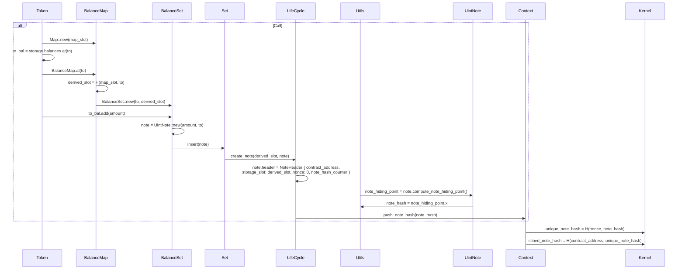
```mermaid
sequenceDiagram
    alt Call
    Token->>BalanceMap: Map::new(map_slot);
    Token->>Token: to_bal = storage.balances.at(to)
    Token->>BalanceMap: BalanceMap.at(to)
    BalanceMap->>BalanceMap: derived_slot = H(map_slot, to)
    BalanceMap->>BalanceSet: BalanceSet::new(to, derived_slot)
    Token->>BalanceSet: to_bal.add(amount)
    BalanceSet->>BalanceSet: note = UintNote::new(amount, to)
    BalanceSet->>Set: insert(note)
    Set->>LifeCycle: create_note(derived_slot, note)
    LifeCycle->>LifeCycle: note.header = NoteHeader { contract_address, <br> storage_slot: derived_slot, nonce: 0, note_hash_counter }
    Utils->>UintNote: note_hiding_point = note.compute_note_hiding_point()
    UintNote->>Utils: note_hash = note_hiding_point.x
    LifeCycle->>Context: push_note_hash(note_hash)
    end
    Context->>Kernel: unique_note_hash = H(nonce, note_hash)
    Context->>Kernel: siloed_note_hash = H(contract_address, unique_note_hash)
```

Notice the `siloed_note_hash` at the very end. It's a hash that will be inserted into the note hashes tree. To clarify what this really is, we "unroll" the values to their simplest components. This gives us a better idea around what is actually inserted into the tree.

```rust
siloed_note_hash = H(contract_address, unique_note_hash)
siloed_note_hash = H(contract_address, H(nonce, note_hash))
siloed_note_hash = H(contract_address, H(H(tx_hash, note_index_in_tx), note_hash))
siloed_note_hash = H(contract_address, H(H(tx_hash, note_index_in_tx), MSM([G_amt, G_to, G_rand, G_slot], [amount, to, randomness, derived_slot]).x))
```

MSM is a multi scalar multiplication on a grumpkin curve and G_* values are generators.

And `to` is the actor who receives the note, `amount` of the note and `randomness` is the randomness used to make the note hiding. Without the `randomness` the note could just as well be plaintext (computational cost of a preimage attack would be trivial in such a case).

:::info
Beware that this hash computation is what the aztec.nr library is doing, and not strictly required by the network (only the kernel computation is).
:::

With this note structure, the contract can require that only notes sitting at specific storage slots can be used by specific operations, e.g., if transferring funds from `from` to `to`, the notes to destroy should be linked to `H(map_slot, from)` and the new notes (except the change-note) should be linked to `H(map_slot, to)`.

That way, we can have logical storage slots, without them really existing. This means that knowing the storage slot for a note is not enough to actually figure out what is in there (whereas it would be for looking up public state).
---
title: Common Patterns
sidebar_position: 7
---

There are many common patterns have been devised by the Aztec core engineering team and the work of the external community as we build Aztec.nr contracts internally (see some of them [here (GitHub link)](https://github.com/AztecProtocol/aztec-packages/tree/master/noir-projects/noir-contracts)).

This doc aims to summarize some of them!

Similarly we have discovered some anti-patterns too (like privacy leakage) that we will point out here!

## Common Patterns

### Approving another user/contract to execute an action on your behalf

We call this the "authentication witness" pattern or authwit for short.

- Approve someone in private domain:
  #include_code authwit_to_another_sc /yarn-project/end-to-end/src/e2e_cross_chain_messaging/token_bridge_private.test.ts typescript

Here you approve a contract to burn funds on your behalf.

- Approve in public domain:
  #include_code authwit_public_transfer_example /yarn-project/end-to-end/src/e2e_token_contract/transfer_in_public.test.ts typescript

Here you approve someone to transfer funds publicly on your behalf

### Prevent the same user flow from happening twice using nullifiers

E.g. you don't want a user to subscribe once they have subscribed already. Or you don't want them to vote twice once they have done that. How do you prevent this?

Emit a nullifier in your function. By adding this nullifier into the tree, you prevent another nullifier from being added again. This is also why in authwit, we emit a nullifier, to prevent someone from reusing their approval.

#include_code verify_private_authwit /noir-projects/aztec-nr/authwit/src/account.nr rust

Note be careful to ensure that the nullifier is not deterministic and that no one could do a preimage analysis attack. More in [the anti pattern section on deterministic nullifiers](#deterministic-nullifiers)

Note - you could also create a note and send it to the user. The problem is there is nothing stopping the user from not presenting this note when they next interact with the function.

### Reading public storage in private

You can't read public storage in private domain. But nevertheless reading public storage is desirable. There are two ways to achieve the desired effect:

1. For public values that change infrequently, you can use [shared state](../../../../../reference/developer_references/smart_contract_reference/storage/shared_state.md).

1. You pass the data as a parameter to your private method and later assert in public that the data is correct. E.g.:

```rust
#[storage]
struct Storage {
   token: PublicMutable<Field>,
}

contract Bridge {

    #[private]
    fn burn_token_private(
        token: AztecAddress, // pass token here since this is a private method but can't access public storage
        amount: Field,
    ) -> Field {
        ...
    #include_code call_assert_token_is_same /noir-projects/noir-contracts/contracts/token_bridge_contract/src/main.nr raw
    }
    #include_code assert_token_is_same /noir-projects/noir-contracts/contracts/token_bridge_contract/src/main.nr raw
}
```

:::danger
This leaks information about the private function being called and the data which has been read.
:::

### Writing public storage from private

When calling a private function, you can update public state by calling a public function.

In this situation, try to mark the public function as `internal`. This ensures your flow works as intended and that no one can call the public function without going through the private function first!

### Moving public data into the private domain

See [partial notes](../../../../../aztec/concepts/storage/partial_notes.md). Partial notes are how public balances are transferred to private [in the NFT contract](../../../../../tutorials/codealong/contract_tutorials/nft_contract.md).

### Discovering my notes

When you send someone a note, the note hash gets added to the note hash tree. To spend the note, the receiver needs to get the note itself (the note hash preimage). There are two ways you can get a hold of your notes:

1. When sending someone a note, emit the note contents to the recipient (the function encrypts the log in such a way that only a recipient can decrypt it). PXE then tries to decrypt all the encrypted logs, and stores the successfully decrypted one. [More info here](../how_to_emit_event.md)
2. Manually using `pxe.addNote()` - If you choose to not emit logs to save gas or when creating a note in the public domain and want to consume it in private domain (`encrypt_and_emit_note` shouldn't be called in the public domain because everything is public), like in the previous section where we created a note in public that doesn't have a designated owner.

#include_code pxe_add_note yarn-project/end-to-end/src/composed/e2e_persistence.test.ts typescript

### Revealing encrypted logs conditionally

An encrypted log can contain any information for a recipient, typically in the form of a note. One could think this log is emitted as part of the transaction execution, so it wouldn't be revealed if the transaction fails.

This is not true for Aztec, as the encrypted log is part of the transaction object broadcasted to the network. So if a transaction with an encrypted log and a note commitment is broadcasted, there could be a situation where the transaction is not mined or reorg'd out, so the commitment is never added to the note hash tree, but the recipient could still have read the encrypted log from the transaction in the mempool.

Example:

> Alice and Bob agree to a trade, where Alice sends Bob a passcode to collect funds from a web2 app, in exchange of on-chain tokens. Alice should only send Bob the passcode if the trade is successful. But just sending the passcode as an encrypted log doesn't work, since Bob could see the encrypted log from the transaction as soon as Alice broadcasts it, decrypt it to get the passcode, and withdraw his tokens from the trade to make the transaction fail.

### Randomness in notes

Notes are hashed and stored in the merkle tree. While notes do have a header with a `nonce` field that ensure two exact notes still can be added to the note hash tree (since hashes would be different), preimage analysis can be done to reverse-engineer the contents of the note.

Hence, it's necessary to add a "randomness" field to your note to prevent such attacks.

#include_code address_note_def noir-projects/aztec-nr/address-note/src/address_note.nr rust

### L1 -- L2 interactions

Refer to [Token Portal codealong tutorial on bridging tokens between L1 and L2](../../../../../tutorials/codealong/contract_tutorials/token_bridge/index.md) and/or [Uniswap smart contract example that shows how to swap on L1 using funds on L2](../../../../../tutorials/examples/uniswap/index.md). Both examples show how to:

1. L1 -> L2 message flow
2. L2 -> L1 message flow
3. Cancelling messages from L1 -> L2.
4. For both L1->L2 and L2->L1, how to operate in the private and public domain

### Sending notes to a contract/Escrowing notes between several parties in a contract

To send a note to someone, they need to have a key which we can encrypt the note with. But often contracts may not have a key. And even if they do, how does it make use of it autonomously?

There are several patterns here:

1. Give the contract a key and share it amongst all participants. This leaks privacy, as anyone can see all the notes in the contract.
2. `transfer_to_public` funds into the contract - this is used in the [Uniswap smart contract example where a user sends private funds into a Uniswap Portal contract which eventually withdraws to L1 to swap on L1 Uniswap](../../../../../tutorials/examples/uniswap/index.md). This works like Ethereum - to achieve contract composability, you move funds into the public domain. This way the contract doesn't even need keys.

There are several other designs we are discussing through [in this discourse post](https://discourse.aztec.network/t/how-to-handle-private-escrows-between-two-parties/2440) but they need some changes in the protocol or in our demo contract. If you are interested in this discussion, please participate in the discourse post!

### Share Private Notes

If you have private state that needs to be handled by more than a single user (but no more than a handful), you can add the note commitment to the note hash tree, and then encrypt the note once for each of the users that need to see it. And if any of those users should be able to consume the note, you can generate a random nullifier on creation and store it in the encrypted note, instead of relying on the user secret.

## Anti Patterns

There are mistakes one can make to reduce their privacy set and therefore make it trivial to do analysis and link addresses. Some of them are:

### Passing along your address when calling a public function from private

If you have a private function which calls a public function, remember that sequencer can see any parameters passed to the public function. So try to not pass any parameter that might leak privacy (e.g. `from` address)

PS: when calling from private to public, `msg_sender` is the contract address which is calling the public function.

### Deterministic nullifiers

In the [Prevent the same user flow from happening twice using nullifier](#prevent-the-same-user-flow-from-happening-twice-using-nullifiers), we recommended using nullifiers. But what you put in the nullifier is also as important.

E.g. for a voting contract, if your nullifier simply emits just the `user_address`, then privacy can easily be leaked as nullifiers are deterministic (have no randomness), especially if there are few users of the contract. So you need some kind of randomness. You can add the user's secret key into the nullifier to add randomness. We call this "nullifier secrets" as explained [here](../../../../../aztec/concepts/accounts/keys.md#nullifier-keys). E.g.:

#include_code nullifier /noir-projects/aztec-nr/value-note/src/value_note.nr rust
---
title: Calling Other Functions
sidebar_position: 2
tags: [functions, contracts]
---


A contract is a collection of persistent state variables and functions which may manipulate these variables. 

Functions and state variables within a contract's scope are said to belong to that contract. A contract can only access and modify its own state.

If a contract wishes to access or modify another contract's state, it must make a call to an external function of the other contract. For anything to happen on the Aztec network, an external function of a contract needs to be called.

### Defining a contract

A contract may be declared and given a name using the `contract` keyword (see snippet below). By convention, contracts are named in `PascalCase`.

```rust title="contract keyword"
// highlight-next-line
contract MyContract {

    // Imports 

    // Storage 

    // Functions
}
```
:::info A note for vanilla Noir devs
There is no [`main()` (GitHub link)](https://noir-lang.org/docs/getting_started/project_breakdown/#mainnr) function within a Noir `contract` scope. More than one function can be an entrypoint.
:::

### Add as a dependency in Nargo.toml

Import the contract that you want to call into your `Nargo.toml` under `dependencies` like this:

```
token = { git="https://github.com/AztecProtocol/aztec-packages/", tag="#include_aztec_version", directory="noir-projects/noir-contracts/contracts/token_contract" }
```

### Import into your contract

At the top of your contract, import the contract you want to call like this:

```
use token::Token;
```

### Call the function

To call the function, you need to

- Specify the address of the contract with `Contract::at(contract_address)`
- Call the function name with `.function_name()`
- Pass the parameters into the function call, like `.function_name(param1,param2)`
- Specify the type of call you want to make and pass a mut reference to the context, like `.call(&mut context)` 

#### Private calls

To call a private function, you can just use `call()` like this:

#include_code call_function noir-projects/noir-contracts/contracts/escrow_contract/src/main.nr rust

#### Public -> Public calls

To call a public function from a public function, it is the same as above. You can just use `call()` like this:

#include_code public_to_public_call noir-projects/noir-contracts/contracts/lending_contract/src/main.nr rust

#### Private -> Public calls

To call a public function from private, you will need to enqueue it like this:

#include_code enqueue_public /noir-projects/noir-contracts/contracts/lending_contract/src/main.nr rust

Public functions are always executed after private execution. To learn why, read the [concepts overview](../../../../aztec/concepts_overview.md).

#### Other call types

There are other call types, for example to ensure no state changes are made. You can learn more about them in the [call types glossary](../../../../aztec/glossary/call_types.md). 


---
title: Notes
sidebar_position: 6
tags: [contracts, notes]
---

Notes are the fundamental data structure in Aztec when working with private state. In this section there are guides about how to work with `AddressNote`, `ValueNote`, and custom notes in Aztec.nr. You can learn more about notes in the [concepts section](../../../../../aztec/concepts/storage/state_model/index.md#private-state).---
title: Using Address Note in Aztec.nr
tags: [contracts, notes]
---

Address notes hold one main property of the type `AztecAddress`. It also holds `npk_m_hash` and `randomness`, similar to other note types.

## AddressNote

This is the AddressNote struct:

#include_code address_note_struct noir-projects/aztec-nr/address-note/src/address_note.nr rust

## Importing AddressNote

### In Nargo.toml

```toml
address_note = { git="https://github.com/AztecProtocol/aztec-packages/", tag="#include_aztec_version", directory="noir-projects/aztec-nr/address-note" }
```

### In your contract

#include_code addressnote_import noir-projects/noir-contracts/contracts/escrow_contract/src/main.nr rust

## Working with AddressNote

### Creating a new note 

Creating a new `AddressNote` takes the following args:

- `address` (`AztecAddress`): the address to store in the AddressNote
- `npk_m_hash` (`Field`): the master nullifier public key hash of the user

#include_code addressnote_new noir-projects/noir-contracts/contracts/escrow_contract/src/main.nr rust

In this example, `owner` is the `address` and the `npk_m_hash` of the donor was computed earlier.

## Learn more

- [Keys, including nullifier keys and outgoing viewer](../../../../../aztec/concepts/accounts/keys.md)
- [How to write a custom note](./custom_note.md)
- [AddressNote reference](../../../../../reference/developer_references/smart_contract_reference/aztec-nr/address-note/address_note.md)
---
title: Using Value Notes in Aztec.nr
tags: [contracts, notes]
---

ValueNotes hold one main property - a `value` - and have utils useful for manipulating this value, such as incrementing and decrementing it similarly to an integer.

## ValueNote

This is the ValueNote struct:

#include_code value-note-def noir-projects/aztec-nr/value-note/src/value_note.nr rust

## Importing ValueNote

### In Nargo.toml

```toml
value_note = { git="https://github.com/AztecProtocol/aztec-packages/", tag="#include_aztec_version", directory="noir-projects/aztec-nr/value-note" }
```

### In your contract

#include_code import_valuenote noir-projects/noir-contracts/contracts/crowdfunding_contract/src/main.nr rust

## Working with ValueNote

### Creating a new note

Creating a new `ValueNote` takes the following args:

- `value` (`Field`): the value of the ValueNote
- `npk_m_hash` (`Field`): the master nullifier public key hash of the user

#include_code valuenote_new noir-projects/noir-contracts/contracts/crowdfunding_contract/src/main.nr rust

In this example, `amount` is the `value` and the `npk_m_hash` of the donor was computed earlier.

### Getting a balance

A user may have multiple notes in a set that all refer to the same content (e.g. a set of notes representing a single token balance). By using the `ValueNote` type to represent token balances, you do not have to manually add each of these notes and can instead use a helper function `get_balance()`.

It takes one argument - the set of notes.

#include_code get_balance noir-projects/noir-contracts/contracts/stateful_test_contract/src/main.nr rust

This can only be used in an unconstrained function.

### Incrementing and decrementing

Both `increment` and `decrement` functions take the same args:

#include_code increment_args noir-projects/aztec-nr/value-note/src/utils.nr rust

Note that this will create a new note in the set of notes passed as the first argument.
For example:
#include_code increment_valuenote noir-projects/noir-contracts/contracts/benchmarking_contract/src/main.nr rust

The `decrement` function works similarly except the `amount` is the number that the value will be decremented by, and it will fail if the sum of the selected notes is less than the amount.

## Learn more

- [Keys, including nullifier keys and outgoing viewer](../../../../../aztec/concepts/accounts/keys.md)
- [How to write a custom note](./custom_note.md)
- [ValueNote reference](../../../../../reference/developer_references/smart_contract_reference/aztec-nr/value-note/value_note.md)
---
title: Using custom note types in Aztec.nr
tags: [contracts, notes]
keywords: [custom note, note]
---

It may be useful to write a custom note type if you want to use a specific type of private data or struct that does not have a default implementation in Aztec.nr. If you create a note that uses a custom note type, you are able to nullify that note with one nullifier. This is more secure and less expensive than using multiple separate notes.

As an example, if you are developing a card game, you may want to store multiple pieces of data in each card. Rather than storing each of these pieces of data in their own note, you can use a custom note to define the card, and then nullify (or exchange ownership of) the card when it has been used. 

If you want to work with values or addresses, you can check out [ValueNote](./value_note.md) or [AddressNote](./address_note.md). 

## Define a custom note type

You will likely want to define your note in a new file and import it into your contract.

A custom note type can be defined with the macro `#[note]` used on a struct:

#include_code state_vars-CardNote noir-projects/noir-contracts/contracts/docs_example_contract/src/types/card_note.nr rust

In this example, we are implementing a card note that holds a number of `points` as `u8`.

`randomness` is not enforced by the protocol and should be implemented by the application developer. If you do not include `randomness`, and the note preimage can be guessed by an attacker, it makes the note vulnerable to preimage attacks. 

`npk_m_hash` is `nullifier public key, master, hash` which is the hash of the nullifier key owned by the user. It ensures that when the note is spent, only the owner of the `npk_m` can spend it.

## Implement NoteInterface

You will need to implement a note interface for your note. Most of this is automatically generated by the `#[note]` macro but can be overwritten. For your reference, this is what a note interface looks like:

#include_code note_interface noir-projects/aztec-nr/aztec/src/note/note_interface.nr rust

You will need to implement the functions `compute_nullifier(...)` and `compute_nullifier_without_context()` which tells Aztec how to compute nullifiers for your note.

#include_code note_interface noir-projects/noir-contracts/contracts/docs_example_contract/src/types/card_note.nr rust
 
In this example, these functions compute the note hash by using `compute_note_hash_for_nullify` and then generate a nullifier by hashing this note hash together with a secret.

### Methods

You will likely want to implement methods in order to use your note easily within contracts. For example, this may be what a `new` method can look like, for creating a new note:

#include_code cardnote_impl noir-projects/noir-contracts/contracts/docs_example_contract/src/types/card_note.nr rust

If you are also planning to be able to access the data with a note in public state, you will need to implement a method for serializing the note. This might look something like this:

#include_code serialize noir-projects/noir-contracts/contracts/docs_example_contract/src/types/card_note.nr rust

## Further reading

- [What is `#[note]` actually doing? + functions such as serialize() and deserialize()](../../../../../aztec/smart_contracts/functions//attributes.md#custom-notes-note)
- [Macros reference](../../../../../reference/developer_references/smart_contract_reference/macros.md)
- [Keys, including npk_m_hash (nullifier public key master)](../../../../../aztec/concepts/accounts/keys.md)
---
title: Defining Initializer Functions
sidebar_position: 1
tags: [functions, contracts]
---

This page explains how to write an initializer function, also known as a constructor.

Initializers are regular functions that set an "initialized" flag (a nullifier) for the contract. A contract can only be initialized once, and contract functions can only be called after the contract has been initialized, much like a constructor. However, if a contract defines no initializers, it can be called at any time. Additionally, you can define as many initializer functions in a contract as you want, both private and public.

## Annotate with `#[initializer]`

Define your initializer like so:

```rust
#[initializer]
fn constructor(){
    // function logic here
}
```

## Public or private

Aztec supports both public and private initializers. Use the appropriate macro, for example for a private initializer:

```rust
#[private]
#[initializer]
fn constructor(){
    // function logic here
}
```

## Initializer with logic

Initializers are commonly used to set an admin, such as this example:

#include_code constructor /noir-projects/noir-contracts/contracts/token_contract/src/main.nr rust

Here, the initializer is writing to storage. It can also call another function. Learn more about calling functions from functions [here](./call_functions.md).

## Multiple initializers

You can set multiple functions as an initializer function simply by annotating each of them with `#[initializer]`. You can then decide which one to call when you are deploying the contract.

Calling any one of the functions annotated with `#[initializer]` will mark the contract as initialized.

To see an initializer in action, follow the [Counter codealong tutorial](../../../../tutorials/codealong/contract_tutorials/counter_contract.md).
---
title: Authentication Witness
description: Developer Documentation to use Authentication Witness for authentication actions on Aztec.
tags: [accounts, authwit]
---

This page introduces the authwit library and how you can use it in your Aztec.nr smart contracts. [Skip to the usage](#usage).

For a guide on using authwit in Aztec.js, [read this](../../js_apps/authwit.md).

## Prerequisite reading

- [Authwit](../../../../aztec/concepts/accounts/authwit.md)

## Introduction

Authentication Witness (authwit) is a scheme for authentication actions on Aztec, so users can allow third-parties (eg other contracts) to execute an action on their behalf. Authwits can only authorize actions for contracts that your account is calling, they cannot be used to permit other users to take actions on your behalf.

How it works logically is explained in the [concepts](../../../../aztec/concepts/accounts/authwit.md) but we will do a short recap here.

An authentication witness is defined for a specific action, such as allowing a Defi protocol to transfer funds on behalf of the user. An action is here something that could be explained as `A is allowed to perform X operation on behalf of B` and we define it as a hash computed as such:

```rust
authentication_witness_action = H(
    caller: AztecAddress,
    contract: AztecAddress,
    selector: Field,
    argsHash: Field
);

// Example action that authenticates:
// defi contract to transfer 1000 tokens to itself on behalf of alice_account
authentication_witness_action = H(
  defi,
  token,
  transfer_selector,
  H(alice_account, defi, 1000)
);
```

Given the action, the developer can ask the `on_behalf_of` account contract if the action is authenticated or not.

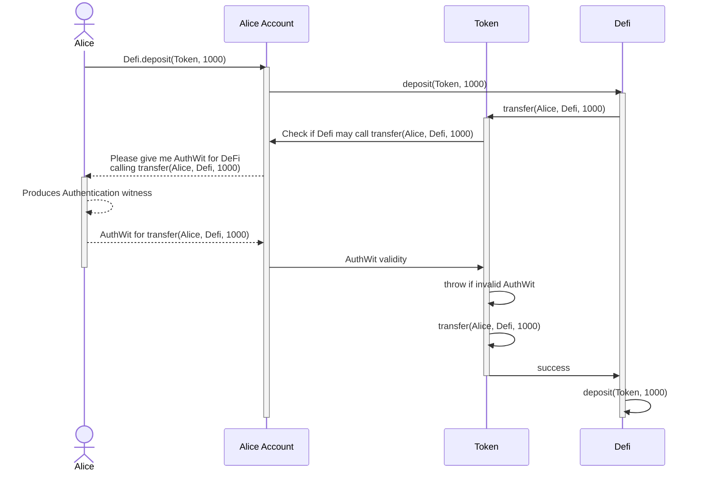
```mermaid
sequenceDiagram
    actor Alice
    participant AC as Alice Account
    participant Token
    Alice->>AC: Defi.deposit(Token, 1000);
    activate AC
    AC->>Defi: deposit(Token, 1000);
    activate Defi
    Defi->>Token: transfer(Alice, Defi, 1000);
    activate Token
    Token->>AC: Check if Defi may call transfer(Alice, Defi, 1000);
    AC-->>Alice: Please give me AuthWit for DeFi<br/> calling transfer(Alice, Defi, 1000);
    activate Alice
    Alice-->>Alice: Produces Authentication witness
    Alice-->>AC: AuthWit for transfer(Alice, Defi, 1000);
    AC->>Token: AuthWit validity
    deactivate Alice
    Token->>Token: throw if invalid AuthWit
    Token->>Token: transfer(Alice, Defi, 1000);
    Token->>Defi: success
    deactivate Token
    Defi->>Defi: deposit(Token, 1000);
    deactivate Defi
    deactivate AC
```

:::info
Note in particular that the request for a witness is done by the token contract, and the user will have to provide it to the contract before it can continue execution. Since the request is made all the way into the contract where it is to be used, we don't need to pass it along as an extra input to the functions before it which gives us a cleaner interface.
:::

As part of `AuthWit` we are assuming that the `on_behalf_of` implements the private function:

```rust
#[private]
fn verify_private_authwit(inner_hash: Field) -> Field;
```

For public authwit, we have a shared registry that is used, there we are using a `consume` function.

Both return the value `0xabf64ad4` (`IS_VALID` selector) for a successful authentication, and `0x00000000` for a failed authentication. You might be wondering why we are expecting the return value to be a selector instead of a boolean. This is mainly to account for a case of selector collisions where the same selector is used for different functions, and we don't want an account to mistakenly allow a different function to be called on its behalf - it is hard to return the selector by mistake, but you might have other functions returning a bool.

## The `AuthWit` library.

As part of Aztec.nr, we are providing a library that can be used to implement authentication witness for your contracts.

This library also provides a basis for account implementations such that these can more easily implement authentication witness.

For our purposes here (not building a wallet), the most important part of the library is the `auth` utility which exposes a couple of helper methods for computing the action hash, retrieving witnesses, validating them and emitting the nullifier.

### General utilities

The primary general utility is the `compute_authwit_message_hash_from_call` function which computes the action hash from its components. This is useful for when you need to generate a hash that is not for the current call, such as when you want to update a public approval state value that is later used for [authentication in public](#updating-approval-state-in-noir). You can view the implementation of this function [here (GitHub link)](https://github.com/AztecProtocol/aztec-packages/blob/master/noir-projects/aztec-nr/authwit/src/auth.nr).

#### TypeScript utilities

To make it convenient to compute the message hashes in TypeScript, the `aztec.js` package includes a `computeAuthWitMessageHash` function that you can use. Implementation [here (GitHub link)](https://github.com/AztecProtocol/aztec-packages/blob/master/yarn-project/aztec.js/src/utils/authwit.ts).

### Utilities for private calls

For private calls where we allow execution on behalf of others, we generally want to check if the current call is authenticated by `on_behalf_of`. To easily do so, we can use the `assert_current_call_valid_authwit` which fetches information from the current context without us needing to provide much beyond the `on_behalf_of`.

This function will then make a call to `on_behalf_of` to execute the `verify_private_authwit` function which validates that the call is authenticated.
The `on_behalf_of` should assert that we are indeed authenticated and then return the `IS_VALID` selector. If the return value is not as expected, we throw an error. This is to cover the case where the `on_behalf_of` might implemented some function with the same selector as the `verify_private_authwit` that could be used to authenticate unintentionally.

#### Example

#include_code assert_current_call_valid_authwit /noir-projects/noir-contracts/contracts/token_contract/src/main.nr rust

### Utilities for public calls

Very similar to the above, we have variations that work in the public domain (`assert_current_call_valid_authwit_public`). These functions are wrapped to give a similar flow for both cases, but behind the scenes the logic is slightly different since the public goes to the auth registry, while the private flow calls the account contract.

#### Example

#include_code assert_current_call_valid_authwit_public /noir-projects/noir-contracts/contracts/token_contract/src/main.nr rust

## Usage

Ok, enough talking, how do we use this?

### Importing it

To add it to your project, add the `authwit` library to your `Nargo.toml` file.

```toml
[dependencies]
aztec = { git="https://github.com/AztecProtocol/aztec-packages/", tag="#include_aztec_version", directory="noir-projects/aztec-nr/aztec" }
authwit = { git="https://github.com/AztecProtocol/aztec-packages/", tag="#include_aztec_version", directory="noir-projects/aztec-nr/authwit"}
```

Then you will be able to import it into your contracts as follows.

#include_code import_authwit /noir-projects/noir-contracts/contracts/token_contract/src/main.nr rust

### Private Functions

#### Checking if the current call is authenticated

Based on the diagram earlier on this page let's take a look at how we can implement the `transfer` function such that it checks if the tokens are to be transferred `from` the caller or needs to be authenticated with an authentication witness.

#include_code transfer_in_private /noir-projects/noir-contracts/contracts/token_contract/src/main.nr rust

The first thing we see in the snippet above, is that if `from` is not the call we are calling the `assert_current_call_valid_authwit` function from [earlier](#private-functions). If the call is not throwing, we are all good and can continue with the transfer.

In the snippet we are constraining the `else` case such that only `nonce = 0` is supported. This is not strictly necessary, but because I can't stand dangling useless values. By making it constrained, we can limit what people guess it does, I hope.

#### Authenticating an action in TypeScript

Cool, so we have a function that checks if the current call is authenticated, but how do we actually authenticate it? Well, assuming that we use a wallet that is following the spec, we import `computeAuthWitMessageHash` from `aztec.js` to help us compute the hash, and then we simply `addAuthWitness` to the wallet. Behind the scenes this will make the witness available to the oracle.

#include_code authwit_transfer_example /yarn-project/end-to-end/src/e2e_token_contract/transfer_in_private.test.ts typescript

Learn more about authwits in Aztec.js by [following this guide](../../js_apps/authwit.md).

### Public Functions

With private functions covered, how can we use this in a public function? Well, the answer is that we simply change one name of a function and then we are good to go :eyes: (almost).

#### Checking if the current call is authenticated

#include_code transfer_in_public /noir-projects/noir-contracts/contracts/token_contract/src/main.nr rust

#### Authenticating an action in TypeScript

Authenticating an action in the public domain is slightly different from the private domain, since we are executing a function on the auth registry contract to add the witness flag. As you might recall, this was to ensure that we don't need to call into the account contract from public, which is a potential DOS vector.

In the snippet below, this is done as a separate contract call, but can also be done as part of a batch as mentioned in the [Accounts concepts](../../../../aztec/concepts/accounts/authwit.md#what-about-public).

#include_code authwit_public_transfer_example /yarn-project/end-to-end/src/e2e_token_contract/transfer_in_public.test.ts typescript

#### Updating approval state in Noir

We have cases where we need a non-wallet contract to approve an action to be executed by another contract. One of the cases could be when making more complex defi where funds are passed along. When doing so, we need the intermediate contracts to support approving of actions on their behalf.

This is fairly straight forward to do using the `auth` library which includes logic for updating values in the public auth registry. Namely, you can prepare the `message_hash` using `compute_authwit_message_hash_from_call` and then simply feed it into the `set_authorized` function (both are in `auth` library) to update the value.

When another contract later is consuming the authwit using `assert_current_call_valid_authwit_public` it will be calling the registry, and spend that authwit.

An example of this would be our Uniswap example which performs a cross chain swap on L1. In here, we both do private and public auth witnesses, where the public is set by the uniswap L2 contract itself. In the below snippet, you can see that we compute the action hash and update the value in the registry. When we then call the `token_bridge` to execute afterwards, it reads this value, burns the tokens, and consumes the authentication.

#include_code authwit_uniswap_set /noir-projects/noir-contracts/contracts/uniswap_contract/src/main.nr rust

Outlining more of the `swap` flow: this simplified diagram shows how it will look for contracts that are not wallets but also need to support authentication witnesses.

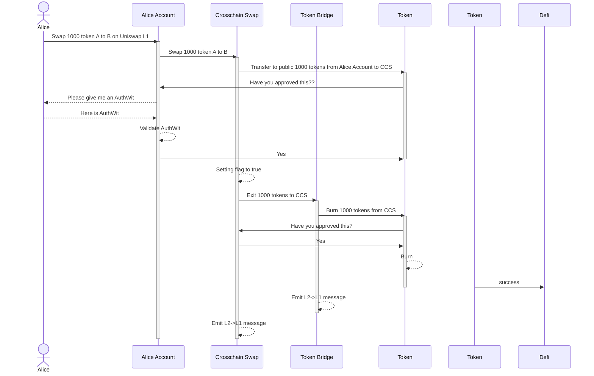
```mermaid
sequenceDiagram
    actor A as Alice
    participant AC as Alice Account
    participant CC as Crosschain Swap
    participant TB as Token Bridge
    participant T as Token

    A->>AC: Swap 1000 token A to B on Uniswap L1
    activate AC;
    AC->>CC: Swap 1000 token A to B
    activate CC;
    CC->>T: Transfer to public 1000 tokens from Alice Account to CCS
    activate T;
    T->>AC: Have you approved this??
    AC-->>A: Please give me an AuthWit
    A-->>AC: Here is AuthWit
    AC-->>AC: Validate AuthWit
    AC->>T: Yes
    deactivate T;
    CC-->>CC: Setting flag to true
    CC->>TB: Exit 1000 tokens to CCS
    activate TB;
    TB->>T: Burn 1000 tokens from CCS
    activate T;
    T->>CC: Have you approved this?
    CC->>T: Yes
    T-->>T: Burn
    Token->>Defi: success
    deactivate T;
    TB-->>TB: Emit L2->L1 message
    deactivate TB;
    CC-->>CC: Emit L2->L1 message
    deactivate CC;
    deactivate AC;
```

:::info **TODO**
Add a link to the blog-posts.
:::
---
title: Using the Archive Tree
sidebar_position: 4
tags: [contracts]
---

The Aztec Protocol uses an append-only Merkle tree to store hashes of the headers of all previous blocks in the chain as its leaves. This is known as the Archive tree. You can learn more about how it works in the [concepts section](../../../../aztec/concepts/storage/trees/index.md).

This page is a quick introductory guide to creating historical proofs proofs from the archive tree.

For a reference, go [here](../../../../reference/developer_references/smart_contract_reference/aztec-nr/aztec/history/contract_inclusion.md).

## Inclusion and non-inclusion proofs

Inclusion and non-inclusion proofs refer to proving the inclusion (or absence) of a specific piece of information within a specific Aztec block with a block header. You can prove any of the following at a given block height before the current height:

- Note inclusion
- Nullifier inclusion
- Note validity
- Existence of public value
- Contract inclusion

Using this library, you can check that specific notes or nullifiers were part of Aztec network state at specific blocks. This can be useful for things such as:

- Verifying a minimum timestamp from a private context
- Checking eligibility based on historical events (e.g. for an airdrop by proving that you knew the nullifier key for a note)
- Verifying historic ownership / relinquishing of assets
- Proving existence of a value in public data tree at a given contract slot
- Proving that a contract was deployed in a given block with some parameters

**In this guide you will learn how to**

- Prove a note was included in a specified block
- Create a nullifier and prove it was not included in a specified block

## Create a note to prove inclusion of

In general you will likely have the note you want to prove inclusion of. But if you are just experimenting you can create a note with a function like below:

#include_code create_note noir-projects/noir-contracts/contracts/inclusion_proofs_contract/src/main.nr rust

## Get the note from the PXE

Retrieve the note from the user's PXE.

#include_code get_note_from_pxe noir-projects/noir-contracts/contracts/inclusion_proofs_contract/src/main.nr rust

In this example, the user's notes are stored in a map called `private_values`. We retrieve this map, then select 1 note from it with the value of `1`.

## Prove that a note was included in a specified block

To prove that a note existed in a specified block, call `prove_note_inclusion` on the `header` as shown in this example:

#include_code prove_note_inclusion noir-projects/noir-contracts/contracts/inclusion_proofs_contract/src/main.nr rust

Here, if `block_number` exists as an argument, it will prove inclusion in that block. Else, it will use the current block.

This will only prove the note existed at the specific block number, not whether or not the note has been nullified. You can prove that a note existed and had not been nullified in a specified block by using `prove_note_validity` on the block header which takes the following arguments:

#include_code prove_note_validity noir-projects/noir-contracts/contracts/inclusion_proofs_contract/src/main.nr rust

## Create a nullifier to prove inclusion of

You can easily nullify a note like so:

#include_code nullify_note noir-projects/noir-contracts/contracts/inclusion_proofs_contract/src/main.nr rust

This function gets a note from the PXE and nullifies it with `remove()`.

You can then compute this nullifier with `note.compute_nullifier(&mut context)`.

## Prove that a nullifier was included in a specified block

Call `prove_nullifier_inclusion` on a block header like so:

#include_code prove_nullifier_inclusion noir-projects/noir-contracts/contracts/inclusion_proofs_contract/src/main.nr rust

It takes the nullifier as an argument.

You can also prove that a note was not nullified in a specified block by using `prove_note_not_nullified` which takes the note and a reference to the private context.

## Prove contract inclusion, public value inclusion, and use current state in lookups

To see what else you can do with historical proofs, check out the [reference](../../../../reference/developer_references/smart_contract_reference/aztec-nr/aztec/history/contract_inclusion.md)
---
title: Communicating with L1
tags: [contracts, portals]
---

Follow the [token bridge tutorial](../../../../../tutorials/codealong/contract_tutorials/token_bridge/index.md) for hands-on experience writing and deploying a Portal contract.

## Passing data to the rollup

Whether it is tokens or other information being passed to the rollup, the portal should use the `Inbox` to do it.

The `Inbox` can be seen as a mailbox to the rollup, portals put messages into the box, and the sequencer then consumes a batch of messages from the box and include it in their blocks.

When sending messages, we need to specify quite a bit of information beyond just the content that we are sharing. Namely we need to specify:

| Name        | Type                | Description                                                                                                                                                                                                                                                                                                                                                                                                                   |
| ----------- | ------------------- | ----------------------------------------------------------------------------------------------------------------------------------------------------------------------------------------------------------------------------------------------------------------------------------------------------------------------------------------------------------------------------------------------------------------------------- |
| Recipient   | `L2Actor`           | The message recipient. This **MUST** match the rollup version and an Aztec contract that is **attached** to the contract making this call. If the recipient is not attached to the caller, the message cannot be consumed by it.                                                                                                                                                                                              |
| Secret Hash | `field` (~254 bits) | A hash of a secret that is used when consuming the message on L2. Keep this preimage a secret to make the consumption private. To consume the message the caller must know the pre-image (the value that was hashed) - so make sure your app keeps track of the pre-images! Use `computeSecretHash` to compute it from a secret.                                                                                              |
| Content     | `field` (~254 bits) | The content of the message. This is the data that will be passed to the recipient. The content is limited to be a single field. If the content is small enough it can just be passed along, otherwise it should be hashed and the hash passed along (you can use our [`Hash` (GitHub link)](https://github.com/AztecProtocol/aztec-packages/blob/master/l1-contracts/src/core/libraries/Hash.sol) utilities with `sha256ToField` functions) |

With all that information at hand, we can call the `sendL2Message` function on the Inbox. The function will return a `field` (inside `bytes32`) that is the hash of the message. This hash can be used as an identifier to spot when your message has been included in a rollup block.

#include_code send_l1_to_l2_message l1-contracts/src/core/interfaces/messagebridge/IInbox.sol solidity

A sequencer will consume the message batch your message was included in and include it in their block.
Upon inclusion, it is made available to be consumed on L2 via the L2 outbox.

To consume the message, we can use the `consume_l1_to_l2_message` function within the `context` struct.

- The `msg_key` is the hash of the message returned by the `sendL2Message` call and is used to help the RPC find the correct message.
- The `content` is the content of the message, limited to one Field element. For content larger than one Field, we suggest using the `sha256` hash function truncated to a single Field element. `sha256` is suggested as it is cheap on L1 while still being manageable on L2.
- The `secret` is the pre-image hashed using Pedersen to compute the `secretHash`.
- If the `content` or `secret` does not match the entry at `msg_key` the message will not be consumed, and the transaction will revert.

:::info
Note that while the `secret` and the `content` are both hashed, they are actually hashed with different hash functions!
:::

#include_code context_consume_l1_to_l2_message /noir-projects/aztec-nr/aztec/src/context/private_context.nr rust

### Token bridge example

Computing the `content` must currently be done manually, as we are still adding a number of bytes utilities. A good example exists within the [Token bridge example (codealong tutorial)](../../../../../tutorials/codealong/contract_tutorials/token_bridge/index.md).

#include_code claim_public /noir-projects/noir-contracts/contracts/token_bridge_contract/src/main.nr rust

:::info
The `content_hash` is a sha256 truncated to a field element (~ 254 bits). In Aztec.nr, you can use our `sha256_to_field()` to do a sha256 hash which fits in one field element
:::

### Token portal hash library

#include_code mint_to_public_content_hash_nr /noir-projects/noir-contracts/contracts/token_portal_content_hash_lib/src/lib.nr rust

### Token Portal contract

In Solidity, you can use our `Hash.sha256ToField()` method:

#include_code content_hash_sol_import l1-contracts/test/portals/TokenPortal.sol solidity

#include_code deposit_public l1-contracts/test/portals/TokenPortal.sol solidity

The `secret_hash` uses the pederson hash which fits in a field element. You can use the utility method `computeSecretHash()`in `@aztec/aztec.js` npm package to generate a secret and its corresponding hash.

After the transaction has been mined, the message is consumed, a nullifier is emitted and the tokens have been minted on Aztec and are ready for claiming.

Since the message consumption is emitting a nullifier, the same message cannot be consumed again. The index in the message tree is used as part of the nullifier computation, ensuring that the same content and secret being inserted will be distinct messages that can each be consumed. Without the index in the nullifier, it would be possible to perform a kind of attack known as `Faerie Gold` attacks where two seemingly good messages are inserted, but only one of them can be consumed later.

## Passing data to L1

To pass data to L1, we use the `Outbox`. The `Outbox` is the mailbox for L2 to L1 messages. This is the location on L1 where all the messages from L2 will live, and where they can be consumed from.

:::danger

Similarly to messages going to L2 from L1, a message can only be consumed by the specified recipient. But it is up to the portal contract to ensure that the sender is as expected! Any L2 contract can send a message to a portal contract on L1, but the portal contract should only consume messages from the expected sender.

:::

The portal must ensure that the sender is as expected. One flexible solution is to have an `initialize` function in the portal contract which can be used to set the address of the Aztec contract. In this model, the portal contract can check that the sender matches the value it has in storage.

To send a message to L1 from your Aztec contract, you must use the `message_portal` function on the `context`. When messaging to L1, only the `content` is required (as a `Field`).

#include_code context_message_portal /noir-projects/aztec-nr/aztec/src/context/private_context.nr rust

When sending a message from L2 to L1 we don't need to pass in a secret.

:::danger
Access control on the L1 portal contract is essential to prevent consumption of messages sent from the wrong L2 contract.
:::

### Token bridge

As earlier, we can use a token bridge as an example. In this case, we are burning tokens on L2 and sending a message to the portal to free them on L1.

#include_code exit_to_l1_private noir-projects/noir-contracts/contracts/token_bridge_contract/src/main.nr rust

When the transaction is included in a rollup block and published to Ethereum the message will be inserted into the `Outbox` on Ethereum, where the recipient portal can consume it from. When consuming, the `msg.sender` must match the `recipient` meaning that only portal can actually consume the message.

#include_code l2_to_l1_msg l1-contracts/src/core/libraries/DataStructures.sol solidity

#### Outbox `consume`

#include_code outbox_consume l1-contracts/src/core/interfaces/messagebridge/IOutbox.sol solidity

#### Withdraw

As noted earlier, the portal contract should check that the sender is as expected. In the example below, we support only one sender contract (stored in `l2TokenAddress`) so we can just pass it as the sender, that way we will only be able to consume messages from that contract.

It is possible to support multiple senders from L2. You could use a have `mapping(address => bool) allowed` and check that `allowed[msg.sender]` is `true`.

#include_code token_portal_withdraw l1-contracts/test/portals/TokenPortal.sol solidity

## Considerations

### Structure of messages

Application developers should consider creating messages that follow a function call structure e.g., using a function signature and arguments. This will make it easier to prevent producing messages that could be misinterpreted by the recipient.

An example of a bad format would be using `amount, token_address, recipient_address` as the message for a withdraw function and `amount, token_address, on_behalf_of_address` for a deposit function. Any deposit could then also be mapped to a withdraw or vice versa.

```solidity
// Don't to this!
bytes memory message = abi.encode(
  _amount,
  _token,
  _to
);

// Do this!
bytes memory message abi.encodeWithSignature(
  "withdraw(uint256,address,address)",
  _amount,
  _token,
  _to
);
```

### Error Handling

Handling error when moving cross chain can quickly get tricky. Since the L1 and L2 calls are async and independent of each other, the L1 part of a deposit might execute just fine, with the L2 part failing. If this is not handled well, the funds may be lost forever! Developers should consider ways their application can fail cross chain, and handle all cases explicitly.

First, entries in the outboxes **SHOULD** only be consumed if the execution is successful. For an L2 -> L1 call, the L1 execution can revert the transaction completely if anything fails. As the tx is atomic, the failure also reverts consumption.

If it is possible to enter a state where the second part of the execution fails forever, the application builder should consider including additional failure mechanisms (for token withdraws this could be depositing them again etc).

Generally it is good practice to keep cross-chain calls simple to avoid too many edge cases and state reversions.

:::info
Error handling for cross chain messages is handled by the application contract and not the protocol. The protocol only delivers the messages, it does not ensure that they are executed successfully.
:::

### Designated caller

Designating a caller grants the ability to specify who should be able to call a function that consumes a message. This is useful for ordering of batched messages.

When performing multiple cross-chain calls in one action it is important to consider the order of the calls. Say for example, that you want to perform a uniswap trade on L1. You would withdraw funds from the rollup, swap them on L1, and then deposit the swapped funds back into the rollup. This is a straightforward process, but it requires that the calls are done in the correct order (e.g. if the swap is called before the funds are withdrawn, the swap will fail).

The message boxes (Inbox and Outbox) will only allow the recipient portal to consume the message, and we can use this to ensure that the calls are done in the correct order. Say that we include a designated "caller" in the messages, and that the portal contract checks that the caller matches the designated caller or designated as `address(0)` (if anyone can call). When the messages are to be consumed on L1, it can compute the message as seen below:

```solidity
bytes memory message = abi.encodeWithSignature(
  "withdraw(uint256,address,address)",
  _amount,
  _to,
  _withCaller ? msg.sender : address(0)
);
```

This way, the message can be consumed by the portal contract, but only if the caller is the specified caller. In the logic of the contract that is the designated caller, we can ensure that the calls are done in the correct order.

For example, we could require that the Uniswap portal is the caller of the withdrawal, and ensure that the uniswap portal contract implementation is executing the withdrawal before the swap.
The order of execution can be specified in the contract. Since all of the messages are emitted to L1 in the same transaction, we can leverage transaction atomicity to ensure success of failure of all messages.

Note, that crossing the L1/L2 chasm is asynchronous, so there could be a situation where the user has burned their assets on L2 but the swap fails on L1! This could be due to major price movements for example. In such a case, the user could be stuck with funds on L1 that they cannot get back to L2 unless the portal contract implements a way to properly handle such errors.

:::caution
Designated callers are enforced at the contract level for contracts that are not the rollup itself, and should not be trusted to implement the contract correctly. The user should always be aware that it is possible for the developer to implement something that looks like designated caller without providing the abilities to the user.
:::

## Examples of portals

- Token bridge (Portal contract built for L1 -> L2, i.e., a non-native L2 asset)
  - [Portal contract (GitHub link)](https://github.com/AztecProtocol/aztec-packages/blob/master/l1-contracts/test/portals/TokenPortal.sol)
  - [Aztec contract (GitHub link)](https://github.com/AztecProtocol/aztec-packages/blob/master/noir-projects/noir-contracts/contracts/token_bridge_contract/src/main.nr)
---
title: Portals
sidebar_position: 7
---

A portal is a point of contact between L1 and a contract on Aztec. For applications such as token bridges, this is the point where the tokens are held on L1 while used in L2. Note, that a portal doesn't actually need to be a contract, it could be any address on L1.
---
title: Emitting Events
sidebar_position: 3
tags: [contracts]
---

Events in Aztec work similarly to Ethereum events in the sense that they are a way for contracts to communicate with the outside world.
They are emitted by contracts and stored inside each instance of an AztecNode.

:::info
Aztec events are currently represented as raw data and are not ABI encoded.
ABI encoded events are a feature that will be added in the future.
:::

Unlike on Ethereum, there are 2 types of events supported by Aztec: [encrypted](#encrypted-events) and [unencrypted](#unencrypted-events).

## Encrypted Events

### Call emit

To emit encrypted logs you can import the `encode_and_encrypt` or `encode_and_encrypt_with_keys` functions and pass them into the `emit` function after inserting a note. An example can be seen in the reference token contract's transfer function:

#include_code encrypted /noir-projects/noir-contracts/contracts/token_contract/src/main.nr rust

Furthermore, if not emitting the note, one should explicitly `discard` the value returned from the note creation.

### Successfully process the encrypted event

One of the functions of the PXE is constantly loading encrypted logs from the `AztecNode` and decrypting them.
When new encrypted logs are obtained, the PXE will try to decrypt them using the private encryption key of all the accounts registered inside PXE.
If the decryption is successful, the PXE will store the decrypted note inside a database.
If the decryption fails, the specific log will be discarded.

For the PXE to successfully process the decrypted note we need to compute the note's 'note hash' and 'nullifier'.
Aztec.nr enables smart contract developers to design custom notes, meaning developers can also customize how a note's note hash and nullifier should be computed. Because of this customizability, and because there will be a potentially-unlimited number of smart contracts deployed to Aztec, an PXE needs to be 'taught' how to compute the custom note hashes and nullifiers for a particular contract. This is done by a function called `compute_note_hash_and_optionally_a_nullifier`, which is automatically injected into every contract when compiled.

## Unencrypted Events

Unencrypted events are events which can be read by anyone. They can be emitted **only** by public functions.

### Call emit_unencrypted_log

To emit unencrypted logs you don't need to import any library. You call the context method `emit_unencrypted_log`:

#include_code emit_unencrypted /noir-projects/noir-contracts/contracts/test_contract/src/main.nr rust

### Querying the unencrypted event

Once emitted, unencrypted events are stored in AztecNode and can be queried by anyone:

#include_code get_logs /yarn-project/end-to-end/src/fixtures/utils.ts typescript

## Costs

All event data is pushed to Ethereum as calldata by the sequencer and for this reason the cost of emitting an event is non-trivial.

In the Sandbox, an encrypted note has a fixed overhead of 4 field elements (to broadcast an ephemeral public key, a contract address, and a storage slot); plus a variable number of field elements depending on the type of note being emitted.

A `ValueNote`, for example, currently uses 3 fields elements (plus the fixed overhead of 4). That's roughly `7 * 32 = 224` bytes of information.

#include_code value-note-def /noir-projects/aztec-nr/value-note/src/value_note.nr

- There are plans to compress encrypted note data further.
- There are plans to adopt EIP-4844 blobs to reduce the cost of data submission further.
---
title: Using the popCapsule Oracle
sidebar_position: 5
tags: [functions, oracles]
---

`popCapsule` is used for passing artbitrary data. We have not yet included this in Aztec.nr, so it is a bit more complex than the other oracles. You can follow this how-to:

### 1. Define the pop_capsule function

In a new file on the same level as your `main.nr`, implement an unconstrained function that calls the pop_capsule oracle:

#include_code pop_capsule noir-projects/noir-contracts/contracts/contract_class_registerer_contract/src/capsule.nr rust

### 2. Import this into your smart contract

If it lies in the same directory as your smart contract, you can import it like this:

#include_code import_pop_capsule noir-projects/noir-contracts/contracts/contract_class_registerer_contract/src/main.nr rust

### 3. Use it as any other oracle

Now it becomes a regular oracle you can call like this:

#include_code pop_capsule noir-projects/noir-contracts/contracts/contract_class_registerer_contract/src/main.nr rust
---
title: Codespaces
sidebar_position: 1
draft: true
---

If you do not want to run the sandbox locally, or if your machine is unsupported (eg Windows), it is possible to run it within a GitHub Codespace.

[GitHub Codespaces](https://github.com/features/codespaces) are a quick way to develop: they provision a remote machine with all tooling you need for Aztec in just a few minutes. You can use some prebuilt images to make it easier and faster.

Choose a boilerplate and click "create new codespace":

[](https://codespaces.new/AztecProtocol/aztec-packages?devcontainer_path=.devcontainer%2Freact%2Fdevcontainer.json) [](https://codespaces.new/AztecProtocol/aztec-packages?devcontainer_path=.devcontainer%2Fvanilla%2Fdevcontainer.json) [](https://codespaces.new/AztecProtocol/aztec-packages?devcontainer_path=.devcontainer%2Ftoken%2Fdevcontainer.json)

This creates a codespace with a prebuilt image containing one of the "Aztec Boxes" and a development network (sandbox). 
- You can develop directly on the codespace, push it to a repo, make yourself at home.
- You can also just use the sandbox that comes with it. The URL will be logged, you just need to use it as your `PXE_URL`.

You can then start, stop, or see the logs of your sandbox just by calling `sandbox` or `npx aztec-app sandbox`. Run `sandbox -h` for a list of commands.

## More about codespaces

Codespaces are way more powerful than you may initially think. For example, you can connect your local `vscode` to a remote codespace, for a fully contained development environment that doesn't use any of your computer resources!

Visit the [codespaces documentation](https://docs.github.com/en/codespaces/overview) for more specific documentation around codespaces.
---
title: Privacy Considerations
sidebar_position: 5
tags: [protocol, PXE]
---

Privacy is important.

Keeping information private is difficult.

Once information is leaked, it cannot be unleaked.

---

## What can Aztec keep private?

Aztec provides a set of tools to enable developers to build private smart contracts. The following can be kept private:

**Private persistent state**

Store state variables in an encrypted form, so that no one can see what those variables are, except those with the decryption key.

**Private events and messages**

Emit encrypted events, or encrypted messages from a private smart contract function. Only those with the decryption key will learn the message.

**Private function execution**

Execute a private function without the world knowing which function you've executed.

:::danger
Privacy is not guaranteed without care.
Although Aztec provides the tools for private smart contracts, information can still be leaked unless the dapp developer is careful.
This page outlines some best practices to aid dapp developers.
:::

---

## Leaky practices

There are many caveats to the above. Since Aztec also enables interaction with the _public_ world (public L2 functions and L1 functions), private information can be accidentally leaked if developers aren't careful.

### Crossing the private -> public boundary

Any time a private function makes a call to a public function, information is leaked. Now, that might be perfectly fine in some use cases (it's up to the smart contract developer). Indeed, most interesting apps will require some public state. But let's have a look at some leaky patterns:

- Calling a public function from a private function. The public function execution will be publicly visible.
- Calling a public function from a private function, without revealing the `msg_sender` of that call. (Otherwise the `msg_sender` will be publicly visible).
- Passing arguments to a public function from a private function. All of those arguments will be publicly visible.
- Calling an internal public function from a private function. The fact that the call originated from a private function of that same contract will be trivially known.
- Emitting unencrypted events from a private function. The unencrypted event name and arguments will be publicly visible.
- Sending L2->L1 messages from a private function. The entire message, and the resulting L1 function execution will all be publicly visible.

### Crossing the public -> private boundary

If a public function sends a message to be consumed by a private function, the act of consuming that message might be leaked if not following recommended patterns. 

### Timing of transactions

Information about the nature of a transaction can be leaked based on the timing of that transaction.

If a transaction is executed at 8am GMT, it's much less likely to have been made by someone in the USA. 

If there's a spike in transactions on the last day of every month, those might be salaries.

These minor details are information that can disclose much more information about a user than the user might otherwise expect.

Suppose that every time Alice sends Bob a private token, 1 minute later a transaction is always submitted to the tx pool with the same kind of 'fingerprint'. Alice might deduce that these transactions are automated reactions by Bob. (Here, 'fingerprint' is an intentionally vague term. It could be a public function call, or a private tx proof with a particular number of nonzero public inputs, or some other discernible pattern that Alice sees).

TL;DR: app developers should think about the _timing_ of user transactions, and how this might leak information.

### Function Fingerprints and Tx Fingerprints

A 'Function Fingerprint' is any data which is exposed by a function to the outside world. A 'Tx Fingerprint' is any data which is exposed by a tx to the outside world. We're interested in minimizing leakages of information from private txs. The leakiness of a Tx Fingerprint depends on the leakiness of its constituent functions' Function Fingerprints _and_ on the appearance of the tx's Tx Fingerprint as a whole. For a private function (and by extension, for a private tx), the following information _could_ be leaked (depending on the function, of course):

- All calls to public functions.
  - The contract address of the private function (if it calls an internal public function).
    - This could be the address of the transactor themselves, if the calling contract is an account contract.
  - All arguments which are passed to public functions.
- All calls to L1 functions (in the form of L2 -> L1 messages).
  - The contents of L2 -> L1 messages.
- All unencrypted logs (topics and arguments).
- The roots of all trees which have been read from.
- The _number_ of ['side effects'](<https://en.wikipedia.org/wiki/Side_effect_(computer_science)>):
  - \# new note hashes
  - \# new nullifiers
  - \# bytes of encrypted logs
  - \# public function calls
  - \# L2->L1 messages
  - \# nonzero roots[^1]

> Note: many of these were mentioned in the ["Crossing the private -> public boundary"](#crossing-the-private---public-boundary) section.

> Note: the transaction effects submitted to L1 is [encoded (GitHub link)](https://github.com/AztecProtocol/aztec-packages/blob/master/l1-contracts/src/core/libraries/Decoder.sol) but not garbled with other transactions: the distinct Tx Fingerprint of each tx can is publicly visible when a tx is submitted to the L2 tx pool.

#### Standardizing Fingerprints

If each private function were to have a unique Fingerprint, then all private functions would be distinguishable from each-other, and all of the efforts of the Aztec protocol to enable 'private function execution' would have been pointless. Standards need to be developed, to encourage smart contract developers to adhere to a restricted set of Tx Fingerprints. For example, a standard might propose that the number of new note hashes, nullifiers, logs, etc. must always be equal, and must always equal a power of two. Such a standard would effectively group private functions/txs into 'privacy sets', where all functions/txs in a particular 'privacy set' would look indistinguishable from each-other, when executed.

### Data queries

It's not just the broadcasting of transactions to the network that can leak data.

Ethereum has a notion of a 'full node' which keeps-up with the blockchain and stores the full chain state. Many users don't wish to run full nodes, so rely on 3rd-party 'full-node-as-a-service' infrastructure providers, who service blockchain queries from their users.

This pattern is likely to develop in Aztec as well, except there's a problem: privacy. If a privacy-seeking user makes a query to a 3rd-party 'full node', that user might leak data about who they are; about their historical network activity; or about their future intentions. One solution to this problem is "always run a full node", but pragmatically, not everyone will. To protect less-advanced users' privacy, research is underway to explore how a privacy-seeking user may request and receive data from a 3rd-party node without revealing what that data is, nor who is making the request.

App developers should be aware of this avenue for private data leakage. **Whenever an app requests information from a node, the entity running that node is unlikely to be your user!**

#### What kind of queries can be leaky?

##### Querying for up-to-date note sibling paths

To read a private state is to read a note from the note hash tree. To read a note is to prove existence of that note in the note hash tree. And to prove existence is to re-compute the root of the note hash tree using the leaf value, the leaf index, and the sibling path of that leaf. This computed root is then exposed to the world, as a way of saying "This note exists", or more precisely "This note has existed at least since this historical snapshot time".

If an old historical snapshot is used, then that old historical root will be exposed, and this leaks some information about the nature of your transaction: it leaks that your note was created before the snapshot date. It shrinks the 'privacy set' of the transaction to a smaller window of time than the entire history of the network.

So for maximal privacy, it's in a user's best interest to read from the very-latest snapshot of the data tree.

Naturally, the note hash tree is continuously changing as new transactions take place and their new notes are appended. Most notably, the sibling path for every leaf in the tree changes every time a new leaf is appended.

If a user runs their own node, there's no problem: they can query the latest sibling path for their note(s) from their own machine without leaking any information to the outside world.

But if a user is not running their own node, they would need to query the very-latest sibling path of their note(s) from some 3rd-party node. In order to query the sibling path of a leaf, the leaf's index needs to be provided as an argument. Revealing the leaf's index to a 3rd-party trivially reveals exactly the note(s) you're about to read. And since those notes were created in some prior transaction, the 3rd-party will be able to link you with that prior transaction. Suppose then that the 3rd-party also serviced the creator of said prior transaction: the 3rd-party will slowly be able to link more and more transactions, and gain more and more insight into a network which is meant to be private!

We're researching cryptographic ways to enable users to retrieve sibling paths from 3rd-parties without revealing leaf indices.

> \* Note: due to the non-uniformity of Aztec transactions, the 'privacy set' of a transaction might not be the entire set of transactions that came before.

##### Any query

Any query to a node leaks information to that node.

We're researching cryptographic ways to enable users to query any data privately.

---

Footnotes

[^1]: All txs should set the kernel circuit public inputs for all roots to _valid_, _up-to-date_ nonzero values, so as to mask which trees have _actually_ been read from. The Sandbox will eventually automate this (see this [issue (GitHub link)](https://github.com/AztecProtocol/aztec-packages/issues/1676)).
# Pre-Compiled Contracts

import DocCardList from '@theme/DocCardList';

<DocCardList /># Registry

<!-- Review notes:
"Registry" needs an adjective. Public Key Directory? Public Key Registry? Address, Public Key & Precompile Preferences Registry (Pronounced "P(ic)K(u)Pp" Registry)? Key & Precompile Preferences Registry?
-->

The protocol should allow users to express their preferences in terms of encryption & tagging mechanisms, and also provably advertise their encryption & tagging public keys. A canonical registry contract provides an application-level solution to both problems.

## Overview and Usage

At the application level, a canonical singleton contract allows accounts to register their public keys and their preference for encryption & tagging methods. This data is kept in public storage for anyone to check when they need to send a note to an account.

An account can directly call the registry via a public function to set or update their public keys and their encryption & tagging preferences. New accounts should register themselves on deployment. Alternatively, anyone can create an entry for a new account (but not update) if they demonstrate that the public key and encryption & tagging method can be hashed to the new account's address. This allows third party services to register addresses to improve usability.

An app contract can provably read the registry during private execution via a merkle membership proof against a recent public state root, using the [archive tree](../state/archive.md). The rationale for not making a call to the registry to read is to reduce the number of function calls. When reading public state from private-land, apps must set a `max_block_number` for the current transaction to ensure the public state root is not more than `N = max_block_number - current_block_number` blocks old. This means that, if a user rotates their public key, for at most `N` blocks afterwards they may still receive notes encrypted using their old public key, which we consider to be acceptable.

An app contract can also prove that an address is not registered in the registry via a non-inclusion proof, since the public state tree is implemented as an indexed merkle tree. To prevent an app from proving that an address is not registered when in fact it was registered less than N blocks ago, we implement this check as a public function. This means that the transaction may leak that an undisclosed application attempted to interact with a non-registered address but failed.

Note that, if an account is not registered in the registry, a sender could choose to supply the public key along with the preimage of an address on-the-fly <!-- Supply the key and preimage to where? To the registry or to the app circuits? -->, if this preimage was shared with them off-chain. This allows a user to send notes to a recipient before the recipient has deployed their account contract.

## Pseudocode

The registry contract exposes functions for setting public keys and encryption methods, plus a public function for proving non-membership of some address. Reads are meant to be done directly via storage proofs and not via calls to save on proving times. Encryption and tagging preferences are expressed via their associated precompile address.

<!-- We should also provide a function which allows _current_ data to be read from the registry, via a public function. Some app devs might not mind the extra cost. And for a public function which wants to access this information, the cost of a call is tiny. -->
<!-- TODO: explain what precompile_address.VALIDATE_KEYS does (if not already done in the precompiles section), and link to that section -->
<!-- TODO: link to all constants ENCRYPTION_PRECOMPILE_ADDRESS_RANGE, MAX_KEYS_LENGTH, MAX_ENTRIES_PER_ADDRESS -->
<!-- Q: why is there a MAX_KEYS_LENGTH -->
<!-- See a couple of inlined comments in the code snippet below -->
<!-- Should we have functions to update keys / precompile address in isolation? -->
<!-- Might there be cases where a user would wish to specify a different precompile preference (or a different set of keys) for different apps? Perhaps that's too complicated, and the user would need to spawn separate account contracts to cope with such complexity? -->

```rust
contract Registry

    public mapping(address => { keys, precompile_address }) registry

    public fn set(keys, precompile_address)
        this.do_set(msg_sender, keys, precompile_address)

    public fn set_from_preimage(address, keys, precompile_address, ...address_preimage)
        assert address not in registry
        assert hash(keys, precompile_address, ...address_preimage) == address
        // Q: Shouldn't this be `this.do_set(address, keys, precompile_address)`?
        this.set(msg_sender, keys, precompile_address)

    public fn assert_non_membership(address)
        assert address not in registry

    internal public fn do_set(address, keys, precompile_address)
        assert precompile_address in ENCRYPTION_PRECOMPILE_ADDRESS_RANGE
        assert precompile_address.validate_keys(keys)
        assert keys.length < MAX_KEYS_LENGTH
        // Q: Shouldn't this be `registry[address] = ... ?`
        registry[msg_sender] = { keys, precompile_address }
```

## Storage Optimizations

The registry stores a struct for each user, which means that each entry requires multiple storage slots. Reading multiple storage slots requires multiple merkle membership proofs, which increase the total proving cost of any execution that needs access to the registry.

To reduce the number of merkle membership proofs, the registry keeps in storage only the hash of the data stored, and emits the preimage as an unencrypted event. <!-- @spalladino Do we still want to adopt this, given your dislike of using logs to convey public state? --> Nodes are expected to store these preimages, so they can be returned when clients query for the public keys for an address. Clients then prove that the preimage hashes to the commitment stored in the public data tree via a single merkle membership proof.

Note that this optimization may also be included natively into the protocol, [pending this discussion](https://forum.aztec.network/t/storing-data-of-arbitrary-length-in-the-public-data-tree/2669).

## Multiple Recipients per Address

While account contracts that belong to individual users have a clear set of public keys to announce, some private contracts may be shared by a group of users, like in a multisig or an escrow contract. In these scenarios, we want all messages intended for the shared contract to actually be delivered to all participants, using the encryption method selected by each.

This can be achieved by having the registry support multiple sets of keys and precompiles for each entry. Applications can then query the registry and obtain a list of recipients, rather than a single one.

The registry limits multi-recipient registrations to no more than `MAX_ENTRIES_PER_ADDRESS` to prevent abuse, since this puts an additional burden on the sender, who needs to emit the same note multiple times, increasing the cost of their transaction.

Contracts that intend to register multiple recipients should account for those recipients eventually rotating their keys. To support this, contracts should include a method to refresh the registered addresses:

```rust
contract Sample

    private address[] owners

    private fn register()
        let to_register = owners.map(owner => read_registry(owner))
        registry.set(this, to_register)
```

<!-- TODO: Decide whether we want to bake this in. It means a sender may have to pay extra because of a choice by the recipient, since they may be forced to emit multiple notes, which costs calldata. I'm leaning towards not doing it. -->
<!-- Yes, that's a tricky one. It seems unfair to burden a sender with extra gas just because of the entity they're interacting with... -->
<!-- What alternative methods are there for broadcasting private messages to multiple people? -->

## Discussion

See [_Addresses, keys, and sending notes (Dec 2023 edition)_](https://forum.aztec.network/t/addresses-keys-and-sending-notes-dec-2023-edition/2633) for relevant discussions on this topic.
# Unconstrained calls

<!--
TODO: Validate use cases for unconstrained calls. Maybe these are not actually needed?
I wasn't actually aware of these. What's the benefit of doing this vs simply simulating the private function? I suppose the benefit is that an 'external' private function can be called as an unconstrained function by some _constrained_ function? Why not create a duplicate version of the private function, which is unconstrained, and call that instead?
-->
<!-- What about executing public functions as unconstrained? -->

Private function calls can be executed as _unconstrained_. Unconstrained function calls execute the code at the target and return the result, but their execution is not constrained. It is responsibility of the caller to constrain the result, if needed. Unconstrained calls are a generalization of oracle function calls, where the call is not to a PXE function but to another contract. Side effects from unconstrained calls are ignored. Note that all calls executed from an unconstrained call frame will be unconstrained as well.

Unconstrained calls are executed via a `unconstrainedCallPrivateFunction` oracle call, which accepts the same arguments as a regular `callPrivateFunction`, and return the result from the function call. Unconstrained calls are not pushed into the `private_call_stack` and do not incur in an additional kernel iteration.

THe rationale for unconstrained calls is to allows apps to consume results from functions that do not need to be provable. An example use case for unconstrained calls is unconstrained encryption and note tagging, which can be used in applications where constraining such encryption computations isn't necessary, e.g. if the sender is incentivized to ensure the recipient receives the correct data.

Another motivation for unconstrained calls is for retrieving or computing data where the end result can be more efficiently constrained by the caller.
---
title: Calls
---

<!-- Mike review: General comment for calls: it would be nice to see some very simple diagrams showing the flow for how the different calls are pushed, popped, and processed, if possible.
Also, struct definitions should be given or linked-to (elsewhere in the yp) - it's quite difficult to visualise a struct from a prose description. -->

<!--
In some section (either 'calls', 'state', or maybe another section), we should explain which kinds of functions can read/write/call other kinds of state/functions. Maybe wait until this discussion resolves itself: https://docs.google.com/spreadsheets/d/12Fk0oTvj-yHbdnAkMnu0ymsDqCOEXLdmAxdVB5T_Y3Q/edit#gid=0
-->

# Calls

Functions in the Aztec Network can call other functions. There are several types of call:

- [Synchronous calls](./sync-calls.md): when a private function calls another private function; or when a public function calls another public function.
- [Enqueued calls](./enqueued-calls.md): when a private function calls a public function.
- [Batched calls](./batched-calls.md): when multiple calls to the same function are enqueued and processed as a single call on a concatenation of the arguments.

The protocol also supports alternative call methods, such as [static](./static-calls.md), and [unconstrained](./unconstrained-calls.md) calls.

In addition to function calls, the protocol allows for communication via message-passing back-and-forth between L1 and L2, as well as from public to private functions.

import DocCardList from '@theme/DocCardList';

<DocCardList />
# Batched calls

:::warning
The low-level specifics of how batched calls will work is still being discussed.
:::

Calls to private functions can be _batched_ instead of executed [synchronously](./sync-calls.md). When executing a batched call to a private function, the function is not executed on the spot, but enqueued for execution at the end of local execution. Once the private call stack has been emptied, all batched execution requests are grouped by target (contract and function selector), and executed via a single call to each target.

<!-- TODO (possibly in Q2): work with the circuits team to decide on how exactly the kernel circuit(s) will do batched calls -->

Batched calls are implemented by pushing a [`PrivateCallStackItem`](../circuits/private-kernel-initial#privatecallstackitem) with the flag `is_execution_request` into a `private_batched_queue` in the execution context, and require an oracle call to a `batchPrivateFunctionCall` function with the same argument types as for other oracle function calls.

Batched calls are processed by the private kernel circuit. On each kernel circuit iteration, if the private call stack is not empty, the kernel circuit pops and processes the topmost entry. Otherwise, if the batched queue is not empty, the kernel pops the first item, collects and deletes all other items with the same target, and calls into the target. Note that this allows batched calls to trigger further synchronous calls.

<!-- Mike review: In addition to (or perhaps instead of) describing these structures in prose, it would be helpful to write the arrays/structs themselves. My brain is struggling to parse the below paragraph.  -->

The arguments for the batched call are arranged in an array with one position for each individual call. Each position within the array is a nested array where the first element is the call context for that individual call, followed by the actual arguments of the call. A batched call is expected to return an array of `PrivateCircuitPublicInputs`, where each public input's call context matches the call context from the corresponding individual call. This allows batched delegate calls, where each individual call processed has a context of its own. This can be used to emit logs on behalf of multiple contracts within a single batched call.

<!-- TODO: The above seems to make the kernel circuit unnecessarily more complex, since we now need dedicated kernels that handle arrays of app circuit outputs instead of a single one. However, it is needed for precompiles that need to emit tagged notes on behalf of multiple calling contracts. The other option here is to grant precompiles special privileges to emit an event on behalf of any address, so they just use the call_context.msg_sender from each individual call. But the phrase "special privileges" makes me wary. -->

In pseudocode, the kernel circuit executes the following logic:

```
loop:
  if next_call_stack_item = context.private_call_stack.pop():
    execute(next_call_stack_item.address, next_call_stack_item.function_selector, next_call_stack_item.arguments)
  else if next_batched_call = context.private_batched_queue.pop():
    let calls = context.private_batched_queue.filter(call => call.target == target)
    context.private_batched_queue.delete_many(calls)
    execute(target.address, target.function_selector, calls.map(call => [call.call_context, ...call.arguments]))
  else:
    break
```

The rationale for batched calls is to minimize the number of function calls in private execution, in order to reduce total proving times. Batched calls are mostly intended for usage with note delivery precompiles, since these do not require synchronous execution, and allows for processing all notes that are to be encrypted and tagged with the same mechanism using a single call. Batched calls can also be used for other common functions which do not require synchronous execution and which are likely to be invoked multiple times.
# Enqueued calls

<!-- TODO: some kind of diagram showing this -->

Calls from private functions to public functions are asynchronous. Since private and public functions are executed in different domains at different times and in different contexts -- the former are run locally by the user in a PXE and the latter by the sequencer -- it is not possible for a private function to call a public one and await its result. Instead, private functions can _enqueue_ public function calls.

The process is analogous to [synchronous calls](./sync-calls.md), but relies on an `enqueuePublicFunctionCall` oracle call that accepts the same arguments. The object returned by the oracle is a `PublicCallStackItem` with a flag `is_execution_request` set, and empty side effects to reflect that the stack item has not been executed yet. As with synchronous calls, the caller is responsible for validating the function and arguments in the call stack item, and to push its hash to its public call stack, which represents the list of enqueued public function calls.

Once the transaction is received by the sequencer, the public kernel circuit can begin processing the enqueued public function calls from the transaction's public call stack, pushing new recursive calls to the stack as needed, and popping-off one call stack item at a time, until the public call stack is empty, as described in the [synchronous calls](./sync-calls.md) section.
# Synchronous calls

<!-- MIKE: come back to this -->

Calls from a private function to another private function, as well as calls from a public function to another public function, are _synchronous_. When a synchronous function call is found during execution, execution jumps to the target of the call, and returns to the caller with a return value from the function called. This allows easy composability across contracts.

At the protocol level, each call is represented as a [`CallStackItem`](../circuits/private-kernel-initial#privatecallstackitem), which includes the contract address and function being called, as well as the public inputs [`PrivateCircuitPublicInputs`](../circuits/private-function.md#public-inputs) or `PublicCircuitPublicInputs` <!-- TODO: the term "public inputs" might be outdated for the AVM. --> that are outputted by the execution of the called function. These public inputs include information on the call context, the side effects of the execution, and the block header.

At the contract level, a call is executed via an oracle call `callPrivateFunction` or `callPublicFunction`, both of which accept the contract address to call, the function selector, and a hash of the arguments. The oracle call prompts the executor to pause the current frame, jump to the target of the call, and return its result. The result is a `CallStackItem` that represents the nested execution.

The calling function is responsible for asserting that the function and arguments in the returned `CallStackItem` match the requested ones, otherwise a malicious oracle could return a `CallStackItem` for a different execution. The calling function must also push the hash of the returned `CallStackItem` into the private or public call stack of the current execution context, which is returned as part of the circuit's [PublicInputs](../circuits/private-function.md#public-inputs) output. The end result is a top-level entrypoint `CallStackItem`, which itself contains (nested within) a stack of call stack items to process.

The kernel circuit is then responsible for iteratively processing each `CallStackItem`, pushing new items into the stack as it encounters nested calls, and popping one item off the stack with each kernel iteration until the stack is empty. The private kernel circuit processes private function calls locally in the PXE, whereas the public kernel circuit processes public function calls on the sequencer's machine.

The private kernel circuit iterations begin with the entrypoint <!-- n/d --> execution, empty output and proof. The public kernel circuit starts with the public call stack in the transaction object <!-- n/d -->, and builds on top of the output and proof of the private kernel circuit.

<!-- what are `top_level_execution` and `tx`? -->

```
let call_stack, kernel_public_inputs, proof
if is_private():
  call_stack = [top_level_execution]
  kernel_public_inputs = empty_inputs
  proof = empty_proof
else:
  call_stack = tx.public_call_stack
  kernel_public_inputs = tx.kernel_public_inputs
  proof = tx.proof

while call_stack is not empty:
  let call_stack_item = call_stack.pop()
  call_stack.push(...call_stack_item.call_stack)
  kernel_public_inputs, proof = kernel_circuit(call_stack_item, kernel_public_inputs, proof)
```

The kernel circuit asserts that nested functions and their side effects are processed in order, and that the hash of each nested execution matches the corresponding hash outputted in the call stack by each `CircuitPublicInputs`.

For more information about how the private kernel circuit works, see [here](../circuits/private-kernel-initial.mdx).
# Static calls

[Synchronous calls](./sync-calls.md), both private and public, can be executed as _static_ calls. This means that the called function, and all nested calls within, cannot emit any modifying side effects, such as creating or consuming notes, writing to storage, or emitting events. The purpose of a static call is to query another contract while ensuring that the call will not modify state. Static calls are based on [EIP214](https://eips.ethereum.org/EIPS/eip-214).

In particular, the following fields of the returned `CallStackItem` must be zero or empty in a static call:

<!-- Please can we have a similar list for the side effects of a public call? We're missing things like public state writes. -->

- `new_note_hashes`
- `new_nullifiers`
- `nullified_commitments`
- `new_l2_to_l1_msgs`
- `encrypted_logs_hash`
- `unencrypted_logs_hash`
- `encrypted_log_preimages_length`
- `unencrypted_log_preimages_length`

From the moment a static call is made, every subsequent nested call is forced to be static by setting a flag in the derived `CallContext`, which propagates through the call stack.

At the protocol level, a static call is identified by a `is_static_call` flag in the `CircuitPublicInputs` of the `CallStackItem`. The kernel is responsible for asserting that the call and all nested calls do not emit any forbidden side effects.

At the contract level, a caller can initiate a static call via a `staticCallPrivateFunction` or `staticCallPublicFunction` oracle call. The caller is responsible for asserting that the returned `CallStackItem` has the `is_static_call` flag correctly set.
# Inter-Layer Calls

<!-- Mike: come back to this one -->

## Public-Private messaging

Public state and private state exist in different [trees](../state/index.md). In a private function you cannot reference or modify public state.

Yet, it should be possible for:

1. private functions to call private or public functions
2. public functions to call private or public functions

Private functions are executed locally by the user, so that the user can ensure privacy of their data. Public functions are executed by the sequencer, who is the only party with an up-to-date view of the latest public state. It's natural, then, that private functions be executed first, and public functions be executed after the user has submitted a [transaction object](../transactions/tx-object.md) (which contains proof of private execution) to the network. Since a user doesn't have an up-to-date view of the latest state, private functions are always executed on some historical snapshot of the network's state.

Given this natural flow from private-land to public-land, private functions can enqueue calls to public functions. But the opposite direction is not true. We'll see [below](#public-to-private-messaging) that public functions cannot "call" private functions, but rather they must pass messages.

Since private functions execute first, they cannot 'wait' on the results of their calls to public functions.

By way of example, suppose a function makes a call to a public function, and then to a private function. The public function will not be executed immediately, but will instead be enqueued for the sequencer to execute later.

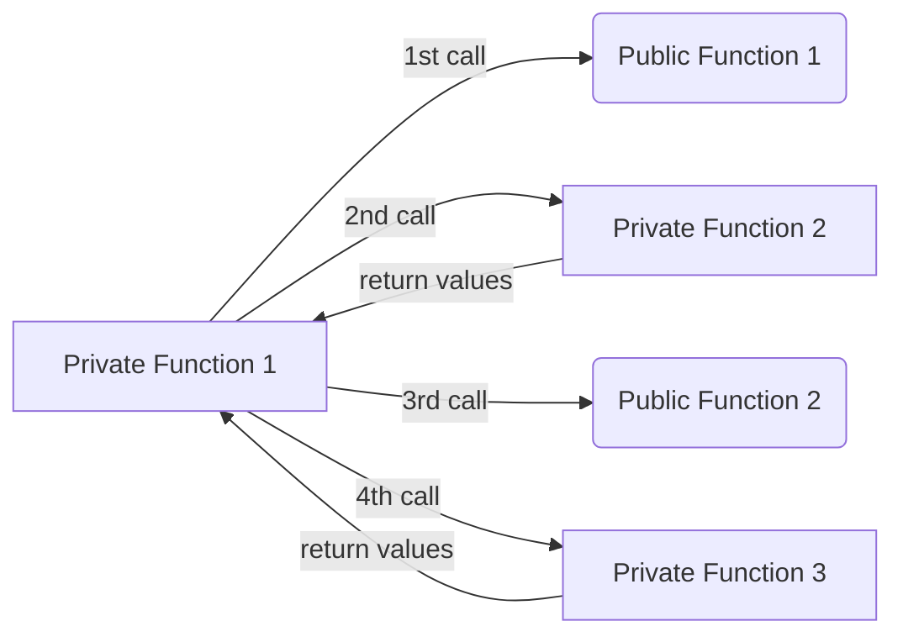
```mermaid
graph LR
    A[Private Function 1] --> |1st call| B(Public Function 1)
    A --> |2nd call| C[Private Function 2]
    C --> |return values| A
    A --> |3rd call| D(Public Function 2)
    A --> |4th call| E[Private Function 3]
    E --> |return values| A
```

The order of execution will actually be:

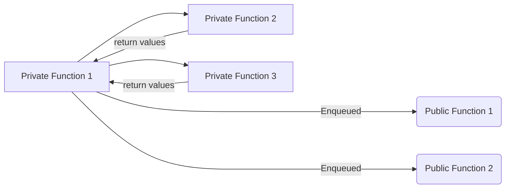
```mermaid
graph LR
    A[Private Function 1] --> C[Private Function 2]
    C --> |return values| A
    A[Private Function 1] --> E[Private Function 3]
    E --> |return values| A
    A -----> |Enqueued| B(Public Function 1)
    A -----> |Enqueued| D(Public Function 2)
```

And the order of proving will actually be:

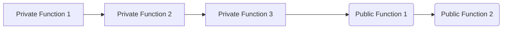
```mermaid
flowchart LR
    A[Private Function 1] --> C[Private Function 2] --> E[Private Function 3] ----> B(Public Function 1) --> D(Public Function 2)
```

## Private to Public Messaging

When a private function calls a public function:

1. The arguments to the public function are hashed into an `args_hash`.
1. A `public_call_stack_item` <!-- todo: link to definition --> is created, which includes the public function's `function_selector` <!-- TODO: do we have en explanation for function_selectors, and how the notion is enshrined for private functions (although languages can still choose how they compute a function selector)? -->, `contract_address`, and `args_hash`.
1. A hash of the `public_call_stack_item` gets enqueued into a separate [`public_call_stack`](../circuits/private-function.md#public-inputs) and passed as inputs to the private kernel.
1. The private kernel pushes these hashes onto its own the [`public_inputs`](../circuits/private-kernel-initial#public-inputs), which the sequencer can see.
1. The PXE creates a [`transaction_object`](../transactions/tx-object.md) which includes the kernel's `public_inputs`.
1. The PXE sends the `transaction_object` to the sequencer.
1. Sequencer then unpacks the `public_call_stack_item` and executes each of the functions.
1. The Public VM executes the enqueued public calls, and then verifies that the hash provided by the private kernel matches the current call stack item.

### Handling Privacy Leakage and `msg.sender`

The sequencer only sees the data in the [`transaction_object`](../transactions/tx-object.md), which shouldn't expose any private information. There are some practical caveats.

When making a private-to-public call, the `msg_sender` will become public. If this is the actual user, then it leaks privacy. If `msg_sender` is some application's contract address, this leaks which contract is calling the public method and therefore leaks which contract the user was interacting with in private land.

An out-of-protocol option to randomizing `msg.sender` (as a user) would be to deploy a [diversified account contract](../addresses-and-keys/diversified-and-stealth.md) and route transactions through this contract. Application developers might also be able to do something similar, to randomize the `msg.sender` of their app contract's address.

### Reverts

If the private part of a transaction reverts, then public calls are never enqueued. But if the public part of the transaction reverts, it should still revert the entire transaction. I.e. the sequencer should drop the execution results of the private part of the transaction and not include those in the state transitioner smart contract. A fee can still be charged by the sequencer for their compute effort.

## Public to Private Messaging

Since public functions execute after private functions, it isn't possible for a public function to call a private function in the same transaction. Nevertheless, it is quite useful for public functions to have a message passing system to private land. A public function can add messages to the [Note Hash Tree](../state/note-hash-tree.md) to save messages from a public function call, that can later be consumed by a private function. Note: such a message can only be consumed by a _later_ transaction. In practice this means that unless you are the sequencer (or have an out of protocol agreement with the sequencer) it cannot be consumed within the same rollup.

To elaborate, a public function may not have read access to encrypted private state in the Note Hash Tree, but it can write to it. You could create a note in the public domain, compute its note hash which gets passed to the inputs of the public VM which adds the hash to the note hash tree. The user who wants to redeem the note can add the note preimage to their PXE and then redeem/nullify the note in the private domain at a later time.

In the picture below, it is worth noting that all data reads performed by private functions are historical in nature, and that private functions are not capable of modifying public storage. Conversely, public functions have the capacity to manipulate private storage (e.g., inserting new note hashes, potentially as part of transferring funds from the public domain to the private domain).


---
title: Address
---

An address is computed as the hash of the following fields:

<!-- TODO: discrepancy between this hash preimage and the contract classes page pseudocode, which includes a version -->

<!-- prettier-ignore -->
| Field | Type | Description |
|----------|----------|----------|
| `salt` | `Field` | User-generated pseudorandom value for uniqueness. |
| `deployer` | `AztecAddress` | Optional address of the deployer of the contract. |
| `contract_class_id` | `Field` | Identifier of the contract class for this instance. |
| `initialization_hash` | `Field` | Hash of the selector and arguments to the constructor. |
| `portal_contract_address` | `EthereumAddress` | Address of the L1 portal contract, zero if none. |
| `public_keys_hash` | `Field` | Hash of the struct of public keys used for encryption and nullifying by this contract, zero if no public keys. |

Storing these fields in the address preimage allows any part of the protocol to check them by recomputing the hash and verifying that the address matches. Examples of these checks are:

- Sending an encrypted note to an undeployed account, which requires the sender app to check the recipient's public key given their address. This scenario also requires the recipient to share with the sender their public key and rest of preimage.
- Having the kernel circuit verify that the code executed at a given address matches the one from the class.
- Asserting that the initialization hash matches the function call in the contract constructor.
- Checking the portal contract address when sending a cross-chain message.

:::warning
We may remove the `portal_contract_address` as a first-class citizen.
:::

The hashing scheme for the address should then ensure that checks that are more frequent can be done cheaply, and that data shared out of band is kept manageable. We define the hash to be computed as follows:

<!-- TODO: missing `version` from hashing! -->

:::warning
Some of these draft domain separators might be too many bits; they need to fit inside a single field element. Version numbers might not be needed until we roll the _next_ version.
:::

```rust
address_crh(
    version: Field,
    salt: Field,
    deployer: AztecAddress,
    contract_class_id: Field,
    initialization_hash: Field,
    portal_contract_address: EthereumAddress,
    public_keys_hash: Field,
) -> Field {

    let salted_initialization_hash: Field = poseidon2(
      be_string_to_field("az_salted_initialization_hash_v1"),

      salt,
      initialization_hash,
      deployer.to_field(),
      be_bits_to_field(portal_contract_address)
    );

    let partial_address: Field = poseidon2(
      be_string_to_field("az_contract_partial_address_v1"),

      contract_class_id,
      salted_initialization_hash
    );

    let address: Field = poseidon2(
      be_string_to_field("az_contract_address_v1"),

      public_keys_hash,
      partial_address
    );

    address
}
```

The `public_keys` array can vary depending on the format of keys used by the address, but it is suggested it includes the master keys defined in the [keys section](./keys.md). For example:

```rust
let public_keys_hash: Field = poseidon2(
  be_string_to_field("az_public_keys_hash"), // TODO: does this need some unique ID, to disambiguate from other approaches people might have for other public keys?

  nullifier_pubkey.x,
  nullifier_pubkey.y,
  tagging_pubkey.x,
  tagging_pubkey.y,
  incoming_view_pubkey.x,
  incoming_view_pubkey.y,
  outgoing_view_pubkey.x,
  outgoing_view_pubkey.y
);
```

This recommended hash format is compatible with the [encryption precompiles](./precompiles.md#encryption-and-tagging-precompiles) initially defined in the protocol and advertised in the canonical [registry](../pre-compiled-contracts/registry.md) for private message delivery. An address that chooses to use a different format for its keys will not be compatible with apps that rely on the registry for note encryption. Nevertheless, new precompiles introduced in future versions of the protocol could use different public keys formats.

<!-- TODO(cryptography): Can we restrict "x" components of public keys to all be the same sign, so we don't need to encode "y"'s signs? -->
---
title: Diversified and Stealth Accounts
---

The [keys specification](./keys.md) describes derivation mechanisms for diversified and stealth public keys. However, the protocol requires users to interact with addresses.

## Computing Addresses

To support diversified and stealth accounts, a user may compute the deterministic address for a given account contract that is deployed using a diversified or stealth public key, so a sender can interact with the resulting so-called "diversified" or "stealth" address even before the account contract is deployed.

When the user wants to access the notes that were sent to the diversified or stealth address, they can deploy the contract at their address, and control it privately from their main account.

<!--
> they can deploy the contract at their address, and control it privately from their main account.
Why would they need to deploy their main account in order to learn about new notes? Wouldn't it instead be possible to configure the PXE to trial-decrypt notes for the main account _even without deploying the account contract_?
-->

## Account Contract Pseudocode

As an example implementation, account contracts for diversified and stealth accounts can be designed to require no private constructor or state, and delegate entrypoint access control to their master address.

```
contract DiversifiedAccount

    private fn entrypoint(payload: action[])
        assert msg_sender == get_owner_address()
        execute(payload)

    private fn is_valid(message_hash: Field)
        return get_owner_address().is_valid(message_hash)

    internal private get_owner_address()
        let address_preimage = pxe.get_address_preimage(this)
        assert hash(address_preimage) == this
        return address_preimage.deployer_address
```

Given the contract does not require initialization since it has no constructor, it can be used by its owner without being actually deployed, which reduces the setup cost.

<!-- TODO: The above requires that we implement "using a contract without deploying it if it has no constructor", or "constructor abstraction", both of which are a bit controversial. -->
<!-- I think we're now happy with these previously-controversial things, right? So we can probably get rid of this `TODO`?-->

<!-- In addition to considering the flow of diversifying a user's account contract address, please could we also consider a flow where an app contract wishes to diversify _its_ address when making a call to the public world? The app contract would need to do some clever internal bookkeeping to track all its diversified addresses, and which of the apps users are making use of which diversified addresses, but it would be a worthwhile exploration. I suppose the app contract could simply deploy a new diversified contract whenever it wants to make a public call, and route the call through that diversified account contract. -->

## Discarded Approaches

An alternative approach was to introduce a new type of call, a diversified call, that would allow the caller to impersonate any address they can derive from their own, for an enshrined derivation mechanism. Account contracts could use this opcode, as opposed to a regular call, to issue calls on behalf on their diversified and stealth addresses. However, this approach failed to account for calls made back to the account contracts, in particular authwit checks. It also required protocol changes, introducing a new type of call which could be difficult to reason about, and increased attack surface. The only benefit over the approach chosen is that it would require one less extra function call to hop from the user's main account contract to the diversified or stealth one.
---
title: Addresses and Keys
---
import DocCardList from '@theme/DocCardList';

Aztec has no concept of externally-owned accounts. Every address identifies a smart contract in the network.

For end users to interact with the network, they'll most-likely need to [deploy](../contract-deployment/index.md) a so-called "account contract".

Addresses are then a commitment to a contract class, a list of constructor arguments, and a set of keys.

Keys in Aztec are used both for authorization and privacy. Authorization keys are managed by account contracts, and not mandated by the protocol. Each account contract may use different authorization keys, if at all, with different signing mechanisms.

Privacy keys are used for note encryption, tagging, and nullifying. These are also not enforced by the protocol. However, for facilitating composability, the protocol enshrines a set of enshrined encryption and tagging mechanisms, that can be leveraged by applications as they interact with accounts.

The [requirements](./keys-requirements.md) section outlines the features that were sought when designing Aztec's addresses and keys. We then specify how [addresses](./address.md) are derived, as well as the default way in which [keys](./keys.md) will be derived. The [precompiles](./precompiles.md) section describes enshrined contract addresses, with implementations defined by the protocol, used for note encryption and tagging.

Last, the [diversified and stealth accounts](./diversified-and-stealth.md) sections describe application-level recommendations for diversified and stealth accounts.


<DocCardList />
---
title: Requirements
description: Requirements which motivated Aztec's design for addresses and keys.
---

## Requirements for Keys

### Scenario

A common illustration in this document is Bob sending funds to Alice, by:

- creating a "note" for her;
- committing to the contents of that note (a "note hash");
- inserting that note hash into a utxo tree;
- encrypting the contents of that note for Alice;
- optionally encrypting the contents of that note for Bob's future reference;
- optionally deriving an additional "tag" (a.k.a. "clue") to accompany the ciphertexts for faster note discovery;
- broadcasting the resulting ciphertext(s) (and tag(s));
- optionally identifying the tags;
- decrypting the ciphertexts; storing the note; and some time later spending (nullifying) the note.

> Note: there is nothing to stop an app and wallet from implementing its own key derivation scheme. Nevertheless, we're designing a 'canonical' scheme that most developers and wallets can use.

### Authorization keys

Aztec has native account abstraction, so tx authentication is done via an account contract, meaning tx authentication can be implemented however the user sees fit. That is, authorization keys aren't specified at the protocol level.

A tx authentication secret key is arguably the most important key to keep private, because knowledge of such a key could potentially enable an attacker to impersonate the user and execute a variety of functions on the network.

**Requirements:**

- A tx authentication secret key SHOULD NOT enter Aztec software, and SHOULD NOT enter a circuit.
  - Reason: this is just best practice.

### Master & Siloed Keys

**Requirements:**

- All keys must be re-derivable from a single `seed` secret.
- Users must have the option of keeping this `seed` offline, e.g. in a hardware wallet, or on a piece of paper.
- All master keys (for a particular user) must be linkable to a single address for that user.
- For each contract, a siloed set of all secret keys MUST be derivable.
  - Reason: secret keys must be siloed, so that a malicious app circuit cannot access and emit (as an unencrypted event or as args to a public function) a user's master secret keys or the secret keys of other apps.
- Master _secret_ keys must not be passed into an app circuit, except for precompiles.
  - Reason: a malicious app could broadcast these secret keys to the world.
- Siloed secret keys _of other apps_ must not be passed into an app circuit.
  - Reason: a malicious app could broadcast these secret keys to the world.
- The PXE must prevent an app from accessing master secret keys.
- The PXE must prevent an app from accessing siloed secret keys that belong to another contract address.
  - Note: To achieve this, the PXE simulator will need to check whether the bytecode being executed (that is requesting secret keys) actually exists at the contract address.
- There must be one and only one way to derive all (current\*) master keys, and all siloed keys, for a particular user address.
  - For example, a user should not be able to derive multiple different outgoing viewing keys for a single incoming viewing key (note: this was a 'bug' that was fixed between ZCash Sapling and Orchard).
  - \*"current", alludes to the possibility that the user might wish to support rotating keys, but only if one and only one set of keys is derivable as "current".
- All app-siloed keys can all be deterministically linked back to the user's address, without leaking important secrets to the app.

#### Security assumptions

- The Aztec private execution client (PXE), precompiled contracts (vetted application circuits), and the kernel circuit (a core protocol circuit) can be trusted with master secret keys (_except for_ the tx authorization secret key, whose security assumptions are abstracted-away to wallet designers).

### Encryption and decryption

Definitions (from the point of view of a user ("yourself")):

- Incoming data: Data which has been created by someone else, and sent to yourself.
- Outgoing data: Data which has been sent to somebody else, from you.
- Internal Incoming data: Data which has been created by you, and has been sent to yourself.
  - Note: this was an important observation by ZCash. Before this distinction, whenever a 'change' note was being created, it was being broadcast as incoming data, but that allowed a 3rd party who was only meant to have been granted access to view "incoming" data (and not "outgoing" data), was also able to learn that an "outgoing" transaction had taken place (including information about the notes which were spent). The addition of "internal incoming" keys enables a user to keep interactions with themselves private and separate from interactions with others.

**Requirements:**

- A user can derive app-siloed incoming internal and outgoing viewing keys.
  - Reason: Allows users to share app-siloed keys to trusted 3rd parties such as auditors, scoped by app.
  - Incoming viewing keys are not considered for siloed derivation due to the lack of a suitable public key derivation mechanism.
- A user can encrypt a record of any actions, state changes, or messages, to _themselves_, so that they may re-sync their entire history of actions from their `seed`.

### Nullifier keys

Derivation of a nullifier is app-specific; a nullifier is just a `field` (siloed by contract address), from the pov of the protocol.

Many private application devs will choose to inject a secret "nullifier key" into a nullifier. Such a nullifier key would be tied to a user's public identifier (e.g. their address), and that identifier would be tied to the note being nullified (e.g. the note might contain that identifier). This is a common pattern in existing privacy protocols. Injecting a secret "nullifier key" in this way serves to hide what the nullifier is nullifying, and ensures the nullifier can only be derived by one person (assuming the nullifier key isn't leaked).

> Note: not all nullifiers require injection of a secret _which is tied to a user's identity in some way_. Sometimes an app will need just need a guarantee that some value will be unique, and so will insert it into the nullifier tree.

**Requirements:**

- Support use cases where an app requires a secret "nullifier key" (linked to a user identity) to be derivable.
  - Reason: it's a very common pattern.

#### Is a nullifier key _pair_ needed?

I.e. do we need both a nullifier secret key and a nullifier public key? Zcash sapling had both, but Zcash orchard (an upgrade) replaced the notion of a keypair with a single nullifier key. The [reason](https://zcash.github.io/orchard/design/keys.html) being:

- _"[The nullifier secret key's (nsk's)] purpose in Sapling was as defense-in-depth, in case RedDSA [(the scheme used for signing txs, using the authentication secret key ask)] was found to have weaknesses; an adversary who could recover ask would not be able to spend funds. In practice it has not been feasible to manage nsk much more securely than a full viewing key [(dk, ak, nk, ovk)], as the computational power required to generate Sapling proofs has made it necessary to perform this step [(deriving nk from nsk)] on the same device that is creating the overall transaction (rather than on a more constrained device like a hardware wallet). We are also more confident in RedDSA now."_

A nullifier public key might have the benefit (in Aztec) that a user could (optionally) provide their nullifier key nk to some 3rd party, to enable that 3rd party to see when the user's notes have been nullified for a particular app, without having the ability to nullify those notes.

- This presumes that within a circuit, the nk (not a public key; still secret!) would be derived from an nsk, and the nk would be injected into the nullifier.
- BUT, of course, it would be BAD if the nk were derivable as a bip32 normal child, because then everyone would be able to derive the nk from the master key, and be able to view whenever a note is nullified!
- The nk would need to be a hardened key (derivable only from a secret).

Given that it's acceptable to ZCash Orchard, we accept that a nullifier master secret key may be 'seen' by Aztec software.

### Auditability

Some app developers will wish to give users the option of sharing private transaction details with a trusted 3rd party.

> Note: The [archive](./../state/archive.md) will enable a user to prove many things about their transaction history, including historical encrypted logs. This feature will open up exciting audit patterns, where a user will be able to provably respond to questions without necessarily revealing their private data. However, sometimes this might be an inefficient pattern; in particular when a user is asked to prove a negative statement (e.g. "prove that you've never owned a rock NFT"). Proving such negative statements might require the user to execute an enormous recursive function to iterate through the entire tx history of the network, for example: proving that, out of all the encrypted events that the user _can_ decrypt, none of them relate to ownership of a rock NFT. Given this (possibly huge) inefficiency, these key requirements include the more traditional ability to share certain keys with a trusted 3rd party.

**Requirements:**

- "Shareable" secret keys.
  - A user can optionally share "shareable" secret keys, to enable a 3rd party to decrypt the following data:
    - Outgoing data, across all apps
    - Outgoing data, siloed for a single app
    - Incoming internal data, across all apps
    - Incoming internal data, siloed for a single app
    - Incoming data, across all apps
    - Incoming data, siloed for a single app, is **not** required due to lack of a suitable derivation scheme
  - Shareable nullifier key.
    - A user can optionally share a "shareable" nullifier key, which would enable a trusted 3rd party to see _when_ a particular note hash has been nullified, but would not divulge the contents of the note, or the circumstances under which the note was nullified (as such info would only be gleanable with the shareable viewing keys).
  - Given one (or many) shareable keys, a 3rd part MUST NOT be able to derive any of a user's other secret keys; be they shareable or non-shareable.
    - Further, they must not be able to derive any relationships _between_ other keys.
- No impersonation.
  - The sharing of any (or all) "shareable" key(s) MUST NOT enable the trusted 3rd party to perform any actions on the network, on behalf of the user.
  - The sharing of a "shareable" outgoing viewing secret (and a "shareable" _internal_ incoming viewing key) MUST NOT enable the trusted 3rd party to emit encrypted events that could be perceived as "outgoing data" (or internal incoming data) originating from the user.
- Control over incoming/outgoing data.
  - A user can choose to only give incoming data viewing rights to a 3rd party. (Gives rise to incoming viewing keys).
  - A user can choose to only give outgoing data viewing rights to a 3rd party. (Gives rise to outgoing viewing keys).
  - A user can choose to keep interactions with themselves private and distinct from the viewability of interactions with other parties. (Gives rise to _internal_ incoming viewing keys).

### Sending funds before deployment

**Requirements:**

- A user can generate an address to which funds (and other notes) can be sent, without that user having ever interacted with the network.
  - To put it another way: A user can be sent money before they've interacted with the Aztec network (i.e. before they've deployed an account contract). e.g their incoming viewing key can be derived.
- An address (user identifier) can be derived deterministically, before deploying an account contract.

### Note Discovery

**Requirements:**

- A user should be able to discover which notes belong to them, without having to trial-decrypt every single note broadcasted on chain.
- Users should be able to opt-in to using new note discovery mechanisms as they are made available in the protocol.

#### Tag Hopping

Given that this is our best-known approach, we include some requirements relating to it:

**Requirements:**

- A user Bob can non-interactively generate a sequence of tags for some other user Alice, and non-interactively communicate that sequence of tags to Alice.
- If a shared secret (that is used for generating a sequence of tags) is leaked, Bob can non-interactively generate and communicate a new sequence of tags to Alice, without requiring Bob nor Alice to rotate their keys.
  - Note: if the shared secret is leaked through Bob/Alice accidentally leaking one of their keys, then they might need to actually rotate their keys.

### Constraining key derivations

- An app has the ability to constrain the correct encryption and/or note discovery tagging scheme.
- An app can _choose_ whether or not to constrain the correct encryption and/or note discovery tagging scheme.
  - Reason: constraining these computations (key derivations, encryption algorithms, tag derivations) will be costly (in terms of constraints), and some apps might not need to constrain it (e.g. zcash does not constrain correct encryption).

### Rotating keys

- A user should be able to rotate their set of keys, without having to deploy a new account contract.
  - Reason: keys can be compromised, and setting up a new identity is costly, since the user needs to migrate all their assets. Rotating encryption keys allows the user to regain privacy for all subsequent interactions while keeping their identity.
  - This requirement causes a security risk when applied to nullifier keys. If a user can rotate their nullifier key, then the nullifier for any of their notes changes, so they can re-spend any note. Rotating nullifier keys requires the nullifier public key, or at least an identifier of it, to be stored as part of the note. Alternatively, this requirement can be removed for nullifier keys, which are not allowed to be rotated.

<!-- TODO: Allow to rotate nullifier keys or not? -->

### Diversified Keys

- Alice can derive a diversified address; a random-looking address which she can (interactively) provide to Bob, so that Bob may send her funds (and general notes).
  - Reason: By having the recipient derive a distinct payment address _per counterparty_, and then interactively provide that address to the sender, means that if two counterparties collude, they won't be able to convince the other that they both interacted with the same recipient.
- Random-looking addresses can be derived from a 'main' address, so that private to public function calls don't reveal the true `msg_sender`. These random-looking addresses can be provably linked back to the 'main' address.
  > Note: both diversified and stealth addresses would meet this requirement.
- Distributing many diversified addresses must not increase the amount of time needed to scan the blockchain (they must all share a single set of viewing keys).

### Stealth Addresses

Not to be confused with diversified addresses. A diversified address is generated by the recipient, and interactively given to a sender, for the sender to then use. But a stealth address is generated by the _sender_, and non-interactively shared with the recipient.

Requirement:

- Random-looking addresses can be derived from a 'main' address, so that private -> public function calls don't reveal the true `msg_sender`. These random-looking addresses can be provably linked back to the 'main' address.
  > Note: both diversified and stealth addresses would meet this requirement.
- Unlimited random-looking addresses can be non-interactively derived by a sender for a particular recipient, in such a way that the recipient can use one set of keys to decrypt state changes or change states which are 'owned' by that stealth address.
---
title: Precompiles
---

<!-- Missing exact descriptions of the interfaces & logic of each precompile. -->

Precompiled contracts, which borrow their name from Ethereum's, are contracts not deployed by users but defined at the protocol level. These contract [instances](../contract-deployment/instances.md) and their [classes](../contract-deployment/classes.md) are assigned well-known low-number addresses and identifiers, and their implementation is subject to change via protocol upgrades. Precompiled contracts in Aztec are implemented as a set of circuits, one for each function they expose, like user-defined private contracts. Precompiles may make use of the local PXE oracle.

Note that, unlike user-defined contracts, the address of a precompiled [contract instance](../contract-deployment/instances.md) and the [identifier of its class](../contract-deployment/classes.md#class-identifier) both have no known preimage.

The rationale for precompiled contracts is to provide a set of vetted primitives for [note encryption](../private-message-delivery/private-msg-delivery.md#encryption-and-decryption) and [tagging](../private-message-delivery/private-msg-delivery.md#note-tagging) that applications can use safely. These primitives are guaranteed to be always-satisfiable when called with valid arguments. This allows account contracts to choose their preferred method of encryption and tagging from any primitive in this set, and application contracts to call into them without the risk of calling into an untrusted code, which could potentially halt the execution flow via an unsatisfiable constraint. Furthermore, by exposing these primitives in a reserved set of well-known addresses, applications can be forward-compatible and incorporate new encryption and tagging methods as accounts opt into them.

## Constants

- `ENCRYPTION_BATCH_SIZES=[4, 8, 16, 32]`: Defines what max [batch sizes](../calls/batched-calls.md) are supported in precompiled encryption methods.
- `ENCRYPTION_PRECOMPILE_ADDRESS_RANGE=0x00..0xFFFF`: Defines the range of addresses reserved for precompiles used for encryption and tagging.
- `MAX_PLAINTEXT_LENGTH`: Defines the maximum length of a plaintext to encrypt.
- `MAX_CIPHERTEXT_LENGTH`: Defines the maximum length of a returned encrypted ciphertext.
- `MAX_TAGGED_CIPHERTEXT_LENGTH`: Defines the maximum length of a returned encrypted ciphertext prefixed with a note tag.

<!-- TODO: move to the dedicated constants.md file -->

## Encryption and tagging precompiles

All precompiles in the address range `ENCRYPTION_PRECOMPILE_ADDRESS_RANGE` are reserved for encryption and tagging. Application contracts are expected to call into these contracts with note plaintext(s), recipient address(es), and public key(s). To facilitate forward compatibility, all unassigned addresses within the range expose the functions below as no-ops, meaning that no actions will be executed when calling into them.

<!-- Q: How is this 'no-op' functionality achieved? -->

All functions in these precompiles accept a `PublicKeys` struct which contains the user-advertised public keys. The structure of each of the public keys included can change from one encryption method to another, with the exception of the `nullifier_key` which is always restricted to a single field element. For forward compatibility, the precompiles interface accepts a hash of the public keys, which can be expanded within each method via an oracle call.

```
struct PublicKeys:
  nullifier_key: Field
  incoming_encryption_key: PublicKey
  outgoing_encryption_key: PublicKey
  incoming_internal_encryption_key: PublicKey
  tagging_key: PublicKey
```

To identify which public key to use in the encryption, precompiles also accept an enum:

```
enum EncryptionType:
  incoming = 1
  outgoing = 2
  incoming_internal = 3
```

Precompiles expose the following private functions:

```
validate_keys(public_keys_hash: Field): bool
```

Returns true if the set of public keys represented by `public_keys` is valid for this encryption and tagging mechanism. The precompile must guarantee that any of its methods must succeed if called with a set of public keys deemed as valid. This method returns `false` for undefined precompiles.

```
encrypt(public_keys_hash: Field, encryption_type: EncryptionType, recipient: AztecAddress, plaintext: Field[MAX_PLAINTEXT_LENGTH]): Field[MAX_CIPHERTEXT_LENGTH]
```

Encrypts the given plaintext using the provided public keys, and returns the encrypted ciphertext.

```
encrypt_and_tag(public_keys_hash: Field, encryption_type: EncryptionType, recipient: AztecAddress, plaintext: Field[MAX_PLAINTEXT_LENGTH]): Field[MAX_TAGGED_CIPHERTEXT_LENGTH]
```

Encrypts and tags the given plaintext using the provided public keys, and returns the encrypted note prefixed with its tag for note discovery.

```
encrypt_and_broadcast(public_keys_hash: Field, encryption_type: EncryptionType, recipient: AztecAddress, plaintext: Field[MAX_PLAINTEXT_LENGTH]): Field[MAX_TAGGED_CIPHERTEXT_LENGTH]
```

Encrypts and tags the given plaintext using the provided public keys, broadcasts them as an event, and returns the encrypted note prefixed with its tag for note discovery.

```
encrypt<N>([call_context: CallContext, public_keys_hash: Field, encryption_type: EncryptionType, recipient: AztecAddress, plaintext: Field[MAX_PLAINTEXT_LENGTH] ][N]): Field[MAX_CIPHERTEXT_LENGTH][N]
encrypt_and_tag<N>([call_context: CallContext, public_keys_hash: Field, encryption_type: EncryptionType, recipient: AztecAddress, plaintext: Field[MAX_PLAINTEXT_LENGTH] ][N]): Field[MAX_TAGGED_CIPHERTEXT_LENGTH][N]
encrypt_and_broadcast<N>([call_context: CallContext, public_keys_hash: Field, encryption_type: EncryptionType, recipient: AztecAddress, plaintext: Field[MAX_PLAINTEXT_LENGTH] ][N]): Field[MAX_TAGGED_CIPHERTEXT_LENGTH][N]
```

Batched versions of the methods above, which accept an array of `N` tuples of public keys, recipient, and plaintext to encrypt in batch. Precompiles expose instances of this method for multiple values of `N` as defined by `ENCRYPTION_BATCH_SIZES`. Values in the batch with zeroes are skipped. These functions are intended to be used in [batched calls](../calls/batched-calls.md).

```
decrypt(public_keys_hash: Field, encryption_type: EncryptionType, owner: AztecAddress, ciphertext: Field[MAX_CIPHERTEXT_LENGTH]): Field[MAX_PLAINTEXT_LENGTH]
```

Decrypts the given ciphertext, encrypted for the provided owner. Instead of receiving the decryption key, this method triggers an oracle call to fetch the private decryption key directly from the local PXE and validates it against the supplied public key, in order to avoid leaking a user secret to untrusted application code. This method is intended for provable decryption use cases.

## Encryption strategies

List of encryption strategies implemented by precompiles:

### AES128

Uses AES128 for encryption, by generating an AES128 symmetric key and an IV from a shared secret derived from the recipient's public key and an ephemeral keypair. Requires that the recipient's keys are points in the Grumpkin curve. The output of the encryption is the concatenation of the encrypted ciphertext and the ephemeral public key.

Pseudocode for the encryption process:

```
encrypt(plaintext, recipient_public_key):
  ephemeral_private_key, ephemeral_public_key = grumpkin_random_keypair()
  shared_secret = recipient_public_key * ephemeral_private_key
  [aes_key, aes_iv] = sha256(shared_secret ++ [0x01])
  return ephemeral_public_key ++ aes_encrypt(aes_key, aes_iv, plaintext)
```

Pseudocode for the decryption process:

```
decrypt(ciphertext, recipient_private_key):
  ephemeral_public_key = ciphertext[0:64]
  shared_secret = ephemeral_public_key * recipient_private_key
  [aes_key, aes_iv] = sha256(shared_secret ++ [0x01])
  return aes_decrypt(aes_key, aes_iv, ciphertext[64:])
```

<!-- TODO: Why append the [1] at the end of the shared secret? Also, do we want to keep using sha, or should we use a snark-friendlier hash here? -->

## Note tagging strategies

List of note tagging strategies implemented by precompiles:

### Trial decryption

Trial decryption relies on the recipient to brute-force trial-decrypting every note emitted by the chain. Every note is attempted to be decrypted with the associated decryption scheme. If decryption is successful, then the note is added to the local database. This requires no note tags to be emitted along with a note.

In AES encryption, the plaintext is prefixed with the first 8 bytes of the IV. Decryption is deemed successful if the first 8 bytes of the decrypted plaintext matches the first 8 bytes of the IV derived from the shared secret.

This is the cheapest approach in terms of calldata cost, and the simplest to implement, but puts a significant burden on the user. Should not be used except for accounts tied to users running full nodes.

### Delegated trial decryption

Delegated trial decryption relies on a tag added to each note, generated using the recipient's tagging public key. The holder of the corresponding tagging private key can trial-decrypt each tag, and if decryption is successful, proceed to decrypt the contents of the note using the associated decryption scheme.

This allows a user to share their tagging private key with a trusted service provider, who then proceeds to trial decrypt all possible note tags on their behalf. This scheme is simple for the user, but requires trust on a third party.

<!-- TODO: How should the tag be generated here? Tags should be unique, and tags encrypted with the same pubkey should not be linkable to each other without the tagging private key. Can we use a similar method than the IV check in trial-decryption? -->

### Tag hopping

Tag hopping relies on establishing a one-time shared secret through a handshake between each sender-recipient pair, advertise the handshake through a trial-decrypted brute-forced channel, and then generate tags by combining the shared secret and an incremental counter. Recipients need to trial-decrypt events emitted by a canonical `Handshake` contract to detect new channels established with them, and then scan for the next tag for each open channel. Note that the handshake contract leaks whenever a new shared secret has been established, but the participants of the handshake are kept hidden.

This method requires the recipient to be continuously trial-decrypting the handshake channel, and then scanning for a number of tags equivalent to the number of handshakes they had received. While this can get to too large amounts for particularly active addresses, it is still far more efficient than trial decryption.

When Alice wants to send a message to Bob for the first time:

1. Alice creates a note, and calls into Bob's encryption and tagging precompile.
2. The precompile makes an oracle call to `getSharedSecret(Alice, Bob)`.
3. Alice's PXE looks up the shared secret which doesn't exist since this is their first interaction.
4. Alice's PXE generates a random shared secret, and stores it associated Bob along with `counter=1`.
5. The precompile makes a call to the `Handshake` contract that emits the shared secret, encrypted for Bob and optionally Alice.
6. The precompile computes `new_tag = hash(alice, bob, secret, counter)`, emits it as a nullifier, and prepends it to the note ciphertext before broadcasting it.

For all subsequent messages:

1. Alice creates a note, and calls into Bob's encryption and tagging precompile.
2. The precompile makes an oracle call to `getSharedSecret(Alice, Bob)`.
3. Alice's PXE looks up the shared secret and returns it, along with the current value for `counter`, and locally increments `counter`.
4. The precompile computes `previous_tag = hash(alice, bob, secret, counter)`, and performs a merkle membership proof for it in the nullifier tree. This ensures that tags are incremental and cannot be skipped.
5. The precompile computes `new_tag = hash(alice, bob, secret, counter + 1)`, emits it as a nullifier, and prepends it to the note ciphertext before broadcasting it.

## Defined precompiles

List of precompiles defined by the protocol:

<!-- prettier-ignore -->
| Address | Encryption | Note Tagging | Comments |
| ------- | ---------- | ------------ | -------- |
| 0x01    | Noop       | Noop         | Used by accounts to explicitly signal that they cannot receive encrypted payloads. Validation method returns `true` only for an empty list of public keys. All other methods return empty. |
| 0x02    | AES128     | Trial decryption | |
| 0x03    | AES128     | Delegated trial decryption | |
| 0x04    | AES128     | Tag hopping  | |                                                                                                                                                                                           |
## Deriving a nullifier within an app contract

Let's assume a developer wants a nullifier of a note to be derived as:

`nullifier = h(note_hash, nullifier_key);`

... where the `nullifier_key` ($\Nkapp$) belongs to the 'owner' of the note, and where the 'owner' is some $\address$.

Here's example for how an app circuit _could_ constrain the nullifier key to be correct:

### Diagram

It's easiest to take a look at this first:


### Within the app circuit

Within the app, we can prove links between:

- the user's [$\nskapp$](../keys.md#app-siloed-nullifier-secret-key) and their [$\Nkapp$](../keys.md#app-siloed-nullifier-key); and between
- the user's [$\Npkm$](../keys.md#master-nullifier-public-key) and their [$\address$](../address.md).

The link that's missing is to prove that $\Npkm$ relates to $\nskapp$. To compute this missing link requires the $\nskm$, which MUST NOT be passed into an app circuit, and may only be passed into a kernel circuit. See the next ['Within the kernel circuit'](#within-the-kernel-circuit) section for details of this logic.

#### The logic

$$
\begin{aligned}
\Nkapp &= \text{poseidon2}(\nskapp) \\
\text{nullifier} &= \text{poseidon2}(\text{note\_hash}, \Nkapp) \\
\text{public\_keys\_hash} &= \text{poseidon2}(\text{be\_string\_to\_field}(``\text{az\_public\_keys\_hash}"), \Npkm, \Tpkm, \Ivpkm, \Ovpkm) \\
\address &= \text{poseidon2}(\text{be\_string\_to\_field}(``\text{az\_contract\_address\_v1}"), \text{public\_keys\_hash}, \text{partial\_address})
\end{aligned}
$$

> Note: the passing of points directly into the poseidon function is lazy notation: the keys would need to be serialized appropriately as fields into the poseidon function.

> Recall an important point: the app circuit MUST NOT be given $\nskm$. Indeed, $\nskapp$ is derived (see earlier) as a _hardened_ child of $\nskm$, to prevent $\nskm$ from being reverse-derived by a malicious circuit. The linking of $\nskapp$ to $\nskm$ is deferred to the kernel circuit (which can be trusted moreso than an app).

> Recall also: $\Nkapp$ is used (instead of $\nskapp$) solely as a way of giving the user the option of sharing $\Nkapp$ with a trusted 3rd party, to give them the ability to view when a note has been nullified (although I'm not sure how useful this is, given that it would require brute-force effort from that party to determine which note hash has been nullified, with very little additional information).

The app circuit exposes, as public inputs, a "nullifier key validation request":

```rust
let nullifier_validation_request = KeyValidationRequest {
    app_address: app_address,
    claimed_hardened_child_sk: nsk_app,
    claimed_parent_pk: Npk_m,
}
```

### Within the Kernel Circuit

The kernel circuit can then validate the request (having been given $\nskm$ as a private input to the kernel circuit):

$$
\begin{aligned}
\nskapp &= \text{derive\_hardened\_app\_siloed\_secret\_key}(\text{``az\_nsk\_app"}, \text{app\_address}, \nskm) \\
\Npkm &= \nskm \cdot G \\
\nskapp &== \text{claimed\_hardened\_child\_sk} \\
\Npkm &== \text{claimed\_parent\_pk} \\
\end{aligned}
$$

If the kernel circuit succeeds in these calculations, then the $\Nkapp$ has been validated as having a known secret key, and belonging to the $\address$.
# Handshaking for tag-hopping

Deriving a sequence of tags for tag-hopping.

## Deriving a sequence of tags between Alice and Bob across all apps

For Bob to derive a shared secret for Alice:

<!-- prettier-ignore -->
| Thing | Derivation | Name | Comments |
|---|---|---|---|
$\esk_{hs}$ | $\stackrel{rand}{\leftarrow} \mathbb{F}$ | ephemeral secret key, for handshaking | $hs$ = handshake.
$\Epk_{hs}$ | $\esk_{hs} \cdot G$ | Ephemeral public key, for handshaking |
$\sharedsecret_{m,tagging}^{Bob \rightarrow Alice}$ | $\esk_{hs} \cdot \Ivpkm$ | Shared secret, for tagging | Here, we're illustrating the derivation of a shared secret (for tagging) using _master_ keys.

Having derived a Shared Secret, Bob can now share it with Alice as follows:

<!-- prettier-ignore -->
| Thing | Derivation | Name | Comments |
|---|---|---|---|
$\Taghs$ | $\esk_{hs} \cdot \Tpkm$ | Handshake message identification tag | Note: the tagging public key $\Tpkm$ exists as an optimization, seeking to make brute-force message identification as fast as possible. In many cases, handshakes can be performed offchain via traditional web2 means, but in the case of on-chain handshakes, we have no preferred alternative over simply brute-force attempting to reconcile every 'Handshake message identification tag'. Note: this optimization reduces the recipient's work by 1 cpu-friendly hash per message (at the cost of 255-bits to broadcast a compressed encoding of $\Taghs$). We'll need to decide whether this is the right speed/communication trade-off. | 
$\payload$ | [$\Taghs$, $\Epk_{hs}$] | Payload | This can be broadcast via L1.<br />Curve points can be compressed in the payload. |

Alice can identify she is the indended the handshake recipient as follows:

<!-- prettier-ignore -->
| Thing | Derivation | Name | Comments |
|---|---|---|---|
$\Taghs$ | $\tskm \cdot \Epk_{hs}$ | Handshake message identification tag | Alice can extract $\Taghs$ and $\Epk_{hs}$ from the $\payload$ and perform this scalar multiplication on _every_ handshake message. If the computed $\Taghs$ value matches that of the $\payload$, then the message is indented for Alice.<br />Clearly, handshake transactions will need to be identifiable as such (to save Alice time), e.g. by revealing the contract address of some canonical handshaking contract alongside the $\payload$.<br />Recall: this step is merely an optimization, to enable Alice to do a single scalar multiplication before moving on (in cases where she is not the intended recipient). |

If Alice successfully identifies that she is the indended the handshake recipient, she can proceed with deriving the shared secret (for tagging) as follows:

<!-- prettier-ignore -->
| Thing | Derivation | Name | Comments |
|---|---|---|---|
$\sharedsecret_{m,tagging}^{Bob \rightarrow Alice}$ | $\ivskm \cdot \Epk_{hs}$ | Shared secret, for tagging |  |

A sequence of tags can then be derived by both Alice and Bob as:

<!-- prettier-ignore -->
| Thing | Derivation | Name | Comments |
|---|---|---|---|
$\tagg_{m,i}^{Bob \rightarrow Alice}$ | $\text{pos2}(\text{``az\_tag\_ss\_m''}, \sharedsecret_{m,tagging}^{Bob \rightarrow Alice}, i)$ | The i-th tag in the sequence. |  |

This tag can be used as the basis for note retreival schemes. Each time Bob sends Alice a $\ciphertext$, he can attach the next unused $\tagg_{m,i}^{Bob \rightarrow Alice}$ in the sequence. Alice - who is also able to derive the next $\tagg_{m,i}^{Bob \rightarrow Alice}$ in the sequence - can make privacy-preserving calls to a server, requesting the $\ciphertext$ associated with a particular $\tagg_{m,i}^{Bob \rightarrow Alice}$.

> The colour key isn't quite clear for $\tagg_{m,i}^{Bob \rightarrow Alice}$. It will be a publicly-broadcast piece of information, but no one should learn that it relates to Bob nor Alice (except perhaps some trusted 3rd party whom Alice has entrusted with her $\ivskm$).

<!-- TODO: Prevent spam (where a malicious user could observe the emitted tag $\tagg_{m,i}^{Bob \rightarrow Alice}$, and re-emit it many times via some other app-contract). Perhaps this could be achieved by emitting the tag as a nullifier (although this would cause state bloat). -->

## Deriving a sequence of tags from Bob to himself across all apps

The benefit of Bob deriving a sequence of tags for himself, is that he can re-sync his _outgoing_ transaction data more quickly, if he ever needs to in future.

This can be done by either:

- Copying the approach used to derive a sequence of tags between Bob and Alice (but this time do it between Bob and Bob, and use Bob's outgoing keys).
- Generating a very basic sequence of tags $\tagg_{app, i}^{Bob \rightarrow Bob} = \text{pos2}(\text{``az\_tag\_ovsk\_app''}, \ovskapp, i)$ (at the app level) and $\tagg_{m, i}^{Bob \rightarrow Bob} = \text{pos2}(\text{``az\_tag\_ovsk\_m''}, \ovskm, i)$ (at the master level).
  - Note: In the case of deriving app-specific sequences of tags, Bob might wish to also encrypt the app*address as a ciphertext header (and attach a master tag $\tagg*{m, i}^{Bob \rightarrow Bob}$), to remind himself of the apps that he should derive tags _for_.
## Deriving diversified public keys

A diversified public key can be derived from Alice's keys, to enhance Alice's transaction privacy. If Alice's counterparties' databases are compromised, it enables Alice to retain privacy from such leakages. Diversified public keys are used for generating diversified addresses.

Basically, Alice must personally derive and provide Bob and Charlie with random-looking addresses (for Alice). Because Alice is the one deriving these Diversified Addresses (they can _only_ be derived by Alice), if Bob and Charlie chose to later collude, they would not be able to convince each-other that they'd interacted with Alice.

This is not to be confused with 'Stealth Addresses', which 'flip' who derives: Bob and Charlie would each derive a random-looking Stealth Address for Alice. Alice would then discover her new Stealth Addresses through decryption.

> All of the key information below is Alice's

Alice derives a 'diversified' incoming viewing public key, and sends it to Bob:

<!-- prettier-ignore -->
| Thing | Derivation | Name | Comments |
|---|---|---|---|
$\d$ | $\stackrel{rand}{\leftarrow} \mathbb{F}$ |diversifier |
$\Gd$ | $\d \cdot G$ | diversified generator |
$\Ivpkmd$ | $\ivskm \cdot \Gd$ | Diversified incoming viewing public key |

> Notice: when $\d = 1$, $\Ivpkmd = \Ivpkm$. Often, it will be unncessary to diversify the below data, but we keep $\d$ around for the most generality.

## Deriving stealth public keys

> All of the key information below is Alice's

Stealth Public Keys are used for generating Stealth Addresses. For Bob to derive a Stealth Address for Alice, Bob derives:

<!-- prettier-ignore -->
| Thing | Derivation | Name | Comments |
|---|---|---|---|
$\d$ | Given by Alice | (Diversifier) | Remember, in most cases, $\d=1$ is sufficient.
$\Gd$ | $\d \cdot G$ | (Diversified) generator | Remember, when $\d = 1$, $\Gd = G$.
$\esk_{stealth}$ | $\stackrel{rand}{\leftarrow} \mathbb{F}$ | ephemeral secret, for deriving the stealth key shared secret |
$\Epkd,_{stealth}$ | $\esk_{stealth} \cdot \Gd$ | (Diversified) Ephemeral public key, for deriving the stealth key shared secret |
$\sharedsecret_{m, stealth}$ | $\esk_{stealth} \cdot \Ivpkmd$ | Stealth key shared secret |
$\hstealth$ | $\text{pos2}(\text{``az\_stealth\_key''}, \sharedsecret_{m, stealth})$ | stealth key |
$\Ivpkmdstealth$ | $\hstealth \cdot \Gd + \Ivpkmd$ | (Diversified) Stealth viewing public key |

Having derived a Stealth Address for Alice, Bob can now share it with Alice as follows:

<!-- prettier-ignore -->
| Thing | Derivation | Name | Comments |
|---|---|---|---|
$\tagg_{m, i}^{Bob \rightarrow Alice}$ | See earlier in this doc. | | Derive the next tag in the $Bob\rightarrow Alice$ sequence.<br />Note: we illustrate with a _master_ tag sequence, but an app-specific tag sequence could also be used (in which case an encryption of the app_address in a ciphertext header wouldn't be required; it could just be inferred from the tag used). |
$\esk_{header}$ | $\stackrel{rand}{\leftarrow} \mathbb{F}$ | ephemeral secret key, for deriving the ciphertext header shared secret |
$\Epkd,_{header}$ | $\esk_{header} \cdot \Gd$ | (Diversified) Ephemeral public key, for deriving the ciphertext header shared secret |
$\sharedsecret_{m,header}$ | $\esk_{header} \cdot \Ivpkm$ | Ciphertext header shared secret | TODO: we might need to use a different ephemeral keypair from the one used to derive the stealth address. |
$\hmencheader$ | $\text{pos2}(\text{``az\_enc\_key''}, \sharedsecret_{m,header})$ | ciphertext header encryption key
$\ciphertextheader$ | $\text{encrypt}^{\Ivpkm}_{\hmencheader}$(app\_address) | | TODO: diversify this? |
$\payload$ | [ $\tagg_{m, i}^{Bob \rightarrow Alice}$, $\Epkd,_{header}$, $\ciphertextheader$, $\Epkd,_{stealth}$ ] |

Alice can learn about her new Stealth Address as follows. First, she would identify the transaction has intended for her, either by observing $\tagg_{m, i}^{Bob \rightarrow Alice}$ on-chain herself (and then downloading the rest of the payload which accompanies the tag), or by making a privacy-preserving request to a server, to retrieve the payload which accompanies the tag. Assuming the $\payload$ has been identified as Alice's, we proceed:

<!-- prettier-ignore -->
| Thing | Derivation | Name |
|---|---|---|
$\sharedsecret_{m,header}$ | $\ivskm \cdot \Epkd,_{header}$ | Ciphertext header shared secret |
$\hmencheader$ | $\text{pos2}(\text{``az\_enc\_key''}, \sharedsecret_{m,header})$ | ciphertext header encryption key |
app_address | $\text{decrypt}_{\hmencheader}^{\ivskm}(\ciphertextheader)$ |
$\ivskm$ | See derivations above. Use the decrypted app_address in the derivation. | app-specific incoming viewing secret key |
$\sharedsecret_{m, stealth}$ | $\ivskm \cdot \Epkd,_{stealth}$ | Stealth key shared secret |
$\hstealth$ | $\text{pos2}(\text{``az\_stealth\_key''}, \sharedsecret_{m, stealth})$ | stealth key |
$\ivskmstealth$ | $\hstealth + \ivskm$ |
$\Ivpkmdstealth$ | $\ivskmstealth \cdot \Gd$ | (Diversified) Stealth viewing public key |
## Encrypt and tag an incoming message

Bob wants to send Alice a private message, e.g. the contents of a note, which we'll refer to as the $\plaintext$. Bob and Alice are using a "tag hopping" scheme to help with note discovery. Let's assume they've already handshaked to establish a shared secret $\sharedsecret_{m,tagging}^{Bob \rightarrow Alice}$, from which a sequence of tags $\tagg_{m,i}^{Bob \rightarrow Alice}$ can be derived.

<!-- prettier-ignore -->
| Thing | Derivation | Name | Comments |
|---|---|---|---|
$\d$ | Given by Alice | (Diversifier) | Remember, in most cases, $\d=1$ is sufficient.
$\Gd$ | $\d \cdot G$ | (Diversified) generator | Remember, when $\d = 1$, $\Gd = G$.
$\eskheader$ | $\stackrel{rand}{\leftarrow} \mathbb{F}$ | ephemeral secret key |
$\Epkdheader$ | $\eskheader \cdot \Gd$ | (Diversified) Ephemeral public key |
$\sharedsecret_{m,header}$ | $\esk_{header} \cdot \Ivpkm$ | Shared secret, for ciphertext header encryption | TODO: can we use the same ephemeral keypair for both the ciphertext header and the ciphertext?<br />TODO: diversify the $\Ivpkm$? |
$\hmencheader$ | h("?", $\sharedsecret_{m,header}$) | Ciphertext header encryption key |
$\ciphertextheader$ | $enc^{\Ivpkm}_{\hmencheader}$(app\_address) | Ciphertext header |  |
|||||
$\esk$ | $\stackrel{rand}{\leftarrow} \mathbb{F}$ | ephemeral secret key |
$\Epkd$ | $\esk \cdot \Gd$ | (Diversified) Ephemeral public key |
$\sharedsecret_{app,enc}$ | $\esk \cdot \Ivpkdstealth$ | Shared secret, for ciphertext encryption |
$\happenc$ | h("?", $\sharedsecret_{app,enc}$) | Incoming data encryption key |
$\ciphertext$ | $enc^{\Ivpkdstealth}_{\happenc}(\plaintext)$ | Ciphertext |
$\payload$ | [$\tagg_{m, i}^{Bob \rightarrow Alice}$, $\ciphertextheader$, $\ciphertext$, $\Epkdheader$, $\Epkd$] | Payload |

<!-- TODO: This requires app-specific incoming viewing keys, which we don't have. How do we adapt this derivation? -->

Alice can learn about her new $\payload$ as follows. First, she would identify the transaction has intended for her, either by observing $\tagg_{m, i}^{Bob \rightarrow Alice}$ on-chain herself (and then downloading the rest of the payload which accompanies the tag), or by making a privacy-preserving request to a server, to retrieve the payload which accompanies the tag. Assuming the $\payload$ has been identified as Alice's, and retrieved by Alice, we proceed.

> Given that the tag in this illustration was derived from Alice's master key, the tag itself doesn't convey which app_address to use, to derive the correct app-siloed incoming viewing secret key that would enable decryption of the ciphertext. So first Alice needs to decrypt the $\ciphertextheader$ using her master key:

<!-- prettier-ignore -->
| Thing | Derivation | Name |
|---|---|---|
$\sharedsecret_{m,header}$ | $\ivskm \cdot \Epkdheader$ | Shared secret, for encrypting the ciphertext header |
$\hmencheader$ | h("?", $\sharedsecret_{m,header}$) | Incoming encryption key |
app_address | $decrypt_{\hmencheader}^{\ivskm}(\ciphertextheader)$ | App address |
||||
$\ivskstealth$ | See derivations above. Use the decrypted app_address. | Incoming viewing secret key |
$\sharedsecret_{app, enc}$ | $\ivskstealth \cdot \Epkd$ | Shared secret, for ciphertext encryption |
$\happenc$ | h("?", $\sharedsecret_{app, enc}$) | Ciphertext encryption key |
$\plaintext$ | $decrypt_{\happenc}^{\ivskstealth}(\ciphertext)$ | Plaintext |

## Encrypt and tag an outgoing message

Bob wants to send himself a private message (e.g. a record of the outgoing notes that he's created for other people) which we'll refer to as the $\plaintext$. Let's assume Bob has derived a sequence of tags $\tagg_{m,i}^{Bob \rightarrow Alice}$ for himself (see earlier).

> Note: this illustration uses _master_ keys for tags, rather than app-specific keys for tags. App-specific keys for tags could be used instead, in which case a 'ciphertext header' wouldn't be needed for the 'app_address', since the address could be inferred from the tag.

> Note: rather than copying the 'shared secret' approach of Bob sending to Alice, we can cut a corner (because Bob is the sender and recipient, and so knows his own secrets).

> Note: if Bob has sent a private message to Alice, and he also wants to send himself a corresponding message:
>
> - he can likely re-use the ephemeral keypairs for himself.
> - he can include $\esk$ in the plaintext that he sends to himself, as a way of reducing the size of his $\ciphertext$ (since the $\esk$ will enable him to access all the information in the ciphertext that was sent to Alice).

<!-- TODO: can we use a shared public key to encrypt the $\ciphertextheader$, to reduce duplicated broadcasting of encryptions of the app_address? E.g. derive a shared secret, hash it, and use that as a shared public key? -->

> Note: the violet symbols should actually be orange here.

<!-- prettier-ignore -->
| Thing | Derivation | Name | Comments |
|---|---|---|---|
$\d$ | Given by Alice | (Diversifier) | Remember, in most cases, $\d=1$ is sufficient.
$\Gd$ | $\d \cdot G$ | (Diversified) generator | Remember, when $\d = 1$, $\Gd = G$.
$\eskheader$ | $\stackrel{rand}{\leftarrow} \mathbb{F}$ | ephemeral secret key |
$\Epkdheader$ | $\eskheader \cdot \Gd$ | (Diversified) Ephemeral public key |
$\hmencheader$ | h("?", $\ovskm$, $\Epkdheader$) | Header encryption key | This uses a master secret key $\ovskm$, which MUST NOT be given to an app nor to an app circuit. However, it can still be given to a trusted precompile, which can handle this derivation securely. | 
$\ciphertextheader$ | $enc_{\hmencheader}$(app\_address) | Ciphertext header encryption key |  |
|||||
$\esk$ | $\stackrel{rand}{\leftarrow} \mathbb{F}$ | ephemeral secret key |
$\Epkd$ | $\esk \cdot \Gd$ | (Diversified) Ephemeral public key |
$\happenc$ | h("?", $\ovskapp$, $\Epkd$) | Outgoing data encryption key | Since $\ovskapp$ is a _hardened_ app-siloed secret key, it may be safely given to the dapp or passed into the app's circuit. |
$\ciphertext$ | $enc_{\happenc}(\plaintext)$ | Ciphertext |
$\payload$ | [$\tagg_{m, i}^{Bob \rightarrow Bob}$, $\ciphertextheader$, $\ciphertext$, $\Epkdheader$, $\Epkd$] | Payload |

Alice can learn about her new $\payload$ as follows. First, she would identify the transaction has intended for her, either by observing $\tagg_{m, i}^{Bob \rightarrow Alice}$ on-chain herself (and then downloading the rest of the payload which accompanies the tag), or by making a privacy-preserving request to a server, to retrieve the payload which accompanies the tag. Assuming the $\payload$ has been identified as Alice's, and retrieved by Alice, we proceed.

> Given that the tag in this illustration was derived from Alice's master key, the tag itself doesn't convey which app_address to use, to derive the correct app-siloed incoming viewing secret key that would enable decryption of the ciphertext. So first Alice needs to decrypt the $\ciphertextheader$ using her master key:

<!-- prettier-ignore -->
| Thing | Derivation | Name |
|---|---|---|
$\hmencheader$ | h("?", $\ovskm$, $\Epkdheader$) |  |
app_address | $decrypt_{\hmencheader}(\ciphertextheader)$ |
||||
$\ovskapp$ | See derivations above. Use the decrypted app_address. | |
$\happenc$ | h("?", $\ovskm$, $\Epkd$) |
$\plaintext$ | $decrypt_{\happenc}(\ciphertext)$ |

<!-- TODO: how does a user validate that they have successfully decrypted a ciphertext? Is this baked into ChaChaPoly1035, for example? -->

### Doing this inside an app circuit

Here's how an app circuit could constrain the app-siloed outgoing viewing secret key ($\ovskapp$) to be correct:

The app circuit exposes, as public inputs, an "outgoing viewing key validation request":

<!-- prettier-ignore -->
| Thing | Derivation | Name | Comments |
|---|---|---|---|
`outgoing_viewing_key_validation_request` | app_address: app_address,<br />hardened_child_sk: $\nskapp$,<br />claimed_parent_pk: $\Npkm$ |

The kernel circuit can then validate the request (having been given $\ovskm$ as a private input to the kernel circuit):

<!-- prettier-ignore -->
| Thing | Derivation | Name | Comments |
|---|---|---|---|
$\ovskapp$ | $h(\ovskm, \text{app\_address})$ |
$\Ovpkm$ | $\ovskm \cdot G$ | Outgoing viewing public key |
| | | | Copy-constrain $\ovskm$ with $\ovskm$. |

If the kernel circuit succeeds in these calculations, then the $\ovskapp$ has been validated as the correct app-siled secret key for $\Ovpkm$.

## Encrypt and tag an internal incoming message

Internal incoming messages are handled analogously to outgoing messages, since in both cases the sender is the same as the recipient, who has access to the secret keys when encrypting and tagging the message.
---
title: Default Keys Specification
description: Specification for default privacy keys format and derivation, and nullifier derivation.
---

## Cheat Sheet

import Image from "@theme/IdealImage";

The protocol does not enforce the usage of any of the following keys, and does not enforce the keys to conform to a particular length or algorithm. Users are expected to pick a set of keys valid for the encryption and tagging precompile they choose for their account.

<!-- prettier-ignore -->
| Cat. | Key | Derivation | Link |
|---|---|---|---|
| Seed | $\seed$ | $$\stackrel{\$}{\leftarrow} \mathbb{F}$$ | [Seed](#seed) |
| | $\sk$ | $$\stackrel{\$}{\leftarrow} \mathbb{F}$$ | [Master Secret Key](#master-secret-key) |
|||||
| Master Secret Keys | $\nskm$ | $\text{poseidon2}(\text{``az\_nsk\_m''}, \sk)$ | [Master Nullifier Secret Key](#master-nullifier-secret-key) |
| | $\ovskm$ | $\text{poseidon2}(\text{``az\_ovsk\_m''}, \sk)$ | [Master Outgoing Viewing Secret Key](#master-outgoing-viewing-secret-key) |
| | $\ivskm$ | $\text{poseidon2}(\text{``az\_ivsk\_m''}, \sk)$ | [Master Incoming Viewing Secret Key](#master-incoming-viewing-secret-key) |
| | $\tskm$ | $\text{poseidon2}(\text{``az\_tsk\_m''}, \sk)$ | [Master Tagging Secret Key](#master-tagging-secret-key) |
|||||
| Master Public Keys | $\Npkm$ | $\nskm \cdot G$ | [Master Nullifier Public Key](#master-nullifier-public-key) |
| | $\Ovpkm$ | $\ovskm \cdot G$ | [Master Outgoing Viewing Public Key](#master-outgoing-viewing-public-key) |
| | $\Ivpkm$ | $\ivskm \cdot G$ | [Master Incoming Viewing Public Key](#master-incoming-viewing-public-key) |
| | $\Tpkm$ | $\tskm \cdot G$ | [Master Tagging Public Key](#master-tagging-public-key) | 
||||
| Hardened App-Siloed Secret Keys | $\nskapp$ | $\text{poseidon2}(\text{``az\_nsk\_app''}, \text{app\_address}, \nskm)$ | [Hardened, App-siloed Nullifier Secret Key](#app-siloed-nullifier-secret-key) |
| | $\ovskapp$ | $\text{poseidon2}(\text{``az\_ovsk\_app''}, \text{app\_address}, \ovskm)$ | [Hardened, App-siloed Outgoing Viewing Secret Key](#app-siloed-outgoing-viewing-secret-key) |
|||||
| Other App-siloed Keys| $\Nkapp$ | $\text{poseidon2}(\text{``az\_nk\_app''}, \nskapp)$ | [App-siloed Nullifier Key](#app-siloed-nullifier-key) |


## Colour Key

- $\color{green}{green}$ = Publicly shareable information.
- $\color{red}{red}$ = Very secret information. A user MUST NOT share this information.
  - TODO: perhaps we distinguish between information that must not be shared to prevent theft, and information that must not be shared to preserve privacy?
- $\color{orange}{orange}$ = Secret information. A user MAY elect to share this information with a _trusted_ 3rd party, but it MUST NOT be shared with the wider world.
- $\color{violet}{violet}$ = Secret information. Information that is shared between a sender and recipient (and possibly with a 3rd party who is entrusted with viewing rights by the recipient).

## Diagrams

<!-- TODO: Update diagrams -->

:::danger
Diagram is out of date vs the content on this page
:::

<Image img={require("/img/protocol-specs/addresses-and-keys/image-5.png")} />

The red boxes are uncertainties, which are explained later in this doc.

## Preliminaries

$\mathbb{F}_r$ denotes the AltBN254 scalar field (i.e. the Grumpkin base field).

$\mathbb{F}_q$ denotes the AltBN254 base field (i.e. the Grumpkin scalar field).

Let $\mathbb{G}_{\text{Grumpkin}}$ be the Grumpkin elliptic curve group ($E(\mathbb{F}_r)$).

Let $G \in \mathbb{G}_{\text{Grumpkin}}$ be a generator point for the public key cryptography outlined below. TODO: decide on how to generate this point.

Elliptic curve operators $+$ and $\cdot$ are used to denote addition and scalar multiplication, respectively.

$\text{poseidon2}: \mathbb{F}_r^t \rightarrow \mathbb{F}$ is the Poseidon2 hash function (and $t$ can take values as per the [Poseidon2 spec](https://eprint.iacr.org/2023/323.pdf)).

Note that $q > r$. Below, we'll often define secret keys as an element of $\mathbb{F}_r$, as this is most efficient within a snark circuit. We'll then use such secret keys in scalar multiplications with Grumpkin points ($E(\mathbb{F}_r)$ whose affine points are of the form $\mathbb{F}_r \times \mathbb{F}_r$). Strictly speaking, such scalars in Grumpkin scalar multiplication should be in $\mathbb{F}_q$.  
A potential consequence of using elements of $\mathbb{F}_r$ as secret keys could be that the resulting public keys are not uniformly-distributed in the Grumpkin group, so we should check this. The distribution of such public keys will have a statistical distance of $\frac{2(q - r)}{q}$ from uniform. It turns out that $\frac{1}{2^{126}} < \frac{2(q - r)}{q} < \frac{1}{2^{125}}$, so the statistical distance from uniform is broadly negligible, especially considering that the AltBN254 curve has fewer than 125-bits of security.

## Key Derivation

### Derive Master Secret Key from Secret Key

$$
\begin{aligned}
&\text{derive\_master\_secret\_key\_from\_secret\_key}: \text{string} \times \mathbb{F}_r \to \mathbb{F}_r \\
&\text{derive\_master\_secret\_key\_from\_secret\_key}(\text{domain\_separator\_string}, \text{secret\_key}) \\
&:= \text{poseidon2}(\text{be\_string\_to\_field(domain\_separator\_string)}, \text{secret\_key})
\end{aligned}
$$

> Note: Here, $\text{poseidon2}$ is assumed to be a pseudo-random function.

### Derive Hardened App-siloed Secret Key

$$
\begin{aligned}
&\text{derive\_hardened\_app\_siloed\_secret\_key}: \text{string} \times \mathbb{F}_r \times \mathbb{F}_r \to \mathbb{F}_r \\
&\text{derive\_hardened\_app\_siloed\_secret\_key}(\text{domain\_separator\_string}, \text{app\_address}, \text{parent\_secret\_key}) \\
&:= \text{poseidon2}(\text{be\_string\_to\_field(domain\_separator\_string)}, \text{app\_address}, \text{parent\_secret\_key})
\end{aligned}
$$

> Note: Here, $\text{poseidon2}$ is assumed to be a pseudo-random function.

> Note: this deviates significantly from the 'conventional' [BIP-32 style method for deriving a "hardened child secret key"](https://github.com/bitcoin/bips/blob/master/bip-0032.mediawiki#private-parent-key--private-child-key), to reduce complexity and as an optimization. Such a deviation will need to be validated as secure.
> In particular:
>
> - the notion of a "chain code" has been removed;
> - the notion of an "index" has been replaced by an app_address;
> - HMAC-SHA512 has been replaced with Poseidon2. Note: we don't need a 512-bit output, since we've removed the notion of a "chain code", and so we don't need to split the output of the Poseidon2 function into two outputs.

### Derive Public Key (from Secret Key)

$$
\begin{aligned}
&\text{derive\_public\_key}: \mathbb{F}_r \to \mathbb{G}_{\text{Grumpkin}} \\
&\text{derive\_public\_key}(\text{secret\_key}) := \text{secret\_key} \cdot G
\end{aligned}
$$

## Seed

A seed secret from which all of a user's other keys may be derived. The $\seed$ can live on an offline device, such as a hardware wallet.

$$\seed \stackrel{\$}{\leftarrow} \mathbb{F}_r$$

## Master Secret Key

This $\sk$ must never enter a circuit. A user or wallet may wish to derive this $\sk$ from a cold wallet [$\seed$](#seed).

$$\sk \stackrel{\$}{\leftarrow} \mathbb{F}_r$$

> Note: Often $\sk = hash(\seed)$ for some hardware-wallet-supported hash function, would be recommended. Although, care would need to be taken if the hardware wallet doesn't support hashing directly to $\mathbb{F}_r$, since a truncated hash output could be non-uniformly distributed in $\mathbb{F}_r$.  
> For example, if the hardware wallet only supports sha256, then it would not be acceptable to compute $\sk$ as $\text{sha256}(\seed) \mod r$, since the resulting output (of reducing a 256-bit number modulo $r$) would be biased towards smaller values in $\mathbb{F_r}$. More uniformity might be achieved by instead computing $\sk$ as $( \text{sha256}(\seed, 1) || \text{sha256}(\seed, 2) ) \mod r$, for example, as a modulo reduction of a 512-bit number is closer to being uniformly distributed in $\mathbb{F_r}$.  
> This note is informal, and expert advice should be sought before adopting this approach.

## Nullifier Keys

[App-siloed Nullifier Keys](#app-siloed-nullifier-key) can be used by app developers when deriving their apps' nullifiers. By inserting some secret nullifier key into a nullifier's preimage, it makes the resulting nullifier look random, meaning observers cannot determine which note has been nullified.

> Note that not all nullifiers will require a secret key in their computation, e.g. plume nullifiers, or state variable initialization nullifiers. But the keys outlined in this section should prove useful to many app developers.

### Master Nullifier Secret Key

$$
\begin{aligned}
& \nskm \in \mathbb{F}_r \\
& \nskm = \text{derive\_master\_secret\_key\_from\_secret\_key}(\text{``az\_nsk\_m''}, \seed)
\end{aligned}
$$

> See [`derive_master_secret_key_from_secret_key`](#derive-master-secret-key-from-secret-key).

> $\nskm$ MUST NOT enter an app circuit.  
> $\nskm$ MAY enter the kernel circuit.

### Master Nullifier Public Key

The Master Nullifier Public Key is only included so that other people can derive the user's address from some public information (i.e. from $\Npkm$), in such a way that $\nskm$ is tied to the user's address.

$$
\begin{aligned}
& \Npkm \in \mathbb{G}_{\text{Grumpkin}} \\
& \Npkm = \text{derive\_public\_key}(\nskm)
\end{aligned}
$$

> See [`derive_public_key`](#derive-public-key-from-secret-key).

### App-siloed Nullifier Secret Key

The App-siloed Nullifier Secret Key is a **hardened** child key, and so is only derivable by the owner of the master nullifier secret key. It is hardened so as to enable the $\nskapp$ to be passed into an app circuit, without the threat of $\nskm$ being reverse-derivable by a malicious app. Only when an app-siloed public key needs to be derivable by the general public is a normal (non-hardened) key derivation scheme used.

$$
\begin{aligned}
& \nskapp \in \mathbb{F}_r \\
& \nskapp = \text{derive\_hardened\_app\_siloed\_secret\_key}(\text{``az\_nsk\_app''}, \text{app\_address}, \nskm)
\end{aligned}
$$

> See [`derive_hardened_app_siloed_secret_key`](#derive-hardened-app-siloed-secret-key).

### App-siloed Nullifier Key

If an app developer thinks some of their users might wish to have the option to enable some _trusted_ 3rd party to see when a particular user's notes are nullified, then this nullifier key might be of use. This $\Nkapp$ can be used in a nullifier's preimage, rather than $\nskapp$ in such cases, to enable said 3rd party to brute-force identify nullifications.

> Note: this key can be optionally shared with a trusted 3rd party, and they would not be able to derive the user's secret keys.  
> Note: knowledge of this key enables someone to identify when an emitted nullifier belongs to the user, and to identify which note hashes have been nullified.  
> Note: knowledge of this key would not enable a 3rd party to view the contents of any notes; knowledge of the $\ivsk$ / $\ovskapp$ would be needed for that.  
> Note: this is intentionally not named as a "public" key, since it must not be shared with the wider public.

$$
\begin{aligned}
& \Nkapp \in \mathbb{F}_r \\
& \Nkapp = \text{poseidon2}(\text{``az\_nk\_app''}, \nskapp)
\end{aligned}
$$

:::warning TODO
We could also have derived $\Nkapp$ as $\nskapp \cdot G$, but this would have resulted in a Grumpkin point, which is more cumbersome to insert into the preimage of a nullifier. We might still change our minds to adopt this scalar-multiplication approach, since it might enable us to prove knowledge of $\nskm$ to the app circuit without having to add key derivation logic to the kernel circuit.
:::

## Outgoing Viewing Keys

[App-siloed Outgoing Viewing Secret Keys](#app-siloed-outgoing-viewing-secret-key) can be used to derive ephemeral symmetric encryption keys, which can then be used to encrypt/decrypt data which _the user has created for their own future consumption_. I.e. these keys are for decrypting "outgoing" data from the pov of a sender. This is useful if the user's DB is wiped, and they need to sync from scratch (starting with only $\seed$).

### Master Outgoing Viewing Secret Key

$$
\begin{aligned}
& \ovskm \in \mathbb{F}_r \\
& \ovskm = \text{derive\_master\_secret\_key\_from\_seed}(\text{``az\_ovsk\_m''}, \seed)
\end{aligned}
$$

> See [`derive_master_secret_key_from_seed`](#derive-master-secret-key-from-seed).

> $\ovskm$ MUST NOT enter an app circuit.  
> $\ovskm$ MAY enter the kernel circuit.

### Master Outgoing Viewing Public Key

The Master Outgoing Viewing Public Key is only included so that other people can derive the user's address from some public information (i.e. from $\Ovpkm$), in such a way that $\ovskm$ is tied to the user's address.

$$
\begin{aligned}
& \Ovpkm \in \mathbb{G}_{\text{Grumpkin}} \\
& \Ovpkm = \text{derive\_public\_key}(\ovskm)
\end{aligned}
$$

> See [`derive_public_key`](#derive-public-key-from-secret-key).

### App-siloed Outgoing Viewing Secret Key

The App-siloed Outgoing Viewing Secret Key is a **hardened** child key, and so is only derivable by the owner of the Master Outgoing Viewing Secret Key. It is hardened so as to enable the $\ovskapp$ to be passed into an app circuit, without the threat of $\ovskm$ being reverse-derivable by a malicious app. Only when an app-siloed public key needs to be derivable by the general public is a normal (non-hardened) key derivation scheme used.

$$
\begin{aligned}
& \ovskapp \in \mathbb{F}_r \\
& \ovskapp = \text{derive\_hardened\_app\_siloed\_secret\_key}(\text{``az\_ovsk\_app''}, \text{app\_address}, \ovskm)
\end{aligned}
$$

> See [`derive_hardened_app_siloed_secret_key`](#derive-hardened-app-siloed-secret-key).

## Incoming Viewing Keys

If a sender wants to send some recipient a private message or note, they can derive an ephemeral symmetric encryption key from the recipient's Master Incoming Viewing Public Key. I.e. these keys are for decrypting "incoming" data from the pov of a recipient.

### Master Incoming Viewing Secret Key

$$
\begin{aligned}
& \ivskm \in \mathbb{F}_r \\
& \ivskm = \text{derive\_master\_secret\_key\_from\_seed}(\text{``az\_ivsk\_m''}, \seed)
\end{aligned}
$$

> See [`derive_master_secret_key_from_seed`](#derive-master-secret-key-from-seed).

> $\ivskm$ MUST NOT enter an app circuit.

### Master Incoming Viewing Public Key

The Master Incoming Viewing Public Key can be used by a sender to encrypt messages and notes to the owner of this key.

$$
\begin{aligned}
& \Ivpkm \in \mathbb{G}_{\text{Grumpkin}} \\
& \Ivpkm = \text{derive\_public\_key}(\ivskm)
\end{aligned}
$$

> See [`derive_public_key`](#derive-public-key-from-secret-key).

### App-siloed Incoming Viewing Secret Key

An App-siloed Incoming Viewing Secret Key is not prescribed in this spec, because depending on how an app developer wishes to make use of such a key, it could have implications on the security of the Master Incoming Viewing Secret Key.

> TODO: more discussion needed here, to explain everything we've thought about.

## Tagging Keys

The "tagging" key pair can be used to flag "this ciphertext is for you", without requiring decryption.

### Master Tagging Secret Key

$$
\begin{aligned}
& \tskm \in \mathbb{F}_r \\
& \tskm = \text{derive\_master\_secret\_key\_from\_seed}(\text{``az\_tvsk\_m''}, \seed)
\end{aligned}
$$

> See [`derive_master_secret_key_from_seed`](#derive-master-secret-key-from-seed).

> $\ivskm$ MUST NOT enter an app circuit.

### Master Tagging Public Key

$$
\begin{aligned}
& \Tpkm \in \mathbb{G}_{\text{Grumpkin}} \\
& \Tpkm = \text{derive\_public\_key}(\tskm)
\end{aligned}
$$

> See [`derive_public_key`](#derive-public-key-from-secret-key).

## Acknowledgements

Much of this is inspired by the [ZCash Sapling and Orchard specs](https://zips.z.cash/protocol/protocol.pdf).
---
title: Gas & Fees
---

# Gas & Fees

The Aztec network uses a fee system to incentivize sequencers to process transactions and publish blocks.

This section breaks down:

- [fee juice](./fee-juice.md)
- [how users specify gas/fee parameters in their transactions](./specifying-gas-fee-info.md)
- [fee abstraction](./tx-setup-and-teardown.md)
- [tracking gas/fee information in the kernel circuits](./kernel-tracking.md)
- [how gas/fees cover the costs of transaction execution](./fee-schedule.md)
- [published data pertaining to gas/fees](./published-gas-and-fee-data.md)

import DocCardList from '@theme/DocCardList';

<DocCardList />
---
title: Published Gas & Fee Data
---

# Published Gas & Fee Data

When a block is published to L1, it includes information about the gas and fees at a block-level, and at a transaction-level.

## Block-level Data

The block header contains a `GlobalVariables`, which contains a `GasFees` object. This object contains the following fields:

- `feePerDaGas`: The fee in [Fee Juice](./fee-juice.md) per unit of DA gas consumed for transactions in the block.
- `feePerL2Gas`: The fee in FPA per unit of L2 gas consumed for transactions in the block.

`GlobalVariables` also includes a `coinbase` field, which is the L1 address that receives the fees.

The block header also contains a `totalFees` field, which is the total fees collected in the block in FPA.

## Updating the `GasFees` Object

Presently, the `feePerDaGas` and `feePerL2Gas` are fixed at `1` FPA per unit of DA gas and L2 gas consumed, respectively.

In the future, these values may be updated dynamically based on network conditions.

:::note Gas Targets
Should we move to a 1559-style fee market with block-level gas targets, there is an interesting point where gas "used" presently includes the entire [`teardown_gas_allocation`](./specifying-gas-fee-info.md) regardless of how much of that allocation was spent. In the future, if this becomes a concern, we can update our accounting to reflect the true gas used for the purposes of updating the `GasFees` object, though the user will be charged the full `teardown_gas_allocation` regardless.
:::

## Transaction-level Data

The transaction data which is published to L1 is a `TxEffects` object, which includes

- `transaction_fee`: the fee paid by the transaction in FPA
---
title: Specifying Gas & Fee Info
---

# Specifying Gas & Fee Info

When users submit a `TxExecutionRequest` on the Aztec Network, they provide a `TxContext`, which holds `GasSettings` for the transaction.

An abridged version of the class diagram is shown below:

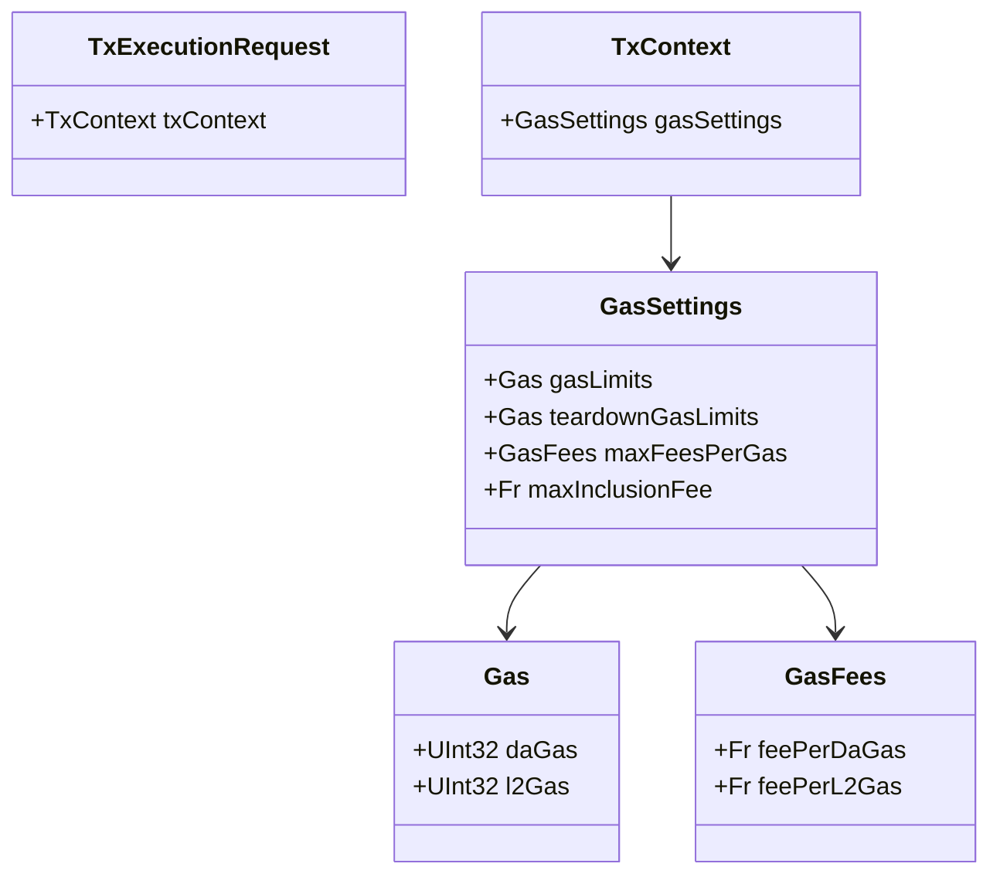
```mermaid
classDiagram
class TxExecutionRequest {
  +TxContext txContext
}

class TxContext {
  +GasSettings gasSettings
}

class GasSettings {
  +Gas gasLimits
  +Gas teardownGasLimits
  +GasFees maxFeesPerGas
  +Fr maxInclusionFee
}

class Gas {
  +UInt32 daGas
  +UInt32 l2Gas
}

class GasFees {
  +Fr feePerDaGas
  +Fr feePerL2Gas
}

TxContext --> GasSettings
GasSettings --> Gas
GasSettings --> GasFees
```

:::note
All fees are denominated in [Fee Juice](./fee-juice.md).
:::

## Gas Dimensions and Max Inclusion Fee

Transactions are metered for their gas consumption across two dimensions:

1. **Data Availability (DA) Gas**: This dimension measures data usage by the transaction, e.g. creating/spending notes, emitting logs, etc.
2. **Layer 2 (L2) Gas**: This dimension measures computation usage of the public VM.

This is similar to the gas model in Ethereum, where transaction consume gas to perform operations, and may also consume blob gas for storing data.

Separately, every transaction has overhead costs associated with it, e.g. verifying its encompassing rollup proof on L1, which are captured in the `maxInclusionFee`, which is not tied to gas consumption on the transaction, but is specified in FPA.

See the [Fee Schedule](./fee-schedule.md) for a detailed breakdown of costs associated with different actions.

## `gasLimits` and `teardownGasLimits`

Transactions can optionally have a "teardown" phase as part of their public execution, during which the "transaction fee" is available to public functions. This is useful to transactions/contracts that need to compute a "refund", e.g. contracts that facilitate [fee abstraction](./tx-setup-and-teardown.md).

Because the transaction fee must be known at the time teardown is executed, transactions must effectively "prepay" for the teardown phase. Thus, the `teardownGasLimits` are portions of the `gasLimits` that are reserved for the teardown phase.

For example, if a transaction has `gasLimits` of 1000 DA gas and 2000 L2 gas, and `teardownGasLimits` of 100 DA gas and 200 L2 gas, then the transaction will be able to consume 900 DA gas and 1800 L2 gas during the main execution phase, but 100 DA gas and 200 L2 gas **will be consumed** to cover the teardown phase: even if teardown does not consume that much gas, the transaction will still be charged for it; even if the transaction does not have a teardown phase, the gas will still be consumed.

## `maxFeesPerGas` and `feePerGas`

The `maxFeesPerGas` field specifies the maximum fees that the user is willing to pay per gas unit consumed in each dimension.

Separately, the **protocol** specifies the current `feePerGas` for each dimension, which is used to calculate the transaction fee.

These are held in the L2 blocks `Header`

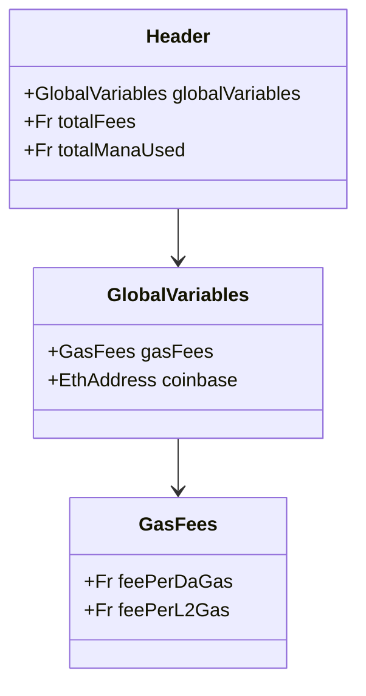
```mermaid
classDiagram
class Header {
  +GlobalVariables globalVariables
  +Fr totalFees
  +Fr totalManaUsed
}

class GlobalVariables {
  +GasFees gasFees
  +EthAddress coinbase
}

class GasFees {
  +Fr feePerDaGas
  +Fr feePerL2Gas
}

Header --> GlobalVariables
GlobalVariables --> GasFees
```

A transaction cannot be executed if the `maxFeesPerGas` is less than the `feePerGas` for any dimension.

The `feePerGas` is presently held constant at `1` for both dimensions, but may be updated in future protocol versions.

`totalFees` is the total fees collected in the block in FPA.

`totalManaUsed` is the total mana used in the block and used to update the base fee.

`coinbase` is the L1 address that receives the fees.

## Transaction Fee

The transaction fee is calculated as:

```
transactionFee = maxInclusionFee + (DA gas consumed * feePerDaGas) + (L2 gas consumed * feePerL2Gas)
```

:::note
Why is the "max" inclusion fee charged? We're working on a mechanism that will allow users to specify a maximum fee they are willing to pay, and the network will only charge them the actual fee. This is not yet implemented, so the "max" fee is always charged.
:::

See more on how the "gas consumed" values are calculated in the [Fee Schedule](./fee-schedule.md).

## Maximum Transaction Fee

The final transaction fee cannot be calculated until all public function execution is complete. However, a maximum theoretical fee can be calculated as:

```
maxTransactionFee = maxInclusionFee + (gasLimits.daGas * maxFeesPerDaGas) + (gasLimits.l2Gas * maxFeesPerL2Gas)
```

This is useful for imposing [validity conditions](./kernel-tracking.md#mempoolnode-validation).

## `fee_payer`

The `fee_payer` is the entity that pays the transaction fee.

It is effectively set in private by the contract that calls `context.set_as_fee_payer()`.

This manifests as a boolean flag `is_fee_payer` in the `PrivateCircuitPublicInputs`. The private kernel circuits will check this flag for every call stack item.

When a call stack item is found with `is_fee_payer` set, the kernel circuit will set `fee_payer` in its `PrivateKernelCircuitPublicInputs` to be the `callContext.contractAddress`.

This is subsequently passed through the `PublicKernelCircuitPublicInputs` to the `KernelCircuitPublicInputs`.

If the `fee_payer` is not set, the transaction will be considered invalid.

If a transaction attempts to set `fee_payer` multiple times, the transaction will be considered invalid.
---
title: Kernel Tracking
---

# Kernel Tracking

Gas and fees are tracked throughout the kernel circuits to ensure that users are charged correctly for their transactions.

## Private Kernel Circuits Overview

On the private side, the ordering of the circuits is:

1. PrivateKernelInit
2. PrivateKernelInner
3. PrivateKernelTail or PrivateKernelTailToPublic

The structs are (irrelevant fields omitted):

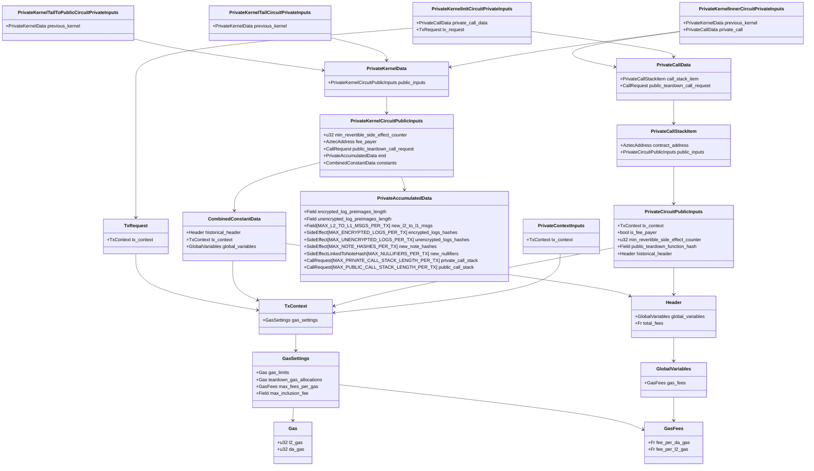
```mermaid
classDiagram

class PrivateContextInputs {
    +TxContext tx_context
}
PrivateContextInputs --> TxContext

class PrivateCallData {
    +PrivateCallStackItem call_stack_item
    +CallRequest public_teardown_call_request
}
PrivateCallData --> PrivateCallStackItem

class PrivateCallStackItem {
    +AztecAddress contract_address
    +PrivateCircuitPublicInputs public_inputs
}
PrivateCallStackItem --> PrivateCircuitPublicInputs

class PrivateCircuitPublicInputs {
  +TxContext tx_context
  +bool is_fee_payer
  +u32 min_revertible_side_effect_counter
  +Field public_teardown_function_hash
  +Header historical_header
}
PrivateCircuitPublicInputs --> TxContext
PrivateCircuitPublicInputs --> Header

class PrivateKernelCircuitPublicInputs {
    +u32 min_revertible_side_effect_counter
    +AztecAddress fee_payer
    +CallRequest public_teardown_call_request
    +PrivateAccumulatedData end
    +CombinedConstantData constants
}
PrivateKernelCircuitPublicInputs --> PrivateAccumulatedData
PrivateKernelCircuitPublicInputs --> CombinedConstantData

class PrivateAccumulatedData {
    +Field encrypted_log_preimages_length
    +Field unencrypted_log_preimages_length
    +Field[MAX_L2_TO_L1_MSGS_PER_TX] new_l2_to_l1_msgs
    +SideEffect[MAX_ENCRYPTED_LOGS_PER_TX] encrypted_logs_hashes
    +SideEffect[MAX_UNENCRYPTED_LOGS_PER_TX] unencrypted_logs_hashes
    +SideEffect[MAX_NOTE_HASHES_PER_TX] new_note_hashes
    +SideEffectLinkedToNoteHash[MAX_NULLIFIERS_PER_TX] new_nullifiers
    +CallRequest[MAX_PRIVATE_CALL_STACK_LENGTH_PER_TX] private_call_stack
    +CallRequest[MAX_PUBLIC_CALL_STACK_LENGTH_PER_TX] public_call_stack
}

class CombinedConstantData {
    +Header historical_header
    +TxContext tx_context
    +GlobalVariables global_variables
}
CombinedConstantData --> Header
CombinedConstantData --> TxContext

class Header {
    +GlobalVariables global_variables
    +Fr total_fees
}
Header --> GlobalVariables

class GlobalVariables {
    +GasFees gas_fees
}
GlobalVariables --> GasFees

class GasFees {
    +Fr fee_per_da_gas
    +Fr fee_per_l2_gas
}

class TxContext {
  +GasSettings gas_settings
}
TxContext --> GasSettings

class GasSettings {
    +Gas gas_limits
    +Gas teardown_gas_allocations
    +GasFees max_fees_per_gas
    +Field max_inclusion_fee
}
GasSettings --> Gas
GasSettings --> GasFees

class Gas {
    +u32 l2_gas
    +u32 da_gas
}

class TxRequest {
  +TxContext tx_context
}
TxRequest --> TxContext

class PrivateKernelInitCircuitPrivateInputs {
    +PrivateCallData private_call_data
    +TxRequest tx_request
}
PrivateKernelInitCircuitPrivateInputs --> PrivateCallData
PrivateKernelInitCircuitPrivateInputs --> TxRequest

class PrivateKernelInnerCircuitPrivateInputs {
    +PrivateKernelData previous_kernel
    +PrivateCallData private_call
}
PrivateKernelInnerCircuitPrivateInputs --> PrivateKernelData
PrivateKernelInnerCircuitPrivateInputs --> PrivateCallData

class PrivateKernelData {
    +PrivateKernelCircuitPublicInputs public_inputs
}
PrivateKernelData --> PrivateKernelCircuitPublicInputs

class PrivateKernelTailCircuitPrivateInputs {
    +PrivateKernelData previous_kernel
}
PrivateKernelTailCircuitPrivateInputs --> PrivateKernelData

class PrivateKernelTailToPublicCircuitPrivateInputs {
    +PrivateKernelData previous_kernel
}
PrivateKernelTailToPublicCircuitPrivateInputs --> PrivateKernelData

```

## Private Context Initialization

Whenever a private function is run, it has a `PrivateContext` associated with it, which is initialized in part from a `PrivateContextInputs` object.

The [gas settings that users specify](./specifying-gas-fee-info.md) become part of the values in the `TxContext` within the `PrivateContextInputs` of the [entrypoint](./tx-setup-and-teardown.md#defining-setup). These values are copied to the `PrivateCircuitPublicInputs`.

The same `TxContext` is provided as part of the `TxRequest` in the `PrivateKernelInitCircuitPrivateInputs`. This is done to ensure that the `TxContext` in the `PrivateCallData` (what was executed) matches the `TxContext` in the `TxRequest` (users' intent).

## Private Kernel Init

The PrivateKernelInit circuit takes in a `PrivateCallData` and a `TxRequest` and outputs a `PrivateKernelCircuitPublicInputs`.

It must:

- check that the `TxContext` provided as in the `TxRequest` input matches the `TxContext` in the `PrivateCallData`
- copy the `TxContext` from the `TxRequest` to the `PrivateKernelCircuitPublicInputs.constants.tx_context`
- copy the `Header` from the `PrivateCircuitPublicInputs` to the `PrivateKernelCircuitPublicInputs.constants.historical_header`
- set the min_revertible_side_effect_counter if it is present in the `PrivateCallData`
- set the `fee_payer` if the `is_fee_payer` flag is set in the `PrivateCircuitPublicInputs`
- set the `public_teardown_function_hash` if it is present in the `PrivateCircuitPublicInputs`
- set the `combined_constant_data.global_variables` to zero, since these are not yet known during private execution

## Private Kernel Inner

The PrivateKernelInner circuit takes in a `PrivateKernelData` and a `PrivateCallData` and ultimately outputs a `PrivateKernelCircuitPublicInputs`.

It must:

- set the `fee_payer` if the `is_fee_payer` flag is set in the `PrivateCircuitPublicInputs` (and is not set in the input `PrivateKernelData`)
- set the `public_teardown_function_hash` if it is present in the `PrivateCircuitPublicInputs` (and is not set in the input `PrivateKernelData`)
- copy the constants from the `PrivateKernelData` to the `PrivateKernelCircuitPublicInputs.constants`

## Private Kernel Tail

The PrivateKernelTail circuit takes in a `PrivateKernelData` and outputs a `KernelCircuitPublicInputs` (see diagram below).

This is only used when there are no enqueued public functions or public teardown functions.

It must:

- check that there are no enqueued public functions or public teardown function
- compute the gas used
  - this will only include DA gas _and_ any gas specified in the `teardown_gas_allocations`
- ensure the gas used is less than the gas limits
- ensure that `fee_payer` is set, and set it in the `KernelCircuitPublicInputs`
- copy the constants from the `PrivateKernelData` to the `KernelCircuitPublicInputs.constants`

:::note
Transactions without a public component can safely set their teardown gas allocations to zero. They are included as part of the gas computation in the private kernel tail for consistency (limits always include teardown gas allocations) and future-compatibility if we have a need for private teardown functions.
:::

## Private Kernel Tail to Public

The PrivateKernelTailToPublic circuit takes in a `PrivateKernelData` and outputs a `PublicKernelCircuitPublicInputs` (see diagram below).

This is only used when there are enqueued public functions or a public teardown function.

It must:

- check that there are enqueued public functions or a public teardown function
- partition the side effects produced during private execution into revertible and non-revertible sets of `PublicAccumulatedData`
- compute gas used for the revertible and non-revertible. Both sets can have a DA component, but the revertible set will also include the teardown gas allocations the user specified (if any). This ensures that the user effectively pre-pays for the gas consumed in teardown.
- ensure the gas used (across revertible and non-revertible) is less than the gas limits
- ensure that `fee_payer` is set, and set it in the `PublicKernelCircuitPublicInputs`
- set the `public_teardown_call_request` in the `PublicKernelCircuitPublicInputs`
- copy the constants from the `PrivateKernelData` to the `PublicKernelCircuitPublicInputs.constants`

## Mempool/Node Validation

A `Tx` broadcasted to the network has:

```
Tx {
    /**
     * Output of the private kernel circuit for this tx.
     */
    data: PrivateKernelTailCircuitPublicInputs,
    /**
     * Proof from the private kernel circuit.
     */
    proof: Proof,
    /**
     * Encrypted logs generated by the tx.
     */
    encryptedLogs: EncryptedTxL2Logs,
    /**
     * Unencrypted logs generated by the tx.
     */
    unencryptedLogs: UnencryptedTxL2Logs,
    /**
     * Enqueued public functions from the private circuit to be run by the sequencer.
     * Preimages of the public call stack entries from the private kernel circuit output.
     */
    enqueuedPublicFunctionCalls: PublicCallRequest[],
    /**
     * Public teardown function from the private circuit to be run by the sequencer.
     * Preimage of the public teardown function hash from the private kernel circuit output.
     */
    publicTeardownFunctionCall: PublicCallRequest,
}
```

Where the `PrivateKernelTailCircuitPublicInputs` may be destined for the base rollup (if there is no public component), or the public kernel circuits (if there is a public component).

Regardless, it has a `fee_payer` set.

When a node receives a transaction, it must check that:

1. the `fee_payer` is set
2. the `fee_payer` has a balance of [Fee Juice](./fee-juice.md) greater than the computed [transaction fee](./specifying-gas-fee-info.md#transaction-fee) if the transaction has no public component
3. the `fee_payer` has a balance of FPA greater than the computed [max transaction fee](./specifying-gas-fee-info.md#maximum-transaction-fee) if the transaction has a public component

See other [validity conditions](../transactions/validity.md).

## Public Kernel Circuits

On the public side, the order of the circuits is:

1. PublicKernelSetup
2. PublicKernelAppLogic
3. PublicKernelTeardown
4. PublicKernelTail

The structs are (irrelevant fields omitted):

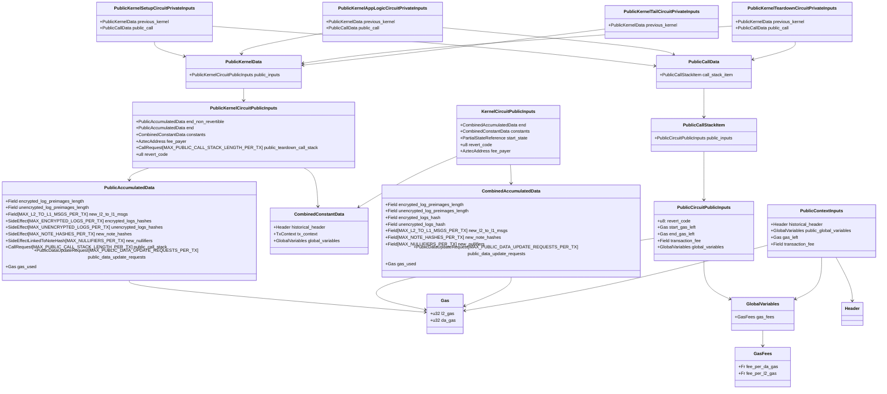
```mermaid
classDiagram

class Gas {
    +u32 l2_gas
    +u32 da_gas
}

class PublicKernelSetupCircuitPrivateInputs {
  +PublicKernelData previous_kernel
  +PublicCallData public_call
}
PublicKernelSetupCircuitPrivateInputs --> PublicKernelData
PublicKernelSetupCircuitPrivateInputs --> PublicCallData

class PublicKernelData {
  +PublicKernelCircuitPublicInputs public_inputs
}
PublicKernelData --> PublicKernelCircuitPublicInputs

class PublicKernelCircuitPublicInputs {
  +PublicAccumulatedData end_non_revertible
  +PublicAccumulatedData end
  +CombinedConstantData constants
  +AztecAddress fee_payer
  +CallRequest[MAX_PUBLIC_CALL_STACK_LENGTH_PER_TX] public_teardown_call_stack
  +u8 revert_code
}
PublicKernelCircuitPublicInputs --> PublicAccumulatedData
PublicKernelCircuitPublicInputs --> CombinedConstantData

class CombinedConstantData {
    +Header historical_header
    +TxContext tx_context
    +GlobalVariables global_variables
}

class PublicAccumulatedData {
    +Field encrypted_log_preimages_length
    +Field unencrypted_log_preimages_length
    +Field[MAX_L2_TO_L1_MSGS_PER_TX] new_l2_to_l1_msgs
    +SideEffect[MAX_ENCRYPTED_LOGS_PER_TX] encrypted_logs_hashes
    +SideEffect[MAX_UNENCRYPTED_LOGS_PER_TX] unencrypted_logs_hashes
    +SideEffect[MAX_NOTE_HASHES_PER_TX] new_note_hashes
    +SideEffectLinkedToNoteHash[MAX_NULLIFIERS_PER_TX] new_nullifiers
    +CallRequest[MAX_PUBLIC_CALL_STACK_LENGTH_PER_TX] public_call_stack
    +PublicDataUpdateRequest[MAX_PUBLIC_DATA_UPDATE_REQUESTS_PER_TX] public_data_update_requests
    +Gas gas_used
}
PublicAccumulatedData --> Gas

class PublicCallData {
    +PublicCallStackItem call_stack_item
}
PublicCallData --> PublicCallStackItem

class PublicCallStackItem {
    +PublicCircuitPublicInputs public_inputs
}
PublicCallStackItem --> PublicCircuitPublicInputs

class PublicCircuitPublicInputs {
    +u8: revert_code
    +Gas start_gas_left
    +Gas end_gas_left
    +Field transaction_fee
    +GlobalVariables global_variables
}
PublicCircuitPublicInputs --> Gas
PublicCircuitPublicInputs --> GlobalVariables

class PublicKernelAppLogicCircuitPrivateInputs {
  +PublicKernelData previous_kernel
  +PublicCallData public_call
}
PublicKernelAppLogicCircuitPrivateInputs --> PublicKernelData
PublicKernelAppLogicCircuitPrivateInputs --> PublicCallData

class PublicKernelTeardownCircuitPrivateInputs {
  +PublicKernelData previous_kernel
  +PublicCallData public_call
}
PublicKernelTeardownCircuitPrivateInputs --> PublicKernelData
PublicKernelTeardownCircuitPrivateInputs --> PublicCallData

class PublicKernelTailCircuitPrivateInputs {
  +PublicKernelData previous_kernel
}
PublicKernelTailCircuitPrivateInputs --> PublicKernelData

class KernelCircuitPublicInputs {
  +CombinedAccumulatedData end
  +CombinedConstantData constants
  +PartialStateReference start_state
  +u8 revert_code
  +AztecAddress fee_payer
}
KernelCircuitPublicInputs --> CombinedAccumulatedData
KernelCircuitPublicInputs --> CombinedConstantData


class CombinedAccumulatedData {
  +Field encrypted_log_preimages_length
  +Field unencrypted_log_preimages_length
  +Field encrypted_logs_hash
  +Field unencrypted_logs_hash
  +Field[MAX_L2_TO_L1_MSGS_PER_TX] new_l2_to_l1_msgs
  +Field[MAX_NOTE_HASHES_PER_TX] new_note_hashes
  +Field[MAX_NULLIFIERS_PER_TX] new_nullifiers
  +PublicDataUpdateRequest[MAX_PUBLIC_DATA_UPDATE_REQUESTS_PER_TX] public_data_update_requests
  +Gas gas_used
}
CombinedAccumulatedData --> Gas

class PublicContextInputs {
    +Header historical_header
    +GlobalVariables public_global_variables
    +Gas gas_left
    +Field transaction_fee
}
PublicContextInputs --> Header
PublicContextInputs --> GlobalVariables
PublicContextInputs --> Gas

class GlobalVariables {
    +GasFees gas_fees
}
GlobalVariables --> GasFees

class GasFees {
    +Fr fee_per_da_gas
    +Fr fee_per_l2_gas
}

```

## Public Context Initialization

Whenever a public function is run, it has a `PublicContext` associated with it, which is initialized in part from a `PublicContextInputs` object.

The sequencer must provide information including the current `gas_fees`, the current `gas_left`, and the `transaction_fee`, but we cannot trust these values to be correct: we must compute the correct values in the public kernel circuits, and validate that the sequencer provided the correct values.

Further, the sequencer is only obligated to provide the `transaction_fee` to the teardown function, as that is the only point at which the transaction fee can be known.

## Public Circuit Public Inputs

The "outputs" of the public functions are coming from the public VM.

Therefore, once we verify that the `start_gas_left` which the sequencer provided is correct, we can trust the `end_gas_left` that the public VM reports.

Further, we can trust that the `transaction_fee` the public VM reported is the one which was made available to the public functions during teardown (though we must verify that the sequencer provided the correct value).

The `PublicCircuitPublicInputs` include the `global_variables` as injected via the `PublicContextInputs`. The first public kernel circuit to run, regardless of whether it is a setup, app, or teardown kernel, is responsible for setting its `constant_data.global_variables` equal to these. All subsequent public kernel circuit runs must verify that the `global_variables` from the `PublicCircuitPublicInputs` match the ones from the previously set `constant_data.global_variables`.

## Public Kernel Setup

The PublicKernelSetup circuit takes in a `PublicKernelData` and a `PublicCallData` and outputs a `PublicKernelCircuitPublicInputs`.

It must assert that the `revert_code` in the `PublicCircuitPublicInputs` is equal to zero.

It must assert that the `public_call.call_stack_item.public_inputs.global_variables.gas_fees` are valid according to the [update rules defined](./published-gas-and-fee-data.md#updating-the-gasfees-object).

It must compute the gas used in the `PublicKernelData` provided, and verify that the `gas_limits` in the `PublicKernelData`'s `TxContext` _minus_ the computed `gas_used` is equal to the `start_gas_left` specified on the `PublicCircuitPublicInputs`.

This ensures that the public VM was provided with the correct starting gas values.

It must update the gas used in `end_non_revertible` as:

```rust
# assume the previous PublicKernelCircuitPublicInputs was copied to circuit_outputs
pub fn update_non_revertible_gas_used(public_call: PublicCallData, circuit_outputs: &mut PublicKernelCircuitPublicInputsBuilder) {
    let tx_gas_limits = circuit_outputs.constants.tx_context.gas_settings.gas_limits;
    let call_gas_left = public_call.call_stack_item.public_inputs.end_gas_left;
    let accum_end_gas_used = circuit_outputs.end.gas_used;

    circuit_outputs.end_non_revertible.gas_used = tx_gas_limits
        .sub(call_gas_left)
        .sub(accum_end_gas_used);
}
```

:::note global gas limit for all enqueued public calls
**Within** the AVM, users may specify gas limits for each public function call. This **does not apply** to the "top-level" enqueued call: they all pull from the same global gas limit, and there is no way to "catch" an "out of gas" at this top-level apart from reverting.
:::

## Public Kernel App Logic

The PublicKernelAppLogic circuit takes in a `PublicKernelData` and a `PublicCallData` and outputs a `PublicKernelCircuitPublicInputs`.

It must perform the same computation as the PublicKernelSetup regarding verification of the `start_gas_left` and the `gas_fees`.

It must check the `revert_code` in the `PublicCircuitPublicInputs`.

### If the `revert_code` is zero

Instead of updating `end_non_revertible`, it must update `end` as:

```rust
# assume the previous PublicKernelCircuitPublicInputs was copied to circuit_outputs
pub fn update_revertible_gas_used(public_call: PublicCallData, circuit_outputs: &mut PublicKernelCircuitPublicInputsBuilder) {
    let tx_gas_limits = circuit_outputs.constants.tx_context.gas_settings.gas_limits;
    let call_gas_left = public_call.call_stack_item.public_inputs.end_gas_left;
    let accum_end_non_revertible_gas_used = circuit_outputs.end_non_revertible.gas_used;

    circuit_outputs.end.gas_used = tx_gas_limits
        .sub(call_gas_left)
        .sub(accum_end_non_revertible_gas_used);
}
```

### If the `revert_code` is non-zero

All side effects from the `revertible` set are discarded.

It consumes all the gas left:

```rust
# assume the previous PublicKernelCircuitPublicInputs was copied to circuit_outputs
pub fn update_revertible_gas_used(public_call: PublicCallData, circuit_outputs: &mut PublicKernelCircuitPublicInputsBuilder) {
    let tx_gas_limits = circuit_outputs.constants.tx_context.gas_settings.gas_limits;
    let accum_end_non_revertible_gas_used = circuit_outputs.end_non_revertible.gas_used;

    circuit_outputs.end.gas_used = tx_gas_limits
        .sub(accum_end_non_revertible_gas_used);
}
```

It sets the `revert_code` in `PublicKernelCircuitPublicInputs` to `1`.

:::note Gas reserved for public teardown
Recall in the [Private Kernel Tail to Public](#private-kernel-tail-to-public) circuit, the gas allocated for the public teardown function was included in the `end` gas used. This ensures that we have gas available for teardown even though app logic consumed all gas.
:::

:::warning
Consuming all gas left in the event of revert creates incentives for the sequencer to arrange transactions such that they revert, which is suboptimal. Future improvements will likely address this by only consuming the gas that was actually used, even in the event of revert.
:::

## Public Kernel Teardown

The PublicKernelTeardown circuit takes in a `PublicKernelData` and a `PublicCallData` and outputs a `PublicKernelCircuitPublicInputs`.

It must perform the same computation as the PublicKernelSetup regarding verification of the `gas_fees`.

It must assert that the `start_gas_left` is equal to the PublicKernelData's `public_inputs.constants.tx_context.gas_settings.teardown_gas_allocations`

It must also compute the gas used in the `PublicKernelData` provided, and the [transaction fee](./specifying-gas-fee-info.md#transaction-fee) using this computed value, then verify that the `transaction_fee` in the `PublicCircuitPublicInputs` is equal to the computed transaction fee.

This ensures that the public VM was provided with the correct transaction fee, and that teardown did not exceed the gas limits.

### Handling reverts

Teardown is attempted even if the app logic failed.

The teardown kernel can see if the app logic failed by checking if `revert_code` in the `PublicKernelCircuitPublicInputs` is set to `1`.

It also has access to the `revert_code` reported by the AVM of the current call within `PublicCircuitPublicInputs`.

The interplay between these two `revert_code`s is as follows:

| Kernel `revert_code` | current AVM `revert_code` | Resulting Kernel `revert_code` |
| -------------------- | ------------------------- | ------------------------------ |
| 0                    | 0                         | 0                              |
| 1                    | 0                         | 1                              |
| 0                    | 1                         | 2                              |
| 1                    | 1                         | 3                              |
| 2 or 3               | (any)                     | (unchanged)                    |

## Rollup Kernel Circuits

The base rollup kernel circuit takes in a `KernelData`, which contains a `KernelCircuitPublicInputs`, which it uses to compute the `transaction_fee`.

Additionally, it verifies that the max fees per gas specified by the user are greater than the current block's fees per gas. It also verifies the `constant_data.global_variables.gas_fees` are correct.

After the public data writes specific to this transaction have been processed, and a new tree root is produced, the kernel circuit injects an additional public data write based upon that root which deducts the transaction fee from the `fee_payer`'s balance.

The calculated trasaction fee is set as output on the base rollup as `accumulated_fees`. Each subsequent merge rollup circuit sums this value from both of its inputs. The root rollup circuit then uses this value to set the `total_fees` in the `Header`.
---
title: Fee Juice
---

# Fee Juice

Fee Juice is an enshrined asset in the Aztec network that is used to pay fees.

It has several important properties:

- It is fungible
- It cannot be transferred between accounts on the Aztec network
- It is obtained on Aztec via a bridge from Ethereum
- It only has public balances

All transactions on the Aztec network have a [non-zero transaction_fee](./fee-schedule.md#da-gas), denominated in FPA, which must be paid for the transaction to be included in the block.

When a block is successfully published on L1, the sequencer is paid on L1 the sum of all transaction fees in the block, denominated in FPA.

:::danger
We need a definition of the L1 fee juice.
:::
---
title: Transaction Setup and Teardown
---

# Transaction Setup and Teardown

All transactions on the Aztec network have a private component, which is processed locally, and optionally have a public component, which is processed by sequencers using the [Public VM (AVM)](../public-vm/intro.md).

Transactions are broken into distinct phases:

1. Private setup
2. Private app logic
3. Public setup
4. Public app logic
5. Public teardown
6. Base rollup

The private setup phase is used to specify what public function will be called for public teardown, and what entity will pay the transaction fee (i.e. the `fee_payer`).

The "setup" phases are "non-revertible", meaning that if execution fails, the transaction is considered invalid and cannot be included in a block.

If execution fails in the private app logic phase, the user will not be able to generate a valid proof of their private computation, so the transaction will not be included in a block.

If the execution fails in the public app logic the _side effects_ from private app logic and public app logic will be reverted, but the transaction can still be included in a block. Execution then proceeds to the public teardown phase.

If the execution fails in the public teardown phase, the _side effects_ from private app logic, public app logic, and public teardown will be reverted, but the transaction can still be included in a block. Execution then proceeds to the base rollup phase.

In the event of a failure in public app logic or teardown, the user is charged their full [gas limit](./specifying-gas-fee-info.md#gaslimits-and-teardowngaslimits) for the transaction across all dimensions.

The public teardown phase is the only phase where the final transaction fee is available to public functions. [See more](./specifying-gas-fee-info.md#gaslimits-and-teardowngaslimits).

In the base rollup, the kernel circuit injects a public data write that levies the transaction fee on the `fee_payer`.

## An example: Fee Abstraction

Consider a user, Alice, who does not have FPA but wishes to interact with the network. Suppose she has a private balance of a fictitious asset "BananaCoin" that supports public and private balances.

Suppose there is a Fee Payment Contract (FPC) that has been deployed by another user to the network. Alice can structure her transaction as follows:

0. Before the transaction, Alice creates a private authwit in her wallet, allowing the FPC to transfer to public a specified amount of BananaCoin from Alice's private balance to the FPC's public balance.
1. Private setup:
   - Alice calls a private function on the FPC which is exposed for public fee payment in BananaCoin.
   - The FPC checks that the amount of teardown gas Alice has allocated is sufficient to cover the gas associated with the teardown function it will use to provide a refund to Alice.
   - The FPC specifies its teardown function as the one the transaction will use.
   - The FPC enqueues a public call to itself for the public setup phase.
   - The FPC designates itself as the `fee_payer`.
2. Private app logic:
   - Alice performs an arbitrary computation in private, potentially consuming DA gas.
3. Public setup:
   - The FPC transfers the specified amount of BananaCoin from Alice to itself.
4. Public app logic:
   - Alice performs an arbitrary computation in public, potentially consuming DA and L2 gas.
5. Public teardown:
   - The FPC looks at `transaction_fee` to compute Alice's corresponding refund of BananaCoin.
   - The FPC transfers the refund to Alice via a partial note.
6. Base rollup:
   - The Base rollup kernel circuit injects a public data write that levies the transaction fee on the `fee_payer`.

This illustrates the utility of the various phases. In particular, we see why the setup phase must not be revertible: if Alice's public app logic fails, the FPC is still going to pay the fee in the base rollup; if public setup were revertible, the transfer of Alice's BananaCoin would revert so the FPC would be losing money.

## Sequencer Whitelisting

Because a transaction is invalid if it fails in the public setup phase, sequencers are taking a risk by processing them. To mitigate this risk, it is expected that sequencers will only process transactions that use public functions that they have whitelisted.

## Defining Setup

The private function that is executed first is referred to as the "entrypoint".

Tracking which side effects belong to setup versus app logic is done by keeping track of [side effect counters](../circuits/private-kernel-initial#processing-a-private-function-call), and storing the value of the counter at which the setup phase ends within the private context.

This value is stored in the `PrivateContext` as the `min_revertible_side_effect_counter`, and is set by calling `context.end_setup()`.

This is converted into the `PrivateCircuitPublicInputs` as `min_revertible_side_effect_counter`.

Execution of the entrypoint is always verified/processed by the `PrivateKernelInit` circuit.

It is only the `PrivateKernelInit` circuit that looks at the `min_revertible_side_effect_counter` as reported by `PrivateCirclePublicInputs`, and thus it is only the entrypoint that can effectively call `context.end_setup()`.

## Defining Teardown

At any point during private execution, a contract may call `context.set_public_teardown_function` to specify a public function that will be called during the public teardown phase. This function takes the same arguments as `context.call_public_function`, but does not have a side effect counter associated with it.

Similar to `call_public_function`, this results in the hash of a `PublicCallStackItem` being set on `PrivateCircuitPublicInputs` as `public_teardown_function_hash`.

The private kernel circuits will verify that this hash is set at most once.

## Interpreting the `min_revertible_side_effect_counter`

Notes, nullifiers, and logs are examples of side effects that are partitioned into setup and app logic.

[Enqueueing a public function](../calls/enqueued-calls.md) from private is also a side effect: if the counter associated with an enqueued public function is less than the `min_revertible_side_effect_counter`, the public function will be executed during the public setup phase, otherwise it will be executed during the public app logic phase.

As mentioned above, setting the public teardown function is not a side effect.

If a transaction has enqueued public functions, or has a public teardown function, then during the PrivateKernelTailToPublic the `min_revertible_side_effect_counter` is used to partition the side effects produced during private execution into revertible and non-revertible sets on the `PublicKernelCircuitPublicInputs`, i.e. `end` and `end_non_revertible`.

The public teardown function is set on the `PublicKernelCircuitPublicInputs` as `public_teardown_function_hash`.

If a transaction does not have any enqueued public functions, and does not have a public teardown function, then the `PrivateKernelTail` is used instead of the `PrivateKernelTailToPublic`, and no partitioning is done.
# Fee Schedule

The [transaction fee](./specifying-gas-fee-info.md#transaction-fee) is comprised of a DA component, an L2 component, and an inclusion fee. The DA and L2 components are calculated by multiplying the gas consumed in each dimension by the respective `feePerGas` value. The inclusion fee is a fixed cost associated with the transaction, which is used to cover the cost of verifying the encompassing rollup proof on L1.

## DA Gas

DA gas is consumed to cover the costs associated with publishing data associated with a transaction.

These data include:

- new note hashes
- new nullifiers
- new l2 -> l1 message hashes
- new public data writes
- new logs
- protocol metadata (e.g. the amount of gas consumed, revert code, etc.)

The DA gas used is then calculated as:

```
DA_BYTES_PER_FIELD = 32
DA_GAS_PER_BYTE = 16
FIXED_DA_GAS = 512

# FIXED_DA_GAS covers the protocol metadata,
# which should remain less than 512/16 = 32 bytes

da_gas_per_field = DA_BYTES_PER_FIELD * DA_GAS_PER_BYTE

note_hash_gas = da_gas_per_field * (number of notes)
nullifier_gas = da_gas_per_field * (number of nullifiers)
l2_to_l1_message_gas = da_gas_per_field * (number of l2_to_l1_messages)

# public data writes specify a value and index
public_data_writes_gas = 2 * da_gas_per_field * (number of public_data_writes)

log_gas = DA_GAS_PER_BYTE * (unencrypted_log_preimages_length + encrypted_log_preimages_length)

da_gas_used = FIXED_DA_GAS +
                note_hash_gas +
                nullifier_gas +
                l2_to_l1_message_gas +
                public_data_writes_gas +
                log_gas +
                teardown_da_gas
```

:::note Non-zero `transaction_fees`
A side effect of the above calculation is that all transactions will have a non-zero `transaction_fee`.
:::

## L2 Gas

L2 gas is consumed to cover the costs associated with executing the public VM, proving the public VM circuit, and proving the public kernel circuit.

It is also consumed to perform fixed, mandatory computation that must be performed per transaction by the sequencer, regardless of what the transaction actually does; examples are TX validation and updating state roots in trees.

The public vm has an [instruction set](../public-vm/instruction-set.mdx) with opcode level gas metering to cover the cost of actions performed within the public VM.

Additionally, there is a fixed cost associated with each iteration of the public VM (i.e. the number of enqueued public function calls, plus 1 if there is a teardown function), which is used to cover the cost of proving the public VM circuit.

The L2 gas used is then calculated as:

```
FIXED_L2_GAS = 512
FIXED_AVM_STARTUP_L2_GAS = 1024


num_avm_invocations = (number of enqueued public function calls) +
                      (is there a teardown function ? 1 : 0)

l2_gas_used = FIXED_L2_GAS
                + FIXED_AVM_STARTUP_L2_GAS * num_avm_invocations
                + teardown_l2_gas
                + (gas reported as consumed by the public VM)
```

### L2 Gas from Private

Private execution also consumes L2 gas, because there is still work that needs to be performed by the sequencer correspondent to the private outputs, which is effectively L2 gas. The following operations performed in private execution will consume L2 gas:

- 32 L2 gas per note hash
- 64 L2 gas per nullifier
- 4 L2 gas per byte of logs (note encrypted, encrypted, and unencrypted)

## Max Inclusion Fee

Each transaction, and each block, has inescapable overhead costs associated with it which are not directly related to the amount of data or computation performed.

These costs include:

- verifying the private kernel proof of each transaction
- executing/proving the base/merge/root rollup circuits
  - includes verifying that every new nullifier is unique across the tx/block
  - includes processing l2->l1 messages of each transaction, even if they are empty (and thus have no DA gas cost)
  - includes ingesting l1->l2 messages that were posted during the previous block
  - injecting a public data write to levy the transaction fee on the `fee_payer`
- publishing the block header to the rollup contract on L1
  - includes verification of the rollup proof
  - includes insertion of the new root of the l2->l1 message tree into the L1 Outbox
  - consumes the pending messages in the L1 Inbox
- publishing the block header to DA

See [the l1 contracts section](../l1-smart-contracts/index.md) for more information on the L1 Inbox and Outbox.

Users cover these costs by [specifying an inclusion fee](./specifying-gas-fee-info.md#specifying-gas--fee-info), which is different from other parameters specified in that it is a fixed fee offered to the sequencer, denominated in [Fee Juice](./fee-juice.md).

Even though these line items will be the same for every transaction in a block, the **cost** to the sequencer will vary, particularly based on:

- congestion on L1
- prevailing price of proof generation

A price discovery mechanism is being developed to help users set the inclusion fee appropriately.
---
title: Logs
---

<!-- Did we resolve how to prevent impersonation for all kinds of log? -->
<!-- We have a DoS problem, if a user sends a huge, malicious log preimage which DOES NOT hash to the logs_hash in the public inputs. The sequencer wastes time computing the hash, but cannot include the hash in their tx. -->

Logs on Aztec are similar to logs on Ethereum, enabling smart contracts to convey arbitrary data to external entities. Offchain applications can use logs to interpret events that have occurred on-chain. There are three types of log:

- [Unencrypted log](#unencrypted-log).
- [Encrypted log](#encrypted-log).
- [Encrypted note preimage](#encrypted-note-preimage).

## Requirements

1. **Availability**: The logs get published.

   A rollup proof won't be accepted by the rollup contract if the log preimages are not available. Similarly, a sequencer cannot accept a transaction unless log preimages accompany the transaction data.

2. **Immutability**: A log cannot be modified once emitted.

   The protocol ensures that once a proof is generated at any stage (for a function, transaction, or block), the emitted logs are tamper-proof. In other words, only the original log preimages can generate the committed hashes in the proof.

3. **Integrity**: A contract cannot impersonate another contract.

   Every log is emitted by a specific contract, and users need assurances that a particular log was indeed generated by a particular contract (and not some malicious impersonator contract). The protocol ensures that the source contract's address for a log can be verified, while also preventing the forging of the address.

## Log Hash

### Hash Function

The protocol uses **SHA256** as the hash function for logs, and then reduces the 256-bit result to 248 bits for representation as a field element.

<!-- TODO: explicitly detail how the truncation is being done, so that we can check that it is secure. -->

Throughout this page, `hash(value)` is an abbreviated form of: `truncate_to_field(SHA256(value))`

### Hashing

Regardless of the log type, the log hash is derived from an array of fields, calculated as:

`hash(log_preimage[0], log_preimage[1], ..., log_preimage[N - 1])`

Here, _log_preimage_ is an array of field elements of length `N`, representing the data to be broadcast.

#### Emitting Logs from Function Circuits

<!-- Q: should we push to public inputs, or to the data bus? Also, what if instead, the circuits _don't_ compute a hash for each log, but instead push all of the raw log fields to the data bus, to be hashed by the sequencer later (or by a reset circuit if the bus grows too big)? -->

A function can emit an arbitrary number of logs, provided they don't exceed the specified [limit] <!-- TODO: missing explanation on what this limit is -->. The function circuits must compute a hash for each log, and push all the hashes into the public inputs for further processing by the protocol circuits.

#### Aggregation in Protocol Circuits

<!-- TODO: there might be length extension attacks with this approach. We might need to encode the length of each log into the accumulated logs hash, rather than sum the lengths separately. Otherwise, there might be a way to pretend a message of length 7 was actually two messages of length 3 and 4 (for example) -->

To minimize the on-chain verification data size, protocol circuits aggregate log hashes. The end result is a single hash within the base rollup proof, encompassing all logs of the same type.

Each protocol circuit outputs two values for each log type:

- _`accumulated_logs_hash`_: A hash representing all logs.
- _`accumulated_logs_length`_: The total length of all log preimages.

Both the `accumulated_logs_hash` and `accumulated_logs_length` for each type are included in the base rollup's `txs_effect_hash`. When rolling up to merge and root circuits, the two input proof's `txs_effect_hash`es are hashed together to form the new value of `txs_effect_hash`.

When publishing a block on L1, the raw logs of each type and their lengths are provided (**Availability**), hashed and accumulated into each respective `accumulated_logs_hash` and `accumulated_logs_length`, then included in the on-chain recalculation of `txs_effect_hash`. If this value doesn't match the one from the rollup circuits, the block will not be valid (**Immutability**).

<!-- 
In cases where two proofs are combined to form a single proof, the _accumulated_logs_hash_ and _accumulated_logs_length_ from the two child proofs must be merged into one accumulated value:

- _`accumulated_logs_hash = hash(proof_0.accumulated_logs_hash, proof_1.accumulated_logs_hash)`_
  - If either hash is zero, the new hash will be _`proof_0.accumulated_logs_hash | proof_1.accumulated_logs_hash`_.
- _`accumulated_logs_length = proof_0.accumulated_logs_length + proof_1.accumulated_logs_length`_ 
-->

For private and public kernel circuits, beyond aggregating logs from a function call, they ensure that the contract's address emitting the logs is linked to the _logs_hash_. For more details, refer to the "Hashing" sections in [Unencrypted Log](#hashing-1), [Encrypted Log](#hashing-2), and [Encrypted Note Preimage](#hashing-3).

## Unencrypted Log

Unencrypted logs are used to communicate public information out of smart contracts. They can be emitted from both public and private functions.

:::info
Emitting unencrypted logs from private functions may pose a privacy leak. However, in-protocol restrictions are intentionally omitted to allow for potentially valuable use cases, such as custom encryption schemes utilizing Fully Homomorphic Encryption (FHE), and similar scenarios.
:::

### Hashing

Following the iterations for all private or public calls, the tail kernel circuits hash each log hash with the contract contract before computing the _accumulated_logs_hash_.

1. Hash the _contract_address_ to each _log_hash_:

   - _`log_hash_a = hash(contract_address_a, log_hash_a)`_
   - Repeat the process for all _log_hashes_ in the transaction.

2. Accumulate all the hashes and output the final hash to the public inputs:

   - `accumulated_logs_hash = hash(log_hash[0], log_hash[1], ..., log_hash[N - 1])` for N logs.

### Encoding

The following represents the encoded data for an unencrypted log:

_`log_data = [log_preimage_length, contract_address, ...log_preimage]`_

### Verification

```js
function hash_log_data(logs_data) {
  const log_preimage_length = logs_data.read_u32();
  logs_data.accumulated_logs_length += log_preimage_length;
  const contract_address = logs_data.read_field();
  const log_preimage = logs_data.read_fields(log_preimage_length);
  const log_hash = hash(...log_preimage);
  return hash(log_hash, contract_address);
}
```

## Encrypted Log

Encrypted logs contain information encrypted using the recipient's key. They can only be emitted from private functions. This restriction is due to the necessity of obtaining a secret for log encryption, which is challenging to manage privately in a public domain.

### Hashing

Private kernel circuits ensure the association of the contract address with each encrypted _log_hash_. However, unlike unencrypted logs, submitting encrypted log preimages with their contract address poses a significant privacy risk. Therefore, instead of using the _contract_address_, a _masked_contract_address_ is generated for each encrypted _log_hash_.

The _masked_contract_address_ is a hash of the _contract_address_ and a random value _randomness_, computed as:

_`masked_contract_address = hash(contract_address, randomness)`_.

Here, _randomness_ is generated in the private function circuit and supplied to the private kernel circuit. The value must be included in the preimage for encrypted log generation. The private function circuit is responsible for ensuring that the _randomness_ differs for every encrypted log to avoid potential information linkage based on identical _masked_contract_address_.

After successfully decrypting an encrypted log, one can use the _randomness_ in the log preimage, hash it with the _contract_address_, and verify it against the _masked_contract_address_ to ascertain that the log originated from the specified contract.

1. Hash the _contract_address_tag_ to each _log_hash_:

   - _`masked_contract_address_a = hash(contract_address_a, randomness)`_
   - _`log_hash_a = hash(contract_address_tag_a, log_hash_a)`_
   - Repeat the process for all _log_hashes_ in the transaction.

2. Accumulate all the hashes in the tail and outputs the final hash to the public inputs:

   - `accumulated_logs_hash = hash(log_hash[0], log_hash[1], ..., log_hash[N - 1])` for N logs, with hashes defined above.

Note that, in some cases, the user may want to reveal which contract address the encrypted log came from. Providing a `randomness` value of 0 signals that we should not mask the address, so in this case the log hash is simply:

_`log_hash_a = hash(contract_address_a, log_hash_a)`_

### Encoding

The following represents the encoded data for an encrypted log:

_`log_data = [log_preimage_length, masked_contract_address, ...log_preimage]`_

### Verification

```js
function hash_log_data(logs_data) {
  const log_preimage_length = logs_data.read_u32();
  logs_data.accumulated_logs_length += log_preimage_length;
  const contract_address_tag = logs_data.read_field();
  const log_preimage = logs_data.read_fields(log_preimage_length);
  const log_hash = hash(...log_preimage);
  return hash(log_hash, contract_address_tag);
}
```

## Encrypted Note Preimage

Similar to [encrypted logs](#encrypted-log), encrypted note preimages are data that only entities possessing the keys can decrypt to view the plaintext. Unlike encrypted logs, each encrypted note preimage can be linked to a note, whose note hash can be found in the block data.

> Note that a note can be "shared" to one or more recipients by emitting one or more encrypted note preimages. However, this is not mandatory, and there may be no encrypted preimages emitted for a note if the information can be obtain through alternative means.

### Hashing

As each encrypted note preimage can be associated with a note in the same transaction, enforcing a _contract_address_tag_ is unnecessary. Instead, by calculating the _note_hash_ using the decrypted note preimage, hashed with the _contract_address_, and verify it against the block data, the recipient can confirm that the note was emitted from the specified contract.

The kernel circuit simply accumulates all the hashes:

- `accumulated_logs_hash = hash(log_hash[0], log_hash[1], ..., log_hash[N - 1])` for N logs.

### Encoding

The following represents the encoded data for an unencrypted note preimage:

_`log_data = [log_preimage_length, ...log_preimage]`_

### Verification

```js
function hash_log_data(logs_data) {
  const log_preimage_length = logs_data.read_u32();
  logs_data.accumulated_logs_length += log_preimage_length;
  const log_preimage = logs_data.read_fields(log_preimage_length);
  return hash(...log_preimage);
}
```

## Log Encryption

Refer to [Private Message Delivery](../private-message-delivery/index.md) for detailed information on generating encrypted data.
---
title: Bytecode
---

<!-- Mike review:
- Does Noir have detailed opcode specs for ACIR/Brillig? Where should we write specs for the bytecode, and the encodings of the bytecode, and the compression algorithms for the bytecode, and for the artifacts?

(Alvaro) Maybe we should write a spec of Acir and Brillig? I think noir doesn't have one. Currently the encoding is shared between the acvm_repo and barretenberg, it's using bincode + gzip and serde-reflect to make it cross-language. It feels weird that aztec specs out Acir and Brillig.

- We mention compressing bytecode. We should specify how compression is encoded (because all nodes will need to follow a compression and decompression standard). Is there a prefix to convey the type & version of compression that's been used? How is the length of a blob of bytecode conveyed?

(Alvaro) Palla will add how the length and other properties of the bytecode are broadcasted through the registrar contract but basically it's putting the length as the first field before the serialized bytecode starts. The serialized bytecode is the one outputted by Circuit::serialize in the acvm_repo.


- This section needs to align with some descriptions in the `contract-deployment/*` section. It might be worth liaising with Palla, to see which section should describe the following: hashing of bytecode (how is it hashed), committing to bytecode (how is it committed-to (although perhaps this belongs in the avm section)), the desired contents of an artifact, how is an artifact hashed? And for the artifact, for a particular function, what information is included?

(Alvaro)
 - Hashing of bytecode => It's done in the deployment section, I have linked to it in the relevant section.
 - Commiting to bytecode => Will follow up on this, I see a KZG commitment in the AVM section but I'm not sure that will be verified in the registrar contract.
 - Desired contents of an artifact => I have added a section with the desired contents of an artifact.
 - How is an artifact hashed? => I have added a link to the deployment section that specifies it.
 - For the artifact, for a particular function, what information is included? => I have added a section with the desired contents of an artifact that includes this information.


-->

This section describes how contracts are represented within the protocol for execution.

In the context of Aztec, a contract is a set of functions which can be of one of three types:

- Private functions: The functions that run on user's machines. They are circuits that must be individually executed by the [ACVM](https://github.com/noir-lang/noir/blob/master/acvm-repo/acvm/src/pwg/mod.rs#L132) and proved by barretenberg.
- Public functions: The functions that are run by sequencers. They are aggregated in a bytecode block that must be executed and proven by the AVM.
- Unconstrained functions: Helper functions that are run on users' machines but are not constrained. They are represented individually as bytecode that is executed by the ACVM.
  - Unconstrained functions are often used to fetch and serialize private data, for use as witnesses to a circuit.
  - They can also be used to convey how dapps should handle a particular contract's data.

When a contract is compiled, private and unconstrained functions are compiled individually. Public functions are compiled together to a single bytecode with an initial dispatch table based on function selectors. Since public functions are run in a VM, we do not incur a huge extra proving cost for the branching that is required to execute different functions.

If a private function needs unconstrained hints, the bytecode that generates the unconstrained hints is embedded in the private circuit. This allows the ACVM to compute the hints during witness generation.

There are three different (but related) bytecode standards that are used in Aztec: AVM bytecode, Brillig bytecode and ACIR bytecode.

# AVM Bytecode

The AVM bytecode is the compilation target of the public functions of a contract. It's specified in the [AVM section](../public-vm/instruction-set.mdx). It allows control flow and uses a flat memory model which tracks bit sizes of values stored in memory via tagging of memory indexes. Sequencers run the AVM bytecode of the public functions of a contract using the AVM and prove the correct execution of it.

# Brillig Bytecode

Brillig bytecode is the compilation target of all the unconstrained code in a contract. Any unconstrained hint used by a private function is compiled to Brillig bytecode. Also, contracts' top level unconstrained functions are entirely compiled to Brillig bytecode. In the case of Noir, it compiles public functions entirely to a single block of brillig bytecode that is then converted to AVM bytecode. Similarly to AVM bytecode, Brillig bytecode allows control flow.

Brillig bytecode will be very similar to AVM bytecode. While AVM bytecode is specifically designed to be executed by the AVM, brillig bytecode is meant to be more general and allow the use of arbitrary oracles.

Oracles allow nondeterminism during the execution of a given function, allowing the simulator entity to choose the value that an oracle will return during the simulation process. Oracles are heavily used by aztec.nr to fetch data during simulation of private and unconstrained functions, such as fetching notes. They are also used to notify the simulator about events arising during execution, such as a nullified note so that it's not offered again during the simulation.

However, AVM bytecode doesn't allow arbitrary oracles, any nondeterminism introduced is done in a way that the protocol can ensure that the simulator entity (the sequencer) cannot manipulate the result of an oracle. As such, when transforming brillig bytecode to AVM bytecode, all the oracles are replaced by the specific opcodes that the AVM supports for nondeterminism, like [TIMESTAMP](../public-vm/instruction-set.mdx#isa-section-timestamp), [ADDRESS](../public-vm/instruction-set.mdx#isa-section-address), etc. Any opcode that requires the simulator entity to provide data external to the AVM memory is non-deterministic.

The current implementation of Brillig can be found [in the noir repository](https://github.com/noir-lang/noir/blob/master/acvm-repo/brillig/src/opcodes.rs#L60). It's actively being changed to become "AVM bytecode without arbitrary oracles" and right now the differences are handled by a transpiler.

# ACIR Bytecode

ACIR bytecode is the compilation target of contract private functions. ACIR expresses arithmetic circuits and thus has no control flow. Control flow in regular functions is either unrolled (for loops) or flattened (by inlining and adding predicates), resulting in a single function with no control flow to be transformed to ACIR.

The types of opcodes that can appear in ACIR are:

- Arithmetic: They can express any degree-2 multivariate relation between witness indices. They are the most common opcodes in ACIR.
- BlackBoxFuncCall: They assign the witnesses of the parameters and the witnesses of the return values of black box functions. Black box functions are commonly used operations that are treated as a black box, meaning that the underlying backend chooses how to prove them efficiently.
- Brillig: This opcode contains a block of brillig bytecode, witness indices of the parameters and witness indices of the return values. When ACIR bytecode needs an unconstrained hint, the bytecode that is able to generate the hint at runtime is embedded in a Brillig opcode, and the result of running the hint is assigned to the return witnesses specified in the opcode. The simulator entity is the one responsible for executing the brillig bytecode. The results of the execution of the function are assigned to the witnesses of the return values and they should be constrained to be correct by the ACIR bytecode.
- MemoryOp: They handle memory operations. When accessing arrays with indices unknown at compile time, the compiler cannot know which witness index is being read. The memory abstraction allows acir to read and write to dynamic positions in arrays in an efficient manner, offloading the responsibility of proving the correct access to the underlying backend.

This implies that a block of ACIR bytecode can represent more than one program, since it can contain any number of Brillig opcodes each one containing a full Brillig program that computes a hint that the circuit needs at runtime.

# Usage of the bytecode

## Compiling a contract

When a contract is compiled, an artifact will be generated. This artifact needs to be hashed in a specific manner [detailed in the deployment section](../contract-deployment/classes.md#artifact-hash) for publishing.

The exact form of the artifact is not specified by the protocol, but it needs at least the following information:

### Contract artifact

<!-- prettier-ignore -->
| Field | Type | Description |
|----------|----------|----------|
| `name` | `string` | The name of the contract. |
| `compilerVersion` | `string` | Version of the compiler that generated the bytecode. This is a string to convey extra information like the version of Aztec.nr used. |
| `functions` | [FunctionEntry[]](#function-entry) | The functions of the contract. |
| `publicBytecode` | `string` | The AVM bytecode of the public functions, converted to base64. |
| `events` | [EventAbi[]](#event-abi) | The events of the contract. |

### Event ABI

<!-- prettier-ignore -->
| Field | Type | Description |
|----------|----------|----------|
| `name` | `string` | The event name. |
| `fields` | [ABIVariable](#abi-variable) | The fields of the event. |

### Function entry

If the function is public, the entry will be its ABI. If the function is private or unconstrained, the entry will be the ABI + the artifact.

### Function artifact

<!-- prettier-ignore -->
| Field | Type | Description |
|----------|----------|----------|
| `bytecode` | `string` | The ACIR bytecode of the function, converted to base64. |

### Function ABI

<!-- prettier-ignore -->
| Field | Type | Description |
|----------|----------|----------|
| `name` | `string` | The name of the function. |
| `functionType` | `string` | `private`, `public` or `unconstrained`. |
| `parameters` | [ABIParameter[]](#abi-parameter) | Function parameters. |
| `returnTypes` | `AbiType[]` | The types of the return values. |

### ABI Variable

<!-- prettier-ignore -->
| Field | Type | Description |
|----------|----------|----------|
| `name` | `string` | The name of the variable. |
| `type` | [AbiType](#abi-type) | The type of the variable. |

### ABI Parameter

<!-- prettier-ignore -->
| Field | Type | Description |
|----------|----------|----------|
| `name` | `string` | The name of the variable. |
| `type` | [AbiType](#abi-type) | The type of the variable. |
| `visibility` | `string` | `public` or `secret`. |

### ABI Type

<!-- prettier-ignore -->
| Field | Type | Description |
|----------|----------|----------|
| `kind` | `string` | `field`, `boolean`, `integer`, `array`, `string` or `struct` |
| `sign?` | `string` | The sign of the integer. Applies to integers only. |
| `width?` | `number` | The width of the integer in bits. Applies to integers only. |
| `length?` | `number` | The length of the array or string. Applies to arrays and strings only. |
| `type?` | [AbiType](#abi-type) | The types of the array elements. Applies to arrays only. |
| `fields?` | [ABIVariable[]](#abi-variable) | the fields of the struct. Applies to structs only. |

### Bytecode in the artifact

The protocol mandates that public bytecode needs to be published to a data availability solution, since the sequencers need to have the data available to run the public functions. Also, it needs to use an encoding that is friendly to the public VM, such as the one specified in the [AVM section](../public-vm/bytecode-validation-circuit.md).

The bytecode of private and unconstrained functions doesn't need to be published, instead, users that desire to use a given contract can add the artifact to their PXE before interacting with it. Publishing it is [supported but not required](../contract-deployment/classes.md#broadcast) by the protocol. However, the verification key of a private function is hashed into the function's leaf of the contract's function tree, so the user can prove to the protocol that he executed the function correctly. Also, contract classes contain an [artifact hash](../contract-deployment/classes.md#artifact-hash) so the PXE can verify that the artifact corresponds with the contract class.

The encoding of private and unconstrained functions is not specified by the protocol, but it's recommended to follow [the encoding](https://github.com/noir-lang/noir/blob/master/acvm-repo/acir/src/circuit/mod.rs#L157) that Barretenberg and the ACVM share that is serialization using bincode and gzip for compression.

This implies that the encoding of private and unconstrained functions does not need to be friendly to circuits, since when publishing it the protocol only sees a [generic array of field elements](../contract-deployment/classes.md#broadcast).

## Executing a private function

When executing a private function, its ACIR bytecode will be executed by the PXE using the ACVM. The ACVM will generate the witness of the execution. The proving system can be used to generate a proof of the correctness of the witness.

The fact that the correct function was executed is checked by the protocol by verifying that the [contract class ID](../contract-deployment/classes.md#class-identifier) contains one leaf in the function tree with this selector and the verification key of the function.

## Executing an unconstrained function

When executing an unconstrained function, its Brillig bytecode will be executed by the PXE using the ACVM, similarly to private functions, but the PXE will not prove the execution. Instead, the PXE will return the result of the execution of the function to the user.

## Executing a public function

When executing a public function, its AVM bytecode will be executed by the sequencer with the specified selector and arguments. The sequencer will generate a public VM proof of the correct execution of the AVM bytecode.

The fact that the correct bytecode was executed is checked by the protocol by verifying that the [contract class ID](../contract-deployment/classes.md#class-identifier) contains the [commitment](../public-vm/bytecode-validation-circuit.md#committed-representation) to the bytecode used.
---
title: Transactions
---

# Transactions

A transaction is the minimal action that changes the state of the network. Transactions in Aztec have a private and a public component, where the former is executed in the user's private execution environment (PXE) and the latter by the sequencer.

A transaction is also split into three phases to [support authorization abstraction and fee payments](../gas-and-fees/index.md#fees): a validation and fee preparation phase, a main execution phase, and fee distribution phase.

Users initiate a transaction by sending a `transaction_request`<!-- link to defn. Is the `TransactionRequest` defined in circuits/private-kernel-initial the correct definition for this context? Or is it the "Execution Request" that's defined in the `./local-execution` section? --> to their local PXE, which [locally simulates and proves the transaction](./local-execution.md) and returns a [`transaction_object`](./tx-object.md#transaction-object-struct) identified by a [`transaction_hash`](./tx-object.md#transaction-hash). This transaction object is then broadcast to the network via an Aztec Node, which checks its [validity](./validity.md), and is eventually picked up by a sequencer who [executes the public component of the transaction](./public-execution.md) and includes it in a block.

import DocCardList from '@theme/DocCardList';

<DocCardList />
# Local Execution

Transactions are initiated via a _transaction execution request_ sent from the user to their local _private execution environment_ (PXE). The PXE first executes the transaction locally in a _simulation_ step, and then generates a _zero-knowledge proof_ of correct execution. The PXE is then responsible for converting a _transaction execution request_ into a [_transaction_](./tx-object.md) ready to be broadcasted to the network.

<!--
Mike review:
- Perhaps rename all subheadings to be the name of the struct, e.g. `TransactionExecutionRequest` (in backticks), for easier searching and referencing.
    - (We should probably adopt this approach throughout the protocol specs)
- Link to any types / fields which are defined on some other page of the protocol specs (e.g. `AuthWitness`).
- Is the hash used to compute `argsHash` protocol-defined or app-defined? If the former, we should define it (in a way which is consistent with all other hash definitions).
- How are the packed arguments packed? What's the encoding? Or is it app-specific and hence out-of-protocol?
- "Entrypoint" is such an important term, perhaps it needs to be a subheading (with the text rearranged to accommodate such a subheading), for easier referencing and searching?
- Do we need to describe how public functions will be simulated? (I'm not sure the sandbox does such simulation yet, but it ought to, eventually).
- Where we link to definitions (such as "transaction"), if that definition is actually a specific struct, we should use the exact name of the struct, wrapped in backticks, to a subheading whose name exactly matches the name of the struct.
-->

## Execution request

A transaction execution request has the following structure. Note that, since Aztec uses full native account abstraction where every account is backed by a contract, a transaction execution request only needs to provide the contract address, function, and arguments of the initial call; nonces and signatures are arguments to the call, and thus opaque to the protocol.

<!-- prettier-ignore -->
| Field | Type | Description |
|----------|----------|----------|
| `origin`        | `AztecAddress`    | Address of the contract where the transaction is initiated.  |
| `functionSelector`  | u32 | Selector (identifier) of the function to be called as entrypoint in the origin contract.  |
| `argsHash`      | `Field`    | Hash of the arguments to be used for calling the entrypoint function.  |
| `txContext`     | `TxContext`    | Includes chain id, protocol version, and gas settings.  |
| `packedArguments` | `PackedValues[]`    | Preimages for argument hashes. When executing a function call with the hash of the arguments, the PXE will look for the preimage of that hash in this list, and expand the arguments to execute the call. |
| `authWitnesses`   | `AuthWitness[]`    | Authorization witnesses. When authorizing an action identified by a hash, the PXE will look for the authorization witness identified by that hash and provide that value to the account contract. |

## Simulation step

Upon receiving a transaction execution request to _simulate_, the PXE will locally execute the function identified by the given `functionSelector` in the given `origin` contract with the arguments committed to by `argsHash`. We refer to this function as the _entrypoint_. During execution, contracts may request authorization witnesses or expanded arguments from the _execution oracle_ <!-- n/d -->, which are answered with the `packedArguments` and `authWitnesses` from the request.

The _entrypoint_ may enqueue additional function calls, either private or public. The simulation step will always execute all private functions in the call stack until emptied. The result of the simulation is a [_transaction_](./tx-object.md) object without an associated _proof_ which is returned to the application that requested the simulation.

In terms of circuitry, the simulation step must execute all application circuits that correspond to private function calls, and then execute the private kernel circuit until the private call stack is empty. Note that circuits are only executed, there is no witness generation or proving involved.

## Proving step

The proving step is similar to the simulation step, though witnesses are generated for all circuits and proven. Note that it is not necessary to execute the simulation step before the proving step, though it is desirable in order to provide the user with info on their transaction and catch any failed assertions early.

The output of the proving step is a [_transaction_](./tx-object.md) object with a valid _proof_ associated, ready to be broadcasted to the network.
# Public execution

Transactions have a _public execution_ component. Once a transaction is picked up by a sequencer to be included in a block, the sequencer is responsible for executing all enqueued public function calls in the transaction. These are defined by the `data.accumulatedData.publicCallStack` field of the [transaction object](./tx-object.md), which are commitments to the preimages of the `enqueuedPublicFunctionCalls` in the transaction. The sequencer pops function calls from the stack, and pushes new ones as needed, until the public call stack is empty.

## Bytecode

Unlike private functions, which are native circuits, public functions in the Aztec Network are specified in AVM bytecode <!-- TODO: link -->. This bytecode is executed and proven in the Aztec Virtual Machine. Each enqueued public function spawns a new instance of the AVM, and a _public kernel circuit_ aggregates these calls and produces a final proof of the transaction, which also includes the _private kernel circuit_ proof of the transaction generated during [local execution](./local-execution.md).

## State

Since public execution is run by the sequencer, it is run on the very-latest state of the chain as it is when the transaction is included in the block. Public functions operate on [_public state_](../state/public-data-tree.md), an updateable key-value mapping, instead of notes.

## Reverts

Note that, unlike local private execution, public execution can _revert_ due to a failed assertion, running out of gas, trying to call a non-existing function, or other failures. If this happens, the sequencer halts execution and discards all side effects from the [transaction payload phase](../gas-and-fees/index.md#transaction-payload). The transaction is still included in the block and pays fees, but is flagged as reverted. <!--TODO: this might not be completely correct. It's still being discussed, but side effects from _before_ the `revert` might be retained. -->
# Transaction object

The transaction object is the struct broadcasted to the p2p network, generated by [_local execution_](./local-execution.md) by the user's PXE. Sequencers pick up transactions from the p2p network to include in a block.

<!--
Mike review:
- update definitions in light of new contract deployment process. (See contract-deployment/*).
- update definitions, given recent changes to the ../circuits section. (In hindsight, the people making the circuit change could perhaps have done this. We'll get there...)
- wrap the items in "field" and "type" columns with backticks ``.
- Perhaps rename all subheadings to be the name of the struct, e.g. `TransactionObject` (in backticks), for easier searching and referencing.
    - (We should probably adopt this approach throughout the protocol specs)
- Link to any types / fields which are defined on some other page of the protocol specs (e.g. `PrivateKernelPublicInputsFinal` should hopefully have a corresponding definition in the ../circuits/private-kernel-tail.md section).
- Remove private kernel vk tree references; it's an outdated notion that might not be adopted. Edit: liaise with the circuits team, because some of their docs mention a kernel vk tree too, and I'm not sure that's the best approach, given how few vks there will be.
- Perhaps the types should mirror the types of the ../circuits/* section? I'm not sure. Buffers and arrays of fields are technically correct, from the point of view of the typescript orchestration code, but the underlying data types of what these arrays and buffers actually represent might be more informative. What do you think?
- See Lasse's diagrams in `archive.md` and in the rollup directory. He's done some significant restructuring and renaming of classes, and I believe Jan is making corresponding changes to the codebase.
- If any of these class definitions are meant to align with those in the `../circuits/*` sections, perhaps we should link to those sections? The class definitions in the circuits sections should be considered "the most canonical version of structs", because those sections will need to be analysed more closely for bugs (and because the sheer (necessary) complexity of those sections makes it harder to change those sections).

- If you have time, I'm a big fan of also providing a mermaid diagram of how our deeply nested structs explode. See examples in the circuits and rollup-circuits section.
-->

## Transaction object struct

The fields of a transaction object are the following:

<!-- prettier-ignore -->
| Field | Type | Description |
|----------|----------|----------|
| data | PrivateKernelPublicInputsFinal | Public inputs (ie output) of the last iteration of the private kernel circuit for this transaction. |
| proof | Buffer | Zero-knowledge honk proof for the last iteration of the private kernel circuit for this transaction. |
| encryptedLogs | Buffer[][] | Encrypted logs emitted per function in this transaction. Position `i` contains the encrypted logs emitted by the `i`-th function execution. |
| unencryptedLogs | Buffer[][] | Equivalent to the above but for unencrypted logs. |
| enqueuedPublicFunctionCalls | PublicCallRequest[] | List of public function calls to run during public execution. |

### Private kernel public inputs final

Output of the last iteration of the private kernel circuit. Includes _accumulated data_ after recursing through all private function calls, as well as _constant data_ composed of _block header_ reflecting the state of the chain when such functions were executed, and the global _transaction context_. Refer to the circuits section for more info.

**Accumulated data**

<!-- prettier-ignore -->
| Field | Type | Description |
|-------|------|-------------|
| noteHashes | Field[] | The new note hashes made in this transaction. |
| nullifiers | Field[] | The new nullifiers made in this transaction. |
| nullifiedNoteHashes | Field[] | The note hashes which are nullified by a nullifier in the above list. |
| privateCallStack | Field[] | Current private call stack. |
| publicCallStack | Field[] | Current public call stack. |
| l2ToL1Msgs | Field[] | All the new L2 to L1 messages created in this transaction. |
| encryptedLogsHash | Field[] | Accumulated encrypted logs hash from all the previous kernel iterations. |
| unencryptedLogsHash | Field[] | Accumulated unencrypted logs hash from all the previous kernel iterations. |
| encryptedLogPreimagesLength | Field | Total accumulated length of the encrypted log preimages emitted in all the previous kernel iterations. |
| unencryptedLogPreimagesLength | Field | Total accumulated length of the unencrypted log preimages emitted in all the previous kernel iterations. |
| maxBlockNum | Field | Maximum block number (inclusive) for inclusion of this transaction in a block. |

**Block header**

<!-- prettier-ignore -->
| Field | Type | Description |
|-------|------|-------------|
| noteHashTreeRoot | Field | Root of the note hash tree at the time of when this information was assembled. |
| nullifierTreeRoot | Field | Root of the nullifier tree at the time of when this information was assembled. |
| contractTreeRoot | Field | Root of the contract tree at the time of when this information was assembled. |
| l1ToL2MessageTreeRoot | Field | Root of the L1 to L2 message tree at the time of when this information was assembled. |
| archiveRoot | Field | Root of the archive at the time of when this information was assembled. |
| privateKernelVkTreeRoot | Field | Root of the private kernel VK tree at the time of when this information was assembled (future enhancement). |
| publicDataTreeRoot | Field | Current public state tree hash. |
| globalVariablesHash | Field | Previous globals hash, this value is used to recalculate the block hash. |

### Public call request

<!-- I don't see a `PublicCallRequest` mentioned in the other structs. How does this struct fit into the TransactionObject? -->

Each _public call request_ is the preimage of a public call stack item in the transaction's `data`, and has the following fields:

<!-- prettier-ignore -->
| Field | Type | Description |
|----------|----------|----------|
| contractAddress | AztecAddress | Address of the contract on which the function is invoked.  |
| callContext | CallContext | Includes function selector and caller. |
| args | Field[] | Arguments to the function call. |
| sideEffectCounter | number? | Optional counter for ordering side effects of this function call. |

### Extended contract data

Each _extended contract data_ corresponds to a contract being deployed by the transaction, and has the following fields:

<!-- prettier-ignore -->
| Field | Type | Description |
|----------|----------|----------|
| address | AztecAddress | Address where the contract is to be deployed.  |
| portalAddress  | EthereumAddress | Portal address on L1 for this contract (zero if none). |
| bytecode | Buffer | Encoded Brillig bytecode for all public functions in the contract. |
| publicKey | PublicKey | Master public encryption key for this contract (zero if none). |
| partialAddress | Field | Hash of the constructor arguments, salt, and bytecode. |

## Transaction hash

A transaction is identified by its `transaction_hash`. In order to be able to identify a transaction before it has been locally executed, the hash is computed from its [_transaction execution request_](./local-execution.md#execution-request) by hashing:

<!-- Mike review:
As per comments elsewhere in my reviews, please can we exactly specify how the hash is calculated? Hash type, domain separator, ordering of hash inputs.
It would be great if we could also specify the types of these items, and link to where the type is defined elsewhere in this protocol specs.
-->

- `origin`
- `functionSelector`
- `argsHash`
- `txContent` <!-- Missing link to definition -->

The resulting transaction hash is always emitted during local execution as the first nullifier of the transaction, in order to prevent replay attacks. This is enforced by the private kernel circuit.
# Validity conditions

The _validity conditions_ of a transaction define when a [_transaction object_](./tx-object.md) is valid. Nodes should check the validity of a transaction when they receive it either directly or through the p2p pool, and if they find it to be invalid, should drop it immediately and not broadcast it.

In addition to being well-formed, the transaction object needs to pass the following checks:

<!--
Mike review: If we have written definitions for the various kinds of "`data`" described here, we should write the exact name of the struct (rather than repeating the word `data` for different kinds of data), and link to it, if possible.
- Also update/remove references to new contract data, in light of the new contract deployment ideas.
- TODO: also consider whether any checks relating to gas measurement and fees are needed (e.g. checking that the user-specified gas limit is above some baseline gas cost, given the data in the tx object).
-->

- **Proof is valid**: The `proof` for the given public `data` should be valid according to a protocol-wide verification key for the final private kernel circuit.
- **No duplicate nullifiers**: No `nullifier` in the transaction `data` should be already present in the nullifier tree.
- **No pending private function calls**: The `data` private call stack should be empty.
- **Valid historic data**: The tree roots in the block header of `data` must match the tree roots of a historical block in the chain.
- **Maximum block number not exceeded**: The transaction must be included in a block with height no greater than the value specified in `maxBlockNum` within the transaction's `data`.
- **Preimages must match commitments in `data`**: The expanded fields in the transaction object should match the commitments (hashes) to them in the public `data`.
  - The `encryptedLogs` should match the `encryptedLogsHash` and `encryptedLogPreimagesLength` in the transaction `data`.
  - The `unencryptedLogs` should match the `unencryptedLogsHash` and `unencryptedLogPreimagesLength` in the transaction `data`.
  - Each public call stack item in the transaction `data` should have a corresponding preimage in the `enqueuedPublicFunctionCalls`.
  - Each new contract data in transaction `data` should have a corresponding preimage in the `newContracts`.
- **Able to pay fee**: The [fee can be paid](../gas-and-fees/kernel-tracking.md#mempoolnode-validation).

Note that all checks but the last one are enforced by the base rollup circuit when the transaction is included in a block.
---
title: Nodes and Actors
---

To analyze the suitability of different node types for various actor types in the system, let's break down the node types and actor types, considering the characteristics, preferences, abilities, and potential motivations of each actor. 
This will help determine which actors are likely to run which nodes and how they might interact with the Private eXecution Environment (PXE).

## Background

Before diving into Aztec specific data, we take a look at general blockchain nodes. 
It should help us have a shared base, which will later be useful for comparing the Aztec setups, where multiple nodes are involved due to its construction.

### Node Types

The below node types are ordered in resource requirements, and exists for most blockchains. 
All the nodes participate in the peer-to-peer (p2p) network but with varying capacity.

1. **Light Node**:
   - Download and validate headers from the p2p network.
      - Sometimes an "ultra-light" node is mentioned, this is a node that don't validate the headers it receive but just accept it. These typically are connected to a third party trusted by the user to provide valid headers.
   - Stores only the headers.
   - Querying any state not in the header is done by requesting the data from a third party, e.g. Infura or other nodes in the p2p network. Responses are validated with the headers as a trust anchor.
   - Storage requirements typically measured in MBs (< 1GB).
   - Synchronization time is typically measured in minutes.
2. **Full Node**:
   - Receive and validate blocks (header and body) from the p2p network.
   - Stores the complete active state of the chain
   - Typically stores recent state history (last couple of hours is common)
   - Typically stores all blocks since genesis (some pruning might be done)
   - Can respond to queries of current and recent state
   - Storage requirements typically measured in GBs (< 1TB)
   - Synchronization time is typically measured in hours/days.
3. **Archive Node**:
   - Receive and validate blocks (header and body) from the p2p network
   - Stores the full state history of the chain
   - Stores all blocks since genesis
   - Can respond to queries of state at any point in time
   - Storage requirements typically measured in TBs
   - Synchronization time is typically measured in hours/days.

Beyond these node types, there are also nodes that participate in the block production who rely on full or archive nodes to extend the chain. 
In Ethereum these are called validators, but really, any of the nodes above do some validation of the blocks or headers. 
The Ethereum "validator" is really just their block producer.

Block production can generally be split into two parts: 1) building the block and 2) proposing the block.

:::info Proposer-Builder-Separation (PBS)
When these two parts are split between different parties it is often referred to as Proposer-Builder-Separation.
:::

A proposer generally have to put up some value to be able to propose a block and earn rewards from the blocks proposed. 
In PoW this value is burnt $ in electricity, and in PoS it is staked $ which can be "slashed" according to the rules of the chain. 

In the Ethereum world you can say the "validator" is a proposer, that either builds his own blocks or outsource it to someone else, such as [Flashbots](https://www.flashbots.net/).

:::info Blobs
Blobs in Ethereum is a special kind of data that is proven to be available at time of publication and for a short period after. 
After this period (~18 days), the blob is considered shared and can be pruned from the chain. 
It is not needed to synchronize a new node.

Blobs will likely be stored by certain "super-archive" nodes, but not by all archive nodes. 
Meaning that the set of blob-serving nodes likely will be small. 
As the blob-hash is part of the block header, it is easy to validate that some chunk of data was indeed the published blob. 
Relies on an 1/n honesty assumption for access to the blob.
:::

### Actor Types

1. **Mainstream Users**:
   - Currently don't care about technicalities, just want to use the system.
   - Will likely not run any type of node, unless it is bundled with their wallet so they don't even know it is there.
   - Generally don't care about trusting Infura or other third parties blindly.
2. **Enthusiast**: 
   - More knowledgeable and interested in technology than the mainstream user.
   - Willing to invest time and resources but not at a professional level.
   - Likely to run a light node for the extra security.
3. **Power Users**: 
   - Technically proficient and deeply engaged.
   - Likely to have the resources and motivation to run more demanding nodes, and potentially participate in block production.
4. **Developers**: 
   - Highly knowledgeable with technical skills.
   - Interested in detailed state and historical data for development and testing.
5. **Idealists**: 
   - Want maximal autonomy, and are willing to invest resources to achieve it.
   - Will rely entirely on their own nodes and resources for serving their queries, current or historical by running an Archive Node.
   - Likely to run nodes that contribute directly to the blockchain's operation as part of block production.
   - Possibly willing to store all blobs.
6. **Institutions**: 
   - Have significant resources (and potentially technical) capabilities.
   - Interested in robust participation, and potentially participate in block production for financial gain.

## Aztec Relevant

In the following section, we are following the assumption that Aztec is running on top of Ethereum and using some DA to publish its data.

Beyond the [state](./../state/index.md) of the chain an Aztec node also maintains a database of encrypted data and their tags - an index of tags. 
The index is used when a user wishes to retrieve notes that belong to them. 
The index is built by the node as it receives new blocks from the network.

If the node have the full index it can serve any user that wants to retrieve their notes. This will be elaborated further in [responding to queries](#responding-to-queries).
A node could be configured to only build and serve the index for a subset of the tags and notes. 
For example, a personal node could be configured to only build the index for the notes that belong to the owner based on their [tag derivation](./../private-message-delivery/private-msg-delivery.md#note-tagging).

If the node is intended only for block production, it can skip the index entirely.

### Synchronizing An Aztec Node

To synchronize an Aztec full- or archive-node, we need the blocks to build state and index. We have two main options for doing so:
- Aztec nodes which is running dependency-minimized (i.e. not relying on a third party for data), and agree with the bridge on what is canonical, can retrieve the headers directly from their Ethereum node and the matching bodies from their node on the DA network. If blobs are used for DA, both of these could be the same node. The node will build the state and index as it receives the blocks.
- Aztec nodes that are not running dependency-minimized can rely on third parties for retrieving state and block bodies and use Ethereum as a "trust-anchor". Here meaning that the Aztec node could retrieve the full state from IPFS and then validate it against the headers it receives from the Ethereum node - allowing a quick synchronization process. Since the index is not directly part of state, its validity cannot be validated as simple as the state. The index will have to be built from the blocks (validating individual decrypted messages can be done against the state).

An Aztec light-node is a bit different, because it does not store the actual state *nor* index, only the headers.
This means that it will follow the same model as Ethereum light-nodes, where it can retrieve data by asking third parties for it and then validating that it is in the state (anchored by the headers stored).

:::info Aztec-specific Ultra Light nodes
For users following the validating bridge as the canonical rollup, the bridge IS the light node, so they can get away with not storing anything, and just download the header data from the bridge. 
Since the [archive](./../state/archive.md) is stored in the bridge, an Aztec ultra-light node can validate membership proofs against it without needing the exact header (given sufficient membership proofs are provided). 
This essentially enable instant sync for ultra-light nodes -> if you either run an Ethereum node or trust a third party.
:::

### Responding to Queries

In the following, we will briefly outline how the different type of Aztec node will respond to different kinds of queries. Namely we will consider the following queries:
- Requesting current public state and membership proofs
- Requesting historical public state and membership proofs
- Requesting current membership proof of note hash, nullifier, l1 to l2 message or contract 
- Requesting historical membership proof of note hash, nullifier, l1 to l2 message or contract 
- Requesting encrypted notes for a given tag

#### Light-Node

As mentioned, light-nodes will be retrieving data from a third party, and then validating it against the headers at its disposal.
Note that if we have the latest archive hash, two extra inclusion proofs can be provided to validate the response against the archive as well without needing any other data.

If we don't care about other people seeing what data we are retrieving, we can simply ask the third parties directly. 
However, when dealing with private information (e.g. notes and their inclusion proofs), you need to be careful about how you retrieve it - you need to use some form of private information retrieval (PIR) service. 

The exact nature of the service can vary and have not been decided yet, but it could be some form of Oblivious Message Retrieval (OMR) service. 
This is a service that allows you to retrieve a message from a database without revealing which message you are retrieving.
An OMR service could be run by a third party who runs a full or archive node and is essentially just a proxy for other nodes to fetch information from the database.
There might exists multiple OMR services, some with access to historical state and some without.

Assuming that OMR is used, the user would occasionally use the light-node to request encrypted notes from the OMR service.
These notes can be decrypted by the user, and used to compute the note hash, for which they will need an inclusion proof to spend the note.
When the user wish to spend the note, they can request the inclusion proof from the OMR service, which they can then validate against the headers they have stored.

:::info Note Discovery Issue
The issue of how to discover which notes belong to you is not solved by the Aztec protocol currently, and we have a [Request For Proposals](https://forum.aztec.network/t/request-for-proposals-note-discovery-protocol/2584) on the matter.
:::

#### Full-Node
Can satisfy any query on current data, but will have to retrieve historical membership proofs from a third party or recompute the requested state based on snapshots and blocks.

Can utilize the same protocol as the Light-node for retrieving data that it doesn't already have.

#### Archive-Node
With a fully synched archive node you can respond to any query using your own data - no third party reliance.

### Private eXecution Environment (PXE)

The Aztec PXE is required to do anything meaningful for an end-user. 
It is the interface between the user and the Aztec network and acts as a private enclave that runs on the end-user's machine.

While it is responsible for executing contracts and building proofs for the user's transactions privately, it needs data from the node to do so. 
It can be connected to any of the above types of nodes, inheriting their assumptions. 
From the point of view of the PXE, it is connected to a node, and it does not really care which one.

When requesting encrypted notes from the node the PXE will decrypt it and store the decrypted notes in its own database. 
This database is used to build proofs for the user's transactions. 

From most end users points of view, the PXE will be very close to a wallet.

### Bundling the PXE with an Aztec ultra-light node

A deployment of the PXE could be bundled together with an aztec ultra-light node which in turn is connected to "some" Ethereum node. 
The ethereum node could simply be infura, and then the ultra-light node handles its connections to the OMR service separately. 

This setup can be made very light-weight and easy to use for the end-user, who might not be aware that they are running a node at all.

The reasoning that the ultra-light node should be bundled with an internal ultra-light node by default instead of simply using an RPC endpoint is to avoid users "missing" the OMR services and leak private information.

If the user is running a node themselves, on a separate device or whatever, they could connect the PXE to that node instead of the bundled one.# P2P Network

## Requirements for a P2P Network

When a rollup is successfully published, the state transitions it produces are published along with it, making them publicly available. This broadcasted state does not depend on the Aztec network for its persistence or distribution. Transient data however, such as pending user transactions for inclusion in future rollups, does rely on the network for availability. It is important that the network provides a performant, permissionless and censorship resistant mechanism for the effective propagation of these transactions to all network participants. Without this, transactions may be disadvantaged and the throughput of the network will deteriorate.

We can derive the following broad requirements of the P2P network.

1. Support a node count up to approximately 10000.
2. Enable new participants to join the network in a permissionless fashion.
3. Propagate user transactions quickly and efficiently, throughout the network.
4. Provide protection against DoS, eclipse and sybil attacks.
5. Support a throughput of at least 10 transactions per second.
6. Support transaction sizes of ~40Kb.
7. Minimise bandwidth requirements overall and on any given node.

### Network Participants

For the purpose of this discussion, we define the 'Aztec Network' as the set of components required to ensure the continual distribution of user transactions and production of rollups. The participants in such a network are:

- Sequencers - responsible for selecting transactions from the global pool and including them in rollups
- Provers - responsible for generating zk-proofs for the transaction and rollup circuits
- Transaction Pool Nodes - responsible for maintaining a local representation of the pending transaction pool
- Bootnodes - responsible for providing an entrypoint into the network for new participants

These participants will likely operate an instance of the [Aztec Node](./actors.md) configured for their specific purpose. The Transaction Pool Node listed above is intended to describe a node with the minimum amount of functionality required to fulfill the needs of a PXE. Namely access to the global transaction pool and an up-to-date instance of the [state](../state/index.md).

Anyone can operate an instance of the Aztec Node configured to serve their needs, providing increased privacy and censorship resistance.

Client PXEs will interact with instances of the Aztec Node via it's JSON RPC interface.


### Transaction Size

[Transactions](../transactions/index.md) are composed of several data elements and can vary in size, determined largely by the private kernel proof and whether the transaction deploys any public bytecode. A typical transaction data footprint is shown in the following table. Any deployed contract bytecode would be in addition to this.

| Element                                      | Size  |
| -------------------------------------------- | ----- |
| Public Inputs, Public Calls and Emitted Logs | ~8KB  |
| Private Kernel Proof                         | ~32KB |

### Sequencer-to-Prover Communication

Proving is an out-of-protocol activity. The nature of the communication between sequencers and provers will depend entirely on the prover/s selected by the sequencer. Provers may choose to run their own Transaction Pool Node infrastructure so that they are prepared for generating proofs and don't need to receive this data out-of-band.

## LibP2P

Aztec will build it's network on [LibP2P](https://docs.libp2p.io/) and the suite of technologies that it contains. LibP2P has demonstrated it's capabilities as the set of protocols employed by Ethereum's consensus layer. Clients of the network will need to use a subset of LibP2P's protocols.

There will be 2 primary communication domains within the network:

1. Node Discovery
2. Transaction Gossip

### Node Discovery

When new participants join the network for the first time, they will need to locate peers. Ethereum's [DiscV5](https://github.com/ethereum/devp2p/blob/master/discv5/discv5.md) is an adaptation of Kademlia, storing node records rather than content within its distributed hash table. From this, nodes are able to build what can be thought of as an address book of other participants.

#### DiscV5

Whilst the DiscV5 specification is still under development, the protocol is currently in use by Ethereum's consensus layer with 100,000s of participants. Nodes maintain a DHT routing table of Ethereum Node Records (ENRs), periodically flushing nodes that are no longer responsive and searching for new nodes by requesting records from their neighbours.

Neighbours in this sense are not necessarily in geographical proximity. Node distance is defined as the bitwise XOR of the nodes 32-bit IDs.

```
distance(Id1, Id2) = Id1 XOR Id2
```

In some situations these distances are placed into buckets by taking the logarithmic distance.

```
log_distance(Id1, Id2) = log2(distance(Id1, Id2))
```

In principle, an ENR is simply an arbitrary set of key/value pairs accompanied by a sequence number and signed by the author node's private key. In order to be included in and propagated around the DHT, the ENR must contain the node's dialable IP address and port.

##### Transport

The underlying transport for DiscV5 communication is UDP. Whilst UDP is not reliable and connectionless, it has much lower overhead than TCP or other similar protocols making it ideal for speculative communication with nodes over the discovery domain. It does mean that UDP communication is a requirement for nodes wishing to participate.

##### Bootstrapping

When a node wishes to join the network for the first time. It needs to locate at least 1 initial peer in order to 'discover' other nodes. This role is performed by known public 'bootnodes'. Bootnodes may not be full network participants, they may simply be entrypoints containing well populated routing tables for nodes to query.

##### Topics

Topics are part of the DiscV5 specification, though the spec is as yet unfinished and implementations do not yet exist. The intention of topics is for the Ethereum P2P network to efficiently support any number of applications under the same discovery scheme. To date, many other applications use Ethereum's discovery network but the only way to 'discover' other nodes for the same application is to query nodes at random and interrogate them. Topics will allow this to be done more efficiently with nodes being able to 'advertise' themselves as supporting specific applications across the network.

##### DiscV5 on Aztec

:::danger
The intention here is to use Ethereum's DiscV5 discovery network. This has not bees prototyped and is as yet untested. The alternative would be for Aztec nodes to form their own DiscV5 network, which would still work but wouldn't inherit the security proprties of Ethereum's. We need to more work to understand this.
:::

Using Ethereum's DiscV5 network will have significant benefits for Aztec. Network security and resistance to censorship, sybil and eclipse attacks grows as the network gets larger. In the early days of the network, node discovery may be slow as the number of Aztec nodes will be small as a proportion of the network. This can be better understood with the deployment of testnets. Over time, as the network grows and we hopefully see the introduction of topics this node discovery process will improve.

##### Aztec ENRs

The node record for an Aztec node will contain the following key/value pairs. The network endpoints don't all need to be specified but nodes will require at least one ip address and port. The public key is required to verify the signature included with the node record. The id is the identity scheme with "v4" being that currently used by Ethereum.

| key       | value                   |
| --------- | ----------------------- |
| id        | "v4"                    |
| secp256k1 | The node's public key   |
| ip        | ipv4 address            |
| tcp       | tcp port                |
| ip6       | ipv6 address            |
| tcp6      | tcp port for v6 address |
| aztec     | The aztec chain id      |
| eth       | The ethereum chain id   |

### Transaction Gossip

#### Transports

LibP2P clients specify 1 or more types of transport for communicating with other nodes. Clients must specify at least the TCP transport for use within the Aztec Network. Clients may optionally specify other, more sophisticated transports but it is not guaranteed that other nodes will support them.

Clients must accept connections on either IPV4, IPV6 or both. They must be able to dial both IPv4 and IPV6 addresses.

Clients behind a NAT must be publically dialable and they must provide their publically dialable endpoint in their ENR. They must have their infrastructure configured to route traffic received at the dialable endpoint to the local listener.

#### Multiplexing

LibP2P supports the multiplexing of stream based transports such as TCP. There are 2 widely implemented multiplexing modules within LibP2P, [mplex](https://docs.libp2p.io/concepts/multiplex/mplex/) and the more sophisticated [yamux](https://docs.libp2p.io/concepts/multiplex/yamux/). Clients must be configured to support mplex and may choose to support yamux.

#### Encryption handshake

Communication between nodes within LibP2P is encrypted. This is important to protect individual nodes and the network at large from malicious actors. Establishing keys requires a secure handshake protocol. Client's must specify LibP2P's [noise](https://docs.libp2p.io/concepts/secure-comm/noise/) protocol for this purpose.

#### GossipSub

LibP2P's [GossipSub](https://docs.libp2p.io/concepts/pubsub/overview/) is a protocol that provides efficient propagation of transient messages to all participants of the gossip domain. Peers congregate around topics that they subscribe to and publish on the network. Each topic's network is further divided into 2 layers of peering.

1. Full Message Peers - A sparsely connected network gossiping the complete contents of every message
2. Metadata Only Peers - A densely connected network gossiping only message metadata

Peerings are bidirectional, meaning that for any two connected peers, both peers consider their connection to be full-message or both peers consider their connection to be metadata-only.

Either peer can change the type of connection in either direction at any time. Peers periodically evaluate their peerings and attempt to balance the number of each type of peering to a configured range. The peering degree being the configured optimal number of full messages peers for each node. Generally speaking, a higher peering degree will result in faster message propagation to all peers at the expense of increased message duplication.

These layers ensure that all messages are efficiently propagated throughout the network whilst significantly reducing redundant traffic and lowering bandwidth requirements.

##### Peer Scoring

To maintain the health of the network, peers are scored based on their behaviour. Peers found to misbehave are penalised on a sliding scale from a reluctance to convert them to full message peers to refusing to gossip with them altogether.

##### Message Validation

The gossipsub protocol requests message validation from the application. Messages deemed invalid are discarded and not propagated further. The application can specify whether the validation failure warrants the source peer being penalised for transmitting it.

##### Message Cache

Clients maintain a cache of recently seen messages from which other peers can request messages that they haven't received. Typically this would be used by metadata only peers who haven't received the complete message to do so. Messages are held in the cache for a configurable length of time, though this is usually just a few seconds.

#### GossipSub on Aztec

Aztec will use LibP2P's GossipSub protocol for transaction propagation. Nodes must support this protocol along with the v1.1 extensions and publish/subscribe to the topic `/aztec/{aztec-chainid}/tx/{message-version}`. The inclusion of `{message-version}` within the topic allows for the message specification to change and clients of the network will have to migrate to the new topic. We will aim to strike a balance between message propagation speed and lowering overall bandwidth requirements. Aztec block times will typically be 5-10 minutes so provided the network operates quickly enough for a user's transaction to be considered for inclusion in the 'next' block, the network can be optimised to reduce redundant gossiping.

The table below contains some of the relevant configuration properties and their default values. These parameters can be validated on testnet but it is expected that for the Aztec network, clients would use similar values, perhaps reducing peering degree slightly to favour reduced bandwidth over message propagation latency.

| Parameter          | Description                                                          | Value    |
| ------------------ | -------------------------------------------------------------------- | -------- |
| D                  | The desired peering degree                                           | 6        |
| D_low              | The peering degree low watermark                                     | 4        |
| D_high             | The peering degree high watermark                                    | 12       |
| heartbeat_interval | The time between heartbeats\*                                        | 1 second |
| mcache_len         | The number of history windows before messages are ejected from cache | 5        |
| mcache_gossip      | The number of history windows for messages to be gossiped            | 3        |

(\*)Several things happen at the heartbeat interval:

1. The nature of peerings are evaluated and changed if necessary
2. Message IDs are gossiped to a randomly selected set of metadata only peers
3. The message cache is advanced by a history window

##### Aztec Message Validation

Because Aztec transactions are significant in size, it is important to ensure that invalid messages are not propagated.

All of the [transaction validity conditions](../transactions//validity.md) must be verified at the point a message is received and reported to the protocol.

Peers sending messages that breach any of the validity conditions should be penalised for doing so using the peer scoring system within the protocol. For nullifier validations, a grace period should be applied such that transactions containing nullifiers within very recently published blocks do not warrant a penalty being applied. It is important however that clients don't join the gossip protocol until they are fully synched with the chain, otherwise they risk being punished for unknowingly publishing invalid transactions.

#### Aztec Message Encoding

The [transaction object](../transactions/index.md) contains a considerable amount of data, much of it in the format of variable length vectors of fixed 32 byte wide fields. We will encode this object using [SSZ](https://ethereum.org/developers/docs/data-structures-and-encoding/ssz), the encoding used by Ethereum's consensus layer. This format requires a pre-defined schema but encodes the payload such that it is very efficient to deserialise reducing the burden on clients to validate messages at the point of receipt.

Messages may then be compressed using [Snappy](https://github.com/google/snappy). Much of the payload may be uncompressable due to the random nature of it. We will validate this during testing. Whilst Snappy's compression is not as good as other algorithms such as zip, it offers an order of magnitude greater performance.

#### Synchronising With The Transaction Pool

GossipSub does not include a mechanism for synchronising the global set of messages at a given time. It is designed as a system to gossip transient data and messages are removed from caches after only a few seconds. We won't provide an additonal protocol to perform an immediate synchronisation of the transaction pool via the P2P network. Whilst this might be desirable, we have the following rationale for not facilitating this.

1. Aztec transactions are large, approximately 40Kb. Downloading the entire pool would require transferring in the order of 100s of MB of data. At best this is undesirable and at worst it represents a DoS vector.

2. It is largely redundant. At the point at which a node joins the network, it is likely that production of a block is already underway and many of the transactions that would be downloaded will be removed as soon as that block is published.

3. Clients will naturally synchronise the transaction pool by joining the gossiping network and waiting for 1 or 2 blocks. New transactions will be received into the client's local pool and old transactions unknown to the client will be removed as blocks are published.
# Aztec Block Production

:::info
This document aims to be the latest source of truth for the Fernet sequencer selection protocol, and reflect the decision to implement the [Sidecar](https://forum.aztec.network/t/proposal-prover-coordination-sidecar/2428) proving coordination protocol. Notably, this is written within the context of the first instance or deployment of Aztec. The definitions and protocol may evolve over time with each version.
:::

## Overview

This document outlines a proposal for Aztec's block production, integrating immutable smart contracts on Ethereum's mainnet (L1) to establish Aztec as a Layer-2 Ethereum network. Sequencers can register permissionlessly via Aztec's L1 contracts, entering a queue before becoming eligible for a random leader election ("Fernet"). Sequencers are free to leave, adhering to an exit queue or period. Roughly every 7-10 minutes (subject to reduction as proving and execution speeds stabilize and/or improve) sequencers create a random hash using [RANDAO](https://eth2book.info/capella/part2/building_blocks/randomness/#the-randao) and their public keys. The highest-ranking hash determines block proposal eligibility. Selected sequencers either collaborate with third-party proving services or self-prove their block. They commit to a prover's L1 address, which stakes an economic deposit. Failure to submit proofs on time results in deposit forfeiture. Once L1 contracts validate proofs and state transitions, the cycle repeats for subsequent block production (forever, and ever...).

### Full Nodes

Aztec full nodes are nodes that maintain a copy of the current state of the network. They fetch blocks from the data layer, verify and apply them to its local view of the state. They also participate in the [P2P network](./p2p-network.md) to disburse transactions and their proofs. Can be connected to a **PXE** which can build transaction witness using the data provided by the node (data membership proofs).

:::info
We should probably introduce the PXE somewhere
:::

| 🖥️      | Minimum | Recommended |
| ------- | ------- | ----------- |
| CPU     | 16cores | 32cores     |
| Network | 32 mb/s | 128 mb/s    |
| Storage | 3TB     | 5TB         |
| RAM     | 32gb    | 64gb        |

:::info Estimates
- **CPU**: Help
- **Network**: 40KB for a transaction with proof (see [P2P network](./p2p-network.md#network-bandwidth)). Assuming gossiping grows the data upload/download 10x, ~400KB per tx. With 10 tx/s that's 4MB/s or 32mb/s.
- **Storage**: [~1548 bytes per transaction](../data-publication-and-availability/index.md#aztec-specific-data) + tree overhead, ~ 0.4 TB per year.
- **RAM**: Help
:::

### Sequencers

Aztec Sequencer's are full nodes that propose blocks, execute public functions and choose provers, within the Aztec Network. It is the actor coordinating state transitions and proof production. Aztec is currently planning on implementing a protocol called Fernet (Fair Election Randomized Natively on Ethereum trustlessly), which is permissionless and anyone can participate. Additionally, sequencers play a role participating within Aztec Governance, determining how to manage [protocol upgrades](./governance.md).

#### Hardware requirements

| 🖥️      | Minimum | Recommended |
| ------- | ------- | ----------- |
| CPU     | 16cores | 32cores     |
| Network | 32 mb/s | 128 mb/s    |
| Storage | 3TB     | 5TB         |
| RAM     | 32gb    | 64gb        |

:::info Estimates
Mostly as full nodes. The network requirements might be larger since it needs to gossip the block proposal and coordinate with provers, depends on the number of peers and exact proving structure.
:::

### Provers

An Aztec Prover is a full node that is producing Aztec-specific zero knowledge (zk) proofs ([rollup proofs](./../rollup-circuits/index.md)). The current protocol, called [Sidecar](https://forum.aztec.network/t/proposal-prover-coordination-sidecar/2428), suggests facilitating out of protocol proving, similar to out of protocol [PBS](https://ethresear.ch/t/proposer-block-builder-separation-friendly-fee-market-designs/9725). Provers in this case are fully permissonless and could be anyone - such as a vertically integrated sequencer, or a proving marketplace such as [nil](https://nil.foundation/proof-market), [gevulot](https://www.gevulot.com/), or [kalypso](https://docs.marlin.org/user-guides/kalypso/), as long as they choose to support the latest version of Aztec's proving system.

#### Hardware requirements

| 🖥️      | Minimum | Recommended |
| ------- | ------- | ----------- |
| CPU     | 16cores | 32cores     |
| Network | 32 mb/s | 128 mb/s    |
| Storage | 3TB     | 5TB         |
| RAM     | 32gb    | 64gb        |

:::info Estimates
Mostly as full nodes. The compute and memory requirements might be larger since it needs to actually build the large proofs. Note, that the prover don't directly need to be a full node, merely have access to one.
:::

### Other types of network node

- [Validating Light nodes](../l1-smart-contracts/index.md)
  - Maintain a state root and process block headers (validate proofs), but do not store the full state.
  - The L1 bridge is a validating light node.
  - Can be used to validate correctness of information received from a data provider.
- [Transaction Pool Nodes](./p2p-network.md#network-participants)
  - Maintain a pool of transactions that are ready to be included in a block.
- Archival nodes
  - A full node that also stores the full history of the network
  - Used to provide historical membership proofs, e.g., prove that $x$ was included in block $n$.
  - In the current model, it is expected that there are standardized interfaces by which well known sequencers, i.e., those operated by well respected community members or service providers, are frequently and regularly uploading historical copies of the Aztec state to immutable and decentralized storage providers such as: IPFS, Filecoin, Arweave, etc. The specific details of such is TBD and likely to be facilitated via RFP.
- Help figure it out by submitting a proposal on the [Aztec research forum](https://forum.aztec.network/)!

## Registration

Sequencers must stake an undetermined amount of a native token on Layer-1 to join the protocol, reflecting Aztec's economic security needs. For consensus based network, they enter an _entryPeriod_ before becoming active. This period aims to provide stability (and predictability) to the sequencer set over short time frames which is desirable for PoS based consensus networks when progressing blocks. For non-consensus based networks such as the initial Fernet implementation, an _entryPeriod_ can be used for limiting the ability to quickly get outsized influence over governance decisions, but is not strictly necessary.

:::info
What is Aztec's economic security needs? Please clarify.
:::

Currently, Provers don't need to register but must commit a bond during the `prover commitment phase` articulated below. This ensures economic guarantees for timely proof generation, and therefore short-term liveness. If the prover is unable or unwilling to produce a proof for which they committed to in the allotted time their bond will be slashed.

Future updates may introduce a registration process for Provers, possibly leading to a smaller, more consistent group, but this is currently not suggested to be required.

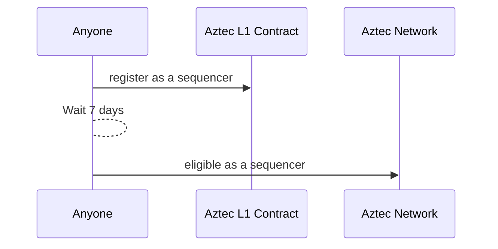
```mermaid
sequenceDiagram

participant Anyone
participant Contract as Aztec L1 Contract
participant Network as Aztec Network

Anyone ->> Contract: register as a sequencer
Anyone --> Anyone: Wait 7 days
Anyone ->> Network: eligible as a sequencer
```

## Block production

:::danger **TODO**
- The diagram needs to be updated with respect to "VRF".
- In **Prover commitment** phase, it is not said what the signature is used for. I'm expecting that it is used to allow the prover to publish the message on behalf of the sequencer, but it is not made clear.
- In **Backup** phase, would be useful if we add a comment on the duration
- In Diagram
  - add a dedicated timeline from the block production's PoV
  - get rid of "pre-confirmed"
:::


Every staked sequencers participate in the following phases, comprising an Aztec slot:

1. **Proposal:** Sequencers generate a hash of every other sequencer's public keys and RANDAO values. They then compare and rank these, seeing if they possibly have a "high" ranking random hash. If they do, they may choose to submit a block proposal to Layer-1. The highest ranking proposal will become canonical.
2. **Prover commitment:** After an off-protocol negotiation with the winning sequencer, a prover submits a commitment to a particular Ethereum address that has intentions to prove the block. This commitment includes a signature from the sequencer and an amount X of funds that get slashed if the block is not finalized.
3. **Reveal:** Sequencer uploads the block contents required for progressing the chain to whatever DA layer is decided to be implemented, e.g., Ethereum's 4844 blobs.
   - It is an active area of debate and research whether or not this phase is necessary, without intentions to implement "build ahead" or the ability to propose multiple blocks prior to the previous block being finalized. A possible implementation includes a block reward that incentivizes early reveal, but does not necessarily require it - turning the ability to reveal the block's data into another form of potential timing game.
4. **Proving:** The prover or prover network coordinates out of protocol to build the [recursive proof tree](./../rollup-circuits/index.md). After getting to the last, singular proof that reflects the entire blocks's state transitions they then upload the proof of the block to the L1 smart contracts.
5. **Finalization:** The smart contracts verify the block's proof, which triggers payouts to sequencer and prover, and the address which submits the proofs (likely the prover, but could be anyone such as a relay). Once finalized, the cycle continues!
   - For data layers that is not on the host, the host must have learned of the publication from the **Reveal** before the **Finalization** can begin.
6. **Backup:** Should no prover commitment be put down, or should the block not get finalized, then an additional phase is opened where anyone can submit a block with its proof, in a based-rollup mode. In the backup phase, the first rollup verified will become canonical.

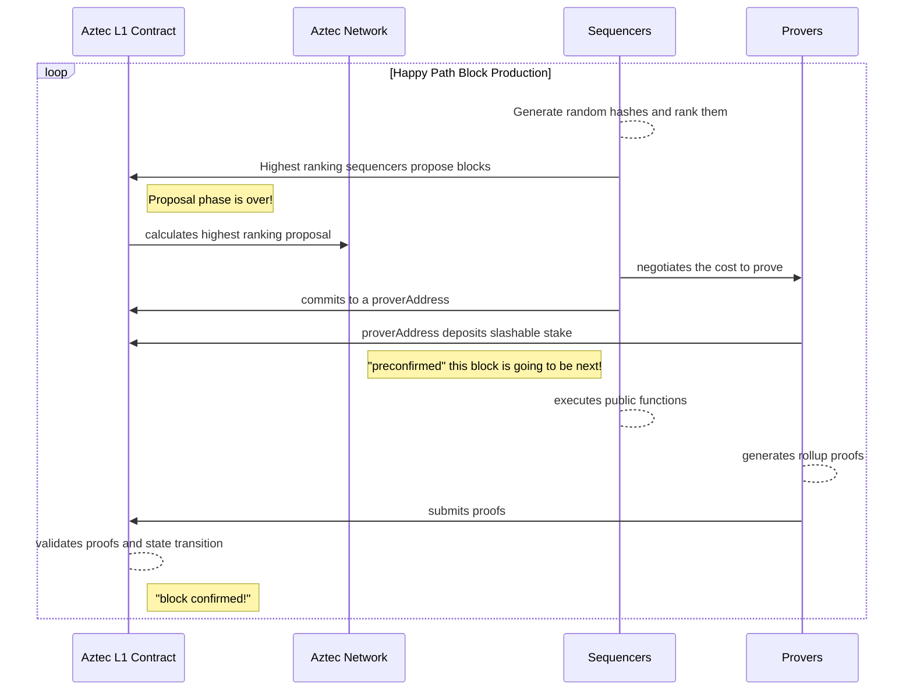
```mermaid
sequenceDiagram

participant Contract as Aztec L1 Contract
participant Network as Aztec Network
participant Sequencers
participant Provers

loop Happy Path Block Production
    Sequencers --> Sequencers: Generate random hashes and rank them
    Sequencers ->> Contract: Highest ranking sequencers propose blocks
    Note right of Contract: Proposal phase is over!
    Contract ->> Network: calculates highest ranking proposal
    Sequencers ->> Provers: negotiates the cost to prove
    Sequencers ->> Contract: commits to a proverAddress
    Provers ->> Contract: proverAddress deposits slashable stake
    Note right of Network: "preconfirmed" this block is going to be next!
    Sequencers --> Sequencers: executes public functions
    Provers --> Provers: generates rollup proofs
    Provers ->> Contract: submits proofs
    Contract --> Contract: validates proofs and state transition
    Note right of Contract: "block confirmed!"
end
```

### Constraining Randao

The `RANDAO` values used in the score as part of the Proposal phase must be constrained by the L1 contract to ensure that the computation is stable throughout a block. This is to prevent a sequencer from proposing the same L2 block at multiple L1 blocks to increase their probability of being chosen.

Furthermore, we wish to constrain the `RANDAO` ahead of time, such that sequencers will know whether they need to produce blocks or not. This is to ensure that the sequencer can ramp up their hardware in time for the block production.

As only the last `RANDAO` value is available to Ethereum contracts we cannot simply read an old value. Instead, we must compute update it as storage in the contract.

The simplest way to do so is by storing the `RANDAO` at every block, and then use the `RANDAO` for block number - $n$ when computing the score for block number $n$. For the first $n$ blocks, the value could pre-defined.

:::info
Updating the `RANDAO` values used is a potential attack vector since it can be biased. By delaying blocks by an L1 block, it is possible to change the `RANDAO` value stored. Consider how big this issue is, and whether it is required to mitigate it.
:::

## Exiting

In order to leave the protocol sequencers can exit via another L1 transaction. After signaling their desire to exit, they will no longer be considered `active` and move to an `exiting` status.

When a sequencer move to `exiting`, they might have to await for an additional delay before they can exit. This delay is up to the instance itself, and is dependent on whether consensus is used or not and what internal governance the instance supports. Beware that this delay is not the same as the exit delay in [Governance](./governance.md).

:::danger
@lasse to clarify what semantics he would prefer to use here instead of exiting/active

**Lasse Comment**: I'm unsure what you mean by "active" here. Is active that you are able to produce blocks? Is so, active seems fine. Also, not clear to me if `exiting` means that they be unable to propose blocks? If they are voting in them, sure put a delay in there, but otherwise I don't see why they should be unable to leave (when we don't have consensus for block production).
:::

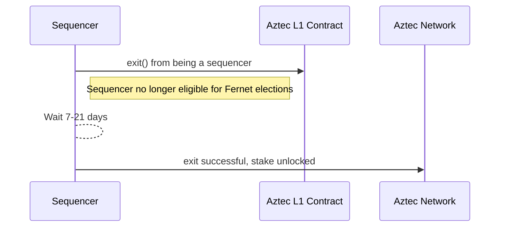
```mermaid
sequenceDiagram

participant Anyone as Sequencer
participant Contract as Aztec L1 Contract
participant Network as Aztec Network

Anyone ->> Contract: exit() from being a sequencer
Note left of Contract: Sequencer no longer eligible for Fernet elections
Anyone --> Anyone: Wait 7-21 days
Anyone ->> Network: exit successful, stake unlocked
```

## Confirmation rules

There are various stages in the block production lifecycle that a user and/or application developer can gain insights into where their transaction is, and when it is considered confirmed.

Notably there are no consistent, industry wide definitions for confirmation rules. Articulated here is an initial proposal for what the Aztec community could align on in order to best set expectations and built towards a consistent set of user experiences/interactions. Alternative suggestions encouraged!

Below, we outline the stages of confirmation.

1. Executed locally
2. Submitted to the network
   - users no longer need to actively do anything
3. In the highest ranking proposed block
4. In the highest ranking proposed block, with a valid prover commitment
5. In the highest ranking proposed block with effects available on the DA Layer
6. In a proven block that has been verified / validated by the L1 rollup contracts
7. In a proven block that has been finalized on the L1

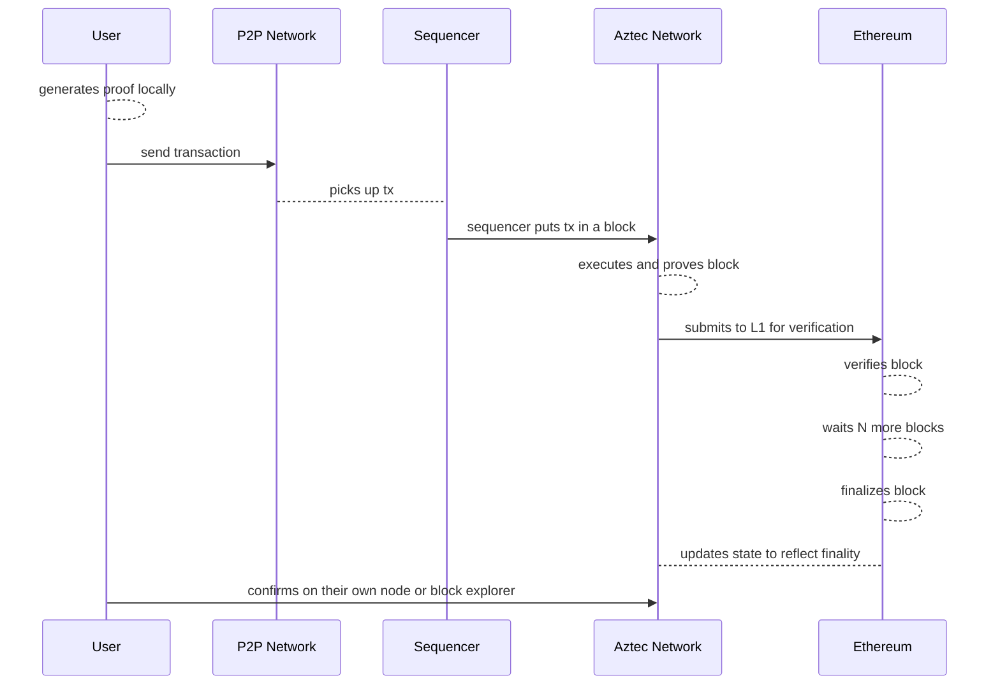
```mermaid
sequenceDiagram

participant Anyone as User
participant P2P Network
participant Sequencer
participant Network as Aztec Network
participant Contract as Ethereum

Anyone --> Anyone: generates proof locally
Anyone ->> P2P Network: send transaction
P2P Network --> Sequencer: picks up tx
Sequencer ->> Network: sequencer puts tx in a block
Network --> Network: executes and proves block
Network ->> Contract: submits to L1 for verification
Contract --> Contract: verifies block
Contract --> Contract: waits N more blocks
Contract --> Contract: finalizes block
Network --> Contract: updates state to reflect finality
Anyone ->> Network: confirms on their own node or block explorer
```

<!---->

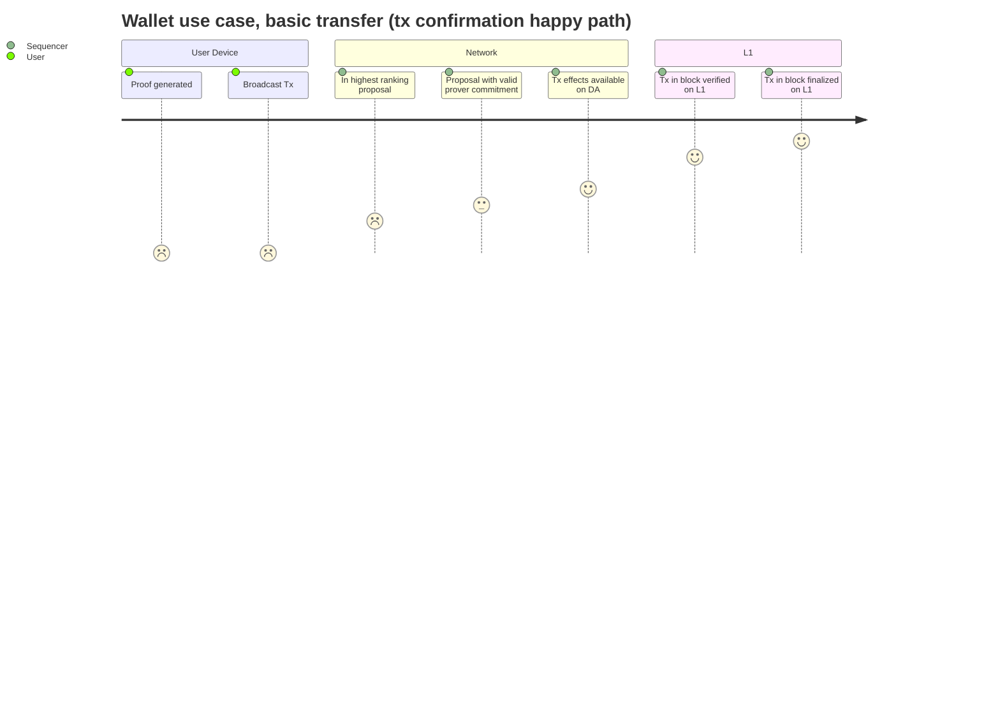
```mermaid
journey
    title Wallet use case, basic transfer (tx confirmation happy path)
    section User Device
      Proof generated: 0: User
      Broadcast Tx: 0: User
    section Network
      In highest ranking proposal: 2: Sequencer
      Proposal with valid prover commitment: 3: Sequencer
      Tx effects available on DA: 4: Sequencer
    section L1
      Tx in block verified on L1: 6: Sequencer
      Tx in block finalized on L1: 7: Sequencer
```

## Economics

In the current Aztec model, it's expected that block rewards in the native token are allocated to the sequencer, the prover, and the entity submitting the rollup to L1 for verification. Sequencers retain the block's fees and MEV (Maximal Extractable Value). A potential addition in consideration is the implementation of MEV or fee burn. The ratio of the distribution is to be determined, via modeling and simulation.

Future Aztec versions will receive rewards based on their staked amount, as determined by the Aztec governance and [incentives contracts](./governance.md). This ensures that early versions remain eligible for rewards, provided they have active stake. Changes to the network's economic structure, especially those affecting block production and sequencer burden, require thorough consideration due to the network's upgrade and governance model relying on an honest majority assumption and at a credibly neutral sequencer set for "easy" proposals.

:::info
With the rest of the protocol _mostly_ well defined, Aztec Labs now expects to begin a series of sprints dedicated towards economic analysis and modeling with [Blockscience](https://block.science/) throughout Q1-Q2 2024. This will result in a public report and associated changes to this documentation to reflect the latest thinking.
:::

## MEV-boost

:::success

### About MEV on Aztec

Within the Aztec Network, "MEV" (Maximal Extractable Value) can be considered "mitigated", compared to "public" blockchains where all transaction contents and their resulting state transitions are public. In Aztec's case, MEV is _generally_ only applicable to [public functions](#) and those transactions that touch publicly viewable state.
:::

It is expected that any Aztec sequencer client software will initially ship with some form of first price or priority gas auction for transaction ordering. Meaning that in general, transactions paying higher fees will get included earlier in the network's transaction history. Similar to Layer-1, eventually an opt-in, open source implementation of "out of protocol proposer builder separation" (PBS) such as [mev-boost](https://boost.flashbots.net/) will likely emerge within the community, giving sequencers an easier to access way to earn more money during their periods as sequencers. This is an active area of research.

## Proof-boost

It is likely that this proving ecosystem will emerge around a [flashbots mev-boost][https://boost.flashbots.net/] like ecosystem, specifically tailored towards the needs of sequencers negotiating the cost for a specific proof or set of proofs. Currently referred to as `proof-boost` or `goblin-boost` (due to goblin plonk..).

Specifically, Proof boost is expected to be open source software sequencers can optionally run alongside their clients that will facilitate a negotiation for the rights to prove this block, therefore earning block rewards in the form of the native protocol token. After the negotiation, the sequencer will commit to an address, and that address will need to put up an economic commitment (deposit) that will be slashed in the event that the block's proofs are not produced within the alloted timeframe.


Initially it's expected that the negotiations and commitment could be facilitated by a trusted relay, similar to L1 block building, but options such as onchain proving pools are under consideration. Due to the out of protocol nature of [Sidecar](https://forum.aztec.network/t/proposal-prover-coordination-sidecar/2428), these designs can be iterated and improved upon outside the scope of other Aztec related governance or upgrades - as long as they maintain compatibility with the currently utilized proving system(s). Eventually, any upgrade or governance mechanism may choose to enshrine a specific well adopted proving protocol, if it makes sense to do so.

## Diagrams

### Happy path

:::danger TODO
I'm not fully understanding the different groups, is the aztec network just the node software or 👀? Maybe coloring is nice to mark what is contracts and entities or groups of entities. Otherwise seems quite nice.
:::

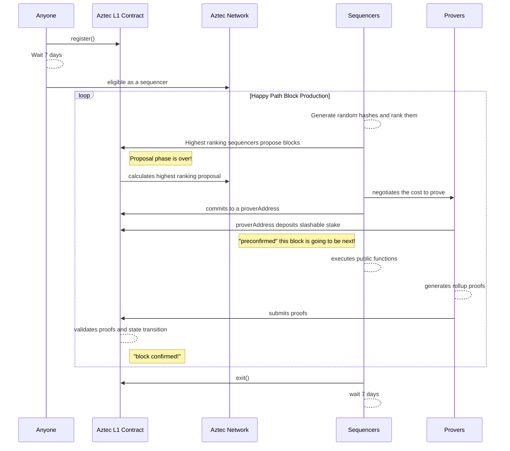
```mermaid
sequenceDiagram

participant Anyone
participant Contract as Aztec L1 Contract
participant Network as Aztec Network
participant Sequencers
participant Provers

Anyone ->> Contract: register()
Anyone --> Anyone: Wait 7 days
Anyone ->> Network: eligible as a sequencer
loop Happy Path Block Production
    Sequencers --> Sequencers: Generate random hashes and rank them
    Sequencers ->> Contract: Highest ranking sequencers propose blocks
    Note right of Contract: Proposal phase is over!
    Contract ->> Network: calculates highest ranking proposal
    Sequencers ->> Provers: negotiates the cost to prove
    Sequencers ->> Contract: commits to a proverAddress
    Provers ->> Contract: proverAddress deposits slashable stake
    Note right of Network: "preconfirmed" this block is going to be next!
    Sequencers --> Sequencers: executes public functions
    Provers --> Provers: generates rollup proofs
    Provers ->> Contract: submits proofs
    Contract --> Contract: validates proofs and state transition
    Note right of Contract: "block confirmed!"
end
Sequencers ->> Contract: exit()
Sequencers --> Sequencers: wait 7 days
```

### Voting on upgrades

In the initial implementation of Aztec, sequencers may vote on upgrades alongside block proposals. If they wish to vote alongside an upgrade, they signal by updating their client software or an environment configuration variable. If they wish to vote no or abstain, they do nothing. Because the "election" is randomized, the voting acts as a random sampling throughout the current sequencer set. This implies that the specific duration of the vote must be sufficiently long and RANDAO sufficiently randomized to ensure that the sampling is reasonably distributed.

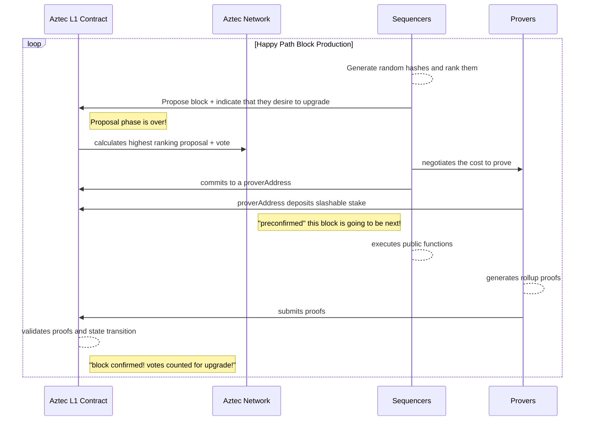
```mermaid
sequenceDiagram

participant Contract as Aztec L1 Contract
participant Network as Aztec Network
participant Sequencers
participant Provers

loop Happy Path Block Production
    Sequencers --> Sequencers: Generate random hashes and rank them
    Sequencers ->> Contract: Propose block + indicate that they desire to upgrade
    Note right of Contract: Proposal phase is over!
    Contract ->> Network: calculates highest ranking proposal + vote
    Sequencers ->> Provers: negotiates the cost to prove
    Sequencers ->> Contract: commits to a proverAddress
    Provers ->> Contract: proverAddress deposits slashable stake
    Note right of Network: "preconfirmed" this block is going to be next!
    Sequencers --> Sequencers: executes public functions
    Provers --> Provers: generates rollup proofs
    Provers ->> Contract: submits proofs
    Contract --> Contract: validates proofs and state transition
    Note right of Contract: "block confirmed! votes counted for upgrade!"
end
```

### Backup mode

In the event that no one submits a valid block proposal, we introduce a "backup" mode which enables a first come first serve race to submit the first proof to the L1 smart contracts.

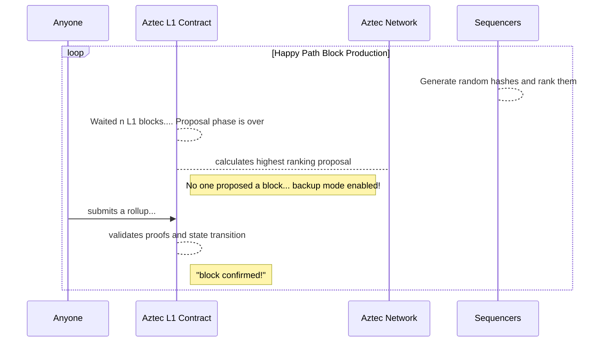
```mermaid
sequenceDiagram

participant Anyone
participant Contract as Aztec L1 Contract
participant Network as Aztec Network
participant Sequencers

loop Happy Path Block Production
    Sequencers --> Sequencers: Generate random hashes and rank them
    Contract --> Contract: Waited n L1 blocks.... Proposal phase is over
    Contract --> Network: calculates highest ranking proposal
    Note left of Network: No one proposed a block... backup mode enabled!
    Anyone ->> Contract: submits a rollup...
    Contract --> Contract: validates proofs and state transition
    Note right of Contract: "block confirmed!"
end
```

:::danger
There is an outstanding concern that this may result in L1 censorship. L1 builders may choose to not allow block proposals to land on the L1 contracts within a sufficient amount of time, triggering "backup" mode - where they could have a block pre-built and proven, waiting L1 submission at their leisure. This scenario requires some careful consideration and modeling. A known and potential mitigiation includes a longer proposal phase, with a relatively long upper bounds to submit a proposal. Given that all sequencers are able to participate, it's effectively a "priority ranked race" within some form of ["timing game"](https://ethresear.ch/t/timing-games-implications-and-possible-mitigations/17612).
:::

We also introduce a similar backup mode in the event that there is a valid proposal, but no valid prover commitment (deposit) by the end of the prover commitment phase.

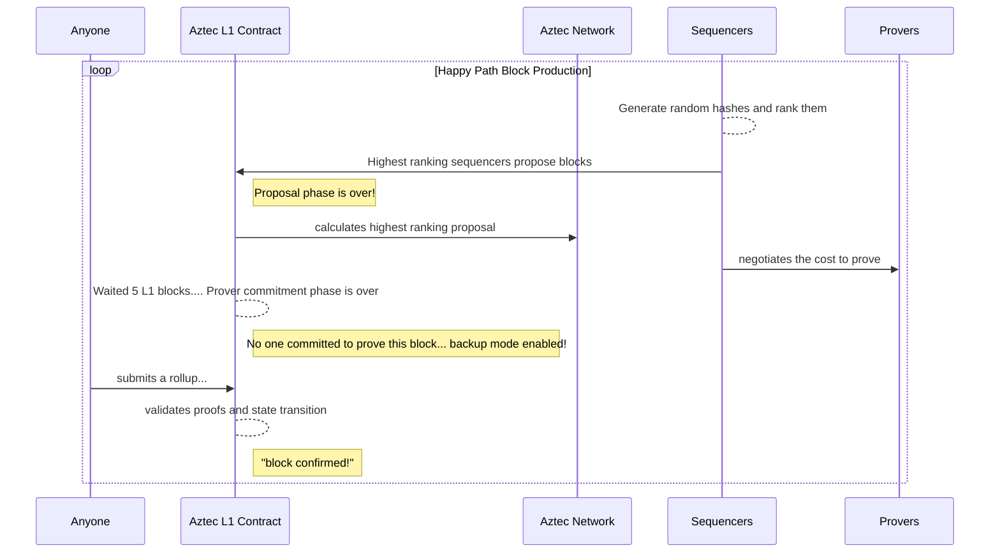
```mermaid
sequenceDiagram

participant Anyone
participant Contract as Aztec L1 Contract
participant Network as Aztec Network
participant Sequencers
participant Provers

loop Happy Path Block Production
    Sequencers --> Sequencers: Generate random hashes and rank them
    Sequencers ->> Contract: Highest ranking sequencers propose blocks
    Note right of Contract: Proposal phase is over!
    Contract ->> Network: calculates highest ranking proposal
    Sequencers ->> Provers: negotiates the cost to prove
    Contract --> Contract: Waited 5 L1 blocks.... Prover commitment phase is over
    Note left of Network: No one committed to prove this block... backup mode enabled!
   Anyone ->> Contract: submits a rollup...
    Contract --> Contract: validates proofs and state transition
    Note right of Contract: "block confirmed!"
end
```

## Glossary

:::danger
TO DO - define the things
:::
# Governance & Upgrades

:::danger
This is a first draft which articulates the latest thinking on governance & upgrades. It is subject to change and further review - ultimately needing team-wide understanding and approval. Please take this as a proposal, not as truth.
:::

## Summary

We propose an immutable governance & upgrade mechanism for The Aztec Network ("Aztec") that comprises a version registry, which points to deployments ("instances", used interchangeably) of Aztec.

These instances may choose to be immutable themselves, or have governance that evolves over time alongside the community. The governance contract will keep track of governance votes, from the current version of Aztec, as well as direct token votes from the community, in order to provide some form of checks and balances.

The version registry will keep track of all historical versions of Aztec & provide them with incentives proportionate to their current stake. Additionally the governance contract will point to what the _current canonical_ version of Aztec is, particularly relevant for 3rd parties to follow, such as centralized exchanges, or portals that wish to follow Aztec governance.


## Rewards

We propose introducing a governance "version registry" which keeps track of a) which deployments of Aztec have been canonical, and b) which instances currently have tokens staked to them, specifically in order to issue a consistent, single new token in the form of _incentives_ or "rollup/block rewards".


Given that deployments may be immutable, it is necessary to ensure that there are operators, i.e., sequencers & provers, running the infrastructure for a given deployment as long as users are interested in it. Therefore we suggest a model where all previous canonical instances of Aztec are rewarded pro-rata to their current proportion of stake.

Beyond making it easier to understand for users, having a single token across all deployments is necessary to ensure that all instances are all utilizing the same token due to ecosystem cohesive and business development efforts, for example, having reliable onramps and wallets.

<!-- My initial impression is that we'd want rewards to be proportional to some measure of "network activity", rather than to stake. If there's an old chain with 1 person staking on it with x% of AZT, who never transacts, he can get x% of block rewards by submitting empty rollup blocks every 10 mins. That doesn't feel like a helpful allocation of rewards, because he's not helping anyone.

Maybe if the Governance Registry is unable to measure "network activity" a quadratic staking measure might be better (`reward_i = stake_i ** 2  / sum_j(stake_j ** 2)`) to loosely mitigate this attack.
-->

## Initial deployment

Upon initial deployment, there will be an immutable set of governance contracts which maintain the version registry, and an initial immutable instance of the rollup which will be the first "canonical" deployment.

The initial instance will be called "Aztec v0" and (the current thinking is that v0) will not include the ability to process user transactions. Sequencers can register for Fernet's sequencer selection algorithm by staking tokens to that particular instance, and practice proposing blocks on mainnet prior to deciding to "go live" with v1, which _does_ enable the processing of user transactions. This instance would then _"restake"_ these tokens within the governance contract, to have a voting weight equal to the amount of tokens staked by its sequencer set. This is in order to ensure that the sequencer selection algorithm is working properly and the community of operators themselves can decide what happens to the network next, i.e., if it's ready to actually "go live" with transactions. It will also serve as a production readiness test of the upgradeability. In the event that these v0 tests are unable to be successfully completed as expected, the community (with potential foundation approval) may need to redeploy and try again.


The ability to upgrade to v1 is articulated below, and should follow a "happy path" upgrade where a majority of the v0 sequencer set must agree to upgrade by voting during their block proposals, similar to what was articulated in [the empire stakes back](https://forum.aztec.network/t/upgrade-proposal-the-empire-stakes-back/626). Additionally, token holders can directly participate in the vote, or choose to delegate a vote with the weight of their tokens to another address, including the v0 rollup.


## Proposing a new version

<!-- Can historical versions also vote to create a new instance? Effectively creating different branches, like git?
E.g.

v0 -> v1 -> v2  -> v3  -> v4
                       -> v4c
         -> v2b -> v3b -> v4b
                       -> v4d

If there was an upgrade supported by 51% of people, then the 49% of people remaining on the previous version might wish to continue to govern themselves through future upgrades on a separate branch.
-->

The current canonical rollup ("current rollup") can at any point propose voting on a new instance to become canonical and added to the governance version registry contracts. It can have it's own logic for determining when it makes sense to do so, and trigger the formal governance vote. In the initial deployment it's expected to be done as articulated in the empire stakes back, where a sequencer must flag a desire to upgrade signal as part of Fernet's proposal phase, i.e., they won a random leader election, and a majority of sequencers must do so over a specific time horizon, e.g., 7 days.

In addition to the current rollup implementation deciding to propose a vote, token holders can lock a sufficient amount of tokens for a sufficient amount of time in order to bypass the current rollup and propose a new version to become canonical next. This can be used in the scenario that the rollup implementation is so buggy it is unable to propose a new rollup to replace itself, or is due to potential community disagreement. In this scenario of disagreement, it is likely to be a very contentious action - as it implies a large token holder actively disagrees with the current rollup's sequencer set.

<!--
So if a group of non-sequencers want to effect a change, and create a new version of aztec, they need to wait 2 years to trigger that change? That seems like a long time! And why 1%? That seems like an insignificant minority?
And if this token-locking-upgrade mechanism 'bites', what's the stop the sequencers from re-deploying the entire aztec ecosystem (governance contract and all) to effectively ignore the token holders' upgrade?
-->

- Current thinking is this would require locking 1% of _total supply_ for 2 years.
- These tokens must be eligible for voting, as defined below.

In a worst case scenario, the rollup's sequencer set could be malicious and censor potentially honest upgrade proposals from going through. In this scenario, there needs to be the ability to add a proposal "to the queue" via the token locking mechanism articulated above which is guaranteed to be executed when the previous vote completes.

### Quorum

For any proposal to be considered valid and ready for voting, there must be a quorum of voting power eligible to participate. The purpose of this is to ensure that the network cannot be upgraded without a minimum of participation, keeping the governance more protected from takeover at genesis.

The exact amount of voting power required is to be determined through modelling, but we expect that around 5% of total supply. Assuming that 20% of the supply is circulating at launch and that 25% of this is staked towards the initial instance, this would allow the initial instance to reach quorum on its own.

## Voting

### Participation

Aztec's governance voting occurs within the governance contract, and the tokens being utilized must be "locked within governance" i.e., non-transferable.

Any token holder is able to directly vote via an interaction with the governance contract. Specifically, this includes those with locked, non-circulating tokens. The "ballot" is a simple yes/no/abstain vote on a proposal, and the amount of tokens being voted with. Note that this allows the same actor to vote multiple times, and even vote both yes and no with shares of their power. This allows for a more nuanced vote for contracts that control power for multiple users, such as a DAO, a rollup instance or a portal.

The current canonical rollup can choose to implement its internal voting however it would like, with the weight of the tokens staked in that instance. This is likely to be a majority of voting weight, which we can reliably assume will vote each time. Generally this addresses the problems of low token holder participation! In the initial instance, we envision a version of the Empire Stakes back, where sequencers are voting during part of their block proposal phases. Not all sequencers will win a block proposal/election during the time period of the vote, this leads it to being a randomized sampling of the current sequencer set.

### Exiting

The duration of the token lock depends on the action a user participated in. Tokens that have been locked to vote "yes" to changing the canonical instance are locked within the governance contract until the "upgrade" has been performed _or_ when the voting period ends without the proposal gaining sufficient traction to reach quorum.

Tokens whose power did not vote "yes" are free to leave whenever they chose. This ensures that it is always possible to "ragequit" the governance if they disagree with an upgrade, and use or exit from the instance they are using.

Rollup instances themselves will need to deposit their stake into the governance, in order to earn rewards and participate within the vote. Further, they can apply their own enter/exit delays on top of the governance contract's. For example to ensure stability of the sequencer set over short timeframes, if using $AZTC stake as a requirement for sequencing, they may wish to impose longer entry and exit queues.

### Results

A vote is defined as passing if a majority of the voting weight votes "yes" to the proposal.

If the vote fails, there is no action needed.

If the vote passes, and a new rollup has been determined to be the next canonical instance, it will become canonical in the amount of days defined within the vote's timelock. It is likely there are defined limitations around this parameter, e.g., it must be a 3-30 day timelock. This is explained more in the timing section below. At this block height, portals that desire to follow governance should start referencing the new canonical instance to ensure as many bridged assets are backed on the latest version as possible.

:::danger
Portals that blindly follow governance inherently assume that the new inbox/outbox will always be backwards compatible. If it is not, it might break the portals.
:::

## Timing

### Phase 1 - Setup

After the current canonical rollup, or a sufficient number of tokens are locked in governance, there is a ~3-7 day preparation period where users get their tokens "ready" for voting. i.e., withdraw & deposit/lock for the vote, or choose a suitable delegate.

### Phase 2 - Voting

After setup has completed, there is a 7-30 day (TBD) period during which votes can land on the governance contract. In practice, we envision a majority of this voting happening in the current canonical instance and the voting weight of the current canonical instance being sufficient to reach quorum without any additional token delegation.

### Phase 3 - Execution Delay (Timelock)

If a vote passes, there is a timelocked period before it becomes the new canonical rollup. This specific time period must be more than a minimum, e.g., 3 days, but is defined by the current rollup and in v1 may be controlled by both the sequencers in a happy path, and an emergency security council in a worst case scenario (articulated [below](#Emergency-mode)). In a typical happy path scenario, we suggest this is at least 30 days, and in an emergency, the shortest period possible. A maximum period may also be defined, e.g., 60 days to ensure that the network cannot be kept from upgrading by having a delay of 200 years.

:::info
It is worth acknowledging that this configurability on upgrade delay windows will likely be flagged on L2 beat as a "medium" centralization risk, due to the ability to quickly upgrade the software (e.g., a vacation attack). Explicitly this decision could cause us to be labeled a "stage 1" rather than "stage 2" rollup. However, if a vote is reasonably long, then it should be fine as you can argue that the "upgrade period" is the aggregate of all 3 periods.
:::

## Diagrams

Importantly we differentiate between `Aztec Governance`, and the governance of a particular instance of Aztec. This diagram articulates the high level of Aztec Governance, specifically how the network can deploy new versions over time which will be part of a cohesive ecosystem, sharing a single token. In this case, we are not concerned with how the current canonical rollup chooses to implement its decision to propose a new version, nor how it implements voting. It can be reasonably assumed that this is a version of The Empire Stakes back, where a majority of the current rollup sequencers are agreeing to propose and want to upgrade.

### Happy path

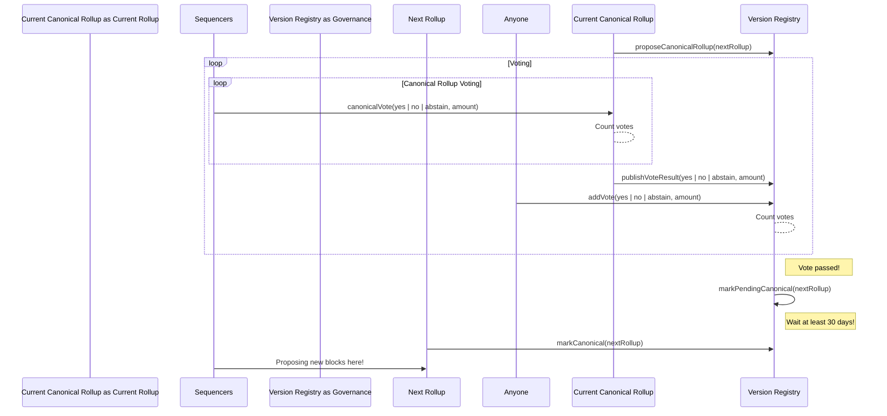
```mermaid
sequenceDiagram

participant Current Canonical Rollup as Current Rollup
participant Sequencers
participant Version Registry as Governance
participant Next Rollup
participant Anyone

Current Canonical Rollup ->> Version Registry: proposeCanonicalRollup(nextRollup)
loop Voting
    loop Canonical Rollup Voting
        Sequencers ->> Current Canonical Rollup: canonicalVote(yes | no | abstain, amount)
        Current Canonical Rollup --> Current Canonical Rollup: Count votes
    end
    Current Canonical Rollup ->> Version Registry: publishVoteResult(yes | no | abstain, amount)
    Anyone ->> Version Registry: addVote(yes | no | abstain, amount)
    Version Registry --> Version Registry: Count votes
end
Note right of Version Registry: Vote passed!
Version Registry ->> Version Registry: markPendingCanonical(nextRollup)
Note right of Version Registry: Wait at least 30 days!
Next Rollup ->> Version Registry: markCanonical(nextRollup)
Sequencers ->> Next Rollup: Proposing new blocks here!
```

### "Bricked" rollup proposals

In this diagram, we articulate the scenario in which the current canonical rollup contains bugs that result in it being unable to produce not only a block, but a vote of any kind. In this scenario, someone or a group (Lasse refers to as the "unbrick DAO") may lock 1% (specific # TBD) of total supply in order to propose a new canonical rollup. It is expected that this scenario is very unlikely, however, we believe it to be a nice set of checks and balances between the token holders and the decisions of the current rollup implementation.

```mermaid
sequenceDiagram

participant Current Canonical Rollup as Current Rollup
participant Sequencers
participant Version Registry as Governance
participant Next Rollup
participant Anyone

Anyone ->> Version Registry: lockTokensAndVote(1% of total supply, nextRollup)
loop Voting
    Anyone ->> Version Registry: addVote(yes | no | abstain, amount)
    Version Registry --> Version Registry: Count votes
end
Note right of Version Registry: Vote passed!
Version Registry ->> Version Registry: markPendingCanonical(nextRollup)
Note right of Version Registry: Wait at least 30 days!
Note left of Sequencers: Upgrade to new client
Next Rollup ->> Version Registry: markCanonical(nextRollup)
Sequencers ->> Next Rollup: Proposing new blocks here!
```

### Vote Delegation

Any token holder can delegate their token's voting weight to another address, including the current canonical rollup's, if it wishes to follow along in that addresses' vote. The tokens being delegated will be locked, either within the governance contract or the vesting contract.

:::info
:bulb: Locked, non-circulating tokens can be delegated! This "economic training wheel" enables Aztec Labs, Foundation, and potential investors to participate responsibly in governance while the protocol is getting off the ground. It is TBD if these locked, non-circulating, delegated tokens will be able to earn incentives, i.e., block rewards.
:::

The diagram below articulates calling delegateTo(address) on both the governance contract and specifying a particular address. Additionally calling delegateTo() on the current canonical rollup if you wish to align with whatever voting mechanism that system currently as in place.

```mermaid
sequenceDiagram

participant Current Canonical Rollup as Current Rollup
participant Sequencers
participant Version Registry as Governance
participant Next Rollup
participant Anyone

Current Canonical Rollup ->> Version Registry: proposeCanonicalRollup(nextRollup)
Note right of Version Registry: Vote starts in N days, e.g., 7
Anyone ->> Version Registry: delegateTo(otherAddress)
Anyone ->> Current Canonical Rollup: delegateTo()
Note right of Version Registry: Must be delegated before vote starts
loop Voting
    loop Canonical Rollup Voting
        Sequencers ->> Current Canonical Rollup: canonicalVote(yes | no | abstain, amount)
        Current Canonical Rollup --> Current Canonical Rollup: Count votes
    end
    Current Canonical Rollup ->> Version Registry: publishVoteResult(yes | no | abstain, amount)
    Anyone ->> Version Registry: addVote(yes | no | abstain, amount)
    Version Registry --> Version Registry: Count votes
end
Note right of Version Registry: Vote passed!
Version Registry ->> Version Registry: markPendingCanonical(nextRollup)
Note right of Version Registry: Wait at least 30 days!
Next Rollup ->> Version Registry: markCanonical(nextRollup)
Sequencers ->> Next Rollup: Proposing new blocks here!
```

## Emergency mode

Emergency mode is proposed to be introduced to the initial instance "v0" or "v1" of Aztec, whatever the first instance or deployment is. Emergency mode **will not be included as part of the canonical governance contracts or registry**. If future deployments wish to have a similar security council, they can choose to do so. In this design, the current rollup can determine the timelock period as articulated above, within some predefined constraints, e.g., 3-30 days. Explicitly, the current rollup can give a security council the ability to define what this timelock period may be, and in the case of a potential vulnerability or otherwise, may be well within it's rights to choose the smallest value defined by the immutable governance contract to ensure that the network is able to recover and come back online as quickly as possible.


### Unpausing by default

In the first instance, it's expected that this security council can _only_ pause the rollup instance, not make any other changes to the instance's functionality. It is important that after N days (e.g., 180), or after another rollup has been marked canonical and Y days (e.g., 60), this rollup _must_ become unpaused eventually - otherwise it's practically bricked from the perspective of those users choosing immutable portals, and could leave funds or other things belonging to users (e.g., identity credentials or something wacky) permanently inside of it. The same is true for all future instances that have pause functionalities.

### Removing the emergency mode

The emergency mode articulated here may be implemented as part of the next instance of Aztec - "v1" or whatever it ends up being called, when mainnet blocks are enabled. The current sequencer set on v0 (the initial instance) would then need to vote as outlined above on marking this new deployment as the "canonical v1" or predecessor to the initial instance. This would then have all of the portal contracts follow v1, which may or may not have other [training wheels](https://discourse.aztec.network/t/aztec-upgrade-training-wheels/641). If the community wishes, they can always deploy a new instance of the rollup which removes the emergency mode and therefore the pause-only multisig.

## Contract implementation

:::danger
TO DO
:::

## Glossary

:::danger
TO DO
:::
---
title: Constants
---

:::warning Draft
All of these constants are subject to change, pending benchmarking, optimizations, and general protocol changes.
:::

## Tree Constants

See also: [state](./state/index.md).

:::warning Tree Epochs
Note: we might introduce tree epochs, which will reduce the height of each epoch's tree, and means we don't need to estimate future network state growth in advance.
:::

<!-- prettier-ignore -->
| Name | Value | Description |
|---|---|---|
| `ARCHIVE_TREE_HEIGHT` | `27` | Prudent justification: 1 block/min \* 200 years ~= 2^27 blocks |
| `NOTE_HASH_TREE_HEIGHT` | `39` | Prudent justification: 10 tx/s \* 8 notes/tx \* 200 years. |
| `NULLIFIER_TREE_HEIGHT` | `42` | Prudent justification: \[Number of notes _ 2 (to allow a huge buffer for initialization nullifiers and other nullifier usage)] + \[ 2 _ Estimated number of contracts (to allow a huge buffer for contract class & instance nullifiers) ]. An estimate for the number of contracts ever to be deployed is debatable. |
| `PUBLIC_DATA_TREE_HEIGHT` | `39` | Prudent justification: 10 tx/s \* 8 storage slots/tx \* 200 years. |
| `L1_TO_L2_MESSAGE_TREE` | `33` | Prudent justification: 10 tx/s \* 10% of txs consuming a message \* 200 years. |
| `PRIVATE_FUNCTION_TREE_HEIGHT` | `5` | Note: this means a smart contract can only declare `2 ** 5 = 32` private functions. |

For all trees, an empty leaf has value `0`.

For all indexed merkle trees, the 0th leaf is the "zero predecessor leaf" with leaf preimage `{ value: 0, next_index: 0, next_value: 0}`. <!-- TODO: link to the explanation of what the preimage is in the indexed merkle tree section instead -->

## Circuit Constants

:::warning
Note: "per call" values might be much more flexible, once the data bus is introduced. These numbers are finger-in-the-air estimates of values that might be possible with the data bus. Benchmarking will be needed.
:::

The statically-sized nature the kernel & rollup circuits will restrict the quantity of 'side effects' that a single call or transaction can create.

### Per Call

<!-- prettier-ignore -->
| Name | Value | Description |
|---|---|---|
| `RETURN_VALUES_LENGTH` | 4 |
| `MAX_NOTE_HASHES_PER_CALL` | 128 |
| `MAX_NULLIFIERS_PER_CALL` | 128 |
| `MAX_L2_TO_L1_MSGS_PER_CALL` | 4 |
| `MAX_PUBLIC_DATA_UPDATE_REQUESTS_PER_CALL` | 128 |
| `MAX_PUBLIC_DATA_READS_PER_CALL` | 128 |
| `MAX_UNENCRYPTED_LOG_HASHES_PER_CALL` | 128 |
| `MAX_ENCRYPTED_LOG_HASHES_PER_CALL` | 128 |
| `MAX_ENCRYPTED_NOTE_PREIMAGE_HASHES_PER_CALL` | 128 |
| `MAX_NOTE_HASH_READ_REQUESTS_PER_CALL` | 128 |
| `MAX_NULLIFIER_READ_REQUESTS_PER_CALL` | 128 |
| `MAX_KEY_VALIDATION_REQUESTS_PER_CALL | 16 | TODO: we shouldn't need this, given the reset circuit. |
| `MAX_PRIVATE_CALL_STACK_LENGTH_PER_CALL` | 32 |
| `MAX_PUBLIC_CALL_STACK_LENGTH_PER_CALL` | 32 |

### Per Tx

<!-- prettier-ignore -->
| Name | Value | Description |
|---|---|---|
| `MAX_NOTE_HASHES_PER_TX` | 128 |
| `MAX_NULLIFIERS_PER_TX` | 128 |
| `MAX_L2_TO_L1_MSGS_PER_TX` | 16 |
| `MAX_PUBLIC_DATA_UPDATE_REQUESTS_PER_TX` | 31 |
| `MAX_PUBLIC_DATA_READS_PER_TX` | 16 |
| `MAX_UNENCRYPTED_LOG_HASHES_PER_TX` | 128 |
| `MAX_ENCRYPTED_LOG_HASHES_PER_TX` | 128 |
| `MAX_ENCRYPTED_NOTE_PREIMAGE_HASHES_PER_TX` | 128 |
| `MAX_OPTIONALLY_REVEALED_DATA_LENGTH_PER_TX` | 4 |
| `MAX_NOTE_HASH_READ_REQUESTS_PER_TX` | 128 | TODO: we shouldn't need this, given the reset circuit. |
| `MAX_KEY_VALIDATION_REQUESTS_PER_TX` | 64 | TODO: we shouldn't need this, given the reset circuit. |
| `MAX_PRIVATE_CALL_STACK_LENGTH_PER_TX` | 32 |
| `MAX_PUBLIC_CALL_STACK_LENGTH_PER_TX` | 32 |

## Block constants

## Genesis Constants

### Genesis Addresses

:::warning
TODO: consider whether these addresses should be 'nice', small values, or whether these addresses should be derived in the same way as all other addresses (but with a deployer_address of `0x00`).

TODO: some of these contracts will be baked into genesis. Some of them might need to be deployed as part of the first network 'upgrade', and so might end up being removed from this section. This is still being discussed.
:::

| Name                                    | Value   | Description                                            |
| --------------------------------------- | ------- | ------------------------------------------------------ |
| Space reserved for precompile addresses |         |                                                        |
| `CONTRACT_CLASS_REGISTERER_ADDRESS`     | 0x10000 | See [here](./contract-deployment/classes.md#genesis)   |
| `CONTRACT_INSTANCE_DEPLOYER_ADDRESS`    | 0x10001 | See [here](./contract-deployment/instances.md#genesis) |
| `FEE_JUICE_ADDRESS`                     | 0x10002 | TODO: consider at what stage this should be deployed.  |

### Genesis Archive Tree

The 0th leaf of the archive tree will be hard-coded at genesis to be an empty collection of state trees and an empty previous header.

<!-- TODO: Jan expand on this, please. -->

### Genesis Nullifiers

| Name                                                                                 | Value | Description                                           |
| ------------------------------------------------------------------------------------ | ----- | ----------------------------------------------------- |
| The zero predecessor leaf.                                                           | TODO  | Needed to make an indexed merkle tree work.           |
| The zero predecessor leaf index.                                                     | `0`   | Needed to make an indexed merkle tree work.           |
| `GENESIS_NULLIFIER_LEAF_INDEX_OF_CLASS_ID_NULLIFIER_OF_CONTRACT_CLASS_REGISTERER`    | `1`   | See [here](./contract-deployment/classes.md#genesis). |
| `GENESIS_NULLIFIER_LEAF_INDEX_OF_DEPLOYMENT_NULLIFIER_OF_CONTRACT_CLASS_REGISTERER`  | `2`   | See [here](./contract-deployment/classes.md#genesis). |
| `GENESIS_NULLIFIER_LEAF_INDEX_OF_CLASS_ID_NULLIFIER_OF_CONTRACT_INSTANCE_DEPLOYER`   | `3`   | See [here](./contract-deployment/classes.md#genesis). |
| `GENESIS_NULLIFIER_LEAF_INDEX_OF_DEPLOYMENT_NULLIFIER_OF_CONTRACT_INSTANCE_DEPLOYER` | `4`   | See [here](./contract-deployment/classes.md#genesis). |
| `GENESIS_NULLIFIER_LEAF_INDEX_OF_CLASS_ID_NULLIFIER_OF_FEE_JUICE_CONTRACT`           | `5`   | See [here](./contract-deployment/classes.md#genesis). |
| `GENESIS_NULLIFIER_LEAF_INDEX_OF_DEPLOYMENT_NULLIFIER_OF_FEE_JUICE_CONTRACT`         | `6`   | See [here](./contract-deployment/classes.md#genesis). |

:::warning
TODO: hard-code the actual nullifier values, once the code has been frozen.
:::

<!-- TODO: Palla, do we need an 'initialisation nullifier' for all of these genesis contracts too? -->

These verbose names are designed to get more specific from left to right.

## Precompile Constants

See the [precompiles](./addresses-and-keys/precompiles.md#constants) section.
---
title: Contract Deployment
---

# Contract Deployment

Contracts in Aztec are deployed as _instances_ of a contract _class_. Deploying a new contract then requires first registering the _class_, if it has not been registered before, and then creating an _instance_ that references the class. Both classes and instances are committed to in the nullifier tree in the global state, and are created via a call to a canonical class registry or instance deployer contract respectively.

import DocCardList from '@theme/DocCardList';

<DocCardList />
# Contract classes

A contract class is a collection of state variable declarations, and related unconstrained, private, and public functions. Contract classes don't have any initialized state, they just define code. A contract class cannot be called; only a contract instance can be called.

## Rationale

Contract classes simplify the process of reusing code by enshrining implementations as a first-class citizen at the protocol. Given multiple [contract instances](./instances.md) that rely on the same class, the class needs to be declared only once, reducing the deployment cost for all contract instances. Classes also simplify the process of upgradeability; classes decouple state from code, making it easier for an instance to switch to different code while retaining its state.

:::info
Read the following discussions for additional context:

- [Abstracting contract deployment](https://forum.aztec.network/t/proposal-abstracting-contract-deployment/2576)
- [Implementing contract upgrades](https://forum.aztec.network/t/implementing-contract-upgrades/2570)
- [Contract classes, upgrades, and default accounts](https://forum.aztec.network/t/contract-classes-upgrades-and-default-accounts/433)

:::

## `ContractClass`

The structure of a contract class is defined as:

<!-- prettier-ignore -->
| Field | Type | Description |
|----------|----------|----------|
| `version` | `u8` | Version identifier. Initially one, bumped for any changes to the contract class struct. |
| `artifact_hash` | `Field` | Hash of the contract artifact. The specification of this hash is not enforced by the protocol. Should include commitments to unconstrained code and compilation metadata. Intended to be used by clients to verify that an off-chain fetched artifact matches a registered class. |
| `private_functions` | [`PrivateFunction[]`](#private-function) | List of individual private functions, constructors included. |
| `packed_public_bytecode` | `Field[]` | [Packed bytecode representation](../public-vm/bytecode-validation-circuit.md#packed-bytecode-representation) of the AVM bytecode for all public functions in this contract. |

The public function are sorted in ascending order by their function selector before being packed. This is to ensure consistent hashing later.

Note that individual public functions are not first-class citizens in the protocol, so the contract entire public function bytecode is stored in the class, unlike private or unconstrained functions which are differentiated individual circuits recognized by the protocol.

As for unconstrained functions, these are not used standalone within the protocol. They are either inlined within private functions, or called from a PXE as _getters_ for a contract. Calling from a private function to an unconstrained one in a different contract is forbidden, since the caller would have no guarantee of the code run by the callee. Considering this, unconstrained functions are not part of a contract class at the protocol level.

### `contract_class_id`

Also known as `contract_class_id`, the Class Identifier is both a unique identifier and a commitment to the struct contents. It is computed as:

<!-- TODO: missing `version` from the class_id? -->

<!-- HASH DEFINITION -->

```rust
contract_class_id_crh(
    artifact_hash: Field
    private_functions: PrivateFunction[],
    packed_public_bytecode: bytes[],
) -> Field {
    let private_function_leaves: Field[] = private_functions.map(|f| private_function_leaf_crh(f));

    // Illustrative function, not defined. TODO.
    let private_function_tree_root: Field = merkleize(private_function_leaves);

    // Illustrative function, not defined. TODO.
    let public_bytecode_commitment: Point = calculate_commitment(packed_public_bytecode);

    let contract_class_id = poseidon2(
        be_string_to_field("az_contract_class_id"),

        artifact_hash,
        private_function_tree_root,
        public_bytecode_commitment.x,
        public_bytecode_commitment.y,
    );

    contract_class_id
}
```

> See below for `private_function_leaf_crh`.
> Private Functions are sorted in ascending order by their selector, and then hashed into Function Leaves, before being merkleized into a tree of height [`PRIVATE_FUNCTION_TREE_HEIGHT`](../constants.md#tree-constants).
> Empty leaves have value `0`.
> The AVM public bytecode commitment is calculated as [defined in the Public VM section](../public-vm/bytecode-validation-circuit.md#committed-representation).

### `PrivateFunction`

The structure of each private function within the protocol is the following:

<!-- prettier-ignore -->
| Field | Type | Description |
|----------|----------|----------|
| `function_selector` | `u32` | Selector of the function. Calculated as the hash of the method name and parameters. The specification of this is not enforced by the protocol. |
| `vk_hash` | `Field` | Hash of the verification key associated to this private function. |

Note the lack of visibility modifiers. Internal functions are specified as a macro, and the check is handled at the application circuit level by verifying that the `context.msg_sender` equals the contract current address.

Also note the lack of commitment to the function compilation artifact. Even though a commitment to a function is required so that the PXE can verify the execution of correct unconstrained Brillig code embedded within private functions, this is handled entirely out of protocol. As such, PXEs are expected to verify it against the `artifact_hash` in the containing contract class.

#### Private Function Leaf Hash

<!-- HASH DEFINITION -->

```rust
private_function_leaf_crh(
    f: PrivateFunction
) -> Field {
    let private_function_leaf = poseidon2(
        be_string_to_field("az_private_function_leaf"),

        be_bits_to_field(f.function_selector),
        f.vk_hash
    );

    private_function_leaf
}
```

### Artifact Hash

Even though not enforced by the protocol, it is suggested for the `artifact_hash` to follow this general structure, in order to be compatible with the definition of the [`broadcast` function below](#broadcast).

Note: below, `sha256_modulo(x) = sha256(x) % FIELD_MODULUS`. This approach must not be used if seeking pseudo-randomness, but can be used for collision resistance.

<!-- HASH DEFINITION -->

```rust
artifact_crh(
  artifact // This type is out of protocol, e.g. the format output by Nargo
) -> Field {

  let private_functions_artifact_leaves: Field[] = artifact.private_functions.map(|f|
    sha256_modulo(
      be_string_to_bits("az_artifact_private_function_leaf"),

      f.selector, // 32-bits
      f.metadata_hash, // 256-bits
      sha256(f.private_bytecode)
    )
  );
  let private_functions_artifact_tree_root: Field = merkleize(private_functions_artifact_leaves);

  let unconstrained_functions_artifact_leaves: Field[] = artifact.unconstrained_functions.map(|f|
    sha256_modulo(
      be_string_to_bits("az_artifact_unconstrained_function_leaf"),

      f.selector, // 32-bits
      f.metadata_hash, // 256-bits
      sha256(f.unconstrained_bytecode)
    )
  );
  let unconstrained_functions_artifact_tree_root: Field = merkleize(unconstrained_functions_artifact_leaves);

  let artifact_hash: Field = sha256_modulo(
    be_string_to_field("az_artifact"),

    private_functions_artifact_tree_root, // 256-bits
    unconstrained_functions_artifact_tree_root, // 256-bits
    artifact_metadata
  );

  let artifact_hash: Field = artifact_hash_256_bit % FIELD_MODULUS;

  artifact_hash
}
```

For the artifact hash merkleization and hashing is done using sha256, since it is computed and verified outside of circuits and does not need to be SNARK friendly, and then wrapped around the field's maximum value. Fields are left-padded with zeros to 256 bits before being hashed. Function leaves are sorted in ascending order before being merkleized, according to their function selectors. Note that a tree with dynamic height is built instead of having a tree with a fixed height, since the merkleization is done out of a circuit.

<!-- TODO: Verify with the crypto team it is ok to wrap around the field modulus, or consider going Poseidon everywhere. -->

Bytecode for private functions is a mix of ACIR and Brillig, whereas unconstrained function bytecode is Brillig exclusively, as described on the [bytecode section](../bytecode/index.md).

The metadata hash for each function is suggested to be computed as the sha256 of all JSON-serialized fields in the function struct of the compilation artifact, except for bytecode and debug symbols. The metadata is JSON-serialized using no spaces, and sorting ascending all keys in objects before serializing them.

<!-- HASH DEFINITION -->

```rust
function_metadata_crh(
  function // This type is out of protocol, e.g. the format output by Nargo
) -> Field {
  let function_metadata = omit(function, "bytecode", "debug_symbols");

  let function_metadata_hash: Field = sha256_modulo(
    be_string_to_bits("az_function_metadata"),

    json_serialize(function_metadata)
  );

  function_metadata_hash
}
```

The artifact metadata stores all data that is not contained within the contract functions and is not debug specific. This includes the compiler version identifier, events interface, and name. Metadata is JSON-serialized in the same fashion as the function metadata.

```rust
artifact_metadata_crh(
  artifact // This type is out of protocol, e.g. the format output by Nargo
) -> Field {
  let artifact_metadata = omit(artifact, "functions", "file_map");

  let artifact_metadata_hash: Field = sha256_modulo(
    be_string_to_bits("az_artifact_metadata"),

    json_serialize(artifact_metadata)
  );

  artifact_metadata_hash
}
```

### Versioning

A contract class has an implicit `version` field that identifies the schema of the struct. This allows to change the shape of a contract class in future upgrades to the protocol to include new fields or change existing ones, while preserving the structure for existing classes. Supporting new types of contract classes would require introducing new kernel circuits, and a transaction proof may require switching between different kernel circuits depending on the version of the contract class used for each function call.

Note that the version field is not directly used when computing the contract class id, but is implicit in the generator index. Bumping the version of a contract class struct would involve using a different generator index for computing its id.

## Canonical Contract Class Registerer

A contract class is registered by calling a private `register` function in a canonical `ContractClassRegisterer` contract, which will emit a Registration Nullifier. The Registration Nullifier is defined as the `contract_class_id` itself of the class being registered. Note that the Private Kernel circuit will [silo](../circuits/private-kernel-tail.md#siloing-values) this value with the contract address of the `ContractClassRegisterer`, effectively storing the hash of the `contract_class_id` and `ContractClassRegisterer` address in the nullifier tree. As such, proving that a given contract class has been registered requires checking existence of this siloed nullifier.

The rationale for the Registerer contract is to guarantee that the public bytecode for a contract class is publicly available. This is a requirement for publicly [deploying a contract instance](./instances.md#publicly_deployed), which ultimately prevents a sequencer from executing a public function for which other nodes in the network may not have the code.

### Register Function

The `register` function receives the artifact hash, private functions tree root, and packed public bytecode of a `ContractClass` struct as [defined above](#structure), and performs the following steps:

- Assert that `packed_public_bytecode` is valid according to the definition in the [Public VM section](../public-vm/bytecode-validation-circuit.md#packed-bytecode-representation).
- Computes the `contract_class_id` as [defined above](#class-identifier).
- Emits the resulting `contract_class_id` as a nullifier to prevent the same class from being registered again.
- Emits an unencrypted event `ContractClassRegistered` with the contents of the contract class.

In pseudocode:

```rust
fn register(
  artifact_hash: Field,
  private_functions_root: Field,
  public_bytecode_commitment: Point,
  packed_public_bytecode: Field[],
) {
  assert(is_valid_packed_public_bytecode(packed_public_bytecode));

  let computed_bytecode_commitment: Point = calculate_commitment(packed_public_bytecode);

  assert(public_bytecode_commitment == computed_bytecode_commitment);

  let version: Field = 1;
  let contract_class_id = contract_class_id_crh(version, artifact_hash, private_functions_root, bytecode_commitment);

  emit_nullifier(contract_class_id);

  emit_unencrypted_event(ContractClassRegistered::new(
    contract_class_id,
    version,
    artifact_hash,
    private_functions_root,
    packed_public_bytecode
  ));
}
```

Upon seeing a `ContractClassRegistered` event in a mined transaction, nodes are expected to store the contract class, so they can retrieve it when executing a public function for that class. Note that a class may be used for deploying a contract within the same transaction in which it is registered.

Note that emitting the `contract_class_id` as a nullifier (the `contract_class_id_nullifier`), instead of as an entry in the note hashes tree, allows nodes to prove non-existence of a class. This is needed so a sequencer can provably revert a transaction that includes a call to an unregistered class.

### Genesis

The `ContractClassRegisterer` will need to exist from the genesis of the Aztec Network, otherwise nothing will ever be publicly deployable to the network. The Class Nullifier for the `ContractClassRegisterer` contract will be pre-inserted into the genesis nullifier tree at leaf index [`GENESIS_NULLIFIER_LEAF_INDEX_OF_CONTRACT_CLASS_REGISTERER_CLASS_ID_NULLIFIER`](../constants.md#genesis-constants). The canonical instance will be deployed at [`CONTRACT_CLASS_REGISTERER_ADDRESS`](../constants.md#genesis-constants), and its Deployment Nullifier will be inserted at [`GENESIS_NULLIFIER_LEAF_INDEX_OF_CONTRACT_CLASS_REGISTERER_DEPLOYMENT_NULLIFIER`](../constants.md#genesis-constants).

<!-- TODO(cryptography): How do we convince the world that there's 'nothing up our sleeves'? What could be the consequences of a cunningly-chosen nullifier being pre-inserted into the nullifier tree? -->

### Broadcast

The `ContractClassRegisterer` has an additional private `broadcast` functions that can be used for broadcasting on-chain the bytecode, both ACIR and Brillig, for private functions and unconstrained in the contract. Any user can freely call this function. Given that ACIR and Brillig [do not have a circuit-friendly commitment](../bytecode/index.md), it is left up to nodes to perform this check.

Broadcasted function artifacts that do not match with their corresponding `artifact_hash`, or that reference a `contract_class_id` that has not been broadcasted, can be safely discarded.

```rust
fn broadcast_private_function(
  contract_class_id: Field,
  artifact_metadata_hash: Field,
  unconstrained_functions_artifact_tree_root: Field,
  private_function_tree_sibling_path: Field[],
  private_function_tree_leaf_index: Field,
  artifact_function_tree_sibling_path: Field[],
  artifact_function_tree_leaf_index: Field,
  function: { selector: Field, metadata_hash: Field, vk_hash: Field, bytecode: Field[] },
)
  emit_unencrypted_event ClassPrivateFunctionBroadcasted(
    contract_class_id,
    artifact_metadata_hash,
    unconstrained_functions_artifact_tree_root,
    private_function_tree_sibling_path,
    private_function_tree_leaf_index,
    artifact_function_tree_sibling_path,
    artifact_function_tree_leaf_index,
    function,
  )
```

```rust
fn broadcast_unconstrained_function(
  contract_class_id: Field,
  artifact_metadata_hash: Field,
  private_functions_artifact_tree_root: Field,
  artifact_function_tree_sibling_path: Field[],
  artifact_function_tree_leaf_index: Field
  function: { selector: Field, metadata_hash: Field, bytecode: Field[] }[],
)
  emit_unencrypted_event ClassUnconstrainedFunctionBroadcasted(
    contract_class_id,
    artifact_metadata_hash,
    private_functions_artifact_tree_root,
    artifact_function_tree_sibling_path,
    artifact_function_tree_leaf_index,
    function,
  )
```

<!-- TODO: What representation of bytecode can we use here? -->

The broadcast functions are split between private and unconstrained to allow for private bytecode to be broadcasted, which is valuable for composability purposes, without having to also include unconstrained functions, which could be costly to do due to data broadcasting costs. Additionally, note that each broadcast function must include enough information to reconstruct the `artifact_hash` from the Contract Class, so nodes can verify it against the one previously registered.

A node that captures a `ClassPrivateFunctionBroadcasted` should perform the following validation steps before storing the private function information in its database:

```
// Load contract class from local db
contract_class = db.get_contract_class(contract_class_id)

// Compute function leaf and assert it belongs to the private functions tree
function_leaf = pedersen([selector as Field, vk_hash], GENERATOR__FUNCTION_LEAF)
computed_private_function_tree_root = compute_root(function_leaf, private_function_tree_sibling_path, private_function_tree_leaf_index)
assert computed_private_function_tree_root == contract_class.private_function_root

// Compute artifact leaf and assert it belongs to the artifact
artifact_function_leaf = sha256(selector, metadata_hash, sha256(bytecode))
computed_artifact_private_function_tree_root = compute_root(artifact_function_leaf, artifact_function_tree_sibling_path, artifact_function_tree_leaf_index)
computed_artifact_hash = sha256(computed_artifact_private_function_tree_root, unconstrained_functions_artifact_tree_root, artifact_metadata_hash)
assert computed_artifact_hash == contract_class.artifact_hash
```

<!-- TODO: Requiring two sibling paths isn't nice. This is because we are splitting private function information across two trees: one for the protocol, that deals only with selectors and vk hashes, and one for the artifact, which deals with bytecode and metadata. If we are fine adding a `function_stuff_hash` to the function leaf that goes into the protocol tree, we could get rid of the second sibling path, but that introduces stuff into the private function tree that is not strictly needed and requires unnecessary hashing in the kernel. -->

The check for an unconstrained function is similar:

```
// Load contract class from local db
contract_class = db.get_contract_class(contract_class_id)

// Compute artifact leaf and assert it belongs to the artifact
artifact_function_leaf = sha256(selector, metadata_hash, sha256(bytecode))
computed_artifact_unconstrained_function_tree_root = compute_root(artifact_function_leaf, artifact_function_tree_sibling_path, artifact_function_tree_leaf_index)
computed_artifact_hash = sha256(private_functions_artifact_tree_root, computed_artifact_unconstrained_function_tree_root, artifact_metadata_hash)
assert computed_artifact_hash == contract_class.artifact_hash
```

It is strongly recommended for developers registering new classes to broadcast the code for `compute_hash_and_nullifier`, so any private message recipients have the code available to process their incoming notes. However, the `ContractClassRegisterer` contract does not enforce this during registration, since it is difficult to check the multiple signatures for `compute_hash_and_nullifier` as they may evolve over time to account for new note sizes.

### Encoding Bytecode

The `register`, `broadcast_unconstrained_function`, and `broadcast_private_function` functions all receive and emit variable-length bytecode in unencrypted events. In every function, bytecode is encoded in a fixed-length array of field elements, which sets a maximum length for each:

- `MAX_PACKED_PUBLIC_BYTECODE_SIZE_IN_FIELDS`: 3000 field elements, used for a contract's public bytecode in the `register` function.
- `MAX_PACKED_BYTECODE_SIZE_PER_PRIVATE_FUNCTION_IN_FIELDS`: 3000 field elements, used for the ACIR and Brillig bytecode of a broadcasted private function in `broadcast_private_function`.
- `MAX_PACKED_BYTECODE_SIZE_PER_UNCONSTRAINED_FUNCTION_IN_FIELDS`: 3000 field elements, used for the Brillig bytecode of a broadcasted unconstrained function in `broadcast_unconstrained_function`.

To encode the bytecode into a fixed-length array of Fields, the bytecode is first split into 31-byte chunks, and each chunk interpreted big-endian as a field element. The total length in bytes is then prepended as an initial element, and then right-padded with zeroes.

```
chunks = chunk bytecode into 31 bytes elements, last element right-padded with zeroes
fields = right-align each chunk into 32 bytes and cast to a field element
padding = repeat a zero-value field MAX_SIZE - fields.count - 1 times
encoded = [bytecode.length as field, ...fields, ...padding]
```

## Discarded Approaches

### Bundling private function information into a single tree

Data about private functions is split across two trees: one for the protocol, that deals only with selectors and verification keys, and one for the artifact, which deals with bytecode and metadata. While bundling together both trees would simplify the representation, it would also pollute the protocol circuits and require more hashing there. In order to minimize in-circuit hashing, we opted for keeping non-protocol info completely out of circuits.
# Contract instances

<!-- Consider adding a diagram which shows how all of this data interrelates. Similar to the outdated ones I drew. You know I love my diagrams. -->

A contract instance is a concrete deployment of a [contract class](./classes.md). A contract instance always references a contract class, which dictates what code it executes when called. A contract instance has state (both private and public), as well as an address that acts as its identifier. A contract instance can be called into.

## Requirements

- Users must be able to precompute the address of a given contract instance. This allows users to precompute their account contract addresses and receive funds before interacting with the chain, and also allows counterfactual deployments.
- An address must be linkable to its deployer address. This allows simple diversified and stealth account contracts. Related, a precomputed deployment may or may not be restricted to be executed by a given address.
- A user calling into an address must be able to prove that it has not been deployed. This allows the executor to prove that a given call in a transaction is unsatisfiable and revert accordingly.
- A user should be able to privately call into a contract without publicly deploying it. This allows private applications to deploy contracts without leaking information about their usage.

## `ContractInstance`

The structure of a contract instance is defined as:

<!-- prettier-ignore -->
| Field | Type | Description |
|----------|----------|----------|
| `version` | `u8` | Version identifier. Initially one, bumped for any changes to the contract instance struct. |
| `salt` | `Field` | User-generated pseudorandom value for uniqueness. |
| `deployer` | `AztecAddress` | Optional address of the deployer of the contract. |
| `contract_class_id` | `Field` | Identifier of the contract class for this instance. |
| `initialization_hash` | `Field` | Hash of the selector and arguments to the constructor. |
| `public_keys_hash` | `Field` | Optional hash of the struct of public keys used for encryption and nullifying by this contract. |

<!-- TODO: define the `initialization_hash` derivation more explicitly. -->

<!-- Note: Always ensure the spec above matches the one described in Addresses and Keys. -->

### Versioning

Contract instances have a `version` field that identifies the schema of the instance, allowing for changes to the struct in future versions of the protocol, same as the contract class [version](./classes.md#versioning).

### Address

The address of the contract instance is computed as the hash of the elements in the structure above, as defined in [the addresses and keys section](../addresses-and-keys/address.md#address). This computation is deterministic, which allows any user to precompute the expected deployment address of their contract, including account contracts.

### Deployer

The `deployer` address of a contract instance is used to restrict who can initialize the contract (ie call its constructor) and who can publicly deploy it. Note that neither of these checks are enforced by the protocol: the initialization is checked by the constructor itself, and the deployment by the `ContractInstanceDeployer` (described below). Furthermore, a contract class may choose to not enforce this restriction by removing the check from the constructor.

The `deployer` address can be set to zero to signal that anyone can initialize or publicly deploy an instance.

## Initialization

A contract instance at a given address can be either Initialized or not. An address by default is not initialized, and it is considered to be Initialized once it emits an Initialization Nullifier, meaning it can only be initialized once.

### Uninitialized

The default state for any given address is to be uninitialized, meaning its constructor has not been called. A user who knows the preimage of the address can still issue a private call into a function in the contract, as long as that function does not assert that the contract has been initialized by checking the Initialization Nullifier.

All function calls to an Uninitialized contract that depend on the contract being initialized should fail, to prevent the contract from being used in an invalid state.

This state allows using a contract privately before it has been initialized or deployed, which is used in [diversified and stealth accounts](../addresses-and-keys/diversified-and-stealth.md).

### Initialized

An instance is Initialized when a constructor for the instance has been invoked, and the constructor has emitted the instance's Initialization Nullifier. All private functions that require the contract to be initialized by checking the existence of the Initialization Nullifier can now be called by any user who knows the address preimage.

The Initialization Nullifier is defined as the contract address itself. Note that the nullifier later gets [siloed by the Private Kernel Circuit](../circuits/private-kernel-tail.md#siloing-values) before it gets broadcasted in a transaction.

:::warning
It may be the case that it is not possible to read a nullifier in the same transaction that it was emitted due to protocol limitations. That would lead to a contract not being callable in the same transaction as it is initialized. To work around this, we can emit an Initialization Commitment along with the Initialization Nullifier, which _can_ be read in the same transaction as it is emitted. If needed, the Initialization Commitment is defined exactly as the Initialization Nullifier.
:::

### Constructors

Contract constructors are not enshrined in the protocol, but handled at the application circuit level. Constructors are methods used for initializing a contract, either private or public, and a contract may have more than a single constructor. A contract must ensure the following requirements are met:

- A contract may be initialized at most once
- A contract must be initialized using the method and arguments defined in its address preimage
- A contract must be initialized by its `deployer` (if it's non-zero)
- All functions that depend on contract initialization cannot be invoked until the contract is initialized

These checks are embedded in the application circuits themselves. The constructor emits an Initialization Nullifier when it is invoked, which prevents it from being called more than once. The constructor code must also check that its own selector and the arguments for the call match the ones in the address preimage, which are supplied via an oracle call.

All non-constructor functions in the contract should require a merkle membership proof for the Initialization Nullifier, to prevent them from being called before the constructor is invoked. Nevertheless, a contract may choose to allow some functions to be called before initialization, such as in the case of [Diversified and Stealth account contracts](../addresses-and-keys/diversified-and-stealth.md).

Removing constructors from the protocol itself simplifies the kernel circuit, and decoupling Initialization from Public Deployments allows users to keep contract instances private if they wish to do so.

## Public Deployment

A Contract Instance is considered to be Publicly Deployed when it has been broadcasted to the network via a canonical `ContractInstanceDeployer` contract, which also emits a Deployment Nullifier associated to the deployed instance.

All public function calls to an Undeployed address _must_ fail, since the Contract Class for it is not known to the network. If the Class is not known to the network, then an Aztec Node, whether it is the elected sequencer or a full node following the chain, may not be able to execute the bytecode for a public function call, which is undesirable.

The failing of public function calls to Undeployed addresses is enforced by having the Public Kernel Circuit check that the Deployment Nullifier for the instance has been emitted. Note that makes Public Deployment a protocol-level concern, whereas Initialization is purely an application-level concern. Also, note that this requires hardcoding the address of the `ContractInstanceDeployer` contract in a protocol circuit.

The Deployment Nullifier is defined as the address of the contract being deployed. Note that it later gets [siloed](../circuits/private-kernel-tail.md#siloing-values) using the `ContractInstanceDeployer` address by the Kernel Circuit, so this nullifier is effectively the hash of the deployed contract address and the `ContractInstanceDeployer` address.

### Canonical Contract Instance Deployer

A new contract instance can be _Publicly Deployed_ by calling a `deploy` function in a canonical `ContractInstanceDeployer` contract. This function receives the arguments for a `ContractInstance` struct as described [above](#contractinstance-structure):

- Validates the referenced `contract_class_id` exists. This can be done via either a call to the `ClassRegisterer` contract, or by directly reading the corresponding nullifier.
- Set `deployer` to zero or `msg_sender` depending on whether the `universal_deploy` flag is set.
- Computes the resulting `new_contract_address`.
- Emits the resulting address as the Deployment Nullifier to signal the public deployment, so callers can prove that the contract has or has not been publicly deployed.
- Emits an unencrypted event `ContractInstanceDeployed` with the address preimage.

The pseudocode for the process described above is the following:

<!-- Is `version` needed? If so, please update the address.md to include it -->

```rust
fn deploy (
  salt: Field,
  contract_class_id: Field,
  initialization_hash: Field,
  public_keys_hash: Field,
  universal_deploy?: boolean,
)
  let contract_class_registerer: Contract = ContractClassRegisterer::at(CONTRACT_CLASS_REGISTERER_ADDRESS);

  assert(nullifier_exists(silo(contract_class_id, contract_class_registerer.address)));

  let deployer: Address = if universal_deploy { 0 } else { msg_sender };
  let version: Field = 1;

  let address = address_crh(
    version,
    salt,
    deployer,
    contract_class_id,
    initialization_hash,
    public_keys_hash
  );

  emit_nullifier(address);

  emit_unencrypted_event(ContractInstanceDeployed::new(address, version, salt, contract_class_id, initialization_hash, public_keys_hash));
```

> See [address](../addresses-and-keys/address.md) for `address_crh`.

Upon seeing a `ContractInstanceDeployed` event from the canonical `ContractInstanceDeployer` contract, nodes are expected to store the address and preimage, so they can verify executed code during public code execution as described in the next section.

The `ContractInstanceDeployer` contract provides two implementations of the `deploy` function: a private and a public one.

### Genesis

The `ContractInstanceDeployer` will need to exist from the genesis of the Aztec Network, otherwise nothing will ever be deployable to the network. The Class Nullifier for the `ContractInstanceDeployer` contract will be pre-inserted into the genesis nullifier tree at leaf index [`GENESIS_NULLIFIER_LEAF_INDEX_OF_CONTRACT_INSTANCE_DEPLOYER_CLASS_ID_NULLIFIER`](../constants.md#genesis-constants). The canonical instance will be deployed at [`CONTRACT_INSTANCE_DEPLOYER_ADDRESS`](../constants.md#genesis-constants), and its Deployment Nullifier will be inserted at [`GENESIS_NULLIFIER_LEAF_INDEX_OF_CONTRACT_INSTANCE_DEPLOYER_DEPLOYMENT_NULLIFIER`](../constants.md#genesis-constants).

<!-- TODO(cryptography): How do we convince the world that there's 'nothing up our sleeves'? What could be the consequences of a cunningly-chosen nullifier being pre-inserted into the nullifier tree? -->

## Verification of Executed Code

The Kernel Circuit, both private and public, is responsible for verifying that the code loaded for a given function execution matches the expected one. This requires the following checks:

- The `contract_class_id` of the address called is the expected one, verified by hashing the address preimage that includes the `contract_class_id`.
- The [function selector](./classes.md#private-function) being executed is part of the `contract_class_id`, verified via a Merkle membership proof of the selector in the functions tree of the Contract Class.

Specific to private functions:

- The hash of the `verification_key` matches the `vk_hash` defined in the corresponding [Private Function](./classes.md#private-function) for the Contract Class. Note that the `verification_key` must include an identifier of the proving system used to compute it.

<!-- TODO: Define a format for encoding the proving system into the verification key or the vk_hash preimage. -->

Specific to public functions:

- The bytecode loaded by the [AVM](../public-vm/intro) for the contract matches the `bytecode_commitment` in the contract class, verified using the [bytecode validation circuit](../public-vm/bytecode-validation-circuit).
- The contract Deployment Nullifier has been emitted, or prove that it hasn't, in which case the transaction is expected to revert. This check is done via a merkle (non-)membership proof of the Deployment Nullifier. Note that a public function should be callable in the same transaction in which its contract Deployment Nullifier was emitted.

Note that, since constructors are handled at the application level, the kernel circuit is not required to check the Initialization Nullifier before executing code.

### Verifying Brillig in Private Functions

Private functions may have unconstrained code, inlined as Brillig bytecode. While unconstrained code, as it name implies, is not constrained within the protocol, a user PXE still needs a mechanism to verify that the code it has been delivered off-chain for a given function is correct.

This verification is done via the [contract class `artifact_hash`](./classes.md#structure), which contains a commitment to all bytecode in the contract. The PXE should receive the entire contract artifact, or at least the relevant sections to execute along with the commitments for the others to reconstruct the original `artifact_hash`, and verify that the resulting `artifact_hash` matches the one declared on-chain for the class of the contract being run.

## Discarded Approaches

### Contracts Tree

Earlier versions of the protocol relied on a dedicated contract tree, which required dedicated kernel code to process deployments, which had to be enshrined as new outputs from the application circuits. By abstracting contract deployment and storing deployments as nullifiers, the interface between the application and kernel circuits is simplified, and the kernel circuit has far fewer responsibilities. Furthermore, multiple contract deployments within a single transaction are now possible.

### Requiring initialization for Public Deployment

An earlier version of this draft required contracts to be Initialized in order to be Publicly Deployed. While this was useful for removing the initialization check in public functions, it caused a mix of concerns where the `ContractInstanceDeployer` needed to read a nullifier emitted from another contract. It also coupled the `ContractInstanceDeployer` to the convention decided for Initialization Nullifiers, and forced every contract to have a constructor in order to be publicly deployed even if they didn't need one. Furthermore, it required public constructors to be called via the `ContractInstanceDeployer` only.

Fully separating Initialization and Public Deployment leads to a cleaner `ContractInstanceDeployer`, and allows more flexibility to applications in handling their own initialization. The main downsides are that this opens the door for a contract to be simultaneously Publicly Deployed and Uninitialized, which is a state that does not seem to map to a valid use case. And it requires public functions to check the Initialization Nullifier on every call, which in the current approach is not needed as the presence of the Deployment Nullifier checked by the Public Kernel is enough of a guarantee that the contract was initialized.

### Execute Initialization during Public Deployment only

While it is appealing to allow a user to privately create a new contract instance and not reveal it to the world, we have not yet validated this use case. We could simplify deployment by relying on a single nullifier to track Initialization, and couple it with Public Deployment. Private functions can check initialization via the Deployment Nullifier emitted by the `ContractInstanceDeployer`.

This approach requires that constructors are only invoked as part of Public Deployment, so constructors would require an additional check for `msg_sender` being the canonical `ContractInstanceDeployer`. Furthermore, to ensure that an instance constructor is properly run, the `ContractInstanceDeployer` would need to know the selector for the instance constructor, which now needs to be part of the Contract Class, re-enshrining it into the protocol. Last, being able to keep agreements (contracts) private among their parties is commonplace in the traditional world, so there is a compelling argument for keeping this requirement.

Alternatively, we could remove constructor abstraction altogether, and have the Private Kernel Circuit check for the Deployment Nullifier, much like the Public Kernel Circuit does. However, this hurts Diversified and Stealth account contracts, which now require an explicit deployment and cannot be used directly.
# High Level Topology

## Overview

A transaction begins with a call to a private function, which may invoke nested calls to other private and public functions. The entire set of private function calls is executed in a secure environment, and their proofs are validated and aggregated by private kernel circuits. Meanwhile, any public function calls triggered from private functions will be enqueued. The proofs for these calls, along with those from the nested public function calls, are generated and processed through public kernel circuits in any entity possessing the correct contexts.

Once all functions in a transaction are executed, the accumulated data is outputted from a tail circuit. These values are then inserted or updated to the [state trees](../state/index.md) within the base rollup circuit. The merge rollup circuit facilitates the merging of two rollup proofs. Repeating this merging process enables the inclusion of more transactions in a block. Finally, the root rollup circuit produces the final proof, which is subsequently submitted and validated onchain.

To illustrate, consider a transaction involving the following functions, where circles depict private functions, and squares denote public functions:

:::info
A note for Aztec protocol developers: In this protocol spec, the order in which the kernel circuit processes calls is different from previous literature, and is different from the current implementation (as at January 2024).
:::

<!-- Mike review: perhaps a more comprehensive example would be if f2 makes the calls to f4 and f5, to cover a case which isn't covered in the current example: If f2 calls f4 & f5, then which is processed by the kernel first out of f3, f4, or f5?
-->

```mermaid
flowchart LR
    f0([f0]) --> f1([f1])
    f0 --> f2([f2])
    f0 --> f3([f3])
    f1 -.-> F0
    F0 --> F1
    F0 --> F2
    F2 --> F3
    f3 --> f4([f4])
    f3 -.-> F4
    f3 --> f5([f5])
```

This transaction contains 6 private functions (f0 to f5) and 5 public functions (F0 to F4), with `f0` being the entrypoint. The entire transaction is processed as follows:

```mermaid
flowchart TB
    subgraph Transaction A
        subgraph Private Functions
            f0([f0])
            f1([f1])
            f2([f2])
            f3([f3])
            f4([f4])
            f5([f5])
        end
        subgraph Public Functions
            F0
            F1
            F2
            F3
            F4
        end
    end
    subgraph Transaction C
      init2(...)
      tail2(Tail Private Kernel)
      init2 -.-> tail2
    end
    subgraph Transaction B
      init1(...)
      tail1(Tail Private Kernel)
      init1 -.-> tail1
    end
    subgraph Public Kernel
        INIT0(Initial Public Kernel)
        INNER0(Inner Public Kernel)
        INNER1(Inner Public Kernel)
        INNER2(Inner Public Kernel)
        INNER3(Inner Public Kernel)
        TAIL0(Tail Public Kernel)
        INIT0 --> INNER0
        INNER0 --> INNER1
        INNER1 --> INNER2
        INNER2 --> INNER3
        INNER3 --> TAIL0
    end
    subgraph Private Kernel
        init0(Initial Private Kernel)
        inner0(Inner Private Kernel)
        inner1(Inner Private Kernel)
        inner2(Inner Private Kernel)
        reset0(Reset Private Kernel)
        inner3(Inner Private Kernel)
        inner4(Inner Private Kernel)
        reset1(Reset Private Kernel)
        tail0(Tail Private Kernel)
        init0 --> inner0
        inner0 --> inner1
        inner1 --> inner2
        inner2 --> reset0
        reset0 --> inner3
        inner3 --> inner4
        inner4 --> reset1
        reset1 --> tail0
    end
    f0 --> init0
    f1 --> inner0
    f2 --> inner1
    f3 --> inner2
    f4 --> inner3
    f5 --> inner4
    F0 --> INIT0
    F1 --> INNER0
    F2 --> INNER1
    F3 --> INNER2
    F4 --> INNER3
    subgraph Rollup
        BR0(Base Rollup)
        BR1(Base Rollup)
        BR2(Base Rollup)
        BR3(Base Rollup)
        MR0(Merge Rollup)
        MR1(Merge Rollup)
        MR2(Merge Rollup)
        MR3(Merge Rollup)
        ROOT(Root Rollup)
    end
    tail0 --> INIT0
    TAIL0 --> BR0
    tail1 --> BR1
    tail2 --> BR2
    BR0 --> MR0
    BR1 --> MR0
    BR2 --> MR1
    BR3 --> MR1
    MR0 --> MR2
    MR1 --> MR2
    MR2 --> ROOT
    MR3 --> ROOT
```

A few things to note:

- A transaction always starts with an [initial private kernel circuit](./private-kernel-initial.mdx).
- An [inner private kernel circuit](./private-kernel-inner.mdx) won't be required if there is only one private function in a transaction.
- A [reset private kernel circuit](./private-kernel-reset.md) can be executed between two private kernel circuits to "reset" transient data. The reset process can be repeated as needed.
- Public functions are "enqueued" when invoked from a private function. Public kernel circuits will be executed after the completion of all private kernel iterations.
- A [base rollup circuit](../rollup-circuits/base-rollup.md) can accept either a [tail public kernel circuit](./public-kernel-tail.md), or a [tail private kernel circuit](./private-kernel-tail.md) in cases where no public functions are present in the transaction.
- A [merge rollup circuit](../rollup-circuits/merge-rollup.md) can merge two base rollup circuits or two merge rollup circuits.
- The final step is the execution of the [root rollup circuit](../rollup-circuits/root-rollup.md), which combines two base rollup circuits or two merge rollup circuits.
# Private Kernel Circuit - Tail

## Requirements

The **tail** circuit abstains from processing individual private function calls. Instead, it incorporates the outcomes of a private kernel circuit and conducts additional processing essential for generating the final public inputs suitable for submission to the transaction pool, subsequently undergoing processing by Sequencers and Provers. The final public inputs must safeguard against revealing any private information unnecessary for the execution of public kernel circuits and rollup circuits.

### Verification of the Previous Iteration

#### Verifying the previous kernel proof.

It verifies that the previous iteration was executed successfully with the given proof data, verification key, and public inputs, sourced from [`private_inputs`](#private-inputs)[`.previous_kernel`](#previouskernel).

The preceding proof can be:

- [Initial private kernel proof](./private-kernel-initial.mdx).
- [Inner private kernel proof](./private-kernel-inner.mdx).
- [Reset private kernel proof](./private-kernel-reset.md).

An inner iteration may be omitted when there's only a single private function call for the transaction. And a reset iteration can be skipped if there are no read requests and transient notes in the public inputs from the last iteration.

#### Ensuring the previous iteration is the last.

It checks the data within [`private_inputs`](#private-inputs)[`.previous_kernel`](#previouskernel)[`.public_inputs`](./private-kernel-initial#public-inputs)[`.transient_accumulated_data`](./private-kernel-initial#transientaccumulateddata) to ensure that no further private kernel iteration is needed.

1. The following must be empty to ensure all the private function calls are processed:

   - `private_call_request_stack`

2. The following must be empty to ensure a comprehensive final reset:

   - `note_hash_read_requests`
   - `nullifier_read_requests`
   - `key_validation_request_contexts`
   - The `nullifier_counter` associated with each note hash in `note_hash_contexts`.
   - The `note_hash_counter` associated with each nullifier in `nullifier_contexts`.

   > A [reset iteration](./private-kernel-reset.md) should ideally precede this step. Although it doesn't have to be executed immediately before the tail circuit, as long as it effectively clears the specified values.

### Processing Final Outputs

#### Siloing values.

Siloing a value with the address of the contract generating the value ensures that data produced by a contract is accurately attributed to the correct contract and cannot be misconstrued as data created in a different contract. This circuit guarantees the following siloed values:

1. Silo `nullifiers`:

   For each `nullifier` at index `i > 0` in the `nullifier_contexts` within `private_inputs`, if `nullifier.value != 0`:

   `nullifier_contexts[i].value = hash(nullifier.contract_address, nullifier.value)`

   > This process does not apply to `nullifier_contexts[0]`, which is the [hash of the transaction request](./private-kernel-initial#ensuring-transaction-uniqueness) created by the initial private kernel circuit.

   <!-- TODO / DANGER :A thought: we might need to include an optional `randomness` field in the TransactionRequest, to prevent observers from attempting to do dictionary attacks on the tx_hash (the nullifier), in an attempt to learn its preimage, and thereby learn everything about the nature of the transaction -->

2. Silo `note_hashes`:

   For each `note_hash` at index `i` in the `note_hash_contexts` within `private_inputs`, if `note_hash.value != 0`:

   `note_hash_contexts[i].value = hash(note_nonce, siloed_hash)`

   Where:

   - `note_nonce = hash(first_nullifier, index)`
     - `first_nullifier = nullifier_contexts[0].value`.
     - `index = note_hash_hints[i]`, which is the index of the same note hash within `public_inputs.note_hashes`. Where `note_hash_hints` is provided as [hints](#hints) via `private_inputs`.
   - `siloed_hash = hash(note_hash.contract_address, note_hash.value)`

   > Siloing with a `note_nonce` guarantees that each final note hash is a unique value in the note hash tree.

3. Silo `l2_to_l1_messages`:

   For each `l2_to_l1_message` at index `i` in `l2_to_l1_message_contexts` within [`private_inputs`], if `l2_to_l1_message.value != 0`:

   `l2_to_l1_message_contexts[i].value = hash(l2_to_l1_message.contract_address, version_id, l2_to_l1_message.portal_contract_address, chain_id, l2_to_l1_message.value)`

   Where `version_id` and `chain_id` are defined in [`public_inputs`](#public-inputs)[`.constant_data`](./private-kernel-initial#constantdata)[`.tx_context`](./private-kernel-initial#transactioncontext).

4. Silo `unencrypted_log_hashes`:

   For each `log_hash` at index `i` in the `unencrypted_log_hash_contexts` within `private_inputs`, if `log_hash.hash != 0`:

   `unencrypted_log_hash_contexts[i].value = hash(log_hash.hash, log_hash.contract_address)`

5. Silo `encrypted_log_hashes`:

   For each `log_hash` at index `i` in the `encrypted_log_hash_contexts` within `private_inputs`, if `log_hash.hash != 0`:

   `encrypted_log_hash_contexts[i].value = hash(log_hash.hash, contract_address_tag)`

   Where `contract_address_tag = hash(log_hash.contract_address, log_hash.randomness)`

<!-- Should there also be some kind of siloing for encrypted note preimage hashes? -->

#### Verifying and splitting ordered data.

The initial and inner kernel iterations may produce values in an unordered state due to the serial nature of the kernel, contrasting with the stack-based nature of code execution.

This circuit ensures the correct ordering of the following:

- `note_hashes`
- `nullifiers`
- `l2_to_l1_messages`
- `unencrypted_log_hashes`
- `encrypted_log_hashes`
- `encrypted_note_preimage_hashes`
- `public_call_requests`

In addition, the circuit split the ordered data into `non_revertible_accumulated_data` and `revertible_accumulated_data` using `min_revertible_side_effect_counter`.

1. Verify ordered `public_call_requests`:

   Initialize `num_non_revertible` and `num_revertible` to `0`.

   For each `request` at index `i` in the **unordered** `public_call_request_contexts` within `private_inputs.previous_kernel.public_inputs.transient_accumulated_data`:

   - Find its associated `mapped_request` in `public_call_requests[public_call_request_hints[i]]` within `public_inputs`.
     - If `request.counter < min_revertible_side_effect_counter`:
       - The `public_call_requests` is in `non_revertible_accumulated_data`.
       - `num_added = num_non_revertible`.
     - If `request.counter >= min_revertible_side_effect_counter`:
       - The `public_call_requests` is in `revertible_accumulated_data`.
       - `num_added = num_revertible`.
   - If `request.call_stack_item_hash != 0`, verify that:
     - `request == mapped_request`
     - If `num_added > 0`, verify that:
       - `public_call_requests[num_added].counter < public_call_requests[num_added - 1].counter`
     - Increment `num_added` by `1`: `num_(non_)revertible += 1`
   - Else:
     - All the subsequent requests (`index >= i`) in `public_call_request_contexts` must be empty.
     - All the subsequent requests (`index >= num_non_revertible`) in `non_revertible_accumulated_data.public_call_requests` must be empty.
     - All the subsequent requests (`index >= num_revertible`) in `revertible_accumulated_data.public_call_requests` must be empty.

   > Note that requests in `public_call_requests` must be arranged in descending order to ensure the calls are executed in chronological order.

2. Verify the rest of the ordered arrays:

   Initialize `num_non_revertible` and `num_revertible` to `0`.

   For each `note_hash_context` at index `i` in the **unordered** `note_hash_contexts` within `private_inputs.previous_kernel.public_inputs.transient_accumulated_data`:

   - Find its associated `note_hash` in `note_hashes[note_hash_hints[i].index]` within `public_inputs`.
     - If `note_hash_context.counter < min_revertible_side_effect_counter`:
       - The `note_hashes` is in `non_revertible_accumulated_data`.
       - `num_added = num_non_revertible`.
     - If `note_hash_context.counter >= min_revertible_side_effect_counter`:
       - The `note_hashes` is in `revertible_accumulated_data`.
       - `num_added = num_revertible`.
   - If `note_hash_context.value != 0`, verify that:
     - `note_hash == note_hash_context.value`
     - `note_hash_hints[note_hash_hints[i].index].counter_(non_)revertible == note_hash_context.counter`
     - If `num_added > 0`, verify that:
       - `note_hash_hints[num_added].counter_(non_)revertible > note_hash_hints[num_added - 1].counter_(non_)revertible`
     - Increment `num_added` by `1`: `num_(non_)revertible += 1`
   - Else:
     - All the subsequent elements (index `>= i`) in `note_hash_contexts` must be empty.
     - All the subsequent elements (index `>= num_non_revertible`) in `non_revertible_accumulated_data.note_hashes` must be empty.
     - All the subsequent elements (index `>= num_revertible`) in `revertible_accumulated_data.note_hashes` must be empty.

   Repeat the same process for `nullifiers`, `l2_to_l1_messages`, `unencrypted_log_hashes`, `encrypted_log_hashes`, and `encrypted_note_preimage_hashes`, where:

   - Ordered `nullifiers` and `l2_to_l1_messages` are within [`public_inputs`](#public-inputs).
   - `ordered_unencrypted_log_hashes_(non_)revertible`, `ordered_encrypted_log_hashes_(non_)revertible`, and `ordered_encrypted_note_preimage_hashes_(non_)revertible` are provided as [`hints`](#hints) through `private_inputs`.

> While ordering could occur gradually in each kernel iteration, the implementation is much simpler and **typically** more efficient to be done once in the tail circuit.

#### Recalibrating counters.

While the `counter` of a `public_call_request` is initially assigned in the private function circuit to ensure proper ordering within the transaction, it should be modified in this step. As using `counter` values obtained from private function circuits may leak information.

The requests in the `public_call_requests` within `public_inputs` have been [sorted in descending order](#verifying-and-splitting-ordered-data) in the previous step. This circuit recalibrates their counters through the following steps:

- The `counter` of the last non-empty request is set to `1`.
- The `counter`s of the other non-empty requests are continuous values in descending order:
  - `public_call_requests[i].counter = public_call_requests[i + 1].counter + 1`

> It's crucial for the `counter` of the last request to be `1`, as it's assumed in the [tail public kernel circuit](./public-kernel-tail#grouping-storage-writes) that no storage writes have a counter `1`.

### Validating Public Inputs

#### Verifying the (non-)revertible accumulated data.

1. The following must align with the results after ordering, as verified in a [previous step](#verifying-and-splitting-ordered-data):

   - `note_hashes`
   - `nullifiers`
   - `l2_to_l1_messages`

2. The `public_call_requests` must [adhere to a specific order](#verifying-ordered-arrays) with [recalibrated counters](#recalibrating-counters), as verified in the previous steps.

3. The hashes and lengths for all logs are accumulated as follows:

   For each non-empty `log_hash` at index `i` in `ordered_unencrypted_log_hashes_(non_)revertible`, which is provided as [hints](#hints), and the [ordering](#verifying-and-splitting-ordered-data) was verified against the [siloed hashes](#siloing-values) in previous steps:

   - `accumulated_logs_hash = hash(accumulated_logs_hash, log_hash.hash)`
     - If `i == 0`: `accumulated_logs_hash = log_hash.hash`
   - `accumulated_logs_length += log_hash.length`

   Check the values in the `public_inputs` are correct:

   - `unencrypted_logs_hash == accumulated_logs_hash`
   - `unencrypted_log_preimages_length == accumulated_logs_length`

   Repeat the same process for `encrypted_logs_hashes` and `encrypted_note_preimages_hashes`.

#### Verifying the transient accumulated data.

It ensures that all data in the [`transient_accumulated_data`](./public-kernel-tail#transientaccumulateddata) within [`public_inputs`](#public-inputs) is empty.

#### Verifying other data.

This section follows the same [process](./private-kernel-inner.mdx#verifying-other-data) as outlined in the inner private kernel circuit.

In addition, it checks that the following are empty:

- `old_public_data_tree_snapshot`
- `new_public_data_tree_snapshot`

## `PrivateInputs`

### `PreviousKernel`

The format aligns with the [PreviousKernel](./private-kernel-inner.mdx#previouskernel) of the inner private kernel circuit.

### `Hints`

Data that aids in the verifications carried out in this circuit:

| Field                                                   | Type                                                                                                          | Description                                                 |
| ------------------------------------------------------- | ------------------------------------------------------------------------------------------------------------- | ----------------------------------------------------------- |
| `note_hash_hints`                                       | [[`OrderHint`](#orderhint); [`MAX_NOTE_HASHES_PER_TX`](../constants.md#circuit-constants)]                | Hints for ordering `note_hash_contexts`.                    |
| `nullifier_hints`                                       | [[`OrderHint`](#orderhint); [`MAX_NULLIFIERS_PER_TX`](../constants.md#circuit-constants)]                 | Hints for ordering `nullifier_contexts`.                    |
| `public_call_request_hints`                             | [`field`; [`MAX_PUBLIC_CALL_STACK_LENGTH_PER_TX`](../constants.md#circuit-constants)]                         | Indices of ordered `public_call_request_contexts`.          |
| `unencrypted_log_hash_hints`                            | [[`OrderHint`](#orderhint); [`MAX_UNENCRYPTED_LOG_HASHES_PER_TX`](../constants.md#circuit-constants)]         | Hints for ordering `unencrypted_log_hash_contexts`.         |
| `ordered_unencrypted_log_hashes_revertible`             | [`field`; [`MAX_UNENCRYPTED_LOG_HASHES_PER_TX`](../constants.md#circuit-constants)]                           | Ordered revertible `unencrypted_log_hashes`.                |
| `ordered_unencrypted_log_hashes_non_revertible`         | [`field`; [`MAX_UNENCRYPTED_LOG_HASHES_PER_TX`](../constants.md#circuit-constants)]                           | Ordered non-revertible `unencrypted_log_hashes`.            |
| `encrypted_log_hash_hints`                              | [[`OrderHint`](#orderhint); [`MAX_ENCRYPTED_LOG_HASHES_PER_TX`](../constants.md#circuit-constants)]           | Hints for ordering `encrypted_log_hash_contexts`.           |
| `ordered_encrypted_log_hashes_revertible`               | [`field`; [`MAX_ENCRYPTED_LOG_HASHES_PER_TX`](../constants.md#circuit-constants)]                             | Ordered revertible `encrypted_log_hashes`.                  |
| `ordered_encrypted_log_hashes_non_revertible`           | [`field`; [`MAX_ENCRYPTED_LOG_HASHES_PER_TX`](../constants.md#circuit-constants)]                             | Ordered non-revertible `encrypted_log_hashes`.              |
| `encrypted_note_preimage_hints`                         | [[`OrderHint`](#orderhint); [`MAX_ENCRYPTED_NOTE_PREIMAGE_HASHES_PER_TX`](../constants.md#circuit-constants)] | Hints for ordering `encrypted_note_preimage_hash_contexts`. |
| `ordered_encrypted_note_preimage_hashes_revertible`     | [`field`; [`MAX_ENCRYPTED_NOTE_PREIMAGE_HASHES_PER_TX`](../constants.md#circuit-constants)]                   | Ordered revertible `encrypted_note_preimage_hashes`.        |
| `ordered_encrypted_note_preimage_hashes_non_revertible` | [`field`; [`MAX_ENCRYPTED_NOTE_PREIMAGE_HASHES_PER_TX`](../constants.md#circuit-constants)]                   | Ordered non-revertible `encrypted_note_preimage_hashes`.    |

#### `OrderHint`

| Field                    | Type    | Description                                                            |
| ------------------------ | ------- | ---------------------------------------------------------------------- |
| `index`                  | `field` | Index of the mapped element in the ordered array.                      |
| `counter_revertible`     | `u32`   | Counter of the element at index i in the revertible ordered array.     |
| `counter_non_revertible` | `u32`   | Counter of the element at index i in the non-revertible ordered array. |

## `PublicInputs`

The format aligns with the [Public Inputs](./public-kernel-tail#public-inputs) of the tail public kernel circuit.
# Private Kernel Circuit - Reset

<!-- Mike review: formatting suggestions similar to the initial kernel section :) -->
<!-- Will we have various sizes of reset circuit? We should mention that in here. We might also need to mention how the verification keys of these reset circuits will be stored and checked -->
<!-- In fact, will we have various sizes of kernel and rollup circuit? We perhaps ought to be more exact with our plans for variable-sizes. -->

## Requirements

A **reset** circuit is designed to abstain from processing individual private function calls. Instead, it injects the outcomes of an initial, inner, or another reset private kernel circuit, scrutinizes the public inputs, and clears the verifiable data within its scope. A reset circuit can be executed either preceding the tail private kernel circuit, or as a means to "reset" public inputs at any point between two private kernels, allowing data to accumulate seamlessly in subsequent iterations.

There are 3 variations of reset circuits:

<!-- TODO: possibly a reset circuit to sha256-hash logs, if logs are pushed to the data bus? Note: if there's room in the data bus at the end of all kernel iterations, then the logs can instead be kept in the data bus, and then hashed by the sequencer in the rollup circuit woooh! -->

- [Read Request Reset Private Kernel Circuit](#read-request-reset-private-kernel-circuit).
- [Parent Secret Key Validation Request Reset Private Kernel Circuit](#parent-secret-key-validation-request-reset-private-kernel-circuit).
- [Transient Note Reset Private Kernel Circuit](#transient-note-reset-private-kernel-circuit).

The incorporation of these circuits not only enhances the modularity and repeatability of the "reset" process but also diminishes the overall workload. Rather than conducting resource-intensive computations such as membership checks in each iteration, these tasks are only performed as necessary within the reset circuits.

### Read Request Reset Private Kernel Circuit.

This reset circuit conducts verification on some or all accumulated read requests and subsequently removes them from the [`transient_accumulated_data`](./private-kernel-initial#transientaccumulateddata) within the [`public_inputs`](./private-kernel-initial#publicinputs) of the [`previous_kernel`](#previouskernel).

Depending on the value specified in [`hints`](#hints-for-read-request-reset-private-kernel-circuit).`reset_type`, it can target different read requests for resetting:

- For `reset_type == note_hash`: `target_read_requests = note_hash_read_requests`
- For `reset_type == nullifier`: `target_read_requests = nullifier_read_requests`

A read request can pertain to one of two types of values:

- A settled value: generated in a prior successful transaction and included in the tree.
- A pending value: created in the current transaction, not yet part of the tree.

1. **To clear read requests for settled values**, the circuit performs membership checks for the target read requests using the [hints](#hints-for-read-request-reset-private-kernel-circuit) provided via `private_inputs`.

   For each `persistent_read_index` at index `i` in `hints.persistent_read_indices`:

   1. If the `persistent_read_index` equals the length of the `target_read_requests` array, there is no read request to be verified. Skip the rest.
   2. Locate the `read_request` using the index:
      - `read_request = target_read_requests[persistent_read_index]`
   3. Perform a membership check on the value being read. Where:
      - The leaf corresponds to the value: `read_request.value`
      - The index and sibling path are in: `hints.read_request_membership_witnesses[i]`.
      - The root is sourced from the [block_header](./private-function.md#header) within [`public_inputs`](#public-inputs).[`constant_data`](./private-kernel-initial#constantdata):
        - For note hash: `note_hash_tree_root`
        - For nullifier: `nullifier_tree_root`

   > Following the above process, at most `N` read requests will be cleared, where `N` is the length of the `persistent_read_indices` array. It's worth noting that there can be multiple versions of this reset circuit, each with a different value of `N`.

2. **To clear read requests for pending values**, the circuit ensures that the values were created before the corresponding read operations, utilizing the [hints](#hints-for-read-request-reset-private-kernel-circuit) provided via `private_inputs`.

   For each `transient_read_index` at index `i` in `hints.transient_read_indices`:

   1. If the `transient_read_index` equals the length of the `target_read_requests` array, there is no read request to be verified. Skip the rest.
   2. Locate the `read_request` using the index:
      - `read_request = target_read_requests[transient_read_index]`
   3. Locate the `target` being read using the index `hints.pending_value_indices[i]`:
      - For note hash: `target = note_hash_contexts[index]`
      - For nullifier: `target = nullifier_contexts[index]`
   4. Verify the following:
      - `read_request.value == target.value`
      - `read_request.contract_address == target.contract_address`
      - `read_request.counter > target.counter`
   5. When resetting a note hash, verify that the target note hash is not nullified before the read happens:
      - `(target.nullifier_counter > read_request.counter) | (target.nullifier_counter == 0)`

   > Given that a reset circuit can execute between two private kernel circuits, there's a possibility that the value being read is emitted in a nested execution and hasn't been included in the `public_inputs`. In such cases, the read request cannot be verified in the current reset circuit and must be processed in another reset circuit after the value has been aggregated to the `public_inputs`.

3. This circuit then ensures that the read requests that haven't been verified should remain in the [transient_accumulated_data](./private-kernel-initial#transientaccumulateddata) within its `public_inputs`.

   For each `read_request` at index `i` in the `target_read_requests`, find its `status` at `hints.read_request_statuses[i]`. Verify the following:

   - If `status.state == persistent`, `i == persistent_read_indices[status.index]`.
   - If `status.state == transient`, `i == transient_read_indices[status.index]`.
   - If `status.state == nada`, `read_request == public_inputs.transient_accumulated_data.target_read_requests[status.index]`.

### Parent Secret Key Validation Request Reset Private Kernel Circuit.

This reset circuit validates the correct derivation of secret keys used in private functions, and subsequently removes them from the [`transient_accumulated_data`](./private-kernel-initial#transientaccumulateddata) within the `public_inputs` of the [`previous_kernel`](#previouskernel).

<!-- Mike: Outgoing viewing keys will also use this pattern. -->

Initialize `requests_kept` to `0`.

For each `request` at index `i` in `key_validation_request_contexts`, locate the `master_secret_key` at `master_secret_keys[i]` and the relevant `app_secret_key` generator at `app_secret_keys_generators[i]`, provided as [hints](#hints-for-nullifier-key-validation-request-reset-private-kernel-circuit) through `private_inputs`.

1. If `master_secret_key == 0`, ensure the request remain within the `public_inputs`.:

   - `public_inputs.transient_accumulated_data.key_validation_request_contexts[requests_kept] == request`
   - Increase `requests_kept` by 1: `requests_kept += 1`

2. Else:
   - Verify that the public key is associated with the `master_secret_key`:
     `request.parent_public_key == master_secret_key * G`
   - Verify that the secret key was correctly derived for the contract:
     `request.hardened_child_secret_key == hash(master_secret_key, request.contract_address)`

### Transient Note Reset Private Kernel Circuit.

In the event that a pending note is nullified within the same transaction, its note hash, nullifier, and all encrypted note preimage hashes can be removed from the public inputs. This not only avoids redundant data being broadcasted, but also frees up space for additional note hashes and nullifiers in the subsequent iterations.

1. Ensure that each note hash is either propagated to the `public_inputs` or nullified in the same transaction.

   Initialize both `notes_kept` and `notes_removed` to `0`.

   For each `note_hash` at index `i` in `note_hash_contexts` within the `private_inputs`, find the index of its nullifier at `transient_nullifier_indices[i]`, provided as [hints](#hints-for-transient-note-reset-private-kernel-circuit):

   - If `transient_nullifier_indices[i] == nullifier_contexts.len()`:
     - Verify that the `note_hash` remains within the [transient_accumulated_data](./private-kernel-initial#transientaccumulateddata) in the `public_inputs`:
       `note_hash == public_inputs.transient_accumulated_data.note_hash_contexts[notes_kept]`
     - Increment `notes_kept` by 1: `notes_kept += 1`
   - Else, locate the `nullifier` at `nullifier_contexts[transient_nullifier_indices[i]]`:

     - Verify that the nullifier is associated with the note:
       - `nullifier.contract_address == note_hash.contract_address`
       - `nullifier.note_hash_counter == note_hash.counter`
       - `nullifier.counter == note_hash.nullifier_counter`
     - Increment `notes_removed` by 1: `notes_removed += 1`
     - Ensure that an empty `note_hash` is appended to the end of `note_hash_contexts` in the `public_inputs`:
       - `public_inputs.transient_accumulated_data.note_hash_contexts[N - notes_removed].is_empty() == true`
       - Where `N` is the length of `note_hash_contexts`.

     > Note that the check `nullifier.counter > note_hash.counter` is not necessary as the `nullifier_counter` is assured to be greater than the counter of the note hash when [propagated](./private-kernel-initial#verifying-the-transient-accumulated-data) from either the initial or inner private kernel circuits.

2. Ensure that nullifiers not associated with note hashes removed in the previous step are retained within the [transient_accumulated_data](./private-kernel-initial#transientaccumulateddata) in the `public_inputs`.

   Initialize both `nullifiers_kept` and `nullifiers_removed` to `0`.

   For each `nullifier` at index `i` in the `nullifier_contexts` within the `private_inputs`, find the index of its corresponding transient nullifier at `nullifier_index_hints[i]`, provided as [hints](#hints-for-transient-note-reset-private-kernel-circuit):

   - If `nullifier_index_hints[i] == transient_nullifier_indices.len()`:
     - Verify that the `nullifier` remains within the [`transient_accumulated_data`](./private-kernel-initial#transientaccumulateddata) in the `public_inputs`:
       `nullifier == public_inputs.transient_accumulated_data.nullifier_contexts[nullifiers_kept]`
     - Increment `nullifiers_kept` by 1: `nullifiers_kept += 1`
   - Else, compute `transient_nullifier_index` as `transient_nullifier_indices[nullifier_index_hints[i]]`:
     - Verify that: `transient_nullifier_index == i`
     - Increment `nullifiers_removed` by 1: `nullifiers_removed += 1`
     - Ensure that an empty `nullifier` is appended to the end of `nullifier_contexts` in the `public_inputs`:
       - `public_inputs.transient_accumulated_data.nullifier_contexts[N - nullifiers_removed].is_empty() == true`
       - Where `N` is the length of `nullifier_contexts`.

   After these steps, ensure that all nullifiers associated with transient note hashes have been identified and removed:

   `nullifiers_removed == notes_removed`

3. Ensure that `encrypted_note_preimage_hashes` not associated with note hashes removed in the previous step are retained within the `[transient_accumulated_data](./private-kernel-initial#transientaccumulateddata)` in the `public_inputs`.

   Initialize both `hashes_kept` and `hashes_removed` to `0`.

   For each `preimage_hash` at index `i` in the `encrypted_note_preimage_hash_contexts` within the `private_inputs`, find the `index_hint` of its corresponding hash within `public_inputs` at `encrypted_note_preimage_hash_index_hints[i]`, provided as [hints](#hints-for-transient-note-reset-private-kernel-circuit):

   - If `index_hint == encrypted_note_preimage_hash_contexts.len()`:
     - Ensure that the associated note hash is removed:
       - Locate the `note_hash` at `private_inputs.transient_accumulated_data.note_hash_contexts[log_note_hash_hints[i]]`.
       - Verify that the `preimage_hash` is associated with the `note_hash`:
         - `preimage_hash.note_hash_counter == note_hash.counter`
         - `preimage_hash.contract_address == note_hash.contract_address`
       - Confirm that the `note_hash` has a corresponding nullifier and has been removed in the first step of this section:
         - `transient_nullifier_indices[log_note_hash_hints[i]] != nullifier_contexts.len()`
     - Increment `hashes_removed` by 1: `hashes_removed += 1`
     - Ensure that an empty item is appended to the end of `encrypted_note_preimage_hash_contexts` in the `public_inputs`:
       - `encrypted_note_preimage_hash_contexts[N - hashes_removed].is_empty() == true`
       - Where `N` is the length of `encrypted_note_preimage_hash_contexts`.
   - Else, find the `mapped_preimage_hash` at `encrypted_note_preimage_hash_contexts[index_hint]` within `public_inputs`:
     - Verify that the context is aggregated to the `public_inputs` correctly:
       - `index_hint == hashes_kept`
       - `mapped_preimage_hash == preimage_hash`
     - Ensure that the associated note hash is retained in the `public_inputs`:
       - Locate the `note_hash` at `public_inputs.transient_accumulated_data.note_hash_contexts[log_note_hash_hints[i]]`.
       - Verify that the `preimage_hash` is associated with the `note_hash`:
         - `preimage_hash.note_hash_counter == note_hash.counter`
         - `preimage_hash.contract_address == note_hash.contract_address`
     - Increment `hashes_kept` by 1: `hashes_kept += 1`

> Note that this reset process may not necessarily be applied to all transient notes at a time. In cases where a note will be read in a yet-to-be-processed nested execution, the transient note hash and its nullifier must be retained in the `public_inputs`. The reset can only occur in a later reset circuit after all associated read requests have been verified and cleared.

### Common Verifications

Below are the verifications applicable to all reset circuits:

#### Verifying the previous kernel proof.

It verifies that the previous iteration was executed successfully with the given proof data, verification key, and public inputs, sourced from [private_inputs](#private-inputs).[previous_kernel](#previouskernel).

The preceding proof can be:

- [Initial private kernel proof](./private-kernel-initial.mdx).
- [Inner private kernel proof](./private-kernel-inner.mdx).
- Reset private kernel proof.

#### Verifying the accumulated data.

It ensures that the `accumulated_data` in the [`public_inputs`](#public-inputs) matches the `accumulated_data` in [`private_inputs`](#private-inputs).[`previous_kernel`](#previouskernel).[`public_inputs`](./private-kernel-initial#public-inputs).

#### Verifying the transient accumulated data.

All arrays in the `transient_accumulated_data` in the [`public_inputs`](#public-inputs) must equal their corresponding arrays in [`private_inputs`](#private-inputs).[`previous_kernel`](#previouskernel).[`public_inputs`](./private-kernel-initial#public-inputs).[`transient_accumulated_data`](./private-kernel-initial#transientaccumulateddata), with the exception of those modified by the reset circuits:

1. [Read request reset circuit](#note-hash-read-request-reset-private-kernel-circuit) (for note hashes): `note_hash_read_requests`
2. [Read request reset circuit](#nullifier-read-request-reset-private-kernel-circuit) (for nullifiers): `nullifier_read_requests`
3. [Parent secret key validation request reset circuit](#nullifier-key-validation-request-reset-private-kernel-circuit) (for nullifier keys): `key_validation_request_contexts`
4. [Transient note reset circuit](#transient-note-reset-private-kernel-circuit): `note_hash_contexts` and `nullifier_contexts`

#### Verifying other data.

This section follows the same [process](./private-kernel-inner#verifying-other-data) as outlined in the inner private kernel circuit.

## `PrivateInputs`

### `PreviousKernel`

The format aligns with the [`PreviousKernel`](./private-kernel-inner#previouskernel) of the inner private kernel circuit.

### _Hints_ for [Read Request Reset Private Kernel Circuit](#read-request-reset-private-kernel-circuit)

| Field                               | Type                                                                         | Description                                                                                                                                                                                                                                                           |
| ----------------------------------- | ---------------------------------------------------------------------------- | --------------------------------------------------------------------------------------------------------------------------------------------------------------------------------------------------------------------------------------------------------------------- |
| `reset_type`                        | `note_hash` \| `nullifier`                                                   | The type of read requests to be reset.                                                                                                                                                                                                                                |
| `transient_read_indices`            | [`field`; `N`]                                                               | Indices of the read requests for transient values.                                                                                                                                                                                                                    |
| `pending_value_indices`             | [`field`; `N`]                                                               | Indices of the values for transient reads.                                                                                                                                                                                                                            |
| `persistent_read_indices`           | [`field`; `M`]                                                               | Indices of the read requests for settled values.                                                                                                                                                                                                                      |
| `read_request_membership_witnesses` | [[`MembershipWitness`](./private-kernel-initial#membershipwitness); `M`] | Membership witnesses for the settled values.                                                                                                                                                                                                                          |
| `read_request_statuses`             | [[`ReadRequestStatus`](#readrequeststatus); `C`]                             | Statuses of the values being read. `C` equals [`MAX_NOTE_HASH_READ_REQUESTS_PER_TX`](../constants.md#circuit-constants) when `reset_type` is `note_hash`; [`MAX_NULLIFIER_READ_REQUESTS_PER_TX`](../constants.md#circuit-constants) when `reset_type` is `nullifier`. |

> There can be multiple versions of the read request reset private kernel circuit, each with a different values of `N` and `M`.

#### `ReadRequestStatus`

| Field   | Type                                  | Description                             |
| ------- | ------------------------------------- | --------------------------------------- |
| `state` | `persistent` \| `transient` \| `nada` | State of the read request.              |
| `index` | `field`                               | Index of the hint for the read request. |

### _Hints_ for [Parent Secret Key Validation Request Reset Private Kernel Circuit](#parent-secret-key-validation-request-reset-private-kernel-circuit)

| Field                | Type                                                                                           | Description                             |
| -------------------- | ---------------------------------------------------------------------------------------------- | --------------------------------------- |
| `master_secret_keys` | [`field`; [`MAX_KEY_VALIDATION_REQUESTS_PER_TX`](../constants.md#circuit-constants)] | Master secret to try to derive app secret keys and pub keys from. |
| `app_secret_keys_generators` | [`field`; [`MAX_KEY_VALIDATION_REQUESTS_PER_TX`](../constants.md#circuit-constants)] | App secret key generators to assist with ^. |

### _Hints_ for [Transient Note Reset Private Kernel Circuit](#transient-note-reset-private-kernel-circuit)

| Field                                      | Type                                                                                        | Description                                                                           |
| ------------------------------------------ | ------------------------------------------------------------------------------------------- | ------------------------------------------------------------------------------------- |
| `transient_nullifier_indices`              | [`field`; [`MAX_NOTE_HASHES_PER_TX`](../constants.md#circuit-constants)]                | Indices of the nullifiers for transient notes.                                        |
| `nullifier_index_hints`                    | [`field`; [`MAX_NULLIFIERS_PER_TX`](../constants.md#circuit-constants)]                 | Indices of the `transient_nullifier_indices` for transient nullifiers.                |
| `encrypted_note_preimage_hash_index_hints` | [`field`; [`MAX_ENCRYPTED_NOTE_PREIMAGE_HASHES_PER_TX`](../constants.md#circuit-constants)] | Indices of the `encrypted_note_preimage_hash_contexts` for transient preimage hashes. |
| `log_note_hash_hints`                      | [`field`; [`MAX_NOTE_HASHES_PER_TX`](../constants.md#circuit-constants)]                | Indices of the `note_hash_contexts` for transient preimage hashes.                    |

## `PublicInputs`

The format aligns with the [`PublicInputs`](./private-kernel-initial#publicinputs) of the initial private kernel circuit.
# Private Function Circuit

## Requirements

Private function circuits represent smart contract functions that can: privately read and modify leaves of the note hash tree and nullifier tree; perform computations on private data; and can be executed without revealing which function or contract has been executed.

The logic of each private function circuit is tailored to the needs of a particular application or scenario, but the public inputs of every private function circuit _must_ adhere to a specific format. This specific format (often referred to as the "public inputs ABI for private functions") ensures that the [private kernel circuits](./private-kernel-initial.mdx) can correctly interpret the actions of every private function circuit.

## Private Inputs

The private inputs of a private function circuit are customizable.

## Public Inputs

<!-- Mike review: Perhaps we could also do one big class diagram which shows how all the structs (for all circuits) interrelate (similar to Lasse's diagrams in the 'Rollup Circuits' section)? -->

<!-- Mike review:
- Elaborate on what the `counter`s are for (or link to a section which describes them).
- It would be nice to explain what's inside a call_stack_item_hash, or to link to a definition of the private_call_stack_item and public_call_stack_item structs.
- It seems the L1->L2 messages tree doesn't exist anymore (according to the `../state/*` section of this paper. Perhaps it's been absorbed into the note hashes tree?). Consider updating the structs accordingly. EDIT: it should still exist.
- I think there's still some outstanding ugliness originating from the "where to read?" debate:
    - Read requests for notes are being output by private functions, but the `note_hash_tree_root` is also available - so which should be used by an app?
    - Read requests for the other trees aren't possible with the ABI, which implies all other reads would be have to be done inside the app circuit.
        - How feasible / ugly would it even be to enable the kernel circuit to process read requests of any historical data?
    - Is it possible to align the `BlockHeader` definition with the `Header` struct defined in `../rollup_circuits/base_rollup.md`?
    - I haven't read the kernel sections yet (I'll get there), but how does the kernel circuit link a note and nullifier together, to squash them both? There's no "pointer" from a nullifier to a note?
- TODO: consider whether we need a 'batched_call: bool` in the `CallContext`, and similarly whether we need a new call stack for pushing new batched call requests. (See the section `../calls/batched_calls.md` for some thinking that Palla has done on this subject.)
- TODO: Lasse has been considering whether `portal_contract_address` is unnecessary. He was pushing for L2 functions to be able to send a message to any L1 function. Catch up w/ Lasse.
- In addition to `msg_sender`, do we also need a `tx_origin`? I know this question often arises when considering how to spend escrowed notes if `msg.sender` is a non-human smart contract (which cannot possess nullifier secrets). In such cases, only `tx.origin` is a human capable of possessing secrets. Having said all that, there are patterns such as authwit and using 'secrets' instead of 'nullifier secrets' that have been proposed.
- Consider whether any types should be changed from `field`. (Presumably it would be less efficient to do so. Things like the preimage lengths could be something like a u32, for example).
- Consider whether args and return values should use the data bus, instead of being hashed.
- Consider whether logs should use the data bus, instead of being hashed. This would save sha256 computations on the client side. Instead, the entire data bus of logs could be forwarded to the sequencer who could sha256 them instead. Sometimes the data bus will need to be 'reset', in which case the user would need to call a special reset circuit to sha256-compress the logs.
- We'll need to add fields for requesting key derivation, using the user's master key(s). Done for nullifiers now. Still pending for outgoing viewing keys (we might be able to use the same interface for both and just rename it).
- Possibly mad suggestion: should the public inputs struct contain further nested structs: call_context, args_hash, return_values, read_requests, side_effects: { note_hashes, nullifiers, l2_to_l1_messages, logs: { unencrypted_log_hashes, encrypted_log_hashes, encrypted_note_preimage_hashes }, call_stacks: { private..., public... } }, block_header, globals: { chain_id, version }. It's up to you circuit writers :)

Some tweaks might be needed following this discussion: https://docs.google.com/spreadsheets/d/12Fk0oTvj-yHbdnAkMnu0ymsDqCOEXLdmAxdVB5T_Y3Q/edit#gid=0
-->

The public inputs of _every_ private function _must_ adhere to the following ABI:

| Field                                | Type                                                                                                                                                   | Description                                                           |
| ------------------------------------ | ------------------------------------------------------------------------------------------------------------------------------------------------------ | --------------------------------------------------------------------- |
| `call_context`                       | [`CallContext`](#callcontext)                                                                                                                          | Context of the call corresponding to this function execution.         |
| `args_hash`                          | `field`                                                                                                                                                | Hash of the function arguments.                                       |
| `return_values`                      | [`field`; [`RETURN_VALUES_LENGTH`](../constants.md#circuit-constants)]                                                                                 | Return values of this function call.                                  |
| `note_hashes`                        | [[`NoteHash`](#notehash); [`MAX_NOTE_HASHES_PER_CALL`](../constants.md#circuit-constants)]                                                             | New note hashes created in this function call.                        |
| `nullifiers`                         | [[`Nullifier`](#nullifier); [`MAX_NULLIFIERS_PER_CALL`](../constants.md#circuit-constants)]                                                            | New nullifiers created in this function call.                         |
| `l2_to_l1_messages`                  | [[`L2toL1Message`](#l2tol1message); [`MAX_L2_TO_L1_MSGS_PER_CALL`](../constants.md#circuit-constants)]                                                 | New L2 to L1 messages created in this function call.                  |
| `unencrypted_log_hashes`             | [[`UnencryptedLogHash`](#unencryptedloghash); [`MAX_UNENCRYPTED_LOG_HASHES_PER_CALL`](../constants.md#circuit-constants)]                              | Hashes of the unencrypted logs emitted in this function call.         |
| `encrypted_log_hashes`               | [[`EncryptedLogHash`](#encryptedloghash); [`MAX_ENCRYPTED_LOG_HASHES_PER_CALL`](../constants.md#circuit-constants)]                                    | Hashes of the encrypted logs emitted in this function call.           |
| `encrypted_note_preimage_hashes`     | [[`EncryptedNotePreimageHash`](#encryptednotepreimagehash); [`MAX_ENCRYPTED_NOTE_PREIMAGE_HASHES_PER_CALL`](../constants.md#circuit-constants)]        | Hashes of the encrypted note preimages emitted in this function call. |
| `note_hash_read_requests`            | [[`ReadRequest`](#readrequest); [`MAX_NOTE_HASH_READ_REQUESTS_PER_CALL`](../constants.md#circuit-constants)]                                           | Requests to prove the note hashes being read exist.                   |
| `nullifier_read_requests`            | [[`ReadRequest`](#readrequest); [`MAX_NULLIFIER_READ_REQUESTS_PER_CALL`](../constants.md#circuit-constants)]                                           | Requests to prove the nullifiers being read exist.                    |
| `key_validation_requests`            | [[`ParentSecretKeyValidationRequest`](#parentsecretkeyvalidationrequest); [`MAX_KEY_VALIDATION_REQUESTS_PER_CALL`](../constants.md#circuit-constants)] | Requests to validate keys used in this function call.                 |
| `public_call_requests`               | [[`PublicCallRequest`](#publiccallrequest); [`MAX_PUBLIC_CALL_STACK_LENGTH_PER_CALL`](../constants.md#circuit-constants)]                              | Requests to call public functions.                                    |
| `private_call_requests`              | [[`PrivateCallRequest`](#privatecallrequest); [`MAX_PRIVATE_CALL_STACK_LENGTH_PER_CALL`](../constants.md#circuit-constants)]                           | Requests to call Private functions.                                   |
| `counter_start`                      | `u32`                                                                                                                                                  | Counter at which the function call was initiated.                     |
| `counter_end`                        | `u32`                                                                                                                                                  | Counter at which the function call ended.                             |
| `min_revertible_side_effect_counter` | `u32`                                                                                                                                                  | Counter below which the side effects are non-revertible.              |
| `block_header`                       | [`BlockHeader`](#blockheader)                                                                                                                          | Information about the trees used for the transaction.                 |
| `chain_id`                           | `field`                                                                                                                                                | Chain ID of the transaction.                                          |
| `version`                            | `field`                                                                                                                                                | Version of the transaction.                                           |

After generating a proof for a private function circuit, that proof (and associated public inputs) will be passed-into a private kernel circuit as private inputs. Private kernel circuits use the private function's proof, public inputs, and verification key, to verify the correct execution of the private function. Private kernel circuits then perform a number of checks and computations on the private function's public inputs.

## Types

### `CallContext`

| Field                     | Type           | Description                                                                      |
| ------------------------- | -------------- | -------------------------------------------------------------------------------- |
| `msg_sender`              | `AztecAddress` | Address of the caller contract.                                                  |
| `contract_address`        | `AztecAddress` | Address of the contract against which all state changes will be stored.          |
| `portal_contract_address` | `AztecAddress` | Address of the portal contract to the storage contract.                          |
| `is_static_call`          | `bool`         | A flag indicating whether the call is a [static call](../calls/static-calls.md). |

### `GasSettings`

| Field                   | Type    | Description                                                          |
| ----------------------- | ------- | -------------------------------------------------------------------- |
| `da.gas_limit`          | `u32`   | Total limit for DA gas for the transaction.                          |
| `da.teardown_gas_limit` | `u32`   | Limit for DA gas specific to the teardown phase.                     |
| `da.max_fee_per_gas`    | `field` | Maximum amount that the sender is willing to pay per unit of DA gas. |
| `l2.gas_limit`          | `u32`   | Total limit for L2 gas for the transaction.                          |
| `l2.teardown_gas_limit` | `u32`   | Limit for L2 gas specific to the teardown phase.                     |
| `l2.max_fee_per_gas`    | `field` | Maximum amount that the sender is willing to pay per unit of L2 gas. |
| `inclusion_fee`         | `field` | Flat fee the user pays for inclusion.                                |

### `NoteHash`

| Field     | Type    | Description                                 |
| --------- | ------- | ------------------------------------------- |
| `value`   | `field` | Hash of the note.                           |
| `counter` | `u32`   | Counter at which the note hash was created. |

### `Nullifier`

| Field               | Type    | Description                                                                                                              |
| ------------------- | ------- | ------------------------------------------------------------------------------------------------------------------------ |
| `value`             | `field` | Value of the nullifier.                                                                                                  |
| `counter`           | `u32`   | Counter at which the nullifier was created.                                                                              |
| `note_hash_counter` | `u32`   | Counter of the transient note the nullifier is created for. 0 if the nullifier does not associate with a transient note. |

### `L2toL1Message`

| Field     | Type    | Description                               |
| --------- | ------- | ----------------------------------------- |
| `value`   | `field` | L2-to-l2 message.                         |
| `counter` | `u32`   | Counter at which the message was emitted. |

### `UnencryptedLogHash`

<!-- Consider creating a LogHash class, that all three of the below classes can use, via class composition or via inheritance. The first 3 fields of each are the same. -->

| Field     | Type    | Description                            |
| --------- | ------- | -------------------------------------- |
| `hash`    | `field` | Hash of the unencrypted log.           |
| `length`  | `field` | Number of fields of the log preimage.  |
| `counter` | `u32`   | Counter at which the hash was emitted. |

### `EncryptedLogHash`

| Field        | Type    | Description                                  |
| ------------ | ------- | -------------------------------------------- |
| `hash`       | `field` | Hash of the encrypted log.                   |
| `length`     | `field` | Number of fields of the log preimage.        |
| `counter`    | `u32`   | Counter at which the hash was emitted.       |
| `randomness` | `field` | A random value to hide the contract address. |

### `EncryptedNotePreimageHash`

| Field               | Type    | Description                             |
| ------------------- | ------- | --------------------------------------- |
| `hash`              | `field` | Hash of the encrypted note preimage.    |
| `length`            | `field` | Number of fields of the note preimage.  |
| `counter`           | `u32`   | Counter at which the hash was emitted.  |
| `note_hash_counter` | `u32`   | Counter of the corresponding note hash. |

### `ReadRequest`

| Field              | Type           | Description                                    |
| ------------------ | -------------- | ---------------------------------------------- |
| `value`            | `field`        | Value being read.                              |
| `contract_address` | `AztecAddress` | Address of the contract the value was created. |
| `counter`          | `u32`          | Counter at which the request was made.         |

### `ParentSecretKeyValidationRequest`

| Field                       | Type            | Description                                  |
| --------------------------- | --------------- | -------------------------------------------- |
| `parent_public_key`         | `GrumpkinPoint` | Claimed parent public key of the secret key. |
| `hardened_child_secret_key` | `fq`            | Secret key passed to the function.           |

### `PublicCallRequest`

| Field                  | Type    | Description                            |
| ---------------------- | ------- | -------------------------------------- |
| `call_stack_item_hash` | `field` | Hash of the call stack item.           |
| `counter`              | `u32`   | Counter at which the request was made. |

<!-- TODO: change call_stack_item_hash to actual data for the public call request -->

### `PrivateCallRequest`

| Field                  | Type    | Description                              |
| ---------------------- | ------- | ---------------------------------------- |
| `call_stack_item_hash` | `field` | Hash of the call stack item.             |
| `counter_start`        | `u32`   | Counter at which the call was initiated. |
| `counter_end`          | `u32`   | Counter at which the call ended.         |

### `BlockHeader`

| Field                         | Type    | Description                                                                                     |
| ----------------------------- | ------- | ----------------------------------------------------------------------------------------------- |
| `note_hash_tree_root`         | `field` | Root of the note hash tree.                                                                     |
| `nullifier_tree_root`         | `field` | Root of the nullifier tree.                                                                     |
| `l1_to_l2_messages_tree_root` | `field` | Root of the l1-to-l2 messages tree.                                                             |
| `public_data_tree_root`       | `field` | Root of the public data tree.                                                                   |
| `archive_tree_root`           | `field` | Root of the state roots tree archived at the block prior to when the transaction was assembled. |
| `global_variables_hash`       | `field` | Hash of the previous global variables.                                                          |

<!-- Does a private function need access to the entire block header? Or could we get away with just exposing the archive tree root? -->
<!-- What does "previous" mean, in "hash of the previous global variables"? -->
<!-- Should read_requests convey which block number they would like to read from? -->
# Public Kernel Circuit - Inner

:::danger
The public kernel circuits are being redesigned to accommodate the latest AVM designs. This page is therefore highly likely to change significantly.
:::

## Requirements

In the public kernel iteration, the process involves taking a previous iteration and public call data, verifying their integrity, and preparing the necessary data for subsequent circuits to operate.

### Verification of the Previous Iteration

#### Verifying the previous kernel proof.

It verifies that the previous iteration was executed successfully with the given proof data, verification key, and public inputs, sourced from [private_inputs](#private-inputs).[previous_kernel](#previouskernel).

The preceding proof can be:

- [Initial public kernel proof](./public-kernel-initial.md).
- Inner public kernel proof.

### Processing Public Function Call

#### Ensuring the function being called exists in the contract.

This section follows the same [process](./private-kernel-initial#ensuring-the-function-being-called-exists-in-the-contract) as outlined in the initial private kernel circuit.

#### Ensuring the contract instance being called is deployed.

It verifies the public deployment of the contract instance by conducting a membership proof, where:

- The leaf is a nullifier emitting from the deployer contract, computed as `hash(deployer_address, contract_address)`, where:
  - `deployer_address` is defined in [`private_inputs`](#private-inputs)[`.public_call`](#publiccall)[`.contract_data`](../contract-deployment/instances.md#structure).
  - `contract_data` is defined in [`private_inputs`](#private-inputs)[`.public_call`](#publiccall)[`.call_stack_item`](#publiccallstackitem).
- The index and sibling path are provided in `contract_deployment_membership_witness` through [`private_inputs`](#private-inputs)[`.public_call`](#publiccall)\_.
- The root is the `nullifier_tree_root` in the [`header`](./private-function.md#header) within [`public_inputs`](#public-inputs)[`.constant_data`](./private-kernel-initial#constantdata).

#### Ensuring the current call matches the call request.

The top item in the `public_call_requests` of the [`previous_kernel`](#previouskernel) must pertain to the current function call.

This circuit will:

1. Pop the request from the stack:

   - `call_request = previous_kernel.public_inputs.transient_accumulated_data.public_call_requests.pop()`

2. Compare the hash with that of the current function call:

   - `call_request.hash == public_call.call_stack_item.hash()`
   - The hash of the `call_stack_item` is computed as:
     - `hash(contract_address, function_data.hash(), public_inputs.hash(), counter_start, counter_end)`
     - Where `function_data.hash()` and `public_inputs.hash()` are the hashes of the serialized field elements.

#### Ensuring this function is called with the correct context.

This section follows the same [process](./private-kernel-inner.mdx#ensuring-this-function-is-called-with-the-correct-context) as outlined in the inner private kernel circuit.

#### Verifying the public function proof.

It verifies that the public function was executed with the provided proof data, verification key, and the public inputs of the VM circuit. The result of the execution is specified in the public inputs, which will be used in subsequent steps to enforce the conditions they must satisfy.

#### Verifying the public inputs of the public function circuit.

It ensures the public function's intention by checking the following in [`public_call`](#publiccall)[`.call_stack_item`](#publiccallstackitem)[`.public_inputs`](#publicfunctionpublicinputs):

- The `header` must match the one in the [`constant_data`](./private-kernel-initial#constantdata).
- If it is a static call (`public_inputs.call_context.is_static_call == true`), it ensures that the function does not induce any state changes by verifying that the following arrays are empty:
  - `note_hashes`
  - `nullifiers`
  - `l2_to_l1_messages`
  - `storage_writes`
  - `unencrypted_log_hashes`

#### Verifying the counters.

It verifies that each value listed below is associated with a legitimate counter.

1. For the [`call_stack_item`](#privatecallstackitem):

   - The `counter_start` and `counter_end` must match those in the `call_request` [popped](#ensuring-the-current-call-matches-the-call-request) from the `public_call_requests` in a previous step.

2. For items in each ordered array in [`call_stack_item`](#publiccallstackitem)[`.public_inputs`](#publicfunctionpublicinputs):

   - The counter of the first item must be greater than the `counter_start` of the current call.
   - The counter of each subsequent item must be greater than the counter of the previous item.
   - The counter of the last item must be less than the `counter_end` of the current call.

   The ordered arrays include:

   - `storage_reads`
   - `storage_writes`

3. For the last `N` non-empty requests in `public_call_requests` within [`public_inputs`](#public-inputs)[`.transient_accumulated_data`](#transientaccumulateddata):

   - The `counter_end` of each request must be greater than its `counter_start`.
   - The `counter_start` of the first request must be greater than the `counter_start` of the `call_stack_item`.
   - The `counter_start` of the second and subsequent requests must be greater than the `counter_end` of the previous request.
   - The `counter_end` of the last request must be less than the `counter_end` of the `call_stack_item`.

   > `N` is the number of non-zero hashes in the `public_call_stack_item_hashes` in [`private_inputs`](#private-inputs)[`.public_call`](#publiccall)[`.public_inputs`](#publicfunctionpublicinputs).

### Validating Public Inputs

#### Verifying the accumulated data.

1. It verifies that the following in the [`accumulated_data`](#accumulateddata) align with their corresponding values in [`public_call`](#publiccall)[`.call_stack_item`](#publiccallstackitem)[`.public_inputs`](#publicfunctionpublicinputs).

   - `note_hashes`
   - `nullifiers`
   - `l2_to_l1_messages`
   - `encrypted_logs_hash`
   - `encrypted_log_preimages_length`
   - `encrypted_note_preimages_hash`
   - `encrypted_note_preimages_length`
   - `old_public_data_tree_snapshot`
   - `new_public_data_tree_snapshot`

#### Verifying the transient accumulated data.

The [`transient_accumulated_data`](./public-kernel-tail#transientaccumulateddata) in this circuit's [`public_inputs`](#public-inputs)\_ includes values from both the previous iterations and the [`public_call`](#publiccall).

For each array in the `transient_accumulated_data`, this circuit verifies that it is populated with the values from the previous iterations, specifically:

- `public_inputs.transient_accumulated_data.ARRAY[0..N] == private_inputs.previous_kernel.public_inputs.transient_accumulated_data.ARRAY[0..N]`

> It's important to note that the top item in the `public_call_requests` from the _previous_kernel_ won't be included, as it has been removed in a [previous step](#ensuring-the-current-call-matches-the-call-request).

For the subsequent items appended after the values from the previous iterations, they constitute the values from [`private_inputs`](#private-inputs).[public_call](#publiccall).[call_stack_item](#publiccallstackitem).[public_inputs](#publicfunctionpublicinputs) (`public_function_public_inputs`), and must undergo the following verifications:

1. Ensure that the specified values in the following arrays match those in the corresponding arrays in the `public_function_public_inputs`:

   - `note_hash_contexts`
     - `value`, `counter`
   - `nullifier_contexts`
     - `value`, `counter`
   - `l2_to_l1_message_contexts`
     - `value`
   - `storage_reads`
     - `value`, `counter`
   - `storage_writes`
     - `value`, `counter`
   - `unencrypted_log_hash_contexts`
     - `hash`, `length`, `counter`

2. For `public_call_requests`:

   - The hashes align with the values in the `public_call_stack_item_hashes` within `public_function_public_inputs`, but in **reverse** order.
   - The `caller_contract_address` equals the `contract_address` in [`public_call`](#publiccall)[`.call_stack_item`](#publiccallstackitem).
   - The `caller_context` aligns with the values in the `call_context` within `public_function_public_inputs`.

   > It's important that the call requests are arranged in reverse order to ensure they are executed in chronological order.

3. The `contract_address` for each non-empty item in the following arrays must equal the `storage_contract_address` defined in `public_function_public_inputs.call_context`:

   - `note_hash_contexts`
   - `nullifier_contexts`
   - `l2_to_l1_message_contexts`
   - `storage_reads`
   - `storage_writes`
   - `unencrypted_log_hash_contexts`

   > Ensuring the alignment of the contract addresses is crucial, as it is later used to [silo the values](./public-kernel-tail#siloing-values) and to establish associations with values within the same contract.

4. The _portal_contract_address_ for each non-empty item in `l2_to_l1_message_contexts` must equal the _portal_contract_address_ defined in _public_function_public_inputs.call_context_.

5. For each `storage_write` in `storage_writes`, verify that it is associated with an _override_counter_. The value of the _override_counter_ can be:

   - Zero: if the `storage_slot` does not change later in the same transaction.
   - Greater than `storage_write.counter`: if the `storage_slot` is written again later in the same transaction.

   > Override counters are used in the [tail public kernel circuit](./public-kernel-tail.md) to ensure a read happens **before** the value is changed in a subsequent write.

   > Zero serves as an indicator for an unchanged update, as this value can never act as the counter of a write.

#### Verifying the constant data.

This section follows the same [process](./private-kernel-inner.mdx#verifying-the-constant-data) as outlined in the inner private kernel circuit.

## `PrivateInputs`

### `PreviousKernel`

The format aligns with the [`PreviousKernel`](./private-kernel-tail.md#previouskernel) of the tail public kernel circuit.

### `PublicCall`

Data that holds details about the current public function call.

| Field                                    | Type                                                                | Description                                                         |
| ---------------------------------------- | ------------------------------------------------------------------- | ------------------------------------------------------------------- |
| `call_stack_item`                        | [`PublicCallStackItem`](#publiccallstackitem)                       | Information about the current public function call.                 |
| `proof`                                  | `Proof`                                                             | Proof of the public function circuit.                               |
| `vk`                                     | `VerificationKey`                                                   | Verification key of the public function circuit.                    |
| `bytecode_hash`                          | `field`                                                             | Hash of the function bytecode.                                      |
| `contract_data`                          | [`ContractInstance`](../contract-deployment/instances.md#structure) | Data of the contract instance being called.                         |
| `contract_class_data`                    | [`ContractClass`](./private-kernel-initial#contractclassdata)   | Data of the contract class.                                         |
| `function_leaf_membership_witness`       | [`MembershipWitness`](./private-kernel-inner.mdx#membershipwitness) | Membership witness for the function being called.                   |
| `contract_deployment_membership_witness` | [`MembershipWitness`](./private-kernel-inner.mdx#membershipwitness) | Membership witness for the deployment of the contract being called. |

## `PublicInputs`

The format aligns with the [`PublicInputs`](./public-kernel-tail#public-inputs) of the tail public kernel circuit.

## Types

### `PublicCallStackItem`

| Field              | Type                                                        | Description                                               |
| ------------------ | ----------------------------------------------------------- | --------------------------------------------------------- |
| `contract_address` | `AztecAddress`                                              | Address of the contract on which the function is invoked. |
| `function_data`    | [`FunctionData`](./private-kernel-initial#functiondata) | Data of the function being called.                        |
| `public_inputs`    | [`PublicFunctionPublicInputs`](#publicfunctionpublicinputs) | Public inputs of the public vm circuit.                   |
| `counter_start`    | `field`                                                     | Counter at which the function call was initiated.         |
| `counter_end`      | `field`                                                     | Counter at which the function call ended.                 |

### `PublicFunctionPublicInputs`

| Field                           | Type                                                                  | Description                                                     |
| ------------------------------- | --------------------------------------------------------------------- | --------------------------------------------------------------- |
| `call_context`                  | [`CallContext`](./private-function.md#callcontext)                    | Context of the call corresponding to this function execution.   |
| `args_hash`                     | `field`                                                               | Hash of the function arguments.                                 |
| `return_values`                 | `[field; C]`                                                          | Return values of this function call.                            |
| `note_hashes`                   | `[`[`NoteHash`](./private-function.md#notehash)`; C]`                 | New note hashes created in this function call.                  |
| `nullifiers`                    | [`[Nullifier; C]`](./private-function.md#nullifier)                   | New nullifiers created in this function call.                   |
| `l2_to_l1_messages`             | `[field; C]`                                                          | New L2 to L1 messages created in this function call.            |
| `storage_reads`                 | [`[StorageRead_; C]`](./public-kernel-tail#storageread)            | Data read from the public data tree.                            |
| `storage_writes`                | [`[StorageWrite; C]`](./public-kernel-tail#storagewrite)           | Data written to the public data tree.                           |
| `unencrypted_log_hashes`        | [`[UnencryptedLogHash; C]`](./private-function.md#unencryptedloghash) | Hashes of the unencrypted logs emitted in this function call.   |
| `public_call_stack_item_hashes` | `[field; C]`                                                          | Hashes of the public function calls initiated by this function. |
| `header`                        | [`Header`](./private-function.md#header)                              | Information about the trees used for the transaction.           |
| `chain_id`                      | `field`                                                               | Chain ID of the transaction.                                    |
| `version`                       | `field`                                                               | Version of the transaction.                                     |

> The above **C**s represent constants defined by the protocol. Each **C** might have a different value from the others.
# Public Kernel Circuit - Initial

:::danger
The public kernel circuits are being redesigned to accommodate the latest AVM designs. This page is therefore highly likely to change significantly.
:::

## Requirements

The **initial** public kernel iteration undergoes processes to prepare the necessary data for the executions of the public function calls.

### Verification of the Previous Iteration

#### Verifying the previous kernel proof.

It verifies that the previous iteration was executed successfully with the given proof data, verification key, and public inputs, sourced from [`private_inputs`](#private-inputs)[`.previous_kernel`](#previouskernel).

The preceding proof can only be:

- [Tail private kernel proof](./private-kernel-tail.md).

### Public Inputs Data Reset

#### Recalibrating counters.

While the counters outputted from the tail private kernel circuit preserve the correct ordering of the _public_call_requests_, they do not reflect the actual number of side effects each public call entails. This circuit allows the recalibration of counters for _public_call_requests_, ensuring subsequent public kernels can be executed with the correct counter range.

For each _request_ at index _i_ in the _public_call_requests_ within [`public_inputs`](#public-inputs).[`.transient_accumulated_data`](./public-kernel-tail#transientaccumulateddata):

1. Its hash must match the corresponding item in the _public_call_requests_ within the previous kernel's public inputs:
   - `request.hash == private_inputs.previous_kernel_public_inputs.public_call_requests[i].hash`
2. Its `counter_end` must be greater than its `counter_start`.
3. Its `counter_start` must be greater than the `counter_end` of the item at index `i + 1`.
4. If it's the last item, its `counter_start` must be `1`.

> It's crucial for the `counter_start` of the last item to be `1`, as it's assumed in the [tail public kernel circuit](./public-kernel-tail#grouping-storage-writes) that no storage writes have a counter `1`.

### Validating Public Inputs

#### Verifying the accumulated data.

It ensures that the `accumulated_data` in the [`public_inputs`](#public-inputs) matches the `accumulated_data` in [`private_inputs`](#private-inputs)[`.previous_kernel`](#previouskernel)[`.public_inputs`](./public-kernel-tail#public-inputs).

#### Verifying the transient accumulated data.

It ensures that all data in the [`transient_accumulated_data`](./public-kernel-tail#transientaccumulateddata) within [`public_inputs`](#public-inputs) is empty, with the exception of the `public_call_requests`.

The values in `public_call_requests` are verified in a [previous step](#recalibrating-counters).

#### Verifying the constant data.

This section follows the same [process](./private-kernel-inner.mdx#verifying-the-constant-data) as outlined in the inner private kernel circuit.

## `PrivateInputs`

### `PreviousKernel`

The format aligns with the [PreviousKernel](./private-kernel-tail.md#previouskernel)` of the tail public kernel circuit.

## `PublicInputs`

The format aligns with the [`PublicInputs`](./public-kernel-tail#public-inputs)` of the tail public kernel circuit.
# Private Kernel Circuit - Initial

<!--
Mike review:
Missing Gas Measurement?
For consistency with other sections, please can we wrap all struct data members and definitions in `backticks` (rather than in _italics_)?
It would be difficult, but it would be nice to have the following diagrams:
- A class diagram (written in mermaid), showing the relationships between all classes. Lasse did a good example in the `../rollup-circuits/` section. It's a nice big diagram where you can see everything.
- A diagram (possibly in something easier-to-use than mermaid, such as excalidraw/miro/diagrams.net) showing how data is moved around by the kernel circuit, and a visualisation of all the below-written checks that are performed.
Edit: I had a go at a diagram. It's "ok". Took a while.
-->

## Requirements

In the **initial** kernel iteration, the process involves taking a [`transaction_request`](#transactionrequest) and private call data <!-- n/d. By "private call data" do we mean the public inputs of a private function circuit? We should link to the subsection with the exact definition, please. -->, performing checks on this data (see below), and preparing the necessary data for subsequent circuits to operate. This "initial" circuit is an optimization over the [inner private kernel circuit](./private-kernel-inner.mdx), as there is no "previous kernel" to verify at the beginning of a transaction. Additionally, this circuit executes tasks that need only occur once per transaction.

### Key Checks within this Circuit

#### This first function call of the transaction must match the caller's intent

The following data in the [`private_inputs`](#private-inputs).[`private_call`](#privatecall) must match the corresponding fields of the user's [`private_inputs`](#private-inputs).[`transaction_request`](#transactionrequest):

- `contract_address`
- `function_data`
- `args_hash`: Hash of the function arguments.

> Notice: a `transaction_request` doesn't explicitly contain a signature. Aztec implements [account abstraction](../addresses-and-keys/keys-requirements.md#authorization-keys), so the process for authorizing a transaction (if at all) is dictated by the logic of the functions of that transaction. In particular, an account contract can be called as an 'entrypoint' to a transaction, and there, custom authorization logic can be executed.

#### It must be a standard [synchronous function call](../calls/sync-calls.md)

<!-- Do we have a field which counts how many functions have been executed so far? I think there used to be one. Is it not needed anymore? The previous title "Ensuring the function call is the first call" of this subsection made me think about this. -->

For the [`private_inputs`](#private-inputs)[`.private_call`](#privatecall)[`.call_stack_item`](#privatecallstackitem)[`.public_inputs`](./private-function.md#public-inputs)[`.call_context: CallContext`](./private-function.md#callcontext), the circuit checks that:

- It must not be a delegate call:
  - `call_context.is_delegate_call == false`
- It must not be a static call:
  - `call_context.is_static_call == false`

<!-- Do we need checks for the other call types (see the ../calls/* section)? -->

#### The `transaction_request` must be unique

<!-- TODO: link to a section describing nonce abstraction -->

It must emit the hash of the [`private_inputs.transaction_request`](#transactionrequest) as the **first** nullifier. <!-- TODO: consider Palla's suggestion to implement "tx hash abstraction", where it's up to account contracts to compute the tx hash -->

<!-- TODO: more exact hashing and encoding definitions, eventually -->

The hash is computed as:

```js
let { origin, function_data, args_hash, tx_context } =
  private_inputs.transaction_request;
let tx_hash = hash(origin, function_data.hash(), args_hash, tx_context.hash());
```

Where `function_data.hash()` and `tx_context.hash()` are the hashes of the serialized field elements.

This nullifier serves multiple purposes:

- Identifying a transaction.
- Non-malleability. Preventing the signature of a transaction request from being reused in another transaction.
- Generating values that should be maintained within the transaction's scope. For example, it is utilized to [compute the note nonces](./private-kernel-tail.md#siloing-values) for all the note hashes in a transaction.

> Note that the final transaction data is not deterministic for a given transaction request. The production of new notes, the destruction of notes, and various other values are likely to change based on the time and conditions when a transaction is being composed. However, the intricacies of implementation should not be a concern for the entity initiating the transaction.

### Processing a Private Function Call

#### The function being called must exist within the contract class of the called `contract_address`

<!--
TODO: ensure the function leaf preimage matches vs the way it's described in the contract-deployment section.
TODO: a process to ensure these definitions always align with the definitions in the contract-deployment section.
-->

With the following data provided from [`private_inputs`](#private-inputs)[`.private_call`](#privatecall):

- `contract_address` in `private_call`[`.call_stack_item`](#privatecallstackitem).
- `contract_instance`
- `contract_class`
- `function_data` in `private_call`[`.call_stack_item`](#privatecallstackitem).

This circuit validates the existence of the function in the contract through the following checks:

<!-- I'd maybe reverse the order that these checks are explained. I.e. ordering it as: the function's data exists within the function tree, within the class_id, within the contract instance, within the address -->

1. Verify that the `contract_address` can be derived from the `contract_instance`:

   Refer to the details [here](../contract-deployment/instances.md#address) for the process of computing the address for a contract instance.

2. Verify that the `contract_instance.contract_class_id` can be derived from the given `contract_class`:

   Refer to the details [here](../contract-deployment/classes.md#class-identifier) for the process of computing the _contract_class_id_.

3. Verify that _contract_class_data.private_functions_ includes the function being called:

   1. Compute the hash of the verification key:
      - `vk_hash = hash(private_call.vk)`
   2. Compute the function leaf:
      - `hash(function_data.selector, vk_hash, private_call.bytecode_hash)` <!-- Q: should this include the rest of the function_data too? -->
   3. Perform a membership check; that the function leaf exists within the function tree, where:
      - The index and sibling path are provided through [`private_call`](#privatecall)`.function_leaf_membership_witness`.
      - The root is `contract_class.private_functions`. <!-- TODO: consider renaming this to make it clearer that it's the root of a function tree -->

#### The private function proof must verify

It verifies that the private function was executed successfully with the provided proof data, verification key, and the public inputs of the [private function circuit](./private-function.md).
I.e. `private_inputs.private_call.vk`, `private_inputs.private_call.proof`, and `private_inputs.private_call.call_stack_item.public_inputs`.

#### Validate the counters.

In ensuring the integrity of emitted data, counters play a crucial role in establishing the chronological order of elements generated during a transaction. This validation process not only guards against misinterpretations but also reinforces trust in the sequence of transactions.

Counters are employed to validate the following aspects:

1. **Read Requests**: Verify that a read request is reading a value created before the request is submitted.
   - Refer to [Read Request Reset Private Kernel Circuit](./private-kernel-reset.md#read-request-reset-private-kernel-circuit) for verification details.
2. **Ordered Emission**: Ensure that side effects (note hashes, nullifiers, logs) are emitted in the same order as they were created.
   - Refer to [Tail Private Kernel Circuit](./private-kernel-tail.md#verifying-and-splitting-ordered-data) for order enforcement.

For these operations to be effective, specific requirements for the counters must be met:

- Each counter for values of the same type must be unique, avoiding confusion about the order.
- Values emitted within a function call must not be mistaken for values emitted from another function call.

The circuit undergoes the following validations for data within [`private_inputs`](#privateinputs).[`private_call`](#privatecall).[public_inputs](./private-function.md#public-inputs):

1.  Validate the counter range of [`call_stack_item`](#privatecallstackitem).

    - The `counter_start` must be `0`.
      - This check can be skipped for [inner private kernel circuit](./private-kernel-inner.mdx#verifying-the-counters).
    - The `counter_end` must be strictly greater than the `counter_start`.

    The counter range (`counter_start` to `counter_end`) is later used to restrict counters emitted within the call.

2.  Validate the counter ranges of non-empty requests in `private_call_requests`.

    - The `counter_end` of each request must be strictly greater than its `counter_start`.
    - The `counter_start` of the first request must be strictly greater than the `counter_start` of the `call_stack_item`.
    - The `counter_start` of the second and each of the subsequent requests must be strictly greater than the `counter_end` of the previous request.
    - The `counter_end` of the last request must be strictly less than the `counter_end` of the `call_stack_item`.

    When a `request` is [popped](./private-kernel-inner.mdx#ensuring-the-current-call-matches-the-call-request) in a nested iteration, its counter range is checked against the `call_stack_item`, as described [here](./private-kernel-inner.mdx#verifying-the-counters). By enforcing that the counter ranges of all nested `private_call_requests` do not overlap with one another in this step, a function circuit will not be able to emit a value whose counter falls in the range of another call.

3.  Validate the counters of the non-empty elements in the following arrays:

    - `note_hashes`
    - `nullifiers`
    - `l2_to_l1_messages`
    - `unencrypted_log_hashes`
    - `encrypted_log_hashes`
    - `encrypted_note_preimage_hashes`
    - `note_hash_read_requests`
    - `nullifier_read_requests`
    - `public_call_requests`

    1. For each of the above "ordered" array, the counters of the non-empty elements must be in a strictly-increasing order:

       - The `counter` of the first element must be strictly greater than the `counter_start` of the `call_stack_item`.
       - The `counter` of each subsequent element must be strictly greater than the `counter` of the previous item.
       - The `counter` of the last element must be strictly less than the `counter_end` of the `call_stack_item`.

    2. Additionally, the counters must not fall within the counter range of any nested private call.

       Get the value `NE`, which is the number of non-empty requests in `private_call_requests`. If `NE` is greater than `0`, the circuit checks the following:

       For each `note_hash` at index `i` in `note_hashes`:

       - Find the `request_index` at [`hints`](#hints).`note_hash_range_hints[i]`, which is the index of the `private_call_requests` with the smallest `counter_start` that was emitted after the `note_hash`.
       - If `request_index` equals `NE`, indicating no request was emitted after the `note_hash`, its counter must be greater than the `counter_end` of the last request.
       - If `request_index` equals `0`, indicating no request was emitted before the `note_hash`. Its counter must be less than the `counter_start` of the first request.
       - Otherwise, the request was emitted after the `note_hash`, and its immediate previous request was emitted before the `note_hash`. Its counter must fall between those two requests.

       The code simplifies as:

       ```rust
       let NE = count_non_empty_elements(private_call_requests);
       for i in 0..note_hashes.len() {
          let note_hash = note_hashes[i];
          if !note_hash.is_empty() {
            let request_index = note_hash_range_hints[i];
            if request_index != NE {
              note_hash.counter < private_call_requests[request_index].counter_start;
            }
            if request_index != 0 {
              note_hash.counter > private_call_requests[request_index - 1].counter_end;
            }
          }
       }
       ```

       Repeat the above process for emitted data, including:

       - `nullifiers`
       - `unencrypted_log_hashes`
       - `encrypted_log_hashes`
       - `encrypted_note_preimage_hashes`

<!-- Leila: Do we need to perform the last check for requests? Do we even need to do it at all? -->
<!-- Do we need to validate that, across all of the counters, it is possible to count 0, 1, 2, 3, 4, ... , with no gaps? Or does the kernel not care about that, and entrusts the private function to enforce this monotonically-increasing counting? -->
<!-- Do we need to validate that there are no duplicate counters _across_ arrays. E.g. if an element of note_hashes has a counter=7 and an element of nullifiers also has a counter=7, is that a problem? -->

### Validating Public Inputs

#### Verifying the `TransientAccumulatedData`.

The various side effects of the [`private_inputs`](#private-inputs)[`.private_call`](#privatecall)[`.call_stack_item`](#privatecallstackitem)[`.public_inputs: PrivateFunctionPublicInputs`](./private-function.md#public-inputs) are formatted and pushed to the various arrays of the [`public_inputs`](#public-inputs)[`.transient_accumulated_data: TransientAccumulatedData`](#transientaccumulateddata).

This circuit verifies that the values in [`private_inputs`](#private-inputs)[`.private_call`](#privatecall)[`.call_stack_item`](#privatecallstackitem)[`.public_inputs: PrivateFunctionPublicInputs`](./private-function.md#public-inputs) are aggregated into the various arrays of the [`public_inputs`](#public-inputs)[`.transient_accumulated_data: TransientAccumulatedData`](#transientaccumulateddata) correctly.

1. Ensure that the specified values in the following arrays match those in the corresponding arrays in the `private_function_public_inputs`:

- `note_hash_contexts`
  - `value`, `counter`
- `nullifier_contexts`
  - `value`, `counter`
- `l2_to_l1_message_contexts`
  - `value`, `counter`
- `note_hash_read_requests`
  - `value`, `contract_address`, `counter`
- `nullifier_read_requests`
  - `value`, `contract_address`, `counter`
- `key_validation_request_contexts`
  - `parent_public_key`, `hardened_child_secret_key`
- `unencrypted_log_hash_contexts`
  - `hash`, `length`, `counter`
- `encrypted_log_hash_contexts`
  - `hash`, `length`, `randomness`, `counter`
- `encrypted_note_preimage_hash_contexts`
  - `hash`, `length`, `counter`, `note_hash_counter`
- `public_call_request_contexts`
  - `call_stack_item_hash`, `counter`

1. Check that the values in `private_call_request_stack` align with the values in `private_call_requests` within `private_function_public_inputs`, but in **reverse** order.

   > It's important that the `private_call_requests` are "pushed" to the `private_call_request_stack` in reverse order to ensure that they are executed in chronological order. <!-- What about the public function requests? Why don't we order those in reverse? -->

2. For each non-empty call request in both `private_call_request_stack` and `public_call_request_contexts` within `public_inputs.transient_accumulated_data`:

   - The `caller_contract_address` equals the [`private_call`](#privatecall)[`.call_stack_item`](#privatecallstackitem)[`.contract_address`].
   - The following values in `caller_context` are either empty or align with the values in the `private_inputs.private_call.call_stack_item.public_inputs.call_context`:
     - `(caller_context.msg_sender == 0) & (caller_context.storage_contract_address == 0)`
     - Or `(caller_context.msg_sender == call_context.msg_sender) & (caller_context.storage_contract_address == call_context.storage_contract_address)`
   - The `is_static_call` flag must be propagated:
     - `caller_context.is_static_call == call_context.is_static_call`

<!-- TODO: Consider amending this wording. The latest thinking is that msg_sender will always be revealed when doing a private->public call. An account contract can implement diversified addresses, if they wish to interact with public-land from a random-looking address -->

> The caller context in a call request may be empty for standard calls. This precaution is crucial to prevent information leakage, particularly as revealing the _msg_sender_ of this private function when calling a public function could pose security risks.

3. For each non-empty item in the following arrays, its `contract_address` must equal the `storage_contract_address` in `private_inputs.private_call.call_stack_item.public_inputs.call_context`:

   - `note_hash_contexts`
   - `nullifier_contexts`
   - `l2_to_l1_message_contexts`
   - `key_validation_request_contexts`
   - `unencrypted_log_hash_contexts`
   - `encrypted_log_hash_contexts`
   - `encrypted_note_preimage_hash_contexts`

   > Ensuring the alignment of the contract addresses is crucial, as it is later used to [silo the values](./private-kernel-tail.md#siloing-values) and to establish associations with values within the same contract.

4. For each non-empty item in `l2_to_l1_message_contexts`, its `portal_contract_address` must equal the `portal_contract_address` defined in `private_function_public_inputs.call_context`.
<!-- TODO: there's a proposal from Lasse to remove the 1:1 restriction on portals. It's still being discussed, though. -->

5. For each `note_hash_context: NoteHashContext` in the `note_hash_contexts`, validate its `nullifier_counter`. The value of the `nullifier_counter` can be:

   - Zero: if the note is not nullified in the same transaction.
   - Strictly greater than `note_hash.counter`: if the note is nullified in the same transaction.

   > Nullifier counters are used in the [reset private kernel circuit](./private-kernel-reset.md#read-request-reset-private-kernel-circuit) to ensure a read happens **before** a transient note is nullified.

   > Zero can be used to indicate a non-existing transient nullifier, as this value can never serve as the counter of a nullifier. It corresponds to the `counter_start` of the first function call.

> Note that the verification process outlined above is also applicable to the inner private kernel circuit. However, given that the `transient_accumulated_data` for the inner private kernel circuit comprises both values from previous iterations and the `private_call`, the above process specifically targets the values stemming from the `private_call`. The inner kernel circuit performs an [extra check](./private-kernel-inner.mdx#verifying-the-transient-accumulated-data) to ensure that the `transient_accumulated_data` also contains values from the previous iterations.

#### Verifying the constant data.

It verifies that:

- The `tx_context` in the [`constant_data`](#constantdata) matches the `tx_context` in the [`transaction_request`](#transactionrequest).
- The `block_header` must align with the one used in the private function circuit, as verified [earlier](#verifying-the-public-inputs-of-the-private-function-circuit).

#### Verifying the `min_revertible_side_effect_counter`.

It verifies that the `min_revertible_side_effect_counter` equals the value in the [`public_inputs`](./private-function.md#public-inputs) of the private function circuit.

## Diagram

This diagram flows from the private inputs (which can be considered "inputs") to the public inputs (which can be considered "outputs").

---

Key:

<div style={{width: '40%'}}>

```mermaid
classDiagram
direction LR
class ParentClass {
  child: ChildClass
}
class ChildClass {
  x
}
class A {
  a
}
class B {
  a
}
class C {
  c
}
class D {
  c
}
ParentClass *-- ChildClass: Composition.
A .. B: Perform a consistency check on values in these classes.
C ..> D: Copy the data from the inputs A to the outputs B\n(possibly with some modification along the way).
```

</div>

---

The diagram:

<!-- Note for if you're changing this diagram: the ordering of the two arguments to the arrows matters, to ensure the diagram flows from private inputs to public inputs. If you spoil the direction and intentions of this diagram, I will cry. -->

<!-- This is a bodge to make the diagram legible (it was being shrunk to be too small, otherwise). -->

<div style={{overflowX: 'auto'}}>
<div style={{width: '200%'}}>

```mermaid
classDiagram
direction TB

class PrivateInputs {
    transaction_request: TransactionRequest
    private_call: PrivateCall
}
PrivateInputs *-- TransactionRequest: transaction_request
PrivateInputs *-- PrivateCall: private_call

class TransactionRequest {
    origin: AztecAddress
    function_data: FunctionData
    args_hash: field
    tx_context: TransactionContext
    gas_settings: GasSettings
}
TransactionRequest *-- FunctionData: function_data
TransactionRequest *-- TransactionContext: tx_context
TransactionRequest *-- GasSettings: gas_settings

TransactionRequest ..> ConstantData: tx_context

class PrivateCall {
    call_stack_item: PrivateCallStackItem
    proof: Proof
    vk: VerificationKey
    bytecode_hash: field
    contract_instance: ContractInstance
    contract_class: ContractClass
    function_leaf_membership_witness: MembershipWitness
}
PrivateCall *-- PrivateCallStackItem: call_stack_item
PrivateCall *-- Proof: proof
PrivateCall *-- VerificationKey: vk
PrivateCall *-- ContractInstance: contract_instance
PrivateCall *-- ContractClass: contract_class
PrivateCall *-- MembershipWitness: function_leaf_membership_witness

VerificationKey ..> FUNCTION_EXISTENCE_CHECK: Check vk exists within function leaf
FunctionData ..> FUNCTION_EXISTENCE_CHECK: Check function_data exists within function leaf
MembershipWitness ..> FUNCTION_EXISTENCE_CHECK: Check function leaf exists within \nprivate function tree

FUNCTION_EXISTENCE_CHECK .. ContractClass: computed_root == private_functions

VerificationKey ..> PROOF_VERIFICATION
Proof ..> PROOF_VERIFICATION
PrivateFunctionPublicInputs ..> PROOF_VERIFICATION

ContractClass .. ContractInstance: hash(contract_class) == contract_class_id

class ContractClass {
    version: u8
    registerer_address: AztecAddress
    artifact_hash: field
    private_functions: field
    public_functions: field
    unconstrained_functions: field
}

class TransactionContext {
    tx_type: standard|fee_paying|fee_rebate
    chain_id: field
    version: field
}

class PrivateCallStackItem {
    contract_address: AztecAddress
    function_data: FunctionData
    public_inputs: PrivateFunctionPublicInputs
}
PrivateCallStackItem *-- FunctionData: function_data
PrivateCallStackItem *-- PrivateFunctionPublicInputs: public_inputs

PrivateCallStackItem .. TransactionRequest: function_data==function_data


PrivateCallStackItem .. CallContext: if is_delegatecall then\n contract_address == msg_sender \nelse \n contract_address == storage_contract_address

PrivateCallStackItem .. PrivateFunctionPublicInputs: Validate counter_start & counter_end\nvs. the counters of the ordered arrays

PrivateCallStackItem .. PrivateCallRequestContext: Validate all counter_start\n& counter_end values.

TransactionRequest .. PrivateFunctionPublicInputs: args_hash == args_hash

TransactionRequest .. CallContext: origin == msg_sender

ContractInstance .. PrivateCallStackItem: hash(contract_instance) == contract_address

class FunctionData {
    function_selector: u32
    function_type: private|public
}

class GasSettings {
    da.gas_limit: u32
    da.teardown_gas_limit: u32
    da.max_fee_per_gas: Fr
    l1.gas_limit: u32
    l1.teardown_gas_limit: u32
    l1.max_fee_per_gas: Fr
    l2.gas_limit: u32
    l2.teardown_gas_limit: u32
    l2.max_fee_per_gas: Fr
    inclusion_fee: Fr
}

class PrivateFunctionPublicInputs {
    call_context: CallContext
    args_hash: field
    return_values: List~field~
    note_hashes: List~NoteHash~
    nullifiers: List~Nullifier~
    l2_to_l1_messages: List~field~
    note_hash_read_requests: List~ReadRequest~
    nullifier_read_requests: List~ReadRequest~
    key_validation_requests: List~ParentSecretKeyValidationRequest~
    unencrypted_log_hashes: List~UnencryptedLogHash~
    encrypted_log_hashes: List~EncryptedLogHash~
    encrypted_note_preimage_hashes: List~EncryptedNotePreimageHash~
    public_call_requests: List~PublicCallRequest~
    private_call_requests: List~PrivateCallRequest~
    counter_start: u32
    counter_end: u32
    min_revertible_side_effect_counter: u32
    block_header: BlockHeader
    chain_id: field
    version: field
}
PrivateFunctionPublicInputs *-- CallContext: call_context
PrivateFunctionPublicInputs *-- NoteHash: note_hashes
PrivateFunctionPublicInputs *-- Nullifier: nullifiers
PrivateFunctionPublicInputs *-- ReadRequest: note_hash_read_requests
PrivateFunctionPublicInputs *-- ReadRequest: nullifier_read_requests
PrivateFunctionPublicInputs *-- ParentSecretKeyValidationRequest: key_validation_requests
PrivateFunctionPublicInputs *-- UnencryptedLogHash: unencrypted_log_hashes
PrivateFunctionPublicInputs *-- EncryptedLogHash: encrypted_log_hashes
PrivateFunctionPublicInputs *-- EncryptedNotePreimageHash: encrypted_note_preimage_hashes
PrivateFunctionPublicInputs *-- BlockHeader: block_header

TransactionContext .. PrivateFunctionPublicInputs: chain_id==chain_id\nversion==version

class FUNCTION_EXISTENCE_CHECK {
  Check the vk, function_data,
  exist within the private function tree root
}
class PROOF_VERIFICATION {
  Verify the proof
}


class CallContext {
    msg_sender: AztecAddress
    storage_contract_address: AztecAddress
    portal_contract_address: AztecAddress
    is_delegate_call: bool
    is_static_call: bool
}
CallContext ..> CallerContext : call_context

CallContext .. NoteHashContext: storage_contract_address\n== contract_address
CallContext .. NullifierContext: storage_contract_address\n== contract_address
CallContext .. ParentSecretKeyValidationRequestContext: storage_contract_address\n== contract_address
CallContext .. UnencryptedLogHashContext: storage_contract_address\n== contract_address
CallContext .. EncryptedLogHashContext: storage_contract_address\n== contract_address
CallContext .. EncryptedNotePreimageHashContext: storage_contract_address\n== contract_address


PrivateFunctionPublicInputs ..> L2ToL1MessageContext: l2_to_l1_messages\n->l2_to_l1_message_contexts

class NoteHash {
    value: field
    counter: field
}
NoteHash ..> NoteHashContext: note_hashes\n->note_hash_contexts

class Nullifier {
    value: field
    counter: field
    note_hash_counter: field
}
Nullifier ..> NullifierContext: nullifiers\n->nullifier_contexts

class ReadRequest {
    note_hash: field
    contract_address: AztecAddress
    counter: field
}

class ParentSecretKeyValidationRequest {
    parent_public_key: GrumpkinPoint
    hardened_child_secret_key: fq
}
ParentSecretKeyValidationRequest ..> ParentSecretKeyValidationRequestContext: key_validation_requests\n->key_validation_request_contexts

class UnencryptedLogHash {
    hash: field
    length: field
    counter: field
}
UnencryptedLogHash ..> UnencryptedLogHashContext: unencrypted_log_hashes\n->unencrypted_log_hash_contexts

class EncryptedLogHash {
    hash: field
    length: field
    counter: field
    randomness: field
}
EncryptedLogHash ..> EncryptedLogHashContext: encrypted_log_hashes\n->encrypted_log_hash_contexts

class EncryptedNotePreimageHash {
    hash: field
    length: field
    counter: field
    note_hash_counter: field
}
EncryptedNotePreimageHash ..> EncryptedNotePreimageHashContext: encrypted_note_preimage_hashes\n->encrypted_note_preimage_hash_contexts


class BlockHeader {
    note_hash_tree_root: field
    nullifier_tree_root: field
    l1_to_l2_message_tree_root: field
    public_data_tree_root: field
    archive_tree_root: field
    global_variables_hash: field
}

class PublicCallRequestContext {
    call_stack_item_hash: field
    caller_contract_address: AztecAddress
    caller_context: CallerContext
    counter: field
}
CallerContext --* PublicCallRequestContext : caller_context

PublicCallRequest ..> PublicCallRequestContext: public_call_requests->public_call_request_contexts

class PrivateCallRequestContext {
    call_stack_item_hash: field
    caller_contract_address: AztecAddress
    caller_context: CallerContext
    counter_start: field
    counter_end: field
}
CallerContext --* PrivateCallRequestContext : caller_context

PrivateCallRequest ..> PrivateCallRequestContext: private_call_requests->private_call_request_stack

class CallerContext {
    msg_sender: AztecAddress
    storage_contract_address: AztecAddress
    is_static_call: bool
}


class NoteHashContext {
    value: field
    counter: field
    nullifier_counter: field
    contract_address: AztecAddress
}

class NullifierContext {
    value: field
    counter: field
    note_hash_counter: field
    contract_address: AztecAddress
}

class L2ToL1MessageContext {
    value: field
    portal_contract_address: AztecAddress
    contract_address: AztecAddress
}

class ParentSecretKeyValidationRequestContext {
    parent_public_key: GrumpkinPoint
    hardened_child_secret_key: fq
    contract_address: AztecAddress
}

class UnencryptedLogHashContext {
    hash: field
    length: field
    counter: field
    contract_address: AztecAddress
}

class EncryptedLogHashContext {
    hash: field
    length: field
    counter: field
    contract_address: AztecAddress
    randomness: field
}

class EncryptedNotePreimageHashContext {
    hash: field
    length: field
    counter: field
    contract_address: AztecAddress
    note_hash_counter: field
}

class MembershipWitness {
    leaf_index: field
    sibling_path: List~field~
}

class ContractInstance {
  version: u8
  deployer_address: AztecAddress
  salt: field
  contract_class_id: field
  contract_args_hash: field
  portal_contract_address: EthereumAddress
  public_keys_hash: field
}

class TransientAccumulatedData {
  note_hash_contexts: List~NoteHashContext~
  nullifier_contexts: List~NullifierContext~
  l2_to_l1_message_contexts: List~L2ToL1MessageContext~
  key_validation_request_contexts: List~ParentSecretKeyValidationRequestContext~
  unencrypted_log_hash_contexts: List~UnencryptedLogHashContext~
  encrypted_log_hash_contexts: List~EncryptedLogHashContext~
  encrypted_note_preimage_hash_contexts: List~EncryptedNotePreimageHashContext~
  note_hash_read_requests: List~ReadRequest~
  nullifier_read_requests: List~ReadRequest~
  public_call_requests: List~PublicCallRequestContext~
  private_call_request_stack: List~PrivateCallRequestContext~
}
NoteHashContext --* TransientAccumulatedData: note_hash_contexts
NullifierContext --* TransientAccumulatedData: nullifier_contexts
L2ToL1MessageContext --* TransientAccumulatedData: l2_to_l1_message_contexts
ReadRequest --* TransientAccumulatedData: note_hash_read_requests
ReadRequest --* TransientAccumulatedData: nullifier_read_requests
ParentSecretKeyValidationRequestContext --* TransientAccumulatedData: key_validation_request_contexts
UnencryptedLogHashContext --* TransientAccumulatedData: unencrypted_log_hash_contexts
EncryptedLogHashContext --* TransientAccumulatedData: encrypted_log_hash_contexts
EncryptedNotePreimageHashContext --* TransientAccumulatedData: encrypted_note_preimage_hash_contexts
PublicCallRequestContext --* TransientAccumulatedData: public_call_requests
PrivateCallRequestContext --* TransientAccumulatedData: private_call_request_stack

class ConstantData {
    block_header: BlockHeader
    tx_context: TransactionContext
}
BlockHeader ..> ConstantData: block_header

class PublicInputs {
    constant_data: ConstantData
    transient_accumulated_data: TransientAccumulatedData
}
ConstantData --* PublicInputs : constant_data
TransientAccumulatedData --* PublicInputs: transient_accumulated_data

```

</div>
</div>

## `PrivateInputs`

| Field                 | Type                                        | Description |
| --------------------- | ------------------------------------------- | ----------- |
| `transaction_request` | [`TransactionRequest`](#transactionrequest) |             |
| `private_call`        | [`PrivateCall`](#privatecall)               |             |

### `TransactionRequest`

Data that represents the caller's intent.

| Field           | Type                                        | Description                           |
| --------------- | ------------------------------------------- | ------------------------------------- |
| `origin`        | `AztecAddress`                              | Address of the entrypoint contract.   |
| `function_data` | [`FunctionData`](#functiondata)             | Data of the function being called.    |
| `args_hash`     | `field`                                     | Hash of the function arguments.       |
| `tx_context`    | [`TransactionContext`](#transactioncontext) | Information about the transaction.    |
| `gas_settings`  | [`GasSettings`](#gassettings)               | User-defined gas limits and max fees. |

### `PrivateCall`

Data that holds details about the current private function call.

| Field                              | Type                                                                | Description                                          |
| ---------------------------------- | ------------------------------------------------------------------- | ---------------------------------------------------- |
| `call_stack_item`                  | [`PrivateCallStackItem`](#privatecallstackitem)                     | Information about the current private function call. |
| `proof`                            | `Proof`                                                             | Proof of the private function circuit.               |
| `vk`                               | `VerificationKey`                                                   | Verification key of the private function circuit.    |
| `bytecode_hash`                    | `field`                                                             | Hash of the function bytecode.                       |
| `contract_instance`                | [`ContractInstance`](../contract-deployment/instances.md#structure) | Data of the contract instance being called.          |
| `contract_class`                   | [`ContractClass`](#contractclassdata)                               | Data of the contract class.                          |
| `function_leaf_membership_witness` | [`MembershipWitness`](#membershipwitness)                           | Membership witness for the function being called.    |

### `Hints`

| Field                         | Type                                                                                          | Description                                                             |
| ----------------------------- | --------------------------------------------------------------------------------------------- | ----------------------------------------------------------------------- |
| `note_hash_range_hints`       | [`field`, [`MAX_NOTE_HASHES_PER_CALL`](../constants.md#circuit-constants)]                | Indices of the next emitted private call requests for note hashes.      |
| `nullifier_range_hints`       | [`field`, [`MAX_NULLIFIERS_PER_CALL`](../constants.md#circuit-constants)]                 | Indices of the next emitted private call requests for nullifiers.       |
| `unencrypted_log_range_hints` | [`field`, [`MAX_UNENCRYPTED_LOG_HASHES_PER_CALL`](../constants.md#circuit-constants)]         | Indices of the next emitted private call requests for unencrypted logs. |
| `encrypted_log_range_hints`   | [`field`, [`MAX_ENCRYPTED_LOG_HASHES_PER_CALL`](../constants.md#circuit-constants)]           | Indices of the next emitted private call requests for encrypted logs.   |
| `encrypted_note_range_hints`  | [`field`, [`MAX_ENCRYPTED_NOTE_PREIMAGE_HASHES_PER_CALL`](../constants.md#circuit-constants)] | Indices of the next emitted private call requests for encrypted notes.  |

## `PublicInputs`

| Field                                | Type                                                    | Description |
| ------------------------------------ | ------------------------------------------------------- | ----------- |
| `constant_data`                      | [`ConstantData`](#constantdata)                         |             |
| `transient_accumulated_data`         | [`TransientAccumulatedData`](#transientaccumulateddata) |             |
| `min_revertible_side_effect_counter` | `u32`                                                   |             |

### `ConstantData`

Data that remains the same throughout the entire transaction.

| Field        | Type                                        | Description                                              |
| ------------ | ------------------------------------------- | -------------------------------------------------------- |
| `header`     | [`Header`](./private-function.md#header)    | Header of a block which was used when assembling the tx. |
| `tx_context` | [`TransactionContext`](#transactioncontext) | Context of the transaction.                              |

### `TransientAccumulatedData`

<!-- For readers, please could you explain why this is referred-to as "transient" data (and actually, why "accumulated" also)?
Would it be accurate to describe this as `AccumulatedTransientSideEffects`, perhaps?
-->

| Field                                       | Type                                                                                                                                                                         | Description                                                                                                                    |
| ------------------------------------------- | ---------------------------------------------------------------------------------------------------------------------------------------------------------------------------- | ------------------------------------------------------------------------------------------------------------------------------ |
| `note_hash_contexts`                        | [[`NoteHashContext`](#notehashcontext); [`MAX_NOTE_HASHES_PER_TX`](../constants.md#circuit-constants)]                                                                   | Note hashes with extra data aiding verification.                                                                               |
| `nullifier_contexts`                        | [[`NullifierContext`](#nullifiercontext); [`MAX_NULLIFIERS_PER_TX`](../constants.md#circuit-constants)]                                                                  | Nullifiers with extra data aiding verification.                                                                                |
| `l2_to_l1_message_contexts`                 | [[`L2toL1MessageContext`](#l2tol1messagecontext); [`MAX_L2_TO_L1_MSGS_PER_TX`](../constants.md#circuit-constants)]                                                       | L2-to-l1 messages with extra data aiding verification.                                                                         |
| `unencrypted_log_hash_contexts`             | [[`UnencryptedLogHashContext`](#unencryptedloghashcontext); [`MAX_UNENCRYPTED_LOG_HASHES_PER_TX`](../constants.md#circuit-constants)]                                        | Hashes of the unencrypted logs with extra data aiding verification.                                                            |
| `encrypted_log_hash_contexts`               | [[`EncryptedLogHashContext`](#encryptedloghashcontext); [`MAX_ENCRYPTED_LOG_HASHES_PER_TX`](../constants.md#circuit-constants)]                                              | Hashes of the encrypted logs with extra data aiding verification.                                                              |
| `encrypted_note_preimage_hash_contexts`     | [[`EncryptedNotePreimageHashContext`](#encryptednotepreimagehash); [`MAX_ENCRYPTED_NOTE_PREIMAGE_HASHES_PER_TX`](../constants.md#circuit-constants)]                         | Hashes of the encrypted note preimages with extra data aiding verification.                                                    |
| `note_hash_read_requests`                   | [[`ReadRequest`](./private-function#readrequest); [`MAX_NOTE_HASH_READ_REQUESTS_PER_TX`](../constants.md#circuit-constants)]                                                 | Requests to prove the note hashes being read exist.                                                                            |
| `nullifier_read_requests`                   | [[`ReadRequest`](./private-function#readrequest); [`MAX_NULLIFIER_READ_REQUESTS_PER_TX`](../constants.md#circuit-constants)]                                                 | Requests to prove the nullifiers being read exist.                                                                             |
| `key_validation_request_contexts` | [[`ParentSecretKeyValidationRequestContext`](#parentsecretkeyvalidationrequestcontext); [`MAX_KEY_VALIDATION_REQUESTS_PER_TX`](../constants.md#circuit-constants)] | Requests to validate nullifier keys.                                                                                           |
| `public_call_request_contexts`              | [[`PublicCallRequestContext`](./public-kernel-tail.md#publiccallrequestcontext); [`MAX_PUBLIC_CALL_STACK_LENGTH_PER_TX`](../constants.md#circuit-constants)]                 | Requests to call publics functions.                                                                                            |
| `private_call_request_stack`                | [[`PrivateCallRequestContext`](#privatecallrequestcontext); [`MAX_PRIVATE_CALL_STACK_LENGTH_PER_TX`](../constants.md#circuit-constants)]                                     | Requests to call private functions. Pushed to the stack in reverse order so that they will be executed in chronological order. |

## Types

### `FunctionData`

| Field               | Type                  | Description                            |
| ------------------- | --------------------- | -------------------------------------- |
| `function_selector` | `u32`                 | Selector of the function being called. |
| `function_type`     | `private` \| `public` | Type of the function being called.     |

### `ContractClass`

<!-- TODO: ensure this aligns with the Contract Class section of this protocol specs -->
<!-- TODO:
Public functions and unconstrained functions won't be stored in a function tree; only private functions will be. Please liaise with Palla and David to align on how contract data will be deployed, and how AVM bytecode will be consumed.
-->

| Field                     | Type           | Description                                                        |
| ------------------------- | -------------- | ------------------------------------------------------------------ |
| `version`                 | `u8`           | Version identifier.                                                |
| `registerer_address`      | `AztecAddress` | Address of the canonical contract used for registering this class. |
| `artifact_hash`           | `field`        | Hash of the contract artifact.                                     |
| `private_functions`       | `field`        | Merkle root of the private function tree.                          |
| `public_functions`        | `field`        | Merkle root of the public function tree.                           |
| `unconstrained_functions` | `field`        | Merkle root of the unconstrained function tree.                    |

### `TransactionContext`

| Field      | Type                                       | Description                  |
| ---------- | ------------------------------------------ | ---------------------------- |
| `tx_type`  | `standard` \| `fee_paying` \| `fee_rebate` | Type of the transaction.     |
| `chain_id` | `field`                                    | Chain ID of the transaction. |
| `version`  | `field`                                    | Version of the transaction.  |

### `PrivateCallStackItem`

| Field              | Type                                                                 | Description                                               |
| ------------------ | -------------------------------------------------------------------- | --------------------------------------------------------- |
| `contract_address` | `AztecAddress`                                                       | Address of the contract on which the function is invoked. |
| `function_data`    | [`FunctionData`](#functiondata)                                      | Data of the function being called.                        |
| `public_inputs`    | [`PrivateFunctionPublicInputs`](./private-function.md#public-inputs) | Public inputs of the private function circuit.            |

<!--
What's the mental model for when a PrivateCallStackItem should be used vs a CallRequest. They look very similar, and seem to contain very similar information.
Is the PrivateCallStackItem a struct representing function call (request) _that is created directly by a private function_? But the CallRequest is a struct representing a function call (request) _that is created by the kernel circuit as a modification of a PrivateCallStackItem_? Perhaps the names can be edited to describe the distinction?
 -->

### `PrivateCallRequestContext`

<!-- Q: Why is `caller_contract(_address)` needed if caller_context already contains msg_sender? Is it because delegatecalls can make the call_context data different from what you want here? -->

| Field                     | Type                              | Description                                   |
| ------------------------- | --------------------------------- | --------------------------------------------- |
| `call_stack_item_hash`    | `field`                           | Hash of the call stack item.                  |
| `counter_start`           | `u32`                             | Counter at which the call was initiated.      |
| `counter_end`             | `u32`                             | Counter at which the call ended.              |
| `caller_contract_address` | `AztecAddress`                    | Address of the contract calling the function. |
| `caller_context`          | [`CallerContext`](#callercontext) | Context of the contract calling the function. |

### `CallerContext`

<!-- Is this missing a `is_delegate_call` field? What about the other kinds of calls (see ../calls/*)? -->

| Field                      | Type           | Description                                          |
| -------------------------- | -------------- | ---------------------------------------------------- |
| `msg_sender`               | `AztecAddress` | Address of the caller contract.                      |
| `storage_contract_address` | `AztecAddress` | Storage contract address of the caller contract.     |
| `is_static_call`           | `bool`         | A flag indicating whether the call is a static call. |

### `NoteHashContext`

<!--
Consider composing the below structs from the corresponding input structs.
E.g. Create NoteHashContext from the NoteHash struct:
NoteHashContext {
  note_hash: NoteHash, // <-- composition
  nullifier_counter: field,
  contract_address: AztecAddress
}

etc.
-->

| Field               | Type           | Description                                              |
| ------------------- | -------------- | -------------------------------------------------------- |
| `value`             | `field`        | Hash of the note.                                        |
| `counter`           | `u32`          | Counter at which the note hash was created.              |
| `nullifier_counter` | `field`        | Counter at which the nullifier for the note was created. |
| `contract_address`  | `AztecAddress` | Address of the contract the note was created.            |

### `NullifierContext`

| Field               | Type           | Description                                                                                                              |
| ------------------- | -------------- | ------------------------------------------------------------------------------------------------------------------------ |
| `value`             | `field`        | Value of the nullifier.                                                                                                  |
| `counter`           | `u32`          | Counter at which the nullifier was created.                                                                              |
| `note_hash_counter` | `u32`          | Counter of the transient note the nullifier is created for. 0 if the nullifier does not associate with a transient note. |
| `contract_address`  | `AztecAddress` | Address of the contract the nullifier was created.                                                                       |

### `L2toL1MessageContext`

| Field                     | Type           | Description                                      |
| ------------------------- | -------------- | ------------------------------------------------ |
| `value`                   | `field`        | L2-to-l2 message.                                |
| `counter`                 | `u32`          | Counter at which the message was emitted.        |
| `portal_contract_address` | `AztecAddress` | Address of the portal contract to the contract.  |
| `contract_address`        | `AztecAddress` | Address of the contract the message was created. |

### `ParentSecretKeyValidationRequestContext`

| Field                       | Type            | Description                                   |
| --------------------------- | --------------- | --------------------------------------------- |
| `parent_public_key`         | `GrumpkinPoint` | Claimed parent public key of the secret key.  |
| `hardened_child_secret_key` | `fq`            | Secret key passed to the contract.            |
| `contract_address`          | `AztecAddress`  | Address of the contract the request was made. |

### `UnencryptedLogHashContext`

<!-- Consider creating a LogHashContext class, that all three of the below contexts can use, via class composition or via inheritance. The first 4 fields of each are the same. -->

| Field              | Type           | Description                                  |
| ------------------ | -------------- | -------------------------------------------- |
| `hash`             | `field`        | Hash of the unencrypted log.                 |
| `length`           | `field`        | Number of fields of the log preimage.        |
| `counter`          | `u32`          | Counter at which the hash was emitted.       |
| `contract_address` | `AztecAddress` | Address of the contract the log was emitted. |

### `EncryptedLogHashContext`

| Field              | Type           | Description                                  |
| ------------------ | -------------- | -------------------------------------------- |
| `hash`             | `field`        | Hash of the encrypted log.                   |
| `length`           | `field`        | Number of fields of the log preimage.        |
| `counter`          | `u32`          | Counter at which the hash was emitted.       |
| `contract_address` | `AztecAddress` | Address of the contract the log was emitted. |
| `randomness`       | `field`        | A random value to hide the contract address. |

### `EncryptedNotePreimageHashContext`

| Field               | Type           | Description                                  |
| ------------------- | -------------- | -------------------------------------------- |
| `hash`              | `field`        | Hash of the encrypted note preimage.         |
| `length`            | `field`        | Number of fields of the note preimage.       |
| `counter`           | `u32`          | Counter at which the hash was emitted.       |
| `contract_address`  | `AztecAddress` | Address of the contract the log was emitted. |
| `note_hash_counter` | `field`        | Counter of the corresponding note hash.      |

### `MembershipWitness`

| Field          | Type           | Description                                                                  |
| -------------- | -------------- | ---------------------------------------------------------------------------- |
| `leaf_index`   | `field`        | Index of the leaf in the tree.                                               |
| `sibling_path` | [`field`; `H`] | Sibling path to the leaf in the tree. `H` represents the height of the tree. |
# Private Kernel Circuit - Inner

<!-- Please align use of `backticks` instead of _italics_ for all definitions, for consistency across the protocol specs -->

## Requirements

Each **inner** kernel iteration processes a private function call and the results of a previous kernel iteration.

### Verification of the Previous Iteration

#### Verifying the previous kernel proof.

It verifies that the previous iteration was executed successfully with the provided proof data, verification key, and public inputs, sourced from [`private_inputs`](#private-inputs).[`previous_kernel`](#previouskernel).

The preceding proof can be:

- [Initial private kernel proof](./private-kernel-initial.mdx).
- Inner private kernel proof.
- [Reset private kernel proof](./private-kernel-reset.md).

The previous proof and the proof for the current function call are verified using recursion.

<!-- TODO (long term): describe the recursive proof verification algorithm -->

### Processing Private Function Call

#### Ensuring the function being called exists in the contract.

This section follows the same [process](./private-kernel-initial.mdx#ensuring-the-function-being-called-exists-in-the-contract) as outlined in the initial private kernel circuit.

#### Ensuring the current call matches the call request.

<!-- TODO: we should align the terminology of "call stacks" and "call requests". They appear to be the same thing, but with differing names in different places. -->

The top item in the `private_call_request_stack` of the [`previous_kernel`](#previouskernel) must pertain to the current function call.

This circuit will:

1. Pop the call request from the stack:

   - `call_request = previous_kernel.public_inputs.transient_accumulated_data.private_call_request_stack.pop()`

2. Compare the hash with that of the current function call:

   - `call_request.call_stack_item_hash == private_call.call_stack_item.hash()`
   - The hash of the `call_stack_item` is computed as:
     - `hash(contract_address, function_data.hash(), public_inputs.hash())` <!-- TODO: concrete hashing explanation -->
     - Where `function_data.hash()` and `public_inputs.hash()` are the hashes of the serialized field elements. <!-- TODO: concrete hashing explanations -->

#### Ensuring this function is called with the correct context.

For the `call_context` in the [`public_inputs`](./private-function.md#public-inputs) of the [`private_call`](#privatecall)[`.call_stack_item`](./private-kernel-initial.mdx#privatecallstackitem) and the `call_request` popped in the [previous step](#ensuring-the-current-call-matches-the-call-request), this circuit checks that:

1. If it is a standard call: `call_context.is_delegate_call == false`

   - The `msg_sender` of the current iteration must be the same as the caller's `contract_address`:
     - `call_context.msg_sender == call_request.caller_contract_address`
   - The `storage_contract_address` of the current iteration must be the same as its `contract_address`:
     - `call_context.storage_contract_address == call_stack_item.contract_address`

2. If it is a delegate call: `call_context.is_delegate_call == true`

   - The `caller_context` in the `call_request` must not be empty. Specifically, the following values of the caller must not be zeros:
     - `msg_sender`
     - `storage_contract_address`
   - The `msg_sender` of the current iteration must equal the caller's `msg_sender`:
     - `call_context.msg_sender == caller_context.msg_sender`
   - The `storage_contract_address` of the current iteration must equal the caller's `storage_contract_address`:
     - `call_context.storage_contract_address == caller_context.storage_contract_address`
   - The `storage_contract_address` of the current iteration must not equal the `contract_address`:
     - `call_context.storage_contract_address != call_stack_item.contract_address` <!-- I'm not sure about this constraint. It seems possible (albeit weird) that a contract could delegatecall itself. -->

3. If it is NOT a static call: `call_context.is_static_call == false`

   - The previous iteration must not be a static call:
     - `caller_context.is_static_call == false`

#### Verifying the private function proof.

It verifies that the private function was executed successfully with the provided proof data, verification key, and the public inputs, sourced from [`private_inputs`](#private-inputs)[`.private_call`](#privatecall).

This circuit verifies this proof and [the proof of the previous kernel iteration](#verifying-the-previous-kernel-proof) using recursion, and generates a single proof. This consolidation of multiple proofs into one is what allows the private kernel circuits to gradually merge private function proofs into a single proof of execution that represents the entire private section of a transaction.

#### Verifying the public inputs of the private function circuit.

It ensures the private function circuit's intention by checking the following in [`private_call`](#privatecall)[`.call_stack_item`](#privatecallstackitem)[`.public_inputs`](./private-function.md#public-inputs):

- The `block_header` must match the one in the [constant_data](./private-kernel-initial.mdx#constantdata).
- If it is a static call (`public_inputs.call_context.is_static_call == true`), it ensures that the function does not induce any state changes by verifying that the following arrays are empty:
  - `note_hashes`
  - `nullifiers`
  - `l2_to_l1_messages`
  - `unencrypted_log_hashes`
  - `encrypted_log_hashes`
  - `encrypted_note_preimage_hashes`

#### Verifying the counters.

This section follows the same [process](./private-kernel-initial.mdx#verifying-the-counters) as outlined in the initial private kernel circuit.

Additionally, it verifies that for the [`call_stack_item`](#privatecallstackitem), the `counter_start` and `counter_end` must match those in the `call_request` [popped](#ensuring-the-current-call-matches-the-call-request) from the `private_call_request_stack` in a previous step.

### Validating Public Inputs

#### Verifying the transient accumulated data.

The [`transient_accumulated_data`](./private-kernel-initial.mdx#transientaccumulateddata) in this circuit's [`public_inputs`](#public-inputs) includes values from both the previous iterations and the [`private_call`](#privatecall).

For each array in the `transient_accumulated_data`, this circuit verifies that:

1. It is populated with the values from the previous iterations, specifically:

   - `public_inputs.transient_accumulated_data.ARRAY[0..N] == private_inputs.previous_kernel.public_inputs.transient_accumulated_data.ARRAY[0..N]`

   > It's important to note that the top item in the `private_call_request_stack` from the `previous_kernel` won't be included, as it has been removed in a [previous step](#ensuring-the-current-call-matches-the-call-request).

2. As for the subsequent items appended after the values from the previous iterations, they constitute the values from the `private_call`, and each must undergo the same [verification](./private-kernel-initial.mdx#verifying-the-transient-accumulated-data) as outlined in the initial private kernel circuit.

#### Verifying other data.

It verifies that the [`constant_data`](./private-kernel-initial.mdx#constantdata) and the `min_revertible_side_effect_counter` in the [`public_inputs`](#public-inputs) align with the corresponding values in [`private_inputs`](#private-inputs)[`.previous_kernel`](#previouskernel)[`.public_inputs`](./private-kernel-initial.mdx#public-inputs).

<!-- This is a bodge to make the diagram legible (it was being shrunk to be too small, otherwise). -->

<div style={{overflowX: 'auto'}}>
<div style={{width: '200%'}}>

<!--
NOTE TO ANYONE EDITING THIS DIAGRAM:
To save repeating yourself, you only need to edit the END of this diagram (demarcated clearly, further down the page - you'll see it). COPY-PASTE the beginning of this diagram (up to the demarcation) from ../private-kernel-initial.
-->

```mermaid
classDiagram
direction TB

class PrivateInputs {
    transaction_request: TransactionRequest
    private_call: PrivateCall
    previous_kernel: PreviousKernel
}
PrivateInputs *-- TransactionRequest: transaction_request
PrivateInputs *-- PrivateCall: private_call

class TransactionRequest {
    origin: AztecAddress
    function_data: FunctionData
    args_hash: field
    tx_context: TransactionContext
    gas_settings: GasSettings
}
TransactionRequest *-- FunctionData: function_data
TransactionRequest *-- TransactionContext: tx_context
TransactionRequest *-- GasSettings: gas_settings

TransactionRequest ..> ConstantData: tx_context

class PrivateCall {
    call_stack_item: PrivateCallStackItem
    proof: Proof
    vk: VerificationKey
    bytecode_hash: field
    contract_data: ContractInstance
    contract_class: ContractClass
    function_leaf_membership_witness: MembershipWitness
}
PrivateCall *-- PrivateCallStackItem: call_stack_item
PrivateCall *-- Proof: proof
PrivateCall *-- VerificationKey: vk
PrivateCall *-- ContractInstance: contract_data
PrivateCall *-- ContractClass: contract_class
PrivateCall *-- MembershipWitness: function_leaf_membership_witness

VerificationKey ..> FUNCTION_EXISTENCE_CHECK: Check vk exists within function leaf
FunctionData ..> FUNCTION_EXISTENCE_CHECK: Check function_data exists within function leaf
MembershipWitness ..> FUNCTION_EXISTENCE_CHECK: Check function leaf exists within \nprivate function tree

FUNCTION_EXISTENCE_CHECK .. ContractClass: computed_root == private_functions

VerificationKey ..> PROOF_VERIFICATION
Proof ..> PROOF_VERIFICATION
PrivateFunctionPublicInputs ..> PROOF_VERIFICATION

ContractClass .. ContractInstance: hash(contract_class) == contract_class_id

class ContractClass {
    version: u8
    registerer_address: AztecAddress
    artifact_hash: field
    private_functions: field
    public_functions: field
    unconstrained_functions: field
}

class TransactionContext {
    tx_type: standard|fee_paying|fee_rebate
    chain_id: field
    version: field
}

class PrivateCallStackItem {
    contract_address: AztecAddress
    function_data: FunctionData
    public_inputs: PrivateFunctionPublicInputs
}
PrivateCallStackItem *-- FunctionData: function_data
PrivateCallStackItem *-- PrivateFunctionPublicInputs: public_inputs

PrivateCallStackItem .. TransactionRequest: function_data==function_data


PrivateCallStackItem .. CallContext: if is_delegatecall then\n contract_address == msg_sender \nelse \n contract_address == storage_contract_address

PrivateCallStackItem .. PrivateFunctionPublicInputs: Validate counter_start & counter_end\nvs. the counters of the ordered arrays

PrivateCallStackItem .. PrivateCallRequestContext: Validate all counter_start\n& counter_end values.

TransactionRequest .. PrivateFunctionPublicInputs: args_hash == args_hash

TransactionRequest .. CallContext: origin == msg_sender

ContractInstance .. PrivateCallStackItem: hash(contract_data) == contract_address

class FunctionData {
    function_selector: u32
    function_type: private|public
}

class GasSettings {
    da.gas_limit: u32
    da.teardown_gas_limit: u32
    da.max_fee_per_gas: Fr
    l1.gas_limit: u32
    l1.teardown_gas_limit: u32
    l1.max_fee_per_gas: Fr
    l2.gas_limit: u32
    l2.teardown_gas_limit: u32
    l2.max_fee_per_gas: Fr
    inclusion_fee: Fr
}

class PrivateFunctionPublicInputs {
    call_context: CallContext
    args_hash: field
    return_values: List~field~
    note_hashes: List~NoteHash~
    nullifiers: List~Nullifier~
    l2_to_l1_messages: List~field~
    unencrypted_log_hashes: List~UnencryptedLogHash~
    encrypted_log_hashes: List~EncryptedLogHash~
    encrypted_note_preimage_hashes: List~EncryptedNotePreimageHash~
    note_hash_read_requests: List~ReadRequest~
    nullifier_read_requests: List~ReadRequest~
    key_validation_requests: List~ParentSecretKeyValidationRequest~
    public_call_requests: List~PublicCallRequest~
    private_call_requests: List~PrivateCallRequest~
    counter_start: u32
    counter_end: u32
    min_revertible_side_effect_counter: u32
    block_header: BlockHeader
    chain_id: field
    version: field
}
PrivateFunctionPublicInputs *-- CallContext: call_context
PrivateFunctionPublicInputs *-- NoteHash: note_hashes
PrivateFunctionPublicInputs *-- Nullifier: nullifiers
PrivateFunctionPublicInputs *-- ReadRequest: note_hash_read_requests
PrivateFunctionPublicInputs *-- ReadRequest: nullifier_read_requests
PrivateFunctionPublicInputs *-- ParentSecretKeyValidationRequest: key_validation_requests
PrivateFunctionPublicInputs *-- UnencryptedLogHash: unencrypted_log_hashes
PrivateFunctionPublicInputs *-- EncryptedLogHash: encrypted_log_hashes
PrivateFunctionPublicInputs *-- EncryptedNotePreimageHash: encrypted_note_preimage_hashes
PrivateFunctionPublicInputs *-- PublicCallRequest: public_call_requests
PrivateFunctionPublicInputs *-- PrivateCallRequest: private_call_requests
PrivateFunctionPublicInputs *-- BlockHeader: block_header

TransactionContext .. PrivateFunctionPublicInputs: chain_id==chain_id\nversion==version

class FUNCTION_EXISTENCE_CHECK {
  Check the vk, function_data,
  exist within the private function tree root
}
class PROOF_VERIFICATION {
  Verify the proof
}


class CallContext {
    msg_sender: AztecAddress
    storage_contract_address: AztecAddress
    portal_contract_address: AztecAddress
    is_delegate_call: bool
    is_static_call: bool
}
CallContext ..> CallerContext : call_context

CallContext .. NoteHashContext: storage_contract_address\n== contract_address
CallContext .. NullifierContext: storage_contract_address\n== contract_address
CallContext .. ParentSecretKeyValidationRequestContext: storage_contract_address\n== contract_address
CallContext .. UnencryptedLogHashContext: storage_contract_address\n== contract_address
CallContext .. EncryptedLogHashContext: storage_contract_address\n== contract_address
CallContext .. EncryptedNotePreimageHashContext: storage_contract_address\n== contract_address


PrivateFunctionPublicInputs ..> L2ToL1MessageContext: l2_to_l1_messages\n->l2_to_l1_message_contexts

class NoteHash {
    value: field
    counter: field
}
NoteHash ..> NoteHashContext: note_hashes\n->note_hash_contexts

class Nullifier {
    value: field
    counter: field
    note_hash_counter: field
}
Nullifier ..> NullifierContext: nullifiers\n->nullifier_contexts

class ReadRequest {
    note_hash: field
    contract_address: AztecAddress
    counter: field
}

class PublicCallRequest {
    call_stack_item_hash: field
    counter: field
}

class PrivateCallRequest {
    call_stack_item_hash: field
    counter_start: field
    counter_end: field
}

class ParentSecretKeyValidationRequest {
    parent_public_key: GrumpkinPoint
    hardened_child_secret_key: fq
}
ParentSecretKeyValidationRequest ..> ParentSecretKeyValidationRequestContext: key_validation_requests\n->key_validation_request_contexts

class UnencryptedLogHash {
    hash: field
    length: field
    counter: field
}
UnencryptedLogHash ..> UnencryptedLogHashContext: unencrypted_log_hashes\n->unencrypted_log_hash_contexts

class EncryptedLogHash {
    hash: field
    length: field
    counter: field
    randomness: field
}
EncryptedLogHash ..> EncryptedLogHashContext: encrypted_log_hashes\n->encrypted_log_hash_contexts

class EncryptedNotePreimageHash {
    hash: field
    length: field
    counter: field
    note_hash_counter: field
}
EncryptedNotePreimageHash ..> EncryptedNotePreimageHashContext: encrypted_note_preimage_hashes\n->encrypted_note_preimage_hash_contexts


class BlockHeader {
    note_hash_tree_root: field
    nullifier_tree_root: field
    l1_to_l2_message_tree_root: field
    public_data_tree_root: field
    archive_tree_root: field
    global_variables_hash: field
}

class PublicCallRequestContext {
    call_stack_item_hash: field
    caller_contract_address: AztecAddress
    caller_context: CallerContext
    counter: field
}
CallerContext --* PublicCallRequestContext : caller_context

PublicCallRequest ..> PublicCallRequestContext: public_call_requests->public_call_request_contexts

class PrivateCallRequestContext {
    call_stack_item_hash: field
    caller_contract_address: AztecAddress
    caller_context: CallerContext
    counter_start: field
    counter_end: field
}
CallerContext --* PrivateCallRequestContext : caller_context

PrivateCallRequest ..> PrivateCallRequestContext: private_call_requests->private_call_request_stack

class CallerContext {
    msg_sender: AztecAddress
    storage_contract_address: AztecAddress
    is_static_call: bool
}


class NoteHashContext {
    value: field
    counter: field
    nullifier_counter: field
    contract_address: AztecAddress
}

class NullifierContext {
    value: field
    counter: field
    note_hash_counter: field
    contract_address: AztecAddress
}

class L2ToL1MessageContext {
    value: field
    portal_contract_address: AztecAddress
    contract_address: AztecAddress
}

class ParentSecretKeyValidationRequestContext {
    parent_public_key: GrumpkinPoint
    hardened_child_secret_key: fq
    contract_address: AztecAddress
}

class UnencryptedLogHashContext {
    hash: field
    length: field
    counter: field
    contract_address: AztecAddress
}

class EncryptedLogHashContext {
    hash: field
    length: field
    counter: field
    contract_address: AztecAddress
    randomness: field
}

class EncryptedNotePreimageHashContext {
    hash: field
    length: field
    counter: field
    contract_address: AztecAddress
    note_hash_counter: field
}

class MembershipWitness {
    leaf_index: field
    sibling_path: List~field~
}

class ContractInstance {
  version: u8
  deployer_address: AztecAddress
  salt: field
  contract_class_id: field
  contract_args_hash: field
  portal_contract_address: EthereumAddress
  public_keys_hash: field
}

class TransientAccumulatedData {
  note_hash_contexts: List~NoteHashContext~
  nullifier_contexts: List~NullifierContext~
  l2_to_l1_message_contexts: List~L2ToL1MessageContext~
  unencrypted_log_hash_contexts: List~UnencryptedLogHashContext~
  encrypted_log_hash_contexts: List~EncryptedLogHashContext~
  encrypted_note_preimage_hash_contexts: List~EncryptedNotePreimageHashContext~
  note_hash_read_requests: List~ReadRequest~
  nullifier_read_requests: List~ReadRequest~
  key_validation_request_contexts: List~ParentSecretKeyValidationRequestContext~
  public_call_request_contexts: List~PublicCallRequestContext~
  private_call_request_stack: List~PrivateCallRequestContext~
}
NoteHashContext --* TransientAccumulatedData: note_hash_contexts
NullifierContext --* TransientAccumulatedData: nullifier_contexts
L2ToL1MessageContext --* TransientAccumulatedData: l2_to_l1_message_contexts
ReadRequest --* TransientAccumulatedData: note_hash_read_requests
ReadRequest --* TransientAccumulatedData: nullifier_read_requests
ParentSecretKeyValidationRequestContext --* TransientAccumulatedData: key_validation_request_contexts
UnencryptedLogHashContext --* TransientAccumulatedData: unencrypted_log_hash_contexts
EncryptedLogHashContext --* TransientAccumulatedData: encrypted_log_hash_contexts
EncryptedNotePreimageHashContext --* TransientAccumulatedData: encrypted_note_preimage_hash_contexts
PublicCallRequestContext --* TransientAccumulatedData: public_call_request_contexts
PrivateCallRequestContext --* TransientAccumulatedData: private_call_request_stack
PublicCallRequestContext --* TransientAccumulatedData: public_call_request_contexts

class ConstantData {
    block_header: BlockHeader
    tx_context: TransactionContext
}
BlockHeader ..> ConstantData: block_header

class PublicInputs {
    constant_data: ConstantData
    transient_accumulated_data: TransientAccumulatedData
}
ConstantData --* PublicInputs : constant_data
TransientAccumulatedData --* PublicInputs: transient_accumulated_data


%%=========================================================================================================================================================
%% EVERYTHING ABOVE THIS LINE SHOULD BE COPY-PASTED FROM THE DIAGRAM IN ../private-kernel-initial.mdx
%% EVERYTHING BELOW THIS LINE NEEDS TO BE EDITED IN LINE WITH PROTOCOL CHANGES.
%%=========================================================================================================================================================


%% You'll also need to modify the PrivateInputs class (way above) to include an extra item: `previous_kernel: PreviousKernel`

PrivateInputs *.. PreviousKernel: previous_kernel

class PreviousKernel {
  public_inputs: PrivateKernelPublicInputs
  proof: KernelProof (aka Proof)
  vk: KernelVerificationKey (aka VerificationKey)
  membership_witness: KernelVKMembershipWitness (aka MembershipWitness)
}
PreviousKernel *-- PrivateKernelPublicInputs: public_inputs\n(the same PublicInputs type \n as the public_inputs \n being output by this circuit)
PreviousKernel *-- KernelProof: proof
PreviousKernel *-- KernelVerificationKey: vk
PreviousKernel *-- KernelVKMembershipWitness: membership_witness
PreviousKernel *-- PublicInputs: public_inputs\nBEWARE, this line is just showing class\ndependency and the recursive nature of this circuit.\nThe "output" public_inputs of the PREVIOUS kernel iteration\n are "fed" as inputs into this kernel iteration.

class KERNEL_VK_EXISTENCE_CHECK {
  Check the vk
  exists within the vk tree root
}
class KERNEL_PROOF_VERIFICATION {
  Verify the kernel proof
}
KernelProof ..> KERNEL_PROOF_VERIFICATION
KernelVerificationKey ..> KERNEL_PROOF_VERIFICATION
PrivateKernelPublicInputs ..> KERNEL_PROOF_VERIFICATION

KernelVerificationKey ..> KERNEL_VK_EXISTENCE_CHECK
KernelVKMembershipWitness ..> KERNEL_VK_EXISTENCE_CHECK


```

</div>
</div>

## Private Inputs

### `PreviousKernel`

Data of the previous kernel iteration.

<!-- Is the InitialPrivateKernelPublicInputs type correct here? What about if the previous kernel is an inner kernel (rather than an initial kernel)? -->
<!-- Are we going with a tree of verification keys, or a simple list? (Or we haven't decided yet and this is just a placeholder?) -->

| Field                | Type                                                                            | Description                                  |
| -------------------- | ------------------------------------------------------------------------------- | -------------------------------------------- |
| `public_inputs`      | [`InitialPrivateKernelPublicInputs`](./private-kernel-initial.mdx#publicinputs) | Public inputs of the proof.                  |
| `proof`              | `Proof`                                                                         | Proof of the kernel circuit.                 |
| `vk`                 | `VerificationKey`                                                               | Verification key of the kernel circuit.      |
| `membership_witness` | [`MembershipWitness`](./private-kernel-initial.mdx#membershipwitness)           | Membership witness for the verification key. |

### `PrivateCall`

The format aligns with the [`PrivateCall`](./private-kernel-initial.mdx#privatecall) of the initial private kernel circuit.

## `PublicInputs`

The format aligns with the [`Public Inputs`](./private-kernel-initial.mdx#publicinputs) of the initial private kernel circuit.
# Public Kernel Circuit - Tail

:::danger
The public kernel circuits are being redesigned to accommodate the latest AVM designs. This page is therefore highly likely to change significantly.
:::

## Requirements

The **tail** circuit refrains from processing individual public function calls. Instead, it integrates the results of inner public kernel circuit and performs additional verification and processing necessary for generating the final public inputs.

### Verification of the Previous Iteration

#### Verifying the previous kernel proof.

It verifies that the previous iteration was executed successfully with the given proof data, verification key, and public inputs, sourced from [`private_inputs`](#private-inputs)[`.previous_kernel`](#previouskernel).

The preceding proof can only be:

- [Inner public kernel proof](./public-kernel-inner.md).

#### Ensuring the previous iteration is the last.

The following must be empty to ensure all the public function calls are processed:

- `public_call_requests` in both `revertible_accumulated_data` and `non_revertible_accumulated_data` within [`private_inputs`](#private-inputs)[`.previous_kernel`](#previouskernel)[`.public_inputs`](./public-kernel-tail#public-inputs).

### Processing Final Outputs

#### Siloing values.

This section follows the same [process](./private-kernel-tail.md#siloing-values) as outlined in the tail private kernel circuit.

Additionally, it silos the `storage_slot` of each non-empty item in the following arrays:

- `storage_reads`
- `storage_writes`

The siloed storage slot is computed as: `hash(contract_address, storage_slot)`.

#### Verifying ordered arrays.

The iterations of the public kernel may yield values in an unordered state due to the serial nature of the kernel, which contrasts with the stack-based nature of code execution.

This circuit ensures the correct ordering of the following:

- `note_hashes`
- `nullifiers`
- `storage_reads`
- `storage_writes`
- `ordered_unencrypted_log_hashes`

1. For `note_hashes`, `nullifiers`, and `ordered_unencrypted_log_hashes`, they undergo the same [process](./private-kernel-tail.md#verifying-ordered-arrays) as outlined in the tail private kernel circuit. With the exception that the loop starts from index `offset + i`, where `offset` is the number of non-zero values in the `note_hashes` and `nullifiers` arrays within [`private_inputs`](#private-inputs)[`.previous_kernel`](#previouskernel)[`.public_inputs`](./public-kernel-tail#public-inputs)[`.accumulated_data`](./public-kernel-tail#accumulateddata).

2. For `storage_reads`, an `ordered_storage_reads` and `storage_read_hints` are provided as [hints](#hints) through `private_inputs`. This circuit checks that:

   For each `read` at index `i` in `storage_reads[i]`, the associated `mapped_read` is at `ordered_storage_reads[storage_read_hints[i]]`.

   - If `read.is_empty() == false`, verify that:
     - All values in `read` align with those in `mapped_read`:
       - `read.contract_address == mapped_read.contract_address`
       - `read.storage_slot == mapped_read.storage_slot`
       - `read.value == mapped_read.value`
       - `read.counter == mapped_read.counter`
     - If `i > 0`, verify that:
       - `mapped_read[i].counter > mapped_read[i - 1].counter`
   - Else:
     - All the subsequent reads (index `>= i`) in both `storage_reads` and `ordered_storage_reads` must be empty.

3. For `storage_writes`, an `ordered_storage_writes` and `storage_write_hints` are provided as [hints](#hints) through `private_inputs`. The verification is the same as the process for `storage_reads`.

#### Verifying public data snaps.

The `public_data_snaps` is provided through `private_inputs`, serving as hints for `storage_reads` to prove that the value in the tree aligns with the read operation. For `storage_writes`, it substantiates the presence or absence of the storage slot in the public data tree.

A [public_data_snap](#publicdatasnap) contains:

- A `storage_slot` and its `value`.
- An `override_counter`, indicating the counter of the first `storage_write` that writes to the storage slot. Zero if the storage slot is not written in this transaction.
- A flag `exists` indicating its presence or absence in the public data tree.

This circuit ensures the uniqueness of each snap in `public_data_snaps`. It verifies that:

For each snap at index `i`, where `i` > 0:

- If `snap.is_empty() == false`
  - `snap.storage_slot > public_data_snaps[i - 1].storage_slot`

> It is crucial for each snap to be unique, as duplicated snaps would disrupt a group of writes for the same storage slot. This could enable the unauthorized act of reading the old value after it has been updated.

#### Grouping storage writes.

To facilitate the verification of `storage_reads` and streamline `storage_writes`, it is imperative to establish connections between writes targeting the same storage slot. Furthermore, the first write in a group must be linked to a `public_data_snap`, ensuring the dataset has progressed from the right initial state.

A new field, `prev_counter`, is incorporated to the `ordered_storage_writes` to indicate whether each write has a preceding snap or write. Another field, `exists`, is also added to signify the presence or absence of the storage slot in the tree.

1. For each `snap` at index `i` in `public_data_snaps`:

   - Skip the remaining steps if it is empty or if its `override_counter` is `0`.
   - Locate the `write` at `ordered_storage_writes[storage_write_indices[i]]`.
   - Verify the following:
     - `write.storage_slot == snap.storage_slot`
     - `write.counter == snap.override_counter`
     - `write.prev_counter == 0`
   - Update the hints in `write`:
     - `write.prev_counter = 1`
     - `write.exists = snap.exists`

   > The value _1_ can be utilized to signify a preceding `snap`, as this value can never serve as the counter of a `storage_write`. Because the _counter_start_ for the first public function call must be 1, the counters for all subsequent side effects should exceed this initial value.

2. For each `write` at index `i` in `ordered_storage_writes`:

   - Skip the remaining steps if its `next_counter` is `0`.
   - Locate the `next_write` at `ordered_storage_writes[next_storage_write_indices[i]]`.
   - Verify the following:
     - `write.storage_slot == next_write.storage_slot`
     - `write.next_counter == next_write.counter`
     - `write.prev_counter == 0`
   - Update the hints in `next_write`:
     - `next_write.prev_counter = write.counter`
     - `next_write.exists = write.exists`

3. Following the previous two steps, verify that all non-empty writes in `ordered_storage_writes` have a non-zero `prev_counter`.

#### Verifying storage reads.

A storage read can be reading:

- An uninitialized storage slot: the value is zero. There isn't a leaf in the public data tree representing its storage slot, nor in the `storage_writes`.
- An existing storage slot: written in a prior successful transaction. The value being read is the value in the public data tree.
- An updated storage slot: initialized or updated in the current transaction. The value being read is in a `storage_write`.

For each non-empty `read` at index `i` in `ordered_storage_reads`, it must satisfy one of the following conditions:

1. If reading an uninitialized or an existing storage slot, the value is in a `snap`:

   - Locate the `snap` at `public_data_snaps[persistent_read_hints[i]]`.
   - Verify the following:
     - `read.storage_slot == snap.storage_slot`
     - `read.value == snap.value`
     - `(read.counter < snap.override_counter) | (snap.override_counter == 0)`
   - If `snap.exists == false`:
     - `read.value == 0`

   Depending on the value of the `exists` flag in the snap, verify its presence or absence in the public data tree:

   - If `exists` is true:
     - It must pass a membership check on the leaf.
   - If `exists` is false:
     - It must pass a non-membership check on the low leaf. The preimage of the low leaf is at `storage_read_low_leaf_preimages[i]`.

   > The (non-)membership checks are executed against the root in `old_public_data_tree_snapshot`. The membership witnesses for the leaves are in `storage_read_membership_witnesses`, provided as [hints](#hints) through `private_inputs`.

2. If reading an updated storage slot, the value is in a `storage_write`:

   - Locates the `storage_write` at `ordered_storage_writes[transient_read_hints[i]]`.
   - Verify the following:
     - `read.storage_slot == storage_write.storage_slot`
     - `read.value == storage_write.value`
     - `read.counter > storage_write.counter`
     - `(read.counter < storage_write.next_counter) | (storage_write.next_counter == 0)`

   > A zero `next_counter` indicates that the value is not written again in the transaction.

#### Updating the public data tree.

It updates the public data tree with the values in `storage_writes`. The `latest_root` of the tree is _old_public_data_tree_snapshot.root_.

For each non-empty `write` at index `i` in `ordered_storage_writes`, the circuit processes it base on its type:

1. Transient write.

   If `write.next_counter != 0`, the same storage slot is written again by another storage write that occurs later in the same transaction. This transient `write` can be ignored as the final state of the tree won't be affected by it.

2. Updating an existing storage slot.

   For a non-transient `write` (`write.next_counter == 0`), if `write.exists == true`, it is updating an existing storage slot. The circuit does the following for such a write:

   - Performs a membership check, where:
     - The leaf if for the existing storage slot.
       - `leaf.storage_slot = write.storage_slot`
     - The old value is the value in a `snap`:
       - `leaf.value = public_data_snaps[public_data_snap_indices[i]].value`
     - The index and the sibling path are in `storage_write_membership_witnesses`, provided as [hints](#hints) through `private_inputs`.
     - The root is the `latest_root` after processing the previous write.
   - Derives the `latest_root` for the `latest_public_data_tree` with the updated leaf, where `leaf.value = write.value`.

3. Creating a new storage slot.

   For a non-transient `write` (`write.next_counter == 0`), if `write.exists == false`, it is initializing a storage slot. The circuit adds it to a subtree:

   - Perform a membership check on the low leaf in the _latest_public_data_tree_ and in the subtree. One check must succeed.
     - The low leaf preimage is at `storage_write_low_leaf_preimages[i]`.
     - The membership witness for the public data tree is at `storage_write_membership_witnesses[i]`.
     - The membership witness for the subtree is at `subtree_membership_witnesses[i]`.
     - The above are provided as [hints](#hints) through `private_inputs`.
   - Update the low leaf to point to the new leaf:
     - `low_leaf.next_slot = write.storage_slot`
     - `low_leaf.next_index = old_public_data_tree_snapshot.next_available_leaf_index + number_of_new_leaves`
   - If the low leaf is in the `latest_public_data_tree`, derive the `latest_root` from the updated low leaf.
   - If the low leaf is in the subtree, derive the `subtree_root` from the updated low leaf.
   - Append the new leaf to the subtree. Derive the `subtree_root`.
   - Increment `number_of_new_leaves` by `1`.

> The subtree and _number_of_new_leaves_ are initialized to empty and 0 at the beginning of the process.

After all the storage writes are processed:

- Batch insert the subtree to the public data tree.
  - The insertion index is `old_public_data_tree_snapshot.next_available_leaf_index`.
- Verify the following:
  - `latest_root == new_public_data_tree_snapshot.root`
  - `new_public_data_tree_snapshot.next_available_leaf_index == old_public_data_tree_snapshot.next_available_leaf_index + number_of_new_leaves`

### Validating Public Inputs

#### Verifying the accumulated data.

1. The following must align with the results after siloing, as verified in a [previous step](#siloing-values):

   - `l2_to_l1_messages`

2. The following must align with the results after ordering, as verified in a [previous step](#verifying-ordered-arrays):

   - `note_hashes`
   - `nullifiers`

3. The hashes and lengths for unencrypted logs are accumulated as follows:

   Initialize `accumulated_logs_hash` to be the `unencrypted_logs_hash` within [`private_inputs`](#private-inputs)[`.previous_kernel`](#previouskernel).[public_inputs].[accumulated_data](#accumulateddata).

   For each non-empty _log_hash_ at index `i` in `ordered_unencrypted_log_hashes`, which is provided as [hints](#hints), and the [ordering](#verifying-ordered-arrays) was verified against the [siloed hashes](#siloing-values) in previous steps:

   - `accumulated_logs_hash = hash(accumulated_logs_hash, log_hash.hash)`
   - `accumulated_logs_length += log_hash.length`

   Check the values in the `public_inputs` are correct:

   - `unencrypted_logs_hash == accumulated_logs_hash`
   - `unencrypted_log_preimages_length == accumulated_logs_length`

4. The following is referenced and verified in a [previous step](#updating-the-public-data-tree):

   - `old_public_data_tree_snapshot`
   - `new_public_data_tree_snapshot`

#### Verifying the transient accumulated data.

It ensures that the transient accumulated data is empty.

#### Verifying the constant data.

This section follows the same [process](./private-kernel-inner.mdx#verifying-the-constant-data) as outlined in the inner private kernel circuit.

## `PrivateInputs`

### `PreviousKernel`

| Field                | Type                                                                  | Description                                  |
| -------------------- | --------------------------------------------------------------------- | -------------------------------------------- |
| `public_inputs`      | [`PublicKernelPublicInputs`](#public-inputs)                          | Public inputs of the proof.                  |
| `proof`              | `Proof`                                                               | Proof of the kernel circuit.                 |
| `vk`                 | `VerificationKey`                                                     | Verification key of the kernel circuit.      |
| `membership_witness` | [`MembershipWitness`](./private-kernel-initial#membershipwitness) | Membership witness for the verification key. |

### _Hints_

Data that aids in the verifications carried out in this circuit:

| Field                                | Type                                                                       | Description                                                                                                                                |
| ------------------------------------ | -------------------------------------------------------------------------- | ------------------------------------------------------------------------------------------------------------------------------------------ |
| `note_hash_indices`                  | `[field; C]`                                                               | Indices of `note_hashes` for `note_hash_contexts`. `C` equals the length of `note_hashes`.                                                 |
| `note_hash_hints`                    | `[field; C]`                                                               | Indices of `note_hash_contexts` for ordered `note_hashes`. `C` equals the length of `note_hash_contexts`.                                  |
| `nullifier_hints`                    | `[field; C]`                                                               | Indices of _nullifier_contexts_ for ordered `nullifiers`. `C` equals the length of _nullifier_contexts_.                                   |
| `ordered_unencrypted_log_hashes`     | `[field; C]`                                                               | Ordered _unencrypted_log_hashes_. `C` equals the length of _unencrypted_log_hashes_.                                                       |
| `unencrypted_log_hash_hints`         | `[field; C]`                                                               | Indices of `ordered_unencrypted_log_hashes` for _unencrypted_log_hash_contexts_. `C` equals the length of _unencrypted_log_hash_contexts_. |
| `ordered_storage_reads`              | [`[StorageReadContext; C]`](#storagereadcontext)                           | Ordered `storage_reads`. `C` equals the length of `storage_reads`.                                                                         |
| `storage_read_hints`                 | `[field; C]`                                                               | Indices of reads for `ordered_storage_reads`. `C` equals the length of `storage_reads`.                                                    |
| `ordered_storage_writes`             | [`[StorageWriteContext; C]`](#storagewritecontext)                         | Ordered `storage_writes`. `C` equals the length of `storage_writes`.                                                                       |
| `storage_write_hints`                | `[field; C]`                                                               | Indices of writes for `ordered_storage_writes`. `C` equals the length of `storage_writes`.                                                 |
| `public_data_snaps`                  | [`[PublicDataSnap; C]`](#publicdatasnap)                                   | Data that aids verification of storage reads and writes. `C` equals the length of `ordered_storage_writes` + `ordered_storage_reads`.      |
| `storage_write_indices`              | `[field; C]`                                                               | Indices of `ordered_storage_writes` for `public_data_snaps`. `C` equals the length of `public_data_snaps`.                                 |
| `transient_read_hints`               | `[field; C]`                                                               | Indices of `ordered_storage_writes` for transient reads. `C` equals the length of `ordered_storage_reads`.                                 |
| `persistent_read_hints`              | `[field; C]`                                                               | Indices of `ordered_storage_writes` for persistent reads. `C` equals the length of `ordered_storage_reads`.                                |
| `public_data_snap_indices`           | `[field; C]`                                                               | Indices of `public_data_snaps` for persistent write. `C` equals the length of `ordered_storage_writes`.                                    |
| `storage_read_low_leaf_preimages`    | [`[PublicDataLeafPreimage; C]`](#publicdataleafpreimage)                   | Preimages for public data leaf. `C` equals the length of `ordered_storage_writes`.                                                         |
| `storage_read_membership_witnesses`  | [`[MembershipWitness; C]`](./private-kernel-initial#membershipwitness) | Membership witnesses for persistent reads. `C` equals the length of `ordered_storage_writes`.                                              |
| `storage_write_low_leaf_preimages`   | [`[PublicDataLeafPreimage; C]`](#publicdataleafpreimage)                   | Preimages for public data. `C` equals the length of `ordered_storage_writes`.                                                              |
| `storage_write_membership_witnesses` | [`[MembershipWitness; C]`](./private-kernel-initial#membershipwitness) | Membership witnesses for public data tree. `C` equals the length of `ordered_storage_writes`.                                              |
| `subtree_membership_witnesses`       | [`[MembershipWitness; C]`](./private-kernel-initial#membershipwitness) | Membership witnesses for the public data subtree. `C` equals the length of `ordered_storage_writes`.                                       |

## Public Inputs

| Field                             | Type                                                            | Description                                                 |
| --------------------------------- | --------------------------------------------------------------- | ----------------------------------------------------------- |
| `constant_data`                   | [`ConstantData`](#constantdata)                                 |                                                             |
| `revertible_accumulated_data`     | [`RevertibleAccumulatedData`](#revertibleaccumulateddata)       |                                                             |
| `non_revertible_accumulated_data` | [`NonRevertibleAccumulatedData`](#nonrevertibleaccumulateddata) |                                                             |
| `transient_accumulated_data`      | [`TransientAccumulatedData`](#transientaccumulateddata)         |                                                             |
| `old_public_data_tree_snapshot`   | [`[TreeSnapshot]`](#treesnapshot)                               | Snapshot of the public data tree prior to this transaction. |
| `new_public_data_tree_snapshot`   | [`[TreeSnapshot]`](#treesnapshot)                               | Snapshot of the public data tree after this transaction.    |

### `ConstantData`

These are constants that remain the same throughout the entire transaction. Its format aligns with the [ConstantData](./private-kernel-initial#constantdata) of the initial private kernel circuit.

### `RevertibleAccumulatedData`

Data accumulated during the execution of the transaction.

| Field                              | Type                                                         | Description                                       |
| ---------------------------------- | ------------------------------------------------------------ | ------------------------------------------------- |
| `note_hashes`                      | `[field; C]`                                                 | Note hashes created in the transaction.           |
| `nullifiers`                       | `[field; C]`                                                 | Nullifiers created in the transaction.            |
| `l2_to_l1_messages`                | `[field; C]`                                                 | L2-to-L1 messages created in the transaction.     |
| `unencrypted_logs_hash`            | `field`                                                      | Hash of the accumulated unencrypted logs.         |
| `unencrypted_log_preimages_length` | `field`                                                      | Length of all unencrypted log preimages.          |
| `encrypted_logs_hash`              | `field`                                                      | Hash of the accumulated encrypted logs.           |
| `encrypted_log_preimages_length`   | `field`                                                      | Length of all encrypted log preimages.            |
| `encrypted_note_preimages_hash`    | `field`                                                      | Hash of the accumulated encrypted note preimages. |
| `encrypted_note_preimages_length`  | `field`                                                      | Length of all encrypted note preimages.           |
| `public_call_requests`             | [`[PublicCallRequestContext; C]`](#publiccallrequestcontext) | Requests to call public functions.                |

> The above `C`s represent constants defined by the protocol. Each `C` might have a different value from the others.

### `NonRevertibleAccumulatedData`

Data accumulated during the execution of the transaction.

| Field                              | Type                                                         | Description                                       |
| ---------------------------------- | ------------------------------------------------------------ | ------------------------------------------------- |
| `note_hashes`                      | `[field; C]`                                                 | Note hashes created in the transaction.           |
| `nullifiers`                       | `[field; C]`                                                 | Nullifiers created in the transaction.            |
| `l2_to_l1_messages`                | `[field; C]`                                                 | L2-to-L1 messages created in the transaction.     |
| `unencrypted_logs_hash`            | `field`                                                      | Hash of the accumulated unencrypted logs.         |
| `unencrypted_log_preimages_length` | `field`                                                      | Length of all unencrypted log preimages.          |
| `encrypted_logs_hash`              | `field`                                                      | Hash of the accumulated encrypted logs.           |
| `encrypted_log_preimages_length`   | `field`                                                      | Length of all encrypted log preimages.            |
| `encrypted_note_preimages_hash`    | `field`                                                      | Hash of the accumulated encrypted note preimages. |
| `encrypted_note_preimages_length`  | `field`                                                      | Length of all encrypted note preimages.           |
| `public_call_requests`             | [`[PublicCallRequestContext; C]`](#publiccallrequestcontext) | Requests to call public functions.                |

> The above `C`s represent constants defined by the protocol. Each `C` might have a different value from the others.

### `TransientAccumulatedData`

| Field                       | Type                                                                             | Description                                            |
| --------------------------- | -------------------------------------------------------------------------------- | ------------------------------------------------------ |
| `note_hash_contexts`        | [`[NoteHashContext; C]`](./private-kernel-initial#notehashcontext)           | Note hashes with extra data aiding verification.       |
| `nullifier_contexts`        | [`[NullifierContext; C]`](./private-kernel-initial#nullifiercontext)         | Nullifiers with extra data aiding verification.        |
| `l2_to_l1_message_contexts` | [`[L2toL1MessageContext; C]`](./private-kernel-initial#l2tol1messagecontext) | L2-to-l1 messages with extra data aiding verification. |
| `storage_reads`             | [`[StorageRead; C]`](#storageread)                                               | Reads of the public data.                              |
| `storage_writes`            | [`[StorageWrite; C]`](#storagewrite)                                             | Writes of the public data.                             |

> The above `C`s represent constants defined by the protocol. Each `C` might have a different value from the others.

## Types

### `TreeSnapshot`

| Field                       | Type    | Description                       |
| --------------------------- | ------- | --------------------------------- |
| `root`                      | `field` | Root of the tree.                 |
| `next_available_leaf_index` | `field` | The index to insert new value to. |

### `StorageRead`

| Field              | Type           | Description                         |
| ------------------ | -------------- | ----------------------------------- |
| `contract_address` | `AztecAddress` | Address of the contract.            |
| `storage_slot`     | `field`        | Storage slot.                       |
| `value`            | `field`        | Value read from the storage slot.   |
| `counter`          | `u32`          | Counter at which the read happened. |

### `StorageWrite`

| Field              | Type           | Description                            |
| ------------------ | -------------- | -------------------------------------- |
| `contract_address` | `AztecAddress` | Address of the contract.               |
| `storage_slot`     | `field`        | Storage slot.                          |
| `value`            | `field`        | New value written to the storage slot. |
| `counter`          | `u32`          | Counter at which the write happened.   |

### `StorageReadContext`

| Field              | Type           | Description                         |
| ------------------ | -------------- | ----------------------------------- |
| `contract_address` | `AztecAddress` | Address of the contract.            |
| `storage_slot`     | `field`        | Storage slot.                       |
| `value`            | `field`        | Value read from the storage slot.   |
| `counter`          | `u32`          | Counter at which the read happened. |

### `StorageWriteContext`

| Field              | Type           | Description                                                            |
| ------------------ | -------------- | ---------------------------------------------------------------------- |
| `contract_address` | `AztecAddress` | Address of the contract.                                               |
| `storage_slot`     | `field`        | Storage slot.                                                          |
| `value`            | `field`        | New value written to the storage slot.                                 |
| `counter`          | `u32`          | Counter at which the write happened.                                   |
| `prev_counter`     | `field`        | Counter of the previous write to the storage slot.                     |
| `next_counter`     | `field`        | Counter of the next write to the storage slot.                         |
| `exists`           | `bool`         | A flag indicating whether the storage slot is in the public data tree. |

### `PublicDataSnap`

| Field              | Type    | Description                                                              |
| ------------------ | ------- | ------------------------------------------------------------------------ |
| `storage_slot`     | `field` | Storage slot.                                                            |
| `value`            | `field` | Value of the storage slot.                                               |
| `override_counter` | `field` | Counter at which the `storage_slot` is first written in the transaction. |
| `exists`           | `bool`  | A flag indicating whether the storage slot is in the public data tree.   |

### `PublicDataLeafPreimage`

| Field          | Type    | Description                    |
| -------------- | ------- | ------------------------------ |
| `storage_slot` | `field` | Storage slot.                  |
| `value`        | `field` | Value of the storage slot.     |
| `next_slot`    | `field` | Storage slot of the next leaf. |
| `next_index`   | `field` | Index of the next leaf.        |

### `PublicCallRequestContext`

| Field                     | Type                                                          | Description                                   |
| ------------------------- | ------------------------------------------------------------- | --------------------------------------------- |
| `call_stack_item_hash`    | `field`                                                       | Hash of the call stack item.                  |
| `counter`                 | `u32`                                                         | Counter at which the request was made.        |
| `caller_contract_address` | `AztecAddress`                                                | Address of the contract calling the function. |
| `caller_context`          | [`CallerContext`](./private-kernel-initial#callercontext) | Context of the contract calling the function. |
---
title: Private Message Delivery
---

# Private Message Delivery

Private message delivery encompasses the encryption, tagging, and broadcasting of private messages on the Aztec Network.

import DocCardList from '@theme/DocCardList';

<DocCardList />
# Guidelines

Application contracts are in control of creating, encrypting, tagging, and broadcasting private notes to users. As such, each application is free to follow whatever scheme it prefers, choosing to override user preferences or use custom encryption and note tagging mechanisms. However, this may hinder composability, or not be compatible with existing wallet software.

In order to satisfy the requirements established for private message delivery, we suggest the following guidelines when building applications, which leverage the canonical [registry](../pre-compiled-contracts/registry.md) contract.

## Provably Sending a Note

To provably encrypt, tag, and send a note to a recipient, applications should first check the registry. This ensures that the latest preferences for the recipient are honored, in case they rotated their keys or updated their precompile preference. The registry should be queried via a direct storage read and not a function call, in order to save an additional recursion which incurs in extra proving time.

If the recipient is not in the registry, then the app should allow the sender to provide the recipient's public key from the recipient's address preimage. This allows users who have never interacted with the chain to receive encrypted notes, though it requires a collaborative sender.

If the user is not in the registry and the sender cannot provide the address preimage, then the application must prove that the user was not in the registry, or a malicious sender could simply not submit a correct merkle membership proof for the read and grief the recipient. In this scenario, it is strongly recommended that the application skips the note for the recipient as opposed to failing. This prevents an unregistered address from accidentally or maliciously bricking an application, if there is a note delivery to them in a critical code path in the application.

Execution of the precompile that implements the recipient's choice for encryption and tagging should be done using a batched delegated call, to amortize the cost of sending multiple notes using the same method, and to ensure the notes are broadcasted from the application contract's address.

### Pseudocode

The following pseudocode covers how to provably send a note to a recipient, given an `encryption_type` <!-- I think this should be `private_message_type`. Selecting the kind of key is separate from selecting an encryption scheme --> (incoming, outgoing, or internal incoming). Should the registry support [multiple entries for a given recipient](../pre-compiled-contracts/registry.md#multiple-recipients-per-address), this method must execute a batched call per each entry recovered from the registry.

```
fn provably_send_note(recipient, note, encryption_type)

    let block_number = context.latest_block_number
    let public_state_root = context.roots[block_number].public_state
    let storage_slot = calculate_slot(registry_address, registry_base_slot, recipient)

    let public_keys, precompile_address
    if storage_slot in public_state_root
        context.update_tx_max_valid_block_number(block_number + N)
        public_keys, precompile_address = indexed_merkle_read(public_state_root, storage_slot)
    else if recipient in pxe_oracle
        address_preimage = pxe_oracle.get_preimage(recipient)
        assert hash(address_preimage) == recipient
        public_keys, precompile_address = address_preimage
    else
        registry_address.assert_non_membership(recipient)
        return

    batch_private_delegate_call(precompile_address.encrypt_and_broadcast, { public_keys, encryption_type, recipient, note })
```

## Unconstrained Message Delivery

Applications may choose not to constrain proper message delivery, based on their requirements. In this case, the guidelines are the same as above, but without constraining correct execution, and without the need to assert non-membership when the recipient is not in the registry. Apps can achieve this by issuing a synchronous [unconstrained call](../calls//unconstrained-calls.md) to the encryption precompile `encrypt_and_tag` function, and emitting the resulting encrypted note.

This flexibility is useful in scenarios where the sender can be trusted to make its best effort so the recipient receives their private messages, since it reduces total proving time. An example is a standalone direct value transfer, where the sender wants the recipient to access the funds sent to them.

## Delivering Messages for Self

Applications may encrypt, tag, and broadcast messages for the same user who's initiating a transaction, using the outgoing or the incoming internal encryption key. This allows a user to have an on-chain backup of their private transaction history, which they can use to recover state in case they lose their private database. In this scenario, unconstrained message delivery is recommended, since the sender is incentivized to correctly encrypt message for themselves.

Applications may also choose to query the user wallet software via an oracle call, so the wallet can decide whether to broadcast the note to self on chain based on user preferences. This allows users to save on gas costs by avoiding unnecessary note broadcasts if they rely on other backup strategies.

Last, applications with strong compliance and auditability requirements may choose to enforce provable encryption, tagging, and delivery to the sender user. This ensures that all user activity within the application is stored on-chain, so the user can later provably disclose their activity or repudiate actions they did not take.

## Delivering Messages to Multiple Recipients via Shared Secrets

As an alternative to registering [multiple recipients for a given address](../pre-compiled-contracts/registry.md#multiple-recipients-per-address), multisig participants may deploy a contract using a shared secret derived among them. This makes it cheaper to broadcast messages to the group, since every note does not need to be individually encrypted for each of them. However, it forces all recipients in the group to use the same encryption and tagging method, and adds an extra address they need to monitor for note discovery.

## Discussions

See [_Addresses, keys, and sending notes (Dec 2023 edition)_](https://forum.aztec.network/t/addresses-keys-and-sending-notes-dec-2023-edition/2633) and [_Broadcasting notes in token contracts_](https://forum.aztec.network/t/broadcasting-notes-in-token-contracts/2658) for relevant discussions on this topic.
# Private Message Delivery

In Aztec, users need to pass private information between each other. Whilst Aztec enables users to share arbitrary private messages, we'll often frame the discussion towards a sender sharing the preimage of a private note with some recipient.

If Alice executes a function that generates a note for Bob:

1. Alice will need to **encrypt** that note such that Bob, and only Bob is able to decrypt it.
2. Alice will need to **broadcast** the encrypted note ciphertext so as to make it available for Bob to retrieve.
3. Alice will need to **broadcast a 'tag'** alongside the encrypted note ciphertext. This tag must be identifiable by Bob's chosen [note discovery protocol](./private-msg-delivery.md#note-discovery-protocol-selection) but not identifiable by any third party as "intended for Bob".

## Requirements

- **Users must be able to choose their note tagging mechanism**. We expect improved note discovery schemes to be designed over time. The protocol should be flexible enough to accommodate them and for users to opt in to using them as they become available. This flexibility should be extensible to encryption mechanisms as well as a soft requirement.
- **Users must be able to receive notes before interacting with the network**. A user should be able to receive a note just by generating an address. It should not be necessary for them to deploy their account contract in order to receive a note.
- **Applications must be able to safely send notes to any address**. Sending a note to an account could potentially transfer control of the call to that account, allowing the account to control whether they want to accept the note or not, and potentially bricking an application, since there are no catching exceptions in private function execution.
- **Addresses must be as small as possible**. Addresses will be stored and broadcasted constantly in applications. Larger addresses means more data usage, which is the main driver for cost. Addresses must fit in at most 256 bits, or ideally a single field element.
- **Total number of function calls should be minimized**. Every function call requires an additional iteration of the private kernel circuit, which adds several seconds of proving time.
- **Encryption keys should be rotatable**. Users should be able to rotate their encryption keys in the event their private keys are compromised, so that any further interactions with apps can be private again, without having to migrate to a new account.

## Constraining Message Delivery

The protocol will enable app developers to constrain the correctness of the following:

1. The encryption of a user's note.
2. The generation of the tag for that note.
3. The publication of that note and tag to the correct data availability layer.

Each app will define whether to constrain each such step. Encryption and tagging will be done through a set of [precompiled contracts](../addresses-and-keys/precompiles.md), each contract offering a different mechanism, and users will advertise their preferred mechanisms in a canonical [registry](../pre-compiled-contracts/registry.md).

The advantages of this approach are:

1. It enables a user to select their preferred [note discovery protocol](./private-msg-delivery.md#note-discovery-protocol-selection) and [encryption scheme](./private-msg-delivery.md#encryption-and-decryption).
2. It ensures that notes are correctly encrypted with a user's public encryption key.
3. It ensures that notes are correctly tagged for a user's chosen note discovery protocol.
4. It provides scope for upgrading these functions or introducing new schemes as the field progresses.
5. It protects applications from malicious unprovable functions.

## Note Discovery Protocol Selection

In order for a user to consume notes that belong to them, they need to identify, retrieve and decrypt them. A simple, privacy-preserving approach to this would be to download all of the notes and attempt decryption. However, the total number of encrypted notes published by the network will be substantial, making it infeasible for some users to do this. Those users will want to utilize a note discovery protocol to privately identify their notes.

Selection of the encryption and tagging mechanisms to use for a particular note are the responsibilty of a user's wallet rather than the application generating the note. This is to ensure the note is produced in a way compatible with the user's chosen note discovery scheme. Leaving this decision to applications could result in user's having to utilise multiple note discovery schemes, a situation we want to avoid.

## User Handshaking

Even if Alice correctly encrypts the note she creates for Bob and generates the correct tag to go with it, how does Bob know that Alice has sent him a note? Bob's note discovery protocol may require him to speculatively 'look' for notes with the tags that Alice (and his other counterparties) have generated. If Alice and Bob know each other then they can communicate out-of-protocol. But if they have no way of interacting then the network needs to provide a mechanism by which Bob can be alerted to the need to start searching for a specific sequence of tags.

To facilitate this we will deploy a canonical 'handshake' contract that can be used to create a private note for a recipient containing the sender's information (e.g. public key). It should only be necessary for a single handshake to take place between two users. The notes generated by this contract will be easy to identify, enabling users to retrieve these notes, decrypt them and use the contents in any deterministic tag generation used by their chosen note discovery protocol.

## Encryption and Decryption

Applications should be able to provably encrypt data for a target user, as part of private message delivery. As stated in the Keys section, we define three types of encrypted data, based on the sender and the recipient, from the perspective of a user:

Incoming data: data created by someone else, encrypted for and sent to the user.
Outgoing data: data created by the user to be sent to someone else, encrypted for the user.
Internal incoming data: data created by the user, encrypted for and sent to the user.
Encryption mechanisms support these three types of encryption, which may rely on different keys advertised by the user.

### Key Abstraction
To support different kinds of encryption mechanisms, the protocol does not make any assumptions on the type of public keys advertised by each user. Validation of their public keys is handled by the precompile contract selected by the user.

### Provable Decryption
While provable encryption is required to guarantee correct private message delivery, provable decryption is required for disclosing activity within an application. This allows auditability and compliance use cases, as well as being able to prove that a user did not execute certain actions. To support this, encryption precompiles also allow for provable decryption.

## Note Tagging

Note discovery schemes typically require notes to be accompanied by a stream of bytes generated specifically for the note discovery protocol. This 'tag' is then used in the procss of note identification. Whilst the tag itself is not sufficient to enable efficient note retrieval, the addition of it alongside the note enables the note discovery protocol to privately select a subset of the global set of notes to be returned to the user. This subset may still require some degree of trial-decryption but this is much more feasible given the reduced dataset.

When applications produce notes, they will need to call a protocol defined contract chosen by the recipient and request that a tag be generated. From the protocol's perspective, this tag will simply be a stream of bytes relevant only to the recipient's note discovery protocol. It will be up to the precompile to constrain that the correct tag has been generated and from there the protocol circuits along with the rollup contract will ensure that the tag is correctly published along with the note.

Constraining tag generation is not solely about ensuring that the generated tag is of the correct format. It is also necessary to constrain that tags are generated in the correct sequence. A tag sequence with duplicate or missing tags makes it much more difficult for the recipient to retrieve their notes. This will likely require tags to be nullified once used.# Algebraic Logic Unit

The algebraic logic unit performs operations analogous to an arithmetic unit in a CPU.

This component of the VM circuit evaluates both base-2 arithmetic operations and prime-field operation. It takes its input/output from the intermediate registers in the state controller.

The following block diagram maps out a draft of the internal components of the "ALU"


Notes:

For logic operations (e.g. AND/OR) we use lookup tables. The max. size of each lookup table cannot grow too large as the Prover pays a constant cost linear with the size of the lookup table.

To this end we use lookup tables for logic operations that take _8-bit input operands_ for a total table size of 2^16.

i.e. the table contains the output for every possible 8-bit combination of 2 input operands.

#### Slice registers

We need to slice our inputs into 8-bit chunks for logic operations, in order to index the lookup tables.

As a simplification, we can say that _any_ operation that requires range-constraints will split the input operands into 8-bit slices, as we can then apply consistent range-checking logic.

#### Carry flag

Used to test for overflows. If we want the high-level instruction set to have "add with carry" we need to expose the carry flag to the state controller.

## Example operation: 32-bit ADD(a, b, c)

Assume we start with `a` in intermediate register `R1`, `b` in intermediate register `R2`, and `c` in intermediate register `R3`

1. Store the first 32 bits of `a + b` in slice registers `s1, s2, s3, s4`, with the carry bit in `carry`
2. Validate $a + b = s_1 + 2^8s_2 + 2^{16}s_3 + 2^{24}s_4 + 2^{32}\text{carry}$
3. Validate $c = s_1 + 2^8s_2 + 2^{16}s_3 + 2^{24}s_4$
# Aztec (Public) Virtual Machine

The Aztec Virtual Machine (AVM) executes the public section of a transaction.# VM Control Flow + High-level architecture

This document breaks down the VM into internal components and defines how these components interact with one another.

This can be considered an intermediate abstraction layer between the high-level VM definition and the explicit circuit architecture. The intention is for this abstraction to be analogous to how CPU chips are broken down into discrete components.

# Sub-operations

> Notation note: I use the term "clock cycle" in a way that is analogous to "row in the execution trace".

We wish to define a set of sub-operations our VM can execute. Multiple sub-operations can be executed per clock cycle. Each instruction in the instruction set exposed by the VM is composed of 1 or more sub-operations.

The intention is for sub-operations to be implementable as independent VM circuit relations.

# Control flow


> Notation note: whenever the VM "sends a signal" to one or more VM components, this is analogous to defining a boolean column in the execution trace that toggles on/off specific functionality

- The instruction controller uses a program counter to read the current opcode to be executed, and send signals to downstream components to execute the opcode
- The state controller reads data from memory into the intermediate registers, using the opcode parameter values
- The VM "algebraic logic unit" executes the opcode given the intermediate register values, and writes output into the intermediate registers
- The state controller writes the output from an intermediate register into memory

## Chiplets

This borrows the chiplet nomenclature from the Miden VM - these components encapsulate functionality that can be effectively defined via an independent sub-circuit (analog in real world = specific part of a CPU chip die)

Chiplets can be developed iteratively i.e. first draft of the AVM only needs a barebones algebraic logic unit.

> We want apply the following design heuristic to chiplets: they are _loosely coupled_ to other AVM components. It should be possible to remove a chiplet and the AVM opcodes it implements, without requiring any upstream changes to the AVM architecture/implementation
# AVM Circuit

The AVM circuit's purpose is to prove execution of a sequence of instructions for a public execution request. Regardless of whether execution succeeds or reverts, the circuit always generates a valid proof of execution.
# Type Definitions

This section lists type definitions relevant to AVM State and Circuit I/O.

#### _TracedContractCall_

| Field         | Type    | Description                                                                                                                                                                                 |
| ------------- | ------- | ------------------------------------------------------------------------------------------------------------------------------------------------------------------------------------------- |
| `callPointer` | `field` | The call pointer assigned to this call.                                                                                                                                                     |
| `address`     | `field` | The called contract address.                                                                                                                                                                |
| `counter`     | `field` | When did this occur relative to other world state accesses.                                                                                                                                 |
| `endLifetime` | `field` | End lifetime of a call. Final `accessCounter` for reverted calls, `endLifetime` of parent for successful calls. Successful initial/top-level calls have infinite (max-value) `endLifetime`. |

#### _TracedL1ToL2MessageCheck_

| Field         | Type    | Description                                                                                     |
| ------------- | ------- | ----------------------------------------------------------------------------------------------- |
| `callPointer` | `field` | Associates this item with a `TracedContractCall` entry in `worldStateAccessTrace.contractCalls` |
| `leafIndex`   | `field` |                                                                                                 |
| `msgHash`     | `field` | The message hash which is also the tree leaf value.                                             |
| `exists`      | `field` |                                                                                                 |
| `endLifetime` | `field` | Equivalent to `endLifetime` of the containing contract call.                                    |

#### _TracedStorageRead_

| Field         | Type    | Description                                                                                                                                                                 |
| ------------- | ------- | --------------------------------------------------------------------------------------------------------------------------------------------------------------------------- |
| `callPointer` | `field` | Associates this item with a `TracedContractCall` entry in `worldStateAccessTrace.contractCalls`                                                                             |
| `slot`        | `field` |                                                                                                                                                                             |
| `exists`      | `field` | Whether this slot has ever been previously written                                                                                                                          |
| `value`       | `field` |                                                                                                                                                                             |
| `counter`     | `field` |                                                                                                                                                                             |
| `endLifetime` | `field` | Equivalent to `endLifetime` of the containing contract call. The last `counter` at which this read/write should be considered to "exist" if this call or a parent reverted. |

#### _TracedStorageWrite_

| Field         | Type    | Description                                                                                                                                                                 |
| ------------- | ------- | --------------------------------------------------------------------------------------------------------------------------------------------------------------------------- |
| `callPointer` | `field` | Associates this item with a `TracedContractCall` entry in `worldStateAccessTrace.contractCalls`                                                                             |
| `slot`        | `field` |                                                                                                                                                                             |
| `value`       | `field` |                                                                                                                                                                             |
| `counter`     | `field` |                                                                                                                                                                             |
| `endLifetime` | `field` | Equivalent to `endLifetime` of the containing contract call. The last `counter` at which this read/write should be considered to "exist" if this call or a parent reverted. |

#### _TracedNoteHashCheck_

| Field         | Type    | Description                                                                                     |
| ------------- | ------- | ----------------------------------------------------------------------------------------------- |
| `callPointer` | `field` | Associates this item with a `TracedContractCall` entry in `worldStateAccessTrace.contractCalls` |
| `leafIndex`   | `field` |                                                                                                 |
| `noteHash`    | `field` | unsiloed                                                                                        |
| `exists`      | `field` |                                                                                                 |
| `counter`     | `field` |                                                                                                 |
| `endLifetime` | `field` | Equivalent to `endLifetime` of the containing contract call.                                    |

#### _TracedNoteHash_

| Field         | Type    | Description                                                                                                                                                             |
| ------------- | ------- | ----------------------------------------------------------------------------------------------------------------------------------------------------------------------- |
| `callPointer` | `field` | Associates this item with a `TracedContractCall` entry in `worldStateAccessTrace.contractCalls`                                                                         |
| `noteHash`    | `field` |                                                                                                                                                                         |
| `counter`     | `field` |                                                                                                                                                                         |
| `endLifetime` | `field` | Equivalent to `endLifetime` of the containing contract call. The last `counter` at which this object should be considered to "exist" if this call or a parent reverted. |

> Note: `value` here is not siloed by contract address nor is it made unique with a nonce. Note hashes are siloed and made unique by the public kernel.

#### _TracedNullifierCheck_

| Field         | Type    | Description                                                                                     |
| ------------- | ------- | ----------------------------------------------------------------------------------------------- |
| `callPointer` | `field` | Associates this item with a `TracedContractCall` entry in `worldStateAccessTrace.contractCalls` |
| `nullifier`   | `field` | unsiloed                                                                                        |
| `exists`      | `field` |                                                                                                 |
| `counter`     | `field` |                                                                                                 |
| `endLifetime` | `field` | Equivalent to `endLifetime` of the containing contract call.                                    |

#### _TracedNullifier_

| Field         | Type    | Description                                                                                                                                                             |
| ------------- | ------- | ----------------------------------------------------------------------------------------------------------------------------------------------------------------------- |
| `callPointer` | `field` | Associates this item with a `TracedContractCall` entry in `worldStateAccessTrace.contractCalls`                                                                         |
| `nullifier`   | `field` |                                                                                                                                                                         |
| `counter`     | `field` |                                                                                                                                                                         |
| `endLifetime` | `field` | Equivalent to `endLifetime` of the containing contract call. The last `counter` at which this object should be considered to "exist" if this call or a parent reverted. |

#### _TracedArchiveLeafCheck_

| Field       | Type    | Description |
| ----------- | ------- | ----------- |
| `leafIndex` | `field` |             |
| `leaf`      | `field` |             |

#### _UnencryptedLog_

| Field     | Type                                  | Description                            |
| --------- | ------------------------------------- | -------------------------------------- |
| `address` | `AztecAddress`                        | Contract address that emitted the log. |
| `log`     | `[field; MAX_UNENCRYPTED_LOG_LENGTH]` |                                        |

#### _SentL2ToL1Message_

| Field       | Type           | Description                                   |
| ----------- | -------------- | --------------------------------------------- |
| `address`   | `AztecAddress` | L2 contract address that emitted the message. |
| `recipient` | `EthAddress`   | L1 contract address to send the message to.   |
| `content`   | `field`        | Message content.                              |
# Nested Contract Calls

A **nested contract call** occurs _during_ AVM execution and is triggered by a **contract call instruction**. The AVM [instruction set](./instruction-set) includes three contract call instructions: [`CALL`](./instruction-set#isa-section-call), and [`STATICCALL`](./instruction-set#isa-section-staticcall).

A nested contract call performs the following operations:

1. [Charge gas](#gas-cost-of-call-instruction) for the nested call
1. [Trace the nested contract call](#tracing-nested-contract-calls)
1. [Derive the **nested context**](#context-initialization-for-nested-calls) from the calling context and the call instruction
1. Initiate [AVM execution](./execution) within the nested context until a halt is reached
1. [Update the **calling context**](#updating-the-calling-context-after-nested-call-halts) after the nested call halts

Or, in pseudocode:

```jsx
// instr.args are { gasOffset, addrOffset, argsOffset, retOffset, retSize }

isStaticCall = instr.opcode == STATICCALL;
l2GasCost = min(M[instr.args.gasOffset], context.machineState.l2GasLeft);
daGasCost = min(M[instr.args.gasOffset + 1], context.machineState.daGasLeft);

chargeGas(context, l2GasCost, daGasCost);
traceNestedCall(context, instr.args.addrOffset);
nestedContext = deriveContext(context, instr.args, isStaticCall);
execute(nestedContext);
updateContextAfterNestedCall(context, instr.args, nestedContext);
```

These call instructions share the same argument definitions: `gasOffset`, `addrOffset`, `argsOffset`, `argsSize`, `retOffset`, `retSize`, and `successOffset` (defined in the [instruction set](./instruction-set)). These arguments will be referred to via those keywords below, and will often be used in conjunction with the `M[offset]` syntax which is shorthand for `context.machineState.memory[offset]`.

## Tracing nested contract calls

Before nested execution begins, the contract call is traced.

```jsx
traceNestedCall(context, addrOffset)
// which is shorthand for
context.worldStateAccessTrace.contractCalls.append(
    TracedContractCall {
        callPointer: context.worldStateAccessTrace.contractCalls.length + 1,
        address: M[addrOffset],
        counter: ++context.worldStateAccessTrace.accessCounter,
        endLifetime: 0, // The call's end-lifetime will be updated later if it or its caller reverts
    }
)
```

## Context initialization for nested calls

import NestedContext from "./_nested-context.md";

<NestedContext />

## Gas cost of call instruction

A call instruction's gas cost is derived from its `gasOffset` argument. In other words, the caller "allocates" gas for a nested call via its `gasOffset` argument.

As with all instructions, gas is checked and cost is deducted _prior_ to the instruction's execution.

```jsx
chargeGas(context, l2GasCost, daGasCost);
```

> The shorthand `chargeGas` is defined in ["Gas checks and tracking"](./execution#gas-checks-and-tracking).

As with all instructions, gas is checked and cost is deducted _prior_ to the instruction's execution.

```jsx
assert context.machineState.l2GasLeft - l2GasCost >= 0
assert context.machineState.daGasLeft - daGasCost >= 0
context.l2GasLeft -= l2GasCost
context.daGasLeft -= daGasCost
```

When the nested call halts, it may not have used up its entire gas allocation. Any unused gas is refunded to the caller as expanded on in ["Updating the calling context after nested call halts"](#updating-the-calling-context-after-nested-call-halts).

## Nested execution

Once the nested call's context is initialized, execution within that context begins.

```jsx
execute(nestedContext);
```

Execution (and the `execution` shorthand above) is detailed in ["Execution, Gas, Halting"](./execution). Note that execution mutates the nested context.

## Updating the calling context after nested call halts

After the nested call halts, the calling context is updated. The call's success is extracted, unused gas is refunded, output data can be copied to the caller's memory, world state and accrued substate are conditionally accepted, and the world state trace is updated. The following shorthand is used to refer to this process in the ["Instruction Set"](./instruction-set):

```jsx
updateContextAfterNestedCall(context, instr.args, nestedContext);
```

The caller checks whether the nested call succeeded, and places the answer in memory.

```jsx
context.machineState.memory[instr.args.successOffset] =
  !nestedContext.results.reverted;
```

Any unused gas is refunded to the caller.

```jsx
context.l2GasLeft += nestedContext.machineState.l2GasLeft;
context.daGasLeft += nestedContext.machineState.daGasLeft;
```

If the call instruction specifies non-zero `retSize`, the caller copies any returned output data to its memory.

```jsx
if retSize > 0:
    context.machineState.memory[retOffset:retOffset+retSize] = nestedContext.results.output
```

If the nested call succeeded, the caller accepts its world state and accrued substate modifications.

```jsx
if !nestedContext.results.reverted:
    context.worldState = nestedContext.worldState
    context.accruedSubstate.append(nestedContext.accruedSubstate)
```

### Accepting nested call's World State access trace

If the nested call reverted, the caller initializes the "end-lifetime" of all world state accesses made within the nested call.

```jsx
if nestedContext.results.reverted:
    // process all traces (this is shorthand)
    for trace in nestedContext.worldStateAccessTrace:
        for access in trace:
            if access.callPointer >= nestedContext.environment.callPointer:
                // don't override end-lifetime already set by a deeper nested call
                if access.endLifetime == 0:
                    access.endLifetime = nestedContext.worldStateAccessTrace.accessCounter
```

> A world state access that was made in a deeper nested _reverted_ context will already have its end-lifetime initialized. The caller does _not_ overwrite this access' end-lifetime here as it already has a narrower lifetime.

Regardless of whether the nested call reverted, the caller accepts its updated world state access trace (with updated end-lifetimes).

```jsx
context.worldStateAccessTrace = nestedContext.worldStateAccessTrace;
```
import GeneratedInstructionSet from "./gen/_instruction-set.mdx";

# Instruction Set

This page lists all of the instructions supported by the Aztec Virtual Machine (AVM).

The following notes are relevant to the table and sections below:

- `M[offset]` notation is shorthand for `context.machineState.memory[offset]`
- `S[slot]` notation is shorthand for an access to the specified slot in the current contract's public storage (`context.worldState.publicStorage`) after the slot has been siloed by the contract address (`hash(context.environment.address, slot)`)
- Any instruction whose description does not mention a program counter change simply increments it: `context.machineState.pc++`
- All instructions update `context.machineState.*GasLeft` as detailed in ["Gas limits and tracking"](./execution#gas-checks-and-tracking)
- Any instruction can lead to an exceptional halt as specified in ["Exceptional halting"](./execution#exceptional-halting)
- The term `hash` used in expressions below represents a Poseidon hash operation.
- Type structures used in world state tracing operations are defined in ["Type Definitions"](./type-structs)

<GeneratedInstructionSet />
# Memory Model

This section describes the AVM memory model, and in particular specifies "internal" VM abstractions that can be mapped to the VM's circuit architecture.

## A memory-only state model

The AVM possesses three distinct data regions, accessed via distinct VM instructions: memory, calldata and returndata


All data regions are linear blocks of memory where each memory cell stores a finite field element.

#### Main Memory

Main memory stores the internal state of the current program being executed.
Can be written to as well as read.

The main memory region stores [_type tags_](#types-and-tagged-memory) alongside data values.

#### Calldata

Read-only data structure that stores the input data when executing a public function.

#### Returndata

When a function is called from within the public VM, the return parameters of the called function are present in returndata.

### Registers (and their absence in the AVM)

The AVM does not have external registers. i.e. a register that holds a persistent value that can be operated on from one opcode to the next.

For example, in the x86 architecture, there exist 8 registers (%rax, %rbx etc). Instructions can operate either directly on register values (e.g. `add %rax %rbx`) or on values in memory that the register values point to (e.g. `add (%rax) (%rbx)`).

> The AVM does not support registers as this would require each register to exist as a column in the VM execution trace. "registers" can be implemented as a higher-level abstraction by a compiler producing AVM bytecode, by reserving fixed regions of memory to represent registers.

### Memory addressing mode

In the AVM, an instruction operand `X` can refer to one of three quantities:

1. A literal value `X`
2. A memory address `M[X]`
3. An indirect memory address `M[M[X]]`

Indirect memory addressing is required in order to support read/writes into dynamically-sized data structures (the address parameter `X` is part of the program bytecode, which is insufficient to describe the location in memory of a dynamically-sized data structure).

Memory addresses must be tagged to be a `u32` type.

## Types and Tagged Memory

### Terminology/legend

- `M[X]`: main memory cell at offset `X`
- `tag`: a value referring to a memory cell's type (its maximum potential value)
- `T[X]`: the tag associated with memory cell at offset `X`
- `inTag`: an instruction's tag to check input operands against. Present for many but not all instructions.
- `dstTag`: the target type of a `CAST` instruction, also used to tag the destination memory cell
- `ADD<X>`: shorthand for an `ADD` instruction with `inTag = X`
- `ADD<X> aOffset bOffset dstOffset`: an full `ADD` instruction with `inTag = X`. See [here](./instruction-set#isa-section-add) for more details.
- `CAST<X>`: a `CAST` instruction with `dstTag`: `X`. `CAST` is the only instruction with a `dstTag`. See [here](./instruction-set#isa-section-cast) for more details.

### Tags and tagged memory

A `tag` refers to the maximum potential value of a cell of main memory. The following tags are supported:

| tag value | maximum memory cell value | shorthand     |
| --------- | ------------------------- | ------------- |
| 0         | 0                         | uninitialized |
| 1         | $2^8 - 1$                 | `u8`          |
| 2         | $2^{16} - 1$              | `u16`         |
| 3         | $2^{32} - 1$              | `u32`         |
| 4         | $2^{64} - 1$              | `u64`         |
| 5         | $2^{128} - 1$             | `u128`        |
| 6         | $p - 1$                   | `field`       |
| 7         | reserved                  | reserved      |

> Note: $p$ describes the modulus of the finite field that the AVM circuit is defined over (i.e. number of points on the BN254 curve).
> Note: `u32` is used for offsets into the VM's 32-bit addressable main memory

The purpose of a tag is to inform the VM of the maximum possible length of an operand value that has been loaded from memory.

#### Checking input operand tags

Many AVM instructions explicitly operate over range-constrained input parameters (e.g. `ADD<inTag>`). The maximum allowable value for an instruction's input parameters is defined via an `inTag` (instruction/input tag). Two potential scenarios result:

1. A VM instruction's tag value matches the input parameter tag values
2. A VM instruction's tag value does _not_ match the input parameter tag values

If case 2 is triggered, an error flag is raised and the current call's execution reverts.

#### Writing into memory

It is required that all VM instructions that write into main memory explicitly define the tag of the destination value and ensure the value is appropriately constrained to be consistent with the assigned tag. You can see an instruction's "**Tag updates**" in its section of the instruction set document (see [here for `ADD`](./instruction-set#isa-section-add) and [here for `CAST`](./instruction-set#isa-section-cast)).

#### Standard tagging example: `ADD`

```
# ADD<u32> aOffset bOffset dstOffset
assert T[aOffset] == T[bOffset] == u32 // check inputs against inTag, revert on mismatch
T[dstOffset] = u32                     // tag destination with inTag
M[dstOffset] = M[aOffset] + M[bOffset] // perform the addition
```

#### `MOV` and tag preservation

The `MOV` instruction copies data from one memory cell to another, preserving tags. In other words, the destination cell's tag will adopt the value of the source:

```
# MOV srcOffset dstOffset
T[dstOffset] = T[srcOffset] // preserve tag
M[dstOffset] = M[srcOffset] // perform the move
```

Note that `MOV` does not have an `inTag` and therefore does not need to make any assertions regarding the source memory cell's type.

#### `CAST` and tag conversions

The only VM instruction that can be used to cast between tags is `CAST`. Two potential scenarios result:

1. The destination tag describes a maximum value that is _less than_ the source tag
2. The destination tag describes a maximum value that is _greater than or equal to_ the source tag

For Case 1, range constraints must be applied to ensure the destination value is consistent with the source value after tag truncations have been applied.

Case 2 is trivial as no additional consistency checks must be performed between source and destination values.

```
# CAST<u64> srcOffset dstOffset
T[dstOffset] = u64                         // tag destination with dstTag
M[dstOffset] = cast<to: u64>(M[srcOffset]) // perform cast
```

#### Indirect `MOV` and extra tag checks

A `MOV` instruction may flag its source and/or destination offsets as "indirect". An indirect memory access performs `M[M[offset]]` instead of the standard `M[offset]`. Memory offsets must be `u32`s since main memory is a 32-bit addressable space, and so indirect memory accesses include additional checks.

Additional checks for a `MOV` with an indirect source offset:

```
# MOV srcOffset dstOffset      // with indirect source
assert T[srcOffset] == u32     // enforce that `M[srcOffset]` is itself a valid memory offset
T[dstOffset] = T[T[srcOffset]] // tag destination to match indirect source tag
M[dstOffset] = M[M[srcOffset]] // perform move from indirect source
```

Additional checks for a `MOV` with an indirect destination offset:

```
# MOV srcOffset dstOffset      // with indirect destination
assert T[dstOffset] == u32     // enforce that `M[dstOffset]` is itself a valid memory offset
T[T[dstOffset]] = T[srcOffset] // tag indirect destination to match source tag
M[M[dstOffset]] = M[srcOffset] // perform move to indirect destination
```

Additional checks for a `MOV` with both indirect source and destination offsets:

```
# MOV srcOffset dstOffset                  // with indirect source and destination
assert T[srcOffset] == T[dstOffset] == u32 // enforce that `M[*Offset]` are valid memory offsets
T[T[dstOffset]] = T[T[srcOffset]]          // tag indirect destination to match indirect source tag
M[M[dstOffset]] = M[M[srcOffset]]          // perform move to indirect destination
```

#### Calldata/returndata and tag conversions

All elements in calldata/returndata are implicitly tagged as field elements (i.e. maximum value is $p - 1$). To perform a tag conversion, calldata/returndata must be copied into main memory (via [`CALLDATACOPY`](./instruction-set#isa-section-calldatacopy) or [`RETURN`'s `offset` and `size`](./instruction-set#isa-section-return)), followed by an appropriate `CAST` instruction.

```
# Copy calldata to memory and cast a word to u64
CALLDATACOPY cdOffset size offsetA // copy calldata to memory at offsetA
CAST<u64> offsetA dstOffset        // cast first copied word to a u64
```

This would perform the following:

```
# CALLDATACOPY cdOffset size offsetA
T[offsetA:offsetA+size] = field                            // CALLDATACOPY assigns the field tag
M[offsetA:offsetA+size] = calldata[cdOffset:cdOffset+size] // copy calldata to memory
# CAST<u64> offsetA dstOffset
T[offsetA] = u64                                           // CAST assigns a new tag
M[dstOffset] = cast<u64>(offsetA)                          // perform the cast operation
```
# State

This section describes the types of state maintained by the AVM.

## Machine State

**Machine state** is transformed on an instruction-per-instruction basis. Each execution context has its own machine state.

### _MachineState_

| Field               | Type            | Description                                                                                                                                                                                                                               |
| ------------------- | --------------- | ----------------------------------------------------------------------------------------------------------------------------------------------------------------------------------------------------------------------------------------- |
| `l2GasLeft`         | `field`         | Tracks the amount of L2 gas remaining at any point during execution. Initialized from contract call arguments.                                                                                                                            |
| `daGasLeft`         | `field`         | Tracks the amount of DA gas remaining at any point during execution. Initialized from contract call arguments.                                                                                                                            |
| `pc`                | `field`         | Index into the contract's bytecode indicating which instruction to execute. Initialized to 0 during context initialization.                                                                                                               |
| `internalCallStack` | `Vector<field>` | A stack of program counters pushed to and popped from by `INTERNALCALL` and `INTERNALRETURN` instructions. Initialized as empty during context initialization.                                                                            |
| `memory`            | `[field; 2^32]` | A $2^{32}$ entry memory space accessible by user code (AVM instructions). All $2^{32}$ entries are assigned default value 0 during context initialization. See ["Memory Model"](./memory-model) for a complete description of AVM memory. |

<!-- TODO(4608): formally define memory's type - not just an array of fields, but tagged... -->

## World State

### AVM's access to Aztec State

[Aztec's global state](../state) is implemented as a few merkle trees. These trees are exposed to the AVM as follows:

| State             | Tree                  | Merkle Tree Type | AVM Access                                  |
| ----------------- | --------------------- | ---------------- | ------------------------------------------- |
| Public Storage    | Public Data Tree      | Updatable        | membership-checks (latest), reads, writes   |
| Note Hashes       | Note Hash Tree        | Append-only      | membership-checks (start-of-block), appends |
| Nullifiers        | Nullifier Tree        | Indexed          | membership-checks (latest), appends         |
| L1-to-L2 Messages | L1-to-L2 Message Tree | Append-only      | membership-checks (start-of-block)          |
| Headers           | Archive Tree          | Append-only      | membership-checks, leaf-preimage-reads      |
| Contracts\*       | -                     | -                | -                                           |

> \* As described in ["Contract Deployment"](../contract-deployment), contracts are not stored in a dedicated tree. A [contract class](../contract-deployment/classes) is [represented](../contract-deployment/classes#registration) as an unencrypted log containing the `ContractClass` structure (which contains the bytecode) and a nullifier representing the class identifier. A [contract instance](../contract-deployment/instances) is [represented](../contract-deployment/classes#registration) as an unencrypted log containing the `ContractInstance` structure and a nullifier representing the contract address.

### AVM World State

The AVM does not directly modify Aztec state. Instead, it stages modifications to be applied later pending successful execution. As part of each execution context, the AVM maintains **world state** which is a representation of Aztec state that includes _staged_ modifications.

As the AVM executes contract code, instructions may read or modify the world state within the current context. If execution within a particular context reverts, staged world state modifications are rejected by the caller. If execution succeeds, staged world state modifications are accepted.

#### _AvmWorldState_

The following table defines an AVM context's world state interface:

| Field            | AVM Instructions & Access                                                                                                                                                     |
| ---------------- | ----------------------------------------------------------------------------------------------------------------------------------------------------------------------------- |
| `contracts`      | [`*CALL`](./instruction-set#isa-section-call) (special case, see below\*)                                                                                                     |
| `publicStorage`  | [`SLOAD`](./instruction-set#isa-section-sload) (membership-checks (latest) & reads), [`SSTORE`](./instruction-set#isa-section-sstore) (writes)                                |
| `noteHashes`     | [`NOTEHASHEXISTS`](./instruction-set#isa-section-notehashexists) (membership-checks (start-of-block)), [`EMITNOTEHASH`](./instruction-set#isa-section-emitnotehash) (appends) |
| `nullifiers`     | [`NULLIFIERSEXISTS`](./instruction-set#isa-section-nullifierexists) membership-checks (latest), [`EMITNULLIFIER`](./instruction-set#isa-section-emitnullifier) (appends)      |
| `l1ToL2Messages` | [`L1TOL2MSGEXISTS`](./instruction-set#isa-section-l1tol2msgexists) (membership-checks (start-of-block))                                                                       |

> \* `*CALL` is short for `CALL`/`STATICCALL`.

> \* For the purpose of the AVM, the world state's `contracts` member is readable for [bytecode fetching](./execution#bytecode-fetch-and-decode), and it is effectively updated when a new contract class or instance is created (along with a nullifier for the contract class identifier or contract address).

### World State Access Trace

**The circuit implementation of the AVM does _not_ prove that its world state accesses are valid and properly sequenced**, and does not perform actual tree updates. Thus, _all_ world state accesses, **regardless of whether they are rejected due to a revert**, must be traced and eventually handed off to downstream circuits (public kernel and rollup circuits) for comprehensive validation and tree updates.

This trace of an AVM session's contract calls and world state accesses is named the **world state access trace**.

> The world state access trace is also important for enforcing limitations on the maximum number of allowable world state accesses.

#### _WorldStateAccessTrace_

Each entry in the world state access trace is listed below along with its type and the instructions that append to it:

| Field                 | Relevant State    | Type                               | Instructions                                                        |
| --------------------- | ----------------- | ---------------------------------- | ------------------------------------------------------------------- |
| `accessCounter`       | all state         | `field`                            | incremented by all instructions below                               |
| `contractCalls`       | Contracts         | `Vector<TracedContractCall>`       | [`*CALL`](./instruction-set#isa-section-call)                       |
| `publicStorageReads`  | Public Storage    | `Vector<TracedStorageRead>`        | [`SLOAD`](./instruction-set#isa-section-sload)                      |
| `publicStorageWrites` | Public Storage    | `Vector<TracedStorageWrite>`       | [`SSTORE`](./instruction-set#isa-section-sstore)                    |
| `noteHashChecks`      | Note Hashes       | `Vector<TracedNoteHashCheck>`      | [`NOTEHASHEXISTS`](./instruction-set#isa-section-notehashexists)    |
| `noteHashes`          | Note Hashes       | `Vector<TracedNoteHash>`           | [`EMITNOTEHASH`](./instruction-set#isa-section-emitnotehash)        |
| `nullifierChecks`     | Nullifiers        | `Vector<TracedNullifierCheck>`     | [`NULLIFIERSEXISTS`](./instruction-set#isa-section-nullifierexists) |
| `nullifiers`          | Nullifiers        | `Vector<TracedNullifier>`          | [`EMITNULLIFIER`](./instruction-set#isa-section-emitnullifier)      |
| `l1ToL2MessageChecks` | L1-To-L2 Messages | `Vector<TracedL1ToL2MessageCheck>` | [`L1TOL2MSGEXISTS`](./instruction-set#isa-section-l1tol2msgexists)  |

> The types tracked in these trace vectors are defined [here](./type-structs).

> `*CALL` is short for `CALL`/`STATICCALL`.

> Aztec tree operations like membership checks, appends, or leaf updates are performed in-circuit by downstream circuits (public kernel and rollup circuits), _after_ AVM execution. The world state access trace is a list of requests made by the AVM for later circuits to perform.

## Accrued Substate

> The term "accrued substate" is borrowed from the [Ethereum Yellow Paper](https://ethereum.github.io/yellowpaper/paper.pdf).

**Accrued substate** is accrued throughout a context's execution, but updates to it are strictly never relevant to subsequent instructions, contract calls, or transactions. An execution context is always initialized with empty accrued substate. Its vectors are append-only, and the instructions listed below append to these vectors. If a contract call's execution succeeds, its accrued substate is appended to the caller's. If a contract's execution reverts, its accrued substate is ignored.

#### _AccruedSubstate_

| Field                | Type                        | Instructions                                                             |
| -------------------- | --------------------------- | ------------------------------------------------------------------------ |
| `unencryptedLogs`    | `Vector<UnencryptedLog>`    | [`EMITUNENCRYPTEDLOG`](./instruction-set#isa-section-emitunencryptedlog) |
| `sentL2ToL1Messages` | `Vector<SentL2ToL1Message>` | [`SENDL1TOL2MSG`](./instruction-set#isa-section-sendl2tol1msg)           |

> The types tracked in these vectors are defined [here](./type-structs).
The nested call's execution context is derived from the caller's context and the call instruction's arguments.

The following shorthand syntax is used to refer to nested context derivation in the ["Instruction Set"](./instruction-set) and other sections:

```jsx
// instr.args are { gasOffset, addrOffset, argsOffset, retOffset, retSize }

isStaticCall = instr.opcode == STATICCALL

nestedContext = deriveContext(context, instr.args, isStaticCall)
```

Nested context derivation is defined as follows:
```jsx
nestedExecutionEnvironment = ExecutionEnvironment {
    address: M[addrOffset],
    sender: context.address,
    functionSelector: context.environment.functionSelector,
    transactionFee: context.environment.transactionFee,
    contractCallDepth: context.contractCallDepth + 1,
    contractCallPointer: context.worldStateAccessTrace.contractCalls.length + 1,
    globals: context.globals,
    isStaticCall: isStaticCall,
    calldata: context.memory[M[argsOffset]:M[argsOffset]+argsSize],
}

nestedMachineState = MachineState {
    l2GasLeft: context.machineState.memory[M[gasOffset]],
    daGasLeft: context.machineState.memory[M[gasOffset+1]],
    pc = 0,
    internalCallStack = [], // initialized as empty
    memory = [0, ..., 0],   // all 2^32 entries are initialized to zero
}
```


```jsx
nestedContext = AvmContext {
    environment: nestedExecutionEnvironment,
    machineState: nestedMachineState,
    worldState: context.worldState,
    worldStateAccessTrace: context.worldStateAccessTrace,
    accruedSubstate: { [], ... [], }, // all empty
    results: {reverted: false, output: []},
}
```

> `M[offset]` notation is shorthand for `context.machineState.memory[offset]`
# Introduction

:::note reference
Many terms and definitions are borrowed from the [Ethereum Yellow Paper](https://ethereum.github.io/yellowpaper/paper.pdf).
:::

An Aztec transaction may include one or more **public execution requests**. A public execution request is a request to execute a specified contract's public bytecode given some arguments. Execution of a contract's public bytecode is performed by the **Aztec Virtual Machine (AVM)**.

> A public execution request may originate from a public call enqueued by a transaction's private segment ([`enqueuedPublicFunctionCalls`](../calls/enqueued-calls.md)), or from a public [fee preparation](../gas-and-fees#fee-preparation) or [fee distribution](../gas-and-fees#fee-distribution) call.

In order to execute public contract bytecode, the AVM requires some context. An [**execution context**](./context) contains all information necessary to initiate AVM execution, including the relevant contract's bytecode and all state maintained by the AVM. A **contract call** initializes an execution context and triggers AVM execution within that context.

Instruction-by-instruction, the AVM [executes](./execution) the bytecode specified in its context. An **instruction** is a decoded bytecode entry that, when executed, modifies the AVM's execution context (in particular its [state](./state)) according to the instruction's definition in the ["AVM Instruction Set"](./instruction-set). Execution within a context ends when the AVM encounters a [**halt**](./execution#halting).

During execution, additional contract calls may be made. While an [**initial contract call**](./context#initial-contract-calls) initializes a new execution context directly from a public execution request, a [**nested contract call**](./nested-calls) occurs _during_ AVM execution and is triggered by a **contract call instruction** ([`CALL`](./instruction-set#isa-section-call), or [`STATICCALL`](./instruction-set#isa-section-staticcall)). It initializes a new execution context (**nested context**) from the current one (**calling context**) and triggers execution within it. When nested call's execution completes, execution proceeds in the calling context.

A **caller** is a contract call's initiator. The caller of an initial contract call is an Aztec sequencer. The caller of a nested contract call is the AVM itself executing in the calling context.

## Outline

- [**State**](./state): the state maintained by the AVM
- [**Memory model**](./memory-model): the AVM's type-tagged memory model
- [**Execution context**](./context): the AVM's execution context and its initialization for initial contract calls
- [**Execution**](#execution): control flow, gas tracking, normal halting, and exceptional halting
- [**Nested contract calls**](./nested-calls): the initiation of a contract call from an instruction as well as the processing of nested execution results, gas refunds, and state reverts
- [**Instruction set**](./instruction-set): the list of all instructions supported by the AVM
- [**AVM Circuit**](./avm-circuit): the AVM as a SNARK circuit for proving execution

> The sections prior to the "AVM Circuit" are meant to provide a high-level definition of the Aztec Virtual Machine as opposed to a specification of its SNARK implementation. They therefore mostly omit SNARK or circuit-centric verbiage except when particularly relevant to the high-level architecture.

> For an explanation of the AVM's bytecode, refer to ["AVM Bytecode"](../bytecode#avm-bytecode).

## Public contract bytecode

<!-- TODO: Merge this section into ../bytecode -->

A contract's public bytecode is a series of execution instructions for the AVM. Refer to the ["AVM Instruction Set"](./instruction-set) for the details of all supported instructions along with how they modify AVM state.

The entirety of a contract's public code is represented as a single block of bytecode with a maximum of `MAX_PUBLIC_INSTRUCTIONS_PER_CONTRACT` ($2^{15} = 32768$) instructions. The mechanism used to distinguish between different "functions" in an AVM bytecode program is left as a higher-level abstraction (_e.g._ similar to Solidity's concept of a function selector).

::: warning
Ultimately, function selectors _may_ be removed as an enshrined protocol mechanism as described above. For now, each public function on a contract has a distinct bytecode that can be selected for execution via a function selector.
:::

> See the [Bytecode Validation Circuit](./bytecode-validation-circuit) to see how a contract's bytecode can be validated and committed to.
[comment]: # (THIS IS A GENERATED FILE! DO NOT EDIT!)
[comment]: # (Generated via `yarn preprocess`)

[comment]: # (Generated by genMarkdown.js, InstructionSet.js, InstructionSize.js)

import Markdown from 'react-markdown'
import CodeBlock from '@theme/CodeBlock'


## Instructions Table

Click on an instruction name to jump to its section.

<table>
<th>Opcode</th><th>Name</th><th>Summary</th><th>Expression</th>
<tr>
	<td style={{'text-align': 'center'}}>0x00</td>
	<td style={{'text-align': 'center'}}><a id='isa-table-add'/><Markdown>\[\`ADD\`\](#isa-section-add)</Markdown></td>
	<td><Markdown>Addition (a + b)</Markdown></td>
	<td><CodeBlock language="jsx">{
		`M[dstOffset] = M[aOffset] + M[bOffset] mod 2^k`
	}</CodeBlock></td>
</tr>
<tr>
	<td style={{'text-align': 'center'}}>0x01</td>
	<td style={{'text-align': 'center'}}><a id='isa-table-sub'/><Markdown>\[\`SUB\`\](#isa-section-sub)</Markdown></td>
	<td><Markdown>Subtraction (a - b)</Markdown></td>
	<td><CodeBlock language="jsx">{
		`M[dstOffset] = M[aOffset] - M[bOffset] mod 2^k`
	}</CodeBlock></td>
</tr>
<tr>
	<td style={{'text-align': 'center'}}>0x02</td>
	<td style={{'text-align': 'center'}}><a id='isa-table-mul'/><Markdown>\[\`MUL\`\](#isa-section-mul)</Markdown></td>
	<td><Markdown>Multiplication (a * b)</Markdown></td>
	<td><CodeBlock language="jsx">{
		`M[dstOffset] = M[aOffset] * M[bOffset] mod 2^k`
	}</CodeBlock></td>
</tr>
<tr>
	<td style={{'text-align': 'center'}}>0x03</td>
	<td style={{'text-align': 'center'}}><a id='isa-table-div'/><Markdown>\[\`DIV\`\](#isa-section-div)</Markdown></td>
	<td><Markdown>Unsigned integer division (a / b)</Markdown></td>
	<td><CodeBlock language="jsx">{
		`M[dstOffset] = M[aOffset] / M[bOffset]`
	}</CodeBlock></td>
</tr>
<tr>
	<td style={{'text-align': 'center'}}>0x04</td>
	<td style={{'text-align': 'center'}}><a id='isa-table-fdiv'/><Markdown>\[\`FDIV\`\](#isa-section-fdiv)</Markdown></td>
	<td><Markdown>Field division (a / b)</Markdown></td>
	<td><CodeBlock language="jsx">{
		`M[dstOffset] = M[aOffset] / M[bOffset]`
	}</CodeBlock></td>
</tr>
<tr>
	<td style={{'text-align': 'center'}}>0x05</td>
	<td style={{'text-align': 'center'}}><a id='isa-table-eq'/><Markdown>\[\`EQ\`\](#isa-section-eq)</Markdown></td>
	<td><Markdown>Equality check (a == b)</Markdown></td>
	<td><CodeBlock language="jsx">{
		`M[dstOffset] = M[aOffset] == M[bOffset] ? 1 : 0`
	}</CodeBlock></td>
</tr>
<tr>
	<td style={{'text-align': 'center'}}>0x06</td>
	<td style={{'text-align': 'center'}}><a id='isa-table-lt'/><Markdown>\[\`LT\`\](#isa-section-lt)</Markdown></td>
	<td><Markdown>Less-than check (a &lt; b)</Markdown></td>
	<td><CodeBlock language="jsx">{
		`M[dstOffset] = M[aOffset] < M[bOffset] ? 1 : 0`
	}</CodeBlock></td>
</tr>
<tr>
	<td style={{'text-align': 'center'}}>0x07</td>
	<td style={{'text-align': 'center'}}><a id='isa-table-lte'/><Markdown>\[\`LTE\`\](#isa-section-lte)</Markdown></td>
	<td><Markdown>Less-than-or-equals check (a &lt;= b)</Markdown></td>
	<td><CodeBlock language="jsx">{
		`M[dstOffset] = M[aOffset] <= M[bOffset] ? 1 : 0`
	}</CodeBlock></td>
</tr>
<tr>
	<td style={{'text-align': 'center'}}>0x08</td>
	<td style={{'text-align': 'center'}}><a id='isa-table-and'/><Markdown>\[\`AND\`\](#isa-section-and)</Markdown></td>
	<td><Markdown>Bitwise AND (a & b)</Markdown></td>
	<td><CodeBlock language="jsx">{
		`M[dstOffset] = M[aOffset] AND M[bOffset]`
	}</CodeBlock></td>
</tr>
<tr>
	<td style={{'text-align': 'center'}}>0x09</td>
	<td style={{'text-align': 'center'}}><a id='isa-table-or'/><Markdown>\[\`OR\`\](#isa-section-or)</Markdown></td>
	<td><Markdown>Bitwise OR (a | b)</Markdown></td>
	<td><CodeBlock language="jsx">{
		`M[dstOffset] = M[aOffset] OR M[bOffset]`
	}</CodeBlock></td>
</tr>
<tr>
	<td style={{'text-align': 'center'}}>0x0a</td>
	<td style={{'text-align': 'center'}}><a id='isa-table-xor'/><Markdown>\[\`XOR\`\](#isa-section-xor)</Markdown></td>
	<td><Markdown>Bitwise XOR (a ^ b)</Markdown></td>
	<td><CodeBlock language="jsx">{
		`M[dstOffset] = M[aOffset] XOR M[bOffset]`
	}</CodeBlock></td>
</tr>
<tr>
	<td style={{'text-align': 'center'}}>0x0b</td>
	<td style={{'text-align': 'center'}}><a id='isa-table-not'/><Markdown>\[\`NOT\`\](#isa-section-not)</Markdown></td>
	<td><Markdown>Bitwise NOT (inversion)</Markdown></td>
	<td><CodeBlock language="jsx">{
		`M[dstOffset] = NOT M[aOffset]`
	}</CodeBlock></td>
</tr>
<tr>
	<td style={{'text-align': 'center'}}>0x0c</td>
	<td style={{'text-align': 'center'}}><a id='isa-table-shl'/><Markdown>\[\`SHL\`\](#isa-section-shl)</Markdown></td>
	<td><Markdown>Bitwise leftward shift (a &lt;&lt; b)</Markdown></td>
	<td><CodeBlock language="jsx">{
		`M[dstOffset] = M[aOffset] << M[bOffset]`
	}</CodeBlock></td>
</tr>
<tr>
	<td style={{'text-align': 'center'}}>0x0d</td>
	<td style={{'text-align': 'center'}}><a id='isa-table-shr'/><Markdown>\[\`SHR\`\](#isa-section-shr)</Markdown></td>
	<td><Markdown>Bitwise rightward shift (a &gt;&gt; b)</Markdown></td>
	<td><CodeBlock language="jsx">{
		`M[dstOffset] = M[aOffset] >> M[bOffset]`
	}</CodeBlock></td>
</tr>
<tr>
	<td style={{'text-align': 'center'}}>0x0e</td>
	<td style={{'text-align': 'center'}}><a id='isa-table-cast'/><Markdown>\[\`CAST\`\](#isa-section-cast)</Markdown></td>
	<td><Markdown>Type cast</Markdown></td>
	<td><CodeBlock language="jsx">{
		`M[dstOffset] = cast<dstTag>(M[aOffset])`
	}</CodeBlock></td>
</tr>
<tr>
	<td style={{'text-align': 'center'}}>0x0f</td>
	<td style={{'text-align': 'center'}}><a id='isa-table-address'/><Markdown>\[\`ADDRESS\`\](#isa-section-address)</Markdown></td>
	<td><Markdown>Get the address of the currently executing l2 contract</Markdown></td>
	<td><CodeBlock language="jsx">{
		`M[dstOffset] = context.environment.address`
	}</CodeBlock></td>
</tr>
<tr>
	<td style={{'text-align': 'center'}}>0x10</td>
	<td style={{'text-align': 'center'}}><a id='isa-table-sender'/><Markdown>\[\`SENDER\`\](#isa-section-sender)</Markdown></td>
	<td><Markdown>Get the address of the sender (caller of the current context)</Markdown></td>
	<td><CodeBlock language="jsx">{
		`M[dstOffset] = context.environment.sender`
	}</CodeBlock></td>
</tr>
<tr>
	<td style={{'text-align': 'center'}}>0x11</td>
	<td style={{'text-align': 'center'}}><a id='isa-table-transactionfee'/><Markdown>\[\`TRANSACTIONFEE\`\](#isa-section-transactionfee)</Markdown></td>
	<td><Markdown>Get the computed transaction fee during teardown phase, zero otherwise</Markdown></td>
	<td><CodeBlock language="jsx">{
		`M[dstOffset] = context.environment.transactionFee`
	}</CodeBlock></td>
</tr>
<tr>
	<td style={{'text-align': 'center'}}>0x12</td>
	<td style={{'text-align': 'center'}}><a id='isa-table-chainid'/><Markdown>\[\`CHAINID\`\](#isa-section-chainid)</Markdown></td>
	<td><Markdown>Get this rollup's L1 chain ID</Markdown></td>
	<td><CodeBlock language="jsx">{
		`M[dstOffset] = context.environment.globals.chainId`
	}</CodeBlock></td>
</tr>
<tr>
	<td style={{'text-align': 'center'}}>0x13</td>
	<td style={{'text-align': 'center'}}><a id='isa-table-version'/><Markdown>\[\`VERSION\`\](#isa-section-version)</Markdown></td>
	<td><Markdown>Get this rollup's L2 version ID</Markdown></td>
	<td><CodeBlock language="jsx">{
		`M[dstOffset] = context.environment.globals.version`
	}</CodeBlock></td>
</tr>
<tr>
	<td style={{'text-align': 'center'}}>0x14</td>
	<td style={{'text-align': 'center'}}><a id='isa-table-blocknumber'/><Markdown>\[\`BLOCKNUMBER\`\](#isa-section-blocknumber)</Markdown></td>
	<td><Markdown>Get this L2 block's number</Markdown></td>
	<td><CodeBlock language="jsx">{
		`M[dstOffset] = context.environment.globals.blocknumber`
	}</CodeBlock></td>
</tr>
<tr>
	<td style={{'text-align': 'center'}}>0x15</td>
	<td style={{'text-align': 'center'}}><a id='isa-table-timestamp'/><Markdown>\[\`TIMESTAMP\`\](#isa-section-timestamp)</Markdown></td>
	<td><Markdown>Get this L2 block's timestamp</Markdown></td>
	<td><CodeBlock language="jsx">{
		`M[dstOffset] = context.environment.globals.timestamp`
	}</CodeBlock></td>
</tr>
<tr>
	<td style={{'text-align': 'center'}}>0x16</td>
	<td style={{'text-align': 'center'}}><a id='isa-table-feeperl2gas'/><Markdown>\[\`FEEPERL2GAS\`\](#isa-section-feeperl2gas)</Markdown></td>
	<td><Markdown>Get the fee to be paid per "L2 gas" - constant for entire transaction</Markdown></td>
	<td><CodeBlock language="jsx">{
		`M[dstOffset] = context.environment.globals.feePerL2Gas`
	}</CodeBlock></td>
</tr>
<tr>
	<td style={{'text-align': 'center'}}>0x17</td>
	<td style={{'text-align': 'center'}}><a id='isa-table-feeperdagas'/><Markdown>\[\`FEEPERDAGAS\`\](#isa-section-feeperdagas)</Markdown></td>
	<td><Markdown>Get the fee to be paid per "DA gas" - constant for entire transaction</Markdown></td>
	<td><CodeBlock language="jsx">{
		`M[dstOffset] = context.environment.globals.feePerDaGas`
	}</CodeBlock></td>
</tr>
<tr>
	<td style={{'text-align': 'center'}}>0x18</td>
	<td style={{'text-align': 'center'}}><a id='isa-table-calldatacopy'/><Markdown>\[\`CALLDATACOPY\`\](#isa-section-calldatacopy)</Markdown></td>
	<td><Markdown>Copy calldata into memory</Markdown></td>
	<td><CodeBlock language="jsx">{
		`M[dstOffset:dstOffset+copySize] = context.environment.calldata[cdOffset:cdOffset+copySize]`
	}</CodeBlock></td>
</tr>
<tr>
	<td style={{'text-align': 'center'}}>0x19</td>
	<td style={{'text-align': 'center'}}><a id='isa-table-l2gasleft'/><Markdown>\[\`L2GASLEFT\`\](#isa-section-l2gasleft)</Markdown></td>
	<td><Markdown>Remaining "L2 gas" for this call (after this instruction)</Markdown></td>
	<td><CodeBlock language="jsx">{
		`M[dstOffset] = context.MachineState.l2GasLeft`
	}</CodeBlock></td>
</tr>
<tr>
	<td style={{'text-align': 'center'}}>0x1a</td>
	<td style={{'text-align': 'center'}}><a id='isa-table-dagasleft'/><Markdown>\[\`DAGASLEFT\`\](#isa-section-dagasleft)</Markdown></td>
	<td><Markdown>Remaining "DA gas" for this call (after this instruction)</Markdown></td>
	<td><CodeBlock language="jsx">{
		`M[dstOffset] = context.machineState.daGasLeft`
	}</CodeBlock></td>
</tr>
<tr>
	<td style={{'text-align': 'center'}}>0x1b</td>
	<td style={{'text-align': 'center'}}><a id='isa-table-jump'/><Markdown>\[\`JUMP\`\](#isa-section-jump)</Markdown></td>
	<td><Markdown>Jump to a location in the bytecode</Markdown></td>
	<td><CodeBlock language="jsx">{
		`context.machineState.pc = loc`
	}</CodeBlock></td>
</tr>
<tr>
	<td style={{'text-align': 'center'}}>0x1c</td>
	<td style={{'text-align': 'center'}}><a id='isa-table-jumpi'/><Markdown>\[\`JUMPI\`\](#isa-section-jumpi)</Markdown></td>
	<td><Markdown>Conditionally jump to a location in the bytecode</Markdown></td>
	<td><CodeBlock language="jsx">{
		`context.machineState.pc = M[condOffset] > 0 ? loc : context.machineState.pc`
	}</CodeBlock></td>
</tr>
<tr>
	<td style={{'text-align': 'center'}}>0x1d</td>
	<td style={{'text-align': 'center'}}><a id='isa-table-internalcall'/><Markdown>\[\`INTERNALCALL\`\](#isa-section-internalcall)</Markdown></td>
	<td><Markdown>Make an internal call. Push the current PC to the internal call stack and jump to the target location.</Markdown></td>
	<td><CodeBlock language="jsx">
{`context.machineState.internalCallStack.push(context.machineState.pc)
context.machineState.pc = loc`}
	</CodeBlock></td>
</tr>
<tr>
	<td style={{'text-align': 'center'}}>0x1e</td>
	<td style={{'text-align': 'center'}}><a id='isa-table-internalreturn'/><Markdown>\[\`INTERNALRETURN\`\](#isa-section-internalreturn)</Markdown></td>
	<td><Markdown>Return from an internal call. Pop from the internal call stack and jump to the popped location.</Markdown></td>
	<td><CodeBlock language="jsx">{
		`context.machineState.pc = context.machineState.internalCallStack.pop()`
	}</CodeBlock></td>
</tr>
<tr>
	<td style={{'text-align': 'center'}}>0x1f</td>
	<td style={{'text-align': 'center'}}><a id='isa-table-set'/><Markdown>\[\`SET\`\](#isa-section-set)</Markdown></td>
	<td><Markdown>Set a memory word from a constant in the bytecode</Markdown></td>
	<td><CodeBlock language="jsx">{
		`M[dstOffset] = const`
	}</CodeBlock></td>
</tr>
<tr>
	<td style={{'text-align': 'center'}}>0x20</td>
	<td style={{'text-align': 'center'}}><a id='isa-table-mov'/><Markdown>\[\`MOV\`\](#isa-section-mov)</Markdown></td>
	<td><Markdown>Move a word from source memory location to destination</Markdown></td>
	<td><CodeBlock language="jsx">{
		`M[dstOffset] = M[srcOffset]`
	}</CodeBlock></td>
</tr>
<tr>
	<td style={{'text-align': 'center'}}>0x21</td>
	<td style={{'text-align': 'center'}}><a id='isa-table-cmov'/><Markdown>\[\`CMOV\`\](#isa-section-cmov)</Markdown></td>
	<td><Markdown>Move a word (conditionally chosen) from one memory location to another (`d = cond &gt; 0 ? a : b`)</Markdown></td>
	<td><CodeBlock language="jsx">{
		`M[dstOffset] = M[condOffset] > 0 ? M[aOffset] : M[bOffset]`
	}</CodeBlock></td>
</tr>
<tr>
	<td style={{'text-align': 'center'}}>0x22</td>
	<td style={{'text-align': 'center'}}><a id='isa-table-sload'/><Markdown>\[\`SLOAD\`\](#isa-section-sload)</Markdown></td>
	<td><Markdown>Load a word from this contract's persistent public storage. Zero is loaded for unwritten slots.</Markdown></td>
	<td><CodeBlock language="jsx">
{`M[dstOffset] = S[M[slotOffset]]`}
	</CodeBlock></td>
</tr>
<tr>
	<td style={{'text-align': 'center'}}>0x23</td>
	<td style={{'text-align': 'center'}}><a id='isa-table-sstore'/><Markdown>\[\`SSTORE\`\](#isa-section-sstore)</Markdown></td>
	<td><Markdown>Write a word to this contract's persistent public storage</Markdown></td>
	<td><CodeBlock language="jsx">
{`S[M[slotOffset]] = M[srcOffset]`}
	</CodeBlock></td>
</tr>
<tr>
	<td style={{'text-align': 'center'}}>0x24</td>
	<td style={{'text-align': 'center'}}><a id='isa-table-notehashexists'/><Markdown>\[\`NOTEHASHEXISTS\`\](#isa-section-notehashexists)</Markdown></td>
	<td><Markdown>Check whether a note hash exists in the note hash tree (as of the start of the current block)</Markdown></td>
	<td><CodeBlock language="jsx">
{`exists = context.worldState.noteHashes.has({
    leafIndex: M[leafIndexOffset]
    leaf: hash(context.environment.address, M[noteHashOffset]),
})
M[existsOffset] = exists`}
	</CodeBlock></td>
</tr>
<tr>
	<td style={{'text-align': 'center'}}>0x25</td>
	<td style={{'text-align': 'center'}}><a id='isa-table-emitnotehash'/><Markdown>\[\`EMITNOTEHASH\`\](#isa-section-emitnotehash)</Markdown></td>
	<td><Markdown>Emit a new note hash to be inserted into the note hash tree</Markdown></td>
	<td><CodeBlock language="jsx">
{`context.worldState.noteHashes.append(
    hash(context.environment.address, M[noteHashOffset])
)`}
	</CodeBlock></td>
</tr>
<tr>
	<td style={{'text-align': 'center'}}>0x26</td>
	<td style={{'text-align': 'center'}}><a id='isa-table-nullifierexists'/><Markdown>\[\`NULLIFIEREXISTS\`\](#isa-section-nullifierexists)</Markdown></td>
	<td><Markdown>Check whether a nullifier exists in the nullifier tree (including nullifiers from earlier in the current transaction or from earlier in the current block)</Markdown></td>
	<td><CodeBlock language="jsx">
{`exists = pendingNullifiers.has(M[addressOffset], M[nullifierOffset]) || context.worldState.nullifiers.has(
    hash(M[addressOffset], M[nullifierOffset])
)
M[existsOffset] = exists`}
	</CodeBlock></td>
</tr>
<tr>
	<td style={{'text-align': 'center'}}>0x27</td>
	<td style={{'text-align': 'center'}}><a id='isa-table-emitnullifier'/><Markdown>\[\`EMITNULLIFIER\`\](#isa-section-emitnullifier)</Markdown></td>
	<td><Markdown>Emit a new nullifier to be inserted into the nullifier tree</Markdown></td>
	<td><CodeBlock language="jsx">
{`context.worldState.nullifiers.append(
    hash(context.environment.address, M[nullifierOffset])
)`}
	</CodeBlock></td>
</tr>
<tr>
	<td style={{'text-align': 'center'}}>0x28</td>
	<td style={{'text-align': 'center'}}><a id='isa-table-l1tol2msgexists'/><Markdown>\[\`L1TOL2MSGEXISTS\`\](#isa-section-l1tol2msgexists)</Markdown></td>
	<td><Markdown>Check if a message exists in the L1-to-L2 message tree</Markdown></td>
	<td><CodeBlock language="jsx">
{`exists = context.worldState.l1ToL2Messages.has({
    leafIndex: M[msgLeafIndexOffset], leaf: M[msgHashOffset]
})
M[existsOffset] = exists`}
	</CodeBlock></td>
</tr>
<tr>
	<td style={{'text-align': 'center'}}>0x29</td>
	<td style={{'text-align': 'center'}}><a id='isa-table-getcontractinstance'/><Markdown>\[\`GETCONTRACTINSTANCE\`\](#isa-section-getcontractinstance)</Markdown></td>
	<td><Markdown>Copies contract instance data to memory</Markdown></td>
	<td><CodeBlock language="jsx">
{`M[dstOffset:dstOffset+CONTRACT_INSTANCE_SIZE+1] = [
    instance_found_in_address,
    instance.salt ?? 0,
    instance.deployer ?? 0,
    instance.contractClassId ?? 0,
    instance.initializationHash ?? 0,
    instance.portalContractAddress ?? 0,
    instance.publicKeysHash ?? 0,
]`}
	</CodeBlock></td>
</tr>
<tr>
	<td style={{'text-align': 'center'}}>0x2a</td>
	<td style={{'text-align': 'center'}}><a id='isa-table-emitunencryptedlog'/><Markdown>\[\`EMITUNENCRYPTEDLOG\`\](#isa-section-emitunencryptedlog)</Markdown></td>
	<td><Markdown>Emit an unencrypted log</Markdown></td>
	<td><CodeBlock language="jsx">
{`context.accruedSubstate.unencryptedLogs.append(
    UnencryptedLog {
        address: context.environment.address,
        log: M[logOffset:logOffset+M[logSizeOffset]],
    }
)`}
	</CodeBlock></td>
</tr>
<tr>
	<td style={{'text-align': 'center'}}>0x2b</td>
	<td style={{'text-align': 'center'}}><a id='isa-table-sendl2tol1msg'/><Markdown>\[\`SENDL2TOL1MSG\`\](#isa-section-sendl2tol1msg)</Markdown></td>
	<td><Markdown>Send an L2-to-L1 message</Markdown></td>
	<td><CodeBlock language="jsx">
{`context.accruedSubstate.sentL2ToL1Messages.append(
    SentL2ToL1Message {
        address: context.environment.address,
        recipient: M[recipientOffset],
        message: M[contentOffset]
    }
)`}
	</CodeBlock></td>
</tr>
<tr>
	<td style={{'text-align': 'center'}}>0x2c</td>
	<td style={{'text-align': 'center'}}><a id='isa-table-call'/><Markdown>\[\`CALL\`\](#isa-section-call)</Markdown></td>
	<td><Markdown>Call into another contract</Markdown></td>
	<td><CodeBlock language="jsx">
{`// instr.args are { gasOffset, addrOffset, argsOffset, retOffset, retSize }
chargeGas(context,
          l2GasCost=M[instr.args.gasOffset],
          daGasCost=M[instr.args.gasOffset+1])
traceNestedCall(context, instr.args.addrOffset)
nestedContext = deriveContext(context, instr.args, isStaticCall=false)
execute(nestedContext)
updateContextAfterNestedCall(context, instr.args, nestedContext)`}
	</CodeBlock></td>
</tr>
<tr>
	<td style={{'text-align': 'center'}}>0x2d</td>
	<td style={{'text-align': 'center'}}><a id='isa-table-staticcall'/><Markdown>\[\`STATICCALL\`\](#isa-section-staticcall)</Markdown></td>
	<td><Markdown>Call into another contract, disallowing World State and Accrued Substate modifications</Markdown></td>
	<td><CodeBlock language="jsx">
{`// instr.args are { gasOffset, addrOffset, argsOffset, retOffset, retSize }
chargeGas(context,
          l2GasCost=M[instr.args.gasOffset],
          daGasCost=M[instr.args.gasOffset+1])
traceNestedCall(context, instr.args.addrOffset)
nestedContext = deriveContext(context, instr.args, isStaticCall=true
execute(nestedContext)
updateContextAfterNestedCall(context, instr.args, nestedContext)`}
	</CodeBlock></td>
</tr>
<tr>
	<td style={{'text-align': 'center'}}>0x2e</td>
	<td style={{'text-align': 'center'}}><a id='isa-table-return'/><Markdown>\[\`RETURN\`\](#isa-section-return)</Markdown></td>
	<td><Markdown>Halt execution within this context (without revert), optionally returning some data</Markdown></td>
	<td><CodeBlock language="jsx">
{`context.contractCallResults.output = M[retOffset:retOffset+retSize]
halt`}
	</CodeBlock></td>
</tr>
<tr>
	<td style={{'text-align': 'center'}}>0x2f</td>
	<td style={{'text-align': 'center'}}><a id='isa-table-revert'/><Markdown>\[\`REVERT\`\](#isa-section-revert)</Markdown></td>
	<td><Markdown>Halt execution within this context as `reverted`, optionally returning some data</Markdown></td>
	<td><CodeBlock language="jsx">
{`context.contractCallResults.output = M[retOffset:retOffset+retSize]
context.contractCallResults.reverted = true
halt`}
	</CodeBlock></td>
</tr>
<tr>
	<td style={{'text-align': 'center'}}>0x30</td>
	<td style={{'text-align': 'center'}}><a id='isa-table-to_radix_le'/><Markdown>\[\`TORADIXLE\`\](#isa-section-to_radix_le)</Markdown></td>
	<td><Markdown>Convert a word to an array of limbs in little-endian radix form</Markdown></td>
	<td><Markdown>TBD: Storage of limbs and if T[dstOffset] is constrained to U8</Markdown></td>
</tr>
</table>


## Instructions

### <a id='isa-section-add'/>`ADD`
Addition (a + b)

[See in table.](#isa-table-add)

- **Opcode**: 0x00
- **Category**: Compute - Arithmetic
- **Flags**: 
	- **indirect**: Toggles whether each memory-offset argument is an indirect offset. Rightmost bit corresponds to 0th offset arg, etc. Indirect offsets result in memory accesses like `M[M[offset]]` instead of the more standard `M[offset]`.
	- **inTag**: The [tag/size](./memory-model#tags-and-tagged-memory) to check inputs against and tag the destination with.
- **Args**: 
	- **aOffset**: memory offset of the operation's left input
	- **bOffset**: memory offset of the operation's right input
	- **dstOffset**: memory offset specifying where to store operation's result
- **Expression**: `M[dstOffset] = M[aOffset] + M[bOffset] mod 2^k`
- **Details**: Wraps on overflow
- **Tag checks**: `T[aOffset] == T[bOffset] == inTag`
- **Tag updates**: `T[dstOffset] = inTag`
- **Bit-size**: 128

[](/img/protocol-specs/public-vm/bit-formats/ADD.png)

### <a id='isa-section-sub'/>`SUB`
Subtraction (a - b)

[See in table.](#isa-table-sub)

- **Opcode**: 0x01
- **Category**: Compute - Arithmetic
- **Flags**: 
	- **indirect**: Toggles whether each memory-offset argument is an indirect offset. Rightmost bit corresponds to 0th offset arg, etc. Indirect offsets result in memory accesses like `M[M[offset]]` instead of the more standard `M[offset]`.
	- **inTag**: The [tag/size](./memory-model#tags-and-tagged-memory) to check inputs against and tag the destination with.
- **Args**: 
	- **aOffset**: memory offset of the operation's left input
	- **bOffset**: memory offset of the operation's right input
	- **dstOffset**: memory offset specifying where to store operation's result
- **Expression**: `M[dstOffset] = M[aOffset] - M[bOffset] mod 2^k`
- **Details**: Wraps on undeflow
- **Tag checks**: `T[aOffset] == T[bOffset] == inTag`
- **Tag updates**: `T[dstOffset] = inTag`
- **Bit-size**: 128

[](/img/protocol-specs/public-vm/bit-formats/SUB.png)

### <a id='isa-section-mul'/>`MUL`
Multiplication (a * b)

[See in table.](#isa-table-mul)

- **Opcode**: 0x02
- **Category**: Compute - Arithmetic
- **Flags**: 
	- **indirect**: Toggles whether each memory-offset argument is an indirect offset. Rightmost bit corresponds to 0th offset arg, etc. Indirect offsets result in memory accesses like `M[M[offset]]` instead of the more standard `M[offset]`.
	- **inTag**: The [tag/size](./memory-model#tags-and-tagged-memory) to check inputs against and tag the destination with.
- **Args**: 
	- **aOffset**: memory offset of the operation's left input
	- **bOffset**: memory offset of the operation's right input
	- **dstOffset**: memory offset specifying where to store operation's result
- **Expression**: `M[dstOffset] = M[aOffset] * M[bOffset] mod 2^k`
- **Details**: Wraps on overflow
- **Tag checks**: `T[aOffset] == T[bOffset] == inTag`
- **Tag updates**: `T[dstOffset] = inTag`
- **Bit-size**: 128

[](/img/protocol-specs/public-vm/bit-formats/MUL.png)

### <a id='isa-section-div'/>`DIV`
Unsigned integer division (a / b)

[See in table.](#isa-table-div)

- **Opcode**: 0x03
- **Category**: Compute - Arithmetic
- **Flags**: 
	- **indirect**: Toggles whether each memory-offset argument is an indirect offset. Rightmost bit corresponds to 0th offset arg, etc. Indirect offsets result in memory accesses like `M[M[offset]]` instead of the more standard `M[offset]`.
	- **inTag**: The [tag/size](./memory-model#tags-and-tagged-memory) to check inputs against and tag the destination with.
- **Args**: 
	- **aOffset**: memory offset of the operation's left input
	- **bOffset**: memory offset of the operation's right input
	- **dstOffset**: memory offset specifying where to store operation's result
- **Expression**: `M[dstOffset] = M[aOffset] / M[bOffset]`
- **Details**: If the input is a field, it will be interpreted as an integer
- **Tag checks**: `T[aOffset] == T[bOffset] == inTag`
- **Tag updates**: `T[dstOffset] = inTag`
- **Bit-size**: 128

[](/img/protocol-specs/public-vm/bit-formats/DIV.png)

### <a id='isa-section-fdiv'/>`FDIV`
Field division (a / b)

[See in table.](#isa-table-fdiv)

- **Opcode**: 0x04
- **Category**: Compute - Arithmetic
- **Flags**: 
	- **indirect**: Toggles whether each memory-offset argument is an indirect offset. Rightmost bit corresponds to 0th offset arg, etc. Indirect offsets result in memory accesses like `M[M[offset]]` instead of the more standard `M[offset]`.
- **Args**: 
	- **aOffset**: memory offset of the operation's left input
	- **bOffset**: memory offset of the operation's right input
	- **dstOffset**: memory offset specifying where to store operation's result
- **Expression**: `M[dstOffset] = M[aOffset] / M[bOffset]`
- **Tag checks**: `T[aOffset] == T[bOffset] == field`
- **Tag updates**: `T[dstOffset] = field`
- **Bit-size**: 120


### <a id='isa-section-eq'/>`EQ`
Equality check (a \=\= b)

[See in table.](#isa-table-eq)

- **Opcode**: 0x05
- **Category**: Compute - Comparators
- **Flags**: 
	- **indirect**: Toggles whether each memory-offset argument is an indirect offset. Rightmost bit corresponds to 0th offset arg, etc. Indirect offsets result in memory accesses like `M[M[offset]]` instead of the more standard `M[offset]`.
	- **inTag**: The [tag/size](./memory-model#tags-and-tagged-memory) to check inputs against and tag the destination with.
- **Args**: 
	- **aOffset**: memory offset of the operation's left input
	- **bOffset**: memory offset of the operation's right input
	- **dstOffset**: memory offset specifying where to store operation's result
- **Expression**: `M[dstOffset] = M[aOffset] == M[bOffset] ? 1 : 0`
- **Tag checks**: `T[aOffset] == T[bOffset] == inTag`
- **Tag updates**: `T[dstOffset] = u8`
- **Bit-size**: 128

[](/img/protocol-specs/public-vm/bit-formats/EQ.png)

### <a id='isa-section-lt'/>`LT`
Less-than check (a \< b)

[See in table.](#isa-table-lt)

- **Opcode**: 0x06
- **Category**: Compute - Comparators
- **Flags**: 
	- **indirect**: Toggles whether each memory-offset argument is an indirect offset. Rightmost bit corresponds to 0th offset arg, etc. Indirect offsets result in memory accesses like `M[M[offset]]` instead of the more standard `M[offset]`.
	- **inTag**: The [tag/size](./memory-model#tags-and-tagged-memory) to check inputs against and tag the destination with.
- **Args**: 
	- **aOffset**: memory offset of the operation's left input
	- **bOffset**: memory offset of the operation's right input
	- **dstOffset**: memory offset specifying where to store operation's result
- **Expression**: `M[dstOffset] = M[aOffset] < M[bOffset] ? 1 : 0`
- **Tag checks**: `T[aOffset] == T[bOffset] == inTag`
- **Tag updates**: `T[dstOffset] = u8`
- **Bit-size**: 128

[](/img/protocol-specs/public-vm/bit-formats/LT.png)

### <a id='isa-section-lte'/>`LTE`
Less-than-or-equals check (a \<\= b)

[See in table.](#isa-table-lte)

- **Opcode**: 0x07
- **Category**: Compute - Comparators
- **Flags**: 
	- **indirect**: Toggles whether each memory-offset argument is an indirect offset. Rightmost bit corresponds to 0th offset arg, etc. Indirect offsets result in memory accesses like `M[M[offset]]` instead of the more standard `M[offset]`.
	- **inTag**: The [tag/size](./memory-model#tags-and-tagged-memory) to check inputs against and tag the destination with.
- **Args**: 
	- **aOffset**: memory offset of the operation's left input
	- **bOffset**: memory offset of the operation's right input
	- **dstOffset**: memory offset specifying where to store operation's result
- **Expression**: `M[dstOffset] = M[aOffset] <= M[bOffset] ? 1 : 0`
- **Tag checks**: `T[aOffset] == T[bOffset] == inTag`
- **Tag updates**: `T[dstOffset] = u8`
- **Bit-size**: 128

[](/img/protocol-specs/public-vm/bit-formats/LTE.png)

### <a id='isa-section-and'/>`AND`
Bitwise AND (a & b)

[See in table.](#isa-table-and)

- **Opcode**: 0x08
- **Category**: Compute - Bitwise
- **Flags**: 
	- **indirect**: Toggles whether each memory-offset argument is an indirect offset. Rightmost bit corresponds to 0th offset arg, etc. Indirect offsets result in memory accesses like `M[M[offset]]` instead of the more standard `M[offset]`.
	- **inTag**: The [tag/size](./memory-model#tags-and-tagged-memory) to check inputs against and tag the destination with. `field` type is NOT supported for this instruction.
- **Args**: 
	- **aOffset**: memory offset of the operation's left input
	- **bOffset**: memory offset of the operation's right input
	- **dstOffset**: memory offset specifying where to store operation's result
- **Expression**: `M[dstOffset] = M[aOffset] AND M[bOffset]`
- **Tag checks**: `T[aOffset] == T[bOffset] == inTag`
- **Tag updates**: `T[dstOffset] = inTag`
- **Bit-size**: 128

[](/img/protocol-specs/public-vm/bit-formats/AND.png)

### <a id='isa-section-or'/>`OR`
Bitwise OR (a | b)

[See in table.](#isa-table-or)

- **Opcode**: 0x09
- **Category**: Compute - Bitwise
- **Flags**: 
	- **indirect**: Toggles whether each memory-offset argument is an indirect offset. Rightmost bit corresponds to 0th offset arg, etc. Indirect offsets result in memory accesses like `M[M[offset]]` instead of the more standard `M[offset]`.
	- **inTag**: The [tag/size](./memory-model#tags-and-tagged-memory) to check inputs against and tag the destination with. `field` type is NOT supported for this instruction.
- **Args**: 
	- **aOffset**: memory offset of the operation's left input
	- **bOffset**: memory offset of the operation's right input
	- **dstOffset**: memory offset specifying where to store operation's result
- **Expression**: `M[dstOffset] = M[aOffset] OR M[bOffset]`
- **Tag checks**: `T[aOffset] == T[bOffset] == inTag`
- **Tag updates**: `T[dstOffset] = inTag`
- **Bit-size**: 128

[](/img/protocol-specs/public-vm/bit-formats/OR.png)

### <a id='isa-section-xor'/>`XOR`
Bitwise XOR (a ^ b)

[See in table.](#isa-table-xor)

- **Opcode**: 0x0a
- **Category**: Compute - Bitwise
- **Flags**: 
	- **indirect**: Toggles whether each memory-offset argument is an indirect offset. Rightmost bit corresponds to 0th offset arg, etc. Indirect offsets result in memory accesses like `M[M[offset]]` instead of the more standard `M[offset]`.
	- **inTag**: The [tag/size](./memory-model#tags-and-tagged-memory) to check inputs against and tag the destination with. `field` type is NOT supported for this instruction.
- **Args**: 
	- **aOffset**: memory offset of the operation's left input
	- **bOffset**: memory offset of the operation's right input
	- **dstOffset**: memory offset specifying where to store operation's result
- **Expression**: `M[dstOffset] = M[aOffset] XOR M[bOffset]`
- **Tag checks**: `T[aOffset] == T[bOffset] == inTag`
- **Tag updates**: `T[dstOffset] = inTag`
- **Bit-size**: 128

[](/img/protocol-specs/public-vm/bit-formats/XOR.png)

### <a id='isa-section-not'/>`NOT`
Bitwise NOT (inversion)

[See in table.](#isa-table-not)

- **Opcode**: 0x0b
- **Category**: Compute - Bitwise
- **Flags**: 
	- **indirect**: Toggles whether each memory-offset argument is an indirect offset. Rightmost bit corresponds to 0th offset arg, etc. Indirect offsets result in memory accesses like `M[M[offset]]` instead of the more standard `M[offset]`.
	- **inTag**: The [tag/size](./memory-model#tags-and-tagged-memory) to check inputs against and tag the destination with. `field` type is NOT supported for this instruction.
- **Args**: 
	- **aOffset**: memory offset of the operation's input
	- **dstOffset**: memory offset specifying where to store operation's result
- **Expression**: `M[dstOffset] = NOT M[aOffset]`
- **Tag checks**: `T[aOffset] == inTag`
- **Tag updates**: `T[dstOffset] = inTag`
- **Bit-size**: 96

[](/img/protocol-specs/public-vm/bit-formats/NOT.png)

### <a id='isa-section-shl'/>`SHL`
Bitwise leftward shift (a \<\< b)

[See in table.](#isa-table-shl)

- **Opcode**: 0x0c
- **Category**: Compute - Bitwise
- **Flags**: 
	- **indirect**: Toggles whether each memory-offset argument is an indirect offset. Rightmost bit corresponds to 0th offset arg, etc. Indirect offsets result in memory accesses like `M[M[offset]]` instead of the more standard `M[offset]`.
	- **inTag**: The [tag/size](./memory-model#tags-and-tagged-memory) to check inputs against and tag the destination with. `field` type is NOT supported for this instruction.
- **Args**: 
	- **aOffset**: memory offset of the operation's left input
	- **bOffset**: memory offset of the operation's right input
	- **dstOffset**: memory offset specifying where to store operation's result
- **Expression**: `M[dstOffset] = M[aOffset] << M[bOffset]`
- **Tag checks**: `T[aOffset] == inTag`, `T[bOffset] == u8`
- **Tag updates**: `T[dstOffset] = inTag`
- **Bit-size**: 128

[](/img/protocol-specs/public-vm/bit-formats/SHL.png)

### <a id='isa-section-shr'/>`SHR`
Bitwise rightward shift (a \>\> b)

[See in table.](#isa-table-shr)

- **Opcode**: 0x0d
- **Category**: Compute - Bitwise
- **Flags**: 
	- **indirect**: Toggles whether each memory-offset argument is an indirect offset. Rightmost bit corresponds to 0th offset arg, etc. Indirect offsets result in memory accesses like `M[M[offset]]` instead of the more standard `M[offset]`.
	- **inTag**: The [tag/size](./memory-model#tags-and-tagged-memory) to check inputs against and tag the destination with. `field` type is NOT supported for this instruction.
- **Args**: 
	- **aOffset**: memory offset of the operation's left input
	- **bOffset**: memory offset of the operation's right input
	- **dstOffset**: memory offset specifying where to store operation's result
- **Expression**: `M[dstOffset] = M[aOffset] >> M[bOffset]`
- **Tag checks**: `T[aOffset] == inTag`, `T[bOffset] == u8`
- **Tag updates**: `T[dstOffset] = inTag`
- **Bit-size**: 128

[](/img/protocol-specs/public-vm/bit-formats/SHR.png)

### <a id='isa-section-cast'/>`CAST`
Type cast

[See in table.](#isa-table-cast)

- **Opcode**: 0x0e
- **Category**: Type Conversions
- **Flags**: 
	- **indirect**: Toggles whether each memory-offset argument is an indirect offset. Rightmost bit corresponds to 0th offset arg, etc. Indirect offsets result in memory accesses like `M[M[offset]]` instead of the more standard `M[offset]`.
	- **dstTag**: The [tag/size](./memory-model#tags-and-tagged-memory) to tag the destination with but not to check inputs against.
- **Args**: 
	- **aOffset**: memory offset of word to cast
	- **dstOffset**: memory offset specifying where to store operation's result
- **Expression**: `M[dstOffset] = cast<dstTag>(M[aOffset])`
- **Details**: Cast a word in memory based on the `dstTag` specified in the bytecode. Truncates (`M[dstOffset] = M[aOffset] mod 2^dstsize`) when casting to a smaller type, left-zero-pads when casting to a larger type. See [here](./memory-model#cast-and-tag-conversions) for more details.
- **Tag updates**: `T[dstOffset] = dstTag`
- **Bit-size**: 96

[](/img/protocol-specs/public-vm/bit-formats/CAST.png)

### <a id='isa-section-address'/>`ADDRESS`
Get the address of the currently executing l2 contract

[See in table.](#isa-table-address)

- **Opcode**: 0x0f
- **Category**: Execution Environment
- **Flags**: 
	- **indirect**: Toggles whether each memory-offset argument is an indirect offset. Rightmost bit corresponds to 0th offset arg, etc. Indirect offsets result in memory accesses like `M[M[offset]]` instead of the more standard `M[offset]`.
- **Args**: 
	- **dstOffset**: memory offset specifying where to store operation's result
- **Expression**: `M[dstOffset] = context.environment.address`
- **Tag updates**: `T[dstOffset] = field`
- **Bit-size**: 56

[](/img/protocol-specs/public-vm/bit-formats/ADDRESS.png)

### <a id='isa-section-sender'/>`SENDER`
Get the address of the sender (caller of the current context)

[See in table.](#isa-table-sender)

- **Opcode**: 0x10
- **Category**: Execution Environment
- **Flags**: 
	- **indirect**: Toggles whether each memory-offset argument is an indirect offset. Rightmost bit corresponds to 0th offset arg, etc. Indirect offsets result in memory accesses like `M[M[offset]]` instead of the more standard `M[offset]`.
- **Args**: 
	- **dstOffset**: memory offset specifying where to store operation's result
- **Expression**: `M[dstOffset] = context.environment.sender`
- **Tag updates**: `T[dstOffset] = field`
- **Bit-size**: 56

[](/img/protocol-specs/public-vm/bit-formats/SENDER.png)

### <a id='isa-section-transactionfee'/>`TRANSACTIONFEE`
Get the computed transaction fee during teardown phase, zero otherwise

[See in table.](#isa-table-transactionfee)

- **Opcode**: 0x11
- **Category**: Execution Environment
- **Flags**: 
	- **indirect**: Toggles whether each memory-offset argument is an indirect offset. Rightmost bit corresponds to 0th offset arg, etc. Indirect offsets result in memory accesses like `M[M[offset]]` instead of the more standard `M[offset]`.
- **Args**: 
	- **dstOffset**: memory offset specifying where to store operation's result
- **Expression**: `M[dstOffset] = context.environment.transactionFee`
- **Tag updates**: `T[dstOffset] = field`
- **Bit-size**: 56


### <a id='isa-section-chainid'/>`CHAINID`
Get this rollup's L1 chain ID

[See in table.](#isa-table-chainid)

- **Opcode**: 0x12
- **Category**: Execution Environment - Globals
- **Flags**: 
	- **indirect**: Toggles whether each memory-offset argument is an indirect offset. Rightmost bit corresponds to 0th offset arg, etc. Indirect offsets result in memory accesses like `M[M[offset]]` instead of the more standard `M[offset]`.
- **Args**: 
	- **dstOffset**: memory offset specifying where to store operation's result
- **Expression**: `M[dstOffset] = context.environment.globals.chainId`
- **Tag updates**: `T[dstOffset] = field`
- **Bit-size**: 56

[](/img/protocol-specs/public-vm/bit-formats/CHAINID.png)

### <a id='isa-section-version'/>`VERSION`
Get this rollup's L2 version ID

[See in table.](#isa-table-version)

- **Opcode**: 0x13
- **Category**: Execution Environment - Globals
- **Flags**: 
	- **indirect**: Toggles whether each memory-offset argument is an indirect offset. Rightmost bit corresponds to 0th offset arg, etc. Indirect offsets result in memory accesses like `M[M[offset]]` instead of the more standard `M[offset]`.
- **Args**: 
	- **dstOffset**: memory offset specifying where to store operation's result
- **Expression**: `M[dstOffset] = context.environment.globals.version`
- **Tag updates**: `T[dstOffset] = field`
- **Bit-size**: 56

[](/img/protocol-specs/public-vm/bit-formats/VERSION.png)

### <a id='isa-section-blocknumber'/>`BLOCKNUMBER`
Get this L2 block's number

[See in table.](#isa-table-blocknumber)

- **Opcode**: 0x14
- **Category**: Execution Environment - Globals
- **Flags**: 
	- **indirect**: Toggles whether each memory-offset argument is an indirect offset. Rightmost bit corresponds to 0th offset arg, etc. Indirect offsets result in memory accesses like `M[M[offset]]` instead of the more standard `M[offset]`.
- **Args**: 
	- **dstOffset**: memory offset specifying where to store operation's result
- **Expression**: `M[dstOffset] = context.environment.globals.blocknumber`
- **Tag updates**: `T[dstOffset] = field`
- **Bit-size**: 56

[](/img/protocol-specs/public-vm/bit-formats/BLOCKNUMBER.png)

### <a id='isa-section-timestamp'/>`TIMESTAMP`
Get this L2 block's timestamp

[See in table.](#isa-table-timestamp)

- **Opcode**: 0x15
- **Category**: Execution Environment - Globals
- **Flags**: 
	- **indirect**: Toggles whether each memory-offset argument is an indirect offset. Rightmost bit corresponds to 0th offset arg, etc. Indirect offsets result in memory accesses like `M[M[offset]]` instead of the more standard `M[offset]`.
- **Args**: 
	- **dstOffset**: memory offset specifying where to store operation's result
- **Expression**: `M[dstOffset] = context.environment.globals.timestamp`
- **Tag updates**: `T[dstOffset] = u64`
- **Bit-size**: 56

[](/img/protocol-specs/public-vm/bit-formats/TIMESTAMP.png)

### <a id='isa-section-feeperl2gas'/>`FEEPERL2GAS`
Get the fee to be paid per "L2 gas" - constant for entire transaction

[See in table.](#isa-table-feeperl2gas)

- **Opcode**: 0x16
- **Category**: Execution Environment - Globals - Gas
- **Flags**: 
	- **indirect**: Toggles whether each memory-offset argument is an indirect offset. Rightmost bit corresponds to 0th offset arg, etc. Indirect offsets result in memory accesses like `M[M[offset]]` instead of the more standard `M[offset]`.
- **Args**: 
	- **dstOffset**: memory offset specifying where to store operation's result
- **Expression**: `M[dstOffset] = context.environment.globals.feePerL2Gas`
- **Tag updates**: `T[dstOffset] = field`
- **Bit-size**: 56

[](/img/protocol-specs/public-vm/bit-formats/FEEPERL2GAS.png)

### <a id='isa-section-feeperdagas'/>`FEEPERDAGAS`
Get the fee to be paid per "DA gas" - constant for entire transaction

[See in table.](#isa-table-feeperdagas)

- **Opcode**: 0x17
- **Category**: Execution Environment - Globals - Gas
- **Flags**: 
	- **indirect**: Toggles whether each memory-offset argument is an indirect offset. Rightmost bit corresponds to 0th offset arg, etc. Indirect offsets result in memory accesses like `M[M[offset]]` instead of the more standard `M[offset]`.
- **Args**: 
	- **dstOffset**: memory offset specifying where to store operation's result
- **Expression**: `M[dstOffset] = context.environment.globals.feePerDaGas`
- **Tag updates**: `T[dstOffset] = field`
- **Bit-size**: 56

[](/img/protocol-specs/public-vm/bit-formats/FEEPERDAGAS.png)

### <a id='isa-section-calldatacopy'/>`CALLDATACOPY`
Copy calldata into memory

[See in table.](#isa-table-calldatacopy)

- **Opcode**: 0x18
- **Category**: Execution Environment - Calldata
- **Flags**: 
	- **indirect**: Toggles whether each memory-offset argument is an indirect offset. Rightmost bit corresponds to 0th offset arg, etc. Indirect offsets result in memory accesses like `M[M[offset]]` instead of the more standard `M[offset]`.
- **Args**: 
	- **cdOffset**: offset into calldata to copy from
	- **copySize**: number of words to copy
	- **dstOffset**: memory offset specifying where to copy the first word to
- **Expression**: `M[dstOffset:dstOffset+copySize] = context.environment.calldata[cdOffset:cdOffset+copySize]`
- **Details**: Calldata is read-only and cannot be directly operated on by other instructions. This instruction moves words from calldata into memory so they can be operated on normally.
- **Tag updates**: `T[dstOffset:dstOffset+copySize] = field`
- **Bit-size**: 120

[](/img/protocol-specs/public-vm/bit-formats/CALLDATACOPY.png)

### <a id='isa-section-l2gasleft'/>`L2GASLEFT`
Remaining "L2 gas" for this call (after this instruction)

[See in table.](#isa-table-l2gasleft)

- **Opcode**: 0x19
- **Category**: Machine State - Gas
- **Flags**: 
	- **indirect**: Toggles whether each memory-offset argument is an indirect offset. Rightmost bit corresponds to 0th offset arg, etc. Indirect offsets result in memory accesses like `M[M[offset]]` instead of the more standard `M[offset]`.
- **Args**: 
	- **dstOffset**: memory offset specifying where to store operation's result
- **Expression**: `M[dstOffset] = context.MachineState.l2GasLeft`
- **Tag updates**: `T[dstOffset] = u32`
- **Bit-size**: 56

[](/img/protocol-specs/public-vm/bit-formats/L2GASLEFT.png)

### <a id='isa-section-dagasleft'/>`DAGASLEFT`
Remaining "DA gas" for this call (after this instruction)

[See in table.](#isa-table-dagasleft)

- **Opcode**: 0x1a
- **Category**: Machine State - Gas
- **Flags**: 
	- **indirect**: Toggles whether each memory-offset argument is an indirect offset. Rightmost bit corresponds to 0th offset arg, etc. Indirect offsets result in memory accesses like `M[M[offset]]` instead of the more standard `M[offset]`.
- **Args**: 
	- **dstOffset**: memory offset specifying where to store operation's result
- **Expression**: `M[dstOffset] = context.machineState.daGasLeft`
- **Tag updates**: `T[dstOffset] = u32`
- **Bit-size**: 56

[](/img/protocol-specs/public-vm/bit-formats/DAGASLEFT.png)

### <a id='isa-section-jump'/>`JUMP`
Jump to a location in the bytecode

[See in table.](#isa-table-jump)

- **Opcode**: 0x1b
- **Category**: Machine State - Control Flow
- **Args**: 
	- **loc**: target location to jump to
- **Expression**: `context.machineState.pc = loc`
- **Details**: Target location is an immediate value (a constant in the bytecode).
- **Bit-size**: 48

[](/img/protocol-specs/public-vm/bit-formats/JUMP.png)

### <a id='isa-section-jumpi'/>`JUMPI`
Conditionally jump to a location in the bytecode

[See in table.](#isa-table-jumpi)

- **Opcode**: 0x1c
- **Category**: Machine State - Control Flow
- **Flags**: 
	- **indirect**: Toggles whether each memory-offset argument is an indirect offset. Rightmost bit corresponds to 0th offset arg, etc. Indirect offsets result in memory accesses like `M[M[offset]]` instead of the more standard `M[offset]`.
- **Args**: 
	- **loc**: target location conditionally jump to
	- **condOffset**: memory offset of the operations 'conditional' input
- **Expression**: `context.machineState.pc = M[condOffset] > 0 ? loc : context.machineState.pc`
- **Details**: Target location is an immediate value (a constant in the bytecode). `T[condOffset]` is not checked because the greater-than-zero suboperation is the same regardless of type.
- **Bit-size**: 88

[](/img/protocol-specs/public-vm/bit-formats/JUMPI.png)

### <a id='isa-section-internalcall'/>`INTERNALCALL`
Make an internal call. Push the current PC to the internal call stack and jump to the target location.

[See in table.](#isa-table-internalcall)

- **Opcode**: 0x1d
- **Category**: Machine State - Control Flow
- **Args**: 
	- **loc**: target location to jump/call to
- **Expression**: 
<CodeBlock language="jsx">
{`context.machineState.internalCallStack.push(context.machineState.pc)
context.machineState.pc = loc`}
</CodeBlock>
- **Details**: Target location is an immediate value (a constant in the bytecode).
- **Bit-size**: 48


### <a id='isa-section-internalreturn'/>`INTERNALRETURN`
Return from an internal call. Pop from the internal call stack and jump to the popped location.

[See in table.](#isa-table-internalreturn)

- **Opcode**: 0x1e
- **Category**: Machine State - Control Flow
- **Expression**: `context.machineState.pc = context.machineState.internalCallStack.pop()`
- **Bit-size**: 16

[](/img/protocol-specs/public-vm/bit-formats/INTERNALRETURN.png)

### <a id='isa-section-set'/>`SET`
Set a memory word from a constant in the bytecode

[See in table.](#isa-table-set)

- **Opcode**: 0x1f
- **Category**: Machine State - Memory
- **Flags**: 
	- **indirect**: Toggles whether each memory-offset argument is an indirect offset. Rightmost bit corresponds to 0th offset arg, etc. Indirect offsets result in memory accesses like `M[M[offset]]` instead of the more standard `M[offset]`.
	- **inTag**: The [type/size](./memory-model#tags-and-tagged-memory) to check inputs against and tag the destination with. `field` type is NOT supported for SET.
- **Args**: 
	- **const**: an N-bit constant value from the bytecode to store in memory (any type except `field`)
	- **dstOffset**: memory offset specifying where to store the constant
- **Expression**: `M[dstOffset] = const`
- **Details**: Set memory word at `dstOffset` to `const`'s immediate value. `const`'s bit-size (N) can be 8, 16, 32, 64, or 128 based on `inTag`. It _cannot be 254 (`field` type)_!
- **Tag updates**: `T[dstOffset] = inTag`
- **Bit-size**: 64+N

[](/img/protocol-specs/public-vm/bit-formats/SET.png)

### <a id='isa-section-mov'/>`MOV`
Move a word from source memory location to destination

[See in table.](#isa-table-mov)

- **Opcode**: 0x20
- **Category**: Machine State - Memory
- **Flags**: 
	- **indirect**: Toggles whether each memory-offset argument is an indirect offset. Rightmost bit corresponds to 0th offset arg, etc. Indirect offsets result in memory accesses like `M[M[offset]]` instead of the more standard `M[offset]`.
- **Args**: 
	- **srcOffset**: memory offset of word to move
	- **dstOffset**: memory offset specifying where to store that word
- **Expression**: `M[dstOffset] = M[srcOffset]`
- **Tag updates**: `T[dstOffset] = T[srcOffset]`
- **Bit-size**: 88

[](/img/protocol-specs/public-vm/bit-formats/MOV.png)

### <a id='isa-section-cmov'/>`CMOV`
Move a word (conditionally chosen) from one memory location to another (`d \= cond \> 0 ? a : b`)

[See in table.](#isa-table-cmov)

- **Opcode**: 0x21
- **Category**: Machine State - Memory
- **Flags**: 
	- **indirect**: Toggles whether each memory-offset argument is an indirect offset. Rightmost bit corresponds to 0th offset arg, etc. Indirect offsets result in memory accesses like `M[M[offset]]` instead of the more standard `M[offset]`.
- **Args**: 
	- **aOffset**: memory offset of word 'a' to conditionally move
	- **bOffset**: memory offset of word 'b' to conditionally move
	- **condOffset**: memory offset of the operations 'conditional' input
	- **dstOffset**: memory offset specifying where to store operation's result
- **Expression**: `M[dstOffset] = M[condOffset] > 0 ? M[aOffset] : M[bOffset]`
- **Details**: One of two source memory locations is chosen based on the condition. `T[condOffset]` is not checked because the greater-than-zero suboperation is the same regardless of type.
- **Tag updates**: `T[dstOffset] = M[condOffset] > 0 ? T[aOffset] : T[bOffset]`
- **Bit-size**: 152

[](/img/protocol-specs/public-vm/bit-formats/CMOV.png)

### <a id='isa-section-sload'/>`SLOAD`
Load a word from this contract's persistent public storage. Zero is loaded for unwritten slots.

[See in table.](#isa-table-sload)

- **Opcode**: 0x22
- **Category**: World State - Public Storage
- **Flags**: 
	- **indirect**: Toggles whether each memory-offset argument is an indirect offset. Rightmost bit corresponds to 0th offset arg, etc. Indirect offsets result in memory accesses like `M[M[offset]]` instead of the more standard `M[offset]`.
- **Args**: 
	- **slotOffset**: memory offset of the storage slot to load from
	- **dstOffset**: memory offset specifying where to store operation's result
- **Expression**: 
<CodeBlock language="jsx">
{`M[dstOffset] = S[M[slotOffset]]`}
</CodeBlock>
- **Details**: 
<CodeBlock language="jsx">
{`// Expression is shorthand for
leafIndex = hash(context.environment.address, M[slotOffset])
exists = context.worldState.publicStorage.has(leafIndex) // exists == previously-written
if exists:
    value = context.worldState.publicStorage.get(leafIndex: leafIndex)
else:
    value = 0
M[dstOffset] = value`}
</CodeBlock>
- **World State access tracing**: 
<CodeBlock language="jsx">
{`context.worldStateAccessTrace.publicStorageReads.append(
    TracedStorageRead {
        callPointer: context.environment.callPointer,
        slot: M[slotOffset],
        exists: exists, // defined above
        value: value, // defined above
        counter: ++context.worldStateAccessTrace.accessCounter,
    }
)`}
</CodeBlock>
- **Triggers downstream circuit operations**: Storage slot siloing (hash with contract address), public data tree membership check
- **Tag updates**: `T[dstOffset] = field`
- **Bit-size**: 88

[](/img/protocol-specs/public-vm/bit-formats/SLOAD.png)

### <a id='isa-section-sstore'/>`SSTORE`
Write a word to this contract's persistent public storage

[See in table.](#isa-table-sstore)

- **Opcode**: 0x23
- **Category**: World State - Public Storage
- **Flags**: 
	- **indirect**: Toggles whether each memory-offset argument is an indirect offset. Rightmost bit corresponds to 0th offset arg, etc. Indirect offsets result in memory accesses like `M[M[offset]]` instead of the more standard `M[offset]`.
- **Args**: 
	- **srcOffset**: memory offset of the word to store
	- **slotOffset**: memory offset containing the storage slot to store to
- **Expression**: 
<CodeBlock language="jsx">
{`S[M[slotOffset]] = M[srcOffset]`}
</CodeBlock>
- **Details**: 
<CodeBlock language="jsx">
{`// Expression is shorthand for
context.worldState.publicStorage.set({
    leafIndex: hash(context.environment.address, M[slotOffset]),
    leaf: M[srcOffset],
})`}
</CodeBlock>
- **World State access tracing**: 
<CodeBlock language="jsx">
{`context.worldStateAccessTrace.publicStorageWrites.append(
    TracedStorageWrite {
        callPointer: context.environment.callPointer,
        slot: M[slotOffset],
        value: M[srcOffset],
        counter: ++context.worldStateAccessTrace.accessCounter,
    }
)`}
</CodeBlock>
- **Triggers downstream circuit operations**: Storage slot siloing (hash with contract address), public data tree update
- **Bit-size**: 88

[](/img/protocol-specs/public-vm/bit-formats/SSTORE.png)

### <a id='isa-section-notehashexists'/>`NOTEHASHEXISTS`
Check whether a note hash exists in the note hash tree (as of the start of the current block)

[See in table.](#isa-table-notehashexists)

- **Opcode**: 0x24
- **Category**: World State - Notes & Nullifiers
- **Flags**: 
	- **indirect**: Toggles whether each memory-offset argument is an indirect offset. Rightmost bit corresponds to 0th offset arg, etc. Indirect offsets result in memory accesses like `M[M[offset]]` instead of the more standard `M[offset]`.
- **Args**: 
	- **noteHashOffset**: memory offset of the note hash
	- **leafIndexOffset**: memory offset of the leaf index
	- **existsOffset**: memory offset specifying where to store operation's result (whether the note hash leaf exists)
- **Expression**: 
<CodeBlock language="jsx">
{`exists = context.worldState.noteHashes.has({
    leafIndex: M[leafIndexOffset]
    leaf: hash(context.environment.address, M[noteHashOffset]),
})
M[existsOffset] = exists`}
</CodeBlock>
- **World State access tracing**: 
<CodeBlock language="jsx">
{`context.worldStateAccessTrace.noteHashChecks.append(
    TracedNoteHashCheck {
        callPointer: context.environment.callPointer,
        leafIndex: M[leafIndexOffset]
        noteHash: M[noteHashOffset],
        exists: exists, // defined above
        counter: ++context.worldStateAccessTrace.accessCounter,
    }
)`}
</CodeBlock>
- **Triggers downstream circuit operations**: Note hash siloing (hash with storage contract address), note hash tree membership check
- **Tag updates**: `T[existsOffset] = u8`
- **Bit-size**: 120


### <a id='isa-section-emitnotehash'/>`EMITNOTEHASH`
Emit a new note hash to be inserted into the note hash tree

[See in table.](#isa-table-emitnotehash)

- **Opcode**: 0x25
- **Category**: World State - Notes & Nullifiers
- **Flags**: 
	- **indirect**: Toggles whether each memory-offset argument is an indirect offset. Rightmost bit corresponds to 0th offset arg, etc. Indirect offsets result in memory accesses like `M[M[offset]]` instead of the more standard `M[offset]`.
- **Args**: 
	- **noteHashOffset**: memory offset of the note hash
- **Expression**: 
<CodeBlock language="jsx">
{`context.worldState.noteHashes.append(
    hash(context.environment.address, M[noteHashOffset])
)`}
</CodeBlock>
- **World State access tracing**: 
<CodeBlock language="jsx">
{`context.worldStateAccessTrace.noteHashes.append(
    TracedNoteHash {
        callPointer: context.environment.callPointer,
        noteHash: M[noteHashOffset], // unsiloed note hash
        counter: ++context.worldStateAccessTrace.accessCounter,
    }
)`}
</CodeBlock>
- **Triggers downstream circuit operations**: Note hash siloing (hash with contract address), note hash tree insertion.
- **Bit-size**: 56

[](/img/protocol-specs/public-vm/bit-formats/EMITNOTEHASH.png)

### <a id='isa-section-nullifierexists'/>`NULLIFIEREXISTS`
Check whether a nullifier exists in the nullifier tree (including nullifiers from earlier in the current transaction or from earlier in the current block)

[See in table.](#isa-table-nullifierexists)

- **Opcode**: 0x26
- **Category**: World State - Notes & Nullifiers
- **Flags**: 
	- **indirect**: Toggles whether each memory-offset argument is an indirect offset. Rightmost bit corresponds to 0th offset arg, etc. Indirect offsets result in memory accesses like `M[M[offset]]` instead of the more standard `M[offset]`.
- **Args**: 
	- **nullifierOffset**: memory offset of the unsiloed nullifier
	- **addressOffset**: memory offset of the storage address
	- **existsOffset**: memory offset specifying where to store operation's result (whether the nullifier exists)
- **Expression**: 
<CodeBlock language="jsx">
{`exists = pendingNullifiers.has(M[addressOffset], M[nullifierOffset]) || context.worldState.nullifiers.has(
    hash(M[addressOffset], M[nullifierOffset])
)
M[existsOffset] = exists`}
</CodeBlock>
- **World State access tracing**: 
<CodeBlock language="jsx">
{`context.worldStateAccessTrace.nullifierChecks.append(
    TracedNullifierCheck {
        callPointer: context.environment.callPointer,
        nullifier: M[nullifierOffset],
        address: M[addressOffset],
        exists: exists, // defined above
        counter: ++context.worldStateAccessTrace.accessCounter,
    }
)`}
</CodeBlock>
- **Triggers downstream circuit operations**: Nullifier siloing (hash with storage contract address), nullifier tree membership check
- **Tag updates**: `T[existsOffset] = u8`
- **Bit-size**: 120


### <a id='isa-section-emitnullifier'/>`EMITNULLIFIER`
Emit a new nullifier to be inserted into the nullifier tree

[See in table.](#isa-table-emitnullifier)

- **Opcode**: 0x27
- **Category**: World State - Notes & Nullifiers
- **Flags**: 
	- **indirect**: Toggles whether each memory-offset argument is an indirect offset. Rightmost bit corresponds to 0th offset arg, etc. Indirect offsets result in memory accesses like `M[M[offset]]` instead of the more standard `M[offset]`.
- **Args**: 
	- **nullifierOffset**: memory offset of nullifier
- **Expression**: 
<CodeBlock language="jsx">
{`context.worldState.nullifiers.append(
    hash(context.environment.address, M[nullifierOffset])
)`}
</CodeBlock>
- **World State access tracing**: 
<CodeBlock language="jsx">
{`context.worldStateAccessTrace.nullifiers.append(
    TracedNullifier {
        callPointer: context.environment.callPointer,
        nullifier: M[nullifierOffset], // unsiloed nullifier
        counter: ++context.worldStateAccessTrace.accessCounter,
    }
)`}
</CodeBlock>
- **Triggers downstream circuit operations**: Nullifier siloing (hash with contract address), nullifier tree non-membership-check and insertion.
- **Bit-size**: 56

[](/img/protocol-specs/public-vm/bit-formats/EMITNULLIFIER.png)

### <a id='isa-section-l1tol2msgexists'/>`L1TOL2MSGEXISTS`
Check if a message exists in the L1-to-L2 message tree

[See in table.](#isa-table-l1tol2msgexists)

- **Opcode**: 0x28
- **Category**: World State - Messaging
- **Flags**: 
	- **indirect**: Toggles whether each memory-offset argument is an indirect offset. Rightmost bit corresponds to 0th offset arg, etc. Indirect offsets result in memory accesses like `M[M[offset]]` instead of the more standard `M[offset]`.
- **Args**: 
	- **msgHashOffset**: memory offset of the message hash
	- **msgLeafIndexOffset**: memory offset of the message's leaf index in the L1-to-L2 message tree
	- **existsOffset**: memory offset specifying where to store operation's result (whether the message exists in the L1-to-L2 message tree)
- **Expression**: 
<CodeBlock language="jsx">
{`exists = context.worldState.l1ToL2Messages.has({
    leafIndex: M[msgLeafIndexOffset], leaf: M[msgHashOffset]
})
M[existsOffset] = exists`}
</CodeBlock>
- **World State access tracing**: 
<CodeBlock language="jsx">
{`context.worldStateAccessTrace.l1ToL2MessagesChecks.append(
    L1ToL2Message {
        callPointer: context.environment.callPointer,
        leafIndex: M[msgLeafIndexOffset],
        msgHash: M[msgHashOffset],
        exists: exists, // defined above
    }
)`}
</CodeBlock>
- **Triggers downstream circuit operations**: L1-to-L2 message tree membership check
- **Tag updates**: 
<CodeBlock language="jsx">
{`T[existsOffset] = u8,`}
</CodeBlock>
- **Bit-size**: 120


### <a id='isa-section-getcontractinstance'/>`GETCONTRACTINSTANCE`
Copies contract instance data to memory

[See in table.](#isa-table-getcontractinstance)

- **Opcode**: 0x29
- **Category**: Other
- **Flags**: 
	- **indirect**: Toggles whether each memory-offset argument is an indirect offset. Rightmost bit corresponds to 0th offset arg, etc. Indirect offsets result in memory accesses like `M[M[offset]]` instead of the more standard `M[offset]`.
- **Args**: 
	- **addressOffset**: memory offset of the contract instance address
	- **dstOffset**: location to write the contract instance information to
- **Expression**: 
<CodeBlock language="jsx">
{`M[dstOffset:dstOffset+CONTRACT_INSTANCE_SIZE+1] = [
    instance_found_in_address,
    instance.salt ?? 0,
    instance.deployer ?? 0,
    instance.contractClassId ?? 0,
    instance.initializationHash ?? 0,
    instance.portalContractAddress ?? 0,
    instance.publicKeysHash ?? 0,
]`}
</CodeBlock>
- **Additional AVM circuit checks**: TO-DO
- **Triggers downstream circuit operations**: TO-DO
- **Tag updates**: T[dstOffset:dstOffset+CONTRACT_INSTANCE_SIZE+1] = field
- **Bit-size**: 88


### <a id='isa-section-emitunencryptedlog'/>`EMITUNENCRYPTEDLOG`
Emit an unencrypted log

[See in table.](#isa-table-emitunencryptedlog)

- **Opcode**: 0x2a
- **Category**: Accrued Substate - Logging
- **Flags**: 
	- **indirect**: Toggles whether each memory-offset argument is an indirect offset. Rightmost bit corresponds to 0th offset arg, etc. Indirect offsets result in memory accesses like `M[M[offset]]` instead of the more standard `M[offset]`.
- **Args**: 
	- **logOffset**: memory offset of the data to log
	- **logSizeOffset**: memory offset to number of words to log
- **Expression**: 
<CodeBlock language="jsx">
{`context.accruedSubstate.unencryptedLogs.append(
    UnencryptedLog {
        address: context.environment.address,
        log: M[logOffset:logOffset+M[logSizeOffset]],
    }
)`}
</CodeBlock>
- **Bit-size**: 88

[](/img/protocol-specs/public-vm/bit-formats/EMITUNENCRYPTEDLOG.png)

### <a id='isa-section-sendl2tol1msg'/>`SENDL2TOL1MSG`
Send an L2-to-L1 message

[See in table.](#isa-table-sendl2tol1msg)

- **Opcode**: 0x2b
- **Category**: Accrued Substate - Messaging
- **Flags**: 
	- **indirect**: Toggles whether each memory-offset argument is an indirect offset. Rightmost bit corresponds to 0th offset arg, etc. Indirect offsets result in memory accesses like `M[M[offset]]` instead of the more standard `M[offset]`.
- **Args**: 
	- **recipientOffset**: memory offset of the message recipient
	- **contentOffset**: memory offset of the message content
- **Expression**: 
<CodeBlock language="jsx">
{`context.accruedSubstate.sentL2ToL1Messages.append(
    SentL2ToL1Message {
        address: context.environment.address,
        recipient: M[recipientOffset],
        message: M[contentOffset]
    }
)`}
</CodeBlock>
- **Bit-size**: 88

[](/img/protocol-specs/public-vm/bit-formats/SENDL2TOL1MSG.png)

### <a id='isa-section-call'/>`CALL`
Call into another contract

[See in table.](#isa-table-call)

- **Opcode**: 0x2c
- **Category**: Control Flow - Contract Calls
- **Flags**: 
	- **indirect**: Toggles whether each memory-offset argument is an indirect offset. Rightmost bit corresponds to 0th offset arg, etc. Indirect offsets result in memory accesses like `M[M[offset]]` instead of the more standard `M[offset]`.
- **Args**: 
	- **gasOffset**: offset to two words containing `{l2GasLeft, daGasLeft}`: amount of gas to provide to the callee
	- **addrOffset**: address of the contract to call
	- **argsOffset**: memory offset to args (will become the callee's calldata)
	- **argsSizeOffset**: memory offset for the number of words to pass via callee's calldata
	- **retOffset**: destination memory offset specifying where to store the data returned from the callee
	- **retSize**: number of words to copy from data returned by callee
	- **successOffset**: destination memory offset specifying where to store the call's success (0: failure, 1: success)
- **Expression**: 
<CodeBlock language="jsx">
{`// instr.args are { gasOffset, addrOffset, argsOffset, retOffset, retSize }
chargeGas(context,
          l2GasCost=M[instr.args.gasOffset],
          daGasCost=M[instr.args.gasOffset+1])
traceNestedCall(context, instr.args.addrOffset)
nestedContext = deriveContext(context, instr.args, isStaticCall=false)
execute(nestedContext)
updateContextAfterNestedCall(context, instr.args, nestedContext)`}
</CodeBlock>
- **Details**: Creates a new (nested) execution context and triggers execution within that context.
                    Execution proceeds in the nested context until it reaches a halt at which point
                    execution resumes in the current/calling context.
                    A non-existent contract or one with no code will return success. 
    ["Nested contract calls"](./nested-calls) provides a full explanation of this
    instruction along with the shorthand used in the expression above.
    The explanation includes details on charging gas for nested calls,
    nested context derivation, world state tracing, and updating the parent context
    after the nested call halts.
- **Tag checks**: `T[gasOffset] == T[gasOffset+1] == T[gasOffset+2] == u32`
- **Tag updates**: 
<CodeBlock language="jsx">
{`T[successOffset] = u8
T[retOffset:retOffset+retSize] = field`}
</CodeBlock>
- **Bit-size**: 248

[](/img/protocol-specs/public-vm/bit-formats/CALL.png)

### <a id='isa-section-staticcall'/>`STATICCALL`
Call into another contract, disallowing World State and Accrued Substate modifications

[See in table.](#isa-table-staticcall)

- **Opcode**: 0x2d
- **Category**: Control Flow - Contract Calls
- **Flags**: 
	- **indirect**: Toggles whether each memory-offset argument is an indirect offset. Rightmost bit corresponds to 0th offset arg, etc. Indirect offsets result in memory accesses like `M[M[offset]]` instead of the more standard `M[offset]`.
- **Args**: 
	- **gasOffset**: offset to two words containing `{l2GasLeft, daGasLeft}`: amount of gas to provide to the callee
	- **addrOffset**: address of the contract to call
	- **argsOffset**: memory offset to args (will become the callee's calldata)
	- **argsSizeOffset**: memory offset for the number of words to pass via callee's calldata
	- **retOffset**: destination memory offset specifying where to store the data returned from the callee
	- **retSize**: number of words to copy from data returned by callee
	- **successOffset**: destination memory offset specifying where to store the call's success (0: failure, 1: success)
- **Expression**: 
<CodeBlock language="jsx">
{`// instr.args are { gasOffset, addrOffset, argsOffset, retOffset, retSize }
chargeGas(context,
          l2GasCost=M[instr.args.gasOffset],
          daGasCost=M[instr.args.gasOffset+1])
traceNestedCall(context, instr.args.addrOffset)
nestedContext = deriveContext(context, instr.args, isStaticCall=true
execute(nestedContext)
updateContextAfterNestedCall(context, instr.args, nestedContext)`}
</CodeBlock>
- **Details**: Same as `CALL`, but disallows World State and Accrued Substate modifications. 
    ["Nested contract calls"](./nested-calls) provides a full explanation of this
    instruction along with the shorthand used in the expression above.
    The explanation includes details on charging gas for nested calls,
    nested context derivation, world state tracing, and updating the parent context
    after the nested call halts.
- **Tag checks**: `T[gasOffset] == T[gasOffset+1] == T[gasOffset+2] == u32`
- **Tag updates**: 
<CodeBlock language="jsx">
{`T[successOffset] = u8
T[retOffset:retOffset+retSize] = field`}
</CodeBlock>
- **Bit-size**: 248

[](/img/protocol-specs/public-vm/bit-formats/STATICCALL.png)

### <a id='isa-section-return'/>`RETURN`
Halt execution within this context (without revert), optionally returning some data

[See in table.](#isa-table-return)

- **Opcode**: 0x2e
- **Category**: Control Flow - Contract Calls
- **Flags**: 
	- **indirect**: Toggles whether each memory-offset argument is an indirect offset. Rightmost bit corresponds to 0th offset arg, etc. Indirect offsets result in memory accesses like `M[M[offset]]` instead of the more standard `M[offset]`.
- **Args**: 
	- **retOffset**: memory offset of first word to return
	- **retSize**: number of words to return
- **Expression**: 
<CodeBlock language="jsx">
{`context.contractCallResults.output = M[retOffset:retOffset+retSize]
halt`}
</CodeBlock>
- **Details**: Return control flow to the calling context/contract. Caller will accept World State and Accrued Substate modifications. See ["Halting"](./execution#halting) to learn more. See ["Nested contract calls"](./nested-calls) to see how the caller updates its context after the nested call halts.
- **Bit-size**: 88

[](/img/protocol-specs/public-vm/bit-formats/RETURN.png)

### <a id='isa-section-revert'/>`REVERT`
Halt execution within this context as `reverted`, optionally returning some data

[See in table.](#isa-table-revert)

- **Opcode**: 0x2f
- **Category**: Control Flow - Contract Calls
- **Flags**: 
	- **indirect**: Toggles whether each memory-offset argument is an indirect offset. Rightmost bit corresponds to 0th offset arg, etc. Indirect offsets result in memory accesses like `M[M[offset]]` instead of the more standard `M[offset]`.
- **Args**: 
	- **retOffset**: memory offset of first word to return
	- **retSize**: number of words to return
- **Expression**: 
<CodeBlock language="jsx">
{`context.contractCallResults.output = M[retOffset:retOffset+retSize]
context.contractCallResults.reverted = true
halt`}
</CodeBlock>
- **Details**: Return control flow to the calling context/contract. Caller will reject World State and Accrued Substate modifications. See ["Halting"](./execution#halting) to learn more. See ["Nested contract calls"](./nested-calls) to see how the caller updates its context after the nested call halts.
- **Bit-size**: 88

[](/img/protocol-specs/public-vm/bit-formats/REVERT.png)

### <a id='isa-section-to_radix_le'/>`TORADIXLE`
Convert a word to an array of limbs in little-endian radix form

[See in table.](#isa-table-to_radix_le)

- **Opcode**: 0x30
- **Category**: Conversions
- **Flags**: 
	- **indirect**: Toggles whether each memory-offset argument is an indirect offset. Rightmost bit corresponds to 0th offset arg, etc. Indirect offsets result in memory accesses like `M[M[offset]]` instead of the more standard `M[offset]`.
- **Args**: 
	- **srcOffset**: memory offset of word to convert.
	- **dstOffset**: memory offset specifying where the first limb of the radix-conversion result is stored.
	- **radix**: the maximum bit-size of each limb.
	- **numLimbs**: the number of limbs the word will be converted into.
- **Expression**: TBD: Storage of limbs and if T[dstOffset] is constrained to U8
- **Details**: The limbs will be stored in a contiguous memory block starting at `dstOffset`.
- **Tag checks**: `T[srcOffset] == field`
- **Bit-size**: 152

# Execution, Gas, Halting

Execution of an AVM program, within a provided [execution context](./context), includes the following steps:

1. Fetch contract bytecode and decode into a vector of [AVM instructions](./instruction-set)
1. Repeat the next step until a [halt](#halting) is reached
1. Execute the instruction at the index specified by the context's [program counter](#program-counter-and-control-flow)
   - Instruction execution will update the program counter

The following shorthand syntax is used to refer to this execution routine in the ["Instruction Set"](./instruction-set), ["Nested execution"](./nested-calls#nested-execution), and other sections:

```jsx
execute(context);
```

## Bytecode fetch and decode

Before execution begins, a contract's bytecode is retrieved.

```jsx
bytecode = context.worldState.contracts[context.environment.address].bytecode;
```

> As described in ["Contract Deployment"](../contract-deployment), contracts are not stored in a dedicated tree. A [contract class](../contract-deployment/classes) is [represented](../contract-deployment/classes#registration) as an unencrypted log containing the `ContractClass` structure (which contains the bytecode) and a nullifier representing the class identifier. A [contract instance](../contract-deployment/instances) is [represented](../contract-deployment/classes#registration) as an unencrypted log containing the `ContractInstance` structure and a nullifier representing the contract address.

> Thus, the syntax used above for bytecode retrieval is shorthand for:
>
> 1.  Perform a membership check of the contract instance address nullifier
> 1.  Retrieve the `ContractInstance` from a database that tracks all such unencrypted logs
>     ```jsx
>     contractInstance = contractInstances[context.environment.address];
>     ```
> 1.  Perform a membership check of the contract class identifier nullifier
> 1.  Retrieve the `ContractClass` and its bytecode from a database that tracks all such unencrypted logs
>     ```jsx
>     contractClass = contractClasses[contractInstance.contract_class_id];
>     bytecode = contractClass.packed_public_bytecode;
>     ```

The bytecode is then decoded into a vector of `instructions`. An instruction is referenced throughout this document according to the following interface:

| Member     | Description                                                                                                                                                                                                                   |
| ---------- | ----------------------------------------------------------------------------------------------------------------------------------------------------------------------------------------------------------------------------- |
| `opcode`   | The 8-bit opcode value that identifies the operation an instruction is meant to perform.                                                                                                                                      |
| `indirect` | Toggles whether each memory-offset argument is an indirect offset. Rightmost bit corresponds to 0th offset arg, etc. Indirect offsets result in memory accesses like `M[M[offset]]` instead of the more standard `M[offset]`. |
| `inTag`    | The [tag/size](./memory-model.md#tags-and-tagged-memory) to check inputs against and/or tag the destination with.                                                                                                             |
| `args`     | Named arguments as specified for an instruction in the ["Instruction Set"](./instruction-set). As an example, `instr.args.aOffset` refers to an instructions argument named `aOffset`.                                        |
| `execute`  | Apply this instruction's transition function to an execution context (_e.g._ `instr.execute(context)`).                                                                                                                       |

## Instruction execution

Once bytecode has been fetched and decoded into the `instructions` vector, instruction execution begins.

The AVM executes the instruction at the index specified by the context's program counter.

```jsx
while (!halted) instr = instructions[machineState.pc];
instr.execute(context);
```

An instruction's execution mutates the context's state as specified in the ["Instruction Set"](./instruction-set).

## Program Counter and Control Flow

A context is initialized with a program counter of zero, and so instruction execution always begins with a contract's the very first instruction.

The program counter specifies which instruction the AVM will execute next, and each instruction's execution updates the program counter in some way. This allows the AVM to progress to the next instruction at each step.

Most instructions simply increment the program counter by 1. This allows VM execution to flow naturally from instruction to instruction. Some instructions ([`JUMP`](./instruction-set#isa-section-jump), [`JUMPI`](./instruction-set#isa-section-jumpi), [`INTERNALCALL`](./instruction-set#isa-section-internalcall)) modify the program counter based on arguments.

The `INTERNALCALL` instruction pushes `machineState.pc+1` to `machineState.internalCallStack` and then updates `pc` to the instruction's destination argument (`instr.args.loc`). The `INTERNALRETURN` instruction pops a destination from `machineState.internalCallStack` and assigns the result to `pc`.

> An instruction will never assign program counter a value from memory (`machineState.memory`). A `JUMP`, `JUMPI`, or `INTERNALCALL` instruction's destination is a constant from the program bytecode. This property allows for easier static program analysis.

## Gas checks and tracking

> See ["Gas and Fees"](../gas-and-fees) for a deeper dive into Aztec's gas model and for definitions of each type of gas.

Each instruction has an associated `l2GasCost` and `daGasCost`. The AVM uses these values to enforce that sufficient gas is available before executing an instruction, and to deduct the cost from the context's remaining gas. The process of checking and charging gas is referred to in other sections using the following shorthand:

```jsx
chargeGas(context, l2GasCost, daGasCost);
```

### Checking gas

Before an instruction is executed, the VM enforces that there is sufficient gas remaining via the following assertions:

```
assert machineState.l2GasLeft - instr.l2GasCost >= 0
assert machineState.daGasLeft - instr.daGasCost >= 0
```

> Many instructions (like arithmetic operations) have 0 `daGasCost`. Instructions only incur a DA cost if they modify the [world state](./state#avm-world-state) or [accrued substate](./state#accrued-substate).

### Charging gas

If these assertions pass, the machine state's gas left is decreased prior to the instruction's core execution:

```
machineState.l2GasLeft -= instr.l2GasCost
machineState.daGasLeft -= instr.daGasCost
```

If either of these assertions _fail_ for an instruction, this triggers an exceptional halt. The gas left is set to 0 and execution reverts.

```
machineState.l2GasLeft = 0
machineState.daGasLeft = 0
```

> Reverting and exceptional halts are covered in more detail in the ["Halting" section](#halting).

### Gas cost notes and examples

An instruction's gas cost is meant to reflect the computational cost of generating a proof of its correct execution. For some instructions, this computational cost changes based on inputs. Here are some examples and important notes:

- All instructions have a base cost. [`JUMP`](./instruction-set/#isa-section-jump) is an example of an instruction with constant gas cost. Regardless of its inputs, the instruction always incurs the same `l2GasCost` and `daGasCost`.
- The [`SET`](./instruction-set/#isa-section-set) instruction operates on a different sized constant (based on its `dstTag`). Therefore, this instruction's gas cost increases with the size of its input.
- In addition to the base cost, the cost of an instruction increases with the number of reads and writes to memory. This is affected by the total number of input and outputs: the gas cost for [`AND`](./instruction-set/#isa-section-and) should be greater than that of [`NOT`](./instruction-set/#isa-section-not) since it takes one more input.
- Input parameters flagged as "indirect" require an extra memory access, so these should further increase the gas cost of the instruction.
- The base cost for instructions that operate on a data range of a specified "size" scale in cost with that size, but only if they perform an operation on the data other than copying. For example, [`CALLDATACOPY`](./instruction-set/#isa-section-calldatacopy) copies `copySize` words from `environment.calldata` to `machineState.memory`, so its increased cost is captured by the extra memory accesses. On the other hand, [`SSTORE`](./instruction-set#isa-section-sstore) requires accesses to persistent storage proportional to `srcSize`, so its base cost should also increase.
- The [`CALL`](./instruction-set#isa-section-call)/[`STATICCALL`](./instruction-set#isa-section-staticcall) instruction's gas cost is determined by its `*Gas` arguments, but any gas unused by the nested contract call's execution is refunded after its completion ([more on this later](./nested-calls#updating-the-calling-context-after-nested-call-halts)).

> An instruction's gas cost will roughly align with the number of rows it corresponds to in the SNARK execution trace including rows in the sub-operation table, memory table, chiplet tables, etc.

> An instruction's gas cost takes into account the costs of associated downstream computations. An instruction that triggers accesses to the public data tree (`SLOAD`/`SSTORE`) incurs a cost that accounts for state access validation in later circuits (public kernel or rollup). A contract call instruction (`CALL`/`STATICCALL`) incurs a cost accounting for the nested call's complete execution as well as any work required by the public kernel circuit for this additional call.

## Halting

A context's execution can end with a **normal halt** or **exceptional halt**. A halt ends execution within the current context and returns control flow to the calling context.

### Normal halting

A normal halt occurs when the VM encounters an explicit halting instruction ([`RETURN`](./instruction-set#isa-section-return) or [`REVERT`](./instruction-set#isa-section-revert)). Such instructions consume gas normally and optionally initialize some output data before finally halting the current context's execution.

```
machineState.l2GasLeft -= instr.l2GasCost
machineState.daGasLeft -= instr.daGasCost
results.reverted = instr.opcode == REVERT
results.output = machineState.memory[instr.args.retOffset:instr.args.retOffset+instr.args.retSize]
```

> Definitions: `retOffset` and `retSize` here are arguments to the [`RETURN`](./instruction-set/#isa-section-return) and [`REVERT`](./instruction-set#isa-section-revert) instructions. If `retSize` is 0, the context will have no output. Otherwise, these arguments point to a region of memory to output.

> `results.output` is only relevant when the caller is a contract call itself. In other words, it is only relevant for [nested contract calls](./nested-calls). When an [initial contract call](./context#initial-contract-calls) (initiated by a public execution request) halts normally, its `results.output` is ignored.

### Exceptional halting

An exceptional halt is not explicitly triggered by an instruction but instead occurs when an exceptional condition is met.

When an exceptional halt occurs, the context is flagged as consuming all of its allocated gas and is marked as `reverted` with _no output data_, and then execution within the current context ends.

```
machineState.l2GasLeft = 0
machineState.daGasLeft = 0
results.reverted = true
// results.output remains empty
```

The AVM's exceptional halting conditions area listed below:

1. **Insufficient gas**
   ```
   assert machineState.l2GasLeft - instr.l2GasCost >= 0
   assert machineState.daGasLeft - instr.l2GasCost >= 0
   ```
1. **Invalid instruction encountered**
   ```
   assert instructions[machineState.pc].opcode <= MAX_AVM_OPCODE
   ```
1. **Jump destination past end of program**
   ```
   assert instructions[machineState.pc].opcode not in {JUMP, JUMPI, INTERNALCALL}
       OR instr.args.loc < instructions.length
   ```
1. **Failed memory tag check**
   - Defined per-instruction in the [Instruction Set](./instruction-set)
1. **Out of bounds memory access (max memory offset is $2^{32}-1$)**
   ```
   for offset in instr.args.*Offset:
       assert offset < 2^32
   ```
1. **World state modification attempt during a static call**
   ```
   assert !environment.isStaticCall
       OR instructions[machineState.pc].opcode not in WS_AS_MODIFYING_OPS
   ```
   > Definition: `WS_AS_MODIFYING_OPS` represents the list of all opcodes corresponding to instructions that modify world state or accrued substate.
1. **Maximum contract call depth (1024) exceeded**
   ```
   assert environment.contractCallDepth <= 1024
   assert instructions[machineState.pc].opcode not in {CALL, STATICCALL}
       OR environment.contractCallDepth < 1024
   ```
1. **Maximum contract call calls per execution request (1024) exceeded**
   ```
   assert worldStateAccessTrace.contractCalls.length <= 1024
   assert instructions[machineState.pc].opcode not in {CALL, STATICCALL}
       OR worldStateAccessTrace.contractCalls.length < 1024
   ```
1. **Maximum internal call depth (1024) exceeded**
   ```
   assert machineState.internalCallStack.length <= 1024
   assert instructions[machineState.pc].opcode != INTERNALCALL
       OR environment.contractCallDepth < 1024
   ```
1. **Maximum world state accesses (1024-per-category) exceeded**

   ```
   assert worldStateAccessTrace.publicStorageReads.length <= 1024
       AND worldStateAccessTrace.publicStorageWrites.length <= 1024
       AND worldStateAccessTrace.noteHashChecks.length <= 1024
       AND worldStateAccessTrace.noteHashes.length <= 1024
       AND worldStateAccessTrace.nullifierChecks.length <= 1024
       AND worldStateAccessTrace.nullifiers.length <= 1024
       AND worldStateAccessTrace.l1ToL2MessageChecks.length <= 1024
       AND worldStateAccessTrace.archiveChecks.length <= 1024

   // Storage
   assert instructions[machineState.pc].opcode != SLOAD
       OR worldStateAccessTrace.publicStorageReads.length < 1024
   assert instructions[machineState.pc].opcode != SSTORE
       OR worldStateAccessTrace.publicStorageWrites.length < 1024

   // Note hashes
   assert instructions[machineState.pc].opcode != NOTEHASHEXISTS
       OR noteHashChecks.length < 1024
   assert instructions[machineState.pc].opcode != EMITNOTEHASH
       OR noteHashes.length < 1024

   // Nullifiers
   assert instructions[machineState.pc].opcode != NULLIFIEREXISTS
       OR nullifierChecks.length < 1024
   assert instructions[machineState.pc].opcode != EMITNULLIFIER
       OR nullifiers.length < 1024

   // Read L1 to L2 messages
   assert instructions[machineState.pc].opcode != L1TOL2MSGEXISTS
       OR worldStateAccessTrace.l1ToL2MessagesChecks.length < 1024
   ```

1. **Maximum accrued substate entries (per-category) exceeded**

   ```
   assert accruedSubstate.unencryptedLogs.length <= MAX_UNENCRYPTED_LOGS
       AND accruedSubstate.sentL2ToL1Messages.length <= MAX_SENT_L2_TO_L1_MESSAGES

   // Unencrypted logs
   assert instructions[machineState.pc].opcode != EMITUNENCRYPTEDLOG
       OR unencryptedLogs.length < MAX_UNENCRYPTED_LOGS

   // Sent L2 to L1 messages
   assert instructions[machineState.pc].opcode != SENDL2TOL1MSG
       OR sentL2ToL1Messages.length < MAX_SENT_L2_TO_L1_MESSAGES
   ```

   > Note that ideally the AVM should limit the _total_ accrued substate entries per-category instead of the entries per-call.
# AVM Circuit

The AVM circuit's purpose is to prove execution of a sequence of instructions for a public execution request. Regardless of whether execution succeeds or reverts, the circuit always generates a valid proof of execution.

## Introduction

### Circuit Architecture Outline

The circuit is comprised of the following components:

- **Bytecode Table**: includes bytecode for all calls, indexed by call pointer and program counter.
- **Instruction Controller**: fetches an instruction from the Bytecode Table. Decodes the instructions into sub-operations to be forwarded to other modules.
- **Intermediate Registers**: for staging sub-operation inputs and outputs.
- **Control Flow Unit**: maintains program counter and call pointer. Processes control-flow sub-operations (program counter increments, internal call stack operations, contract call operations).
- **Gas Controller**: tracks remaining gas for current call. Processes gas tracking sub-operations.
- **Memory Controller**: processes memory sub-operations to load and store data between memory and intermediate registers.
- **Storage Controller**: processes storage sub-operations to load and store data between storage and intermediate registers.
- **Side-effect Accumulator**: processes side-effect sub-operations by pushing to a side-effect vector.
- **Chiplets**: perform compute operations on intermediate registers. Some chiplets include the ALU, Conditional Unit, Type Converter, and Crypto/Hash Gadgets.
- **Circuit I/O**: data structures used to ingest circuit inputs and emit outputs.

## Bytecode Table

To review, the AVM circuit's primary purpose is to prove execution of the proper sequence of instructions given a contract call's bytecode and inputs. The circuit will prove correct execution of any nested contract calls as well. Each nested call will have its own bytecode and inputs, but will be processed within the same circuit.

Prior to the VM circuit's execution, a vector is assembled to contain the bytecode for all of a request's contract calls (initial and nested). If a request's execution contains contract calls to contracts A, B, C, and D (in that order), the VM circuit's bytecode vector will contain A's bytecode, followed by B's, C's, and finally D's. Each one will be zero-padded to some constant length `MAX_PUBLIC_INSTRUCTIONS_PER_CONTRACT`.

Each entry in the bytecode vector will be paired with a call pointer and program counter. This **Bytecode Table** maps a call pointer and program counter to an instruction, and is used by the Instruction Controller to fetch instructions.

> Note: "call pointer" is expanded on in a later section.

Each contract's public bytecode is committed to during contract deployment. As part of the AVM circuit verification algorithm, the bytecode vector (as a concatenation of all relevant contract bytecodes) is verified against the corresponding bytecode commitments. This is expanded on in ["Bytecode Validation Circuit"](./bytecode-validation-circuit). While the AVM circuit enforces that the correct instructions are executed according to its bytecode table, the verifier checks that bytecode table against the previously validated bytecode commitments.

## Instruction Controller

The Instruction Controller's responsibilities include instruction fetching and decoding.

### Instruction fetching

The Instruction Controller's **instruction fetch** mechanism makes use of the bytecode table to determine which instruction to execute based on the call pointer and program counter. Each instruction fetch corresponds to a circuit lookup to enforce that the correct instruction is processed for a given contract and program counter.

The combination of the instruction fetch circuitry, the bytecode table, and the ["Bytecode Validation Circuit"](./bytecode-validation-circuit) ensure that VM circuit processes the proper sequence of instructions.

### Instruction decoding and sub-operations

An instruction (its opcode, flags, and arguments) represents some high-level VM operation. For example, an `ADD` instruction says "add two items from memory and store the result in memory". The Instruction Controller **instruction decode** mechanism decodes instructions into sub-operations. While an instruction likely requires many circuit components, a **sub-operation** is a smaller task that can be fed to just one VM circuit component for processing. By decoding an instruction into sub-operations, the VM circuit translates high-level instructions into smaller achievable tasks. To continue with the `ADD` example, it would translate "add two items from memory and store the result in memory" to "load an item from memory, load another item from memory, add them, and store the result to memory."

A **pre-computed/hardcoded sub-operations table** maps instruction opcodes to sub-operations. This provides the Instruction Controller with everything it needs to decode an instruction.

The Instruction Controller forwards sub-operations according to the following categorizations:

- Control flow sub-operations are forwarded to the Control Flow Unit
- Gas tracking sub-operations are forwarded to the Gas Controller
- Memory sub-operations are forwarded to the Memory Controller
- Storage sub-operations are forwarded to the Storage Controller
- Side-effect sub-operations are forwarded to the Side-effect Controller
- A chiplet sub-operation is forwarded to the proper chiplet

**TODO: table of all sub-operations by category (copy from hackmd with updates)**

> Note: for simple instructions (like `ADD`), the instruction can be fetched and all sub-operations can be processed in a single clock cycle. Since the VM circuit has limited resources, some complex instructions (like `CALLDATACOPY`) involve too many sub-operations to be processed in one clock cycle. A "clock cycle" in the AVM circuit represents the smallest subdivision of time during which some parallel operations can be performed. A clock cycle corresponds to a row in the circuit's **operations trace**. Simple instructions correspond to only a single row in this trace, but complex instructions span multiple rows. A `CLK` column tracks the clock cycle for each row and its set of sub-operations.

#### Decoding example

The `ADD` instruction is decoded into two `LOAD` memory sub-operations, an `ADD` ALU (chiplet) sub-operation, and a `STORE` memory sub-operation.

Take the following `ADD` instruction as an example: `ADD<u32> aOffset bOffset dstOffset`. Assuming this instruction is executed as part of contract call with pointer `C`, it is decoded into the following sub-operations:

```
// Load word from call's memory into register Ia (index 0)
LOAD 0 aOffset // Ia = M<C>[aOffset]
// Load word from call's memory into register Ib (index 1)
LOAD 1 bOffset // Ib = M<C>[aOffset]
// Use the ALU chiplet in ADD<32> mode to add registers Ia and Ib
// Place the results in Ic
ADD<u32> // Ic = ALU_ADD<u32>(Ia, Ib)
// Store results of addition from register Ic (index 2) to memory
STORE 2 dstOffset
```

> Note: the `ADD` instruction is an example of a "simple" instruction that can be fully processed in a single clock cycle. All four of the above-listed sub-operations happen in one clock cycle and therefore take up only a single row in the circuit's operations trace.

## Intermediate Registers

User code (AVM bytecode) has no concept of "registers", and so instructions often operate directly on user memory. Sub-operations on the other hand operate on intermediate registers. The only circuit component that has direct access to memory is the Memory Controller (further explained later), and therefore only memory sub-operations access memory. All other sub-operations operate on **intermediate registers** which serve as a staging ground between memory and the various processing components of the VM circuit.

Three intermediate registers exist: $I_a$, $I_b$, and $I_c$.

> Refer to ["AVM State Model"](./memory-model) for more details on the absence of "external registers" in the AVM.

## Control Flow Unit

Processes updates to the program counter and call pointer to ensure that execution proceeds properly from one instruction to the next.

### Program Counter

The Control Flow Unit's **program counter** is an index into the bytecode of the current call's contract. For most instructions, the Control Flow Unit will simply increment the program counter. Certain instructions (like `JUMP`) decode into control flow sub-operations (like `PCSTORE`). The Control Flow Unit processes such instructions to update the program counter.

### Call Pointer

A **contract call pointer** uniquely identifies a contract call among all contract calls processed by the current circuit. The Control Flow Unit tracks the currently active call pointer and the next available one. When a nested contract call is encountered, it assigns it the next available call pointer (`callPointer = nextCallPointer++`) and increments that next pointer value. It then sets the program counter to 0.

A request's initial contract call is assigned call pointer of `1`. The first nested contract call encountered during execution is assigned call pointer of `2`. The Control Flow Unit assigns call pointers based on execution order.

There is certain information that must be tracked by the VM circuit on a per-call basis. For example, each call will correspond to the execution of a different contract's bytecode, and each call will access call-specific memory. As a per-call unique identifier, the contract call pointer enables bytecode and memory lookups, among other things, on a per-call basis.

#### "Input" and "output" call pointers

It is important to note that the initial contract call's pointer is `1`, not `0`. The zero call pointer is a special case known as the "input" call pointer.

As expanded on later, the VM circuit memory table has a separate section for each call pointer. The memory table section for the **input call pointer** is reserved for the initial call's `calldata`. This will be expanded on later.

### Internal Call Stack

**TODO**

### Nested contract calls

**TODO**

#### Initializing nested call context

**TODO**

#### Snapshotting and restoring context

**TODO**

## Memory Controller

The VM circuit's **Memory Controller** processes loads and stores between intermediate registers and memory.

### Memory Sub-operations

When decoded, instructions that operate on memory map to some Memory Controller sub-operations. A memory read maps to a `LOAD` sub-operation which loads a word from memory into an intermediate register. The memory offset for this sub-operation is generally specified by an instruction argument. Similarly, a memory write maps to a `STORE` sub-operation which stores a word from an intermediate register to memory.

### User Memory

This table tracks all memory `Read` or `Write` operations. As introduced in the ["Memory State Model"](./memory-model.md), a memory cell is indexed by a 32-bit unsigned integer (`u32`), i.e., the memory capacity is of $2^{32}$ words. Each word is associated with a tag defining its type (`uninitialized`, `u8`, `u16`, `u32`, `u64`, `u128`, `field`). At the beginning of a new call, each memory cell is of type `uninitialized` and has value 0.

The main property enforcement of this table concerns read/write consistency of every memory cell. This must ensure:

- Each initial read on a memory cell must have value 0 (`uninitialized` is compatible with any other type).
- Each read on a memory cell must have the same value and the same tag as those set by the last write on this memory cell.

In addition, this table ensures that the instruction tag corresponding to a memory operation is the same as the memory cell tag. The instruction tag is passed to the memory controller and added to the pertaining row(s) of this table. Note that this is common for an instruction to generate several memory operations and thus several rows in this table.

The user memory table essentially consists of the following colums:

- `CALL_PTR`: call pointer uniquely identifying the contract call
- `CLK`: clock value of the memory operation
- `ADDR`: address (type `u32`) pertaining to the memory operation
- `VAL`: value which is read (resp. written) from (resp. to) the memory address
- `TAG`: tag associated to this memory address
- `IN_TAG`: tag of the pertaining instruction
- `RW`: boolean indicating whether memory operation is read or write
- `TAG_ERR`: boolean set to true if there is a mismatch between `TAG` and `IN_TAG`

To facilitate consistency check, the rows are sorted by `CALL_PTR` then by `ADDR` and then by `CLK` in ascending (arrow of time) order. Any (non-initial) read operation row is constrained to have the same `VAL` and `TAG` than the previous row. A write operation does not need to be constrained.

The tag consistency check can be performed within every row (order of rows does not matter).

Note that `CLK` also plays the role of a foreign key to point to the corresponding sub-operation. This is crucial to enforce consistency of copied values between the sub-operations and memory table.

### Calldata

**TODO**

#### Initial call's calldata

Any lookup into calldata from a request's initial contract call must retrieve a value matching the `calldata` public inputs column. To enforce this, an equivalence check is applied between the `calldata` column and the memory trace for user memory accesses that use "input call pointer".

## Storage Controller

**TODO**

## Side-effect Accumulator

**TODO**

## Chiplets

A chiplet is essentially a sub-circuit for performing specialized sub-operations. A chiplet is defined as a dedicated table (a set of columns and relations) in the AVM circuit that is activated when the relevant sub-operation is used. The main rationale behind the use of chiplets is to offload specialized computations to a region of the circuit _outside the main operations trace and instruction controller_ where the computations might require many rows and/or additional dedicated columns. In addition, this approach offers strong modularity for the operations implemented as chiplets.

The interaction between a chiplet and the instruction controller follows the following pattern:

1. The **inputs** of a chiplet sub-operation are loaded to the respective intermediate registers (usually $I_a$, $I_b$).
2. The dedicated chiplet fetches/copies the content of the intermediate registers from the **operations trace** in its own table and executes the operation.
3. The output of the operation is copied back to the **operations trace** in a specific register (usually $I_c$). This register is usually involved in a write memory sub-operation.

In addition to the mentioned inputs and output, some other relevant information such as the instruction tag might be copied as well to the chiplet.

In the circuit, the transmission of the input/output between the **chiplet trace** and the **operations trace** are performed through lookup or permutation constraints, i.e., they ensure that all relevant intermediate registers have the same values between both traces. The unique key of this mapping is `CLK` which is basically used as a "DB foreign key" from the **chiplet trace** pointing to corresponding entry in the **operations trace**.

The planned chiplets for the AVM are:

- **ALU**: Arithmetic and bitwise operations such as addition, multiplication, XOR, etc...
- **Type Converter**: Dedicated to casting words between different types and/or type constraints.
- **Gadgets:** Relevant cryptographic operations or other computationally intensive operations. There will likely be multiple chiplets of this category, including `Poseidon2Permutation`, `Keccakf1600`, and `ECADD`.

## Circuit I/O

### How do "Public Inputs" work in the AVM circuit?

ZK circuit proof systems generally define some mechanism for "public inputs" for which witness values must be communicated in full to a verifier. The AVM proof system defines its own mechanism for public inputs in which it flags certain trace columns as "public input columns". Any public input columns must be communicated in full to a verifier.

### AVM public inputs structure

The VM circuit's I/O (`AvmPublicInputs`) is defined below:

```
AvmSessionInputs {
    // Initializes Execution Environment
    feePerL2Gas: field,
    feePerDaGas: field,
    globals: PublicGlobalVariables,
    address: AztecAddress,
    sender: AztecAddress,
    contractCallDepth: field,
    isStaticCall: boolean,
    transactionFee: field,
    // Initializes Machine State
    l2GasLeft: field,
    daGasLeft: field,
}
AvmSessionResults {
    l2GasLeft: field,
    daGasLeft: field,
    reverted: boolean,
}
AvmSessionPublicInputs {
    sessionInputs: AvmSessionInputs,
    calldata: [field; MAX_CALLDATA_LENGTH],
    worldStateAccessTrace: WorldStateAccessTrace,
    accruedSubstate: AccruedSubstate,
    sessionResults: AvmSessionResults,
}
```

> The `WorldStateAccessTrace` and `AccruedSubstate` types are defined in ["State"](./state). Their vectors are assigned constant/maximum lengths when used as circuit inputs.

### AVM public input columns

The `AvmPublicInputs` structure is represented in the VM trace via the following public input columns:

1. `sessionInputs` has a dedicated column and is used to initialize the initial call's `AvmContext.ExecutionEnvironment` and `AvmContext.MachineState`.
1. `calldata` occupies its own public input column as it is handled differently from the rest of the `ExecutionEnvironment`. It is used to initialize the initial call's `AvmContext.ExecutionEnvironment.calldata`.
   - Equivalence is enforced between this `calldata` column and the "input call pointer"'s memory. Through this mechanism, the initial call's `calldata` is placed in a region memory that can be referenced via the `CALLDATACOPY` instruction from within the initial call.
1. `worldStateAccessTrace` is a trace of all world state accesses. Each of its component vectors has a dedicated set of public input columns (a sub-table). An instruction that reads or writes world state must match a trace entry. The [trace type definition in the "State" section] lists, for each trace vector, the instruction that populate its entries.
1. `accruedSubstate` contains the final `AccruedSubstate`.
   - This includes the accrued substate of all _unreverted_ sub-contexts.
   - Reverted substate is not present in the Circuit I/O as it does not require further validation/processing by downstream circuits.
1. `sessionResults` has a dedicated column and represents the core "results" of the AVM session processed by this circuit (remaining gas, reverted).
# Execution Context

:::note REMINDER
Many terms and definitions here are borrowed from the [Ethereum Yellow Paper](https://ethereum.github.io/yellowpaper/paper.pdf).
:::

An **execution context** contains the information and state relevant to a contract call's execution. When a contract call is made, an execution context is [initialized](#context-initialization) before the contract code's execution begins.

#### _AvmContext_

| Field                                                     | Type                    |
| --------------------------------------------------------- | ----------------------- |
| environment                                               | `ExecutionEnvironment`  |
| [machineState](./state#machine-state)                     | `MachineState`          |
| [worldState](./state#avm-world-state)                     | `AvmWorldState`         |
| [worldStateAccessTrace](./state#world-state-access-trace) | `WorldStateAccessTrace` |
| [accruedSubstate](./state#accrued-substate)               | `AccruedSubstate`       |
| results                                                   | `ContractCallResults`   |

## Execution Environment

A context's **execution environment** remains constant throughout a contract call's execution. When a contract call initializes its execution context, it [fully specifies the execution environment](#context-initialization).

### _ExecutionEnvironment_

| Field               | Type                         | Description                                                                                                                                                                                                            |
| ------------------- | ---------------------------- | ---------------------------------------------------------------------------------------------------------------------------------------------------------------------------------------------------------------------- |
| address             | `AztecAddress`               |                                                                                                                                                                                                                        |
| sender              | `AztecAddress`               |                                                                                                                                                                                                                        |
| functionSelector    | `u32`                        |                                                                                                                                                                                                                        |
| transactionFee      | `field`                      | Computed transaction fee based on gas fees, inclusion fee, and gas usage. Zero in all phases but teardown.                                                                                                             |
| contractCallDepth   | `field`                      | Depth of the current call (how many nested calls deep is it).                                                                                                                                                          |
| contractCallPointer | `field`                      | Uniquely identifies each contract call processed by an AVM session. An initial call is assigned pointer value of 1 (expanded on in the AVM circuit section's ["Call Pointer"](./avm-circuit#call-pointer) subsection). |
| globals             | `PublicGlobalVariables`      |                                                                                                                                                                                                                        |
| isStaticCall        | `boolean`                    |                                                                                                                                                                                                                        |
| calldata            | `[field; <calldata-length>]` |                                                                                                                                                                                                                        |

## Contract Call Results

When a contract call halts, it sets the context's **contract call results** to communicate results to the caller.

### _ContractCallResults_

| Field    | Type                       | Description |
| -------- | -------------------------- | ----------- |
| reverted | `boolean`                  |             |
| output   | `[field; <output-length>]` |             |

## Context initialization

### Initial contract calls

An **initial contract call** initializes a new execution context from a public execution request.

```
context = AvmContext {
    environment = INITIAL_EXECUTION_ENVIRONMENT,
    machineState = INITIAL_MACHINE_STATE,
    worldState = <latest world state>,
    worldStateAccessTrace = INITIAL_WORLD_STATE_ACCESS_TRACE,
    accruedSubstate =  { [], ... [], }, // all substate vectors empty
    results = INITIAL_CONTRACT_CALL_RESULTS,
}
```

> Since world state persists between transactions, the latest state is injected into a new AVM context.

Given a [`PublicCallRequest`](../transactions/tx-object#public-call-request) and its parent [`TxRequest`](../transactions/local-execution#execution-request), these above-listed "`INITIAL_*`" entries are defined as follows:

```
INITIAL_EXECUTION_ENVIRONMENT = ExecutionEnvironment {
    address: PublicCallRequest.contractAddress,
    sender: PublicCallRequest.CallContext.msgSender,
    functionelector: PublicCallRequest.functionSelector,
    contractCallDepth: 0,
    contractCallPointer: 1,
    globals: <current block's global variables>
    isStaticCall: PublicCallRequest.CallContext.isStaticCall,
    calldata: PublicCallRequest.args,
}

INITIAL_MACHINE_STATE = MachineState {
    l2GasLeft: <available l2 gas according to previous kernel>,
    daGasLeft: <available da gas according to previous kernel>,
    pc: 0,
    internalCallStack: [], // initialized as empty
    memory: [0, ..., 0],   // all 2^32 entries are initialized to zero
}

INITIAL_WORLD_STATE_ACCESS_TRACE = WorldStateAccessTrace {
    accessCounter: 1,
    contractCalls: [ // initial contract call is traced
        TracedContractCall {
            callPointer: nestedContext.environment.callPointer,
            address: nestedContext.address,
            counter: 0,
            endLifetime: 0, // The call's end-lifetime will be updated later if it or its caller reverts
        }
    ],
    [], ... [], // remaining entries are empty
},

INITIAL_CONTRACT_CALL_RESULTS = ContractCallResults {
    reverted = false,
    output = [], // initialized as empty
}
```

### Nested contract calls

> See the dedicated ["Nested Contract Calls"](./nested-calls) page for a detailed explanation of nested contract calls.

import NestedContext from "./_nested-context.md";

<NestedContext />
# Bytecode Validation Circuit

Goal: Validate that a polynomial commitment to AVM program opcodes maps to the bytecode representation of an AVM program of maximum size $n$.

# Definitions - Curves and Fields

The bytecode validation circuit is implemented over the BN254 elliptic curve with group elements defined via $\mathbb{G}_{bn254}$.

The field $\mathbb{F}$ represents the finite field whose characteristic equals the number of points on the BN254 curve.

# Bytecode representation

Each opcode in the AVM can be described by an integer in the range $[0, \ldots, 256^{31}]$ (i.e. 31 bytes of data). All opcodes excluding `SET` require much less data than 31 bytes.

In the AVM circuit architecture, multiple columns are used to define a VM operation. These columns describe the following quantities:

1. the opcode to be executed (1 byte of data)
2. three parameter columns that define either literal values or memory indexes
3. three "flag" columns that define metadata associated with each parameter (e.g. whether the parameter a should be interpreted as a literal value or a memory index, or an indirect memory index)

To both minimize the amount of information used to _define_ a given AVM program, the AVM posesses an additional column that describes the _packed_ opcode. i.e. the integer concatenation of all 6 of the above column values. We define this column via the vector of field elements $\mathbf{op} \in \mathbb{F}^n$ (where $n$ is the number of opcodes in the program). $\mathbf{op}$ is defined as the _column representation_ of an AVM program.

## Packed bytecode representation

When _broadcasting_ the data for AVM programs, we desire an encoding that minimizes the raw number of bytes broadcast, we call this the _packed representation_ of the program.

The number of bytes required to represent an element in $\mathbf{op}$ in the AVM can be derived from the value of the 1st byte (e.g `ADD` requires 7 bytes of data - the ADD opcode (1 byte) and three memory indices (each of size 2 bytes)).

See (ref: TODO!) for a table that describes the amount of data required for each opcode.

Each field element in a BN254 circuit can represent _31_ bytes of bytecode data. The packed representation of an AVM program $\mathbf{b} \in \mathbb{F}^n$ is defined as the concatenation of $\mathbf{op}$ into 31-byte chunks, represented as field elements.

There exists a mapping function $g$ that, given the packed representation $\mathbf{b}$, will produce the column representation $\mathbf{op}$.

$$
g(\mathbf{b}) = \mathbf{op}
$$

A full description of $g$ is provided [further down in this document](#Definition-of-mapping-function-g).

## Committed representation

The committed representation of an AVM program is an elliptic curve polynomial commitment $[P] \in \mathbb{G}_{bn254}$, created via the KZG polynomial commitment scheme (ref).

$[P]$ is a commitment to $P(X) \in \mathbb{F}[X]^n$ where $P(X) = \sum_{i=0}^{n-1} op_i X^i$

# Bytecode validation logic

Given inputs $\mathbf{b} \in \mathbb{F}^n$ and $[P] \in \mathbb{G}_{bn254}$, we must validate that $[P] = \text{commit}_{KZG}(g(\mathbf{b}))$.

This requires the following _high level_ steps:

1. For all $i \in [0, \ldots, n - 1]$, validate that $b_i < 256^{31} - 1$
2. Compute $\mathbf{op} = g(\mathbf{b})$
3. Perform a _polynomial consistency check_ between $\mathbb{op}$ and $[P]$

# Polynomial Consistency Check

> The most straightforward way of validating $\mathbb{op}, [P]$ would be to directly construct $[P]$ from $\mathbb{op}$.
> We do not do this, as this would require a large multiscalar multiplication over the BN254 curve. This could only be performed efficiently over a Grumpkin SNARK circuit, which would add downstream complexity to the Aztec architecture (currently the only Grumpkin proofs being accumulated are elliptic-curve-virtual-machine circuits). The rollup circuit architecture already supports efficient recursive aggregation of BN254 proofs - the desire is for the bytecode validation circuit to be a canonical Honk SNARK over the BN254 field.

To perform a polynomial consistency check between $\mathbb{op}$ and $[P]$, we perform the following:

1. Generate a challenge $z \in \mathbb{F}$ by computing the Poseidon hash of $H(op_0, \ldots, op_{n-1}, [P])$
2. Compute $\sum_{i=0}^{n-1} op_i z^i = r \in \mathbb{F}$
3. Validate via a KZG opening proof that $[P]$ commits to a polynomial $P(X)$ such that $P(z) = r$

In the same manner that Honk pairings can be deferred via aggregating pairing inputs into an accumulator, the pairing required to validate the KZG opening proof can also be deferred.

## Evaluating the polynomial consistency check within a circuit

The direct computation of $r = \sum_{i=0}^{n-1} op_i z^i$ is trivial as the field is native to a BN254 SNARK circuit, and will require approx. 2 constraints per opcode.

Validating a KZG opening proof will require approx. 3 non-native elliptic curve scalar multiplications, which will have a cost of approx. 30,000 constraints if using `stdlib::biggroup` from the PLONK standard library.

The major cost of the consistency check is the Poseidon hash of the packed bytecode vector $\mathbb{b}$ and the commitment $[P]$ - this will incur approx. 22 constraints per element in $\mathbb{b}$

# Definition of mapping function $g$

The following is a pseudocode description of $g$, which can efficiently be described in a Honk circuit (i.e. no branches).

We define a function `slice(element, idx, length)`. `element` is a field element interpreted as a length-31 byte array. `slice` computes the byte array `element[idx] : element[idx + length]`, converts into a field element and returns it.

We define a size-256 lookup table `c` that maps an avm instruction byte to the byte length required to represent its respective opcode.

```
g(b) {
    let i := 0; // index into bytecode array `b`
    let j := 0; // byte offset of current bytecode element
    let op := []; // vector of opcode values we need to populate
    for k in [0, n]:
    {
        let f := b[i];
        let instruction_byte := f.slice(j, 1);
        let opcode_length := c[instruction_byte];
        let bytes_remaining_in_f := 30 - j;
        let op_split := opcode_length > bytes_remaining_in_f;
        let bytes_from_f := op_split ? bytes_remaining_in_f : opcode_length;
        let op_hi := f.slice(j, bytes_from_f);

        let f' := b[i+1];
        let bytes_from_f' := opcode_length - bytes_from_f;
        let op_lo := f'.slice(0, bytes_in_f');

        op[k] := op_lo + (op_hi << (bytes_in_f' * 8));
        i := i + op_split;
        j := op_split ? bytes_in_f' : j + opcode_length;
    }
    return op;
}
```

Pseudocode definition of `slice` function constraints:

We define `pow(x)` to be a size-31 lookup table that maps an input $x \in [0, \ldots, 31]$ into the value $2^{8x}$

We require the Prover has computed witness field elements `f_lo`, `f_hi`, `result` that satisfy the following constraints:

```
slice(f, index, length)
{
    assert(f_hi < pow(index));
    assert(f_lo < pow(31 - index - length));
    assert(result < pow(length));
    assert(f == f_lo + result * pow(31 - index - length) + f_hi * pow(31 - index));
    return result;
}
```

## Evaluating `g` within a Honk circuit

The `g` function requires the contents of $\mathbb{b}$ be present via a lookup table. We can achieve this by instantiating elements of $\mathbb{b}$ via the ROM abstraction present in the Plonk standard library (table initialisation costs 2 constraints per element, table reads cost 2 constraints per element)

We can instantiate tables `c` , `pow` as lookup tables via the same mechanism.

The `slice` function requires 3 variable-length range checks. In Honk circuits we only can support fixed-length range checks.

The following pseudocode defines how a variable-length range check can be composed of fixed-length range checks. Here we assume we have previously constrained all inputs to be less than $2^{248} - 1$

```
less_than(a, b) {
    // this block is not constrained and defines witness gneeration
    let a_lo := a & (2^{124} - 1)
    let b_lo := b & (2^{124} - 1)
    let a_hi := (a >> 124)
    let b_hi := (b >> 124)
    let borrow := b_lo < a_lo
    let r_lo := b_lo - a_lo + borrow*2^124
    let r_hi := b_hi - a_hi - borrow

    // this block defines constraints
    assert(a_lo < 2^124)
    assert(a_hi < 2^124)
    assert(b_lo < 2^124)
    assert(b_hi < 2^124)
    assert(r_lo < 2^124)
    assert(r_hi < 2^124)
    assert(borrow*borrow - borrow = 0) // bool check
    assert(a_lo + 2^{124}a_hi = a)
    assert(b_lo + 2^{124}b_hi = b)
    assert(r_lo = b_lo - a_lo + borrow*2^124)
    assert(r_hi = b_hi - a_hi - borrow)
}
```

Each `slice` call requires three `less_than` calls, and each iteration of `g` requires 3 `slice` calls. In total this produces 36 size-124 range checks per iteration of `g`. Each size-124 range check requires approx. 5 constraints, producing 180 constraints of range checks per opcode processed.

A rough estimate of the total constraints per opcode processed by the `g` function would be 200 constraints per opcdoe.

# Bytecode Validation Circuit Summary

The bytecode validation circuit takes, as public inputs, the packed bytecode array $\mathbf{b} \in \mathbb{F}$ and the bytecode commitment $[P] \in \mathbb{G}_{bn254}$ (represented via field elements).

The circuit evaluates the following:

1. For all $i \in [0, \ldots, n - 1]$, validate that $b_i < 256^{31} - 1$
2. Compute $\mathbf{op} = g(\mathbf{b})$
3. Perform a _polynomial consistency check_ between $\mathbf{op}$ and $[P]$

### Summary of main circuit costs

The polynomial consistency check requires a Poseidon hash that includes the packed bytecode array $\mathbb{b}$. This requires approx. 22 Honk constraints per 31 bytes of bytecode.

The `g` function will cost approx. 200 constraints per opcode.

For a given length `n` , the approx. number of constraints required will be approx `222n`.

A circuit of size 2^21 (2 million constraints) will be able to process a program containing approximately $n = 9,400$ steps. In contrast, a Soldity program can contain a maximum of 24kb of bytecode.

Note: unless the efficiency of the validation circuit can be improved by a factor of ~4x, it will not be possible to construct bytecode validation proofs client-side in a web browser. Delegating proof construction to a 3rd party would be acceptable in this context because the 3rd party is untrusted and no secret information is leaked.
# VM threat model, security requirements

An honest Prover must always be able to construct a satisfiable proof for an AVM program, even if the program throws an error.
This implies constraints produced by the AVM **must** be satisfiable.
# Data Publication and Availability

import DocCardList from '@theme/DocCardList';

<DocCardList />
---
title: DA (and Publication)
---

:::info
This page is heavily based on the Rollup and Data Ramblings documents.
As for that, we highly recommend reading [this very nice post](https://dba.xyz/do-rollups-inherit-security/) written by Jon Charbonneau.
:::

- **Data Availability**: The data is available to anyone right now
- **Data Publication**: The data was available for a period when it was published.

Essentially Data Publication $\subset$ Data Availability, since if it is available, it must also have been published.
This difference might be small but becomes important in a few moments.

Progressing the state of the validating light node requires that we can convince it that the data was published - as it needs to compute the public inputs for the proof.
The exact method of computing these public inputs can vary depending on the data layer, but generally, it could be by providing the data directly or by using data availability sampling or a data availability committee.

The exact mechanism greatly impacts the security and cost of the system, and will be discussed in the following sections.
Before that we need to get some definitions in place.

## Definitions

:::warning **Security**
Security is often used quite in an unspecific manner, "good" security etc, without specifying what security is.
From distributed systems, the _security_ of a protocol or system is defined by:

- **Liveness**: Eventually something good will happen.
- **Safety**: Nothing bad will happen.
:::

In the context of blockchain, this _security_ is defined by the confirmation rule, while this can be chosen individually by the user, our validating light node (L1 bridge) can be seen as a user, after all, it's "just" another node.
For the case of a validity proof based blockchain, a good confirmation rule should satisfy the following sub-properties (inspired by [Sreeram's framing](https://x.com/sreeramkannan/status/1683735050897207296)):

- **Liveness**:
  - Data Availability - The chain data must be available for anyone to reconstruct the state and build blocks
  - Ledger Growth - New blocks will be appended to the ledger
  - Censorship Resistance - Honest transactions that are willing to pay will be included if the chain progresses.
- **Safety**:
  - Re-org Resistance - Confirmed transactions won't be reverted
  - Data Publication - The state changes of the block is published for validation check
  - State Validity - State changes along with validity proof allow anyone to check that new state _ROOTS_ are correct.

Notice, that safety relies on data publication rather than availability.
This might sound strange, but since the validity proof can prove that the state transition function was followed and what changes were made, we strictly don't need the entire state to be available for safety.

With this out the way, we will later be able to reason about the choice of data storage/publication solutions.
But before we dive into that, let us take a higher level look at Aztec to get a understanding of our requirements.

In particular, we will be looking at what is required to give observers (nodes) different guarantees similar to what Jon did in [his post](https://dba.xyz/do-rollups-inherit-security/).
This can be useful to get an idea around what we can do for data publication and availability later.

## Rollup 101

<!-- Rename section to convey exactly what it's about (what are we catching up on?). -->

A rollup is broadly speaking a blockchain that put its blocks on some other chain (the host) to make them available to its nodes.
Most rollups have a contract on this host blockchain which validates its state transitions (through fault proofs or validity proofs) taking the role of a full-validating light-node, increasing the accessibility of running a node on the rollup chain, making any host chain node indirectly validate its state.

With its state being validated by the host chain, the security properties can eventually be enforced by the host-chain if the rollup chain itself is not progressing.
Bluntly, the rollup is renting security from the host.
The essential difference between an L1 and a rollup then comes down to who are required for block production (liveness) and to convince the validating light-node (security).
For the L1 it is the nodes of the L1, and for the Rollup the nodes of its host (eventually).
This in practice means that we can get some better properties for how easy it is to get sufficient assurance that no trickery is happening.

<!-- prettier-ignore -->
| |Security| Accessibility|
:-----------: | :-----------: | :-----------: |
Full node| 😃 | 😦 |
Full-verifier light node (L1 state transitioner)| 😃 | 😃 |

With that out the way, we can draw out a model of the rollup as a two-chain system, what Jon calls the _dynamically available ledger_ and the _finalized prefix ledger_.
The point where we jump from one to the other depends on the confirmation rules applied.
In Ethereum the _dynamically available_ chain follows the [LMD-ghost](https://eth2book.info/capella/part2/consensus/lmd_ghost/) fork choice rule and is the one block builders are building on top of.
Eventually consensus forms and blocks from the _dynamic_ chain gets included in the _finalized_ chain ([Gasper](https://eth2book.info/capella/part2/consensus/casper_ffg/)).
Below image is from [Bridging and Finality: Ethereum](https://jumpcrypto.com/writing/bridging-and-finality-ethereum/).


In rollup land, the _available_ chain will often live outside the host where it is built upon before blocks make their way onto the host DA and later get _finalized_ by the validating light node that lives on the host as a smart contract.

> Depending on the rollup mechanism, rollup full nodes will be able to finalize their own view of the chain as soon as data is available on the host.

Since the rollup cannot add invalid state transitions to the finalized chain due to the validating light node on the host, rollups can be built with or without a separate consensus mechanism for security.

One of the places where the existence of consensus make a difference for the rollup chain is how far you can build ahead, and who can do it.

### Consensus

For a consensus based rollup you can run LMD-Ghost similarly to Ethereum, new blocks are built like Ethereum, and then eventually reach the host chain where the light client should also validate the consensus rules before progressing state.
In this world, you have a probability of re-orgs trending down as blocks are built upon while getting closer to the finalization.
Users can then rely on their own confirmation rules to decide when they deem their transaction confirmed.
You could say that the transactions are pre-confirmed until they convince the validating light-client on the host.

### No-consensus

If there is no explicit consensus for the Rollup, staking can still be utilized for leader selection, picking a distinct sequencer which will have a period to propose a block and convince the validating light-client.
The user can as earlier define his own confirmation rules and could decide that if the sequencer acknowledges his transaction, then he sees it as confirmed.
This has weaker guarantees than the consensus-based approach as the sequencer could be malicious and not uphold his part of the deal.
Nevertheless, the user could always do an out-of-protocol agreement with the sequencer, where the sequencer guarantees that he will include the transaction or the user will be able to slash him and get compensated.

:::info Fernet
Fernet lives in this category if you have a single sequencer active from the proposal to proof inclusion stage.
:::

Common for both consensus and no-consensus rollups is that the user can decide when he deems his transaction confirmed.
If the user is not satisfied with the guarantee provided by the sequencer, he can always wait for the block to be included in the host chain and get the guarantee from the host chain consensus rules.

## Data Availability and Publication

As alluded to earlier, we belong to the school of thought that Data Availability and Publication are different things.
Generally, what is often referred to as Data Availability is merely Data Publication, e.g., whether or not the data have been published somewhere.
For data published on Ethereum you will currently have no issues getting a hold of the data because there are many full nodes and they behave nicely, but they are not guaranteed to continue doing so.
New nodes are essentially bootstrapped by other friendly nodes.

With that out the way, it would be prudent to elaborate on our definition from earlier:

- **Data Availability**: The data is available to anyone right now
- **Data Publication**: The data was available for a period when it was published.

With this split, we can map the methods of which we can include data for our rollup.
Below we have included only systems that are live or close to live where we have good ideas around the throughput and latency of the data.
The latency is based on using Ethereum L1 as the home of the validating light node, and will therefore be the latency between point in time when data is included on the data layer until a point when statements about the data can be included in the host chain.

<!-- prettier-ignore -->
|Method | Publication | Availability | Quantity | Latency | Description |
| ------- | :----------: | :----------: | :----------: | :-------: | :-------: |
|calldata| Eth L1 | Eth L1 | $78,125~\dfrac{byte}{s}$ | None | Part of the transaction payload required to execute history, if you can sync an Ethereum node from zero, this is available. Essentially, if Ethereum lives this is available. Have to compete against everything on Ethereum for blockspace. |
|blobs| Eth L1 | benevolent Eth L1 super full-nodes | x | None | New blob data, will be published but only commitments available from the execution environment. Content can be discarded later and doesn't have to be stored forever. Practically a "committee" of whoever wants can keep it, and you rely on someone from this set providing the data to you. |
^^|  | | $31,744 \dfrac{byte}{s}$ | None |  target of `3` blobs of size `4096` fields (`380,928` bytes per block) |
^^|  | | $677,205 \dfrac{byte}{s}$ | None | target of `64` blobs of size `4096` fields (`8,126,464` bytes per block) |
|Celestia| Celestia + Blobstream bridge | Celestia Full Storage Nodes | $161,319~\dfrac{byte}{s}$ | ~100 mins  | 2MB blocks. Can be used in proof after relay happens, with latency improvements expected.|

### Data Layer outside host

When using a data layer that is not the host chain, cost (and safety guarantees) are reduced, and we rely on some "bridge" to tell the host chain about the data.
This must happen before our validating light node can progress the block.
Therefore the block must be published, and the host must know about it before the host can use it as input to block validation.

This influences how blocks can practically be built, since short "cycles" of publishing and then including blocks might not be possible for bridges with significant delay.
This means that a suitable data layer has both sufficient data throughput but also low (enough) latency at the bridge level.

Briefly the concerns we must have for any supported data layer that is outside the host chain is:

- What are the security assumptions of the data layer itself
- What are the security assumptions of the bridge
- What is the expected data throughput (kb/s)
- What is the expected delay (mins) of the bridge

#### Celestia

Celestia mainnet is starting with a limit of 2 mb/block with 12 second blocks supporting ~166 KB/s.
:::note
They are working on increasing this to 8 mb/block.
:::

As Celestia has just recently launched, it is unclear how much competition there will be for the data throughput, and thereby how much we could expect to get a hold of.
Since the security assumptions differ greatly from the host chain (Ethereum) few L2s have been built on top of it yet, and the demand is to be gauged in the future.

Beyond the pure data throughput, we also need Ethereum L1 to know that the data was made available on Celestia.
This will require the [blobstream](https://blog.celestia.org/introducing-blobstream/) (formerly the quantum gravity bridge) to relay data roots that the rollup contract can process.
This is currently done approximately every 100 minutes.
Note however, that a separate blobstream is being build by Succinct labs (live on goerli) which should make relays cheaper and more frequent.

Neat structure of what the availability oracles will look like created by the Celestia team:


#### Espresso

Espresso is not yet live, so the following section is very much in the air, it might be that the practical numbers will change when it is live.

> Our knowledge of hotshot is limited here - keeping commentary limited until more educated in this matter.

From their [benchmarks](https://docs.espressosys.com/sequencer/releases/doppio-testnet-release/benchmarks), it seems like the system can support 25-30MB/s of throughput by using small committees of 10 nodes.
The throughput further is impacted by the size of the node-set from where the committee is picked.

While the committee is small, it seems like they can ensure honesty through the other nodes.
But the nodes active here might need a lot of bandwidth to handle both DA Proposals and VID chunks.

It is not fully clear how often blocks would be relayed to the hotshot contract for consumption by our rollup, but the team says it should be frequent.
Cost is estimated to be ~400K gas.

## Aztec-specific Data

As part of figuring out the data throughput requirements, we need to know what data we need to publish.
In Aztec we have a bunch of data with varying importance; some being important to **everyone** and some being important to **someone**.

The things that are important to **everyone** are the things that we have directly in state, meaning the:

- leaves of the note hash tree
- nullifiers
- public state leafs
- contracts
- L1 -> L2
- L2 -> L1

Some of these can be moved around between layers, and others are hard-linked to live on the host.
For one, moving the cross-chain message L1 -> L2 and L2 -> L1 anywhere else than the host is fighting an up-hill battle.
Also, beware that the state for L2 -> L1 messages is split between the data layers, as the messages don't strictly need to be available from the L2 itself, but must be for consumption on L1.

We need to know what these things are to be able to progress the state.
Without having the state, we don't know how the output of a state transition should look and cannot prove it.

Beyond the above data that is important to everyone, we also have data that is important to _someone_.
These are encrypted and unencrypted logs.
Knowing the historic logs is not required to progress the chain, but they are important for the users to ensure that they learn about their notes etc.

A few transaction examples based on our E2E tests have the following data footprints.
We will need a few more bytes to specify the sizes of these lists but it will land us in the right ball park.

> These were made back in August 2023 and are a bit outdated.
> They should be updated to also include more complex transactions.

```
Tx ((Everyone, Someone) bytes).
Tx ((192, 1005) bytes): comms=4, nulls=2, pubs=0, l2_to_l1=0, e_logs=988, u_logs=17
Tx ((672, 3980) bytes): comms=16, nulls=5, pubs=0, l2_to_l1=0, e_logs=3932, u_logs=48
Tx ((480, 3980) bytes): comms=13, nulls=2, pubs=0, l2_to_l1=0, e_logs=3932, u_logs=48
Tx ((640, 528) bytes): comms=4, nulls=16, pubs=0, l2_to_l1=0, e_logs=508, u_logs=20
Tx ((64, 268) bytes): comms=1, nulls=1, pubs=0, l2_to_l1=0, e_logs=256, u_logs=12
Tx ((128, 512) bytes): comms=2, nulls=2, pubs=0, l2_to_l1=0, e_logs=500, u_logs=12
Tx ((96, 36) bytes): comms=0, nulls=1, pubs=1, l2_to_l1=0, e_logs=8, u_logs=28
Tx ((128, 20) bytes): comms=0, nulls=2, pubs=1, l2_to_l1=0, e_logs=8, u_logs=12
Tx ((128, 20) bytes): comms=1, nulls=1, pubs=1, l2_to_l1=0, e_logs=8, u_logs=12
Tx ((96, 268) bytes): comms=1, nulls=2, pubs=0, l2_to_l1=0, e_logs=256, u_logs=12
Tx ((224, 28) bytes): comms=1, nulls=2, pubs=2, l2_to_l1=0, e_logs=12, u_logs=16
Tx ((480, 288) bytes): comms=1, nulls=2, pubs=6, l2_to_l1=0, e_logs=260, u_logs=28
Tx ((544, 32) bytes): comms=0, nulls=1, pubs=8, l2_to_l1=0, e_logs=8, u_logs=24
Tx ((480, 40) bytes): comms=0, nulls=1, pubs=7, l2_to_l1=0, e_logs=12, u_logs=28

Average bytes, (rounded up):
Everyone: 311 bytes
Someone: 787 bytes
Total: 1098 bytes
```

For a more liberal estimation, lets suppose we emit 4 nullifiers, 4 new note hashes, and 4 public data writes instead per transaction.

```python
Tx ((512, 1036) bytes): comms=4, nulls=4, pubs=4, l2_to_l1=0, e_logs=988, u_logs=48
```

Assuming that this is a decent guess, and we can estimate the data requirements at different transaction throughput.

### Throughput Requirements

Using the values from just above for transaction data requirements, we can get a ball park estimate of what we can expect to require at different throughput levels.

<!-- prettier-ignore -->
|Throughput | Everyone | Someone | Total |
|:-----:|:-----:|:-----:|:-----:|
| 1 TPS | $512 \dfrac{byte}{s}$ | $1036 \dfrac{byte}{s}$ | $1548 \dfrac{byte}{s}$ |
| 10 TPS | $5120 \dfrac{byte}{s}$ | $10360 \dfrac{byte}{s}$ | $15480 \dfrac{byte}{s}$ |
| 50 TPS | $25600 \dfrac{byte}{s}$ | $51800 \dfrac{byte}{s}$ | $77400 \dfrac{byte}{s}$ |
| 100 TPS | $51200 \dfrac{byte}{s}$ | $103600 \dfrac{byte}{s}$ | $154800 \dfrac{byte}{s}$ |

Assuming that we are getting $\frac{1}{9}$ of the blob-space or $\frac{1}{20}$ of the calldata and amortize to the Aztec available space.

For every throughput column, we insert 3 marks, for everyone, someone and the total;
✅✅✅ meaning that the throughput can be supported when publishing data for everyone, someone and the total.
💀💀💀 meaning that none of it can be supported.

<!-- prettier-ignore -->
|Space| Aztec Available | 1 TPS | 10 TPS | 50 TPS | 100 Tps |
|:---:|:---:|:---:|:---:|:---:|:---:|
|Calldata| $3,906 \frac{byte}{s}$ | ✅✅✅ |💀💀💀  | 💀💀💀 | 💀💀💀
|Eip-4844 | $3,527 \dfrac{byte}{s}$ | ✅✅✅ | 💀💀💀 | 💀💀💀 | 💀💀💀
|64 blob danksharding | $75,245 \dfrac{byte}{s}$ | ✅✅✅ | ✅✅✅ | ✅✅✅ | ✅✅💀
|Celestia (2mb/12s blocks)| $17,924 \dfrac{byte}{s}$ | ✅✅✅ | ✅✅✅ | 💀💀💀 | 💀💀💀
|Celestia (8mb/13s blocks)| $68,376 \dfrac{byte}{s}$ | ✅✅✅ | ✅✅✅ | ✅✅💀 | ✅💀💀
|Espresso| Unclear but at least 1 mb per second | ✅✅✅ | ✅✅✅ |  ✅✅✅| ✅✅✅

> **Disclaimer**: Remember that these fractions for available space are pulled out of thin air.

With these numbers at hand, we can get an estimate of our throughput in transactions based on our storage medium.

## One or multiple data layers?

From the above estimations, it is unlikely that our data requirements can be met by using only data from the host chain.
It is therefore to be considered whether data can be split across more than one data layer.

The main concerns when investigating if multiple layers should be supported simultaneously are:

- **Composability**: Applications should be able to integrate with one another seamlessly and synchronously. If this is not supported, they might as well be entirely separate deployments.
- **Ossification**: By ossification we mean changing the assumptions of the deployments, for example, if an application was deployed at a specific data layer, changing the layer underneath it would change the security assumptions. This is addressed through the [Upgrade mechanism](../decentralization/governance.md).
- **Security**: Applications that depend on multiple different data layers might rely on all its layers to work to progress its state. Mainly the different parts of the application might end up with different confirmation rules (as mentioned earlier) degrading it to the least secure possibly breaking the liveness of the application if one of the layers is not progressing.

The security aspect in particular can become a problem if users deploy accounts to a bad data layer for cost savings, and then cannot access their funds (or other assets) because that data layer is not available.
This can be a problem, even though all the assets of the user lives on a still functional data layer.

Since the individual user burden is high with multi-layer approach, we discard it as a viable option, as the probability of user failure is too high.

Instead, the likely design, will be that an instance has a specific data layer, and that "upgrading" to a new instance allows for a new data layer by deploying an entire instance.
This ensures that composability is ensured as everything lives on the same data layer.
Ossification is possible hence the [upgrade mechanism](../decentralization/governance.md) doesn't "destroy" the old instance.
This means that applications can be built to reject upgrades if they believe the new data layer is not secure enough and simple continue using the old.

## Privacy is Data Hungry - What choices do we really have?

With the target of 10 transactions per second at launch, in which the transactions are likely to be more complex than the simple ones estimated here, some of the options simply cannot satisfy our requirements.

For one, EIP-4844 is out of the picture, as it cannot support the data requirements for 10 TPS, neither for everyone or someone data.

At Danksharding with 64 blobs, we could theoretically support 50 tps, but will not be able to address both the data for everyone and someone.
Additionally this is likely years in the making, and might not be something we can meaningfully count on to address our data needs.

With the current target, data cannot fit on the host, and we must work to integrate with external data layers.
Of these, Celestia has the current best "out-the-box" solution, but Eigen-da and other alternatives are expected to come online in the future.

## References

- https://dba.xyz/do-rollups-inherit-security/
- https://ethereum.org/en/roadmap/danksharding/
- https://eips.ethereum.org/EIPS/eip-4844
- https://github.com/ethereum/consensus-specs/blob/dev/specs/deneb/polynomial-commitments.md
- https://eth2book.info/capella/part2/consensus/lmd_ghost/
- https://eth2book.info/capella/part2/consensus/casper_ffg/
- https://notes.ethereum.org/cG-j3r7kRD6ChQyxjUdKkw
- https://forum.celestia.org/t/security-levels-for-data-availability-for-light-nodes/919
- https://ethresear.ch/t/peerdas-a-simpler-das-approach-using-battle-tested-p2p-components/16541
- https://jumpcrypto.com/writing/bridging-and-finality-ethereum/
- https://x.com/sreeramkannan/status/1683735050897207296
- https://blog.celestia.org/introducing-blobstream/
---
title: Published Data Format
---

The "Effects" of a transaction are the collection of state changes and metadata that resulted from executing a transaction. These include:

| Field                | Type                                                                    | Description                                                                          |
| -------------------- | ----------------------------------------------------------------------- | ------------------------------------------------------------------------------------ |
| `revertCode`         | `RevertCode`                                                            | Indicates the reason for reverting in public application logic. 0 indicates success. |
| `note_hashes`        | `Tuple<Fr, typeof MAX_NOTE_HASHES_PER_TX>`                          | The note hashes to be inserted into the note hash tree.                              |
| `nullifiers`         | `Tuple<Fr, typeof MAX_NULLIFIERS_PER_TX>`                           | The nullifiers to be inserted into the nullifier tree.                               |
| `l2_to_l2_msgs`      | `Tuple<Fr, typeof MAX_L2_TO_L1_MSGS_PER_TX>`                        | The L2 to L1 messages to be inserted into the messagebox on L1.                      |
| `public_data_writes` | `Tuple<PublicDataWrite, typeof MAX_PUBLIC_DATA_UPDATE_REQUESTS_PER_TX>` | Public data writes to be inserted into the public data tree                          |
| `encrypted_logs`     | `TxL2Logs`                                                              | Buffers containing the emitted encrypted logs.                                       |
| `unencrypted_logs`   | `TxL2Logs`                                                              | Buffers containing the emitted unencrypted logs.                                     |

Each can have several transactions. Thus, an block is presently encoded as:

| byte start                                                                                               | num bytes | name                                    |
| -------------------------------------------------------------------------------------------------------- | --------- | --------------------------------------- |
| 0x0                                                                                                      | 0x4       | len(newL1ToL2Msgs) (denoted a)          |
| 0x4                                                                                                      | a \* 0x20 | newL1ToL2Msgs                           |
| 0x4 + a \* 0x20 = tx0Start                                                                               | 0x4       | len(numTxs) (denoted t)                 |
|                                                                                                          |           | TxEffect 0                            |
| tx0Start                                                                                                 | 0x20      | revertCode                              |
| tx0Start + 0x20                                                                                          | 0x1       | len(noteHashes) (denoted b)          |
| tx0Start + 0x20 + 0x1                                                                                    | b \* 0x20 | noteHashes                           |
| tx0Start + 0x20 + 0x1 + b \* 0x20                                                                        | 0x1       | len(nullifiers) (denoted c)          |
| tx0Start + 0x20 + 0x1 + b \* 0x20 + 0x1                                                                  | c \* 0x20 | nullifiers                           |
| tx0Start + 0x20 + 0x1 + b \* 0x20 + 0x1 + c \* 0x20                                                      | 0x1       | len(l2ToL1Msgs) (denoted d)          |
| tx0Start + 0x20 + 0x1 + b \* 0x20 + 0x1 + c \* 0x20 + 0x1                                                | d \* 0x20 | l2ToL1Msgs                           |
| tx0Start + 0x20 + 0x1 + b \* 0x20 + 0x1 + c \* 0x20 + 0x1 + d \* 0x20                                    | 0x1       | len(newPublicDataWrites) (denoted e)    |
| tx0Start + 0x20 + 0x1 + b \* 0x20 + 0x1 + c \* 0x20 + 0x1 + d \* 0x20 + 0x01                             | e \* 0x40 | newPublicDataWrites                     |
| tx0Start + 0x20 + 0x1 + b \* 0x20 + 0x1 + c \* 0x20 + 0x1 + d \* 0x20 + 0x01 + e \* 0x40                 | 0x04      | byteLen(newEncryptedLogs) (denoted f)   |
| tx0Start + 0x20 + 0x1 + b \* 0x20 + 0x1 + c \* 0x20 + 0x1 + d \* 0x20 + 0x01 + e \* 0x40 + 0x4           | f         | newEncryptedLogs                        |
| tx0Start + 0x20 + 0x1 + b \* 0x20 + 0x1 + c \* 0x20 + 0x1 + d \* 0x20 + 0x01 + e \* 0x40 + 0x4 + f       | 0x04      | byteLen(newUnencryptedLogs) (denoted g) |
| tx0Start + 0x20 + 0x1 + b \* 0x20 + 0x1 + c \* 0x20 + 0x1 + d \* 0x20 + 0x01 + e \* 0x40 + 0x4 + f + 0x4 | g         | newUnencryptedLogs                      |
|                                                                                                          |           | },                                      |
|                                                                                                          |           | TxEffect 1                            |
|                                                                                                          |           | ...                                     |
|                                                                                                          |           | },                                      |
|                                                                                                          |           | ...                                     |
|                                                                                                          |           | TxEffect (t - 1)                      |
|                                                                                                          |           | ...                                     |
|                                                                                                          |           | },                                      |
---
title: State
---

# State

The global state is the set of data that makes up Aztec - it is persistent and only updates when new blocks are added to the chain.

The state consists of multiple different categories of data with varying requirements.
What all of the categories have in common is that they need strong integrity guarantees and efficient membership proofs.
Like most other blockchains, this can be enforced by structuring the data as leaves in Merkle trees.

However, unlike most other blockchains, our contract state cannot use a Merkle tree as a key-value store for each contract's data.
The reason for this is that we have both private and public state; while public state could be stored in a key-value tree, private state cannot, as doing so would leak information whenever the private state is updated, even if encrypted.

To work around this, we use a two-tree approach for state that can be used privately.
Namely we have one (or more) tree(s) where data is added to (sometimes called a data tree), and a second tree where we "nullify" or mark the data as deleted.
This allows us to "update" a leaf by adding a new leaf to the data trees, and add the nullifier of the old leaf to the second tree (the nullifier tree).
That way we can show that the new leaf is the "active" one, and that the old leaf is "deleted".

When dealing with private data, only the hash of the data is stored in the leaf in our data tree and we must set up a derivation mechanism that ensures nullifiers can be computed deterministically from the pre-image (the data that was hashed).
This way, no-one can tell what data is stored in the leaf (unless they already know it), and therefore won't be able to derive the nullifier and tell if the leaf is active or deleted.

Convincing someone that a piece of data is active can then be done by proving its membership in the data tree, and that it is not deleted by proving its non-membership in the nullifier tree.
This ability to efficiently prove non-membership is one of the extra requirements we have for some parts of our state.
To support the requirements most efficiently, we use two families of Merkle trees:

- The [Append-only Merkle tree](./tree-implementations.md#append-only-merkle-trees), which supports efficient membership proofs,
- The [Indexed Merkle tree](./tree-implementations.md#indexed-merkle-trees), which supports efficient membership and non-membership proofs but increases the cost of adding leaves.

### Private State Access

Whenever a user is to read or use data, they must then convince the "rollup" that the their data is active.
As mentioned above, they must prove that the data is in the data tree (membership proof) and that it is still active (non-membership proof).
However, there are nuances to this approach!

One important aspect to consider is _when_ state can be accessed.
In most blockchains, state is always accessed at the head of the chain and changes are only made by the sequencer as new blocks are added.

However, since private execution relies on proofs generated by the user, this would be very impractical - one user's transaction could invalidate everyone else's.

While proving inclusion in the data tree can be done using historical state, the non-membership proof in the nullifier tree cannot.

Membership can be proven using historical state because we are using an append-only tree, so anything that was there in the past must still be in the append-only tree now.

However, this doesn't work for the non-membership proof, as it can only prove that the data was active at the time the proof was generated, not that it is still active today!
This would allow a user to create multiple transactions spending the same data and then send those transactions all at once, creating a double spend.

To solve this, we need to perform the non-membership proofs at the head of the chain, which only the sequencer knows!
This means that instead of the user proving that the nullifier of the data is not in the nullifier tree, they provide the nullifier as part of their transaction, and the sequencer then proves non-membership **AND** inserts it into the nullifier tree.
This way, if multiple transactions include the same nullifier, only one of them will be included in the block as the others will fail the non-membership proof.

**Why does it need to insert the nullifier if I'm reading?** Why can't it just prove that the nullifier is not in the tree? Well, this is a privacy concern.
If you just make the non-membership proof, you are leaking that you are reading data for nullifier $x$, so if you read that data again at a later point, $x$ is seen by the sequencer again and it can infer that it is the same actor reading data.
By emitting the nullifier the read is indistinguishable from a write, and the sequencer cannot tell what is happening and there will be no repetitions.

This however also means, that whenever data is only to be read, a new note with the same data must be inserted into the data tree.
This note have new randomness, so anyone watching will be unable to tell if it is the same data inserted, or if it is new data.
This is good for privacy, but comes at an additional cost.

A side-effect of this also means that if multiple users are "sharing" their notes, any one of them reading the data will cause the note to be updated, so pending transaction that require the note will fail.

## State Categories

<!--
Missing the L2->L1 messages (the new tree idea), which also form part of the state of the Aztec protocol.
Lasse: No. It is not state.

The verification keys of the core protocol circuits are technically (constant) state of the Aztec protocol.

Is there any other state on L1 that we're forgetting about? The vk of the squisher circuit? The state hash? Message data?
-->

Below is a short description of the state categories (trees) and why they have the type they have.

- [**Note Hashes**](./note-hash-tree.md): A set of hashes (commitments) of the individual blobs of contract data (we call these blobs of data notes). New notes can be created and their hashes inserted through contract execution. We need to support efficient membership proofs as any read will require one to prove validity. The set is represented as an [Append-only Merkle tree](./tree-implementations.md#append-only-merkle-trees), storing the note hashes as leaves.
- [**Nullifiers**](./nullifier-tree.md): A set of nullifiers for notes that have been spent. We need to support efficient non-membership proofs since we need to check that a note has not been spent before it can be used. The set is represented as an [Indexed Merkle tree](./tree-implementations.md#indexed-merkle-trees).
- [**Public Data**](./public-data-tree.md): The key-value store for public contract state. We need to support both efficient membership and non-membership proofs! We require both, since the tree is "empty" from the start. Meaning that if the key is not already stored (non-membership), we need to insert it, and if it is already stored (membership) we need to just update the value.
- **L1 to L2 Messages**: The set of messages sent from L1 to L2. The set itself only needs to support efficient membership proofs, so we can ensure that the message was correctly sent from L1. However, it utilizes the Nullifier tree from above to ensure that the message cannot be processed twice. The set is represented as an [Append-only Merkle tree](./tree-implementations.md#append-only-merkle-trees). For more information on how the L1 to L2 messages are used, see the [L1 Smart Contracts](../l1-smart-contracts/index.md) page.
- [**Archive Tree**](./archive.md): The set of block headers that have been processed. We need to support efficient membership proofs as this is used in private execution to get the roots of the other trees. The set is represented as an [Append-only Merkle tree](./tree-implementations.md#append-only-merkle-trees).

To recall, the global state in Aztec is represented by a set of Merkle trees: the [Note Hash tree](./note-hash-tree.md), [Nullifier tree](./nullifier-tree.md), and [Public Data tree](./public-data-tree.md) reflect the latest state of the chain, while the L1 to L2 message tree allows for [cross-chain communication](../l1-smart-contracts/index.md#l2-outbox) and the [Archive Tree](./archive.md) allows for historical state access.

<!-- NOTE: If you're editing this diagram, there will be other diagrams (e.g. in the rollup-circuits / circuits sections) that will need to be updated too. There are also class definitions in other sections which will need to be updated. -->

```mermaid
classDiagram
direction TB

class PartialStateReference {
    note_hash_tree: Snapshot
    nullifier_tree: Snapshot
    public_data_tree: Snapshot
}

class StateReference {
    l1_to_l2_message_tree: Snapshot
    partial: PartialStateReference
}
StateReference *-- PartialStateReference: partial

class GlobalVariables {
    block_number: Fr
    timestamp: Fr
    version: Fr
    chain_id: Fr
    coinbase: EthAddress
    fee_recipient: Address
    gas_fees.fees_per_da_gas: Fr
    gas_fees.fees_per_l2_gas: Fr
}

class ContentCommitment {
    tx_tree_height: Fr
    txs_hash: Fr[2]
    in_hash: Fr[2]
    out_hash: Fr[2]
}

class Header {
    last_archive: Snapshot
    content_commitment: ContentCommitment
    state: StateReference
    global_variables: GlobalVariables
    total_fees: Fr
}
Header *.. Body : txs_hash
Header *-- ContentCommitment: content_commitment
Header *-- StateReference : state
Header *-- GlobalVariables : global_variables

class Logs {
    private: EncryptedLogs
    public: UnencryptedLogs
}

class PublicDataWrite {
    index: Fr
    value: Fr
}

class TxEffect {
    note_hashes: List~Fr~
    nullifiers: List~Fr~
    l2_to_l1_msgs: List~Fr~
    public_writes: List~PublicDataWrite~
    logs: Logs
}
TxEffect *-- "m" PublicDataWrite: public_writes
TxEffect *-- Logs : logs

class Body {
    tx_effects: List~TxEffect~
}
Body *-- "m" TxEffect

class ArchiveTree {
  type: AppendOnlyMerkleTree
  leaves: List~Header~
}
ArchiveTree *.. "m" Header : leaves


class NoteHashTree {
  type: AppendOnlyMerkleTree
  leaves: List~Fr~
}

class PublicDataPreimage {
  key: Fr
  value: Fr
  successor_index: Fr
  successor_value: Fr
}

class PublicDataTree {
  type: SuccessorMerkleTree
  leaves: List~PublicDataPreimage~
}
PublicDataTree *.. "m" PublicDataPreimage : leaves

class L1ToL2MessageTree {
  type: AppendOnlyMerkleTree
  leaves: List~Fr~
}

class NullifierPreimage {
  value: Fr
  successor_index: Fr
  successor_value: Fr
}

class NullifierTree {
  type: SuccessorMerkleTree
  leaves: List~NullifierPreimage~
}
NullifierTree *.. "m" NullifierPreimage : leaves

class State {
  archive_tree: ArchiveTree
  note_hash_tree: NoteHashTree
  nullifier_tree: NullifierTree
  public_data_tree: PublicDataTree
  l1_to_l2_message_tree: L1ToL2MessageTree
}
State *-- L1ToL2MessageTree : l1_to_l2_message_tree
State *-- ArchiveTree : archive_tree
State *-- NoteHashTree : note_hash_tree
State *-- NullifierTree : nullifier_tree
State *-- PublicDataTree : public_data_tree
```

import DocCardList from '@theme/DocCardList';

<DocCardList />
# Tree implementations

Aztec relies on two Merkle tree implementations in the protocol: append-only and indexed Merkle trees.

## Append-only Merkle trees

In an append-only Merkle tree, new leaves are inserted in order from left to right. Existing leaf values are immutable and cannot be modified. These trees are useful to represent historical data, as historical data is not altered, and new entries can be added as new transactions and blocks are processed.

Append-only trees allow for more efficient syncing than sparse trees, since clients can sync from left to right starting with their last known value. Updates to the tree root, when inserting new leaves, can be computed from the rightmost "frontier" of the tree (i.e., from the sibling path of the rightmost nonzero leaf). Batch insertions can be computed with fewer hashes than in a sparse tree. The historical snapshots of append-only trees also enable efficient membership proofs; as older roots can be computed by completing the merkle path from a past left subtree with an empty right subtree.

### Wonky Merkle Trees

We also use a special type of append-only tree to structure the rollup circuits. Given `n` leaves, we fill from left to right and attempt to pair them to produce the next layer. If `n` is a power of 2, this tree looks exactly like a standard append-only merkle tree. Otherwise, once we reach an odd-sized row we shift the final node up until we reach another odd row to combine them.

This results in an unbalanced tree where there are no empty leaves. For rollups, this means we don't have to pad empty transactions and process them through the rollup circuits. A full explanation is given [here](./wonky-tree.md).

## Indexed Merkle trees

Indexed Merkle trees, introduced [here](https://eprint.iacr.org/2021/1263.pdf), allow for proofs of non-inclusion more efficiently than sparse Merkle trees. Each leaf in the tree is a tuple of: the leaf value, the next-highest value in the tree, and the index of the leaf where that next-highest value is stored. New leaves are inserted from left to right, as in the append-only tree, but existing leaves can be _modified_ to update the next-highest value and next-highest index (a.k.a. the "pointer") if a new leaf with a "closer value" is added to the tree. An Indexed Merkle trees behaves as a Merkle tree over a sorted linked list.

With an Indexed Merkle tree, proving non-membership of a value `x` then requires a membership proof of the node with value lower than `x` and a next-highest value greater than `x`. The cost of this proof is proportional to the height of the tree, which can be set according to the expected number of elements to be stored in the tree. For comparison, a non-membership proof in a sparse tree requires a tree with height proportional to the size of the elements, so when working with 256-bit elements, 256 hashes are required for a proof.

Refer to [this page](../../aztec/concepts/storage/trees/indexed_merkle_tree.mdx) for more details on how insertions, updates, and membership proofs are executed on an Indexed Merkle tree.

<!-- Q: should we embed the diagrams and pseudocode here, instead of linking? -->

## Siloing leaves

In several trees in the protocol we indicate that its leaves are "siloed". This refers to hashing the leaf value with some other "siloing" value before inserting it into the tree. The siloing value is typically the contract address of the contract that produced the value. This allows us to store disjoint "domains" within the same tree, ensuring that a value emitted from one domain cannot affect others.

To guarantee the siloing of leaf values, siloing is performed by a trusted protocol circuit, such as a kernel or rollup circuit, and not by an application circuit.
# Note Hash Tree

The Note Hash tree is an [append-only Merkle tree](./tree-implementations.md#append-only-merkle-trees) that stores [siloed](./tree-implementations.md#siloing-leaves) note hashes as its elements. Each element in the tree is a 254-bit altBN-254 scalar field element. This tree is part of the global state, and is used to prove existence of private notes via Merkle membership proofs.

Note commitments <!-- A "note commitment" is not defined. Suggest using "note hash" throughout, with a short comment on why we call them note hashes and not commitments (because not all entries in the tree are "hiding", so are not technically "commitments"). --> are immutable once created. Still, notes can be consumed ("read") by functions. To preserve privacy, a consumed note is not removed from the tree, otherwise it would be possible to link the transaction that created a note with the one that consumed it. Instead, a note is consumed by emitting a deterministic [nullifier](./nullifier-tree.md).

Contracts emit new note commitments via the `new_note_hashes` in the `CircuitPublicInputs` <!-- n/d. Please link to where this is defined -->, which are subsequently [siloed](./tree-implementations.md#siloing-leaves) by contract address by the Kernel circuit. Siloing the commitment ensures that a malicious contract cannot create notes for (that is, modify the state of) another contract.

The Kernel circuit also guarantees uniqueness of commitments by hashing them with a nonce, derived from the transaction identifier <!-- n/d --> and the index of the commitment within the transaction's array of newly-created note hashes. Uniqueness means that a note with the same contents can be emitted more than once, and each instance can be independently nullified. Without uniqueness, two notes with the same content would yield the same commitment and nullifier, so nullifying one of them would render the second one as nullified as well.

The pseudocode for siloing and making a commitment unique is the following, where each `hash` operation is a Pedersen hash with a unique generator index, indicated by the constant in all caps.

```
fn compute_siloed_note_hash(commitment, contract, transaction):
  let index = index_of(commitment, transaction.commitments)
  let nonce = hash([transaction.tx_hash, index], NOTE_HASH_NONCE)
  let unique_note_hash = hash([nonce, commitment], UNIQUE_NOTE_HASH);
  return hash([contract, unique_note_hash], SILOED_NOTE_HASH)
```

The unique siloed commitment of a note is included in the [transaction `data`](../transactions/tx-object.md), and then inserted into the Note Hash tree by the sequencer as the transaction is included in a block.

The protocol does not enforce any constraints on any note hashes emitted by an application. This means that applications are responsible for including a `randomness` field in the note hash to make the commitment _hiding_ in addition to _binding_. If an application does not include randomness, and the note preimage can be guessed by an attacker, it makes the note vulnerable to preimage attacks, since the siloing and uniqueness steps do not provide hiding.

Furthermore, since there are no constraints to the commitment emitted by an application, an application can emit any value whatsoever as a `new_note_hash`, including values that do not map to a note hash.
# Nullifier Tree

The Nullifier tree is an [indexed Merkle tree](./tree-implementations.md#indexed-merkle-trees) that stores nullifier values. Each value stored in the tree is a 254-bit altBN-254 scalar field element. This tree is part of the global state, and is primarily used to prove non-existence of a nullifier when a note is consumed (as a way of preventing double-spend).

In addition to storing nullifiers of notes, the nullifier tree is more generally useful to prevent any action from being repeated twice. This includes preventing re-initialization of state variables, and [re-deployment of contracts](../contract-deployment/instances.md).

Nullifiers are asserted to be unique during insertion, by checking that the inserted value is not equal to the value and next-value stored in the prior leaf in the indexed tree. Any attempt to insert a duplicated value is rejected.

Contracts emit new nullifiers via the `new_nullifiers` field of the `CircuitPublicInputs` ABI <!-- TODO: link -->. Similarly to elements in the [Note Hash tree](./note-hash-tree.md), nullifiers are [siloed](./tree-implementations.md#siloing-leaves) by contract address, by the Kernel circuit, before being inserted into the tree. This ensures that a contract cannot emit the nullifiers of other contracts' state variables!

<!--
We should seek some consistency to how we document hashes. Copying some boilerplate commentary from my review of another section:

We should specify exactly how this hash is computed.
- Details of the hash to use, and a domain separator for the hash. We might not know the final hash that we'll use, but we should propose one, and we should probably also give each hash a name.
    - E.g. `compute_siloed_nullifier("silo nullifier".to_field(), contract_address, nullifier)` where `compute_siloed_nullifier = pedersen_hash` (for now).
 -->

<!-- TODO: consider whether a 'bit twiddly' hash should be used instead of pedersen, here. -->

```
fn compute_siloed_nullifier(nullifier, contract):
  return hash([contract, nullifier], OUTER_NULLIFIER)
```

Nullifiers are primarily used for privately marking notes as consumed. When a note is consumed in an application, the application computes and emits a deterministic nullifier associated to the note. If a user attempts to consume the same note more than once, the same nullifier will be generated, and will be rejected on insertion by the nullifier tree.

Nullifiers provide privacy by being computed using a deterministic secret value, such as the owner siloed nullifier secret key, or a random value stored in an encrypted note. This ensures that, without knowledge of the secret value, it is not possible to calculate the associated nullifier, and thus it is not possible to link a nullifier to its associated note commitment.

Applications are not constrained by the protocol on how the nullifier for a note is computed. It is responsibility of the application to guarantee determinism in calculating a nullifier, otherwise the same note could be spent multiple times.

Furthermore, nullifiers can be emitted by an application just to ensure that an action can be executed only once, such as initializing a value, and are not required to be linked to a note commitment.

<!--
Mike review:

Missing info:
- We're missing how the nodes of the tree are computed. Similar boilerplate to my other hash comments:
    - We should specify exactly how this hash is computed.
        - Details of the hash to use, and a domain separator for the hash. We might not know the final hash that we'll use, but we should propose one, and we should probably also give each hash a name.
        - E.g. `compute_parent_node("nullifier parent node".to_field(), left_child, right_child)` where `compute_siloed_nullifier = pedersen_hash` (for now).

Pseudocode/algorithms for insertion, batch insertion, membership proofs, non-membership proofs, so that the security of our approach can be validated. We should discuss the best way to consistently present such information, for all sections of the protocol specs.

EDIT: maybe all these comments should actually go in cryptography/merkle-tree.md
 -->
---
title: Archive Tree
---

The Archive Tree is an [append-only Merkle tree](./tree-implementations.md#append-only-merkle-trees) that stores the Headers (see the diagram below) of all previous blocks in the chain as its leaves.

For most chains this is not required since they are always executing at the head of the chain. However, private execution relies on proofs generated by the user, and since users don't know the current head they must base their proofs on historical state. By including all prior headers (which include commitments to the state) the Archive Tree allows us to easily prove that the historic state that a transaction was proven upon is valid.

Furthermore, since each Header includes a snapshot of the Archive Tree as at the time of insertion, as well as commitments to the Header's block content and global variables, we can use the Archive Tree to prove statements about the state at any given block or even transactions that occurred at specific blocks.

<!--
Mike review: some comments on naming:
- `PartialStateReference` is a collection of tree snapshots. A name like `StateTreeSnapshots` would be much clearer, imo. Similarly `StateReference` is also an unclear name imo; "reference" isn't precise enough. I should be able to know from the name what's included in a struct, without asking "What's included in that struct?".
- Why is the message tree snapshot separate from the other trees, in the `StateReference`?
- I'd renaming the data members of `Logs` to `encrypted` and `unencrypted`?
- I suggest removing the "m"s from the diagram, because they require explanation, so will confuse readers, and the nature of a `List` makes them superfluous.
- `l1_to_l2_messages`: List<Fr>`: Since each of these entries is of type `Fr`, are these in fact message hashes? If so, `l1_to_l2_message_hashes` is more correct.
    - We should add some comments below the diagram, to either explain or link to an explanation of how these `l1_to_l2_message_hashes` are computed.
- `l2_to_l1_msgs`
    - Inconsistent `msgs` vs `messages` for `l1_to_l2_messages`. Suggest using `messages` throughout.
    - If these are in fact message hashes, the same comments as I made for `l1_to_l2_messages` directly above would apply.
-->

<!--
Mike review: globals:
Do we have a section which explains globals? (I'm still working my way through the docs). In particular, elaborating on `chain_id` and `version` might be useful. (I've forgotten what the `version` relates to).
-->

<!--
Mike review: body_hash:
What's `body_hash`? What data is included in the preimage of this hash? What hash is used? We should add some precision to how we document hashes, seeking consistency of explanation across all pages. Copying some boilerplate commentary from my review of another section:

We should specify exactly how this hash is computed.
- Details of the hash to use, and a domain separator for the hash. We might not know the final hash that we'll use, but we should propose one, and we should probably also give each hash a name.
    - E.g. `contract_address = contract_address_hash("contract_address".to_field(), version.to_field(), registerer_address.to_field(), etc...)` where `contract_address_hash = pedersen_hash` (for now).
-->

<!--
Mike review: a note on the contract tree:
We'll be removing the contract tree and contract deployment data, in favour of using the nullifier tree to store contract class data and contract instance data, and events to broadcast contract data to the world (see the `contract-deployment` section of these docs for more details (there are still some review comments to be addressed in branch `mc/yp-review-contract-deployment`)).
Therefore, we can probably remove the `contract_tree` and `ContractData` references from the diagram below.
-->

<!-- NOTE: If you're editing this diagram, there will be other diagrams (e.g. in the rollup-circuits / circuits sections) that will need to be updated too. There are also class definitions in other sections which will need to be updated. -->

```mermaid
classDiagram
direction TB


class PartialStateReference {
    note_hash_tree: Snapshot
    nullifier_tree: Snapshot
    contract_tree: Snapshot
    public_data_tree: Snapshot
}

class StateReference {
    l1_to_l2_message_tree: Snapshot
    partial: PartialStateReference
}
StateReference *-- PartialStateReference: partial

class GlobalVariables {
    block_number: Fr
    timestamp: Fr
    version: Fr
    chain_id: Fr
    coinbase: EthAddress
    fee_recipient: Address
    gas_fees.fees_per_da_gas: Fr
    gas_fees.fees_per_l2_gas: Fr
}

class Header {
    last_archive: Snapshot
    body_hash: Fr[2]
    state: StateReference
    global_variables: GlobalVariables
    total_fees: Fr
}
Header *.. Body : body_hash
Header *-- StateReference : state
Header *-- GlobalVariables : global_variables

class Logs {
    private: EncryptedLogs
    public: UnencryptedLogs
}

class PublicDataWrite {
    index: Fr
    value: Fr
}

class ContractData {
    leaf: Fr
    address: Address
    portal: EthAddress
}

class TxEffect {
    note_hashes: List~Fr~
    nullifiers: List~Fr~
    l2_to_l1_msgs: List~Fr~
    contracts: List~ContractData~
    public_writes: List~PublicDataWrite~
    logs: Logs
}
TxEffect *-- "m" ContractData: contracts
TxEffect *-- "m" PublicDataWrite: public_writes
TxEffect *-- Logs : logs

class Body {
    l1_to_l2_messages: List~Fr~
    tx_effects: List~TxEffect~
}
Body *-- "m" TxEffect

class ArchiveTree {
  type: AppendOnlyMerkleTree
  leaves: List~Header~
}
ArchiveTree *.. "m" Header : leaves
```
# Public Data Tree

The Public Data tree is an [indexed Merkle tree](./tree-implementations.md#indexed-merkle-trees) that stores public-state. Each item stored in the tree is a key-value pair, where both key and value are 254-bit altBN-254 scalar field elements. Items are sorted based on their key, so each indexed tree leaf contains a tuple with the key, the value, the next-highest key, and the index in the tree for the next-highest key. This tree is part of the global state, and is updated by the sequencer during the execution of public functions.

An indexed Merkle tree is used instead of a sparse Merkle tree in order to reduce the tree height. A lower height means shorter membership proofs.

Keys in the Public Data tree are [siloed](./tree-implementations.md#siloing-leaves) using the contract address, to prevent a contract from overwriting the public state of another contract.

<!--
Consider renaming. `data_item` isn't descriptive enough.
`value` isn't used (not really).
-->

```
fn compute_siloed_public_data_item(key, value, contract):
  let siloed_key = hash([contract, key], PUBLIC_DATA_LEAF)
  return [siloed_key, value]
```

When attempting to read a key from the Public Data tree, the key may or may not be present. If the key is not present, then a non-membership proof can be produced. When a key is written to, either a new node is appended to the tree if the key was not present, or its value is overwritten if it was.

Public functions can read from or write to the Public Data tree by emitting `contract_storage_read` and `contract_storage_update_requests` in the `PublicCircuitPublicInputs`. The Kernel circuit then siloes these requests per contract.

Contracts can store arbitrary data at a given key, which is always stored as a single field element. Applications are responsible for interpreting this data. Should an application need to store data larger than a single field element, they are responsible for partitioning it across multiple keys.

<!--
Mike review:

Missing info:
(EDIT: consider putting info that relates generally to the indexed merkle tree inside cryptography/merkle-trees.md)
- A clear struct specifying the contents (name, type, comment) of a leaf preimage.
- Explanation that there's a convention that the key is derived from a "storage slot", but that this is not enforced, and contracts are free to devise keys however they want.
- The tree needs to be pre-populated with the leaf `{ 0, 0, 0}`, right? We should explain how that works.
    - Is it pre-populated with any leaves?
        - Perhaps contracts which must exist at genesis (e.g. the contract class registry and instance deployment contracts) might need to contain state?

- We're missing how the nodes of the tree are computed. Similar boilerplate to my other hash comments (EDIT: put this in cryptography/hashing/):
    - We should specify exactly how this hash is computed.
        - Details of the hash to use, and a domain separator for the hash. We might not know the final hash that we'll use, but we should propose one, and we should probably also give each hash a name.
        - E.g. `compute_parent_node("nullifier parent node".to_field(), left_child, right_child)` where `compute_siloed_nullifier = pedersen_hash` (for now. Poseidon eventually, iiuc. Perhaps we should write this spec to state Poseidon).

Pseudocode/algorithms for insertion, batch insertion, membership proofs, non-membership proofs, so that the security of our approach can be validated. We should discuss the best way to consistently present such information, for all sections of the protocol specs. (EDIT: put this in cryptography/merkle-trees)
 -->
# Wonky Tree

A 'wonky' tree is an append-only unbalanced merkle tree, filled from left to right. It is used to construct [rollup](../rollup-circuits/index.md) proofs without padding empty transactions.

For example, using a balanced merkle tree to rollup 5 transactions requires padding of 3 empty transactions:

```mermaid
graph BT
    R_c[Root]

    M4_c[Merge]
    M5_c[Merge]
    M4_c --> R_c
    M5_c --> R_c


    M0_c[Merge]
    M1_c[Merge]
    M0_c --> M4_c
    M1_c --> M4_c

    B0_c[Base]
    B1_c[Base]
    B2_c[Base]
    B3_c[Base]
    B0_c --> M0_c
    B1_c --> M0_c
    B2_c --> M1_c
    B3_c --> M1_c

    M2_c[Merge]
    M3_c[Merge*]
    M2_c --> M5_c
    M3_c --> M5_c

    B4_c[Base]
    B5_c[Base*]
    B6_c[Base*]
    B7_c[Base*]
    B4_c --> M2_c
    B5_c --> M2_c
    B6_c --> M3_c
    B7_c --> M3_c

    Tx0_c((Tx 0))
    Tx1_c((Tx 1))
    Tx2_c((Tx 2))
    Tx3_c((Tx 3))
    Tx4_c((Tx 4))

    Tx0_c --> B0_c
    Tx1_c --> B1_c
    Tx2_c --> B2_c
    Tx3_c --> B3_c
    Tx4_c --> B4_c
```

Where each node marked with `*` indicates a circuit proving entirely empty information. While the above structure does allow us to easily construct balanced trees later on consisting of `out_hash`es and `tx_effects_hash`es, it will lead to wasted compute and higher block processing costs unless we provide a number of transactions equal to a power of 2.

Our wonky tree implementation instead gives the below structure for 5 transactions:

```mermaid
graph BT
    R_c[Root]

    M4_c[Merge]
    M4_c --> R_c


    M0_c[Merge]
    M1_c[Merge]
    M0_c --> M4_c
    M1_c --> M4_c

    B0_c[Base]
    B1_c[Base]
    B2_c[Base]
    B3_c[Base]
    B0_c --> M0_c
    B1_c --> M0_c
    B2_c --> M1_c
    B3_c --> M1_c


    B4_c[Base]
    B4_c --> R_c

    Tx0_c((Tx 0))
    Tx1_c((Tx 1))
    Tx2_c((Tx 2))
    Tx3_c((Tx 3))
    Tx4_c((Tx 4))

    Tx0_c --> B0_c
    Tx1_c --> B1_c
    Tx2_c --> B2_c
    Tx3_c --> B3_c
    Tx4_c --> B4_c
```

Here, each circuit is proving useful transaction information with no wasted compute. We can construct a tree like this one for any number of transactions by greedy filling from left to right. Given the required 5 base circuits:

```mermaid
graph
    B0_c[Base 0]
    B1_c[Base 1]
    B2_c[Base 2]
    B3_c[Base 3]
    B4_c[Base 4]
```

...we theh pair these base circuits up to form merges:

```mermaid
graph BT
    M0_c[Merge 0]
    M1_c[Merge 1]

    B0_c[Base 0]
    B1_c[Base 1]
    B2_c[Base 2]
    B3_c[Base 3]
    B0_c --> M0_c
    B1_c --> M0_c
    B2_c --> M1_c
    B3_c --> M1_c

    B4_c[Base 4]
```

Since we have an odd number of transactions, we cannot pair up the final base. Instead, we continue to pair the next layers until we reach a layer with an odd number of members. In this example, that's when we reach merge 2:

```mermaid
graph BT
    M0_c[Merge 0]
    M1_c[Merge 1]
    M2_c[Merge 2]

    B0_c[Base 0]
    B1_c[Base 1]
    B2_c[Base 2]
    B3_c[Base 3]
    B0_c --> M0_c
    B1_c --> M0_c
    B2_c --> M1_c
    B3_c --> M1_c

    M0_c --> M2_c
    M1_c --> M2_c

    B4_c[Base 4]
```

Once paired, the base layer has length 4, the next merge layer has 2, and the final merge layer has 1. After reaching a layer with odd length, the orchestrator can now pair base 4:

```mermaid
graph BT
    R_c[Root]

    M0_c[Merge 0]
    M1_c[Merge 1]
    M2_c[Merge 2]

    B0_c[Base 0]
    B1_c[Base 1]
    B2_c[Base 2]
    B3_c[Base 3]
    B0_c --> M0_c
    B1_c --> M0_c
    B2_c --> M1_c
    B3_c --> M1_c

    M0_c --> M2_c
    M1_c --> M2_c

    B4_c[Base 4]
    M2_c --> R_c
    B4_c --> R_c
```

Since we have processed all base circuits, this final pair will be input to a root circuit.

Filling from left to right means that we can easily reconstruct the tree only from the number of transactions `n`. The above method ensures that the final tree is a combination of _balanced_ subtrees of descending size. The widths of these subtrees are given by the decomposition of `n` into powers of 2. For example, 5 transactions:

```
Subtrees: [4, 1] ->
  left_subtree_root = balanced_tree(txs[0..4])
  right_subtree_root = balanced_tree(txs[4]) = txs[4]
  root = left_subtree_root | right_subtree_root
```

For 31 transactions:

```
Subtrees: [16, 8, 4, 2, 1] ->
  Merge D: left_subtree_root = balanced_tree(txs[0..16])
  right_subtree_root = Subtrees: [8, 4, 2, 1] --> {
      Merge C: left_subtree_root = balanced_tree(txs[16..24])
      right_subtree_root = Subtrees: [4, 2, 1] --> {
          Merge B: left_subtree_root = balanced_tree(txs[24..28])
          right_subtree_root = Subtrees: [2, 1] --> {
              Merge A: left_subtree_root = balanced_tree(txs[28..30])
              right_subtree_root = balanced_tree(txs[30]) = txs[30]
              Merge 0: root = left_subtree_root | right_subtree_root
          }
          Merge 1: root = left_subtree_root | right_subtree_root
      }
      Merge 2: root = left_subtree_root | right_subtree_root
  }
  root = left_subtree_root | right_subtree_root
```

An unrolled recursive algorithm is not the easiest thing to read. This diagram represents the 31 transactions rolled up in our wonky structure, where each `Merge <num>` is a 'subroot' above:

```mermaid
graph BT
    M2_c[Merge 2]
    M3_c[Merge D
    Subtree of 16 txs]
    R_c[Root]


    B4_c[Merge C
    Subtree of 8 txs]
    B5_c[Merge 1]

    B4_c --> M2_c
    B5_c --> M2_c

    B6_c[Merge B
    Subtree of 4 txs]
    B7_c[Merge 0]

    B6_c --> B5_c
    B7_c --> B5_c

    B8_c[Merge A
    Subtree of 2 txs]
    B9_c[Base 30]

    B8_c --> B7_c
    B9_c --> B7_c


    M3_c --> R_c
    M2_c --> R_c
```

The tree is reconstructed to check the `txs_effects_hash` (= the root of a wonky tree given by leaves of each tx's `tx_effects`) on L1. We also reconstruct it to provide a membership path against the stored `out_hash` (= the root of a wonky tree given by leaves of each tx's L2 to L1 message tree root) for consuming a L2 to L1 message.

Currently, this tree is built via the orchestrator given the number of transactions to rollup. Each 'node' is assigned a level (0 at the root) and index in that level. The below function finds the parent level:

```
  // Calculates the index and level of the parent rollup circuit
  public findMergeLevel(currentLevel: bigint, currentIndex: bigint) {
    const moveUpMergeLevel = (levelSize: number, index: bigint, nodeToShift: boolean) => {
      levelSize /= 2;
      if (levelSize & 1) {
        [levelSize, nodeToShift] = nodeToShift ? [levelSize + 1, false] : [levelSize - 1, true];
      }
      index >>= 1n;
      return { thisLevelSize: levelSize, thisIndex: index, shiftUp: nodeToShift };
    };
    let [thisLevelSize, shiftUp] = this.totalNumTxs & 1 ? [this.totalNumTxs - 1, true] : [this.totalNumTxs, false];
    const maxLevel = this.numMergeLevels + 1n;
    let placeholder = currentIndex;
    for (let i = 0; i < maxLevel - currentLevel; i++) {
      ({ thisLevelSize, thisIndex: placeholder, shiftUp } = moveUpMergeLevel(thisLevelSize, placeholder, shiftUp));
    }
    let thisIndex = currentIndex;
    let mergeLevel = currentLevel;
    while (thisIndex >= thisLevelSize && mergeLevel != 0n) {
      mergeLevel -= 1n;
      ({ thisLevelSize, thisIndex, shiftUp } = moveUpMergeLevel(thisLevelSize, thisIndex, shiftUp));
    }
    return [mergeLevel - 1n, thisIndex >> 1n, thisIndex & 1n];
  }
```

For example, `Base 4` above starts with `level = 3` and `index = 4`. Since we have an odd number of transactions at this level, `thisLevelSize` is set to 4 with `shiftUp = true`.

The while loop triggers and shifts up our node to `level = 2` and `index = 2`. This level (containing `Merge 0` and `Merge 1`) is of even length, so the loop continues. The next iteration shifts up to `level = 1` and `index = 1` - we now have an odd level, so the loop stops. The actual position of `Base 4` is therefore at `level = 1` and `index = 1`. This function returns the parent level of the input node, so we return `level = 0`, `index = 0`, correctly indicating that the parent of `Base 4` is the root.

### Flexible wonky trees

We can also encode the structure of _any_ binary merkle tree by tracking `number_of_branches` and `number_of_leaves` for each node in the tree. This encoding was originally designed for [logs](../logs/index.md) before they were included in the `txs_effects_hash`, so the below explanation references the leaves stored in relation to logs and transactions.

The benefit of this method as opposed to the one above is allowing for any binary structure and therefore allowing for 'skipping' leaves with no information. However, the encoding grows as the tree grows, by at least 2 bytes per node. The above implementation only requires the number of leaves to be encoded, which will likely only require a single field to store.

<!-- NB The below encoding is implented in Solidity and TS in the branch mw/old-wonky-tree -->

#### Encoding

1. The encoded logs data of a transaction is a flattened array of all logs data within the transaction:

   _`tx_logs_data = [number_of_logs, ...log_data_0, ...log_data_1, ...]`_

2. The encoded logs data of a block is a flatten array of a collection of the above _tx_logs_data_, with hints facilitating hashing replay in a binary tree structure:

   _`block_logs_data = [number_of_branches, number_of_transactions, ...tx_logs_data_0, ...tx_logs_data_1, ...]`_

   - _number_of_transactions_ is the number of leaves in the left-most branch, restricted to either _1_ or _2_.
   - _number_of_branches_ is the depth of the parent node of the left-most leaf.

Here is a step-by-step example to construct the _`block_logs_data`_:

1. A rollup, _R01_, merges two transactions: _tx0_ containing _tx_logs_data_0_, and _tx1_ containing _tx_logs_data_1_:

   ```mermaid
   flowchart BT
       tx0((tx0))
       tx1((tx1))
       R01((R01))
       tx0 --- R01
       tx1 --- R01
   ```

   _block_logs_data_: _`[0, 2, ...tx_logs_data_0, ...tx_logs_data_1]`_

   Where _0_ is the depth of the node _R01_, and _2_ is the number of aggregated _tx_logs_data_ of _R01_.

2. Another rollup, _R23_, merges two transactions: _tx3_ containing _tx_logs_data_3_, and _tx2_ without any logs:

   ```mermaid
   flowchart BT
       tx2((tx2))
       tx3((tx3))
       R23((R23))
       tx2 -. no logs .- R23
       tx3 --- R23
   ```

   _block_logs_data_: _`[0, 1, ...tx_logs_data_3]`_

   Here, the number of aggregated _tx_logs_data_ is _1_.

3. A rollup, _RA_, merges the two rollups _R01_ and _R23_:

   ```mermaid
   flowchart BT
      tx0((tx0))
      tx1((tx1))
      R01((R01))
      tx0 --- R01
      tx1 --- R01
      tx2((tx2))
      tx3((tx3))
      R23((R23))
      tx2 -.- R23
      tx3 --- R23
      RA((RA))
      R01 --- RA
      R23 --- RA
   ```

   _block_logs_data_: _`[1, 2, ...tx_logs_data_0, ...tx_logs_data_1, 0, 1, ...tx_logs_data_3]`_

   The result is the _block_logs_data_ of _R01_ concatenated with the _block_logs_data_ of _R23_, with the _number_of_branches_ of _R01_ incremented by _1_. The updated value of _number_of_branches_ (_0 + 1_) is also the depth of the node _R01_.

4. A rollup, _RB_, merges the above rollup _RA_ and another rollup _R45_:

   ```mermaid
   flowchart BT
     tx0((tx0))
      tx1((tx1))
      R01((R01))
      tx0 --- R01
      tx1 --- R01
      tx2((tx2))
      tx3((tx3))
      R23((R23))
      tx2 -.- R23
      tx3 --- R23
      RA((RA))
      R01 --- RA
      R23 --- RA
      tx4((tx4))
      tx5((tx5))
      R45((R45))
      tx4 --- R45
      tx5 --- R45
      RB((RB))
      RA --- RB
      R45 --- RB
   ```

   _block_logs_data_: _`[2, 2, ...tx_logs_data_0, ...tx_logs_data_1, 0, 1, ...tx_logs_data_3, 0, 2, ...tx_logs_data_4, ...tx_logs_data_5]`_

   The result is the concatenation of the _block_logs_data_ from both rollups, with the _number_of_branches_ of the left-side rollup, _RA_, incremented by _1_.

#### Verification

Upon receiving a proof and its encoded logs data, the entity can ensure the correctness of the provided _block_logs_data_ by verifying that the _accumulated_logs_hash_ in the proof can be derived from it:

```js
const accumulated_logs_hash = compute_accumulated_logs_hash(block_logs_data);
assert(accumulated_logs_hash == proof.accumulated_logs_hash);
assert(block_logs_data.accumulated_logs_length == proof.accumulated_logs_length);

function compute_accumulated_logs_hash(logs_data) {
  const number_of_branches = logs_data.read_u32();

  const number_of_transactions = logs_data.read_u32();
  let res = hash_tx_logs_data(logs_data);
  if number_of_transactions == 2 {
    res = hash(res, hash_tx_logs_data(logs_data));
  }

  for (let i = 0; i < number_of_branches; ++i) {
    const res_right = compute_accumulated_logs_hash(logs_data);
    res = hash(res, res_right);
  }

  return res;
}

function hash_tx_logs_data(logs_data) {
  const number_of_logs = logs_data.read_u32();
  let res = hash_log_data(logs_data);
  for (let i = 1; i < number_of_logs; ++i) {
    const log_hash = hash_log_data(logs_data);
    res = hash(res, log_hash);
  }
  return res;
}
```
# Editorial guidelines

This protocol specification is a first attempt to describe the Aztec protocol in its entirety.

It is still a work in progress. For example, we haven't settled on exact hashes, or encryption schemes, or gas metering schedules yet, so it won't contain such exact details as the Ethereum yellow paper.

## Target audience

Initially, the target audience is people at Aztec Labs. Can we explain the protocol requirements and the protocol itself _to ourselves_, without gaps?

In particular, can we explain the protocol to the wider cryptography team, whose help we'll need to ensure the protocol is secure.

(Naturally, if external people do stumble upon this work, they're by all means welcome to critique it and contribute!)

## Editorial comments

This document should be considered the foundation of the protocol. It shouldn't need to refer to the implementation details elsewhere in this monorepo. (The protocol should inform the implementation; not the other way around).

The details should be sufficient for some other engineering team to implement the entire protocol.

Some of the info we need to populate this document might have already been written in the top-level `docs/` dir of the monorepo. But the target audience is different. Reduce verbose prose. Remove monorepo code snippets (but note that simple pseudocode snippets to explain a protocol concept are fine). Don't describe components of the sandbox (that's an implementation detail and doesn't belong in this doc).

## Diagrams

To increase the probability of diagrams being up-to-date we encourage you to write them in `mermaid`. Mermaid is a markdown-like language for generating diagrams and is supported by Docusaurus, so it will be rendered automatically for you.
You simply create a codeblock specifying the language as `mermaid` and write your diagram in the codeblock. For example:

````txt
```mermaid
graph LR
    A --> B
    B --> C
    C --> A
```
````

```mermaid
graph LR
    A --> B
    B --> C
    C --> A
```

Mermaid supports multiple types of diagrams, so finding one that suits your needs should be possible. Consult their [documentation](https://mermaid.js.org/intro/getting-started.html) or try out their [live editor](https://mermaid.live/) to see if they've got what you need.

When writing class diagrams, we recommend using the `classDiagram` type and composition arrows `*--` to represent extensions. Also for the sake of readability, add all the components in the class itself, including composite types. For example:

````txt
```mermaid
classDiagram
    class A{
        foo: Bar
    }
    class B{
        hip: Hap
        zap: Zip
    }
    class C{
        a: A
        b: B
        flip: Flap
    }
    C *-- A: a
    C *-- B: b
```
````

```mermaid
classDiagram
    class A{
        foo: Bar
    }
    class B{
        hip: Hap
        zap: Zip
    }
    class C{
        a: A
        b: B
        flip: Flap
    }
    C *-- A: a
    C *-- B: b
```

### Mermaid doesn't cover my case, what should I do?

If mermaid doesn't cover your case, please add both the rendered image and the source code to the documentation. Most of the tools for diagramming can export a non-rendered representation that can then be updated by other people. Please name it such that it is clear what tool was used.

This should allow us to keep the diagrams up-to-date, by allowing others to update them.

## For each protocol feature

Describe the requirements.
Explain _why_ the requirements are requirements. Justify them.
Recall any discarded requirements. Explain that they were considered, and explain _why_ they were discarded. (Perhaps link to discourse, if applicable).

Explain _what_ the protocol is, and explain _why_ it meets each requirement.
Provide links to discourse (if applicable), so that people can get context on protocol decisions.

Flag any requirements that are not-yet being met by the protocol described within this doc.
Discuss what we've considered (or link to a discourse discussion).
# Cryptography

:::note
This section only comes at the beginning because it contains foundational cryptographic definitions that other sections use.
It's not recommended that you read this section first, because you'll probably give up before getting to the interesting sections.
:::

<!-- TODO: consider moving this to the end. -->
## Desirable properties

There are two main properties we might desire from the various hash functions defined in aztec:

### Collision Resistance

Poseidon2 is the predominant hash function in the Aztec protocol. It is assumed to be collision resistant.

#### Domain Separators

To minimize the potential for collisions between distinct hashing contexts, all hashes are domain-separated by passing a `string` which describes the context of the hash. Each such string in this spec begins with the prefix `az_`, to domain-separate all hashes specifically to the Aztec protocol.

> The strings provided in this spec are mere suggestions at this stage; we might find that the strings should be smaller bit-lengths, to reduce in-circuit constraints.

In the case of using Poseidon2 for hashing (which is the case for most hashing in the Aztec protocol), the string is converted from a big-endian byte representation into a `Field` element, and passed as a first argument into the hash. In the case of using non-algebraic hash functions (such as sha256), the string is converted from a big-endian byte representation into bits, and passed as the first bits into the hash. These details are conveyed more clearly as pseudocode in the relevant sections of the spec.

For some hashes there is further domain-separation. For example, [Merkle tree hashing](../../../aztec/concepts/storage/trees/index.md#layers) of the tree.

### Pseudo-randomness

Sometimes we desire the output of a hash function to be pseudo-random. Throughout the Aztec protocol, it is assumed that Poseidon2 can be used as a pseudo-random function.

Pseudo-randomness is required in cases such as:

- Fiat-Shamir challenge generation.
- Expanding a random seed to generate additional randomness.
  - See the derivation of [master secret keys](../../../aztec/concepts/accounts/keys.md#master-keys).
- Deriving a nullifier, and siloing a nullifier.
  - See [deriving a nullifier](../../../aztec/concepts/accounts/keys.md#deriving-a-nullifier-within-an-app-contract).
# Merkle Trees

<!-- TODO: make this more mathematically precise?-->

## Notation

### Orientation

A tree is always visualised as a "triangle" with its point at the top (the root) and its base at the bottom (the leaves). Like this: $\Delta$.

Hopefully this gives a clear intuition whenever the terms "left", "right", "up", "down", "above", "below" are used when describing trees.

### Arity

Trees in Aztec are currently all binary Merkle trees (2-ary).

<!-- This section will need to be updated if the arity ever changes -->

### Height

The `height` of a tree with $l$ leaves is $\lceil \log_2(l) \rceil$.

### Layers

The `layers` of a tree are an enumerated from `0`. The leaves are at layer `0`; the root is at layer [`height`](#height).

### Levels

Synonymous with [layers](#layers).

### Rows

Synonymous with [layers](#layers) and [levels](#levels).

### Leaf Index

The leaves of a tree are indexed from `0`. The first, [left-most](#orientation) leaf is at `leaf_index = 0`.

### Node Index

All nodes of the tree (including the leaves) can be indexed. The method of indexing might depend on the algorithm being applied to the tree.

### Path

The path from (or "of") a particular node is a vector of that node's ancestors. That is, the node's parent, then its parent's parent, and so on, all the way up to and including the root.

### Sibling Path

The sibling path of a particular node is, loosely, a vector of the siblings of the nodes in its [path](#path), except it also includes the node's sibling, and excludes the root (which has no sibling).
The first element in the sibling path is the node's sibling. Then, the node's parent's sibling, then its parent's parent's sibling, and so on.

### Membership Witness

The membership witness for a particular leaf, is the minimum data needed to prove that leaf value's existence in the tree. That is:

- The leaf's [leaf index](#leaf-index)
- The leaf's [sibling path](#sibling-path)

(and the leaf value itself, of course, but we don't include that in this "membership witness" definition).

## Hashing

Used for computing the parent nodes of all merkle trees.

<!-- HASH DEFINITION -->

```rust
enum TreeId {
    Archive,
    NoteHash,
    Nullifier,
    PrivateFunction,
    L1ToL2Msgs,
    PublicData
}

fn merkle_crh(
    tree_id: TreeId,
    layer: u64,
    left: Field,
    right: Field
) -> Field {
    let tree_id_domain_separator: string = match tree_id {
        TreeId::Archive => "archive",
        TreeId::NoteHash => "note_hash",
        TreeId::Nullifier => "nullifier",
        TreeId::PrivateFunction => "private_function",
        TreeId::L2ToL2Msgs => "l1_to_l2_msgs",
        TreeId::PublicData => "public_data",
    };

    let merkle_domain_separator: string = "az_merkle" + tree_id_domain_separator;

    let parent = poseidon2(
        be_string_to_field(merkle_domain_separator),
        int_to_field(layer),

        left,
        right
    );

    parent
}
```

> `tree_id` reflects the various [trees in the protocol](../state/index.md). The `PrivateFunction` tree is discussed in the [contract classes](../contract-deployment/classes.md) section.
> `layer` is the [layer](#layers) of the `left` and `right` children being hashed. For example, when hashing two leaves, `layer = 0`.

:::danger

- Q: Do we need the domain separator "az_merkle" + tree_id, for each of the trees?
- Q: do we need domain separation between different layers of the tree?
- Q: Can we optimise the two domain separators to take up 1 Field, instead of 2, or does squashing them together add too many constraints?
- Note: if it helps with optimisation, we can reduce the bit-length of the domain separator strings.
- Q: Can we specify the arguments to Poseidon as Fields, or do we need to specify them as bit-sequences?

:::

## Append-only Merkle Tree

TODO

## Indexed Merkle Tree

TODO
# Proving System Components

# Interactive Proving Systems

## Ultra Plonk

UltraPlonk is a variant of the [PLONK](https://eprint.iacr.org/2019/953) protocol - a zkSNARK with a universal trusted setup.

UltraPlonk utilizes the "Ultra" circuit arithmetisation. This is a configuration with four wires per-gate, and the following set of gate types:

- arithmetic gate
- elliptic curve point addition/doubling gate
- range-check gate
- plookup table gate
- memory-checking gates
- non-native field arithmetic gates

## Honk

Honk is a variant of the PLONK protocol. Plonk performs polynomial testing via checking a polynomial relation is zero modulo the vanishing polynomial of a multiplicative subgroup. Honk performs the polynomial testing via checking, using a sumcheck protocol, that a relation over multilinear polynomials vanishes when summed over a boolean hypercube.

The first protocol to combine Plonk and the sumcheck protocol was [HyperPlonk](https://eprint.iacr.org/2022/1355)

Honk uses a custom arithmetisation that extends the Ultra circuit arithmetisation (not yet finalized, but includes efficient Poseidon2 hashing)

# Incrementally Verifiable Computation Subprotocols

An Incrementally Verifiable Computation (IVC) scheme describes a protocol that defines some concept of persistent state, and enables multiple successive proofs to evolve the state over time.

IVC schemes are used by Aztec in two capacities:

1. to compute a client-side proof of one transaction execution.
2. to compute a proof of a "rollup" circuit, that updates rollup state based on a block of user transactions

Both use IVC schemes. Client-side, each function call in a transaction is a "step" in the IVC scheme. Rollup-side, aggregating two transaction proofs is a "step" in the IVC scheme.

The client-side IVC scheme is substantially more complex than the rollup-side scheme due to performance requiremenmts.

Rollup-side, each "step" in the IVC scheme is a Honk proof, which are recursively verified. As a result, no protoocols other than Honk are required to execute rollup-side IVC.

We perform one layer of ["proof-system compression"](https://medium.com/aztec-protocol/proof-compression-a318f478d575) in the rollup. The final proof of block-correctness is constructed as a Honk proof. An UltraPlonk circuit is used to verify the correctness of the Honk proof, so that the proof that is verified on-chain is an UltraPlonk proof.
Verification gas costs are lower for UltraPlonk vs Honk due to the following factors:

1. Fewer precomputed selector polynomials, reducing Verifier G1 scalar multiplications
2. UltraPlonk does not use multilinear polynomials, which removes 1 pairing from the Verifier, as well as O(logn) G1 scalar multiplications.

The following sections list the protocol components required to implement client-side IVC. We make heavy use of folding schemes to build an IVC scheme. A folding scheme enables instances of a relation to be folded into a single instance of the original relation, but in a "relaxed" form. Depending on the scheme, restrictions may be placed on the instances that can be folded.

The main two families of folding schemes are derived from the [Nova](https://eprint.iacr.org/2021/370) protocol and the [Protostar](https://eprint.iacr.org/2023/620) protocol respectively.

## Protogalaxy

The [Protogalaxy](https://eprint.iacr.org/2023/1106) protocol efficiently supports the ability to fold multiple Honk instances (describing different circuits) into the same accumulator. To constrast, the Nova/Supernova/Hypernova family of folding schemes assume that a single circuit is being repeatedly folded (each Aztec function circuit is a distinct circuit, which breaks this assumption).

It is a variant of [Protostar](https://eprint.iacr.org/2023/620). Unlike Protostar, Protogalaxy enables multiple instances to be efficiently folded into the same accumulator instance.

The Protogalaxy protocol is split into two subprotocols, each modelled as interactive protocols between a Prover and a Verifier.

#### Protogalaxy Fold

The "Fold" Prover/Verifier validates that `k` instances of a defined relation (in our case the Honk relation) have been correctly folded into an accumulator instance.

#### Protogalaxy Decider

The "Decider" Prover/Verifier validate whether an accumulator instance correctly satisfies the accumulator relation. The accumulator being satisfiable inductively shows that all instances that have been folded were satisfied as well. (additional protocol checks are required to reason about _which_ instances have been folded into the accumulator. See the [IVC specification](https://hackmd.io/h0yTcOHiQWeeTXnxTQhTNQ?view) for more information. (note to zac: put this in the protocol specs!)

## Goblin Plonk

[Goblin Plonk](https://hackmd.io/@aztec-network/BkGNaHUJn/%2FGfNR5SE5ShyXXmLxNCsg3g) is a computation delegation scheme that improves Prover performance when evaluating complex algorithms.

In the context of an IVC scheme, Goblin Plonk enables a Prover to defer non-native group operations required by a Verifier algorithm, across multiple recursive proofs, to a single step evaluated at the conclusion of the IVC Prover algorithm.

Goblin Plonk is composed of three subcomponents:

#### Transcript Aggregation Subprotocol

This subprotocol aggregates deferred computations from two independent instances, into a single instance

#### Elliptic Curve Virtual Machine (ECCVM) Subprotocol

The ECCVM is a Honk circuit with a custom circuit arithmetisation, designed to optimally evaluate elliptic curve arithmetic computations that have been deferred. It is defined over the Grumpkin elliptic curve.

#### Translator Subprotocol

The Translator is a Honk circuit, defined over BN254, with a custom circuit arithmetisation, designed to validate that the input commitments of an ECCVM circuit align with the delegated computations described by a Goblin Plonk transcript commitment.

## Plonk Data Bus

When passing data between successive IVC steps, the canonical method is to do so via public inputs. This adds significant costs to an IVC folding verifier (or recursive verifier when not using a folding scheme). Public inputs must be hashed prior to generating Fiat-Shamir challenges. When this is performed in-circuit, this adds a cost linear in the number of public inputs (with unpleasant constants ~30 constraints per field element).

The Data Bus protocol eliminates this cost by representing cross-step data via succinct commitments instead of raw field elements.

The Plonk Data Bus protocol enables efficient data transfer between two Honk instances within a larger IVC protocol.

# Polynomial Commitment Schemes

The UltraPlonk, Honk, Goblin Plonk and Plonk Data Bus protocols utilize Polynomial Interactive Oracle Proofs as a core component, thus requiring the use of polynomial commitment schemes (PCS).

UltraPlonk and Honk utilize multilinear PCS. The Plonk Data Bus and Goblin Plonk also utilize univariate PCS.

For multilinear polynomial commitment schemes, we use the [ZeroMorph](https://eprint.iacr.org/2023/917) protocol, which itself uses a univariate PCS as a core component.

Depending on context we use the following two univariate schemes within our cryptography stack.

## KZG Commitments

The [KZG](https://www.iacr.org/archive/asiacrypt2010/6477178/6477178.pdf) polynomial commitment scheme requires a universal setup and is instantiated over a pairing-friendly elliptic curve.

Computing an opening proof of a degree-$n$ polynomial requires $n$ scalar multiplications, with a constant proof size and a constant verifier time.

## Inner Product Argument

The [IPA](https://eprint.iacr.org/2019/1177.pdf) PCS has worse asymptotics than KZG but can be instantiated over non-pairing friendly curves.

We utilize the Grumpkin elliptic curve as part of the Goblin Plonk protocol, where we utilize the curve cycle formed between BN254 and Grumpkin to translate expensive non-native BN254 group operations in a BN254 circuit, into native group operations in a Grumpkin circuit.

Computing an opening proof of a degree-$n$ polynomial requires $2n$ scalar multiplications, with a $O(logn)$ proof size and an $O(n)$ verifier time.

To batch-verify multiple opening proofs, we use the technique articulated in the [Halo](https://eprint.iacr.org/2019/1021) protocol. To compute a proof of a single rollup block, only one linear-time PCS opening proof is verified despite multiple IPA proofs being generated as part of constructing the rollup proof.

# Combined IVC + Proving System Protocol

The following block diagrams describe the components used by the client-side and server-side Provers when computing client proofs and rollup proofs respectively.


# Honk targets and win conditions

## Introduction & context

Aztec's cryptography tech stack and its associated implementation is an open-ended project with potential for many enhancements, optimisations and scope-creep.

This document is designed to definitively answer the following questions:

1. What are the metrics we care about when measuring our cryptography components?
1. What are minimum satisfiable values for these metrics?
1. What are the aspirational values for these metrics?

# Important Metrics

The following is a list of the relevant properties that affect the performance of the Aztec network:

- Size of a user transaction (in kb)
- Time to generate a user transaction proof
- Memory required to generate a user transaction proof
- Time to generate an Aztec Virtual Machine proof
- Memory required to generate an Aztec Virtual Machine proof
- Time to compute a 2-to-1 rollup proof
- Memory required to compute a 2-to-1 rollup proof

"MVP" = minimum standards that we can go to main-net with.

Note: gb = gigabytes (not gigabits, gigibits or gigibytes)

| metric | how to measure | MVP (10tps) | ideal (100tps) |
| --- | --- | --- | --- |
| proof size | total size of a user tx incl. goblin plonk proofs | 80kb | 8kb |
| prover time | A baseline "medium complexity" transaction (in web browser). Full description further down | 1 min | 10 seconds |
| verifier time | how long does it take the verifier to check a proof (incl. grumpkin IPA MSMs) | 20ms | 1ms |
| client memory consumption | fold 2^19 circuits into an accumulator an arbitrary number of times | 4gb | 1gb |
| size of the kernel circuit | number of gates | 2^17 | 2^15 |
| Aztec Virtual Machine prover time | 10,000 step VM circuit | 15 seconds | 1.5 seconds |
| Aztec Virtual Machine memory consumption | 1 million VM step circuit | 128gb | 16gb |
| 2-to-1 rollup proving time | 1 2-to-1 rollup proof | 7.4 seconds | 0.74 seconds |
| 2-to-1 rollup memory consumption | 1 2-to-1 rollup proof | 128gb | 16gb |

To come up with the above estimates, we are targeting 10 transactions per second for the MVP and 100 tps for the "ideal" case. We are assuming both block producers and rollup Provers have access to 128-core machines with 128gb of RAM. Additionally, we assume that the various process required to produce a block consume the following:

<!-- prettier-ignore -->
| process | percent of block production time allocated to process |
| --- | --- |
| transaction validation | 10% |
| block building (tx simulation) | 20% |
| public VM proof construction time | 20% |
| rollup prover time | 40% |
| UltraPlonk proof compression time | 10% |

These are very rough estimates that could use further evaluation and validation!

### Proof size

The MVP wishes to target a tx throughput of 10 txs per second.

Each Aztec node (not sequencer/prover, just a regular node that is sending transactions) needs to download `10*proof_size` bytes of data to keep track of the mempool. However, this is the _best case_ scenario.

More practically, the data throughput of a p2p network will be less than the bandwidth of participants due to network coordination costs.
As a rough heuristic, we assume that network bandwidth will be 10% of p2p user bandwidth.
NOTE: can we find some high-quality information about p2p network throughput relative to the data consumed by p2p node operators?

As a result, the MVP data throughput could scale up to `100 * proof_size` bytes of data per second.

For an MVP we wish to target a maximum bandwidth of 8MB per second (i.e. a good broadband connection). This gives us a network bandwidth of 0.8MB/s.

This sets the proof size limit to 819.2 kb per second per 100 transactions => 82 kilobytes of data per transaction.

As a rough estimate, we can assume the non-proof tx data will be irrelevant compared to 82kb, so we target a proof size of $80$ kilobytes for the MVV.

To support 100 transactions per second we would require a proof size of $8$ kilobytes.

### Prover time

The critical UX factor. To measure prover time for a transaction, we must first define a baseline transaction we wish to measure and the execution environment of the Prover.

As we build+refine our MVP, we want to avoid optimising the best-case scenario (i.e. the most basic tx type, a token transfer). Instead we want to ensure that transactions of a "moderate" complexity are possible with consumer hardware.

As a north star, we consider a private swap, and transpose it into an Aztec contract.

To perform a private swap, the following must occur:

1. Validate the user's account contract (1 kernel call)
2. Call a swap contract (1 kernel call)
3. The swap contract will initiate `transfer` calls on two token contracts (2 kernel calls)
4. A fee must be paid via our fee abstraction spec (1 kernel call)
5. A final "cleanup" proof is generated that evaluates state reads and processes the queues that have been constructed by previous kernel circuits (1 kernel call + 1 function call; the cleanup proof)

In total we have 6 kernel calls and 6 function calls.

We can further abstract the above by making the following assumption:

1. The kernel circuit is $2^{17}$ constraints
2. The average number of constraints per function call is $2^{17}$ constraints, but the first function called has $2^{19}$ constraints

Defining the first function to cost $2^{19}$ constraints is a conservative assumption due to the fact that the kernel circuit can support functions that have a max of $2^{19}$ constraints. We want to ensure that our benchmarks (and possible optimisations) capture the "heavy function" case and we don't just optimise for lightweight functions.

#### Summary of what we are measuring to capture Prover time

1. A mock kernel circuit has a size of $2^{17}$ constraints and folds _two_ Honk instances into an accumulator (the prev. kernel and the function being called)
2. The Prover must prove 5 mock function circuit proofs of size $2^{17}$ and one mock function proof of size $2^{19}$
3. The Prover must iteratively prove 6 mock kernel circuit proofs

#### Execution environment

For the MVP we can assume the user has reasonable hardware. For the purpose we use a 2-year-old macbook with 16gb RAM. The proof must be generated in a web browser

#### Performance targets

For an MVP, we target a 1 minute proof generation time. This is a substantial amount of time to ask a user to wait and we are measuring on good hardware.

In an ideal world, a 10 second proof generation time would be much better for UX.

### Verifier time

This matters because verifying a transaction is effectively free work being performed by sequencers and network nodes that propagate txns to the mempool. If verification time becomes too large it opens up potential DDOS attacks.

If we reserve 10% of the block production time for verifying user proofs, at 10 transaction per seconds this gives us 0.01s per transaction. i.e. 10ms per proof.

If the block producer has access to more than one physical machine that they can use to parallelise verification, we can extend the maximum tolerable verification time. For an MVP that requires 20ms to verify each proof, each block producer would require at least 2 physical machines to successfully build blocks.

100tps with one physical machine would require a verifiation time of 1ms per proof.

### Memory consumption

This is _critical_. Users can tolerate slow proofs, but if Honk consumes too much memory, a user cannot make a proof at all.

safari on iPhone will purge tabs that consume more than 1gb of RAM. The WASM memory cap is 4gb which defines the upper limit for an MVP.

### Kernel circuit size

Not a critical metric, but the prover time + prover memory metrics are predicated on a kernel circuit costing about 2^17 constraints!

### AVM Prover time

Our goal is to hit main-net with a network that can support 10 transactions per second. We need to estimate how many VM computation steps will be needed per transaction to determine the required speed of the VM Prover. The following uses very conservative estimations due to the difficulty of estimating this.

An Ethereum block consists of approximately 1,000 transactions, with a block gas limit of roughly 10 million gas. Basic computational steps in the Ethereum Virtual Machine consume 3 gas. If the entire block gas limit is consumed with basic computation steps (not true but let's assume for a moment), this implies that 1,000 transactions consume 3.33 million computation steps. i.e. 10 transactions per second would require roughly 33,000 steps per second and 3,330 steps per transaction.

As a conservative estimate, let us assume that every tx in a block will consume 10,000 AVM steps.

Our AVM model is currently to evaluate a transaction's public function calls within a single AVM circuit.
This means that a block of `n` transactions will require `n` pulic kernel proofs and `n` AVM proofs to be generated (assuming all txns have a public component).

If public VM proof construction consumes 20% of block time, we must generate 10 AVM proofs and 10 public kernel proofs in 2 seconds.

When measuring 2-to-1 rollup prover time, we assume we have access to a Prover network with 500 physical devices available for computation.

i.e. 10 proofs in 2 seconds across 500 devices => 1 AVM + public kernel proof in 25 seconds per physical device.

If we assume that ~10 seconds is budgeted to the public kernel proof, this would give a 15 second prover time target for a 10,000 step AVM circuit.

100 tps requires 1.5 seconds per proof.

### AVM Memory consumption

A large AWS instance can consume 128Gb of memory which puts an upper limit for AVM RAM consumption. Ideally consumer-grade hardware can be used to generate AVM proofs i.e. 16 Gb.

### 2-to-1 rollup proving time

For a rollup block containing $2^d$ transactions, we need to compute 2-to-1 rollup proofs across $d$ layers (i.e. $2^{d-1}$ 2-to-1 proofs, followed by $2^{d-2}$ proofs, followed by... etc down to requiring 1 2-to-1 proof). To hit 10tps, we must produce 1 block in $\frac{2^d}{10}$ seconds.

Note: this excludes network coordination costs, latency costs, block construction costs, public VM proof construction costs (must be computed before the 2-to-1 rollup proofs), cost to compute the final UltraPlonk proof.

To accomodate the above costs, we assume that we can budget 40% of block production time towards making proofs. Given these constraints, the following table describes maximum allowable proof construction times for a selection of block sizes.

| block size | number of successive 2-to-1 rollup proofs | number of parallel Prover machines required for base layer proofs | time required to construct a rollup proof |
| --- | --- | --- | --- |
| $1,024$ | $10$ | $512$ | 4.1s |
| $2,048$ | $11$ | $1,024$ | 7.4s |
| $4,096$ | $12$ | $2,048$ | 13.6s |
| $8,192$ | $13$ | $4,096$ | 25.2s |
| $16,384$ | $14$ | $8,192$ | 46.8s |

We must also define the maximum number of physical machines we can reasonably expect to be constructing proofs across the Prover network. If we can assume we can expect $1,024$ machines available, this caps the MVP proof construction time at 7.4 seconds.

Supporting a proof construction time of 4.1s would enable us to reduce minimum hardware requirements for the Prover network to 512 physical machines.

### 2-to-1 rollup memory consumption

Same rationale as the public VM proof construction time.
TODO:

- See cryptography/todo.md
- Describe what we _desire_ the protocol to be; not what it is today.
- Define/describe:
  - an oracle
- More detail and precisely-named definitions relating to note hashes (inner, unique, siloed, ...) and nullifiers.
- Clear descriptions of the precompiles for handshaking & note tagging. Including the encoding of logs (header, body, ephemeral keys, etc.)
- Poseidon hash for all trees?
- Maybe describe all hashes on one page?
- For all hashes: Describe exact ordering of preimage values. Describe the encoding of each preimage value. State the hash to use. Include a domain separator. Give the hash a unique name. Is there anything weird like truncating an output to fit in a field?
  If possible, describe the property(or properties) we want from the hash (collision resistance?, 2nd preimage resistance? pseudo-random function? hash to curve?).
- Consistently use the same name for each concept throughout. Link to it the first time it’s mentioned on a page. When introducing a ‘thing’, try to put it in a section with a subtitle which matches that thing’s name.
- Structs (or tables) (clearly named and typed, in a subsection) for everything whose layout we should know!
- Who is going to write the specs for:
  - Data bus?
  - RAM/ROM?
  - Circuit arithmetisation
  - Custom Gates
  - The proving system (honk, goblin, protogalaxy, etc.)
- Spec logs better!
  - Use data bus?
  - Allow several (4 or 8 or something) fields to be emitted by a function, before needing to sha256 the data?
  - Have a 'reset' circuit to sha256 logs?
  - Will there be space in the data bus for logs?
  - Resolve 'impersonation' discussions (see the forum)

Contents:

- Custom types
- Constants
  - Subdivided into categories:
    - Circuit constants
    - Tree constants
    - Seq Selection constants
    - P2P constants
    - Block constants
- Serialization & Deserialization
  - aztec.nr
- Encodings
- Hashing
- Merkleization
- Key derivation algorithms

Layout: highlight out-of-protocol information in a box.

Abstraction & Standardisation:

- Account abstraction
- Constructor abstraction
- Nonce abstraction
- Fee abstraction
- Tx Hash abstraction

Every struct, constant, other definition, needs a corresponding subheading with that exact name, somewhere in the docs? Might get ugly...
---
title: Cross-chain communication
---

This section describes what our L1 contracts do, what they are responsible for and how they interact with the circuits.

Note that the only reason that we even have any contracts is to facilitate cross-chain communication.
The contracts are not required for the rollup to function, but required to bridge assets and to reduce the cost of light nodes.

:::info Purpose of contracts
The purpose of the L1 contracts are simple:

- Facilitate cross-chain communication such that L1 liquidity can be used on L2
- Act as a validating light node for L2 that every L1 node implicitly run

:::

## Overview

When presented with a new [`ProvenBlock`](../rollup-circuits/root-rollup.md) and its proof, an Aztec node can be convinced of its validity if the proof passes and the `Header.last_archive` matches the `archive` of the node (archive here represents a root of [archive tree](../state/archive.md)).
The `archive` used as public input is the archive after the new header is inserted (see [root rollup](./../rollup-circuits/root-rollup.md)).

```python
def propose(block: ProvenBlock, proof: Proof):
    header = block.header
    block_number = header.global_variables.block_number

    # Ensure that the body is available
    assert block.body.compute_commitment() == header.content_commitment

    assert self.archive == header.last_archive
    assert proof.verify(header, block.archive)
    assert self.inbox.consume() == header.in_hash
    assert self.outbox.insert(
        block_number,
        header.content_commitment.out_hash,
        header.content_commitment.tx_tree_height + math.ceil(log2(MAX_L2_TO_L1_MSGS_PER_TX))
    )
    self.archive = block.archive

    emit BlockProcessed(block_number)
```

:::info Why `math.ceil(log2(MAX_L2_TO_L1_MSGS_PER_TX))`?

The argument to the `insert` function is the `outbox` is the heigh of the message tree.
Since every transaction can hold more than 1 message, it might add multiple layers to the tree.
For a binary tree, the number of extra layers to add is computed as `math.ceil(log2(MAX_L2_TO_L1_MSGS_PER_TX))`.
Currently, `MAX_L2_TO_L1_MSGS_PER_TX = 2` which means that we are simply adding 1 extra layer.

:::

While the `ProvenBlock` must be published and available for nodes to build the state of the rollup, we can build the validating light node (the contract) such that as long as the node can be _convinced_ that the data is available we can progress the state.
This means our light node can be built to only require a subset of the `ProvenBlock` to be published to Ethereum L1 as calldata and use a different data availability layer for most of the block body.
Namely, we need the cross-chain messages to be published to L1, but the rest of the block body can be published to a different data availability layer.

:::info Validium or Rollup
If a different data availability layer than Ethereum is used for the block body, we are effectively building a Validium.
If we use Ethereum for the block body, we are building a Rollup.

For more information around the requirements we have for the availability, see [Data Availability](../data-publication-and-availability/index.md).
:::

Using the data structures defined throughout the [rollup circuits](./../rollup-circuits/index.md) section, we can outline the validating light node structure as follows:

```mermaid
classDiagram

class Inbox {
    consume(): bytes32
}

class Outbox {
    insert(block_number, out_hash, height)
}

class Verifier {
    verify(proof: Proof, header: Header, archive: Fr): bool
}

class StateTransitioner {
    archive: Snapshot
    propose(header: Header, archive: Fr, proof: Proof, body: Body)
}
StateTransitioner --> Inbox: consume()
StateTransitioner --> Outbox: insert()
StateTransitioner --> Verifier: verify()
```

### State transitioner

The state transitioner is the heart of the validating light node for the L2.
The contract keeps track of the current state of the L2 and progresses this state when a valid L2 block is received.
It also facilitates cross-chain communication (communication between the L1 inbox and outbox contracts).

:::info
The following example shows a simplified case where proof and block are provided in the same transaction.
:::

```python
class StateTransitioner:

    struct BlockLog:
      archive: bytes32
      slot_number: uint128

    VERIFIER: immutable(IVerifier)
    INBOX: immutable(IInbox)
    OUTBOX: immutable(IOutbox)
    VERSION: immutable(uint256)
    GENESIS_TIME: immutable(uint256)
    SLOT_DURATION: immutable(uint256)

    blocks: BlockLog[]

    def __init__(self, ...):
        '''
        Initialize the state transitioner
        '''
        self.blocks.append(BlockLog({archive: bytes32(0), slot_number: 0}))
        self.GENESIS_TIME = block.timestamp

    def propose(
        self,
        header: Header,
        archive: Fr,
        proof: Proof,
        body: Body
    ):
        assert body.compute_commitment() == header.content_commitment
        assert self.validate_header(header)
        assert VERIFIER.verify(header, archive, proof)
        assert self.INBOX.consume() == header.content_commitment.in_hash
        assert self.OUTBOX.insert(
            block_number,
            header.content_commitment.out_hash,
            header.content_commitment.tx_tree_height + math.ceil(log2(MAX_L2_TO_L1_MSGS_PER_TX))
        )
        self.blocks.append(BlockLog({
          archive: archive,
          slot_number: header.global_variables.slot_number
        }))
        self.archive = archive
        emit BlockProcessed(block_number)

    def validate_header(
        self,
        header: Header
    ) -> bool:
        assert header.global_variables.block_number = len(self.blocks)
        assert header.global_variables.chain_id == block.chain_id
        assert header.global_variables.version == self.VERSION
        assert header.global_variables.timestamp == self.GENESIS_TIME + self.SLOT_DURATION * header.global_variables.slot_number
        last_block = self.blocks[-1]
        assert header.global_variables.slot_number > last_block.slot_number
        assert header.archive == last_block.archive
        return True
```

### Registry

To keep one location where all the core rollup contracts can be found, we have a registry contract.
The registry is a contract that holds the current and historical addresses of the core rollup contracts.
The addresses of a rollup deployment are contained in a snapshot, and the registry is tracking version-snapshot pairs.
Depending on the upgrade scheme, it might be used to handle upgrades, or it could entirely be removed.
It is generally the one address that a node MUST know about, as it can then tell the node where to find the remainder of the contracts.
This is for example used when looking for the address new L2 blocks should be published to.

## Message Bridges

To let users communicate between L1 and the L2, we are using message bridges, namely an L1 inbox that is paired to an L2 outbox, and an L2 inbox that is paired to an L1 outbox.


:::info Naming is based from the PoV of the state transitioner.
:::

While we logically have 4 boxes, we practically only require 3 of those.
The L2 inbox is not real - but only logical.
This is due to the fact that they are always inserted and then consumed in the same block!
Insertions require a L2 transaction, and it is then to be consumed and moved to the L1 outbox by the state transitioner in the same block.

### Portals

Some contracts on L2 might wish to talk to contracts on L1 - these recipients on L1 are called portals.

Often it is desired to constrain where messages are sent to and received from, which can be done by keeping the portal address in the storage of the L2 contract, such that it can be loaded on demand.

### Messages

Messages that are communicated between the L1 and L2 need to contain a minimum of information to ensure that they can correctly consumed by users. Specifically the messages should be as described below:

```solidity
struct L1Actor {
    address: actor,
    uint256: chainId,
}

struct L2Actor {
    bytes32: actor,
    uint256: version,
}

struct L1ToL2Msg {
    L1Actor: sender,
    L2Actor: recipient,
    bytes32: content,
    bytes32: secretHash,
}

struct L2ToL1Msg {
    L2Actor: sender,
    L1Actor: recipient,
    bytes32: content,
}
```

Beware, that while we speak of messages, we are practically passing around only their **hashes** to reduce cost.
The `version` value of the `L2Actor` is the version of the rollup, which is intended to be used to specify which version of the rollup the message is intended for or sent from.
This way, multiple rollup instances can use the same inbox/outbox contracts.

:::info Why a single hash?
Compute on L1 is expensive, but storage is extremely expensive!
To reduce overhead, we trade storage for computation and only commit to the messages and then "open" these for consumption later.
However, since computation also bears significant cost we need to use a hash function that is relatively cheap on L1, while still being doable inside a snark.
For this purpose a modified SHA256 was chosen, modified by fitting the output value into a single field element using the modulo operator.
:::

Some additional discussion/comments on the message structure can be found in the forum post, [The Republic](https://forum.aztec.network/t/the-republic-a-flexible-optional-governance-proposal-with-self-governed-portals/609/2#supporting-pending-messages-5).

Since any data that is moving from one chain to the other at some point will live on L1, it will be public. While this is fine for L1 consumption (which is always public), we want to ensure that the L2 consumption can be private.
To support this, we use a nullifier scheme similar to what we are doing for the other [notes](./../state/note-hash-tree.md).
As part of the nullifier computation we use a `secret` which hashes to a `secretHash`, which ensures that only actors with knowledge of the `secret` will be able to see when it is spent on L2.

Any message that is consumed on one side MUST be moved to the other side.
This is to ensure that the messages exist AND are only consumed once.
The L1 contracts handle one side and the circuits must handle the other.

:::info Is `secretHash` required?
We are using the `secretHash` to ensure that the user can spend the message privately with a nullifier computation.
However, as the nullifier computation is almost entirely controlled by the Aztec contract (the application circuit, except the contract siloing - see [Nullifier Tree](./../state/nullifier-tree.md)). Contracts could compute a custom nullifier to have the `secretHash` included as part of the computation.
However, the chosen approach reduces the developer burden and reduces the likelihood of mistakes.
:::

<!-- TODO: the name "inbox" feels wrong in this context. -->

### Inbox

When we say inbox, we are generally referring to the L1 contract that handles the L1 to L2 messages.

The inbox takes messages from L1 contracts and inserts them into a series of message trees.
We build multiple "trees" instead of a single tree, since we are building one tree per block and not one large tree with all messages for all blocks.

We need to split trees into epochs such that a sequencer can build a proof based on a tree that is not going to update in the middle of the proof building. Having one tree that updates across blocks would allow DOS attacks on the sequencer, which is undesirable.

In practice, we introduce a "lag" between when trees are built and when they must be included. Whenever a new block is published, we start building a new tree, essentially meaning that at block $n$ we include tree $n$ which was created earlier (during block $n-1$).

Below, tree $n$ is "fixed" when block $n$ needs to be published. Tree $n+1$ is being built upon until block $n$ is published.


When the state transitioner processes a tree, it MUST insert the subtree into the "L2 outbox" ([message tree](./../state/index.md) included in global state).

When a message is inserted into the inbox, the inbox **MUST** fill in the `sender`:

- `L1Actor.actor`: The sender of the message (the caller), `msg.sender`
- `L1Actor.chainId`: The chainId of the L1 chain sending the message, `block.chainId`

We MUST populate these values in the inbox, since we cannot rely on user input.
From the `L1ToL2Msg` we compute a hash of the message.
This hash is what is moved by the state transitioner to the L2 outbox.

Since message from L1 to L2 can be inserted independently of the L2 block, the message transfer (moving from L1 inbox into L2 outbox) is not synchronous as it is for L2 to L1 messages.
This means that the message can be inserted into the inbox, but not yet moved to the outbox.
The message will be moved to the outbox when the state transitioner processes the message as part of a block.
Since sequencers are required to move the entire subtree at once, you can be sure that the message will be moved to the outbox. As mentioned earlier, segmenting updates is done to ensure that the messages are not used to DOS the state transitioner.

The message tree is built on L1, so we need to use a gas-friendly hash-function such as SHA256.
However, we need to allow users to prove inclusion in this tree, so we cannot just insert the SHA256 tree into the rollup state, since it expensive to process in a zk circuit.
Therefore, we need to "convert" the SHA256 tree into a tree that uses a more snark-friendly hash.
This part is done in the [tree parity circuits](./../rollup-circuits/tree-parity.md).

Furthermore, to build the tree on L1, we can optimize storage on L1 such that the insertions don't require a lot of merkle tree related data which could be cumbersome and prone to race-conditions (e.g., two insertions based on inclusion paths that are created at the same time will invalidate each other).

The solution is to use a "frontier" merkle tree to store the messages.
This is a special kind of append-only merkle tree that allows us to store very few elements in storage, while still being able to extend it and compute the root of the tree. See the [Frontier Merkle Tree](#frontier-merkle-tree]) for more information on this.

Assuming that we have these trees, we can build an `Inbox` as follows.
When a new block is published, we start building a new tree.
Notice however, that if we have entirely filled the current tree, we can start building a new one immediately, and the blocks can then "catch up".

```python
class Inbox:
  STATE_TRANSITIONER: immutable(address)
  ZERO: immutable(bytes32)

  HEIGHT: immutable(uint256)
  SIZE: immutable(uint256)

  trees: HashMap[uint256, FrontierTree]

  to_include: uint256 = 0
  in_progress: uint256 = 1

  def __init__(self, _height: uint256, _zero: bytes32, _state_transitioner: address):
    self.HEIGHT = _height
    self.SIZE = 2**_height
    self.ZERO = _zero
    self.STATE_TRANSITIONER = _state_transitioner

    self.trees[1] = FrontierTree(self.HEIGHT)

  def insert(self, message: L1ToL2Message) -> bytes32:
    '''
    Insert into the next FrontierTree. If the tree is full, creates a new one
    '''
    if self.trees[self.in_progress].next_index == 2**self.HEIGHT:
      self.in_progress += 1
      self.trees[self.in_progress] = FrontierTree(self.HEIGHT)

    message.sender.actor = msg.sender
    message.sender.chain_id = block.chainid

    leaf = message.hash_to_field()
    self.trees[self.in_progress].insert(leaf)
    return leaf

  def consume(self) -> bytes32:
    '''
    Consumes the current tree, and starts a new one if needed
    '''
    assert msg.sender == self.STATE_TRANSITIONER

    root = self.ZERO
    if self.to_include > 0:
      root = self.trees[self.to_include].root()

    # If we are "catching up" we can skip the creation as it is already there
    if self.to_include + 1 == self.in_progress:
      self.in_progress += 1
      self.trees[self.in_progress] = FrontierTree(self.HEIGHT)

    self.to_include += 1

    return root
```

#### L2 Inbox

While the L2 inbox is not a contract, it is a logical concept that apply mutations to the data similar to the L1 inbox to ensure that the sender cannot fake his position. This logic is handled by the kernel and rollup circuits.

Just like the L1 variant, we must populate the `sender`:

- `L2Actor.actor`: The sender of the message (the caller)
- `L2Actor.version`: The version of the L2 chain sending the message

In practice, this is done in the kernel circuit of the L2, and the message hashes are then aggregated into a tree as outlined in the [Rollup Circuits section](./../rollup-circuits/index.md) before it is inserted into the L1 outbox.

### Outbox

The outboxes are the location where a user can consume messages from on the destination chain.
An outbox can only contain elements that have previously been removed from the paired inbox.

<!--
> The outboxes are the location where a user can consume messages from.
That's not what an outbox is... that's an inbox!
-->

Our L1 outbox is pretty simple, like the L1 inbox, it is a series of trees.
The trees are built from the messages of all the transactions in the block, and the root and height is then pushed to the L1 outbox.

Whenever a portal wishes to consume a message, it proves that it is included in one of these roots and that it has not been consumed before.

To address the nullifier (marking it is spent), we can simply use a bitmap and flip just 1 bit per message. This shares some of the cost of processing messages.

This structure is used in many merkle airdrop contracts. Nevertheless, it requires some consideration from the developers side, as the portal needs to prepare the inclusion proof for the message before it can be consumed. The proof can be prepared based on the published data, so with good libraries it should be very straight forward for most cases.

:::danger Checking sender
When consuming a message on L1, the portal contract must check that it was sent from the expected contract given that it is possible for multiple contracts on L2 to send to it.
If the check is not done this could go horribly wrong.
:::

```python
class Outbox:
  STATE_TRANSITIONER: immutable(address)

  struct RootData:
    root: bytes32
    height: uint256
    nullified: HashMap[uint256, bool]

  roots: HashMap[uint256, RootData]

  def __init__(self, _state_transitioner: address):
    self.STATE_TRANSITIONER = _state_transitioner

  def insert(index: uint256, root: bytes32, height: uint256):
    assert msg.sender == self.STATE_TRANSITIONER
    self.roots[index] = RootData(root, height, {})

  def consume(
    root_index: uint256,
    leaf_index: uint256,
    message: L2ToL1Message,
    inclusion_proof: bytes[]
  ):
    leaf = message.hash_to_field()
    assert msg_sender == message.recipient.actor
    assert merkle_verify(
      self.roots[root_index].root,
      self.roots[root_index].height,
      leaf,
      inclusion_proof
    )
    assert not(self.roots[root_index].nullified[leaf_index])
    self.roots[root_index].nullified[leaf_index] = True
```

#### L2 Outbox

The L2 outbox is a merkle tree that is populated with the messages moved by the state transitioner through the converted tree as seen in [Rollup Circuits](./../rollup-circuits/index.md).
The messages are consumed on L2 by emitting a nullifier from the application circuit (Aztec contract).

This means that all validation is done by the application circuit.
The application should:

- Ensure that the message exists in the outbox (message tree)
- Ensure that the message sender is the expected contract
- Ensure that the message recipient is itself and that the version matches the expected version
- Ensure that the user knows `secret` that hashes to the `secretHash` of the message
- Compute a nullifier that includes the `secret` along with the message hash and the index of the message in the tree
  - The index is included to ensure that the nullifier is unique for each message

## Validity conditions

While there are multiple contracts, they work in unison to ensure that the rollup is valid and that messages are correctly moved between the chains.
In practice this means that the contracts ensure that the following constraints are met in order for the validating light node to accept a block.

Note that some conditions are marked as SHOULD, which is not strictly needed for security of the rollup, but need for the security of the individual applications or for UX. Some of the conditions are repetitions of what we saw earlier from the [state transitioner](#state-transitioner).

- **Data Availability**: The block content MUST be available. To validate this, the `AvailabilityOracle` is used.
- **Header Validation**: See the checks from the [state transitioner](#state-transitioner)
- **Proof validation**: The proof MUST be validated with the header and archive.
- **Inserting messages**: for messages that are inserted into the inboxes:
  - The `sender.actor` MUST be the caller
  - The `(sender|recipient).chainId` MUST be the chainId of the L1 where the state transitioner is deployed
  - The `(sender|recipient).version` MUST be the version of the state transitioner (the version of the L2 specified in the L1 contract)
  - The `content` MUST fit within a field element
  - For L1 to L2 messages:
    - The `secretHash` MUST fit in a field element
- **Moving tree roots**:
  - Moves MUST be atomic:
    - Any message that is inserted into an outbox MUST be consumed from the matching inbox
    - Any message that is consumed from an inbox MUST be inserted into the matching outbox
- **Consuming messages**: for messages that are consumed from the outboxes:
  - L2 to L1 messages (on L1):
    - The consumer (caller) MUST match the `recipient.actor`
    - The consumer chainid MUST match the `recipient.chainId`
    - The consumer SHOULD check the `sender`
  - L1 to L2 messages (on L2):
    - The consumer contract SHOULD check the `sender` details against the `portal` contract
    - The consumer contract SHOULD check that the `secret` is known to the caller
    - The consumer contract SHOULD check the `recipient` details against its own details
    - The consumer contract SHOULD emit a nullifier to preventing double-spending
    - The consumer contract SHOULD check that the message exists in the state

:::info

- For cost purposes, it can be useful to commit to the public inputs to just pass a single value into the circuit.
- Time constraints might change depending on the exact sequencer selection mechanism.

:::

## Logical Execution

Below, we will outline the **LOGICAL** execution of a L2 block and how the contracts interact with the circuits.
We will be executing cross-chain communication before and after the block itself.
Note that the L2 inbox only exists conceptually and its functionality is handled by the kernel and the rollup circuits.

```mermaid
sequenceDiagram
    autonumber
    title Logical Interactions of Crosschain Messages

    participant P2 as Portal (L2)

    participant I2 as Inbox (L2)
    participant O2 as Outbox (L2)
    participant R2 as Rollup (L2)
    participant R as Validating Light Node (L1)
    participant I as Inbox
    participant O as Outbox

    participant P as Portal

    P->>I: Send msg to L2
    I->>I: Populate msg values
    I->>I: Update state (insert)

    loop block in chain

        loop tx in txs

            loop msg in tx.l1ToL2Consume
                P2->>O2: Consume msg
                O2->>O2: Validate msg
                O2->>O2: Update state (nullify)
            end

            loop msg in tx.l2ToL1Msgs
                P2->>I2: Add msg
                I2->>I2: Populate msg values
                I2->>I2: Update state (insert)
            end
        end

        loop msg in L2 inbox
            R2->>I2: Consume msg
            I2->>I2: Update state (delete)
        end

        loop msg in l1ToL2Msgs
            R2->>O2: Insert msg
            O2->>O2: Update state (insert)
        end

        R2->>R: Block (Proof + Data)

        R->>R: Verify proof
        R->>R: Update State

        R->>I: Consume l1ToL2Msgs from L1
        I->>I: Update state (next tree)

        R->>O: Insert Messages from L2
        O->>O: Update state (insert root)

    end

    P->>O: Consume a msg
    O->>O: Validate msg
    O->>O: Update state (nullify)
```

We will walk briefly through the steps of the diagram above.
The numbering matches the numbering of nodes in the diagram, the start of the action.

1. A portal contract on L1 wants to send a message for L2
2. The L1 inbox populates the message with information of the `sender` (using `msg.sender` and `block.chainid`)
3. The L1 inbox contract inserts the message into its tree
4. On the L2, as part of a L2 block, a transaction consumes a message from the L2 outbox
5. The L2 outbox ensures that the message is included, and that the caller is the recipient and knows the secret to spend. (This is done by the application circuit)
6. The nullifier of the message is emitted to privately spend the message (This is done by the application circuit)
7. The L2 contract sends a message to L1 (specifying a recipient)
8. The L2 inbox populates the message with `sender` information
9. The L2 inbox inserts the message into its storage
10. The rollup circuit starts consuming the messages from the inbox
11. The L2 inbox deletes the messages from its storage
12. The L2 block includes messages from the L1 inbox that are to be inserted into the L2 outbox
13. The L2 outbox state is updated to include the messages
14. The L2 block is submitted to L1
15. The state transitioner receives the block and verifies the proof + validates constraints on block
16. The state transitioner updates it's state to the ending state of the block
17. The state transitioner consumes the messages from the L1 inbox that was specified in the block. They have been inserted into the L2 outbox, ensuring atomicity.
18. The L1 inbox updates it local state by marking the message tree messages as consumed
19. The state transitioner inserts the messages tree root into the L1 Outbox. They have been consumed from the L2 inbox, ensuring atomicity.
20. The L1 outbox updates it local state by inserting the message root and height
21. The portal later consumes a message from the L1 outbox
22. The L1 outbox validates that the message exists and that the caller is indeed the recipient
23. The L1 outbox updates it local state by nullifying the message

:::info L2 inbox is not real
The L2 inbox doesn't need to exist independently because it keeps no state between blocks. Every message created on L2 in a block will be consumed and added to the L1 outbox in the same block.
:::

## Future work

- Sequencer selection contract(s)
  - Relies on the sequencer selection scheme being more explicitly defined
  - Relies on being able to validate the sequencer selection scheme
- Governance/upgrade contract(s)
  - Relies on the governance/upgrade scheme being more explicitly defined
- Forced transaction inclusion
  - While we don't have an exact scheme, an outline was made in [hackmd](https://hackmd.io/@aztec-network/S1lRcMkvn?type=view) and the [forum](https://forum.aztec.network/t/forcing-transactions/606)
---
title: Frontier Merkle Tree
---

The Frontier Merkle Tree is an append only Merkle tree that is optimized for minimal storage on chain.
By storing only the right-most non-empty node at each level of the tree we can always extend the tree with a new leaf or compute the root without needing to store the entire tree.
We call these values the frontier of the tree.
If we have the next index to insert at and the current frontier, we have everything needed to extend the tree or compute the root, with much less storage than a full merkle tree.
Note that we're not actually keeping track of the data in the tree: we only store what's minimally required in order to be able to compute the root after inserting a new element.

We will go through a few diagrams and explanations to understand how this works.
And then a pseudo implementation is provided.

## Insertion

Whenever we are inserting, we need to update the "root" of the largest subtree possible.
This is done by updating the node at the level of the tree, where we have just inserted its right-most descendant.
This can sound a bit confusing, so we will go through a few examples.

At first, say that we have the following tree, and that it is currently entirely empty.


### The first leaf

When we are inserting the first leaf (lets call it A), the largest subtree is that leaf value itself (level 0).
In this case, we simply need to store the leaf value in `frontier[0]` and then we are done.
For the sake of visualization, we will be drawing the elements in the `frontier` in blue.


Notice that this will be the case whenever we are inserting a leaf at an even index.

### The second leaf

When we are inserting the second leaf (lets call it B), the largest subtree will not longer be at level 0.
Instead it will be level 1, since the entire tree below it is now filled!
Therefore, we will compute the root of this subtree, `H(frontier[0],B)` and store it in `frontier[1]`.

Notice, that we don't need to store the leaf B itself, since we won't be needing it for any future computations.
This is what makes the frontier tree efficient - we get away with storing very little data.


### Third leaf

When inserting the third leaf, we are again back to the largest subtree being filled by the insertion being itself at level 0.
The update will look similar to the first, where we only update `frontier[0]` with the new leaf.


### Fourth leaf

When inserting the fourth leaf, things get a bit more interesting.
Now the largest subtree getting filled by the insertion is at level 2.

To compute the new subtree root, we have to compute `F = H(frontier[0], E)` and then `G = H(frontier[1], F)`.  
G is then stored in `frontier[2]`.

As before, notice that we are only updating one value in the frontier.


## Figuring out what to update

To figure out which level to update in the frontier, we simply need to figure out what the height is of the largest subtree that is filled by the insertion.
While this might sound complex, it is actually quite simple.
Consider the following extension of the diagram.
We have added the level to update, along with the index of the leaf in binary.
Seeing any pattern?


The level to update is simply the number of trailing ones in the binary representation of the index.
For a binary tree, we have that every `1` in the binary index represents a "right turn" down the tree.
Walking up the tree from the leaf, we can simply count the number of right turns until we hit a left-turn.

## How to compute the root

Computing the root based on the frontier is also quite simple.
We can use the last index inserted a leaf at to figure out how high up the frontier we should start.
Then we know that anything that is at the right of the frontier has not yet been inserted, so all of these values are simply "zeros" values.
Zeros here are understood as the root for a subtree only containing zeros.

For example, if we take the tree from above and compute the root for it, we would see that level 2 was updated last.
Meaning that we can simply compute the root as `H(frontier[2], zeros[2])`.


For cases where we have built further, we simply "walk" up the tree and use either the frontier value or the zero value for the level.

## Pseudo implementation

```python
class FrontierTree:
  HEIGHT: immutable(uint256)
  SIZE: immutable(uint256)

  frontier: HashMap[uint256, bytes32] # level => node
  zeros: HashMap[uint256, uint256] # level => root of empty subtree of height level

  next_index: uint256 = 0

  # Can entirely be removed with optimizations
  def __init__(self, _height_: uint256):
    self.HEIGHT = _height
    self.SIZE = 2**_height
    # Populate zeros

  def compute_level(_index: uint256) -> uint256:
    '''
    We can get the right of the most filled subtree by
    counting the number of trailing ones in the index
    '''
    count = 0
    x = _index
    while (x & 1 == 1):
      count += 1
      x >>= 1
    return count

  def root() -> bytes32:
    '''
    Compute the root of the tree
    '''
    if self.next_index == 0:
      return self.zeros[self.HEIGHT]
    elif self.next_index == SIZE:
      return self.frontier[self.HEIGHT]
    else:
      index = self.next_index - 1
      level = self.compute_level(index)

      temp: bytes32 = self.frontier[level]

      bits = index >> level
      for i in range(level, self.HEIGHT):
        is_right = bits & 1 == 1
        if is_right:
          temp = sha256(frontier[i], temp)
        else:
          temp = sha256(temp, self.zeros[i])
        bits >>= 1
      return temp

  def insert(self, _leaf: bytes32):
    '''
    Insert a leaf into the tree
    '''
    level = self.compute_level(next_index)
    right = _leaf
    for i in range(0, level):
      right = sha256(frontier[i], right)
    self.frontier[level] = right
    self.next_index += 1
```

## Optimizations

- The `zeros` can be pre-computed and stored in the `Inbox` directly, this way they can be shared across all of the trees.
---
title: Rollup Circuits
---

## Overview

Together with the [validating light node](../l1-smart-contracts/index.md), the rollup circuits must ensure that incoming blocks are valid, that state is progressed correctly, and that anyone can rebuild the state.

To support this, we construct a single proof for the entire block, which is then verified by the validating light node.
This single proof consist of three main components:
It has **two** sub-trees for transactions, and **one** tree for L1 to L2 messages.
The two transaction trees are then merged into a single proof and combined with the roots of the message tree to form the final proof and output.
Each of these trees are built by recursively combining proofs from a lower level of the tree.
This structure allows us to keep the workload of each individual proof small, while making it very parallelizable.
This works very well for the case where we want many actors to be able to participate in the proof generation.

Note that we have two different types of "merger" circuits, depending on what they are combining.

For transactions we have:

- The `merge` rollup
  - Merges two rollup proofs of either `base` or `merge` and constructs outputs for further proving
- The `root` rollup
  - Merges two rollup proofs of either `base` or `merge` and constructs outputs for L1

And for the message parity we have:

- The `root_parity` circuit
  - Merges `N` `root` or `base_parity` proofs
- The `base_parity` circuit
  - Merges `N` l1 to l2 messages in a subtree

In the diagram the size of the tree is limited for demonstration purposes, but a larger tree would have more layers of merge rollups proofs. Exactly how many layers and what combination of `base` and/or `merge` circuits are consumed is based on filling a [wonky tree](../state/tree-implementations.md#wonky-merkle-trees) with N transactions.
Circles mark the different types of proofs, while squares mark the different circuit types.

```mermaid
graph BT
    R_p((Root))
    R_c[Root]

    R_c --> R_p

    M0_p((Merge 0))
    M1_p((Merge 1))
    M0_p --> R_c
    M1_p --> R_c

    M0_c[Merge 0]
    M1_c[Merge 1]
    M0_c --> M0_p
    M1_c --> M1_p

    B0_p((Base 0))
    B1_p((Base 1))
    B2_p((Base 2))
    B3_p((Base 3))
    B0_p --> M0_c
    B1_p --> M0_c
    B2_p --> M1_c
    B3_p --> M1_c

    B0_c[Base 0]
    B1_c[Base 1]
    B2_c[Base 2]
    B3_c[Base 3]
    B0_c --> B0_p
    B1_c --> B1_p
    B2_c --> B2_p
    B3_c --> B3_p

    K0((Kernel 0))
    K1((Kernel 1))
    K2((Kernel 2))
    K3((Kernel 3))
    K0 --> B0_c
    K1 --> B1_c
    K2 --> B2_c
    K3 --> B3_c

    style R_p fill:#1976D2;
    style M0_p fill:#1976D2;
    style M1_p fill:#1976D2;
    style B0_p fill:#1976D2;
    style B1_p fill:#1976D2;
    style B2_p fill:#1976D2;
    style B3_p fill:#1976D2;
    style K0 fill:#1976D2;
    style K1 fill:#1976D2;
    style K2 fill:#1976D2;
    style K3 fill:#1976D2;

    R --> R_c

    R((RootParity))

    T0[BaseParity]
    T1[BaseParity]
    T2[BaseParity]
    T3[BaseParity]

    T0_P((RootParity 0))
    T1_P((RootParity 1))
    T2_P((RootParity 2))
    T3_P((RootParity 3))

    T4[RootParity]

    I0 --> T0
    I1 --> T1
    I2 --> T2
    I3 --> T3

    T0 --> T0_P
    T1 --> T1_P
    T2 --> T2_P
    T3 --> T3_P

    T0_P --> T4
    T1_P --> T4
    T2_P --> T4
    T3_P --> T4

    T4 --> R

    I0((MSG 0-3))
    I1((MSG 4-7))
    I2((MSG 8-11))
    I3((MSG 12-15))

    style R fill:#1976D2;
    style T0_P fill:#1976D2;
    style T1_P fill:#1976D2;
    style T2_P fill:#1976D2;
    style T3_P fill:#1976D2;
    style I0 fill:#1976D2;
    style I1 fill:#1976D2;
    style I2 fill:#1976D2;
    style I3 fill:#1976D2;
```

To understand what the circuits are doing and what checks they need to apply it is useful to understand what data is going into the circuits and what data is coming out.

Below is a figure of the data structures thrown around for the block proof creation.
Note that the diagram does not include much of the operations for kernels, but mainly the data structures that are used for the rollup circuits.

<!-- Missing `FeeContext` class definition in the diagram below -->
<!-- Missing `BaseRollupInputs` class definition in the diagram below  (Lasse: This is already in the diagram?) -->
<!-- Perhaps `KernelPublicInputs` needs to be renamed to specify which kernel circuits these public inputs apply to. Is it all public kernel circuits, for example? -->

<!-- NOTE: If you're editing this diagram, there will be other diagrams (e.g. in the state / circuits sections) that will need to be updated too. There are also class definitions in other sections which will need to be updated. -->

```mermaid
classDiagram
direction TB

class PartialStateReference {
    note_hash_tree: Snapshot
    nullifier_tree: Snapshot
    public_data_tree: Snapshot
}

class StateReference {
    l1_to_l2_message_tree: Snapshot
    partial: PartialStateReference
}
StateReference *-- PartialStateReference: partial

class GlobalVariables {
    block_number: Fr
    timestamp: Fr
    version: Fr
    chain_id: Fr
    coinbase: EthAddress
    fee_recipient: Address
    gas_fees.fees_per_da_gas: Fr
    gas_fees.fees_per_l2_gas: Fr
}

class ContentCommitment {
    tx_tree_height: Fr
    txs_hash: Fr[2]
    in_hash: Fr[2]
    out_hash: Fr[2]
}

class Header {
    last_archive: Snapshot
    content_commitment: ContentCommitment
    state: StateReference
    global_variables: GlobalVariables
    total_fees: Fr
}
Header *.. Body : txs_hash
Header *-- ContentCommitment: content_commitment
Header *-- StateReference : state
Header *-- GlobalVariables : global_variables

class Logs {
    private: EncryptedLogs
    public: UnencryptedLogs
}

class PublicDataWrite {
    index: Fr
    value: Fr
}

class TxEffect {
    note_hashes: List~Fr~
    nullifiers: List~Fr~
    l2_to_l1_msgs: List~Fr~
    public_writes: List~PublicDataWrite~
    logs: Logs
}
TxEffect *-- "m" PublicDataWrite: public_writes
TxEffect *-- Logs : logs

class Body {
    tx_effects: List~TxEffect~
}
Body *-- "m" TxEffect

class ProvenBlock {
    archive: Snapshot
    header: Header
    body: Body
}

ProvenBlock *-- Header : header
ProvenBlock *-- Body : body

class ConstantRollupData {
  last_archive: Snapshot
  base_rollup_vk_hash: Fr,
  merge_rollup_vk_hash: Fr,
  global_variables: GlobalVariables
}
ConstantRollupData *-- GlobalVariables : global_variables

class PublicDataUpdateRequest {
    index: Fr
    old_value: Fr
    new_value: Fr
}

class PublicDataRead {
    index: Fr
    value: Fr
}

class CombinedAccumulatedData {
    read_requests: List~Fr~
    pending_read_requests: List~Fr~
    note_hashes: List~Fr~
    nullifiers: List~Fr~
    nullified_note_hashes: List~Fr~

    l2_to_l1_messages: List~Fr~
    public_update_requests: List~PublicDataUpdateRequest~
    public_reads: List~PublicDataRead~
    logs: Logs

    private_call_stack: List~CallRequest~
    public_call_stack: List~CallRequest~
    start_public_data_root: Fr
    end_public_data_root: Fr

    gas_used.da_gas: u32
    gas_used.l2_gas: u32
}
CombinedAccumulatedData *-- "m" PublicDataUpdateRequest: public_update_requests
CombinedAccumulatedData *-- "m" PublicDataRead: public_reads
CombinedAccumulatedData *-- Logs : logs

class TxContext {
    chain_id: Fr
    version: Fr
    gas_settings: GasSettings
}

TxContext *-- GasSettings : gas_settings

class CombinedConstantData {
    historical_header: Header
    tx_context: TxContext
    global_variables: GlobalVariables
}
CombinedConstantData *-- Header : historical_header
CombinedConstantData *-- TxContext : tx_context
CombinedConstantData *-- GlobalVariables : global_variables

class GasSettings {
    da.gas_limit: u32
    da.teardown_gas_limit: u32
    da.max_fee_per_gas: Fr
    l1.gas_limit: u32
    l1.teardown_gas_limit: u32
    l1.max_fee_per_gas: Fr
    l2.gas_limit: u32
    l2.teardown_gas_limit: u32
    l2.max_fee_per_gas: Fr
    inclusion_fee: Fr
}

class KernelPublicInputs {
  is_private: bool
  end: CombinedAccumulatedData
  constants: CombinedConstantData
}
KernelPublicInputs *-- CombinedAccumulatedData : end
KernelPublicInputs *-- CombinedConstantData : constants

class KernelData {
  proof: Proof
  public_inputs: KernelPublicInputs
}
KernelData *-- KernelPublicInputs : public_inputs

class StateDiffHints {
  nullifier_predecessor_preimages: List~NullifierLeafPreimage~
  nullifier_predecessor_membership_witnesses: List~NullifierMembershipWitness~
  sorted_nullifiers: List~Fr~
  sorted_nullifier_indexes: List~Fr~
  note_hash_subtree_sibling_path: List~Fr~,
  nullifier_subtree_sibling_path: List~Fr~,
  public_data_sibling_path: List~Fr~,
}

class BaseRollupInputs {
  historical_header_membership_witnesses: HeaderMembershipWitness
  kernel_data: KernelData
  partial: PartialStateReference
  state_diff_hints: StateDiffHints
}
BaseRollupInputs *-- KernelData : kernelData
BaseRollupInputs *-- PartialStateReference : partial
BaseRollupInputs *-- StateDiffHints : state_diff_hints
BaseRollupInputs *-- ConstantRollupData : constants

class BaseOrMergeRollupPublicInputs {
    type: Fr
    height_in_block_tree: Fr
    txs_hash: Fr[2]
    out_hash: Fr[2]
    constants: ConstantRollupData
    start: PartialStateReference
    end: PartialStateReference
}
BaseOrMergeRollupPublicInputs *-- ConstantRollupData : constants
BaseOrMergeRollupPublicInputs *-- PartialStateReference : start
BaseOrMergeRollupPublicInputs *-- PartialStateReference : end

class ChildRollupData {
    proof: Proof
    public_inputs: BaseOrMergeRollupPublicInputs
}
ChildRollupData *-- BaseOrMergeRollupPublicInputs: public_inputs

class MergeRollupInputs {
    left: ChildRollupData
    right: ChildRollupData
}
MergeRollupInputs *-- ChildRollupData: left
MergeRollupInputs *-- ChildRollupData: right

class BaseParityInputs {
    msgs: List~Fr[2]~
}

class ParityPublicInputs {
    sha_root: Fr[2]
    converted_root: Fr
}

class RootParityInputs {
    children: List~ParityPublicInputs~
}
RootParityInputs *-- ParityPublicInputs: children

class RootParityInput {
    proof: Proof
    public_inputs: ParityPublicInputs
}
RootParityInput *-- ParityPublicInputs: public_inputs

class RootRollupInputs {
    l1_to_l2_roots: RootParityInput
    l1_to_l2_msgs_sibling_path: List~Fr~
    parent: Header,
    parent_sibling_path: List~Fr~
    archive_sibling_path: List~Fr~
    left: ChildRollupData
    right: ChildRollupData
}
RootRollupInputs *-- RootParityInput: l1_to_l2_roots
RootRollupInputs *-- ChildRollupData: left
RootRollupInputs *-- ChildRollupData: right
RootRollupInputs *-- Header : parent

class RootRollupPublicInputs {
    archive: Snapshot
    header: Header
}
RootRollupPublicInputs *--Header : header
```

:::info CombinedAccumulatedData
Note that the `CombinedAccumulatedData` contains elements that we won't be using throughout the rollup circuits.
However, as the data is used for the kernel proofs (when it is build recursively), we will include it here anyway.
:::

Since the diagram can be quite overwhelming, we will go through the different data structures and what they are used for along with the three (3) different rollup circuits.

### Higher-level tasks

Before looking at the circuits individually, it can however be a good idea to recall the reason we had them in the first place.
For this, we are especially interested in the tasks that span multiple circuits and proofs.

#### State consistency

While the individual kernels are validated on their own, they might rely on state changes earlier in the block.
For the block to be correctly validated, this means that when validating kernel $n$, it must be executed on top of the state after all kernels $<n$ have been applied.
For example, when kernel $3$ is executed, it must be executed on top of the state after kernels $0$, $1$ and $2$ have been applied.
If this is not the case, the kernel proof might be valid, but the state changes invalid which could lead to double spends.

It is therefore of the highest importance that the circuits ensure that the state is progressed correctly across circuit types and proofs.
Logically, taking a few of the kernels from the above should be executed/proven as shown below, $k_n$ applied on top of the state that applied $k_{n-1}$

```mermaid
graph LR
    SM[State Machine]
    S0((State n-1))
    K0((Kernel n-1))
    S1((State n))

    S0 --> SM
    K0 --> SM
    SM --> S1


    SM_2[State Machine]
    K1((Kernel n))
    S2((State n+1))

    S1 --> SM_2
    K1 --> SM_2
    SM_2 --> S2

    style K0 fill:#1976D2;
    style K1 fill:#1976D2;
```

#### State availability

To ensure that state is made available, we could broadcast all of a block's input data as public inputs of the final root rollup proof, but a proof with so many public inputs would be very expensive to verify onchain.

Instead, we can reduce the number of public inputs by committing to the block's body and iteratively "build" up the commitment at each rollup circuit iteration.
At the very end, we will have a commitment to the transactions that were included in the block (`TxsHash`), the messages that were sent from L2 to L1 (`OutHash`) and the messages that were sent from L1 to L2 (`InHash`).

To check that the body is published an Aztec node can simply reconstruct the hashes from available data.
Since we define finality as the point where the block is validated and included in the state of the [validating light node](../l1-smart-contracts/index.md), we can define a block as being "available" if the validating light node can reconstruct the commitment hashes.

Since the `InHash` is directly computed by the `Inbox` contract on L1, the data is obviously available to the contract without doing any more work.
Furthermore, the `OutHash` is a computed from a subset of the data in `TxsHash` so if it is possible to reconstruct `TxsHash` it is also possible to reconstruct `OutHash`.

Since we strive to minimize the compute requirements to prove blocks, we amortize the commitment cost across the full tree.
We can do so by building merkle trees of partial "commitments", whose roots are ultimately computed in the final root rollup circuit.
Below, we outline the `TxsHash` merkle tree that is based on the `TxEffect`s and a `OutHash` which is based on the `l2_to_l1_msgs` (cross-chain messages) for each transaction, with four transactions in this rollup.
While the `TxsHash` implicitly includes the `OutHash` we need it separately such that it can be passed to the `Outbox` for consumption by the portals with minimal work.

```mermaid
graph BT
    R[TxsHash]
    M0[Hash 0-1]
    M1[Hash 2-3]
    B0[Hash 0.0-0.1]
    B1[Hash 1.0-1.1]
    B2[Hash 2.0-2.1]
    B3[Hash 3.0-3.1]
    K0[TxEffect 0.0]
    K1[TxEffect 0.1]
    K2[TxEffect 1.0]
    K3[TxEffect 1.1]
    K4[TxEffect 2.0]
    K5[TxEffect 2.1]
    K6[TxEffect 3.0]
    K7[TxEffect 3.1]

    M0 --> R
    M1 --> R
    B0 --> M0
    B1 --> M0
    B2 --> M1
    B3 --> M1
    K0 --> B0
    K1 --> B0
    K2 --> B1
    K3 --> B1
    K4 --> B2
    K5 --> B2
    K6 --> B3
    K7 --> B3
```

```mermaid
graph BT
    R[OutHash]
    M0[Hash 0-1]
    M1[Hash 2-3]
    B0[Hash 0.0-0.3]
    B1[Hash 1.0-1.1]
    B2[Hash 2.0-2.1]
    B3[Hash 3.0-3.3]
    K0[l2_to_l1_msgs 0.0-0.1]
    K1[l2_to_l1_msgs 0.2-0.3]
    K2[l2_to_l1_msgs 1.0]
    K3[l2_to_l1_msgs 1.1]
    K4[l2_to_l1_msgs 2.0]
    K5[l2_to_l1_msgs 2.1]
    K6[l2_to_l1_msgs 3.0-3.1]
    K7[l2_to_l1_msgs 3.2-3.3]
    K8[l2_to_l1_msgs 0.0]
    K9[l2_to_l1_msgs 0.1]
    K10[l2_to_l1_msgs 0.2]
    K11[l2_to_l1_msgs 0.3]
    K12[l2_to_l1_msgs 3.0]
    K13[l2_to_l1_msgs 3.1]
    K14[l2_to_l1_msgs 3.2]
    K15[l2_to_l1_msgs 3.3]

    M0 --> R
    M1 --> R
    B0 --> M0
    B1 --> M0
    B2 --> M1
    B3 --> M1
    K0 --> B0
    K1 --> B0
    K2 --> B1
    K3 --> B1
    K4 --> B2
    K5 --> B2
    K6 --> B3
    K7 --> B3
    K8 --> K0
    K9 --> K0
    K10 --> K1
    K11 --> K1
    K12 --> K6
    K13 --> K6
    K14 --> K7
    K15 --> K7
```

```mermaid
graph BT
    R[InHash]
    M0[Hash 0-1]
    M1[Hash 2-3]
    B0[Hash 0.0-0.1]
    B1[Hash 1.0-1.1]
    B2[Hash 2.0-2.1]
    B3[Hash 3.0-3.1]
    K0[l1_to_l2_msgs 0.0]
    K1[l1_to_l2_msgs 0.1]
    K2[l1_to_l2_msgs 1.0]
    K3[l1_to_l2_msgs 1.1]
    K4[l1_to_l2_msgs 2.0]
    K5[l1_to_l2_msgs 2.1]
    K6[l1_to_l2_msgs 3.0]
    K7[l1_to_l2_msgs 3.1]

    M0 --> R
    M1 --> R
    B0 --> M0
    B1 --> M0
    B2 --> M1
    B3 --> M1
    K0 --> B0
    K1 --> B0
    K2 --> B1
    K3 --> B1
    K4 --> B2
    K5 --> B2
    K6 --> B3
    K7 --> B3
```

While the `TxsHash` merely require the data to be published and known to L1, the `InHash` and `OutHash` needs to be computable on L1 as well.
This reason require them to be efficiently computable on L1 while still being non-horrible inside a snark - leading us to rely on SHA256.


The L2 to L1 messages from each transaction form a variable height tree. In the diagram above, transactions 0 and 3 have four messages, so require a tree with two layers, whereas the others only have two messages and so require a single layer tree. The base rollup calculates the root of this tree and passes it as the to the next layer. Merge rollups simply hash both of these roots together and pass it up as the `OutHash`.

## Next Steps

import DocCardList from '@theme/DocCardList';

<DocCardList />
---
title: L1 to L2 Message Parity
---

To support easy consumption of l1 to l2 messages inside the proofs, we need to convert the tree of messages to a snark-friendly format.

If you recall back in [L1 smart contracts](./../l1-smart-contracts/index.md#inbox) we were building a message tree on the L1.
We used SHA256 to compute the tree which is cheap to compute on L1.
As SHA256 is not snark-friendly, weak devices would not be able to prove inclusion of messages in the tree.

This circuit is responsible for converting the tree such that users can easily build the proofs.
We essentially use this circuit to front-load the work needed to prove the inclusion of messages in the tree.
As earlier we are using a tree-like structure.
Instead of having a `base`, `merge` and `root` circuits, we will have only `base` and `root` parity circuits.
We only need these two, since what would have been the `merge` is doing the same as the `root` for this case.

```mermaid
graph BT
    R((RootParity))

    T0[BaseParity]
    T1[BaseParity]
    T2[BaseParity]
    T3[BaseParity]

    T0_P((RootParity 0))
    T1_P((RootParity 1))
    T2_P((RootParity 2))
    T3_P((RootParity 3))

    T4[RootParity]

    I0 --> T0
    I1 --> T1
    I2 --> T2
    I3 --> T3

    T0 --> T0_P
    T1 --> T1_P
    T2 --> T2_P
    T3 --> T3_P

    T0_P --> T4
    T1_P --> T4
    T2_P --> T4
    T3_P --> T4

    T4 --> R

    I0((MSG 0-3))
    I1((MSG 4-7))
    I2((MSG 8-11))
    I3((MSG 12-15))

style R fill:#1976D2;
style T0_P fill:#1976D2;
style T1_P fill:#1976D2;
style T2_P fill:#1976D2;
style T3_P fill:#1976D2;
style I0 fill:#1976D2;
style I1 fill:#1976D2;
style I2 fill:#1976D2;
style I3 fill:#1976D2;
```

The output of the "combined" circuit will be the `converted_root` which is the root of the snark-friendly message tree.
And the `sha_root` which must match the root of the sha256 message tree from the L1 Inbox.
The circuit computes the two trees using the same inputs, and then we ensure that the elements of the trees match the inbox later in the [state transitioner](./../l1-smart-contracts/index.md#overview).
It proves parity of the leaves in the two trees.

```mermaid
classDiagram
direction LR

class ParityPublicInputs {
    sha_root: Fr[2]
    converted_root: Fr
}

class RootParityInputs {
    children: List~RootParityInput~
}

RootParityInputs *-- RootParityInput: children

class RootParityInput {
    proof: Proof
    verification_key: VerificationKey
    public_inputs: ParityPublicInputs
}
RootParityInput *-- ParityPublicInputs: public_inputs

class BaseParityInputs {
    msgs: List~Fr[2]~
}
```

The logic of the circuits is quite simple - build both a SHA256 and a snark-friendly tree from the same inputs.
For optimization purposes, it can be useful to have the layers take more than 2 inputs to increase the task of every layer.
If each just take 2 inputs, the overhead of recursing through the layers might be higher than the actual work done.
Recall that all the inputs are already chosen by the L1, so we don't need to worry about which to chose.

```python
def base_parity_circuit(inputs: BaseParityInputs) -> ParityPublicInputs:
    sha_root = MERKLE_TREE(inputs.msgs, SHA256);
    converted_root = MERKLE_TREE(inputs.msgs, SNARK_FRIENDLY_HASH_FUNCTION);
    return ParityPublicInputs(sha_root, converted_root)

def root_parity_circuit(inputs: RootParityInputs) -> ParityPublicInputs:
    for msg in inputs.children:
        assert msg.proof.verify(msg.public_inputs, msg.verification_key);

    sha_root = MERKLE_TREE(
      [msg.public_inputs.sha_root for msg in inputs.children],
      SHA256
    );
    converted_root = MERKLE_TREE(
      [msg.public_inputs.converted_root for msg in inputs.children],
      SNARK_FRIENDLY_HASH_FUNCTION
    );
    return ParityPublicInputs(sha_root, converted_root)
```
---
title: Merge Rollup
---

The Merge rollup circuit is our in-between circuit, it doesn't need to perform any state updates, but mainly check the consistency of its inputs.

```mermaid
graph LR
A[MergeRollupInputs] --> C[MergeRollupCircuit] --> B[BaseOrMergeRollupPublicInputs]
```

## Overview

Below is a subset of the data structures figure from earlier for easy reference.

```mermaid
classDiagram
direction TB

class PartialStateReference {
    note_hash_tree: Snapshot
    nullifier_tree: Snapshot
    contract_tree: Snapshot
    public_data_tree: Snapshot
}

class GlobalVariables {
    block_number: Fr
    timestamp: Fr
    version: Fr
    chain_id: Fr
    coinbase: EthAddress
    fee_recipient: Address
    gas_fees.fees_per_da_gas: Fr
    gas_fees.fees_per_l2_gas: Fr
}

class ConstantRollupData {
  last_archive: Snapshot
  base_rollup_vk_hash: Fr,
  merge_rollup_vk_hash: Fr,
  global_variables: GlobalVariables
}
ConstantRollupData *-- GlobalVariables : global_variables

class BaseOrMergeRollupPublicInputs {
    type: Fr
    height_in_block_tree: Fr
    txs_hash: Fr[2]
    out_hash: Fr[2]
    constants: ConstantRollupData
    start: PartialStateReference
    end: PartialStateReference
}
BaseOrMergeRollupPublicInputs *-- ConstantRollupData : constants
BaseOrMergeRollupPublicInputs *-- PartialStateReference : start
BaseOrMergeRollupPublicInputs *-- PartialStateReference : end

class ChildRollupData {
    proof: Proof
    public_inputs: BaseOrMergeRollupPublicInputs
}
ChildRollupData *-- BaseOrMergeRollupPublicInputs: public_inputs

class MergeRollupInputs {
    left: ChildRollupData
    right: ChildRollupData
}
MergeRollupInputs *-- ChildRollupData: left
MergeRollupInputs *-- ChildRollupData: right
```

### Validity Conditions

```python
def MergeRollupCircuit(
    left: ChildRollupData,
    right: ChildRollupData
) -> BaseOrMergeRollupPublicInputs:
    assert left.proof.is_valid(left.public_inputs)
    assert right.proof.is_valid(right.public_inputs)

    assert left.public_inputs.constants == right.public_inputs.constants
    assert left.public_inputs.end == right.public_inputs.start
    assert left.public_inputs.num_txs >= right.public_inputs.num_txs

    return BaseOrMergeRollupPublicInputs(
        type=1,
        num_txs=left.public_inputs.num_txs + right.public_inputs.num_txs,
        txs_effect_hash=SHA256(left.public_inputs.txs_effect_hash | right.public_inputs.txs_effect_hash),
        out_hash=SHA256(left.public_inputs.out_hash | right.public_inputs.out_hash),
        start=left.public_inputs.start,
        end=right.public_inputs.end,
        constants=left.public_inputs.constants
    )
```
---
title: Root Rollup
---

The root rollup circuit is our top circuit, it applies the state changes passed through its children and the cross-chain messages. Essentially, it is the last step that allows us to prove that the state transition function $\mathcal{T}(S, B) \mapsto S'$ was applied correctly for a state $S$ and a block $B$. Note, that the root rollup circuit's public inputs do not comprise the block entirely as it would be too costly to verify. Given a `ProvenBlock` and proof a node can derive the public inputs and validate the correctness of the state progression.

```mermaid
graph LR
A[RootRollupInputs] --> C[RootRollupCircuit] --> B[RootRollupPublicInputs] --> D[ProvenBlock] --> E[Node]
```

For rollup purposes, the node we want to convince of the correctness is the [validating light node](../l1-smart-contracts/index.md) that we put on L1. We will cover it in more detail in the [cross-chain communication](../l1-smart-contracts/index.md) section.

:::info Squishers
This might practically happen through a series of "squisher" circuits that will wrap the proof in another proof that is cheaper to verify on-chain. For example, wrapping a ultra-plonk proof in a standard plonk proof.
:::

## Overview

```mermaid
classDiagram
direction TB

class PartialStateReference {
    note_hash_tree: Snapshot
    nullifier_tree: Snapshot
    public_data_tree: Snapshot
}

class StateReference {
    l1_to_l2_message_tree: Snapshot
    partial: PartialStateReference
}
StateReference *-- PartialStateReference: partial

class GlobalVariables {
    block_number: Fr
    timestamp: Fr
    version: Fr
    chain_id: Fr
    coinbase: EthAddress
    fee_recipient: Address
    gas_fees.fees_per_da_gas: Fr
    gas_fees.fees_per_l2_gas: Fr
}

class ContentCommitment {
    tx_tree_height: Fr
    txs_hash: Fr[2]
    in_hash: Fr[2]
    out_hash: Fr[2]
}

class Header {
    last_archive: Snapshot
    content_commitment: ContentCommitment
    state: StateReference
    global_variables: GlobalVariables
    total_fees: Fr
}
Header *.. Body : txs_hash
Header *-- ContentCommitment: content_commitment
Header *-- StateReference : state
Header *-- GlobalVariables : global_variables

class Logs {
    private: EncryptedLogs
    public: UnencryptedLogs
}

class PublicDataWrite {
    index: Fr
    value: Fr
}

class TxEffect {
    note_hashes: List~Fr~
    nullifiers: List~Fr~
    l2_to_l1_msgs: List~Fr~
    public_writes: List~PublicDataWrite~
    logs: Logs
}
TxEffect *-- "m" PublicDataWrite: public_writes
TxEffect *-- Logs : logs

class Body {
    tx_effects: List~TxEffect~
}
Body *-- "m" TxEffect

class ProvenBlock {
    archive: Snapshot
    header: Header
    body: Body
}

ProvenBlock *-- Header : header
ProvenBlock *-- Body : body

class ConstantRollupData {
  last_archive: Snapshot
  base_rollup_vk_hash: Fr,
  merge_rollup_vk_hash: Fr,
  global_variables: GlobalVariables
}
ConstantRollupData *-- GlobalVariables : global_variables

class BaseOrMergeRollupPublicInputs {
    type: Fr
    height_in_block_tree: Fr
    txs_hash: Fr[2]
    out_hash: Fr[2]
    constants: ConstantRollupData
    start: PartialStateReference
    end: PartialStateReference
}
BaseOrMergeRollupPublicInputs *-- ConstantRollupData : constants
BaseOrMergeRollupPublicInputs *-- PartialStateReference : start
BaseOrMergeRollupPublicInputs *-- PartialStateReference : end

class ChildRollupData {
    proof: Proof
    public_inputs: BaseOrMergeRollupPublicInputs
}
ChildRollupData *-- BaseOrMergeRollupPublicInputs: public_inputs


class BaseParityInputs {
    msgs: List~Fr[2]~
}

class ParityPublicInputs {
    sha_root: Fr[2]
    converted_root: Fr
}

class RootParityInputs {
    children: List~ParityPublicInputs~
}
RootParityInputs *-- ParityPublicInputs: children

class RootParityInput {
    proof: Proof
    public_inputs: ParityPublicInputs
}
RootParityInput *-- ParityPublicInputs: public_inputs
class RootRollupInputs {
    l1_to_l2_roots: RootParityInput
    l1_to_l2_msgs_sibling_path: List~Fr~
    parent: Header,
    parent_sibling_path: List~Fr~
    archive_sibling_path: List~Fr~
    left: ChildRollupData
    right: ChildRollupData
}
RootRollupInputs *-- RootParityInput: l1_to_l2_roots
RootRollupInputs *-- ChildRollupData: left
RootRollupInputs *-- ChildRollupData: right
RootRollupInputs *-- Header : parent

class RootRollupPublicInputs {
    archive: Snapshot
    header: Header
}
RootRollupPublicInputs *--Header : header
```

### Validity Conditions

```python
def RootRollupCircuit(
    l1_to_l2_roots: RootParityInput,
    l1_to_l2_msgs_sibling_path: List[Fr],
    parent: Header,
    parent_sibling_path: List[Fr],
    archive_sibling_path: List[Fr],
    left: ChildRollupData,
    right: ChildRollupData,
) -> RootRollupPublicInputs:
    assert left.proof.is_valid(left.public_inputs)
    assert right.proof.is_valid(right.public_inputs)
    assert l1_to_l2_roots.proof.verify(l1_to_l2_roots.public_inputs)

    assert left.public_inputs.constants == right.public_inputs.constants
    assert left.public_inputs.end == right.public_inputs.start
    assert left.public_inputs.num_txs >= right.public_inputs.num_txs

    assert parent.state.partial == left.public_inputs.start

    # Check that the parent is a valid parent
    assert merkle_inclusion(
        parent.hash(),
        parent_sibling_path,
        left.public_inputs.constants.global_variables.block_number,
        left.public_inputs.constants.last_archive.root
    )

    # Update the l1 to l2 msg tree
    l1_to_l2_msg_tree = merkle_insertion(
        parent.state.l1_to_l2_message_tree,
        l1_to_l2_roots.public_inputs.converted_root,
        l1_to_l2_msgs_sibling_path,
        L1_TO_L2_MSG_SUBTREE_HEIGHT,
        L1_TO_L2_MSG_TREE_HEIGHT
    )

    header = Header(
        last_archive = left.public_inputs.constants.last_archive,
        content_commitment: ContentCommitment(
            num_txs=left.public_inputs.num_txs + right.public_inputs.num_txs,
            txs_effect_hash=SHA256(left.public_inputs.txs_effect_hash | right.public_inputs.txs_effect_hash),
            in_hash = l1_to_l2_roots.public_inputs.sha_root,
            out_hash = SHA256(left.public_inputs.out_hash | right.public_inputs.out_hash),
        ),
        state = StateReference(
            l1_to_l2_message_tree = l1_to_l2_msg_tree,
            partial = right.public_inputs.end,
        ),
        global_variables = left.public_inputs.constants.global_variables,
    )

    archive = merkle_insertion(
        header.last_archive
        header.hash(),
        archive_sibling_path,
        0,
        ARCHIVE_HEIGHT
    )

    return RootRollupPublicInputs(
        aggregation_object =
            left.public_inputs.aggregation_object +
            right.public_inputs.aggregation_object,
        archive = archive,
        header: Header,
    )
```

The `RootRollupPublicInputs` can then be used together with `Body` to build a `ProvenBlock` which can be used to convince the [validating light node](../l1-smart-contracts/index.md) of state progression.
---
title: Base Rollup
---

The base rollup circuit is the most complex of the rollup circuits, as it has to interpret the output data of a kernel proof and perform the state updates and transaction validation. While this makes the data structures complex to follow, the goal of the circuit is fairly straight forward:

Take `BaseRollupInputs` as an input value, and transform it to `BaseOrMergeRollupPublicInputs` as an output value while making sure that the validity conditions are met.

```mermaid
graph LR
A[BaseRollupInputs] --> C[BaseRollupCircuit] --> B[BaseOrMergeRollupPublicInputs]
```

## Overview

Below is a subset of the figure from [earlier](./index.md) (granted, not much is removed). The figure shows the data structures related to the Base Rollup circuit.

```mermaid
classDiagram
direction TB


class PartialStateReference {
    note_hash_tree: Snapshot
    nullifier_tree: Snapshot
    contract_tree: Snapshot
    public_data_tree: Snapshot
}

class StateReference {
    l1_to_l2_message_tree: Snapshot
    partial: PartialStateReference
}
StateReference *-- PartialStateReference: partial

class GlobalVariables {
    block_number: Fr
    timestamp: Fr
    version: Fr
    chain_id: Fr
    coinbase: EthAddress
    fee_recipient: Address
    gas_fees.fees_per_da_gas: Fr
    gas_fees.fees_per_l2_gas: Fr
}

class ContentCommitment {
    tx_tree_height: Fr
    txs_hash: Fr[2]
    in_hash: Fr[2]
    out_hash: Fr[2]
}

class Header {
    last_archive: Snapshot
    content_commitment: ContentCommitment
    state: StateReference
    global_variables: GlobalVariables
    total_fees: Fr
}
Header *.. Body : txs_hash
Header *-- ContentCommitment: content_commitment
Header *-- StateReference : state
Header *-- GlobalVariables : global_variables

class ContractData {
    leaf: Fr
    address: Address
    portal: EthAddress
}

class Logs {
    private: EncryptedLogs
    public: UnencryptedLogs
}

class PublicDataWrite {
    index: Fr
    value: Fr
}

class TxEffect {
    note_hashes: List~Fr~
    nullifiers: List~Fr~
    l2_to_l1_msgs: List~Fr~
    contracts: List~ContractData~
    public_writes: List~PublicDataWrite~
    logs: Logs
}
TxEffect *-- "m" ContractData: contracts
TxEffect *-- "m" PublicDataWrite: public_writes
TxEffect *-- Logs : logs

class Body {
    tx_effects: List~TxEffect~
}
Body *-- "m" TxEffect

class ProvenBlock {
    archive: Snapshot
    header: Header
    body: Body
}

ProvenBlock *-- Header : header
ProvenBlock *-- Body : body

class ConstantRollupData {
  last_archive: Snapshot
  base_rollup_vk_hash: Fr,
  merge_rollup_vk_hash: Fr,
  global_variables: GlobalVariables
}
ConstantRollupData *-- GlobalVariables : global_variables

class PublicDataUpdateRequest {
    index: Fr
    old_value: Fr
    new_value: Fr
}

class PublicDataRead {
    index: Fr
    value: Fr
}

class CombinedAccumulatedData {
    read_requests: List~Fr~
    pending_read_requests: List~Fr~
    note_hashes: List~Fr~
    nullifiers: List~Fr~
    nullified_note_hashes: List~Fr~

    l2_to_l1_messages: List~Fr~
    public_update_requests: List~PublicDataUpdateRequest~
    public_reads: List~PublicDataRead~
    logs: Logs

    private_call_stack: List~CallRequest~
    public_call_stack: List~CallRequest~
    start_public_data_root: Fr
    end_public_data_root: Fr

    gas_used.da_gas: u32
    gas_used.l2_gas: u32
}
CombinedAccumulatedData *-- "m" PublicDataUpdateRequest: public_update_requests
CombinedAccumulatedData *-- "m" PublicDataRead: public_reads
CombinedAccumulatedData *-- Logs : logs

class TxContext {
    chain_id: Fr
    version: Fr
    gas_settings: GasSettings
}

TxContext *-- GasSettings : gas_settings

class CombinedConstantData {
    historical_header: Header
    tx_context: TxContext
    global_variables: GlobalVariables
}
CombinedConstantData *-- Header : historical_header
CombinedConstantData *-- TxContext : tx_context
CombinedConstantData *-- GlobalVariables : global_variables

class GasSettings {
    da.gas_limit: u32
    da.teardown_gas_limit: u32
    da.max_fee_per_gas: Fr
    l1.gas_limit: u32
    l1.teardown_gas_limit: u32
    l1.max_fee_per_gas: Fr
    l2.gas_limit: u32
    l2.teardown_gas_limit: u32
    l2.max_fee_per_gas: Fr
    inclusion_fee: Fr
}

class KernelPublicInputs {
  is_private: bool
  end: CombinedAccumulatedData
  constants: CombinedConstantData
}
KernelPublicInputs *-- CombinedAccumulatedData : end
KernelPublicInputs *-- CombinedConstantData : constants

class KernelData {
  proof: Proof
  public_inputs: KernelPublicInputs
}
KernelData *-- KernelPublicInputs : public_inputs

class StateDiffHints {
  nullifier_predecessor_preimages: List~NullifierLeafPreimage~
  nullifier_predecessor_membership_witnesses: List~NullifierMembershipWitness~
  sorted_nullifiers: List~Fr~
  sorted_nullifier_indexes: List~Fr~
  note_hash_subtree_sibling_path: List~Fr~,
  nullifier_subtree_sibling_path: List~Fr~,
  contract_subtree_sibling_path: List~Fr~,
  public_data_sibling_path: List~Fr~,
}

class BaseRollupInputs {
  historical_header_membership_witnesses: HeaderMembershipWitness
  kernel_data: KernelData
  partial: PartialStateReference
  state_diff_hints: StateDiffHints
}
BaseRollupInputs *-- KernelData : kernelData
BaseRollupInputs *-- PartialStateReference : partial
BaseRollupInputs *-- StateDiffHints : state_diff_hints
BaseRollupInputs *-- ConstantRollupData : constants

class BaseOrMergeRollupPublicInputs {
    type: Fr
    height_in_block_tree: Fr
    txs_hash: Fr[2]
    out_hash: Fr[2]
    constants: ConstantRollupData
    start: PartialStateReference
    end: PartialStateReference
}
BaseOrMergeRollupPublicInputs *-- ConstantRollupData : constants
BaseOrMergeRollupPublicInputs *-- PartialStateReference : start
BaseOrMergeRollupPublicInputs *-- PartialStateReference : end
```

:::warning TODO  
Fee structs and contract deployment structs will need to be revised, in line with newer ideas.  
:::

### Validity Conditions

```python
def BaseRollupCircuit(
  state_diff_hints: StateDiffHints,
  historical_header_membership_witnesses: HeaderMembershipWitness,
  kernel_data: KernelData,
  partial: PartialStateReference,
  constants: ConstantRollupData,
) -> BaseOrMergeRollupPublicInputs:

  public_data_tree_root = partial.public_data_tree
  tx_hash, contracts, public_data_tree_root = kernel_checks(
    kernel_data,
    constants,
    public_data_tree_root,
    historical_header_membership_witnesses,
  )

  note_hash_subtree = MerkleTree(kernel_data.public_inputs.end.note_hashes)
  note_hash_snapshot = merkle_insertion(
    partial.note_hash_tree.root,
    note_hash_subtree.root,
    state_diff_hints.note_hash_subtree_sibling_path,
    NOTE_HASH_SUBTREE_HEIGHT,
    NOTE_HASH_TREE_HEIGHT,
  )

  # We can use the sorted nullifiers to simplify batch-insertion
  # The sorting can be checked with a permutation
  nullifier_snapshot = successor_merkle_batch_insertion(
    partial.nullifier_tree.root,
    kernel_data.public_inputs.end.nullifiers,
    state_diff_hints.sorted_nullifiers,
    state_diff_hints.sorted_nullifier_indexes,
    state_diff_hints.nullifier_subtree_sibling_path,
    state_diff.nullifier_predecessor_preimages,
    state_diff.nullifier_predecessor_membership_witnesses,
    NULLIFIER_SUBTREE_HEIGHT,
    NULLIFIER_TREE_HEIGHT,
  )

  contract_sub_tree = MerkleTree(contracts)
  contract_snapshot = merkle_insertion(
    partial.note_hash_tree.root,
    note_hash_subtree.root,
    state_diff_hints.contract_subtree_sibling_path,
    CONTRACTS_SUBTREE_HEIGHT,
    CONTRACTS_TREE_HEIGHT,
  )

  out_hash = SHA256(kernel_data.public_inputs.end.l2_to_l1_messages)

  return BaseOrMergeRollupPublicInputs(
    type=0,
    height_in_block_tree=0,
    aggregation_object=
    txs_hash=tx_hash
    out_hash=out_hash
    start=partial,
    end=PartialStateReference(
      note_hash_tree=note_hash_snapshot,
      nullifier_tree=nullifier_snapshot,
      contract_tree=contract_snapshot,
      public_data_tree=public_data_tree_root,
    ),
  )

def kernel_checks(
  kernel: KernelData,
  constants: ConstantRollupData,
  public_data_tree_root: Fr,
  historical_header_membership_witness: HeaderMembershipWitness
) -> (Fr[2], Fr[], Fr):
  assert public_data_tree_root == kernel.public_inputs.end.start_public_data_root
  assert kernel.proof.verify(kernel.public_inputs)

  tx_context = kernel.public_inputs.constants.tx_context
  assert tx_context.chain_id == constants.global_variables.chain_id
  assert tx_context.version == constants.global_variables.version

  assert len(kernel.public_inputs.end.private_call_stack) == 0
  assert len(kernel.public_inputs.end.public_call_stack) == 0

  assert merkle_inclusion(
    kernel.constants.historical_header.hash(),
    kernel.constants.historical_header.global_variables.block_number,
    historical_header_membership_witness,
    constants.last_archive
  )

  contracts = []
  contract_datas = []
  for preimage in kernel.public_inputs.end.contracts:
    to_push = preimage.hash() if preimage.address == 0 else 0:
    contracts.push(to_push)
    contract_datas.push(ContractData(to_push, preimage.address, preimage.portal))

  tx_hash = SHA256(
    kernel.public_inputs.end.note_hashes |
    kernel.public_inputs.end.nullifiers |
    contract_datas | 
    kernel.public_inputs.end.public_data_writes |
    kernel.public_inputs.end.l2_to_l1_messages
  )
  return (tx_hash, contracts, kernel.public_inputs.end.end_public_data_root)
```